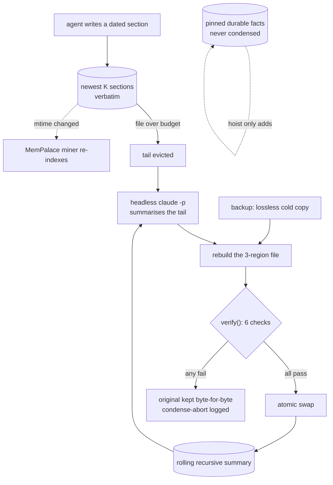

## 1. Executive Summary

Munder Difflin is an Electron desktop harness that runs several terminal coding
CLIs — Claude Code, Codex, Gemini, Grok, Kimi, Qwen, OpenCode and others — as a
team of agents on one machine, messaging each other through an inbox/outbox bus
and drawn as avatars on an office floor. MIT, 666 commits, ~52,000 lines of
TypeScript and TSX. Version 0.4.3, badged by its own README as a working
prototype.

**Its memory is one markdown file per agent, and its own contribution is what
happens when that file gets too big.** Each agent owns
`<harnessHome>/hive/agents/<id>/memory.md`, a sequence of dated
`## <date> — <title>` sections it maintains under a prompt: *"Read your memory.md
and drain every message in your inbox."* That much is the editing surface several
harnesses in this atlas ship.

**Semantic recall is delegated, and the delegate is a separate project.**
`MemoryManager` (293 lines) shells out to the **MemPalace** CLI —
[already in this atlas](../mempalace/) — pointing every agent at one shared
palace and mining each agent's markdown into its own wing, so the team can search
by meaning. It is CLI-only, runs with `--no-llm` heuristics, and the header is
honest about the failure mode: it *"degrades silently to no-op when the
`mempalace` CLI isn't installed — the markdown memory still works."* Nothing in
this tree implements semantic memory; it wires one in.

**`MemoryReflector` is the mechanism this repository owns.** A memory file has
three regions — pinned durable facts under
`## 📌 Durable facts (pinned — never condensed)`, one rolling recursive summary,
and the newest K verbatim sections. On an in-process timer, files past a size or
section threshold have their tail evicted, summarised by a cheap headless
`claude -p`, and folded back in.

**The interesting part is that it does not trust the model it just called.** The
rewrite goes through backup-first, then a `verify()` gate, then an atomic swap,
and the contract is stated as an absolute: *"If any check fails the original file
is left byte-for-byte untouched and the only side effect is a `condense-abort`
log line."* Because the backup is a lossless cold copy taken first, a rejection
is a pure no-op.

**One mark.** `audit_log`, for the hive's append-only `log.jsonl`, which carries
`condense` with old and new byte counts, evicted, kept and hoisted counts and the
backup path, `condense-abort` with a named reason, plus `compact`, `archive` and
`drop`. Withheld and worth naming: scope is *deliberately* absent between agents,
because the hive is meant to share; nothing records a rejected value or a
correction; the pinned region is a retention rule rather than an epistemic state;
and **the one mechanism most worth testing is the one the suite does not
reach**: 110 test files sit under `test/`, three of them on the memory
subsystem, and none of them loads the condenser.

## 2. Mental Model

An agent writes what it learned into its own markdown, in dated sections. Nothing
grades it, supersedes it or removes it. The file grows until a janitor notices,
and then the oldest half is replaced by a summary of itself — recursively, so the
summary is a summary of previous summaries — while a pinned block and the newest
sections pass through untouched.

The state a memory can be in is therefore positional rather than epistemic: which
region of the file it currently sits in.

## 3. Architecture

An Electron app. The memory work runs in the **main process**, and the reason is
recorded rather than assumed: *"launchd-spawned shells are blocked by macOS TCC
from `~/Documents`; only this process has the folder grant. So the loop lives
alongside `memory.start()` — never a cron."* A platform permission model decided
the scheduler.

State is files: per-agent directories holding `memory.md`, `inbox/`, `outbox/`,
`cursor.json` and `settings.json`, plus a hive registry and `log.jsonl`.

## 4. Essential Implementation Paths

- **Condense.** `src/main/reflect.ts` — threshold check, tail eviction,
  `summarize()` via `runHiddenClaude`, `verify()`, atomic swap.
- **Mine.** `src/main/memory.ts` — `mempalace init/mine/search/wake-up`, one
  shared palace, one wing per agent.
- **Log.** `src/main/hive.ts` — the append-only `log.jsonl` and the registry.
- **Read.** `hiveMemory(id)` over the preload bridge returns raw markdown; the
  graph in `src/renderer/src/components/memoryGraph/` extracts topics from it.

## 5. Memory Data Model

There is no schema. A memory is a markdown section with a date and a title, and
its only structural property is which of three regions it occupies. `parseMemory`
splits the file on the pinned heading and the summary heading; everything after
is a list of `Section { heading, body }`.

That is the whole model. No id, no status, no provenance beyond the owning
agent's directory, no validity time, no supersession pointer.

### A third tier, holding what the organisation wrote rather than what the agent did

`src/main/knowledge.ts` and the pure-JS `kg-core.cjs` beneath it add an opt-in
enterprise store: ingest a document, chunk it, index it, and expose `search`,
`list`, `get`, `remove` and `stats`. Agents reach it **out of process** through a
bundled `kg.cjs` CLI rather than through the harness, and the spawn injection
bakes the absolute interpreter and script paths into the prompt for a reason
recorded in the source — `$KG_CLI` is *"POSIX-only and expands to nothing under
cmd.exe/PowerShell"*, so a shell reference would silently produce a broken
command on Windows. The prompt tells the agent when to reach for it: *"When a
task needs that context — company-specific facts, house style, internal
processes — query it instead of guessing."*

**The boundary between this and `memory.md` is the useful part.** The per-agent
markdown holds what an agent observed and wrote; this holds documents somebody
handed the organisation. Nothing an agent learns is written back — the ingestion
surface is in-app over IPC, and the agent's CLI is search, list and get. So the
system keeps a belief store it maintains apart from a corpus index it only reads —
separate stores with separate access paths, which is a cleaner separation than
several systems in this atlas manage with one collection and a `type` column.

**It is not a graph.** The name promises structure the implementation does not
have: `search` tokenizes the query, scans `index.jsonl`, and scores chunks by
term match. The six occurrences of "graph" in `kg-core.cjs` are all in the
docstring naming the feature. That changes nothing about whether it works and it
matters for a reader deciding whether the system carries a relational memory —
it does not.

## 6. Retrieval Mechanics

Two paths, and neither is implemented here. The agent reads its own file because
the prompt tells it to. Cross-agent semantic recall is `mempalace search` and
`mempalace wake-up` against the shared palace — so retrieval quality, ranking and
scoping are properties of [MemPalace](../mempalace/), not of this harness.

A text fallback in `src/renderer/src/realtime/tools.ts` greps every agent's
`memory.md` *"INCLUDING archived"* ones. Between that and the single shared
palace, the design's position on isolation is explicit: there isn't any, on
purpose, because the premise is a hive that knows collectively.

## 7. Write Mechanics

Writes are the agent editing its own markdown. The harness adds two things around
that.

`ensureMineIgnore` drops a `.gitignore` into each agent directory excluding
`settings.json`, `cursor.json`, `inbox/` and `outbox/`, because `mempalace mine`
honours `.gitignore` and those files *"swamp the wake-up digest"*. Keeping
non-memory out of the index by writing an ignore file rather than patching the
miner is a small, correct instinct: it works with the other project's contract
instead of around it.

The condenser is the other. Its budget mirrors the janitor's 128 KB, and its
summarizer is given the pinned block *"for context only — do not rewrite it"*.

## 8. Agent Integration

Terminal CLIs are wrapped rather than replaced, so an agent's memory is whatever
it writes to a file the harness then manages. The memory graph is a read-and-
navigate surface — `hiveMemory` has no write counterpart on the preload bridge —
so a person inspects memory here and edits it, if at all, in their own editor.

## 9. Reliability, Safety, and Trust

**`verify()` is the strongest thing in the tree and it is worth reproducing as a
list**, because it is a good model of what to check when a model rewrites your
store:

1. The rebuilt text parses back into all three regions.
2. Every pinned line survives — a merge may only add.
3. The result is *actually smaller* (`newBytes < oldBytes * 0.95`); a no-op
   condense is a failure.
4. It is non-empty and sane — over 200 bytes, with a non-empty summary.
5. The kept newest sections round-trip **byte-for-byte**.
6. The summary parsed as valid JSON upstream.

Each failure returns a named reason — `structure-missing-region`,
`pinned-line-dropped`, `not-smaller`, `recent-section-altered` — which lands in
the log. The combination of a lossless backup taken first and a rejection that
changes nothing means the worst case of a bad model pass is a log line.

Against that: **nothing exercises it.** `verify()` is exported, pure, and takes
a plain argument object — it is the easiest function in the repository to test,
and no test file loads it. The same holds for `parseMemory`. This is not a
project without a test habit: 110 files under `test/` cover the message bus, the
agent lifecycle and the palace reaper, several of them with the kind of must-not
case a gate like this one calls for. A gate whose whole purpose is to catch a
non-deterministic component is a gate that should be pinned by cases, and this
one is reached only by running the app.

The other risk is quieter. Condensation is lossy by design and recursive: a
summary of summaries drifts, and nothing measures the drift. Pinning is the only
defence, and it is manual.

## 10. Tests, Evals, and Benchmarks

**110 test files** under `test/`, run by `npm run test:focused` —
`node --test test/*.test.cjs`. Three reach the memory subsystem:
`memory-rearm.test.cjs` loads `src/main/memory.ts`, `palace-reap.test.cjs` loads
`src/main/palaceReap.ts`, and sixteen files load `src/main/hive.ts`, which owns
the log.

They are careful tests, and they lead with what must *not* happen.
`palace-reap.test.cjs` opens on the live collection directory, `chroma.sqlite3`
and a near-miss suffix, each asserted never to be a reaping candidate, against
real directory names from an affected palace — including a Finder-style
duplicate, because *"' 2' duplicates DO occur"* — under a comment naming the
stake: *"The whole risk of this feature is deleting something that is not
ours."* `agent-exit-record.test.cjs` puts a placeholder API key in provider
output and asserts it never reaches `log.jsonl`, which the hive commits.

**And none of them touches the condenser.** `verify()` and `parseMemory` live in
`src/main/reflect.ts`; no test file in the repository loads that module. The six
checks in section 9 — including the byte-for-byte round-trip, the one most worth
pinning — are exercised only by running the app.

**Nor does anything run the suite on the way in.** `.github/workflows/ci.yml`
has two jobs: `typecheck`, which runs `npm run typecheck` and a release-link
check, and `build`, which is marked `continue-on-error: true` and so cannot
block. Neither invokes `test:focused`. The suite is held up by convention
instead — a line in `CONTRIBUTING.md` and an unticked box in the pull-request
template reading `npm run test:focused` passes.

Read that against `pr-evidence.yml`, which exists to make precisely this kind of
convention mechanical. It fails a pull request within seconds when the
description carries no before-and-after evidence, comments to say what is
missing, and keeps the waiver behind a maintainer-applied label because
*"a contributor CANNOT grant themselves this."* Its header is explicit that the
point is *"what makes that a rule rather than a request."* This project knows how
to turn a rule into a merge gate. The rule it chose to gate is about
screenshots.

No eval, no benchmark, no paper. Six blog posts under `docs/blog/` and
`blog/src/posts/` discuss agent memory — *"markdown-first agent memory"*,
*"compressing agent memory"*, *"keep agent semantic memory clean"* — and they
are marketing prose about the design rather than evidence about it.

## 11. For Your Own Build

### Steal

- **Verify the rewrite, not the model.** Back up losslessly *first*, rebuild,
  then check the result against properties you can state — regions present,
  protected lines preserved, actually smaller, kept sections byte-identical — and
  swap only if all pass. A rejection then costs nothing.
- **Treat a no-op as a failure.** `!(newBytes < oldBytes * 0.95)` catches the
  case where the model returned something plausible that achieved nothing, which
  a "did it parse" check would pass.
- **Give every rejection a named reason and log it.** `condense-abort` with
  `pinned-line-dropped` is debuggable; a boolean is not.
- **Pin what must never be summarised, and hand it to the summarizer as
  read-only context.** *"For context only — do not rewrite it."*
- **Work with the other tool's contract.** Dropping a `.gitignore` so
  `mempalace mine` skips the inbox is better than forking the miner.
- **Record why the scheduler is where it is.** The macOS TCC note explains a
  design choice that would otherwise look arbitrary to the next maintainer.

### Avoid

- **Shipping an unexercised gate.** The care in `verify()` is real and nothing
  proves it still works; a checker with no negative control looks identical to a
  clean one. The lesson is sharper here than in a project with no tests at all:
  the must-not cases this gate needs already exist a directory away, written for
  the reaper.
- **Gating the convention you can see over the one that can break you.** A
  merge-blocking check for before-and-after screenshots beside a test suite no
  workflow runs is a defensible order of work exactly once.
- **A dependency that disappears quietly.** Semantic recall degrading to a no-op
  when a binary is missing means the difference between "the team can recall by
  meaning" and "it cannot" is invisible at runtime.
- **Compaction as the only lifecycle.** Nothing here can mark a line wrong. A
  false claim in `memory.md` is not corrected; it is eventually summarised, which
  may preserve it in compressed form.

### Fit

Take the condenser's shape if you keep agent memory in markdown and something
will eventually rewrite it — the three-region file plus the verification gate is
about 400 lines and the most transferable idea here.

Take the harness only if you want the whole product: a desktop multi-agent office
with a message bus. Its memory is deliberately shared across agents and has no
correction path, so it suits a single operator running a team on their own
machine and nothing where one agent's material must stay away from another's.

## 12. Open Questions

- `verify()` is pure and exported, in a repository with 110 test files. What
  has to happen for it to get one?
- `test:focused` is named in `CONTRIBUTING.md` and the PR template but in no
  workflow. Is that deliberate — a macOS-runner cost, a flake budget — or has
  nobody noticed the suite is unenforced?
- Condensation is recursive. What does a summary of summaries look like after
  fifty cycles, and does anything sample it?
- Semantic recall vanishes silently without the MemPalace binary. Should the UI
  say which mode the hive is in?
- Nothing can mark a line in `memory.md` wrong. Is a correction meant to arrive
  as a new dated section that contradicts the old one, and if so what resolves
  them at condense time?
- The text fallback searches archived agents' memory. Is an archived agent's
  material intended to stay reachable indefinitely?

## Appendix: File Index

**Memory**
- `src/main/reflect.ts` — the three-region model, the condenser, `verify()`
- `src/main/memory.ts` — the MemPalace wrapper, `ensureMineIgnore`
- `src/main/hive.ts` — the registry and the append-only `log.jsonl`
- `src/renderer/src/components/memoryGraph/` — topic extraction and the graph
- `MEMORY_GRAPH_SPEC.md` — the graph's design contract

**Docs**
- `docs/blog/`, `blog/src/posts/` — six posts about agent memory, prose rather
  than evidence

## Appendix: Recorded Searches

Run from the root of the checkout at the pinned commit. This table did not exist
for the first three readings of this repository, and its absence is why a false
claim about the test suite survived all three.

| Claim | Command | Result at this pin |
| --- | --- | --- |
| ~~The repository contains no tests at all~~ — **false, corrected 2026-09-19** | `ls test/*.test.cjs \| wc -l` | **110**, and `git rev-parse <first-pin>:test` matches this pin, so they were there at every reading that denied them. The claim carried no command in this table for three readings |
| Nothing loads the condenser | `grep -rln "reflect" test/` | Nothing. `verify()` and `parseMemory` are in `src/main/reflect.ts`; the two files matching `verify` elsewhere in `test/` are a comment and a variable named `verifyAt` about an installer digest |
| Which memory modules the suite does load | `grep -rho "loadTs('[^']*')" test/ \| sort \| uniq -c \| sort -rn` | `src/main/hive.ts` in 16 files, `src/main/palaceReap.ts` in 2, `src/main/memory.ts` in 2 |
| No workflow runs the suite | `grep -rn "test:focused" .github/` | Nothing in `.github/workflows/`; the only hits are `CONTRIBUTING.md`, `PULL_REQUEST_TEMPLATE.md` and `CHANGELOG.md` |
| The build job cannot block | read `.github/workflows/ci.yml` | `build` is `continue-on-error: true`; `typecheck` runs `npm run typecheck` and `npm run check:links` and nothing else |
| The memory subsystem did not move since the previous pin | `git diff --stat <prev-pin>..HEAD -- src/main/reflect.ts src/main/memory.ts src/main/hive.ts test/` | Empty across 20 commits; `src/main` and `test` tree hashes are identical at both |
| Nothing records a correction | `grep -rn "correct\|retract\|supersede" src/main/reflect.ts src/main/memory.ts` | Nothing. Condensation is the only rewrite |

## History

**2026-09-19** — [`c7c8921f4491104d342861e32fa214e486442304`](https://github.com/chaitanyagiri/munder-difflin/commit/c7c8921f4491104d342861e32fa214e486442304) — re-pinned 20 commits on. Screened again: no auto-run surface, one build-time execution point, three unpinned surfaces and nothing inside the cooldown; nothing was installed and nothing was run. `src/main` and `test/` are byte-identical to the previous pin by tree hash, so nothing about this system changed — **the reading did.** Three previous readings of this repository stated that it contains no tests. It contains 110, in a top-level `test/` directory, at every one of those pins. The claim was load-bearing: it stood in the executive summary, in the risks field, in section 9 as the counterweight to the condensation gate, and as the whole of section 10.

What replaces it is narrower and checkable. The suite does not load `reflect.ts`, so the finding about the gate being unexercised survives intact — and lands harder, because the must-not cases such a gate needs are already written a directory away for the palace reaper. `negative_eval` is **added** on those cases and on two assertions about the log itself: a placeholder API key in provider output must never reach `log.jsonl`, and a message nobody received must not read as delivered. `audit_log`'s evidence gains the tests that pin the file, and keeps the gap that nothing exercises its condense rows. Also new to the reading: `test:focused` appears in `CONTRIBUTING.md` and the pull-request template but in no workflow, while `pr-evidence.yml` blocks a merge over missing screenshots — the project gates the convention it can see.

This report now carries a Recorded Searches appendix. It had none, which is how a claim nobody could re-run survived three readings.

**2026-09-15** — [`bdf524ecfb319b4f10cebde0c3539a1c75aeea9a`](https://github.com/chaitanyagiri/munder-difflin/commit/bdf524ecfb319b4f10cebde0c3539a1c75aeea9a) — 285 commits on, 2026-09-14, at v0.4.6; most are blog posts and a wave of merged contributor fixes on 6 September. Screened before reading: no auto-run surface, one build-time execution point, three unpinned surfaces and nothing inside the cooldown; nothing was installed or run. `src/main/memory.ts`, `reflect.ts` and `knowledge.ts` are byte-identical to the previous pin, so the condensation gate, the event log and the document store stand as described. The memory-adjacent changes are operational: malformed outbox JSON lines recovered in the hive, a stale head lock cleared, abnormal agent exits recorded to `log.jsonl` as code, signal and a path to a gitignored crash tail, and transcript usage parsed once per file rather than once per querying agent. `audit_log` unchanged.

**2026-08-22** — [`5f7de6e464fda1345ceb6d41548ec72178e7e6d8`](https://github.com/chaitanyagiri/munder-difflin/commit/5f7de6e464fda1345ceb6d41548ec72178e7e6d8) — re-pinned 253 commits and +358,785 lines on, at v0.4.5. Screened again: no auto-run surface, one build-time execution point, three unpinned surfaces and three files inside the cooldown; nothing was installed and nothing was run. `audit_log` unchanged and it is still the only mark.

**The condensation gate is byte-identical apart from one comment.** Every check this report credits — the pinned lines, the byte-for-byte round trip of the newest sections, the backup, the atomic swap and the untouched original on failure — is unchanged at this pin, so the headline mechanism stands without re-derivation.

New in section 6: an opt-in enterprise document store, queried by agents through a bundled CLI whose absolute path is baked into the prompt because a `$VAR` reference *"expands to nothing under cmd.exe/PowerShell"*. It is a corpus index rather than a belief store — agents search, list and get, and ingestion is in-app only — and despite its name it holds no graph: `search` tokenizes and scores chunks out of `index.jsonl`.

Worth recording as a fact about the project's own practice: two commits in this range are titled *"the scope-filter comment keeps the reasoning, drops the count"* and *"the ledger comment keeps the reasoning, drops the figures"*, and a third makes before-and-after evidence mandatory in pull requests. A codebase deliberately stripping figures out of comments that will outlive them is doing to itself what this atlas has to do to its own pages.

**2026-08-17** — [`6a09318dafbf99f4c28e8af760a2353fce34c771`](https://github.com/chaitanyagiri/munder-difflin/commit/6a09318dafbf99f4c28e8af760a2353fce34c771) — First reading, at 666 commits. Screened first: 0 auto-run surfaces, 1 build-time execution path (an npm `postinstall` running `electron-rebuild` and two node-pty patch scripts), 2 manifests inside the seven-day cooldown; nothing was installed, built or run. One mark, `audit_log`. Semantic recall is delegated to the MemPalace CLI, which has [its own report](../mempalace/), so retrieval and scoping belong there. Withheld here: no scope key between agents by design, no rejected-value record, no epistemic state, and no tests of any kind — including for `verify()`, which is exported and pure. No paper.
