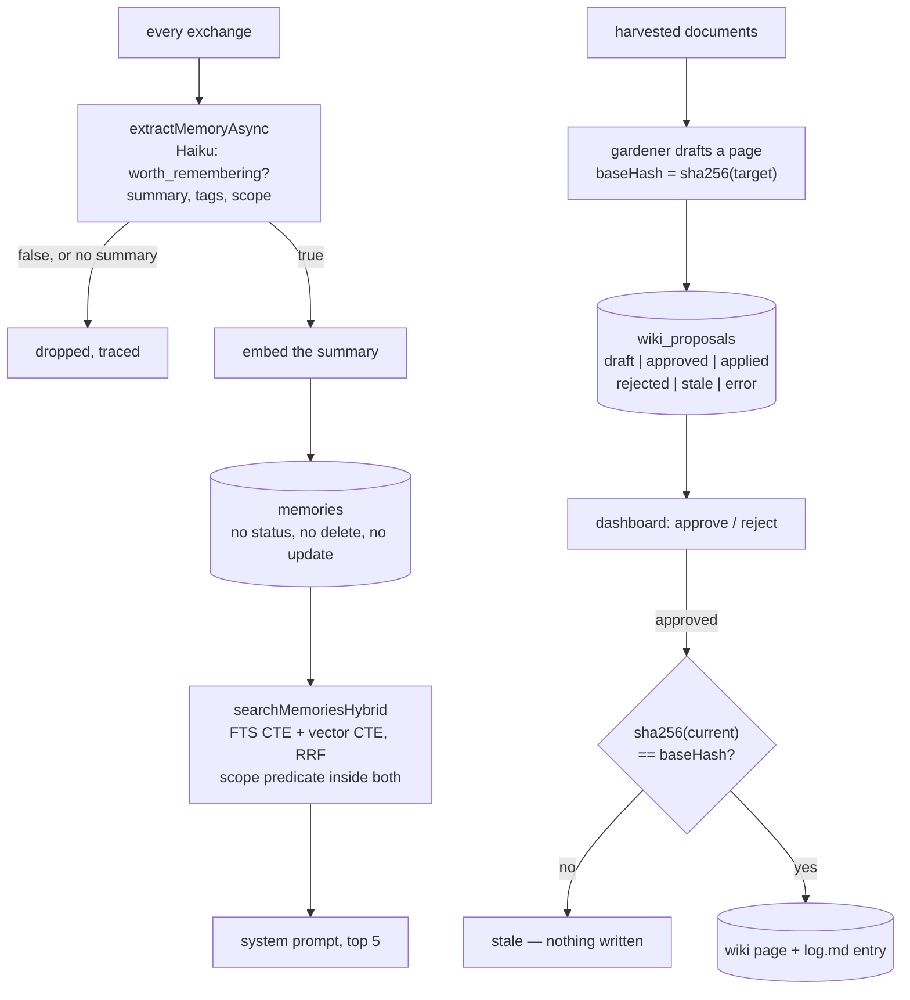

## 1. Executive Summary

Muninn is a self-hosted assistant platform: several bots in one Node process,
each with its own persona, MCP tools and conversation history, reachable from
Telegram, Slack and a web chat, backed by one Postgres database with pgvector.
MIT, 623 commits since 7 February 2026, roughly 241,000 lines of TypeScript
across 285 test files, 65 migrations, and a dashboard with more than ten pages.
No paper, no citation file.

It holds durable knowledge in two tiers, and **the interesting thing is that they
were built to opposite standards.**

The **memory tier** is automatic. After every exchange, `extractMemoryAsync`
fires a background Haiku call with a fixed prompt — *"decide if it contains
information worth remembering for future conversations"* — which returns
`worth_remembering`, a one-sentence summary, tags, and a scope of `personal` or
`shared`. If the flag is true and a summary came back, the summary is embedded
and the row is inserted. There is no queue, no confirmation, no status field and
no threshold. There is also, in the whole of `src/db/memories.ts`, no `DELETE`
and no `UPDATE` of content: once a model has decided something about you is
worth keeping, nothing in this repository can take it back.

The **wiki tier** is deliberate, and every control the memory tier lacks is
present there. The gardener harvests documents, clusters them, drafts a full
Markdown page, and writes it to `wiki_proposals` with a status of `draft`. A
person approves or rejects it in the dashboard. Applying it is a
compare-and-swap: `apply.ts` refuses with `stale` unless
`sha256(current) === proposal.baseHash`, because *"the target file must be
exactly as it was at draft time"*. A partial unique index over
`status IN ('draft','approved')` prevents two live proposals for the same topic,
`resolved_at` records when it stopped being open, and every applied page appends
a reverse-chronological entry to the wiki's own `log.md`.

The third thing worth the report is that **Muninn measures its own retrieval**,
which almost nothing in this atlas does. `src/benchmarks/retrieval.ts` computes
hit@k, recall@k and reciprocal rank per query and aggregates them to hit-rate,
recall@k and MRR across three targets; `benchmark_retrieval_runs` persists each
run with the aggregate metrics *and* the per-query breakdown, *"so a regression
can be traced back to the individual query that moved."* The caveats are real and
stated below, but the shape is the one the atlas's benchmarks page keeps asking
for.

The risk is the asymmetry. The tier a model writes without asking is the one with
no review, no correction and no deletion; the tier a model drafts and a person
reads is the one with a state machine, a queue and a concurrency check. That is
backwards from where the risk actually sits — a drafted page is visible before it
lands, and an extracted memory is not visible until it has already been injected
into a prompt.

## 2. Mental Model

A durable claim in Muninn becomes a belief along one of two paths, and they have
different numbers of gates.

Down the memory path there is one gate and a model holds it. The extraction
prompt draws the line in prose — *"Worth remembering: facts about the user,
preferences, decisions, project details… NOT worth remembering: greetings,
thanks, simple factual lookups, small talk"* — and the same call also assigns
the scope that will decide who can retrieve the result, on a definition of
`shared` as *"general knowledge useful to anyone — company processes, team
decisions, technical standards"*. Everything downstream trusts that
classification. Nothing re-examines it, and no state records that it was ever
provisional. A memory stops being a belief only if the Postgres row is deleted by
hand.

Down the wiki path there are three gates and two of them are not the model's. The
drafter proposes; a person approves or rejects; and the filesystem itself gets a
veto at apply time, because a target file that changed since drafting sends the
proposal to `stale` rather than overwriting the change. The third gate is the
unusual one — it is not about whether the claim is true but about whether the
world it was written against still exists.

The honest summary is that Muninn knows how to govern a write and applies that
knowledge to the write a human was already watching.

## 3. Architecture

One Node process runs every bot. Postgres with pgvector is the only datastore:
`memories`, `messages`, `threads`, `goals`, `scheduled_tasks`, `watchers`,
`traces`, `wiki_proposals` and about two dozen more, over 65 migrations with an
`init.sql` for fresh deploys and a schema-drift guard between them. Embeddings
are local — Transformers.js at 384 dimensions — so the vector arm costs no API
call. Extraction and goal detection use Haiku through a shared
`runHaikuExtraction` wrapper that traces every call and records cost in
`haiku_usage`.

Standing this up means Postgres with the `vector` extension, a model credential
per bot, and whatever channel tokens you want. The gardener wants a document
source to harvest and a directory to write the wiki into. Everything else —
voice, watchers, the browser extensions — is optional and off unless configured.

The operational cost worth naming is that memory is on the critical path of every
turn: `prompt-builder.ts` awaits `searchMemoriesHybrid` after the parallel
history and embedding fetches, and logs the split — `db`, `embed`, `search` — on
every build, which is a good habit and the only per-turn memory latency
measurement in this corpus that ships turned on.

## 4. Essential Implementation Paths

**Extraction** — `src/memory/extractor.ts`. One prompt, one Haiku call, fire and
forget. The result gate carries a fixed defect in a comment: *"A memory worth
keeping must have a summary, but tags are optional — gating on `!result.tags`
silently dropped keepable memories whenever Haiku omitted the field. Default to
`[]` instead."* A missing embedding does not block the write; it warns that the
row *"will not appear in semantic search"* and saves anyway.

**Storage** — `db/init.sql`. `memories` carries `search_vector TSVECTOR` and
`embedding vector(384)`, a GIN index on the first and an HNSW cosine index on the
second, plus a trigger that rebuilds the tsvector from
`summary || content || tags` on every insert or update, so the lexical index
cannot drift from the row.

**Retrieval** — `src/db/memories.ts`, `searchMemoriesHybrid`. One statement: an
`fts` CTE ranked by `ts_rank` and a `vec` CTE ranked by `embedding <=> $3`, each
capped at 30, joined `FULL OUTER` on id and scored
`1.0/(60 + f.rank) + 1.0/(60 + v.rank)`. Textbook reciprocal-rank fusion, in the
database, with the scope predicate written into both CTEs.

**Injection** — `src/ai/prompt-builder.ts`. Top 5 memories, formatted and pushed
onto the system prompt after the persona and the user identity, alongside active
goals, scheduled tasks and recent alerts.

**Drafting and applying** — `src/gardener/`. `harvest`, `cluster`, `draft`,
`triage`, `wire`, `retire`, `apply`, each with a test file beside it.
`runner.ts` computes `baseHash` only when the target already exists, with the
reason in a comment: otherwise *"apply would always report it stale."*

**Measuring** — `src/benchmarks/retrieval.ts` and `retrieval-fixtures.ts`, run by
`scripts/retrieval-eval.ts`, persisted by migration 053.

## 5. Memory Data Model

A memory is `id, user_id, bot_name, content, summary, tags[], search_vector,
embedding, source_message_id, scope, created_at`. `content` is the raw exchange —
`User: …\nAssistant: …` — and `summary` is the model's one-sentence distillation;
both feed the tsvector, only the summary is embedded. `source_message_id`
references `messages(id)`, so a memory can be traced to the turn that produced
it, which is more provenance than most extraction-based stores in this atlas
keep.

`scope` is `CHECK (scope IN ('personal', 'shared'))` and it is the only
classification on the row. There is no confidence, no status, no validity
interval, no `updated_at` and no `deleted_at`. `created_at` is record time and
event time at once, which is why `bitemporal` is withheld: there is only one
axis, and no read path accepts an as-of parameter.

A wiki proposal is the richer record: `topic_key` as *"stable slug for dedup
across runs"*, `kind` of concept/entity/source/synthesis, `mode` of create or
update, `target_path`, `base_hash`, the full `draft` body including frontmatter,
`source_docs` as JSONB, a `rationale`, and `status` with `resolved_at`. A drafted
page therefore carries what produced it, what it would replace, and what the
world looked like when it was written. The extracted memory carries a foreign key
and a timestamp.

## 6. Retrieval Mechanics

Reciprocal-rank fusion with `k = 60`, both arms capped at 30 candidates, the
fused list cut to the caller's limit — 5 for a chat turn, 8 for a scheduled
briefing. An optional `tags && $n::text[]` overlap filter is spliced into both
CTEs with a comment explaining the per-branch parameter indexing and noting that
when omitted *"the SQL is byte-identical to the pre-tags query"*.

**The scope predicate is inside each arm rather than wrapped around the join, and
that is the detail worth copying.** A filter applied after a fusion would let one
arm spend its 30 candidate slots on rows the other arm may not return, quietly
shrinking recall for the caller who is allowed to see least. Written into both
CTEs, each arm's budget is spent inside the boundary.

The lexical arm uses `plainto_tsquery`, which is AND-semantics: every content word
in a query must match. That makes the arm precise and brittle, and the eval
fixtures say so out loud — the golden queries are worded so *"EVERY content word
in a query must stem-match the fixture's summary/content/tags text"*, which is a
constraint on the benchmark that comes straight from a constraint on the
retriever.

Failure behaviour is asymmetric in the right direction. A row saved without an
embedding is excluded from the `vec` CTE by `embedding IS NOT NULL` and still
reachable through FTS; `getMemoriesWithoutEmbeddings` exists to find and backfill
them. The system degrades to one arm rather than to none.

## 7. Write Mechanics

**Writes do not block the reply.** `extractMemoryAsync` returns `void` and the
Haiku call resolves later, so the user's turn is never waiting on the memory
decision. The lag before a memory is retrievable is one background model call
plus one embedding — seconds — and there is no batching, no debounce and no
consolidation pass. Nothing rewrites the store.

**There is no correction path of any kind for a memory.** No update of content, no
supersession pointer, no expiry, no archival, and no delete — the module that
owns the table exposes save, search, list, count and an embedding backfill, and
nothing else. Two consequences follow that a reader should weigh before adopting
this. A fact the model got wrong stays in the index and keeps being fused into
prompts at whatever rank it earns. And because extraction runs on *every*
exchange with no dedup against what is already stored, a subject the user returns
to repeatedly accumulates near-duplicate rows that compete for the same five
slots.

**The wiki write is the governed one**, and its guard is a compare-and-swap
rather than a lock: draft, record `sha256(target)`, and refuse at apply time if
the file moved. `apply.ts` also degrades deliberately — a failed `log.md` append
is a warning, not a rollback, because *"a log-write hiccup must not undo the page
write — the page is the source of truth."* That is the right precedence and it is
worth noting that it makes the log lossy by design.

## 8. Agent Integration

Memory reaches the model as text in the system prompt, not as a tool. There is no
`remember` tool and no memory MCP server, so a model cannot query the store
mid-turn, cannot decline a memory it thinks is wrong, and cannot record that it
was wrong. Each bot gets its own MCP tools for everything else.

The retrieval is per bot *and* per user: `bot_name` is a first-class column on
`memories` with its own composite indexes, so two bots in the same process
sharing one database do not share personal memory, and `shared` scope is scoped
to a bot as well. `bot_default_user` and `role_overrides` handle the identity
edges.

The dashboard exposes memory read-only — a memories panel, a per-user breakdown
with personal and shared counts and recent tags, and a search. The one place a
person can change what the system believes is the gardener queue, which is about
wiki pages.

## 9. Reliability, Safety, and Trust

**Scope — awarded**, per section 6, and it is enforced in the place that is easy
to get wrong.

**Human review — awarded, on the wiki tier.** The asymmetry in the routes is
deliberate and correct: reject is *"deliberately NOT guarded — it flips a DB
status and mutates no wiki"*, while approve is a compare-and-swap with a comment
naming the failure it prevents. A review surface that guards the direction which
touches the filesystem, and stays out of the way of the direction that does not,
has thought about what the guard is for.

**Trust state — awarded, on the same tier and no other.** `draft → approved →
applied`, with `rejected` and `stale` as terminal states and `resolved_at`
recording the transition, is candidate/verified/rejected with an extra state for
"the world moved". The `memories` table has no status column, which is the whole
finding: the mark describes the tier where a human was already in the loop.

**Tombstone, bi-temporal, audit log — no.** There is no rejected-value record and
nothing to build one from, since nothing is ever rejected. `created_at` is one
axis. And `activity_log` is a message log — its `type` is CHECK-constrained to
`message_in`, `message_out`, `error`, `system`, `slack_channel_post` — so it
records conversation traffic and not memory mutations. The nearest thing to an
audit of durable knowledge is the wiki's `log.md`, which is a Markdown file the
apply step appends to and treats as droppable.

**The privacy shape follows from the extraction prompt.** A model is asked to
classify each exchange as `personal` or `shared`, and a `shared` classification
makes the row retrievable by every user of that bot. That decision is made once,
by a model, with no confirmation and no way to revise it afterwards — a
misclassified personal fact is visible to the whole workspace and there is no
command that moves it back. For a system whose README describes Slack and
Telegram deployments with multiple users, this is the failure worth guarding
first, and the guard would be small: the scope column already exists and an
update statement would be the whole fix.

## 10. Tests, Evals, and Benchmarks

285 test files. No paper and no citation file. I ran nothing.

**The retrieval eval is the part that distinguishes this repository.**
`computeQueryMetrics` produces `hitAtK`, `recallAtK = matched/expected` and
`reciprocalRank = 1/firstRank` per query; `aggregateMetrics` means them into
hit-rate, recall@k and MRR, overall and per target. `runRetrievalEval` runs three
targets — a knowledge base, `memories`, and research citations — and migration
053 persists every run: started and finished timestamps, a status enum, the
target filter, the query count, the aggregate `metrics` JSONB and the `per_query`
JSONB. The migration comment is unusually candid about its own status:
*"Intentionally NOT added to `db/init.sql`: like `benchmark_runs` this is
experimental tooling that fresh deploys don't carry… Migration-only is the whole
truth for this table."*

Three design decisions in the fixtures are worth lifting. The memory fixtures
carry **fixed UUIDs** because `saveMemory` mints random ones and *"the golden set
can name them as `expected_doc_ids`"*. Seeding **refuses a non-`*_test`
database** unless `--allow-live-seed` is passed. And when the fixtures are absent
the memory target is **skipped rather than scored as a miss** — an eval that
would otherwise report a setup failure as a retrieval failure, which is the
specific way a golden set starts lying.

**And the honest limits, which the repository half states itself.** The memory
target is three synthetic fixtures and three golden queries. The queries are
written so every content word stem-matches the fixture text, because the FTS arm
is AND-semantics — so the lexical arm is being asked a question constructed to be
answerable. A golden set built to satisfy the retriever it tests measures that the
plumbing is connected, not that recall is good. That is a real thing to measure
and it is not the thing the metric names suggest. The knowledge-base and research
targets point at *"real Jira/Confluence docs that already live in the running
knowledge base"*, so those rows are not reproducible outside the author's
deployment, and no committed result exists for any target.

The memory unit tests carry the mark: a personal memory for one user and another
for a second user with the same query term, a search as the first user, and an
assertion that every row returned belongs to them — with the shared-scope case
directly beneath it as the positive control.

## 11. Patterns Worth Stealing

### Steal

**Put the scope predicate inside every arm of a fused query, not around the
join.** Two CTEs each capped at 30 and filtered independently means the candidate
budget is spent inside the boundary. Filtering after the fusion silently costs
recall to exactly the caller with the narrowest permissions.

**Score your retrieval against a named golden set and persist the per-query
breakdown.** Aggregates tell you something regressed; the per-query JSONB tells
you which query moved. Migration 053 is forty lines and it is the difference
between a benchmark and a dashboard number.

**Skip a target whose fixtures are missing rather than scoring it zero.**
`hasSeededMemoryFixtures` is the guard, and without it an empty database reports
as a retrieval failure — the exact way a benchmark starts reporting the harness
instead of the system.

**Refuse to seed fixtures into a database whose name does not end in `_test`.**
One string check, and the failure it prevents is synthetic rows in a user's real
memory.

**Compare-and-swap against a hash of the file you drafted from.** `baseHash` at
draft time, `sha256(current)` at apply time, `stale` when they differ. Any system
whose agent proposes an edit to something a human can also edit needs this, and
almost none of them have it.

**Guard the direction that mutates and leave the other alone.** Approve is a CAS;
reject *"flips a DB status and mutates no wiki"* and is unguarded. Symmetric
guards on asymmetric operations are friction without safety.

**Log the per-turn memory latency split.** `db`, `embed`, `search`, on every
prompt build, in the normal log line. It is the only shipped measurement of
memory's cost on the critical path in this corpus.

### Avoid

**Do not let one model call be the only gate on a durable write about a person.**
`worth_remembering` and the personal/shared classification are decided together,
once, by a small model, and both are unappealable. The scope half of that
decision is an access-control decision made by a language model.

**Do not ship a store with no delete.** `src/db/memories.ts` has no `DELETE` and
no content `UPDATE`. Everything else in the design assumes the extraction was
right.

**Do not extract on every exchange without deduplicating.** Nothing compares a
candidate against what is already stored, and the retrieval budget is five rows.

**Do not read a golden set's metrics as recall quality when the queries were
written to match.** The number is real; what it measures is that the pipeline is
wired.

### Fit

This suits one person or a small team self-hosting an assistant they trust, on
hardware they own, who want hybrid retrieval that works without an embedding API
and are willing to correct the store with `psql`. It is a lot of working
software — three chat platforms, three model backends, watchers, scheduling,
goals, a wiki gardener and a dashboard — and the parts are wired together with
more care than the size suggests.

It fits badly wherever a memory about a person has to be correctable by that
person, and worse wherever `shared` means what it says. The gap is not depth of
engineering — the wiki tier proves the engineering is there — it is that the
governance was built for the tier a human was already watching. A team adopting
this should treat "add delete and rescope to the memory tier" as the first patch,
not a later one.

## 12. Antipatterns / Risks

- **A model assigns the access-control label.** `scope` decides who can retrieve
  a row and is set by the same Haiku call that decides whether to store it, from
  a prose definition. There is no confirmation, no review, and no command that
  changes it afterwards.
- **No deletion, at all.** A wrong memory, a duplicate memory, and a memory that
  should never have been shared are all permanent as far as this codebase is
  concerned.
- **Duplicates compete for the injection budget.** Extraction runs per exchange
  with no dedup, retrieval injects five rows, and a recurring topic produces
  near-identical summaries that can occupy several of them.
- **A memory saved without an embedding is silently half-indexed.** The warning
  says it *"will not appear in semantic search"*, the row is saved, and nothing
  retries automatically — `getMemoriesWithoutEmbeddings` exists but must be
  invoked.
- **The eval's memory target is three rows.** Any figure computed over three
  queries moves in thirds, and the aggregate metric names — recall@k, MRR — carry
  an authority the sample size does not.
- **`log.md` is a lossy record by design.** The apply step degrades a failed log
  append to a warning, correctly prioritising the page write, which means the
  wiki's history has gaps that nothing records.
- **The benchmark tables are migration-only and excluded from the drift guard.**
  Stated deliberately, and it means a fresh deploy cannot run the eval that the
  repository's best measurement lives in.

## 13. Build-vs-Borrow Takeaways

Borrow the fusion SQL — it is one statement, it needs no service, and the scope
placement inside both CTEs is the part to copy exactly. Borrow the eval scaffold:
fixed fixture ids, a test-database guard, skip-when-absent, and per-query
persistence are four small decisions that together make a golden set worth
trusting.

Borrow the gardener's apply contract for any agent that edits files a human also
edits. `baseHash` plus `stale` is fifteen lines and it is the difference between
an agent that proposes and an agent that overwrites.

Do not borrow the memory lifecycle. The absence of delete is not a young-project
gap here — the same repository built a six-state review queue for its other tier —
it is a choice about which writes deserved governance, and it went the wrong way.

## 14. Open Questions

- Why did the review machinery stop at the wiki? The proposal table, the status
  enum and the dashboard queue would transfer to extracted memories with little
  change, and the extraction path is the one with no human in it.
- What does the retrieval eval score today? No run output is committed, so the
  numbers exist only in whatever database the author runs.
- Does anything reconcile a `shared` memory that was misclassified? No path was
  found, and the column is not exposed for update anywhere in the tree.
- `source_message_id` is a foreign key to `messages`. If a message is deleted, is
  the memory it produced still traceable, and does anything cascade?

## 15. Appendix: File Index

| Path | What it holds |
| --- | --- |
| `src/memory/extractor.ts` | The extraction prompt, the `worth_remembering` gate, and the tags-optional fix |
| `src/db/memories.ts` | Save, both search arms, the RRF statement, and the absent delete |
| `src/db/memories.test.ts` | The cross-user negative case and its shared-scope positive control |
| `db/init.sql` | `memories`, `wiki_proposals`, `activity_log`, and the tsvector trigger |
| `db/migrations/008-memory-scope.sql` | The personal/shared column |
| `db/migrations/053-benchmark-retrieval-runs.sql` | Per-run metrics and per-query breakdown, and why the table is migration-only |
| `src/benchmarks/retrieval.ts` | hit@k, recall@k, reciprocal rank, and the aggregation |
| `src/benchmarks/retrieval-fixtures.ts` | Fixed-id fixtures, the golden queries, the test-database guard, skip-when-absent |
| `src/ai/prompt-builder.ts` | Top-5 injection and the per-turn latency split |
| `src/gardener/apply.ts` | The `baseHash` compare-and-swap and the `log.md` degradation |
| `src/gardener/runner.ts` | Where `baseHash` is computed, and why only for existing targets |
| `src/db/wiki-proposals.ts` | The status enum and the partial unique index over live proposals |
| `src/dashboard/routes/wiki-gardener-routes.ts` | The approve/reject surface and the guarded-versus-unguarded asymmetry |

## History

**2026-08-20** — [`6cc58ebdf2f82707488a8ed7f021b20987bef925`](https://github.com/RuneLind/muninn/commit/6cc58ebdf2f82707488a8ed7f021b20987bef925) — first reading. Screened before anything was read: one auto-run surface (`.claude/settings.json`), no build-time execution, one unpinned surface, one file inside the seven-day cooldown; nothing was installed, no database was started and no test was run. `db/init.sql` and all 65 migrations were read before any absence claim about storage was written, which is how the `wiki_proposals` state machine and the `benchmark_retrieval_runs` table were found. Marks: `scope_enforced` and `negative_eval` on the memory tier, `trust_state` and `human_review` on the wiki tier — the split is the report's central finding rather than an accounting detail.
