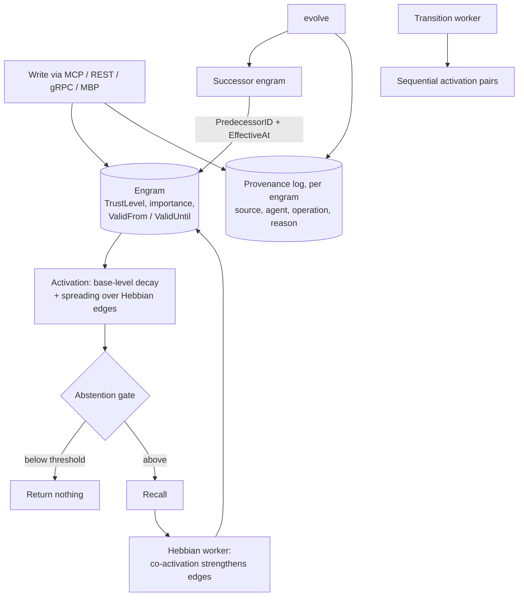

## 1. Executive Summary

MuninnDB is a 299,740-line Go memory engine — 995 source files, one binary, no
dependencies to install — serving MCP, REST, gRPC and its own binary protocol
from a Pebble key-value store. Its claim is that memory *"strengthens with use,
fades when unused, and pushes to you when it matters"*, and the unusual thing is
where that lives: the decay curve, the Hebbian weights, the activation model and
the confidence update are **engine-native**, in `internal/cognitive` and
`internal/engine/activation`, not layered over a general store by an application.

Three mechanisms make it worth the read regardless of whether you would deploy
it.

**Provenance is a first-class append-only record with an actor and a verb.**
`ProvenanceEntry` carries a timestamp, a `SourceType` — human, LLM, document,
inferred, external, working-memory promotion, or synthetic — an `AgentID` that
looks like `user:mj` or `ollama:llama3.2` or `consolidation-worker`, and an
`Operation` drawn from a fixed vocabulary: create, evolve, update-relevance,
update-meta, update-trust, stamp-valid-until, merge, promote. A `Details` payload
carries the predecessor id, the caller's stated reason, and the valid-time
boundary the change took effect at.

**And the comment on that struct is the best piece of schema writing in this
corpus.** It explains why the record is JSON, that an entry written before
`Details` existed decodes with `Details == nil` — *"absent, never a zero-value
pretending to be data"* — and names the only two changes that would require a
real format version: renaming or retyping an existing field, or making a new
field load-bearing for correctness rather than informational. Most systems here
discover their format rules by breaking them.

**Trust is a label and time is two axes.** `TrustLevel` is a discrete enum —
unset, verified, inferred, external, untrusted — described in the source as a
*provenance confidence label* that feeds use-time effective importance rather
than being the ranking. `EffectiveAt` is explicitly *"distinct from Timestamp,
which is when the write happened"*, and there is a `stamp-valid-until` operation
beside `ValidFrom` and `ValidUntil` on the engram. That is bi-temporality
implemented because the design needed it, not bolted on.

**One caveat belongs at the top rather than in a licence footnote.** The README
states that a **provisional patent was filed on 26 February 2026 over the core
cognitive primitives** — engine-native Ebbinghaus decay, Hebbian learning,
Bayesian confidence, semantic triggers — and the licence is Business Source
License 1.1. This report describes the mechanisms because they are published and
readable; whether a reader may implement them is a question this atlas cannot
answer and the reader should not assume from a code-grounded description.

## 2. Mental Model

An engram is written, decays, is strengthened by co-activation, and is retrieved
by activation rather than by similarity alone.

**Writing records who and why.** Every create or change appends a provenance
entry under the engram's own key, so the audit is per-memory rather than a global
stream.

**Correction is supersession with a named predecessor.** The `evolve` operation
writes a successor, records `PredecessorID` on it — *"the storage-side mirror of
the RelSupersedes edge, recorded on the successor so the successor's own audit
trail answers 'what did this replace'"* — carries the caller's `Reason`, and
stamps `EffectiveAt` as the successor's valid-from and the predecessor's
valid-until in one move.

**Contradiction is a property of edge types, precomputed.** `contraMat` is a
64×64 boolean matrix built at init: `RelSupports` contradicts `RelContradicts`,
`RelPrecededBy` contradicts `RelFollowedBy`, and `ContradictionSeverity` scores a
pair. Detecting a contradiction is a table lookup rather than a model call.

**Forgetting is an API verb.** `Forget` and `BatchForget` exist on gRPC and the
binary protocol, `handleDeleteEngram` on REST, and `handleListDeleted` will tell
you what went — deletion is something the system expects to be asked about
afterwards.

The loop from recall back into edge weights is the design: use changes
reachability, and the trust label stays out of it.

## 3. Architecture

One Go binary, Pebble underneath, `~/.muninn` for state, and an uninstall
instruction in the README that is two commands. Packages are split by concern —
`engine`, `storage`, `cognitive`, `episodic`, `consolidation`, `scoring`,
`index`, `query`, `provenance`, `audit`, `auth`, `backup`, `replication`,
`metrics`, `plugin`, `mcp`. Replication and backup as first-class packages is
rare in this corpus: most local-first memories treat durability as the user's
problem.

`.claude/deep-review/` holds dated design documents — `2026-07-28-importance-two-strength-decay-design.md`,
`2026-08-01-decay-time-normalization-design.md`, `2026-07-28-mcp-trigger-stream-design.md`
— so the reasoning behind the tuning decisions is in the tree beside the code.

The screen reported **two auto-run surfaces**: `.claude/settings.json` and
`.claude/hooks/`. That is a memory system shipping agent-harness hooks in its own
repository, which is exactly the surface the screen exists to name; nothing here
was executed, and a reader cloning this tree into a Claude Code workspace should
read those two files before opening it.

## 4. Essential Implementation Paths

- **Provenance** — `internal/provenance/types.go` (the entry, the source
  vocabulary, the `Details` payload and the format-evolution comment) and
  `store.go` (`Append`).
- **Trust** — `internal/storage/types.go` (`TrustLevel` on the engram),
  `internal/storage/engram.go:416` `UpdateTrust`.
- **Decay and Hebbian learning** — `internal/cognitive/decay.go`, `hebbian.go`,
  `hebbian_ltp.go`, with clock-skew tests beside them.
- **Contradiction** — `internal/cognitive/contradict.go`, the 64×64 matrix and
  `ContradictionSeverity`.
- **Transitions** — `internal/cognitive/transition.go`, a worker recording
  sequential activation pairs for predictive activation.
- **Activation** — `internal/engine/activation/`, including ACT-R and an
  abstention gate.
- **Deletion** — `Forget`/`BatchForget` in `internal/transport/grpc/server.go`
  and `internal/transport/mbp/server.go`; `handleListDeleted` in the REST server.
- **Scope** — the `ws [8]byte` workspace prefix through `internal/storage/`, and
  vault checks in `internal/transport/mbp/`.

## 5. Memory Data Model

An engram is ULID-keyed under a workspace prefix and carries importance, two
strengths, a `TrustLevel`, valid-from and valid-until, and typed edges. The
two-strength design has its own dated design note, which is the right place for a
tuning decision to be argued.

`TrustLevel` earns the `trust_state` mark on the rubric's terms: it is a discrete
label with `untrusted` and `verified` at opposite ends, stored as a field, and
the source describes it as feeding *use-time effective importance* — so
reachability and standing are separate quantities rather than one number doing
both jobs, which is the failure this atlas records most often on the trust side.

The filtering half is worth following to where it is written, because the answer
is better than the mark requires. `ExcludeUntrusted` is a per-vault opt-in, a
`*bool` whose nil means include everything
(`internal/auth/plasticity.go:87-89`), resolved once per request
(`:639-640`). Retrieval checks it directly
(`internal/engine/activation/engine.go:2025-2028`). The interesting part is what
happens *after* retrieval, where results get added by later passes. The trust
flag rides the request struct rather than the meta filters, so
`PassesMetaFilter` cannot enforce it — and rather than repeat the check at each
injector, the project collects lifecycle, meta, trust, structured predicate and
lease visibility into one `visibilityGate.Admits`
(`internal/engine/visibility_gate.go:141-145`) that every injector constructs:
entity boost (`engine_entity_boost.go:242`, `:251`), supersession
(`engine_supersession.go:124`), the version-head walk
(`engine_version_head.go:151`), annotation (`annotation.go:137`) and the general
injector (`engine.go:3147`). The comment above the boost pass names the bug that
taught them (`#569`): an `ExcludeUntrusted` vault getting flagged-unreliable
memory re-injected through any shared rare entity. A predicate that has to be
remembered at five call sites eventually is not; a predicate whose four
companions fail with it is remembered by construction.

Valid time is genuinely separate from record time. `EffectiveAt` in the
provenance `Details` is documented as the valid-time boundary, `Timestamp` as
when the write happened, and `stamp-valid-until` is its own operation in the
vocabulary.

## 6. Retrieval Mechanics

Activation rather than similarity: a base-level term that decays, spreading
activation across edges whose weights the Hebbian worker maintains, and an
**abstention gate** that can return nothing. A retrieval that is allowed to
decline is the mechanism this atlas's [gate the expensive path](../../patterns/gate-the-expensive-path/)
page argues for, and the test directory around it —
`abstention_gate_measure_test.go`, `admission_test.go`, `clockskew_test.go`,
`cognition_trial_arms_test.go` — suggests it is treated as a measured component
rather than a threshold someone picked.

Semantic triggers invert the direction: the store can push a memory when it
becomes relevant, rather than waiting to be asked. `docs/semantic-triggers.md`
and a dated design note cover the stream design.

## 7. Write Mechanics

Writes are explicit and synchronous; the derivation is what runs in the
background. Hebbian potentiation, transition recording, consolidation, decay and
confidence each have a worker with its own lifecycle, and the transition worker's
comment states its pattern is copied from the Hebbian one — small, and a sign of
a codebase that reuses its own shapes rather than inventing per-worker.

Every write appends provenance. That is the property the rest of the design rests
on, and it is why `audit_log` is earned here rather than argued: the record is
append-only, per engram, in the system's own store, with an actor and a verb.

## 8. Agent Integration

Four transports from one binary — MCP for agents, REST for tooling, gRPC for
services, and a binary protocol for its own SDKs — plus a web console and
language SDKs. The MCP surface is the one most readers will touch, and the
trigger stream is what distinguishes it from the usual tool-call-and-wait shape.

## 9. Reliability, Safety, and Trust

**Scope is enforced at two levels and tested at the outer one.** A workspace
prefix is a parameter of the storage API rather than a filter applied afterwards,
and vaults sit above it at the transport layer. `internal/transport/mbp/vault_scope_test.go`
commits the cases that matter: `TestHello_Token_VaultMismatch_Rejected`, and
`TestNoneSession_LockedVault_AllOpsRejected` — a session established against the
public default vault cannot touch a locked one, asserted across operations rather
than on one endpoint. That earns `negative_eval` on the boundary that every other
guarantee here depends on.

**Provenance answers who, what and why.** Source type, agent id, operation verb,
free-text note, predecessor, reason, effective time. Very few systems in this
atlas record the *reason* a change was made as a first-class field.

**What is missing is a rejected-value tombstone.** Deletion is a real API verb,
supersession names its predecessor, and nothing is keyed on the *value*, so a
re-extraction of a forgotten claim lands as new. Given how much of this design is
already correct — an audit that would show it, a trust label that could hold
`untrusted`, a contradiction matrix — the gap is narrower here than in most
systems that lack it.

## 10. Tests, Evals, and Benchmarks

Test files sit beside the code throughout, and the naming shows what the project
considers fragile: clock skew appears in both the decay and the activation
suites, `hebbian_read_fault_test.go` and `hebbian_callback_persistence_test.go`
cover the worker's failure paths, `contradict_test.go` the matrix, and
`cognition_trial_arms_test.go` an experimental arm comparison. `internal/bench`
exists in-tree.

No published benchmark number appears in the README, and none is claimed against
another system.

## 11. Patterns Worth Stealing

### Steal

**Write the format-evolution rules into the struct comment.** Which changes are
additive, what absence must mean, and the exact two changes that would need a
version byte. It costs a paragraph and it is the difference between a schema that
evolves and one that accretes compatibility shims.

**Record the reason for a change, not just the change.** `Details.Reason` is the
caller's justification and `PredecessorID` is on the successor, so a memory's own
audit answers *what did this replace and why* without a join.

**Make contradiction a property of edge types.** A precomputed matrix over
relation types costs nothing per check and catches the structural contradictions
a model call would be asked about.

**Let retrieval abstain, and test the gate as a measured component.**

**Keep the trust label out of the ranking it informs.** `TrustLevel` feeds
effective importance; it is not the score.

**Put every result-path predicate in one admission function, and make the
injectors call it.** The trust filter, the lifecycle check, the meta filter, the
structured predicate and lease visibility live together in
`visibilityGate.Admits`, and five injection paths construct that gate rather
than re-deriving any of them. The alternative is what the comment on the entity
boost describes losing: a flagged-unreliable engram re-entering an
`ExcludeUntrusted` vault through a shared rare entity.

### Avoid

**Do not ship agent-harness hooks in a repository people will clone into their
own harness** without saying so at the top of the README. `.claude/settings.json`
and `.claude/hooks/` are the first thing a screening tool flags and the last
thing a reader expects from a database.

**Do not stop at supersession.** Everything needed for a value-keyed refusal is
present — the audit, the label, the matrix — and nothing keys on the value.

### Fit

This is the most infrastructure-shaped memory in the atlas: replication, backup,
four transports, a keyspace design, workers with lifecycles. If you want a memory
*service* several agents share and you are comfortable with a BSL licence and an
asserted patent over its primitives, it is the most complete implementation of
cognitively-motivated decay and activation here.

It is the wrong choice if you need to build on those primitives freely, or if you
want a store you can read end to end in an afternoon — 300,000 lines is a
commitment, and the patent notice means the mechanisms are documented rather than
donated.

## 12. Antipatterns / Risks

- **A provisional patent over the primitives**, asserted in the README, beside a
  BSL 1.1 licence. Readable, not freely reusable, and the reader should treat
  both as live constraints.
- **Agent-harness hooks in the repository**, which execute in a reader's harness
  rather than in the project's.
- **No value-keyed refusal**, so a forgotten claim can return through extraction.
- **Cognitive parameters are numerous** — two strengths, decay, Hebbian rates,
  activation thresholds — and the dated design notes argue them well without any
  committed measurement of the defaults against alternatives.

## 13. Build-vs-Borrow Takeaways

Borrow the provenance record's shape and its comment, the contradiction matrix,
and the separation of trust label from effective importance. Those three are
independent of the engine and of any patent claim over decay and Hebbian
learning, which a reader should assess separately.

## 14. Open Questions

- What exactly does the provisional patent cover, and how should an
  implementer of the atlas's decay-and-reinforcement pattern read it?
- Is the deleted-engram listing a tombstone in waiting — it already knows what
  went — and would keying it on a normalized value be a schema change or a new
  keyspace?
- Are the decay and activation defaults measured anywhere, or argued in the
  design notes and then shipped?

## 15. Appendix: File Index

| Path | Role |
| --- | --- |
| `internal/provenance/types.go` | Provenance entry, source vocabulary, `Details`, the format-evolution comment |
| `internal/cognitive/decay.go`, `hebbian.go`, `hebbian_ltp.go` | Ebbinghaus decay and Hebbian potentiation |
| `internal/cognitive/contradict.go` | 64×64 relation-type contradiction matrix and severity |
| `internal/cognitive/transition.go` | Sequential activation pairs for predictive activation |
| `internal/engine/activation/` | ACT-R activation, admission and the abstention gate |
| `internal/storage/engram.go` | Engram record, `UpdateTrust`, workspace-prefixed keys |
| `internal/transport/mbp/vault_scope_test.go` | The committed cross-vault refusals |
| `.claude/deep-review/` | Dated design documents for decay, strengths and the trigger stream |

## History

**2026-09-19** — [`34b505f46496cfc2929edc54f4301d6a9c2f42ab`](https://github.com/scrypster/muninndb/commit/34b505f46496cfc2929edc54f4301d6a9c2f42ab) — `trust_state` re-tested at an unchanged pin against the narrowed line. Every anchor held and the mark is better earned than the record said. The previous evidence stopped at the opt-in — `ExcludeUntrusted` is a `*bool` whose nil means include everything — and did not follow the flag to where it is tested. Retrieval checks it at `internal/engine/activation/engine.go:2025-2028`. After that, results are added by later passes, and the flag rides the request struct rather than the meta filters, so `PassesMetaFilter` cannot enforce it; the comment beside the check says so. Instead lifecycle, meta, trust, the structured predicate and lease visibility are collected into one `visibilityGate.Admits` (`internal/engine/visibility_gate.go:141-145`) that five injection paths each construct: entity boost, supersession, the version-head walk, annotation and the general injector. The comment above the boost pass names the defect that taught them (`#569`) — an `ExcludeUntrusted` vault getting flagged-unreliable memory re-injected through any shared rare entity. This atlas keeps finding scope and trust predicates that hold on the main read path and leak on a second one; here the second paths cannot leak without losing four other checks at the same time, which is the structural answer rather than the vigilant one. Re-read from a fresh clone; nothing was installed and no suite was run.

**2026-09-15** — [`34b505f46496cfc2929edc54f4301d6a9c2f42ab`](https://github.com/scrypster/muninndb/commit/34b505f46496cfc2929edc54f4301d6a9c2f42ab) — second reading, three commits on and 4,346 lines. Screened again: two auto-run findings, the project's own Claude Code hooks — node scripts under `.claude/hooks/` that guard drift and a contributor memory ledger on tool use, session start and compaction; nothing inside the cooldown; nothing installed or run. All five marks were re-tested at the producer and hold, and each now carries the evidence record it had been asserted without. Two limits surfaced in writing them and belong beside the marks: untrusted engrams are skipped only when `ExcludeUntrusted` is configured, and provenance is submitted to its worker *best effort — drops if full*. The addition since the previous pin is COG-29: a generated contradiction store (`internal/storage/contradicts_gen.go`) and a debt readout that surfaces declared, unresolved contradictions at session start — so a known conflict is shown rather than waiting to be retrieved — plus a fix fencing retroactive scans during a vault clear.

**2026-08-07** — [`fc16e786970c7ef31a6e5244cfdca7980a341551`](https://github.com/scrypster/muninndb/commit/fc16e786970c7ef31a6e5244cfdca7980a341551) — first reading. Screened before reading: **2 auto-run surfaces** (`.claude/settings.json` and `.claude/hooks/`, agent-harness hooks shipped in the repository), 2 build-time execution paths and 5 unpinned dependency surfaces, none inside the seven-day cooldown. Nothing was built or run. Licensed BSL 1.1, with a provisional patent asserted in the README over the core cognitive primitives as of 26 February 2026; both are recorded as caveats on use rather than as reasons not to analyse published code.
