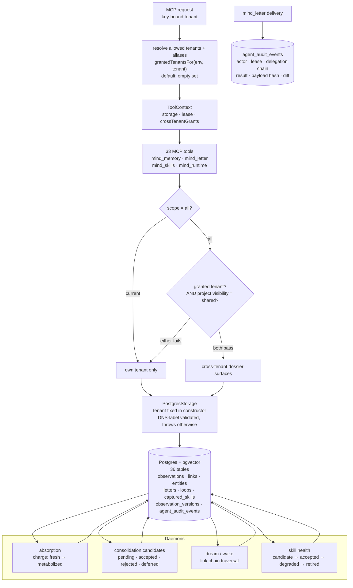

## 1. Executive Summary

MUSE Brain is the memory service behind a pair of companion agents — one that
knows the person, one that knows the craft — deployed as a Cloudflare Worker
over Postgres, with thirty-six tables, thirty-three MCP tools and a set of
daemons that absorb, consolidate and dream.

Two marks, both about the boundary between the two minds.

**The tenant is not a parameter.** The Postgres client takes it in its
constructor, validates it against DNS-label rules and throws otherwise, and
every one of the file's statements binds that field. There is no call shape
that reads another tenant; there is only a different client.

**A cross-tenant read has to clear two gates, and both default closed.** A
deployment-level allowlist says which tenants may reach which, defaulting to
empty — *"no tenant may cross-read another's data without an explicit grant"* —
and a per-project `visibility` flag says whether a particular record is
shareable at all. The comment at the lookup says both must pass, and cites the
tenant-key audit that produced the rule.

**The test for that is a three-case table with one moving part.** A private
cross-tenant project is excluded; a *shared* one is still excluded when no
grant is configured; the same shared one appears only when a grant is present.
The exclusion cannot be the fixture being empty, and the inclusion cannot be
the gate being absent.

What is not here is a state that withholds. The schema is full of lifecycle
vocabularies — captured skills run candidate, accepted, degraded, retired; a
skill-health daemon moves them — and the list query takes status as an optional
filter that defaults to null. A retired skill is returned unless the caller
asks otherwise.

One thing to know before reading the source: the licence is **CC BY-NC-SA
4.0**. That is a non-commercial copyleft applied to a piece of infrastructure,
and it covers the code as well as the prose.

## 2. Mental Model

An observation is the atom: content plus *texture* — a JSON blob carrying mood,
somatic markers and charge — plus a territory, tags, entity tags and an
embedding. Observations link to each other directionally, and links carry a
last-activated stamp so the dream and wake passes can walk chains.

Around that sit the other twenty-odd tables: entities and relations, letters
between the two minds, open loops, desires, tasks, project dossiers, captured
skills. The word that recurs in the schema is *charge* — an observation moves
from fresh to active to processing to metabolized, which is the system's model
of having sat with something.

The scope model is two-layer and worth stating plainly, because it is the part
the marks rest on. A tenant is a mind. A project is shareable or not. A
deployment decides which minds may see each other's shareable things.

## 3. Architecture

## 4. Essential Implementation Paths

- **Tenant binding:** `muse-brain/src/storage/postgres.ts` (constructor and
  every statement), `src/storage/sqlite.ts` for the key-value backend.
- **Cross-tenant policy:** `muse-brain/src/tenant-config.ts`,
  `src/index.ts`, `src/tools-v2/memory.ts`, `src/tools-v2/runtime.ts`.
- **Schema:** `muse-brain/migrations/001_initial_schema.sql` through
  `017_agent_house_trust_layer.sql`.
- **Skill lifecycle:** `muse-brain/src/tools-v2/skills.ts`.
- **Audit:** `muse-brain/src/tools-v2/comms.ts`.
- **Tests:** `muse-brain/test/mind-memory-unified.spec.ts`.

## 5. Memory Data Model

Thirty-six tables is a lot, and the interesting thing about them is how
consistently the tenant appears: it is the first or second column almost
everywhere, and it is in the leading position of most composite indexes.

Two tables look like history and are worth separating. `observation_versions`
holds a numbered revision per observation with the content, the texture and a
change reason — but the only production caller creates a version with the
reason `texture_edit`, so it is an edit trail for one field rather than for the
record. And the key-value backend deletes an observation's versions when the
observation goes, so the history does not outlive its subject there.

`agent_audit_events` is the other, and it is built properly: actor agent,
lease, platform, session, run, a delegation chain, the operation and tool, the
resource, a result from allowed, denied, succeeded, failed or shadow, a reason,
a payload hash and a diff. See section 9 for why it does not carry the mark.

## 6. Retrieval Mechanics

Vector similarity over pgvector with full-text and trigram lookup beside it,
link traversal and co-surfacing, then reranking by recency, novelty and stored
retrieval hints. There is a separate reliability migration and a hints index,
and a `search_mode` on the result that says which path answered — a keyword
lookup identifies itself as one rather than being presented as semantic recall.

Scope enters before any of that. The tenant is already fixed by the time a
query is built; the only variable is whether a `scope: "all"` lookup may add
another tenant's shareable projects, which needs the grant.

## 7. Write Mechanics

Tools write observations, letters, loops, desires and skills. Daemons then work
over them: absorption moves an observation through its charge phases and
accumulates processing notes, consolidation proposes merges into a candidate
table with a pending/accepted/rejected/deferred status, and a skill-health
daemon moves captured skills along their own lifecycle.

Letters are the cross-tenant write, and they are the one operation that leaves
an audit row.

## 8. Agent Integration

An MCP server with thirty-three tools running on Cloudflare Workers, a
TypeScript CLI, a runner with a speech-to-text service, lease-based agent
identity with revocation, and deployment scripts. Provider-neutral core with
optional Claude and Codex backends.

## 9. Reliability, Safety, and Trust

**Scope enforced — awarded**, on the constructor binding plus the two gates.
The shape worth copying is the binding: making the tenant a field of the client
rather than an argument of the query removes a whole class of call site where
someone forgets to pass it.

**Negative eval — awarded**, on the three-case grant table and the paired
ranking exclusions.

**Trust state — withheld.** The vocabularies exist and are real: a captured
skill is candidate, accepted, degraded or retired, a review writes the
transition, and a daemon watches health. But the list query takes status as an
optional filter defaulting to null, so a retired skill is returned unless the
caller excludes it. That is a state used for reporting and available for
filtering, not a state that withholds — the same distinction that separates a
label from a gate.

**Tombstone — withheld.** Nothing is keyed on a rejected value. A rejected
consolidation candidate is a row with a status; nothing consults it when the
next absorption pass proposes the same merge.

**Audit log — withheld, and this one is close.** `agent_audit_events` is
designed for exactly this mark — a diff, a payload hash, an actor, a lease, a
delegation chain, and a result vocabulary that includes `shadow`. It has one
production writer: letter delivery, from `mind_letter`. Creating, editing or
deleting an observation writes nothing to it, and the call is guarded by a
feature check so a backend without the method silently skips. A table this well
specified, with one operation reaching it, is a trust layer for agent-to-agent
messaging rather than a mutation log for memory — and it is the most obvious
thing in the repository to extend.

**Human review — withheld**, and the reason is a recurring pattern rather than
an oversight. `mind_skills` has a `review` action, and its `decision` — one of
accepted, degraded, retired — and its `reviewed_by` label are both parameters
on the tool the agent itself calls. A reviewer name the reviewed party types is
not an actor check. The same applies to the proposal and consolidation review
verbs.

**Bi-temporal — withheld.** Timestamps are plentiful — created, last accessed,
last surfaced, last activated — and all of them are record time. Nothing tracks
when a thing was true apart from when it was written.

**The licence is a limitation in its own right.** Creative Commons
Attribution-NonCommercial-ShareAlike 4.0 applies to the whole repository,
code included. Non-commercial is a use restriction rather than a copyleft
term, and Creative Commons does not recommend its licences for software, so
anyone evaluating this for commercial use should treat adoption as a legal
question rather than a technical one. Reading it, learning from it and citing
it — which is what this report does — is not restricted.

## 10. Tests, Evals, and Benchmarks

**No paper of its own**, but the bibliography is unusual enough to describe.
`docs/BIBLIOGRAPHY.md` maps sixteen arXiv papers to the specific mechanism each
one produced — a survey of self-evolving agents to the captured-skill
lifecycle, a paper on emotionally salient tags to the iron-grip memories and
charge phases, an institutional-governance framework to the cross-tenant
territory restrictions — and then names six places the implementation claims to
go beyond the literature. Whether each mapping holds is a separate question;
writing the map at all is rare, and it makes the claims checkable rather than
atmospheric.

Thirty-nine test files under Vitest, split into unit and integration configs.
They run against storage doubles rather than a live Postgres, which is why the
scope mark's evidence names the tool layer rather than the SQL: the 146 tenant
clauses in the Postgres backend are not exercised by the suite.

There is a benchmark harness with adapters and a master plan document. The
results directory contains a `.gitkeep` and nothing else, so no benchmark
result is committed.

## 11. For Your Own Build

- **Bind the scope key to the client, not to the query.** A tenant that lives
  in the constructor cannot be omitted at a call site, and the validation runs
  once instead of everywhere.
- **Make a cross-boundary read need two independent yeses**, one from the
  deployment and one from the record, and default both to no.
- **Change one variable per isolation test.** The private case, the shared case
  without a grant, and the shared case with one are three tests that together
  prove what any one of them alone cannot.
- **Say which retrieval path answered.** A `search_mode` of `keyword_lookup` on
  the result stops a fallback being read as semantic grounding.
- **If you build an audit table with a diff and a delegation chain, wire it to
  the writes.** The schema is the easy half.

## 12. Open Questions

- `agent_audit_events` carries everything a memory-mutation log needs and one
  operation writes to it. Is extending it to observation writes planned, and
  would the key-value backend's whole-collection rewrite still be append-only
  enough to trust?
- `observation_versions` has a `change_reason` column and a single caller
  passing `texture_edit`. What happens to content edits — is the version row
  intended to cover them?
- The skill list defaults to no status filter. Is a degraded skill meant to
  keep surfacing until a caller excludes it, or is the default the thing the
  skill-health daemon was built to make unnecessary?

## Appendix: File Index

- Tenant binding and statements: `muse-brain/src/storage/postgres.ts`
- Key-value backend: `muse-brain/src/storage/sqlite.ts`
- Cross-tenant policy: `muse-brain/src/tenant-config.ts`,
  `muse-brain/src/index.ts`
- Tool surface: `muse-brain/src/tools-v2/memory.ts`, `tools-v2/skills.ts`,
  `tools-v2/comms.ts`, `tools-v2/runtime.ts`, `tools-v2/propose.ts`
- Schema: `muse-brain/migrations/001_initial_schema.sql` …
  `017_agent_house_trust_layer.sql`
- Leases: `muse-brain/src/security/leases.ts`
- Bibliography: `muse-brain/docs/BIBLIOGRAPHY.md`
- Tests: `muse-brain/test/mind-memory-unified.spec.ts`,
  `test/mind-letter-edges.spec.ts`, `test/leases.spec.ts`

## History

**2026-09-19** — [`a5a98ae77f45af7bae83067828d7ae366b6f073a`](https://github.com/falcoschaefer99-eng/muse-brain/commit/a5a98ae77f45af7bae83067828d7ae366b6f073a) — first reading, at the head of `main`. Screened with `scripts/screen_repo.py` before anything was read: one build-time execution path in a package's publish hook, four unpinned dependency surfaces across the three workspaces and the speech-to-text service, and three lockfiles unchanged for seventeen days; no instruction file addressed to a reading agent. Nothing was installed, built or run. Two marks. The reading covered the thirty-six-table schema across all seventeen migrations, the tenant binding in both storage backends, the cross-tenant grant resolution and its two call sites, the tool surface's memory, skills, comms and runtime modules, the audit and version tables and their callers, and the isolation tests; the limbic modules, the runner and the CLI were read as context rather than as subject. Five marks are withheld with reasons in section 9, and the two worth repeating are `audit_log`, where a well-specified mutation table has exactly one production writer and it is letter delivery, and `human_review`, where the skill registry's review decision and reviewer label are parameters on the tool the agent itself calls. The licence — CC BY-NC-SA 4.0 on the code — is recorded under Known Limitations as standing policy.
