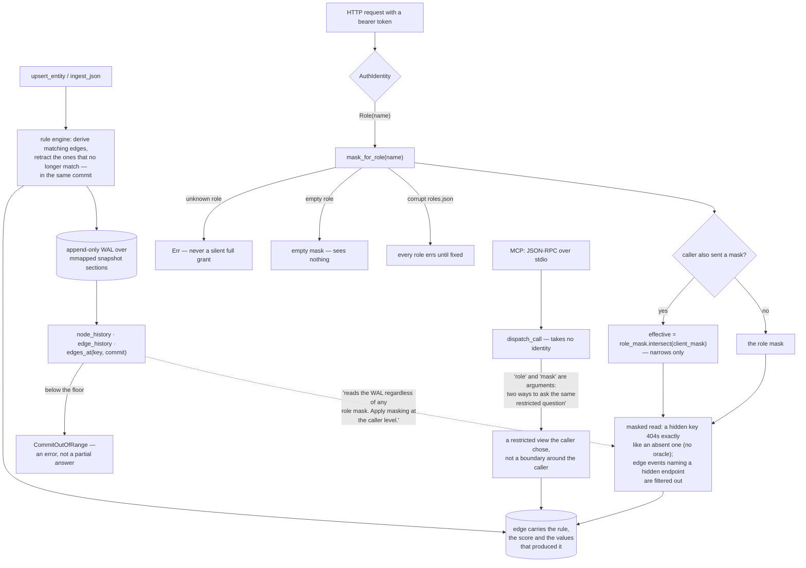

## 1. Executive Summary

mushroomdb is "[t]he graph that stays true — and knows who's allowed to see it":
an embedded Rust graph database, MIT or Apache-2.0, version 0.6.8 and explicitly
pre-1.0 alpha, 177,137 lines across ten crates with 2,328 test functions,
distributed on crates.io, npm and PyPI, reachable as a Rust library, a Python
module, a sidecar, or fifteen MCP tools.

Its central idea is that a relationship is a schema declaration rather than a
write. Declare a rule once, and every subsequent write derives the matching
edges, maintains them, and **retracts** them when the rule stops matching — each
edge carrying the rule, the score and the property values that produced it. So
`explain_association` answers why two nodes are related with the evidence rather
than an assertion, and deleting a rule "answers by retracting every edge it
owns". A stale derivation disappears in the commit that invalidates it, not in a
sweep afterwards, which is the failure mode of nearly every system here that
derives edges from an LLM pass.

The part that earns most of the marks is the access control, and it is the most
carefully reasoned RBAC this atlas has read at this scale. The never-widen rule
is three sentences at the top of `roles.rs`:

> "Empty role (no keys, no labels) = empty mask = sees nothing. Unknown role on a
> request = `Err` (never silently grant full access). Corrupt `roles.json` at
> open = roles poisoned … returns `Err` for any role name until the file is fixed
> and the DB re-opened."

Every one of the three resolves to deny. `NodeMask::intersect` exists for exactly
one purpose — "to enforce the never-widen rule when a role token also supplies a
client mask: `effective = role_mask.intersect(&client_mask)`" — so a caller's own
mask can only narrow. The MCP namespace argument carries the same contract in its
description: it "[i]ntersects with 'role' and 'mask' — it can only narrow what
they already allow".

Two details show the thinking went further than the happy path. A hidden key
returns the same 404 as a key that does not exist, under a comment saying why:
"Hidden keys must respond identically to absent keys (no oracle)." And the
history handler filters edge events whose other endpoint is hidden, because "[a]
role token must not learn about hidden nodes via edge history events" — history
being precisely where this kind of masking is usually forgotten, and where the
core module warns it must be added: "this reads the WAL regardless of any role
mask. Apply masking at the caller level."

Even the file format version numbering is an access-control decision. A
`roles.json` using `visible_where` or `namespaces` is deliberately not loadable
by an older binary, because such a binary "would resolve a narrowed role to its
full label set, so an unrecognised version poisons instead, which denies rather
than over-grants". Very few projects think about what their own previous release
would do with a file it half-understands.

**The enforcement and the advertised surface are not the same surface.** The MCP
server is JSON-RPC over newline-delimited stdio, and `dispatch_call` takes no
identity at all — `role` is an argument the caller passes, described in
`tool_query` as one of "[t]wo ways to ask the same restricted question". For a
local subprocess holding the database directory that is coherent: there is
nothing to authenticate against, and the process could read the files anyway. But
it means the tagline's second clause describes the HTTP deployment with
role-bound bearer tokens, while the fifteen-tool MCP surface the README leads
with is a way to preview a restricted view rather than a boundary around one. A
reader wiring an agent to the MCP server should not read `query(role: "support")`
as a control.

The third mark is for the mask tests, which are the shape this atlas asks for and
rarely finds: `masked_query_hides_nodes_and_their_edges` asserts the hidden node
returns zero rows by key lookup and then, four lines later, that the unmasked
query returns all three — and `masked_var_expand_blocks_hidden_intermediate` and
`masked_shortest_path_blocks_hidden_intermediate` do the same for a hidden node
in the middle of a traversal, each running the unmasked case first so the
emptiness is attributable to the mask rather than to a query that stopped
matching.

What is not here is anything epistemic. An edge has a score and a rule; it has no
status, no provenance class, no validity window and no notion of a claim somebody
made. Time travel is `edges_at(key, commit)` over transaction time, bounded by a
horizon the API reports honestly, with `CommitOutOfRange` for a read below it —
version history rather than a second axis.

## 2. Mental Model

A **rule** is the relationship. Edges are its output.

**Retraction** is not deletion; it is the rule no longer holding.

A **mask** is a set of nodes. It only ever gets smaller.

A **hidden node** and a **missing node** answer identically, on purpose.

## 3. Architecture

| Crate | Role |
| --- | --- |
| `core-api` | The public database, roles, masks, history, `what_if` (67,460 lines) |
| `cli` | Install, doctor, ingest-git, the skill and hooks (27,804) |
| `server` | HTTP with role tokens, and the stdio MCP surface (23,362) |
| `core-rules` | Rule evaluation, firing and retraction with provenance (17,803) |
| `core-query` | Query planning, traversal, the masked view (16,363) |
| `core-storage` | WAL, snapshots, the overlay-over-base views (10,873) |
| `sim-harness`, `core-bench` | Simulation and benchmarks |

## 4. Essential Implementation Paths

`crates/core-api/src/roles.rs:1-36` — the never-widen rule and the version
bargain, in one header.

`crates/server/src/http.rs:2020-2070` — masking a history read, including the
part everybody forgets.

`crates/core-rules/src/engine.rs:83-104` — a fire or a retract, captured during a
commit.

`crates/core-api/tests/mask.rs:15-175` — what a negative test looks like when it
has a control.

## 5. Memory Data Model

Entities with properties; edges mostly derived. The storage view is an
overlay-over-base arrangement where a V8 snapshot's archived columns and CSR
topology are read zero-copy from the mmap and post-snapshot changes accumulate in
an overlay, with "[t]ombstones in the overlay mask deleted-from-base entries" —
a storage-level tombstone, not a memory-level one.

## 6. Retrieval Mechanics

Cypher-shaped queries, similarity, hybrid search, variable-length expansion and
shortest path, all running against a `GraphView` whose `mask` field is an
`Option` — `None` meaning every node is visible. That default is the engine's
internal one; on the HTTP path the mask arrives from the token, and the mask
tests pin what happens when it does not: an empty mask hides everything, and
unknown keys inside a mask are ignored rather than widening it.

## 7. Write Mechanics

A write fires the rules, and the rule engine diff-applies the desired edge set
against provenance, with a comment guarding the subtle case — edges still
supported "for some other source — are not mistakenly retracted". That is the
hard part of incremental derivation and it is handled explicitly.

## 8. Agent Integration

`npx mushroomdb install` writes a skill, an MCP server and session hooks in one
command, and the four-call flow — upsert, rule, find, explain — is a genuinely
small surface for a graph database. The deprecation note is unusually direct: the
previous coding-assistant positioning, seven tools and three hooks, is deprecated
in 0.6.4 and removed in 0.7, "[i]t still works and is still tested".

## 9. Reliability, Safety, and Trust

Covered above. The one thing to carry away for a deployment: the RBAC guarantees
described here are properties of the HTTP server with role-bound tokens. Embedded
as a library or driven over stdio, the caller holds the whole graph, and every
mask is advisory.

## 10. Tests, Evals, and Benchmarks

2,328 test functions, including `rbac.rs`, `mask.rs`, `write_scopes.rs` and an
adversarial RBAC-writes suite, plus a simulation harness and a benchmark crate.
Nothing was built or run for this reading.

## 11. For Your Own Build

Make every failure of the permission lookup deny. Unknown role, empty role,
corrupt file — three different bugs, one outcome, written at the top of the
module so nobody has to infer it.

Make hidden and absent indistinguishable. A different error for "you may not see
this" is an oracle for what exists, and it takes one comment to remember.

Remember the history endpoint. Masking the read path and forgetting the audit
path is how the second one becomes the leak, and this project handles it by
saying in the core that it does not, and handling it at the edge that can.

Let the derivation retract itself. If a rule made an edge, the rule not matching
should unmake it in the same commit; anything else leaves a graph asserting
things its own rules no longer support.

And ask what your previous release does with your next file format. Refusing to
load is the right answer when the unknown field is one that narrows.

## 12. Open Questions

Whether an embedder other than the HTTP server masks history. The core points the
obligation at the caller; the HTTP layer discharges it, and nothing enforces that
a third embedder does.

How far back history reaches in practice. Snapshot truncation bounds the live
WAL, archives extend the floor, and the pruning policy was not traced.

What replaces the deprecated door in 0.7. The seven code-graph tools and three
hooks are removed next release, and the association surface is what remains.

## Appendix: File Index

| Path | What to read it for |
| --- | --- |
| `crates/core-api/src/roles.rs:1-36` | Three failures, one outcome, and a version that refuses |
| `crates/core-api/src/mask.rs:94-107` | The intersection that cannot widen |
| `crates/server/src/http.rs:2025-2058` | No oracle, and a masked history |
| `crates/server/src/mcp.rs:204-237` | A dispatch with no identity in it |
| `crates/core-rules/src/engine.rs:83-104`, `:1045` | Fire, retract, and what must not be retracted |
| `crates/core-api/tests/mask.rs:15-175` | Negative assertions with their controls |

## History

**2026-09-16** — [`4896a895fc2a7b6d11c80196a5c227e535611754`](https://github.com/MatthewSherlin/mushroomdb/commit/4896a895fc2a7b6d11c80196a5c227e535611754) — first reading, at a commit dated 16 September 2026. Screened before opening, from a shallow clone: thirty-four files scanned, two auto-run surfaces, two build-time execution points, four unpinned surfaces and twenty-four dependency files inside the seven-day cooldown. Nothing was installed, built or run.
