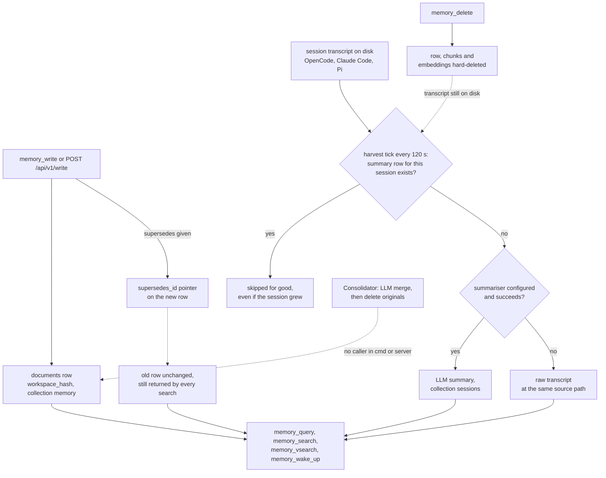

## 1. Executive Summary

nano-brain is a self-hosted Go server that gives coding agents two things over
MCP: a code graph (symbols, callers, impact, route flows) and a document memory
in PostgreSQL. The memory half holds notes an agent writes with `memory_write`,
and summaries of finished OpenCode, Claude Code and Pi sessions, which a
harvester writes every 120 seconds. Both are retrieved by a hybrid of BM25 and
pgvector fused with reciprocal rank fusion and a recency decay.

What is notable is the operational care on the write and search paths: a note
and its chunks commit in one transaction, the two search legs run in parallel
and degrade independently, and the server refuses to bind beyond loopback
without authentication. The workspace boundary has committed isolation tests
with positive controls.

What is weak is that nothing in the store can be believed less than anything
else. `supersedes` is a pointer that no read path consults. A deleted session
summary comes back on the next harvest. The default search tool's OR fallback
silently drops the time range the caller asked for.

The code-intelligence half is the larger share of the tree and is not memory:
it indexes source that the filesystem already holds, and nothing it stores
could turn out to be a false belief. This report covers the `memory` and
`sessions` collections and the machinery that serves them, and mentions the
code graph only where it shares a table or a ranking step.

**Two mechanisms are written and never reached.** `internal/intelligence`
holds an LLM consolidator that clusters memory documents above 0.85 cosine,
asks a model whether to merge, writes the merged note and deletes the
originals. `internal/harvest/automemory.go` extracts `DECISION:` and
`LESSON:` lines from sessions into discrete memory documents. Neither has a
caller outside its own package, and the `intelligence.enabled` config key has
no reader.

One mark: `negative_eval`, on the workspace-isolation suite. Section 9 names
the six withheld and why.

## 2. Mental Model

A memory is a row in `documents`. It becomes a belief the moment it commits:
there is no candidate state, no model judgement on the agent-written path and
no status column. The row carries a `workspace_hash`, a `collection`, tags,
free JSON metadata, and timestamps (`migrations/00001_initial_schema.sql:14-27`).

**Three producers write into the same table.** `memory_write` stores an
agent's note, default collection `memory` (`internal/mcp/tools.go:1476-1652`).
The harvester stores a session as `summary://<source>/<id>` in collection
`sessions`, either an LLM summary or, when no summariser is configured or it
fails, the rendered transcript itself (`internal/harvest/claudecode.go:114-210`,
`internal/summarize/persist.go:65-135`). The watcher indexes source files into
`code`. All three share one retrieval pipeline, so a question about a past
decision is ranked against source files and transcripts alike.

**A correction is a pointer, not a state change.** `memory_write` accepts
`supersedes` as `#<uuid>` or a source path and stores the target's id in
`supersedes_id` (`tools.go:1529-1549`). The superseded row keeps its content
and its chunks. The only readers of the column are `memory_get`, the REST get
and multi-get handlers, and the document listing, which also computes
`superseded_by_id` (`internal/storage/queries/documents.sql:40-46`). No search
query and not `memory_wake_up` filters on either, so an agent searching after a
correction receives both values, ranked by relevance with a recency tilt.

**A memory dies by hard delete, and a harvested one does not stay dead.**
`memory_delete` removes the row, cascading to chunks and embeddings
(`tools.go:1407-1474`). A harvester decides whether to summarise a session by
checking only whether `summary://claude/<id>` exists (`claudecode.go:121-156`),
so deleting that row causes the next tick to summarise the transcript again
while the file is on disk. The comment on the delete test calls the superseded
row a *"permanent tombstone document"*; it is keyed on a record and blocks
nothing.

**A session's summary is written once.** The same presence check means a
session is never re-summarised after its first successful write. The OpenCode
SQLite harvester skips sessions updated within 10 minutes
(`opencode_sqlite.go:161`, `:314-316`); `claudecode.go` and `pi.go` have no
such check, so a Claude Code session picked up mid-flight is stored from its
partial transcript and never refreshed.

## 3. Architecture

One Go binary, `nano-brain`, runs an Echo HTTP server that exposes the REST API
under `/api/v1`, MCP over streamable HTTP at `/mcp` and over SSE at `/sse`
(`internal/server/routes.go:27-144`). The same binary is the CLI, which talks to
the running server over HTTP. PostgreSQL 17 with pgvector holds everything;
the schema is 29 goose migrations embedded in the binary (`migrations/`), and
queries are sqlc-generated from `internal/storage/queries/*.sql`.

Background work runs in the server process. A harvest runner ticks every
`intervals.session_poll` seconds, default 120 (`internal/config/defaults.go:55`,
`cmd/nano-brain/main.go:571`). An embedding queue processes chunk ids it is
handed and rescans `embed_status = 'pending'` every five minutes
(`internal/embed/queue.go:29`, `:185-240`). A file watcher debounces changes
and re-indexes code collections. Embeddings come from Ollama by default
(`nomic-embed-text`, 768 dimensions) or VoyageAI; summarisation, query
preprocessing, HyDE and reranking each take an OpenAI-compatible endpoint and
are off by default (`defaults.go:70-128`).

Authentication is optional: Basic or bearer tokens, compared in constant time,
with the principal recorded as the literal `"token"` for any bearer
(`internal/server/middleware/auth.go:43-103`). `checkBindSafety` refuses a
non-loopback host unless auth is on or `--unsafe-no-auth` is passed
(`cmd/nano-brain/bindsafety.go`). Tokens are not bound to workspaces.

### Deployment and ergonomics

The operator runs PostgreSQL with pgvector and an embedding service; `nano-brain
init` offers to provision Postgres in Docker, start the server, register the
project and write MCP client configuration. Everything can run locally and
offline with Ollama; without an embedding service the vector leg fails and
hybrid search degrades to BM25 (`internal/search/service.go:384-386`). No API
key is needed to store anything. Session summaries need an LLM endpoint;
without one, raw transcripts are stored instead. The store is SQL rows and is
repairable with `psql`; with summarisation on, summaries are also written as
markdown files under `~/.nano-brain/summaries`.

## 4. Essential Implementation Paths

**Agent write.** `registerMemoryWrite` resolves the workspace through
`requireRegisteredWorkspace`, which rejects `all` and any unregistered hash
(`tools.go:190-207`), caps content at 5 MB, resolves `supersedes`, hashes the
content, and in one transaction upserts the document, deletes its old chunks
and inserts new ones (`tools.go:1492-1650`). The upsert keys on
`(source_path, workspace_hash)` only where `source_path != ''`
(`migrations/00003_add_source_path_unique.sql`, `documents.sql:1-13`); a note
written without a source path therefore always inserts a new row, and two
identical notes become two documents. The MCP path enqueues no chunk for
embedding; the REST handler does (`internal/server/handlers/document.go:193-200`).

**Session harvest.** `ClaudeCodeHarvester.harvestSession` derives the session
id from the file name, checks for `summary://claude/<id>`, and returns early if
the row exists (`claudecode.go:114-156`). Otherwise it parses the JSONL, renders
markdown and calls `SummarizeAndPersist`; on error, or with no summariser, it
writes the raw transcript under the same source path (`:186-210`).
`Pipeline.Summarize` strips tool output and base64, then runs one call below
4,000 characters and a map-reduce above it (`internal/summarize/pipeline.go:103-178`),
with prompts that ask for *Goal, Decisions Made, Files Touched, Problems
Encountered, Key Learnings* (`internal/summarize/prompts.go:8-39`).

**Retrieval.** `HybridSearch` applies optional query preprocessing, runs the
BM25 and vector legs in an errgroup against the workspace-scoped or `All`
query variants (`service.go:175-525`). It retries BM25 with an OR query when
the AND leg returns nothing for more than two words (`:533-581`), then merges with
`DynamicRRFMerge`, deduplicates, applies code-aware, extension and recency
boosts, optional entity and PageRank boosts (never for `all`), and optional
reranking (`:583-650`).

**Session start.** `memory_wake_up` returns the newest documents in `memory` and
`sessions` with a 200-character snippet, collection counts and a
*"Last activity"* line (`tools.go:1763-1889`, `internal/storage/queries/wakeup.sql:1-8`).

**Delete.** `memory_delete` resolves a path, UUID or chunk id to a document in
the caller's workspace and runs `DeleteDocumentByIDAndWorkspace`
(`tools.go:1407-1474`, `documents.sql:48-49`).

## 5. Memory Data Model

`documents` is the only memory entity (`migrations/00001_initial_schema.sql:14-27`,
extended by `00006_add_supersedes.sql`, `00029_add_documents_mod_time_file_size.sql`).
Its identity is `(source_path, workspace_hash)` when a source path is present;
the original `(content_hash, workspace_hash)` constraint was dropped because
two files may share content (`00010_drop_content_hash_unique.sql`). `chunks`
carry the tsvector, a chunk type (`raw` or `symbol`) and an `embed_status`
restricted to `pending`, `embedded`, `embed_failed`
(`00004_hnsw_embedding_schema.sql:3-5`). `embeddings` hold one 768-dimension
vector per chunk.

The scope key is `workspace_hash`, a hash of the project path, and it is
denormalised onto chunks and embeddings as well, so every query can filter at
the table it reads. Collections are a string column, not a boundary: the
search queries do not filter on collection at all, and the only collection
predicate on a memory read is `memory_wake_up`'s
`collection = ANY(...)` (`wakeup.sql:6`).

Temporal fields are `created_at` and `updated_at`, the latter overwritten by
every upsert. The search tools filter on both. There is no validity time and
no history of a row's earlier content. Provenance is whatever the writer put
in `metadata`: harvested rows record `source`, `session_id` and whether they
are a fallback; agent notes record nothing the caller did not send.

## 6. Retrieval Mechanics

**Hybrid by default.** `memory_query` is described to the agent as the
*"DEFAULT FIRST TOOL"* (`tools.go:327-328`). Its BM25 leg uses
`websearch_to_tsquery` and `ts_rank_cd` over chunks
(`internal/storage/queries/search.sql:1-16`); its vector leg orders by cosine
distance under HNSW (`internal/storage/queries/embeddings.sql:79-95`). Each leg
over-fetches three times the requested count, floor 30.

**Fusion and boosts.** `DynamicRRFMerge` adjusts `k` from the leg sizes
(`internal/search/rrf.go:6-58`). `ApplyRecencyBoost` normalises scores to the
maximum and blends `0.7 * score + 0.3 * exp(-ln2 * age / 180 days)`
(`internal/search/recency.go`), so recency is 30% of the final score by
default. The recency clock is `updated_at`, which re-writing a note resets.

**The OR fallback forgets two predicates.** When the AND leg returns nothing
for a query of more than two words, `HybridSearch` retries with
`BM25SearchOR` (`service.go:533-581`). That query keeps the workspace predicate
and drops the time-range and tag predicates the AND leg applied
(`search.sql:69-92`). `memory_query` passes the caller's
`created_after`/`updated_before` filters into `HybridSearch` (`tools.go:432`),
so an agent asking for the last seven days can receive older chunks from the
lexical leg while the vector leg honours the window. The REST `/query` route
passes tags as well (`internal/server/handlers/query.go:83`), and
`DebugSearch`'s *config* leg passes the tags `config` and `memory`
(`service.go:728-733`); both lose them on the fallback.

**The copy beside it knows.** `memory_search` carries its own OR relaxation,
and it is guarded: *"Skipped when a time filter is set: the OR SQL variants
have no time-range params, so relaxing there could surface rows outside the
requested window"* (`tools.go:797-806`). The condition is
`len(allRows) == 0 && len(tags) == 0 && timeRange == nil`. The reasoning was
done once and applied to one of the two call sites.

**Unscoped on request.** `requireWorkspace` returns `"all"` for a literal
`all` argument (`tools.go:158-176`), and `memory_query`, `memory_search` and
`memory_vsearch` then run the `*All` query variants with no workspace predicate
(`service.go:222`, `tools.go:721`, `:1062`). A connection-level default can
never be `all` (`internal/mcp/streamable.go:50-60`); a per-call argument can.

**Budget.** Results return 500-character snippets by default, content only when
`include_content` is set, capped at 100 results. `memory_wake_up` returns at
most 50 titles with 200-character snippets. Nothing is injected without a tool
call, so provider prompt caches are untouched.

## 7. Write Mechanics

Agent writes are explicit and synchronous against Postgres, with no model call.
The write returns once the transaction commits; the BM25 leg can see the note
immediately because a trigger fills `search_vector` on insert
(`migrations/00005_bm25_search_vector.sql`). The vector leg sees an
MCP-written note only after the embedding queue's next rescan, up to five
minutes, because `memory_write` enqueues nothing.

There is no deduplication on the agent path beyond the source-path upsert, no
extraction, no contradiction check and no filter on content. `supersedes` is
accepted silently when the target is not found: the handler logs a warning and
writes the note without the pointer (`tools.go:1536`, `:1546`), and the
response does not say so.

Harvested writes are automatic. Transcripts are stripped of tool output and
base64 before summarisation (`internal/summarize/strip.go:28-44`), but nothing
in `internal/harvest` or `internal/summarize` redacts credentials, and the raw
fallback stores the rendered transcript as it is. The root `SKILL.md`
documents `nano-brain write --supersedes=…`; the Go CLI's `write` accepts
`--tags`, `--collection` and `--workspace` only, and the REST write handler
has no supersedes field (`cmd/nano-brain/commands.go:158-243`,
`handlers/document.go:120-147`).

### Operational cost

The agent never blocks on a model. The harvester makes one LLM call per short
session and a map-reduce set per long one, once per session, because presence
dedup never revisits it. No pass rewrites the whole store: the consolidator
that would is unwired. Per turn, the cost is whatever search the agent chooses
to run; the default query returns ten snippets.

## 8. Agent Integration

Nineteen MCP tools are registered (`tools.go:31-49`); the README table lists
eighteen and omits `memory_delete`. Eight touch memory: `memory_write`,
`memory_delete`, `memory_get`, the three search tools, `memory_wake_up`, and
`memory_ticket` for sessions tagged with a ticket id. The agent is expected to
call `memory_wake_up` first and `memory_write` at the end of work, and the tool
descriptions say so; no hook enforces either.

`nano-brain init` writes the MCP entry for Claude Code, OpenCode and Codex
after a yes/no prompt (`cmd/nano-brain/mcp_client_config.go:114-272`). The
connection URL may carry `?workspace=` with a name, which becomes the default
for calls that omit the argument (`streamable.go:54-60`). Adapting it to
another agent means pointing any MCP client at the URL; harvesting a new
session format means writing a `Harvester`, as `pi.go` did.

## 9. Reliability, Safety, and Trust

**Trust.** None. The store cannot express that a document is unconfirmed,
disputed or retracted, and the three producers write on equal terms. An
agent-written note and an LLM summary of a transcript rank against each other
by lexical and semantic similarity plus recency.

**Scope.** Every search query carries `workspace_hash = ...` when a named
workspace is passed, and writes are refused for unregistered or `all`
workspaces. Two ticket reads carry no workspace at all (below). A bearer token
reaches every workspace, and the three search tools take `all` when the caller
asks for it.

**Deletion.** A hard delete cascades to chunks and embeddings in one statement.
It does not stick for harvested sessions (section 2), and it does not reach the
markdown mirror under the summaries directory, which nothing in
`memory_delete` touches.

**Marks withheld.**

- `scope_enforced` — withheld, because one read path has no predicate.
  `memory_ticket`, on the agent's own tool surface, takes no workspace
  argument and returns titles and 300-character snippets of `sessions`
  documents from every workspace (`tools.go:2975-3041`). Its query says so:
  *"No workspace_hash filter — intentionally global"* (`documents.sql:150-158`).
  `GET /api/v1/sessions/by-ticket` runs the same query (`ticket.go:62-80`).
  No argument makes either carry the filter. Every other read carries
  `workspace_hash`, the OR fallback included (`search.sql:77`,
  `service.go:559-564`). The search tools' `all` value is a separate, explicit
  caller choice (`tools.go:168-169`).
- `tombstone` — withheld. `supersedes_id` is keyed on a record and filters
  nothing; a deleted summary is re-derived from its source.
- `trust_state` — withheld. No status column exists on `documents`; the only
  status fields are `embed_status` on chunks and `status` on flowcharts, both
  pipeline states.
- `bitemporal` — withheld. `created_at` and an overwriting `updated_at` only.
- `audit_log` — withheld. `telemetry_logs` records searches
  (`internal/storage/queries/telemetry.sql:1-3`) and is pruned after 90 days;
  no mutation is recorded.
- `human_review` — withheld. No write waits for anyone; the agent holds the
  write and delete verbs.

**Failure recovery.** Both search legs degrade independently and log. A DB
error during harvest skips the session instead of re-summarising it
(`claudecode.go:131-133`). A failed summarisation stores the raw transcript
at the summary path, so the session is never summarised later unless that row
is deleted.

## 10. Tests, Evals, and Benchmarks

The suite is large: 1,688 Go test functions across 249 files. The CI workflow
runs `go test -race -short -count=1 ./...` against a pgvector service
(`.github/workflows/ci.yml:39`), without `-tags=integration`, so the 53
integration-tagged files and their 148 test functions are not compiled there.
`testutil.SetupTestDB` fails rather than skips when no database is reachable
(`internal/testutil/testdb.go:35-67`), so those suites cannot pass vacuously.

**Workspace isolation, asserted with controls.** `internal/search/isolation_test.go`
seeds two workspaces with distinct keywords and vectors, asserts each returns
its own material, then asserts the other's keyword returns zero rows through
`BM25Search` and zero foreign rows through `VectorSearch` and `HybridSearch`
(`:149-372`). `TestCrossWorkspacePermutations` repeats this over every ordered
pair of five workspaces and asserts own-keyword recall per workspace
(`:419-543`). This earns `negative_eval`, as a scope-boundary assertion on a
read path. Its limits: one-word queries never trigger the OR fallback, and
`all` is not tested.

**Other memory tests.** `memory_delete_544_integration_test.go` asserts that a
deleted document is gone from the table and from `memory_get`, and that a
delete aimed at another workspace fails. `tools_security_test.go` asserts
`memory_write` refuses an unregistered workspace. The consolidator and the
auto-memory extractor have unit tests over fakes, which is the only place
either runs. No test asserts that a superseded note is excluded or ranked
below its successor, and none asserts that a deleted harvest summary stays
deleted.

**Benchmarks.** `benchmarks/comparison/results/` commits per-query JSON for
nano-brain, LlamaIndex and a vector-only Qdrant setup labelled `mem0`. The
README's headline P@5 figures, 80%, 55% and 27%, recompute from three
different slices. The 0.80 is nano-brain on its own repository
(`nanobrain_limit10.json`); 0.55 and 0.27 are LlamaIndex and the Qdrant setup
on `express-app` (`llamaindex_fair.json`, `mem0_fair.json`).

On `express-app` in the run noted *"same raw files as competitors"*
(`benchmark_final.json`), nano-brain scores 0.53. Averaged over both
workspaces, that run gives 0.765 against 0.465 and 0.34, so the ordering
holds while no single workspace shows the headline's spread. The README
describes three workspaces; the competitor result files cover two.
`benchmarks/comparison/REPORT.md` states that callers accuracy on the code
graph is 0% across the tested functions. No paper or citation file is in the
tree.

## 11. For Your Own Build

### Steal

- **Denormalise the scope key onto every derived row.** Chunks and embeddings
  carry `workspace_hash` themselves, so no query needs a join to know what it
  may read.
- **Write the reason beside a relaxed query.** The `memory_search` comment
  names which predicates the relaxed SQL lacks and refuses to relax when one
  was asked for. Put the same guard on every copy.
- **Let each retrieval leg fail alone.** Parallel legs that log and return
  nothing on error keep lexical recall alive when the embedding service is
  down.
- **Fail the integration suite instead of skipping it.** A test helper that
  calls `t.Fatalf` on a missing database cannot report green having asserted
  nothing.

### Avoid

- **A relaxed fallback query written as a separate SQL statement.** Every
  predicate on the first query has to be copied by hand, and here two were
  not. Build the fallback by changing only the match clause.
- **Presence as the only record of a derivation.** If "a summary exists" is
  what stops re-deriving it, deleting the summary re-derives it, and a
  partial first summary is final. Record what was derived from which source
  version, and record deletions separately.
- **A supersession pointer that no read consults.** It documents a correction
  without making it take effect.
- **A wildcard scope value on the agent's tool surface.** Cross-workspace
  search is useful to an operator and is one argument away for the model.

### Fit

This suits a single developer or a small team who already want the code graph
and are willing to run Postgres and an embedding service for it; the memory
comes with it at little extra cost and the search is competent. It does not
suit anyone who needs memory to be corrected rather than accumulated: the
store has no way to demote a note, and the session layer re-creates what is
deleted. Readers who want only agent memory are taking on a code-intelligence
server several times the memory code's size to get a documents table.

## 12. Open Questions

- Is the OR fallback's loss of the time range observed in practice, or do
  most multi-word queries hit on the AND leg?
- Are the consolidator and auto-memory extractor meant to be wired, and would
  the consolidator's delete-after-merge keep any record of the originals?
- How often does a Claude Code session get summarised while still active, given
  the 120-second tick?
- Does anything prune the markdown summary mirror when a session document is
  deleted or a workspace is removed?

## Appendix: File Index

- **Schema:** `migrations/00001_initial_schema.sql`, `00003_add_source_path_unique.sql`,
  `00005_bm25_search_vector.sql`, `00006_add_supersedes.sql`,
  `00010_drop_content_hash_unique.sql`; `internal/storage/queries/documents.sql`,
  `search.sql`, `embeddings.sql`, `wakeup.sql`, `telemetry.sql`.
- **Write path:** `internal/mcp/tools.go:1476-1652`,
  `internal/server/handlers/document.go`, `cmd/nano-brain/commands.go:158-243`.
- **Harvest and summarise:** `internal/harvest/claudecode.go`, `opencode_sqlite.go`,
  `pi.go`, `runner.go`, `engine.go` (unwired), `automemory.go` (unwired);
  `internal/summarize/pipeline.go`, `persist.go`, `prompts.go`, `strip.go`.
- **Retrieval:** `internal/search/service.go`, `rrf.go`, `recency.go`,
  `dedup.go`; `internal/mcp/tools.go:158-207`, `:324-1240`, `:1763-1889`.
- **Delete:** `internal/mcp/tools.go:1407-1474`,
  `internal/server/handlers/documents.go:105-130`.
- **Background:** `internal/embed/queue.go`, `cmd/nano-brain/main.go:560-680`.
- **Consolidation (unwired):** `internal/intelligence/consolidate.go`,
  `categorize.go`, `internal/config/config.go:288-297`.
- **Auth:** `internal/server/middleware/auth.go`, `cmd/nano-brain/bindsafety.go`,
  `internal/mcp/streamable.go`.
- **Tests and benchmarks:** `internal/search/isolation_test.go`,
  `internal/mcp/memory_delete_544_integration_test.go`,
  `internal/mcp/tools_security_test.go`, `internal/testutil/testdb.go`,
  `.github/workflows/ci.yml`, `benchmarks/comparison/results/*.json`,
  `benchmarks/comparison/REPORT.md`.

### Recorded searches

Checked against the checkout at the pinned revision, from the tree root.

- `rg -n -i 'supersede' -t go -g '!*_test.go' | grep -v internal/storage/sqlc/` — readers in `memory_get`, `get_document.go`, `multi_get.go`, `documents.go`; none in `internal/search` or `wakeup.sql`.
- `rg -n -i 'supersede' internal/storage/queries` — `documents.sql` only: the two upserts and the listing.
- `rg -n 'NewConsolidator|NewCategorizer|internal/intelligence' .` — definitions and `_test.go` files only.
- `rg -n 'AutoMemoryExtractor|extractMemories|automemory://' .` — `automemory.go`, its test and `internal/harvest/AGENTS.md`, which says it *"runs post-harvest"*.
- `rg -n 'Engine\b|NewEngine' -t go -g '!*_test.go'` — no constructor call outside `engine.go`.
- `rg -n -i 'active|modtime' internal/harvest/claudecode.go internal/harvest/pi.go` — no match.
- `rg -n -i 'enqueue' internal/mcp/tools.go internal/mcp/adapter.go` — no match.
- `rg -n -i 'secret|redact|api[_-]?key|password' internal/harvest internal/summarize -g '!*_test.go'` — the summariser's own API key only.
- `rg -n -i 'valid_from|valid_to|invalid_at|verified|trust|confidence|approve|pending|quarantin|status' migrations/` — `embed_status` and flowchart `status` only.
- `rg -n 'InsertTelemetry|telemetry_logs|InsertSearchTelemetry' -t go -g '!*_test.go' -g '!internal/storage/sqlc/**'` — the search recorder only.
- `grep -n '"all"' internal/search/isolation_test.go` — no match.
- Every sqlc `SELECT` in `internal/storage/queries/*.sql` with no `workspace_hash =`, `IN` or `ANY` predicate, listed by script and each caller read: the `*All` search variants (reached only for `all`), the workspace-table queries, the embed-queue scans, `GetChunkByID` (its caller rejects a foreign `WorkspaceHash`, `tools.go:1223-1234`) and `ListDocumentsByTag` (`memory_ticket`, `ticket.go`).
- `grep -rliE 'arxiv|bibtex|@article|@misc|doi\.org' . --exclude-dir=.git` — no match, and no `CITATION` file.

## History

**2026-09-30** — [`fc58b4b7eeeae658565c76e215d355e6799f3fac`](https://github.com/nano-step/nano-brain/commit/fc58b4b7eeeae658565c76e215d355e6799f3fac) — first reading, at the head of `master`, a commit dated 7 September 2026. One mark, `negative_eval`. Screened before reading: three auto-run surfaces (a `.claude/settings.json` PreToolUse hook that runs `scripts/harness-check.sh` only on `gh pr create`, its script under `.claude/hooks/`, and an `.opencode/` bundle whose five third-party MCP servers are disabled). Also two build-time execution points (`Makefile`, an npm `postinstall` that downloads the release binary), no dependency file inside the cooldown, two floating ranges, and `AGENTS.md` and `CLAUDE.md` recorded as data. Read with `rg` and `sed`; nothing installed, built or run. The code-intelligence half is out of scope.
