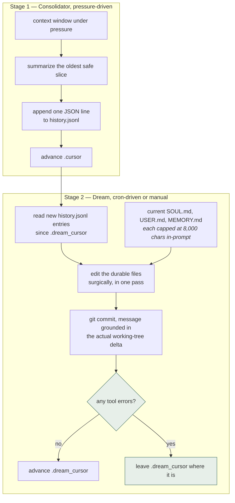
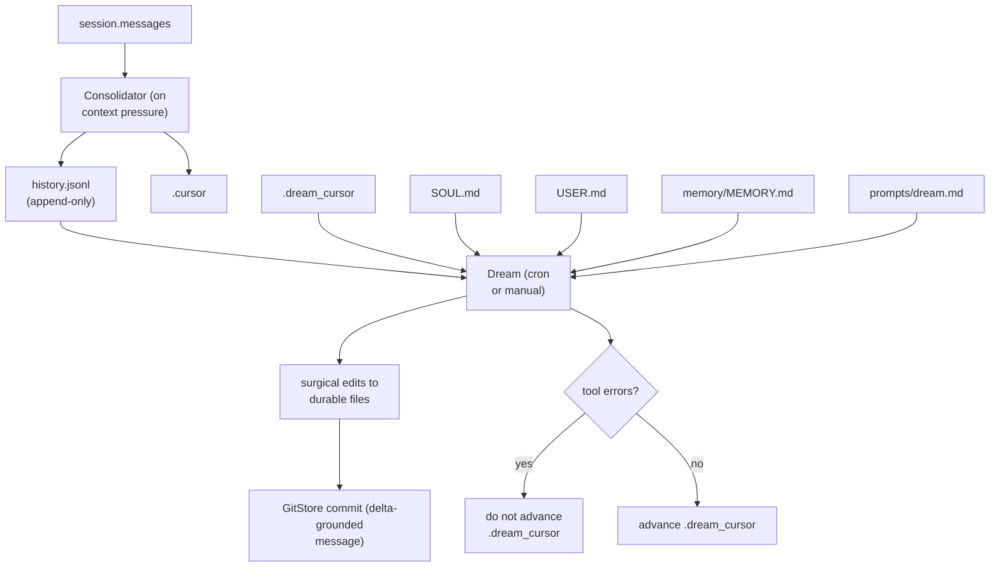

## 1. Executive Summary

nanobot is an MIT-licensed agent from HKUDS — the lab behind LightRAG — and its memory is a compact, well-reasoned file-and-git design in about 1,200 lines (`nanobot/agent/memory.py`).

The layering will be familiar from [Hermes Agent](../hermes-agent/) and [llm-wiki-memory](../llm-wiki-memory/): live conversation, an append-only archive of compressed turns, and durable Markdown knowledge files under git. What makes it worth a report is the care in the seams between those layers.

**Two independent cursors.** `memory/.cursor` marks how far the Consolidator has written into `history.jsonl`; `memory/.dream_cursor` marks how far Dream has consumed it. Producer and consumer advance separately, so a slow or failed Dream never blocks consolidation and never silently skips material.

**Dream refuses to advance when its own tools failed.** `DreamRunProgress` watches for tool events with `phase == "error"` during a Dream run, and a nominally-completed run that hit tool errors is treated as unsafe to advance the cursor. A partially-failed consolidation therefore gets retried rather than banked — the inverse of the trap [Magic Context](../magic-context/) had to engineer its way out of, reached by a different route.

**It filters its own generated sessions out of its memory input.** `_INTERNAL_HISTORY_SESSION_PREFIXES = ("cron:", "dream:")` and `_INTERNAL_HISTORY_SESSION_KEYS = {"heartbeat"}` exclude nanobot's own scheduled and consolidation sessions from history. This is the fourth independent implementation in the atlas of a guard against the harness's own output becoming evidence, after [OpenClaw](../openclaw/)'s envelope sanitization, [Holographic](../holographic/)'s compaction-summary exclusion, and Pi-adjacent cases — strong confirmation that this is a general failure mode, not a quirk.

**Git commit messages are grounded in the real working-tree delta**, over an explicit allowlist of durable files that *deliberately excludes* `.dream_cursor`, "so progress bookkeeping never appears as a durable-memory edit in the audit record." Someone thought carefully about what an audit log should and should not contain.

A third durable file is unusual: alongside `USER.md` and `memory/MEMORY.md` sits **`SOUL.md`**, holding the agent's own voice and communication style. Identity as a separate memory kind from knowledge appears almost nowhere else here.

The limits are the ordinary ones for file-backed memory: no retrieval ranking, no scope beyond the workspace, no verification or rejection state, and durable files that stay small because a model is asked to keep them small.

## 2. Mental Model

```text
workspace/
├── SOUL.md              # the agent's long-term voice and style
├── USER.md              # stable knowledge about the user
├── prompts/
│   └── dream.md         # optional instructions for how Dream organizes memory
└── memory/
    ├── MEMORY.md        # project facts, decisions, durable context
    ├── history.jsonl    # append-only compressed turn summaries
    ├── .cursor          # Consolidator write cursor
    ├── .dream_cursor    # Dream consumption cursor
    └── .git/            # version history for the durable files
```

Two stages, deliberately separated:



Two cursors, and the second one is the interesting piece. `.dream_cursor` advances
**only if the pass had no tool errors**, so a run that half-worked is retried
rather than banked — the
[recoverable background work](../../patterns/recoverable-background-work/)
pattern, with the cursor as the unit of progress.

The documentation is explicit that `history.jsonl` "is not the final memory. It is the material from which final memory is shaped" — evidence and belief kept in separate files, which is the [evidence before belief](../../patterns/evidence-before-belief/) pattern expressed as a directory layout.

## 3. Architecture

- `nanobot/agent/memory.py` (1,210 lines) — `MemoryStore` ("pure file I/O for memory files"), `DreamRunProgress`, cursor management, legacy-history migration, git integration.
- `nanobot/templates/memory/MEMORY.md` — the seed template.
- `docs/memory.md`, `docs/guides/ai-agent-memory.md` — design documentation.
- Workspace `prompts/dream.md` — user-editable instructions steering Dream's behaviour.



## 4. Essential Implementation Paths

### The dual-cursor split

Separating the write cursor from the consumption cursor is a small decision with good properties. Consolidation is driven by context pressure and must be fast; Dream is expensive and runs on a schedule. Coupling them would mean either blocking the conversation on Dream or losing material when Dream falls behind. With two cursors, `history.jsonl` acts as a durable queue between a fast producer and a slow consumer.

`_maybe_migrate_legacy_history` and the `_LEGACY_ENTRY_START_RE` parser handle an older free-text history format, converting it into the JSONL structure with backup paths — a real migration path rather than a breaking change.

There is also a first-start guard: rather than pulling a user's entire historical archive into the first Dream run, `.dream_cursor` is initialized to the current last cursor. New installs do not begin with an enormous, expensive, and probably incoherent consolidation.

### The failure-aware Dream gate

```python
class DreamRunProgress:
    """Track tool failures that make a nominally completed Dream run unsafe to advance."""
```

The callback inspects `tool_events` for any entry whose `phase` is `"error"`. If Dream "completed" but a tool failed underneath it, the durable files may have been edited from incomplete input, so the cursor holds and the material is reprocessed next run.

This is the [recoverable background work](../../patterns/recoverable-background-work/) pattern applied to the *cursor* rather than to a retry queue: the safest way to make failed derivation retryable is to not record it as done.

### Grounded commit messages

```python
_DREAM_CONTENT_PATHS = ("SOUL.md", "USER.md", "memory/MEMORY.md")
```

Commit messages describe the delta on these three files only. The accompanying comment states that `memory/.dream_cursor` is excluded so bookkeeping never shows up as a durable-memory edit. The git log therefore reads as a history of what the agent came to believe, not a history of its internal counters — which is the difference between an audit trail and a change log.

### Self-exclusion from history

```python
_INTERNAL_HISTORY_SESSION_PREFIXES = ("cron:", "dream:")
_INTERNAL_HISTORY_SESSION_KEYS = {"heartbeat"}
```

Scheduled runs, Dream's own runs, and heartbeats are excluded from the history that feeds memory. Without this, Dream would consume its own output and heartbeats would accumulate as remembered "conversations."

### Bounded prompt embedding

`_DREAM_FILE_EMBED_CAP = 8000` caps how much of each durable file goes into the Dream prompt, with a comment noting the files are ~5 KB in practice "but a runaway file must not unbounded the prompt." A cap sized well above the expected case, present specifically for the pathological one.

## 5. Memory Data Model

There is no schema. Durable memory is three Markdown files; evidence is JSONL lines with `cursor`, `timestamp`, and `content`; `_DEFAULT_MAX_HISTORY = 1000` bounds the archive, with older processed entries dropped without discarding pending Dream input.

Consequences:

- **No status, verification, or rejection state.** Whatever Dream writes is authoritative until Dream changes it.
- **No provenance on durable claims.** A line in `MEMORY.md` does not record which history entries produced it; git history is the only trail back, and it links a commit to a file delta rather than a claim to its evidence.
- **No scope beyond the workspace.** Selecting a different project in the WebUI changes tool working directory and chat context but does not relocate the memory files, so one workspace is one memory.
- **Size is maintained by persuasion.** Dream is asked to make "the smallest honest change that keeps memory coherent"; nothing enforces a budget the way [Hermes Agent](../hermes-agent/)'s hard character cap does.

## 6. Retrieval Mechanics

None, and that is a design position rather than an omission. The durable files are small and always in context; `history.jsonl` is machine-oriented material for Dream, not a searchable corpus. There is no embedding, no ranking, and no query path.

The trade is the same one Hermes makes: guaranteed recall of a small curated set, at the cost of anything that did not survive curation being unreachable. For a system whose memory is a few kilobytes this is reasonable; it does not extend to a large corpus.

## 7. Write Mechanics

Two writers with different rhythms. The Consolidator writes evidence under context pressure and never touches durable files. Dream is the only writer of durable memory, editing surgically in a single pass rather than rewriting wholesale — which is what makes git deltas meaningful.

Users influence Dream through `prompts/dream.md`, an editable instruction file. That is a genuinely nice operator surface: memory *policy* is a text file a person can read and change, without touching code.

## 8. Agent Integration

Memory is internal to nanobot rather than a plugin contract, with a WebUI, cron scheduling, and templates. Documentation is unusually good for this layer of the stack — `docs/memory.md` explains the design and its reasoning, not just the API.

## 9. Reliability, Safety, and Trust

Strengths:

- Dual cursors decoupling a fast producer from a slow consumer.
- A failure-aware gate that will not mark unsafe work as done.
- First-start cursor initialization preventing a runaway initial Dream.
- Self-generated sessions excluded from memory input.
- Audit-clean git commits over an explicit durable-file allowlist.
- Bounded prompt embedding with a stated rationale.
- Legacy-format migration with backups.
- Human-editable memory policy in `prompts/dream.md`.
- Evidence and belief in separate files.

Gaps:

- **No verification or rejection state**; a wrong durable claim persists until Dream happens to revise it, and nothing prevents its re-derivation from retained history.
- **Provenance stops at git.** A claim cannot be traced to the history entries that produced it.
- **One workspace, one memory** — no project or user scope inside it.
- **Unenforced size discipline**, dependent on the model honouring an instruction.
- **No fencing** of recalled content; durable files are injected as ordinary context.
- **Git is not erasure** — the same caveat the atlas raises for llm-wiki-memory applies to deleted content in `.git/`.

## 10. Tests, Evals, and Benchmarks

Memory-specific tests were not located in this checkout, and no memory-quality benchmark was found; the suites were not run. Given how much of the design's value sits in the cursor and failure-gate logic — exactly the code that is hard to get right and easy to regress — that is the most significant evidence gap here.

## 11. For Your Own Build

### Steal

- **Two cursors, one queue.** Separate the write position from the consume position when a fast producer feeds a slow consumer, and the whole class of "consolidation fell behind" bugs disappears.
- **Do not advance a cursor after a failed run.** Cheaper and more robust than a retry queue: if derivation was unsafe, simply do not record it as done.
- **Initialize the consume cursor to the present on first run.**
- **Ground audit commits in a durable-file allowlist**, keeping bookkeeping out of the memory history.
- **Exclude your own generated sessions from memory input** — now confirmed as a general requirement across four independent systems in this atlas.
- **A separate identity file.** `SOUL.md` keeps "who I am" apart from "what I know", which are corrected on different schedules for different reasons.
- **Memory policy as an editable prompt file** the operator can read and change.

### Avoid

- **Durable claims without provenance to their evidence.**
- **No rejection state** in a system that automatically re-derives from a retained archive.
- **Size maintained by instruction** rather than enforcement.
- **Single-workspace scope** presented alongside project switching in the UI, which invites the assumption that memory is per-project when it is not.

### Fit

Borrow:

- The dual-cursor architecture and the failure-aware advance gate — both are small, general, and correct.
- The durable-file allowlist for audit commits.
- The internal-session exclusion list.
- `SOUL.md` as a distinct identity layer.

Do not copy:

- The absence of retrieval, if memory will grow past a few kilobytes.
- Instruction-based size discipline where prompt cost matters; use a hard budget.
- Single-workspace scope for multi-project use.

## 12. Open Questions

- Should durable claims cite the `history.jsonl` cursors that produced them, making correction traceable?
- What stops Dream from re-deriving a claim a user explicitly removed?
- Should memory be per-project, given that the WebUI already scopes chats by project?
- How is `MEMORY.md` prevented from growing without bound over months, if only an instruction constrains it?
- Are the cursor and failure-gate paths tested anywhere? They carry most of the design's correctness.

## Appendix: File Index

- Memory implementation: `nanobot/agent/memory.py` — `MemoryStore`, `DreamRunProgress`, cursor handling, git integration, legacy migration.
- Durable files: `SOUL.md`, `USER.md`, `memory/MEMORY.md` (template at `nanobot/templates/memory/MEMORY.md`).
- Evidence archive: `memory/history.jsonl`; cursors `memory/.cursor` and `memory/.dream_cursor`.
- Memory policy: workspace `prompts/dream.md`.
- Documentation: `docs/memory.md`, `docs/guides/ai-agent-memory.md`.

## History

**2026-07-27** — [`b99e0f937e828504e0f93dbe35dfd6b1540e20b2`](https://github.com/HKUDS/nanobot/commit/b99e0f937e828504e0f93dbe35dfd6b1540e20b2) — first reading.
