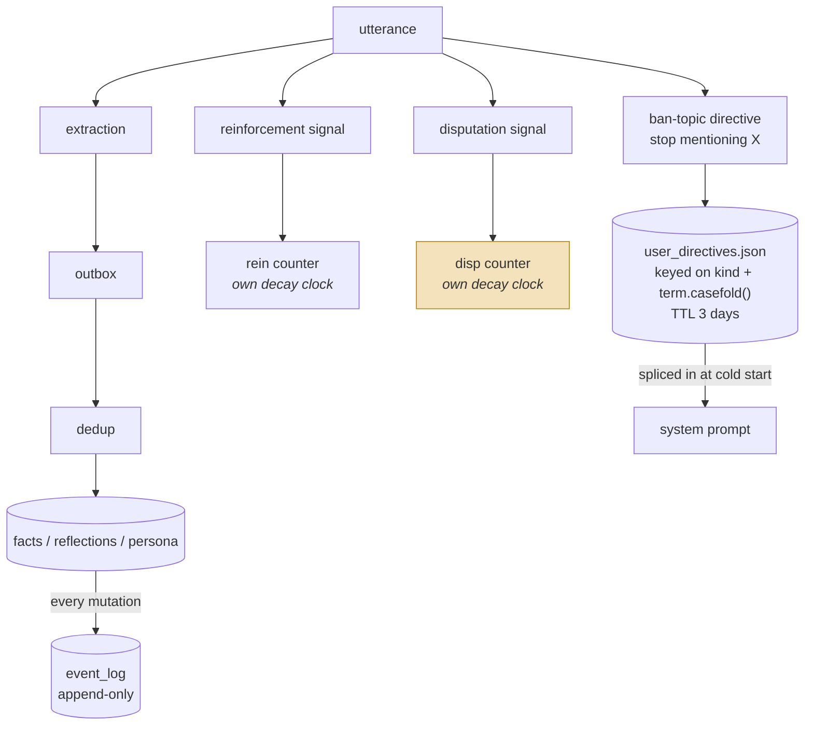
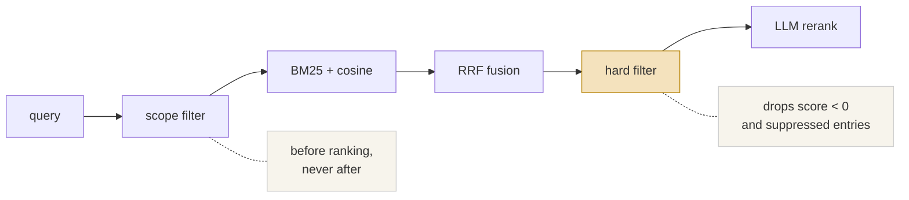
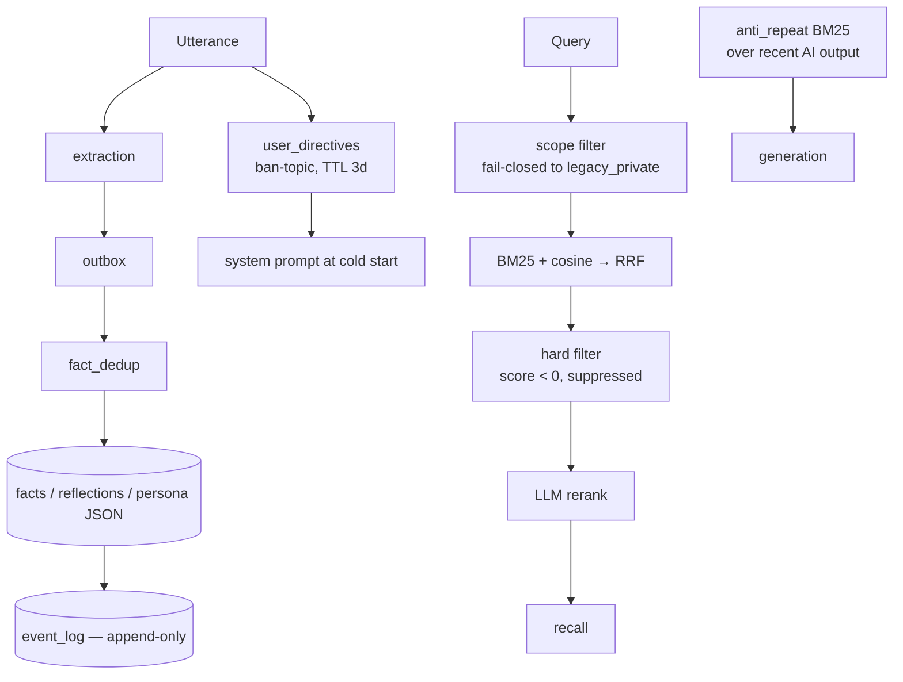

## 1. Executive Summary

Project N.E.K.O. is a proactive companion application — voice, vision, avatar,
Apache-2.0 — and its memory subsystem is roughly 24,000 lines across thirty
modules. That is larger than most of the purpose-built memory systems in this
atlas, and better reasoned than many, with design RFCs
(`docs/design/memory-evidence-rfc.md`, `memory-event-log-rfc.md`) that the code
cites by section number.

It is here because a companion application has a product incentive the research
systems lack. If a memory layer forgets, a user notices immediately; if it
*re-raises something the user asked it to drop*, the user is not mildly
inconvenienced but hurt. That pressure has produced two mechanisms this atlas has
been looking for and finding almost nowhere.

**Reinforcement and disputation are separate quantities with separate decay
clocks.** `evidence_score(entry, now)` is
`effective_reinforcement − effective_disputation`, and `rein_last_signal_at` and
`disp_last_signal_at` advance independently, so a signal on one side does not
reset the other's decay. Almost every system in this atlas collapses "how sure am
I" into a single number that agreement and disagreement both move. Here, "long
confirmed but recently disputed" is representable, and it decays like two things
because it is two things.

**And a disputed entry is tested not to come back.**
`test_hard_filter_drops_negative_score` asserts that an observation with
`evidence_score < 0` is excluded from the pool, with the reasoning in its
docstring: *"Stage-2 would either reinforce the dispute or, worse, cancel it."*
That is the re-assertion failure this atlas is organised around — named,
understood, and defended with a committed test. It is the **first negative
retrieval assertion in the atlas that is about a corrected value rather than an
access boundary**.

The weaknesses are narrower than usual. The status tiers are *derived* from the
score at read time rather than stored, so there is no field a query can filter on
and no record that a specific value was rejected. And the do-not-mention
directives — the closest thing here to a tombstone — expire after three days.

## 2. Mental Model

A memory is an entry whose standing is computed, not stored. Reading one calls
`evidence_score(entry, now)`, and `derive_status` maps that to one of four tiers:

| Condition on `evidence_score(entry, now)` | Derived status |
| --- | --- |
| `score >= EVIDENCE_PROMOTED_THRESHOLD` | `promoted` |
| `score >= EVIDENCE_CONFIRMED_THRESHOLD` | `confirmed` |
| `score <= EVIDENCE_ARCHIVE_THRESHOLD` | `archive_candidate` |
| otherwise | `pending` |

The docstring is careful that this is *"a DERIVED semantic label, not a storage
field"*, and that archival additionally requires
`sub_zero_days >= EVIDENCE_ARCHIVE_DAYS` — an entry must stay negative for a
sustained period, not merely dip.

The lifecycle, with the two unusual things marked:

The two decay clocks are the point: reinforcement and disputation are separate
counters, so "long confirmed, recently disputed" is a state this system can hold
and a single confidence float cannot.

Recall runs in one direction with two gates that both matter:

Scope filters **before** ranking, so excluded material is never ranked rather than
ranked and hidden. The hard filter sits **before** the LLM rerank, so disputed
material the model never sees cannot be talked back into relevance — and
`test_hard_filter_drops_negative_score` asserts it.

`protected=True` entries — those from the character card — return `float('inf')`
from `evidence_score` and are *"never evicted / archived / squeezed out by
budget"*. So the character's own identity cannot be disputed away by
conversation, which is correct for this product and a pinning rule the atlas
rarely sees stated so plainly.

## 3. Architecture

Python, Apache-2.0, with `memory/` holding thirty modules and about 24,000 lines:

| Concern | Modules |
| --- | --- |
| Belief | `facts.py` (2,474), `fact_dedup.py` (839), `evidence.py`, `evidence_analytics.py`, `evidence_handlers.py` |
| Recall | `hybrid_recall.py` (803), `recall.py`, `recent.py`, `timeindex.py` |
| Correction | `user_directives.py` (465), `anti_repeat.py` (617), `refine.py` |
| Durability | `event_log.py` (601), `outbox.py`, `cursors.py`, `archive_shards.py` |
| Structure | `scopes.py`, `temporal.py`, `persona/`, `reflection/`, `store/` |
| Embedding | `embeddings.py`, `embedding_worker.py`, `embeddings_fallback.py`, `_embeddings/` |

### Deployment and ergonomics

- **What has to run:** the companion app. Storage is per-character JSON plus
  embeddings; there is no database server.
- **Local and offline:** embeddings have a fallback path
  (`embeddings_fallback.py`), and BM25 needs no model — so recall degrades rather
  than breaking without an embedding service.
- **Hand-repairable:** the views are JSON per character, and the event log gives
  a bad state a history to reconstruct from.

## 4. Essential Implementation Paths

**Evidence.** `memory/evidence.py` — `evidence_score` (152) as reinforcement
minus disputation, both decayed at read time; `derive_status` (163);
`compute_evidence_snapshot` producing the payload for the outgoing event.

**The audit log.** `memory/event_log.py` — *"per-character append-only audit +
replay log"*. Its motivation is stated precisely: the views
(`facts.json` / `reflections.json` / `persona.json`) *"are the only record of
state transitions, so there is no ordered history"*, which makes "crashed halfway
through a view write" invisible and cross-file invariants uncheckable.

**Scope, enforced before ranking.** `memory/hybrid_recall.py:566` carries the
comment *"Security boundary: scope filtering happens before any
BM25/cosine/RRF"* — because filtering afterwards hides results rather than
excluding them. `memory/scopes.py` states the fail-closed rule: *"Missing fields
deliberately mean `legacy_private`; they never mean wildcard/global access."*

**The hard filter.** `MemoryRecallReranker._hard_filter` drops entries with
`evidence_score < 0` and entries flagged `suppress`, before the LLM rerank.

**Ban-topic directives.** `memory/user_directives.py` — extraction across locales
in parallel, dedup key `(kind, term.casefold())`, storage in
`memory/{name}/user_directives.json`, TTL from `USER_DIRECTIVE_TTL_SECONDS`, and
`render_prompt_block` splicing the block into the system prompt tail at startup.

**Anti-repetition.** `memory/anti_repeat.py` — a per-character rolling BM25
corpus over recent *AI* output, because *"the LLM tends to circle back to the
same topic … Simple SequenceMatcher similarity only catches exact repeats and is
useless against rephrased but still on the same topic."* The background corpus is
count-capped and *"never time-filtered, so IDF context survives idle periods
intact"*.

**Tests.** ~7,936 across the repository, including
`tests/unit/test_memory_recall.py`, `test_group_memory_scopes.py`, and several
`*_memory_policy_contract.py` suites.

## 5. Memory Data Model

The evidence fields are the model: reinforcement and disputation counters with
`rein_last_signal_at` and `disp_last_signal_at`, a `protected` flag, a scope, a
source, and a `suppress` flag.

**Scope** is a `MemorySubject` supporting group and participant memory, with a
`SCOPED_PERSONA_PREFIX` of `@subject/` and a documented legacy path. The
fail-closed default — absent scope means `legacy_private`, never global — is the
same discipline [OpenHuman](../openhuman/) applies to its taint column, and the
right default for a system that gained group chat after the fact.

**No stored status field**, which is why `trust_state` is withheld. The four tiers
are computed per read, so nothing can query "all pending facts" without
recomputing, and no history of status transitions exists outside the event log.

**No rejected-value record that survives archival.** Disputation pushes an entry
out of recall and eventually into an archive shard, but nothing keyed on the
*value* prevents the same claim being extracted from a later conversation and
starting fresh at zero.

## 6. Retrieval Mechanics

The most complete retrieval stack in the companion category and competitive with
the best here: **scope filter → BM25 + cosine → RRF → hard filter → LLM rerank**,
with a budget and an embedding fallback.

Two details are worth stealing regardless of domain. **Scope before ranking** is a
security property rather than a performance one, and the comment says so. **The
hard filter sits between fusion and the LLM rerank**, so disputed material never
reaches the model that would otherwise weigh it — the difference between "the
model decided not to use it" and "the model never saw it".

`anti_repeat` is a second, unusual mechanism: a negative filter over the
assistant's *own recent output*, to stop a proactive companion raising the same
subject repeatedly. Nothing else in this atlas models self-repetition as a memory
problem.

## 7. Write Mechanics

Extraction runs into an **outbox** so a background task killed mid-flight can be
re-run, then through `fact_dedup` before landing in the per-character views.
Reflection and refinement are separate background passes.

The directive path is the interesting write. `dispatch_user_utterance` fans out to
a registered sink; extraction runs *all locales in parallel* because mixed
Chinese and English speech is common; a hit is trimmed and stored under
`(kind, term.casefold())`, with repeated hits refreshing the expiry and
incrementing `hit_count`.

Its **false-positive policy is stated explicitly**, which is rare enough to quote:

> *"The regex templates are lenient. Cost of a false kill = the user says an
> equivalent sentence once more; cost of a miss = the user gets offended again —
> so we lean toward over-killing."*

That is an asymmetric error-cost analysis written into the module implementing the
suppression. No other system in this atlas states the trade it is making on a
suppression mechanism.

The scope discipline is equally careful. The module documents what it deliberately
does *not* extract: object-less "shut up" or "change the subject" (no concrete
topic to carry forward, and pushing the intent into the next round would
backfire), and plain preferences like "I don't like watermelon" (that belongs to
the fact pipeline, not the ban list).

### Operational cost

- **The hot path is not blocked**: extraction goes to an outbox and workers drain
  it.
- **Decay is computed at read time rather than as a state transition**, so no
  sweep rewrites scores — a good trade that removes a whole class of background
  job.
- **Embeddings have a worker and a fallback**, so a slow embedding service
  degrades recall rather than stalling writes.
- **On the read path**, the LLM rerank has a budget and the directive prompt block
  is bounded by `USER_DIRECTIVE_MAX_ACTIVE`.

## 8. Agent Integration

Memory is an internal subsystem, not an exposed API: no MCP surface, no memory
tool the model calls. Recall is assembled and injected; directives are spliced
into the system prompt at cold start.

That is right for a product where the user never thinks about memory, and it means
the mechanisms here are not reusable as a library — they are reusable as
*designs*.

## 9. Reliability, Safety, and Trust

**The dispute channel is the contribution.** Separating reinforcement from
disputation, giving each its own decay clock, then hard-filtering negative entries
before the rerank is a more careful treatment of disagreement than any dedicated
memory system in this atlas manages. Most systems here have one confidence number
that agreement and disagreement both push on, which cannot express "recently
disputed but long confirmed" — the exact state a companion must handle gently.

**`trust_state` is withheld** because the four tiers are derived per read rather
than stored, and the definition asks for a field. The near-miss is substantial and
arguably the definition's problem rather than the system's: a label computed
deterministically from two independently-decaying counters carries more
information than a stored enum and cannot go stale. What it cannot do is be
queried or filtered without recomputation, and no transition history exists
outside the event log.

**`audit_log` is earned** on `event_log.py` — append-only, per character,
motivated by exactly the failure the atlas cares about, and backed by a design
RFC.

**`negative_eval` is earned, and for the reason the atlas has been waiting for.**
The prior holders that came from access-control work — MIRIX, Aukora, EverOS —
all assert a *boundary*. `test_hard_filter_drops_negative_score` asserts that **a
value the user disputed does not feed back into the pipeline**. That is
correction, not scope, and it is the first of its kind in this corpus.

**The ban-topic list is the closest thing here to a tombstone and does not earn
the mark.** It is durable, keyed on the term rather than on a row, and survives
the restart that would otherwise wipe the context — more than most manage. But it
works by *asking the model* not to raise the topic, so a sufficiently distracted
model still can, and it **expires after three days**. A user who says "please stop
bringing up my ex" is protected until Thursday.

**Privacy**: memories are per-character JSON on the user's machine, and the
`protected` flag prevents character-card identity being disputed away. No secret
filtering on the write path was found.

## 10. Tests, Evals, and Benchmarks

About **7,936 test functions** repository-wide — the largest suite of any system
in this atlas — with memory covered by `test_memory_recall.py` (phase by phase
over the recall pipeline), `test_group_memory_scopes.py`, a runtime memory soak
test, and several `*_memory_policy_contract.py` files asserting that a feature's
memory behaviour matches a written policy.

The recall tests are structured the way this atlas keeps asking for: each phase in
isolation, with negative assertions at the phase boundary rather than end to end.
`test_hard_filter_drops_negative_score` and `test_hard_filter_drops_suppressed`
are both single-phase and both assert absence.

No public benchmark is run, and none would be meaningful — this product's
evaluation is whether users keep talking to it.

**What I would want:** a test that a ban-topic directive still suppresses after
the TTL boundary, or an explicit decision that it should not; and a test that a
disputed fact re-extracted from a later conversation does not silently reset to
zero.

## 11. For Your Own Build

### Steal

- **Track agreement and disagreement as separate quantities with separate decay
  clocks.** One confidence float cannot represent "long confirmed, recently
  disputed", which is the state that most needs careful handling. Two counters and
  two timestamps can, and `score = rein − disp` collapses them only when you need
  a number.
- **Compute status at read time instead of storing it.** No sweep, no stale
  labels, no migration when a threshold changes.
- **Filter scope before ranking, and write the reason in the code.** Filtering
  after ranking hides results instead of excluding them, and the comment is what
  stops someone reordering it for performance.
- **Put the hard filter before the LLM rerank.** Disputed material the model never
  sees cannot be talked back into relevance.
- **Keep a durable do-not-mention list keyed on the term.** The insight is in the
  motivation: the current turn is fine because the model can see the user's
  words — the failure is the *next cold start*, after compression has wiped them.
- **State your false-positive policy where the suppression lives.** One sentence
  tells every future maintainer which way to tune.
- **Model self-repetition as a memory problem.** A BM25 corpus over your own
  recent output catches "rephrased but still the same topic", which string
  similarity never will.
- **Take the disputation mechanism into serious systems, not just companions.**
  This is the transfer worth stating plainly, because the packaging invites
  dismissal. A companion app builds this because raising something the user asked
  it to drop is an emotional injury and the user leaves. The identical
  architecture is what stops a customer-service agent volunteering a declined
  mortgage application, a health assistant re-raising a terminated pregnancy, or a
  CRM summary reminding a rep to ask after a client's late spouse. Every one of
  those is a *retrieval* failure over a technically accurate memory, which a
  confidence score cannot express and a relevance ranker will happily surface
  forever. The distinction the atlas has been asking for — a durable record that
  a specific value was *rejected*, separate from how confident anyone is in it —
  gets built first where the cost of getting it wrong is felt immediately rather
  than measured quarterly.

### Avoid

- **A three-day TTL on a suppression the user asked for.** Reinforcement decay
  makes sense for facts; "never mention this again" is not a fact and does not
  weaken with time. If the list must be bounded, bound it by size and let the user
  see it.
- **Deriving status without keeping transitions.** Read-time computation is the
  right call, and it means you cannot answer "when did this become disputed?"
  unless the event log carries it — so make sure it does.

### Fit

Read this if you are building anything where a memory mistake is *felt* rather
than merely wrong — a companion, a therapy-adjacent tool, a long-running personal
assistant. The evidence model and the directive list come from that pressure and
are the two best answers to it in this atlas.

It is not a library. Memory is wired into a companion runtime with voice, vision
and an avatar, and there is no API boundary to lift it out through. Take the
designs, not the code.

And the broader point for anyone surveying this field: this subsystem is larger
and more carefully reasoned than most of the purpose-built memory frameworks
here, and it was found in a companion app. Product pressure from users who notice
produced a dispute channel, an append-only audit log and a tested correction
filter — three things the research systems mostly discuss.

## 12. Open Questions

- **Why three days for `USER_DIRECTIVE_TTL_SECONDS`?** No rationale appears in the
  module, and the choice is the difference between a real suppression mechanism
  and a temporary one.
- **What happens when a disputed fact is re-extracted?** Whether `fact_dedup`
  matches it back to the archived entry and restores its disputation, or creates a
  fresh entry at zero, was not traced — and it decides whether correction
  survives.
- **Does the event log let status transitions be reconstructed?** It records
  mutations; whether an evidence snapshot rides on every one determines if "when
  did this become disputed" is answerable.
- **How is a disputation signal produced?** The scoring is clear; the classifier
  deciding that a user utterance disputes a specific entry was not read.
- **Do the `*_memory_policy_contract` tests assert policies from the design
  RFCs**, and is anything keeping the two in sync?

## Appendix: File Index

**Evidence and belief**

- `memory/evidence.py` — `evidence_score` (152), `derive_status` (163),
  `compute_evidence_snapshot`
- `memory/facts.py`, `memory/fact_dedup.py`, `memory/evidence_handlers.py`,
  `memory/evidence_analytics.py`

**Correction**

- `memory/user_directives.py` — `UserDirectivesManager`, TTL, prompt block
- `memory/anti_repeat.py` — BM25 over recent AI output
- `memory/refine.py`, `memory/reflection/`

**Recall**

- `memory/hybrid_recall.py` — scope boundary comment (566), RRF fusion
- `memory/recall.py`, `memory/recent.py`, `memory/timeindex.py`

**Durability and scope**

- `memory/event_log.py` — append-only audit and replay
- `memory/outbox.py`, `memory/cursors.py`, `memory/archive_shards.py`
- `memory/scopes.py` — `MemorySubject`, `LEGACY_PRIVATE_SCOPE`

**Design documents**

- `docs/design/memory-evidence-rfc.md`, `docs/design/memory-event-log-rfc.md`

**Tests**

- `tests/unit/test_memory_recall.py` — `test_hard_filter_drops_negative_score`,
  `test_hard_filter_drops_suppressed`
- `tests/unit/test_group_memory_scopes.py`,
  `tests/unit/test_runtime_memory_soak.py`
