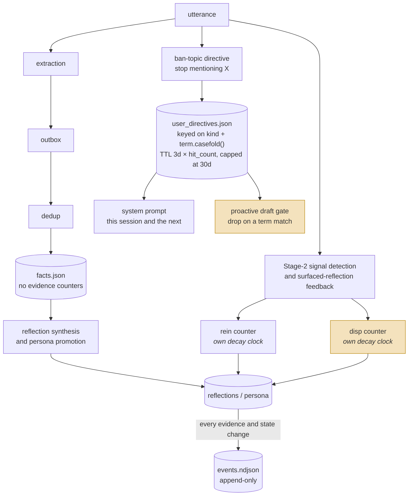
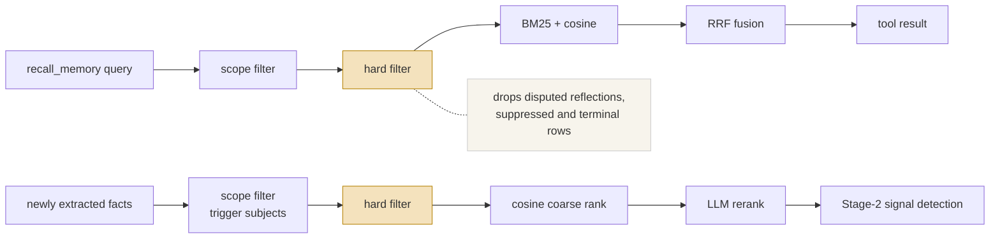
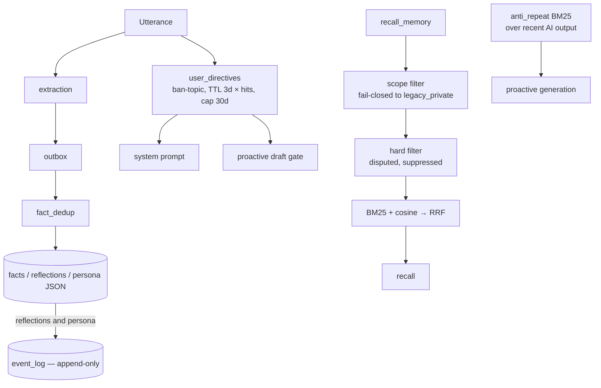

## 1. Executive Summary

Project N.E.K.O. is a proactive companion application — voice, vision, avatar —
whose memory subsystem keeps reinforcement and disputation as separate counters
on separate decay clocks, drops a user-disputed reflection before recall ranks
anything, and turns a spoken "stop mentioning X" into a gate on what the
character may say unprompted. It is weakest where a correction has to last:
status is derived from a score rather than stored, and a ban-topic directive
expires 3 to 30 days after it was last said.

The subsystem is backed by design RFCs (`docs/design/memory-evidence-rfc.md`,
`memory-event-log-rfc.md`) that the code cites by section number.

A companion application has a product incentive the research systems lack. If
a memory layer forgets, a user notices immediately; if it *re-raises something
the user asked it to drop*, the user is not mildly inconvenienced but hurt.
That pressure produced two mechanisms.

**Reinforcement and disputation are separate quantities with separate decay
clocks.** `evidence_score(entry, now)` is
`effective_reinforcement − effective_disputation`, and `rein_last_signal_at` and
`disp_last_signal_at` advance independently, so a signal on one side does not
reset the other's decay. A single confidence number that agreement and
disagreement both move cannot represent "long confirmed but recently disputed";
two counters can. The counters live on reflections and persona entries; the
extracted facts under them carry none.

**And a disputed reflection is tested not to come back.**
`test_disputed_reflection_drops_out_of_recall` runs the recall tool's backend
over a reflection in its real on-disk shape, disputed and with no stored score,
and asserts it absent; `test_reinforced_reflection_survives_recall` is its
control. A third case asserts that a reflection pushed negative by silence
alone stays recallable, because *not answering* is not *objecting*. The
Stage-2 signal pool carries the same filter, with the reason in its test's
docstring: *"Stage-2 would either reinforce the dispute or, worse, cancel it."*

**Trust runs on a second axis that has nothing to do with the memory.**
`memory/trust_store.py` holds a server-authoritative pool keyed by a
platform-neutral account id, and `resolve_trust` returns a float or `None`.
The module keeps `None` distinct from a low score as an explicit abstention:
*"``None`` means the handler must not write the ``speaker_trust`` key at all,
which keeps ``preferred_by_trust`` abstaining"*. A fallback to 0.5 *"would stamp
a finite value onto rows that today deliberately carry none, turning abstention
into an active arbitration vote"*. That value is stamped onto a fact's provenance when it is
extracted, and `preferred_by_trust` uses it to decide which of two contradictory
facts survives de-duplication. A memory's credibility is, in part, a property of
who said it.

Which makes the attribution channel a privilege boundary, and it is defended as
one. `test_llm_output_cannot_spoof_speaker_provenance` has the extractor return
an element carrying `speaker_trust: 999` and `speaker_label: "admin 本人"`, and
asserts the stored fact keeps the request segment's `0.3` and `Alice(1001)`.
Two further cases assert that neither a message body nor a speaker label can
forge a segment boundary. Without those, a user could talk their way into a
higher arbitration weight.

The weaknesses are narrow. The status tiers are *derived* from the score at read
time rather than stored, so there is no field a query can filter on and no
record that a specific value was rejected. The do-not-mention directives — the
closest thing here to a tombstone — hard-gate only proactive speech, reach
ordinary replies as a prompt instruction, and expire. And the event log
journals reflection and persona changes while writes to `facts.json` pass it by.

## 2. Mental Model

A memory is an entry whose standing is computed, not stored. Reading a
reflection or a persona entry calls `evidence_score(entry, now)`, and
`derive_status` maps that to one of four tiers:

| Condition on `evidence_score(entry, now)` | Derived status |
| --- | --- |
| `score >= EVIDENCE_PROMOTED_THRESHOLD` | `promoted` |
| `score >= EVIDENCE_CONFIRMED_THRESHOLD` | `confirmed` |
| `score <= EVIDENCE_ARCHIVE_THRESHOLD` | `archive_candidate` |
| otherwise | `pending` |

The docstring is careful that this is *"a DERIVED semantic label, not a storage
field"*, and that archival additionally requires
`sub_zero_days >= EVIDENCE_ARCHIVE_DAYS` — an entry must stay negative for a
sustained period, not merely dip. The archive sweep that counts those days is
started by the memory server (`app/memory_server/runtime.py:1124`).

Facts sit below this and outside it. `facts.json` rows carry no reinforcement or
disputation, and no writer gives them a signal (`memory/hybrid_recall.py:965`).
Reflections are synthesized from facts and persona entries promoted from
reflections, and those two carry the counters. Scoped group and participant
memory is outside the score-driven archive as well: its entries never go
negative, so `memory/subject_archive.py` archives a subject by staleness instead
(`:17-24`).

The lifecycle, with the two unusual things marked:

The two decay clocks are the point: reinforcement and disputation are separate
counters, so "long confirmed, recently disputed" is a state this system can hold
and a single confidence float cannot.

Recall runs as two pipelines that share one filter:

Scope filters **before** ranking, so excluded material is never ranked rather
than ranked and hidden. On the recall tool path the hard filter also runs before
ranking, and there is no model stage at all. On the Stage-2 path it runs before
the LLM rerank, so a disputed entry cannot be chosen as the target of a fresh
signal that would reinforce or cancel the dispute.

`protected=True` entries — those from the character card — return `float('inf')`
from `evidence_score` and are *"never evicted / archived / squeezed out by
budget"*. So the character's own identity cannot be disputed away by
conversation, which is correct for this product.

## 3. Architecture

Python, with `memory/` holding 35 top-level modules and five subpackages:

| Concern | Modules (lines) |
| --- | --- |
| Belief | `facts.py` (5,865), `fact_dedup.py` (1,521), `evidence.py`, `evidence_analytics.py`, `evidence_handlers.py` |
| Recall | `hybrid_recall.py` (1,406), `recall.py` (729), `recall_render.py`, `recent.py`, `timeindex.py` |
| Correction | `user_directives.py` (649), `anti_repeat.py` (1,096), `refine.py`, `scoped_refine.py` |
| Durability | `event_log.py` (947), `outbox.py`, `cursors.py`, `archive_shards.py`, `subject_archive.py` |
| Structure | `scopes.py`, `subject_identity.py`, `temporal.py`, `persona/`, `reflection/`, `store/` |
| Speaker trust | `trust_store.py` (1,952), `speaker_trust.py` (704) |
| Embedding | `embeddings.py`, `embedding_worker.py`, `embeddings_fallback.py`, `_embeddings/` |

The memory server under `app/memory_server/` runs the background loops and
serves recall over HTTP on `127.0.0.1`.

### Deployment and ergonomics

- **What has to run:** the companion app and its memory server. Storage is
  per-character JSON plus embeddings; there is no database server.
- **Local and offline:** BM25 needs no model, and `embeddings_fallback.py` is an
  import-time stub that reports the embedding service disabled if
  `memory/embeddings.py` cannot load, so recall degrades to BM25 rather than
  breaking.
- **Hand-repairable:** the views are JSON per character, and the event log gives
  reflection and persona state a history to reconstruct from.

## 4. Essential Implementation Paths

**Evidence.** `memory/evidence.py` — `evidence_score` (152) as reinforcement
minus disputation, both decayed at read time; `derive_status` (163);
`compute_evidence_snapshot` producing the payload for the outgoing event.
Disputation has two producers on the memory server's post-turn path: a surfaced
reflection the user denies adds `USER_REBUT_DELTA`
(`app/memory_server/post_turn.py:447`), and a Stage-2 `negates` signal adds
`USER_KEYWORD_REBUT_DELTA` or `USER_FACT_NEGATE_DELTA`
(`app/memory_server/signal_extraction.py:295-297`).

**The audit log.** `memory/event_log.py` — *"per-character append-only audit +
replay log"*. Its motivation is stated precisely: the views
(`facts.json` / `reflections.json` / `persona.json`) *"are the only record of
state transitions, so there is no ordered history"*, which makes "crashed halfway
through a view write" invisible and cross-file invariants uncheckable. The
callers of `arecord_and_save` are the reflection and persona stores
(`memory/reflection/evidence_flow.py:133`, `memory/persona/facts.py:490`); the
fact store emits no event.

**Scope, enforced before ranking.** `memory/hybrid_recall.py:1165` carries the
comment *"Security boundary: scope filtering happens before any
BM25/cosine/RRF"* — because filtering afterwards hides results rather than
excluding them. `memory/scopes.py` states the fail-closed rule: *"Missing fields
deliberately mean `legacy_private`; they never mean wildcard/global access."*

**The hard filter.** `MemoryRecallReranker._hard_filter` (`memory/recall.py:241`)
drops rows with `score < 0`, rows flagged `suppress` by the mention rate limit,
terminal reflections and protected persona. The recall tool path applies it
before ranking (`memory/hybrid_recall.py:1194`), after `_tag_tier` computes a
score only for reflections whose disputation is above zero (`:1017`), so a row
made negative by silence carries no score and passes.

**Ban-topic directives.** `memory/user_directives.py` — extraction across locales
in parallel, dedup key `(kind, term.casefold())`, storage in
`memory/{name}/user_directives.json`. The TTL is a function of how often the
directive has been said: `_effective_ttl(hit_count)` (`:134-149`) returns
`min(USER_DIRECTIVE_TTL_SECONDS * hit_count, USER_DIRECTIVE_TTL_MAX_SECONDS)`,
three days for one mention, six for two, and a thirty-day cap from ten onwards.
Only a fresh hit renews `expire_at`; silence does not. `get_active` filters on
`expire_at` and truncates to `USER_DIRECTIVE_MAX_ACTIVE = 20`, and `_rotate`
caps the file at `USER_DIRECTIVE_MAX_STORED = 60`.

The list reaches three places. `_build_initial_prompt` splices the rendered
block into each session's system prompt (`main_logic/core/notify.py:201`). A
directive recorded mid-session is written into the next session's context
cache, so a hot swap whose prompt was built before the directive still carries
it (`notify.py:240`). And proactive chat checks every draft against the active
terms and drops a match outright, without regenerating
(`main_logic/proactive_chat/generation.py:198`, `:1316`).

**Anti-repetition.** `memory/anti_repeat.py` — a per-character rolling BM25
corpus over recent *AI* output, because *"the LLM tends to circle back to the
same topic"*, and SequenceMatcher similarity *"is useless against rephrased but
still on the same topic"*. The background corpus is *"count-capped only — never
time-filtered"*, so IDF context survives idle periods.

**Tests.** `tests/unit/test_hybrid_recall.py` (84 cases), `test_memory_recall.py`,
`test_group_memory_scopes.py`, `test_user_directives.py` and
`test_proactive_user_directives.py`; the suite total is in the header band.

## 5. Memory Data Model

The evidence fields are the model: reinforcement and disputation counters with
`rein_last_signal_at` and `disp_last_signal_at`, a `protected` flag, a scope, a
source, and a `suppress` flag, on reflections and persona entries. Facts carry
the scope, the source and the speaker provenance, and no evidence counters.

**Scope** is a `MemorySubject` supporting group and participant memory, with a
`SCOPED_PERSONA_PREFIX` of `@subject/` and a documented legacy path. The
fail-closed default — absent scope means `legacy_private`, never global — is the
same discipline [OpenHuman](../openhuman/) applies to its taint column, and the
right default for a system that gained group chat after the fact.

**No stored status field**, which is why `trust_state` is withheld. The four tiers
are computed per read, so nothing can query "all pending facts" without
recomputing, and no history of status transitions exists outside the event log.

**No rejected-value record that survives archival.** Disputation pushes a
reflection out of recall and eventually into an archive shard, but nothing keyed
on the *value* prevents the same claim being synthesized from later facts and
starting fresh at zero. The nearest record is keyed on a subject:
`subject_forget_tombstones.json` holds a per-scope erasure cutoff, so a queued
write stamped before a scoped forget cannot land after it
(`memory/facts.py:1016`).

## 6. Retrieval Mechanics

The model-facing recall is **scope filter → hard filter → BM25 + cosine → RRF**,
with no model stage (`memory/hybrid_recall.py:1165`, `:1194`, `:1221`). The
module says why: the tool runs inside the model's tool loop while the human
waits, and another LLM round-trip would make the gap perceptible (`:55`). BM25
and cosine each keep four, and RRF keeps eight
(`config/memory_settings.py:382-383`).

The LLM rerank belongs to a second pipeline. `MemoryRecallReranker` picks which
reflections and persona entries the Stage-2 signal-detection call may see:
hard filter, cosine coarse rank, then an LLM fine rank (`memory/recall.py:163`,
`:186`). Its pool is scoped to the subjects of the facts that triggered it
(`memory/facts.py:4365-4384`).

Two details transfer to any domain. **Scope before ranking** is a security
property rather than a performance one, and the comment says so. **The hard
filter runs before any ranker** on both paths, so a disputed reflection is not
scored, not fused and not offered to a model that would weigh it.

The filter's semantics are the careful part. `_tag_tier` computes a live score
only for reflections with disputation above zero, so a reflection pushed
negative by `IGNORED_REINFORCEMENT_DELTA` — the user did not answer — stays
recallable. The comment gives the reason and a measurement: silence is not
objection, and 17.8% of live reflections in an adversarial review were of that
kind (`memory/hybrid_recall.py:999`).

`anti_repeat` is a second mechanism: a negative filter over the assistant's
*own recent output*, to stop a proactive companion raising the same subject
repeatedly.

## 7. Write Mechanics

Extraction runs into an **outbox** so a background task killed mid-flight can be
re-run, then through `fact_dedup` before landing in the per-character views.
Reflection synthesis, promotion and refinement are separate background passes,
and Stage-2 signal detection turns new facts into reinforce or negate signals
against existing reflections and persona entries.

The directive path is the other interesting write. `dispatch_user_utterance`
fans out to a registered sink; extraction runs *all locales in parallel*
because mixed Chinese and English speech is common; a hit is trimmed and stored
under `(kind, term.casefold())`, with repeated hits refreshing the expiry and
incrementing `hit_count`. `record` matches against every stored row, expired or
not, so a directive re-stated after it lapsed resumes at its old `hit_count`
plus one while its row is still on disk (`memory/user_directives.py:346-354`).
`purge_expired` has no caller, and `_rotate` removes expired rows only once the
file passes 60.

Its **false-positive policy is stated explicitly**:

> *"The regex templates are lenient. Cost of a false kill = the user says an
> equivalent sentence once more; cost of a miss = the user gets offended again —
> so we lean toward over-killing."*

That is an asymmetric error-cost analysis written into the module implementing
the suppression, and the proactive gate follows it with one exception: bare
referents such as "this" or "it" stay in the prompt block and never hard-block,
because substring-matching the commonest word in the language would silence
proactive chat for the directive's whole life.

The scope discipline is equally careful. The module documents what it deliberately
does *not* extract: object-less "shut up" or "change the subject" (no concrete
topic to carry forward, and pushing the intent into the next round would
backfire), and plain preferences like "I don't like watermelon" (that belongs to
the fact pipeline, not the ban list).

### Operational cost

- **The hot path is not blocked**: extraction goes to an outbox and workers drain
  it.
- **Decay is computed at read time rather than as a state transition**, so no
  sweep rewrites scores — a good trade that removes a whole class of background
  job. The archive sweep only counts negative days.
- **Embeddings have a worker and an import-time stub**, so a slow or missing
  embedding service degrades recall rather than stalling writes.
- **On the read path**, recall returns at most eight entries, the Stage-2 rerank
  has a budget, and the directive prompt block is bounded by
  `USER_DIRECTIVE_MAX_ACTIVE`.

## 8. Agent Integration

Memory is an internal subsystem with no library boundary and no MCP server;
`plugin/plugins/mcp_adapter` is a client that imports other servers' tools.
Context is assembled and injected, directives go into the system prompt, and
the model can also ask. That is right for a product where the user never thinks
about memory, and it means the mechanisms here are reusable as *designs*.

### Where the model may ask

The main companion loop registers a built-in `recall_memory` tool taking `query`
and `time`, which posts to the memory server's `/query_memory` route with no
subject list, so it reads the legacy-private corpus
(`main_logic/core/tool_calling.py:211`, `:235`).

`plugin/plugins/qq_auto_reply/memory_tool_service.py` defines a second
`recall_memory` (`RECALL_TOOL_NAME`, `:20`) with a five-second HTTP budget,
handed to the model during a group turn. The interesting part is how its scope
is decided.

`resolve_group_recall_subjects` (`:25`) is the single place the group read
path's subject list is built. Its docstring says why it is single: it is
*"shared by the recall_memory tool handler AND the scoped bootstrap context:
both paths must authorize exactly the same scopes, or what a group turn may read
would depend on which one ran."* The list is the group subject, then the current
speaker, then up to `GROUP_RECALL_MAX_MEMBER_SUBJECTS - 1` recent speakers. The
member slots are gated twice: on a non-empty sender id, and on a
`group_member_memory_enabled` switch re-read at the moment of recall, so turning
member memory off stops participant-scope reads immediately rather than at the
next restart.

The ordering is load-bearing rather than cosmetic: the subject order *is* the
render budget's allocation order under `SCOPED_RENDER_TOTAL_MAX_TOKENS`, so the
group always outranks any individual, and the comment names that as the caller's
only priority knob.

**And there is a slot deliberately left empty.** A second group-shaped position
exists in the shape and is not filled, because the only thing that could fill it
is another group's memory. The comment declines to open that here: the existing
cross-group path reads live session memory and *"从不碰记忆库"*, never touches
the memory store, so cross-group disclosure is a separate decision rather than
one made in passing while wiring a tool. A refusal
to widen a scope, recorded at the place where widening would have been one line,
says more than a scope document.

The memory server trusts the subject list it receives: it refuses an empty list
and more than eight, and otherwise filters on what the host sent
(`app/memory_server/routes.py:3347-3356`). The model's own arguments do not
reach it: see section 10.

## 9. Reliability, Safety, and Trust

**The dispute channel is the contribution.** Separating reinforcement from
disputation, giving each its own decay clock, then hard-filtering disputed
reflections before anything ranks them is a careful treatment of disagreement.
One confidence number that agreement and disagreement both push on cannot
express "recently disputed but long confirmed" — the exact state a companion
must handle gently.

**`trust_state` is withheld** because the four tiers are derived per read rather
than stored, and the definition asks for a field. The near-miss is substantial:
a label computed deterministically from two independently-decaying counters
carries more information than a stored enum and cannot go stale. What it cannot
do is be queried or filtered without recomputation, and no transition history
exists outside the event log.

**`audit_log` is earned** on `event_log.py` — append-only, per character, with
the append ordered before the mutation, and backed by a design RFC. Its reach is
reflections and persona: fact writes emit nothing, and ten of the fifteen
declared event types have no emitter outside the module. The compaction helper
that would rewrite the journal has no caller, and the RFC says so. The module's
own docstring records one gap: a live write can advance the sentinel past an
unapplied tail, which no later boot replays (`event_log.py:632-655`).

**`negative_eval` is earned** on recall. `test_disputed_reflection_drops_out_of_recall`
asserts that a reflection the user disputed does not come back from the recall
tool, beside a control that a reinforced one does and a case that an ignored one
does too. That is correction, not scope; the scope suite adds the boundary form.

**The ban-topic list is the closest thing here to a tombstone and does not earn
the mark.** It is durable, keyed on the term rather than on a row, and survives
the restart that would otherwise wipe the context. On proactive speech it is a
hard gate: a draft containing an active term is dropped before delivery. On an
ordinary reply it is a prompt instruction, so a distracted model can still raise
the topic. Nothing stops the term being extracted into a fact or a reflection,
and it expires: three days from one mention, extending linearly with repetition
to a thirty-day ceiling, measured from the last time the user said it.

The scaling is the right shape for the signal. `config/session_settings.py:46`
argues it directly: saying something once may be a mood, and saying it
repeatedly is a stable preference. The same comment records the gap: the ban
list is a pure prompt constraint and *"用户今天还没有界面能删（管理面另行补）"*
— the user has no interface today for deleting one, with an admin surface
deferred. A suppression a user cannot inspect or revoke, that lapses on its own
after a month of silence, is a strong hint and not a durable rejection. The mark
stays withheld.

**Privacy**: memories are per-character JSON on the user's machine, the
`protected` flag prevents character-card identity being disputed away, and the
proactive gate logs how many terms matched and never the terms themselves. No
secret or PII filter on the memory write path was found.

## 10. Tests, Evals, and Benchmarks

The suite total is in the header band. Memory is covered by
`test_hybrid_recall.py` and `test_memory_recall.py` (phase by phase over the two
recall pipelines), `test_group_memory_scopes.py`, a runtime memory soak test,
and three `*_memory_contract.py` files asserting how avatar and game
interactions reach memory.

The recall tests are structured the way this atlas keeps asking for: each phase
in isolation, with negative assertions at the phase boundary as well as end to
end. `test_hybrid_recall.py` pins the hard filter against the stored shape of a
reflection rather than a synthetic score, and says why in a comment: the older
`test_hard_filter_drops_negative_score` injects a `score` key and would stay
green while the production filter did nothing. Its
`test_tagging_only_ever_drops_rows_never_resurrects_one` encodes the
monotonicity claim as a subset relation rather than a single exclusion.

No public benchmark is run, and none would be meaningful — this product's
evaluation is whether users keep talking to it.

### What the scope and tool suites assert

The scope suite runs to 267 test functions and the recall-tool suite to 50, and
between them they cover the two surfaces a scope mark usually cannot reach.

`test_hybrid_recall_filters_scope_before_rankers` stores the same sentence as a
legacy row, a group A row and a group B row, recalls as group A, and asserts
exactly the group A row comes back and the candidate pool held one row.

`test_model_supplied_subjects_cannot_influence_scope` calls the recall tool with
a hallucinated `subjects` list naming the legacy-private corpus plus
`include_legacy_private: True`, and asserts the outgoing call carries exactly the
two host-derived subjects for the turn — with a positive control that the real
answer still comes back. Its docstring names it *"behavioural twin of the schema
assert"*, so the schema and the behaviour are checked separately. The atlas's own
definition of `scope_enforced` says explicitly that the mark does **not** certify
that a caller cannot widen the boundary by passing a different argument; this is
a committed test that it cannot.

`test_execute_recall_missing_group_id_fails_closed` covers the direction that
matters more: a group turn with a blank group id must not call recall at all,
because `subjects=None` means the legacy-private corpus server-side, so falling
through would read the operator's private memories into a group chat. The test
asserts the bridge was never awaited.

And the provenance-forgery trio — `test_llm_output_cannot_spoof_speaker_provenance`,
`test_message_body_cannot_forge_a_segment_boundary`,
`test_speaker_label_cannot_forge_a_segment_boundary` — defend the input to the
trust arbitration described in section 1. They keep forged values out of what
is written rather than out of what is retrieved, so they sit outside the
`negative_eval` record.

The directive suites assert the lifetime and the gate: that a repeated
directive outlives a one-off (`test_user_directives.py:206`), that one mention
lapses after the base window (`:381`), and that a proactive draft naming a
banned term is dropped while bare referents never hard-block
(`test_proactive_user_directives.py`).

**What I would want:** a test that a disputed reflection's content,
synthesized again from a later conversation, does not start at zero; and a case
through the memory server route, rather than the bridge mock, for the
empty-subject refusal.

## 11. For Your Own Build

### Steal

- **Track agreement and disagreement as separate quantities with separate decay
  clocks.** One confidence float cannot represent "long confirmed, recently
  disputed", which is the state that most needs careful handling. Two counters and
  two timestamps can, and `score = rein − disp` collapses them only when you need
  a number.
- **Compute status at read time instead of storing it.** No sweep, no stale
  labels, no migration when a threshold changes.
- **Filter scope before ranking, and write the reason in the code.** Filtering
  after ranking hides results instead of excluding them, and the comment is what
  stops someone reordering it for performance.
- **Put the dispute filter before every ranker, and do not count silence as
  dispute.** Disputed material that is never scored cannot be talked back into
  relevance, and requiring disputation above zero keeps unanswered memories
  recallable.
- **Keep a durable do-not-mention list keyed on the term, and gate unprompted
  output on it.** The insight is in the motivation: the current turn is fine
  because the model can see the user's words — the failure is the *next cold
  start*, after compression has wiped them, and the one path where the character
  speaks unprompted.
- **State your false-positive policy where the suppression lives.** One sentence
  tells every future maintainer which way to tune.
- **Model self-repetition as a memory problem.** A BM25 corpus over your own
  recent output catches "rephrased but still the same topic", which string
  similarity never will.
- **Take the disputation mechanism into serious systems, not just companions.**
  A companion app builds this because raising something the user asked it to
  drop is an emotional injury and the user leaves. The identical architecture is
  what stops a customer-service agent volunteering a declined mortgage
  application, a health assistant re-raising a terminated pregnancy, or a CRM
  summary reminding a rep to ask after a client's late spouse. Every one of those
  is a *retrieval* failure over a technically accurate memory, which a
  confidence score cannot express and a relevance ranker will surface forever.

### Avoid

- **A TTL on a suppression the user asked for.** Scaling it by repetition is
  better than a flat window, and it still lapses after a month of silence.
  "Never mention this again" is not a fact and does not weaken with time. If the
  list must be bounded, bound it by size and let the user see it.
- **Journaling some views and not others.** An event log that covers reflections
  and persona but not the facts they are built from cannot answer why a fact
  changed.
- **Deriving status without keeping transitions.** Read-time computation is the
  right call, and it means you cannot answer "when did this become disputed?"
  unless the event log carries it — so make sure it does.

### Fit

Read this if you are building anything where a memory mistake is *felt* rather
than merely wrong — a companion, a therapy-adjacent tool, a long-running personal
assistant. The evidence model and the directive list come from that pressure.

It is not a library. Memory is wired into a companion runtime with voice, vision
and an avatar, and there is no API boundary to lift it out through. Take the
designs, not the code.

## 12. Open Questions

- **Will the deferred admin surface for the ban list arrive?** The constant's own
  comment defers it, and until it does a user cannot see or delete a suppression
  the system is applying on their behalf.
- **Should `speaker_trust` reach the recall path as well as the write path?** It
  arbitrates de-duplication and correction; `hybrid_recall.py`, `recall.py` and
  `recall_render.py` do not read it, so a low-trust fact that survived arbitration
  is retrieved on the same footing as any other.
- **What happens when a disputed reflection's content is synthesized again?**
  Whether synthesis matches it back to the archived reflection and its
  disputation, or creates a fresh one at zero, was not traced — and it decides
  whether correction survives.
- **Does the event log let status transitions be reconstructed?** It records
  reflection evidence and state changes with snapshots; whether every path that
  moves a derived tier emits one was not traced.
- **Do the memory contract tests assert policies from the design RFCs**, and is
  anything keeping the two in sync?

## Appendix: File Index

**Evidence and belief**

- `memory/evidence.py` — `evidence_score` (152), `derive_status` (163),
  `compute_evidence_snapshot`, `maybe_mark_sub_zero` (236)
- `memory/facts.py`, `memory/fact_dedup.py`, `memory/evidence_handlers.py`,
  `memory/evidence_analytics.py`
- `app/memory_server/post_turn.py` — denied reflection to disputation (447)
- `app/memory_server/signal_extraction.py` — Stage-2 `negates` to disputation
  (295–297)
- `app/memory_server/evidence_loops.py` — `_periodic_archive_sweep_loop` (902)

**Correction**

- `memory/user_directives.py` — `UserDirectivesManager`, `_effective_ttl`
  (134), `record` (346–354), `get_active_terms` (535)
- `main_logic/core/notify.py` — prompt block (201),
  `_inject_pending_user_directives` (240)
- `main_logic/proactive_chat/generation.py` — `_proactive_directive_hits`
  (198), the gate in `_guard_phase2_output` (1316)
- `memory/anti_repeat.py` — BM25 over recent AI output
- `memory/refine.py`, `memory/reflection/`

**Speaker trust**

- `memory/trust_store.py` — the pool, its four stated rules and its kill list of
  identity heuristics (17–60), `TrustSnapshot.trust_inputs` (744),
  `resolve_trust` and its three abstention conditions (778)
- `memory/speaker_trust.py` — `preferred_by_trust` (156), `trust_band`
- Consumers: `memory/fact_dedup.py` (1319, 1357),
  `memory/persona/corrections.py` (757, 792), `memory/scoped_refine.py` (220–228)
- `config/session_settings.py` — `USER_DIRECTIVE_TTL_SECONDS` (35),
  `USER_DIRECTIVE_TTL_MAX_SECONDS` (46), `USER_DIRECTIVE_MAX_ACTIVE` (58),
  `USER_DIRECTIVE_MAX_STORED` (66)

**Recall**

- `memory/hybrid_recall.py` — no-LLM rationale (55), `_tag_tier` (937),
  scope boundary comment (1165), hard filter (1194), RRF (1221),
  `recall_by_time` scope filter (1345)
- `memory/recall.py` — `MemoryRecallReranker`, hard filter (163, 241), LLM
  rerank (186)
- `memory/recent.py`, `memory/timeindex.py`, `memory/recall_render.py`
- `main_logic/core/tool_calling.py` — built-in `recall_memory` (211, 235)
- `app/memory_server/routes.py` — `/query_memory` (3311), subject list checks
  (3347–3356)
- `plugin/plugins/qq_auto_reply/memory_tool_service.py` — `RECALL_TOOL_NAME` (20),
  `resolve_group_recall_subjects` and the empty second group slot (25),
  `resolve_participant_recall_subjects` (68)
- `config/memory_settings.py` — `SCOPED_RENDER_TOTAL_MAX_TOKENS` (136),
  `GROUP_RECALL_MAX_MEMBER_SUBJECTS` (234), hybrid budgets (382–383)

**Durability and scope**

- `memory/event_log.py` — `EventLog` (194), `compact_if_needed` (538),
  `record_and_save` (606)
- `memory/outbox.py`, `memory/cursors.py`, `memory/archive_shards.py`
- `memory/scopes.py` — `MemorySubject`, `LEGACY_PRIVATE_SCOPE` (30),
  `filter_entries_for_subjects` (307)
- `memory/subject_archive.py` — staleness archival for scoped subjects (17–24)
- `memory/facts.py` — subject forget tombstone (1016), Stage-2 pool scope
  filter (4365–4384)

**Design documents**

- `docs/design/memory-evidence-rfc.md`, `docs/design/memory-event-log-rfc.md`

**Tests**

- `tests/unit/test_hybrid_recall.py` — `test_disputed_reflection_drops_out_of_recall`
  (291), `test_ignored_reflection_is_not_treated_as_disputed` (312),
  `test_reinforced_reflection_survives_recall` (331),
  `test_tagging_only_ever_drops_rows_never_resurrects_one` (383)
- `tests/unit/test_memory_recall.py` — `test_hard_filter_drops_negative_score`
  (120), `test_hard_filter_drops_suppressed` (136)
- `tests/unit/test_group_memory_scopes.py` — 267 cases, including
  `test_hybrid_recall_filters_scope_before_rankers` (319),
  `test_qq_group_bootstrap_never_reads_legacy_private_memory` (455),
  `test_llm_output_cannot_spoof_speaker_provenance` (3165),
  `test_message_body_cannot_forge_a_segment_boundary` (3260),
  `test_speaker_label_cannot_forge_a_segment_boundary` (3323)
- `tests/unit/test_group_memory_recall_tool.py` — 50 cases, including
  `test_model_supplied_subjects_cannot_influence_scope` (204) and
  `test_execute_recall_missing_group_id_fails_closed` (232)
- `tests/unit/test_user_directives.py` (183, 206, 381),
  `tests/unit/test_proactive_user_directives.py`,
  `tests/unit/test_event_log.py` (280, 326)
- `tests/unit/test_speaker_trust.py`, `tests/unit/test_trust_store.py`,
  `tests/unit/test_runtime_memory_soak.py`

**Recorded searches**, run from the repository root:

- Callers of the scope predicates:
  `grep -rn --include='*.py' -E 'filter_entries_for_subjects|entry_matches_subject|is_legacy_private_entry' memory app plugin`
- Event emitters per type:
  `grep -rn --include='*.py' -oE 'EVT_[A-Z_]+' memory app main_logic | grep -v memory/event_log.py | sort | uniq -c`
- Journal compaction callers:
  `grep -rn --include='*.py' -E 'compact_if_needed' app main_logic memory plugin utils main_routers scripts`
- Directive consumers:
  `grep -rn --include='*.py' -E 'get_active_terms|take_pending_injection|render_prompt_block|purge_expired' main_logic main_routers app plugin utils memory`
- Speaker trust on the recall path:
  `grep -n 'trust' memory/hybrid_recall.py memory/recall.py memory/recall_render.py`
- An MCP server:
  `grep -rln --include='*.py' -E 'FastMCP|from mcp|import mcp|mcp\.server|@mcp\.tool' . | grep -v '^.agent/'`
- Secret or PII filtering in memory:
  `grep -rn --include='*.py' -i -E 'redact|secret|password|pii' memory`
- Evidence counters on facts: `grep -c 'reinforcement\|disputation' memory/facts.py`
- A value-keyed rejection record:
  `grep -rn --include='*.py' -i -E 'denied|rejected|tombstone|blocklist' memory/reflection/synthesis.py memory/fact_dedup.py memory/facts.py`

## History

**2026-09-26** — [`bcdd5c2fc8c14fe7eda7e35f158049aa88966ecd`](https://github.com/Project-N-E-K-O/N.E.K.O/commit/bcdd5c2fc8c14fe7eda7e35f158049aa88966ecd) — 25 commits on, none under `memory/`, whose tree is identical at both pins, so this audits the previous reading. No mark moved. Published claims were wrong at the previous pin. The recall tool runs the hard filter before BM25 and cosine and has no LLM stage; the rerank belongs to the Stage-2 pool ([section 6](#6-retrieval-mechanics)). Ban-topic directives also hard-gate proactive drafts ([section 4](#4-essential-implementation-paths)). The event log journals reflections and persona, not facts, and holds an uncalled compaction helper ([section 9](#9-reliability-safety-and-trust)). Evidence counters sit on reflections and persona; the main loop has its own `recall_memory`; the census dated from 29 July. `negative_eval` is re-anchored on `test_hybrid_recall.py`. Screened: four `conftest.py` execution points, two manifests inside the cooldown. Nothing installed, built or run.

**2026-09-13** — [`b51d4532c59c03b6221bb74560b12e797af9307c`](https://github.com/Project-N-E-K-O/N.E.K.O/commit/b51d4532c59c03b6221bb74560b12e797af9307c) — 403 commits past the previous pin, with roughly 19,000 lines added under `memory/` and ten new modules there. A published criticism is corrected: the ban-topic TTL is not a flat three days but `min(3 days × hit_count, 30 days)` measured from the last mention, and `config/session_settings.py:46` argues the scaling and records that no user-facing delete exists yet — which narrows the criticism rather than removing it, and answers the open question that asked for the rationale. The largest new material is `memory/trust_store.py` and `memory/speaker_trust.py`: a server-authoritative trust pool keyed by account, stamped into a fact's provenance and used by `preferred_by_trust` to arbitrate contradictions during de-duplication and correction, with `None` held as an explicit abstention. It is a float banded at read time and it describes the speaker rather than the memory, so `trust_state` is re-checked and withheld. The scope test file grew to 267 cases and a recall-tool file of 50 was added; both are folded into the `scope_enforced` record, which now rests on a committed test that a model cannot widen its own scope by passing subject arguments. `audit_log` and `negative_eval` re-verified at the new pin and unchanged. The screen reports `FRESH` on `pyproject.toml`, `requirements.txt` and `uv.lock` and `EXEC` on four `conftest.py` files, so nothing was installed and no test was run here; every claim about a test is a claim about its committed source.

**2026-07-29** — [`6a3d4beb7425261d01eb08034139d87bec03b8b5`](https://github.com/Project-N-E-K-O/N.E.K.O/commit/6a3d4beb7425261d01eb08034139d87bec03b8b5) — first reading.
