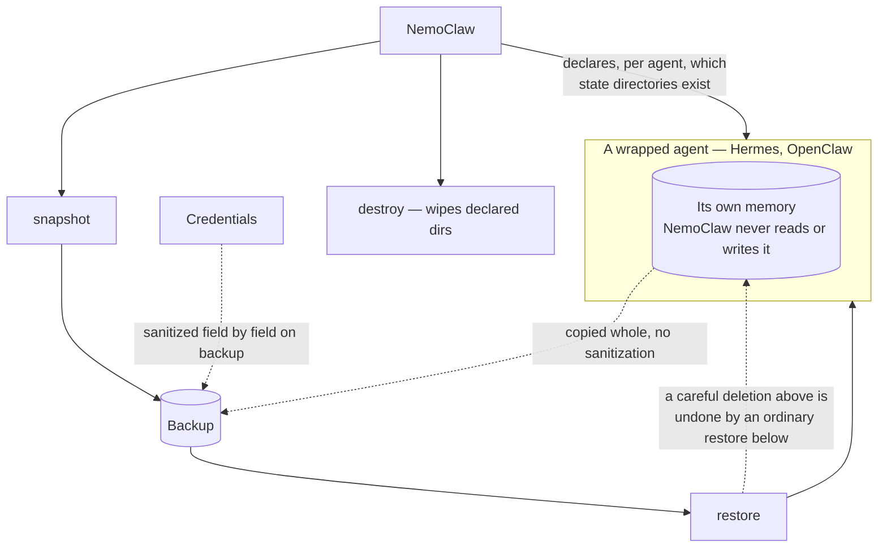

## 1. Executive Summary

NemoClaw is NVIDIA's Apache-2.0 "Reference Stack for Sandboxed AI Agents in
OpenShell". It stores no memories of its own — nearly every occurrence of
"memory" in its TypeScript is RAM: Docker limits, `nvidia-smi
--query-gpu=memory.total`, Kubernetes allocatable bytes.

It is here because of what it does to *other* systems' memory. NemoClaw wraps
[Hermes](../hermes-agent/), [OpenClaw](../openclaw/), LangChain Deep Agents Code,
[Pi](../pi/) and an experimental computer-use agent, NemoCUA, and its per-agent
manifests declare the durable state each one owns:

```yaml
# agents/openclaw/manifest.yaml          # agents/hermes/manifest.yaml
state_dirs:                              state_dirs:
  - extensions                             - memories
  - workspace                              - sessions
  - skills                                 - skills
  …                                        - plans
  - memory                                 - profiles
  - credentials                            - cache
```

That makes it an **explicit, inspectable contract for backing up, restoring and
destroying agent memory** — the operational layer memory systems usually assume
and rarely describe.

And the contract has a hole worth naming, because the atlas's own
[deletion test](../../benchmarks/#the-procedure) puts backups at the step
almost nothing survives. NemoClaw sanitizes credentials on backup:

> "the local backup is credential-sanitized (gateway section dropped,
> secret-bearing fields scrubbed)"

and it excludes machine-local auth state from snapshots entirely, with a stated
reason and an issue number:

> "Machine-local gateway auth state is wiped on destroy but never captured.
> Sanitization removes the identity key and paired-device tokens, so a
> restored copy cannot authenticate (#6852)."

— expressed in the manifest as `identity` and `devices` entries with
`backup: false`.

**Memory gets neither treatment.** It is a plain state directory: snapshotted
whole, restored whole. Nothing in the contract knows what a deleted memory is,
because at this layer a memory is a file. Delete a memory on Tuesday, restore
Monday's snapshot on Wednesday, and it is back — and the agent above has no way
to tell that happened.

That is not a defect in NemoClaw so much as the clearest statement of a problem
the atlas has been describing abstractly: **correction is a property of a store,
and backups operate below the store.**

## 2. Mental Model

NemoClaw has no epistemic model. Its state machine is about *containers*:

```text
declare    state_dirs                    durable, snapshotted, wiped by destroy
             … with backup: false        wiped by destroy, NEVER snapshotted
           state_files (+ strategy)      merge: openclaw-config, merge: key-allowlist,
                                         strategy: sqlite_backup
           user_managed_files            .env, .mcp.json — left alone

backup     nemoclaw backup-all → snapshot, credentials scrubbed
restore    state_dirs reinstated verbatim; auth dirs regenerated instead
destroy    every declared dir wiped from the durable volume
```

A memory's lifecycle at this layer is: exists in a directory, is copied, is
copied back, or is wiped with everything else. There is no record, no identity,
and no correction.



## 3. Architecture

TypeScript under `src/`, with the manifest loader and the state-directory
contract in `src/lib/agent/`. `agents/` holds one directory per wrapped agent with
a `manifest.yaml`, a Dockerfile and a config generator. `nemoclaw-blueprint/`,
`skills/`, `schemas/`, `tools/`, `fern/` docs.

The post-provisioning immutability layer called Shields — state-directory locks,
mutable-config permission repair, a config lock, an audit format and the
`state-dir-guard.py` helper — was removed from core on 2 September 2026 (#10722),
on the stated grounds that NemoClaw *"should not own post-provisioning
immutability as an inherent product concept"*. The state contract survives it:
the manifest loader derives portable and machine-local state from one
`state_dirs` declaration and rejects the retired `runtime_auth_state_dirs` key
with a message pointing at `backup: false`.

### Deployment and ergonomics

Containers, an OpenShell target, Kubernetes awareness, GPU inventory via
`nvidia-smi`. This is infrastructure: the ergonomics question it answers is not
"how do I query memory" but "how do I run somebody's agent without letting it
reach the host, and put its state back afterwards".

## 4. Essential Implementation Paths

### A declared state contract, per agent

Each wrapped agent's manifest enumerates what it owns and how each piece is
treated. The categories are the interesting part: durable-and-snapshotted,
durable-but-never-snapshotted, files with a named restore strategy
(`merge: openclaw-config`), and files the user manages that the stack will not
touch.

Most memory systems have all of this implicitly — a directory, and
whatever the operator's backup tool does. Writing it down per agent means
"what happens to memory on restore" has an answer you can read rather than
discover.

### Auth state excluded because restoring it is worse than losing it

`identity` and `devices` stay in `state_dirs` so `destroy` wipes them, but carry
`backup: false`, because a sanitized copy would restore an identity without its
key and paired devices without their tokens (issue #6852). The same flag keeps
Hermes' machine-local `hooks` and OpenClaw's legacy `plugins` and profile state
out of snapshots, each with a comment saying why.

The reasoning generalizes past auth: **some state is cheaper to regenerate than
to restore, and restoring a partially-scrubbed copy of it is worse than having
none.** Memory systems rarely ask which memories that applies to. Derived
memory — summaries, profiles, embeddings — is exactly the category that is
regenerable from evidence, and snapshotting it may be buying nothing while
guaranteeing that a stale derivation returns.

### Scar tissue with issue numbers

Comments cite the bug that produced them: #6852 for the auth-restore
corruption, #5027 for `backup-all` snapshotting the data directories while
dropping `openclaw.json`, "so they were lost on rebuild", and #7200 for a legacy
Hermes dashboard location kept in snapshots while startup migrates it. A comment naming an issue is a decision that survived contact with production, and the most reliable signal a repository offers about why a line is the way it is.

### Restore strategies that refuse unknown keys

Two strategies arrived with the newer agents. Deep Agents Code and Pi restore
their settings files with `merge: key-allowlist`: the manifest lists the keys a
user owns with a type, a length or an enum, and *"unknown, privileged, and
security-sensitive backup keys are not restorable and are dropped"*. And Hermes'
SQLite databases — `runtime/state.db`, the cron execution ledger, the Discord
recovery ledger — are captured with `strategy: sqlite_backup`, SQLite's online
backup API, so a snapshot is a consistent database rather than a copied file with
its WAL left behind. Neither applies to memory directories, which are copied whole.

### What it does not do

There is no memory service offered to the sandboxed agents, no shared store, no
retrieval, no scope model beyond directory ownership. NemoClaw governs the box.
The product page is consistent with the code, attributing the "skills-and-memory
loop" to Hermes rather than to itself — no overclaiming to flag.

## 5. Memory Data Model

None. A memory is a path inside a declared directory.

The absence that matters is not on this list but implied by it: because the
contract operates on directories, it cannot express *don't restore this
particular memory*. Sanitization exists and works — on credentials, by field.
Nothing equivalent exists for memory content, and nothing could without the
layer above exposing what was deleted.

## 6. Retrieval Mechanics

None.

## 7. Write Mechanics

None of its own. Snapshot, restore and destroy are the write operations, and
they operate on whole directories.

### Operational cost

No model calls, no memory pipeline. The costs are container and volume
management, and the snapshot size is whatever the wrapped agent's memory has
grown to — with no visibility into it from this layer.

## 8. Agent Integration

Hermes, OpenClaw, LangChain Deep Agents Code, Pi and NemoCUA, each with a
manifest, a Dockerfile and config generation, sandboxed in OpenShell. Pi's
manifest declares `sessions`, `prompts` and `themes` as portable state; NemoCUA
declares none.

## 9. Reliability, Safety, and Trust

Strengths:

- **An explicit, per-agent state contract**, including memory, that can be read
  rather than inferred.
- **Credential sanitization on backup**, by field.
- **Auth state excluded from snapshots on purpose**, with the failure it
  prevents named.
- **Named restore strategies** for config files rather than blind overwrite.
- **A manifest loader that validates the state contract**, rejecting overlapping
  paths and the retired auth-state key.
- **Typed key allowlists and consistent SQLite captures** for restore.
- **Issue numbers in comments** for the two decisions most likely to look
  arbitrary later.
- **No overclaiming** — the product page credits memory to the wrapped agents.

Gaps:

- **Memory is snapshotted and restored verbatim**, so a restore reinstates
  deleted memories and nothing above is told.
- **No per-record sanitization** for memory, only for credentials.
- **No visibility into memory size or growth** from the layer that snapshots it.
- **It cannot fix what it wraps**: the agents it sandboxes have no tombstones, so
  even a perfect backup contract would preserve values those agents had already
  failed to forget.

## 10. Tests, Evals, and Benchmarks

A `test/` tree and per-module tests; the Shields tests went with Shields.
`src/lib/agent/state-directory-contract.test.ts` asserts that portable and
machine-local state derive from one declaration and that OpenClaw's
authentication state and Hermes' hooks stay out of snapshots. Nothing was run for
this review, and no memory-related test exists because there is no memory.

The test this atlas would want is one the repository is well placed to write:
snapshot an agent, delete a memory, restore, and assert something. Today the
assertion would have to be that the memory came back.

## 11. For Your Own Build

### Steal

- **Declare the state contract per agent**, in a file, distinguishing what is
  snapshotted, what is wiped, what is regenerated and what the user owns. Most
  systems leave this to whoever writes the backup script.
- **Exclude state that is cheaper to regenerate than to restore**, and say why.
  A partially-sanitized restore can be worse than a clean regeneration.
- **Sanitize by field on backup**, not by hoping the backup is private.
- **Give restore a named strategy** per file — merge, replace, skip — rather than
  a default overwrite.
- **Restore settings through a typed key allowlist** and drop what is not on it,
  rather than merging a backup's unknown keys back in.
- **Cite the issue number** in the comment for any decision that will look
  arbitrary in a year.

### Avoid

- **Treating memory as an ordinary directory in a backup contract.** Credentials
  get field-level sanitization here and memory does not, which means the most
  carefully made deletion above is undone by an ordinary restore below.

### Fit

Read this if you operate agents rather than build memory for them: it is a
clear statement of what memory looks like from underneath, and
the state-contract idea is worth copying whatever your agent stores. Do not read
it as a memory system — it has none, and its own product page correctly credits
memory to the agents it wraps.

## 12. Open Questions

- Is there any mechanism by which a wrapped agent can tell NemoClaw that a
  memory must not be restored?
- Would excluding derived memory from snapshots — the same argument used for
  auth state — be safe, given it is regenerable from retained evidence?
- Does `destroy` reach snapshots, or only the durable volume?
- How large do the memory directories get, and does anything watch?

## Appendix: File Index

- State contracts: `agents/openclaw/manifest.yaml` (`state_dirs`,
  `runtime_auth_state_dirs`, `state_files`, `user_managed_files`),
  `agents/hermes/manifest.yaml` (`state_dirs` including `memories`).
- Manifest loading and the state contract: `src/lib/agent/defs.ts`,
  `src/lib/agent/state-directory-contract.test.ts`; `agents/pi/manifest.yaml`,
  `agents/langchain-deepagents-code/manifest.yaml` (`merge: key-allowlist`).
- Hardware inventory, where "memory" means RAM: `src/lib/onboard.ts`.
- Product page: <https://www.nvidia.com/en-us/ai/nemoclaw/>.

## History

**2026-09-15** — [`be46805b51b0d626466538e9f8fe56c8ad157549`](https://github.com/NVIDIA/NemoClaw/commit/be46805b51b0d626466538e9f8fe56c8ad157549) — 2,121 commits on, 2026-09-15. Screened before reading: one auto-run surface (`.gitmodules`), three build-time execution points, three unpinned surfaces and six dependency surfaces inside the cooldown; nothing was installed or run. Still no memory of its own, and the finding stands: `memory` in OpenClaw's manifest and `memories` in Hermes' are ordinary backed-up state directories, restored whole. What changed around it: Shields — the state-directory locks, config-permission repair, config lock, audit format and `state-dir-guard.py` the first reading described — was removed from core (#10722); `runtime_auth_state_dirs` became per-directory `backup: false`, and the loader rejects the old key; Pi and NemoCUA joined the wrapped agents; settings restore through typed key allowlists; and Hermes' SQLite state is captured with the online backup API. Corpus-ranking sentences were rewritten. No mark changes.

**2026-07-28** — [`02b59e5dc1c995cd47574af5eafb23395959ea03`](https://github.com/NVIDIA/NemoClaw/commit/02b59e5dc1c995cd47574af5eafb23395959ea03) — first reading.
