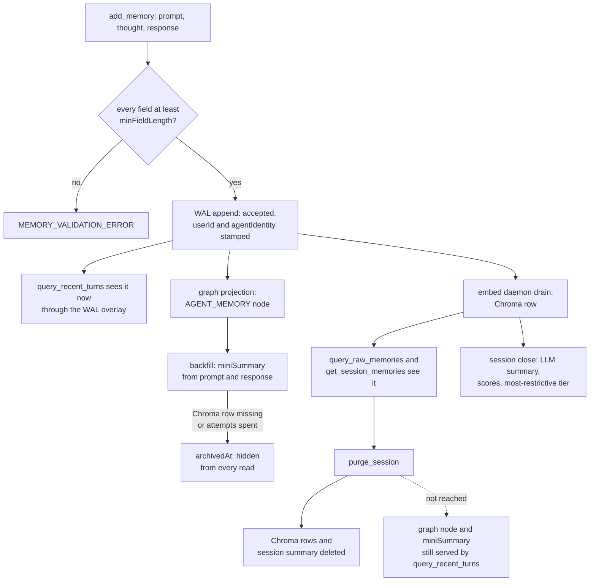

## 1. Executive Summary

Neo Agent Brain is the Agent OS behind the AI maintainers of the Neo.mjs
framework: MCP services for memory, a repository knowledge base, GitHub
workflow, peer messaging and a live-app bridge, run by an orchestrator daemon.
Its **Memory Core** stores every agent turn — prompt, private thought and
response — in a write-ahead log, then projects it into Chroma for semantic
recall and a SQLite graph for recency. What is notable is how exactly the
write path reports itself: acceptance, recency visibility and semantic
visibility are separate fields on every `add_memory` response. What is weak is
deletion and privacy at the edges: `purge_session` misses the graph, and the
thought gate covers one read of three.

This report covers the Memory Core: raw turns, session summaries and the read
paths over them. The mailbox, wake routing, presence, knowledge base and the
REM graph pipeline share the server and the stores; they appear only where
they touch a memory's lifecycle.

The code arrived here from `neomjs/neo`. The repository was created on
23 August 2026 with a first commit that records the move
(`neomjs/neo#17640`), and neo commit
[`c623b2f63ce0fbb2291801791cdb75cd80607386`](https://github.com/neomjs/neo/commit/c623b2f63ce0fbb2291801791cdb75cd80607386)
removed 257 `memory-core` files from neo on 26 August 2026. The `neo.mjs`
dependency the Brain installs supplies only the class system and utilities;
the memory services import `neo.mjs/src/core/Base.mjs` and nothing
memory-specific.

Two marks. `scope_enforced`: every row carries a `userId` taken from the
transport, the recency read always filters on it, and the semantic and session
reads filter on it under the `private` policy. The shipped `team` default is a
declared deployment-wide scope, so a default deployment shares every turn
across its maintainers. `negative_eval`: a Dockerised
integration case asserts that one identity's sentinel stays out of another's
private semantic recall. Section 9 names the five withheld.

## 2. Mental Model

A memory is one turn. The agent is told to call `add_memory` *"at the end of
every turn, before generating your final response"*
(`ai/mcp/server/memory-core/openapi.yaml:804`). Nothing is extracted from it
at write time; the turn is stored verbatim and is a belief from the moment the
WAL append returns.

**Visibility arrives in two steps, and the system says which.** The WAL append
is durable acceptance (`MemoryService.mjs:631-645`). `query_recent_turns`
sees the turn at once, through an overlay of graph-pending WAL rows. Semantic
recall sees it only after the embed daemon drains it into Chroma, and the
response's `visibility` envelope reports `recencyQueryable`,
`semanticQueryable` and the drain depth rather than an ETA
(`MemoryService.mjs:744-768`). The tool description tells the agent not to
retry, because a retry stores a second copy.

**Derived layers accrete on the turn.** A backfill writes a one-line
`miniSummary` onto the graph node from prompt and response only, never the
thought (`MemoryService.mjs:2270-2280`, `:2363`). When a session closes, an
LLM summarises all its turns into a title, category and four 0-100 scores,
tagged with the most restrictive author tier among them
(`SessionService.mjs:791-851`).

**A memory stops being served in two ways.** `archivedAt` hides it from every
read and is reversible. `purge_session` deletes the session's Chroma rows and
summary. Nothing edits a turn, and nothing expires one.

**Trust is a property of the author, not of the memory.**
`resolveMemoryTrustTier` looks the row's `agentIdentity` up in a table seeded
in source — `@tobiu` is `owner`, the AI maintainers are `peer-trusted`, anyone
else `unclassified` (`MemoryService.mjs:441-443`;
`ai/graph/identityRoots.mjs:58-67`). Every turn from one author has the same
tier for as long as the table does.

## 3. Architecture

The Brain is a Node 24 package of ES modules written in the Neo.mjs class
system. The Memory Core is an MCP server (`ai/mcp/server/memory-core/`) whose
52 operations are declared in `openapi.yaml` and bound one-to-one to service
methods in `toolService.mjs`. It serves Streamable HTTP with OIDC bearer
tokens, or stdio with an identity resolved at boot
(`ai/mcp/server/shared/services/RequestContextService.mjs:144-168`).

Three stores hold a turn. The WAL is daily JSONL segments with separate embed
and graph marker files; reconciled segments beyond `memoryWal.retentionLimit`
(30) are pruned (`ai/services/memory-core/helpers/memoryWalStore.mjs:161-231`,
`:469-500`). Chroma holds the `memory` and `session` collections, embedded by
a local `qwen3-embedding` model by default or by Gemini. The graph is a SQLite
database of JSON `Nodes` and `Edges` (`ai/graph/storage/SQLite.mjs`), holding
`AGENT_MEMORY`, `SESSION_SUMMARY`, identity, concept and mailbox nodes.

The orchestrator daemon owns background work: the embed daemon
(`ai/daemons/embed/`), the summariser script it spawns
(`ai/daemons/orchestrator/taskDefinitions.mjs:378`), the temporal-summary
daemon and the REM extraction pipeline. Chroma itself is orchestrator-owned;
the Memory Core only connects
(`ai/services/memory-core/lifecycle/ChromaLifecycleService.mjs:8`, `:42`).

### Deployment and ergonomics

Running it needs Node 24, a Chroma server, the orchestrator, and a chat and
embedding model — local Ollama or an OpenAI-compatible endpoint by default,
Gemini by environment variable. Host Edge runs from the root package with
`npm run ai:host-edge`; Container Cloud is a separate `cloud/` package and a
Docker Compose stack. `npm install` runs a `prepare` script that materialises
skills and config overlays. Storing a turn needs no API key, because the WAL
append has no model on its path. The WAL is readable JSONL and the graph is
one SQLite file; Chroma is not hand-repairable, which is why the project ships
a restoration runbook and an integrity monitor.

## 4. Essential Implementation Paths

**Capture.** `add_memory` → `MemoryService.addMemory`
(`ai/services/memory-core/MemoryService.mjs:546-779`). The config guard and
`getInvalidMemoryFields` reject a missing or short field (`:547-573`,
`:1165-1171`). The identity is `requestIdentity || userId || agent`
(`:598-603`). `appendWalMemory` writes the payload (`:631-645`),
`_scheduleMemoryGraphProjection` queues the node (`:649-657`), and
`pruneReconciledWalSegments` runs best-effort (`:664-668`).

**Projection and embedding.** `_projectMemoryToGraph` upserts the
`AGENT_MEMORY` node with the archive marker replayed, links `AUTHORED_BY` when
an identity node exists, and appends a graph marker (`:1012-1042`). The embed
daemon calls `collection.add` with no vectors and marks records reconciled
(`ai/daemons/embed/drainCycle.mjs`).

**Semantic retrieval.** `queryMemories` (`MemoryService.mjs:2452-2651`):
quarantine check, policy resolution, Chroma `query`, an unconditional
`archivedAt` drop (`:2542-2550`), the legacy and trust post-filter
(`:2552-2567`), and the optional concept walk, re-authorised per record by
`ai/services/memory-core/conceptWalkMemoryGate.mjs`.

**Recency retrieval.** `queryRecentTurns` (`MemoryService.mjs:1669-1770`)
fails closed without a `userId` (`:1684-1686`), reads WAL-pending rows before
the graph to avoid a race (`:1725`), and runs one SQL query over
`AGENT_MEMORY` nodes (`:1727-1740`).

**Session summary.** `onSessionClosed` queues a job
(`ai/mcp/server/memory-core/Server.mjs:684-690`); `summarizeSession` pages the
session's rows, calls the chat model, and upserts the summary into Chroma and
a `SESSION_SUMMARY` graph node (`SessionService.mjs:531-851`).
`SummaryService.querySummaries` reads it (`SummaryService.mjs:391-544`).

**Delete and archive.** `purge_session` → `SessionService.purgeSession`
(`SessionService.mjs:1645-1719`). `archiveMemoryNode`
(`MemoryService.mjs:2161-2190`) is called by the backfill;
`archiveMemoriesByAgentIdentity` (`:1455-1537`) only by tests.

## 5. Memory Data Model

A Chroma memory row carries `prompt`, `response`, `thought`, `sessionId`,
epoch-ms `timestamp`, `type: 'agent-interaction'`, and optionally `userId`,
`agentIdentity`, `agent`, `model`, `amountToolCalls` and `toolsUsed`
(`MemoryService.mjs:584-610`). The document is the three fields composed into
one text (`helpers/turnDocumentText.mjs`). The graph node holds
`agentIdentity`, `userId`, `sessionId`, an ISO `timestamp`, and later
`miniSummary`, `archivedAt` and `archivedReason`.

Scope is two keys. `userId` is the tenant: a GitHub login in stdio, an OIDC
claim over HTTP. `agentIdentity` is the author node, `@`-prefixed. A session
summary is tagged `shared` when any core-swarm maintainer took part, and
otherwise with the request's `userId`
(`RequestContextService.mjs:109-128`). The summariser runs as an
orchestrator-spawned script with no request context
(`ai/scripts/lifecycle/summarize-sessions.mjs`), so a summary with no
core-swarm participant is written without a `userId`.

There is one timestamp per row and no validity interval. There is no version
chain, no supersession and no status beyond `archivedAt`. Episodic turns,
session summaries, temporal roll-ups and concept nodes are separate layers;
only turns and session summaries are served by the memory tools.

## 6. Retrieval Mechanics

**Semantic.** Chroma similarity over the composed turn text, `nResults`
default 10, relevance reported as `1 / (1 + distance)`
(`MemoryService.mjs:2571-2595`). A caller can pass `sessionId`,
`memorySharing`, `minTrustTier` and `conceptWalk` (`QueryMemoriesRequest` in
`openapi.yaml`). With a post-filter active the query asks Chroma for five
times `nResults` and cuts back (`:2504-2506`). Every result is returned whole:
`prompt`, `thought` and `response`.

**Recency.** Reverse-chronological `(timestamp, id)` pages of at most 100,
compact by default (`miniSummary`, or a 200-character prefix of prompt and
response when none exists yet), or full content joined from Chroma or the WAL
(`MemoryService.mjs:1786-1891`). Asking for a peer's turns forces the public
projection, which drops `thought` (`:1704`).

**Session listing.** Every row of one session, chronological, paginated after
the fetch (`:1322-1436`).

**Context frontier and pre-brief.** `get_context_frontier` and
`pre_brief_session` walk the graph to summaries and weight each by
`getFrontierTrustWeight`, a multiplier from 1 down to 1/8 by tier
(`:430-434`). Both always filter the Chroma fetch to the caller's `userId`
plus `shared`, whatever the policy.

Nothing is injected automatically. The harness hooks under
`ai/scripts/lifecycle/hooks/` record turn presence and lane state, and none
calls a memory read. Recall is the agent's choice, prompted by the tool
descriptions and the Brain's skills.

## 7. Write Mechanics

Writes are agent-driven and synchronous only up to the WAL append. The
validation gate rejects empty fields as *"the corrupted-memory class"*
(`MemoryService.mjs:566-573`); `minFieldLength` defaults to 1. There is no
deduplication, no extraction and no conflict check: two identical turns are
two memories, and the tool description says a retry *"stores a second copy"*.

Agent-generated content is stored as the agent wrote it, including `thought`.
Nothing filters injected or malicious text on the way in; read responses carry
a `_channelSeparation` string declaring the content data, not commands.

### Operational cost

The agent blocks on one local JSONL append plus bounded post-WAL work: a
turn-presence write and a visibility read, each under a budget
(`MemoryService.mjs:690-768`). No model call is on the path. The lag to
semantic visibility is the embed drain's cadence, which the code deliberately
does not predict; recency visibility is immediate. The mini-summary backfill
calls the chat model once per un-summarised turn, bounded by a run budget and
a batch limit. Session summarisation reads every turn of a session once per
summary, and a drift sweep re-summarises a session whose turn count changed.
Nothing is injected per turn, so there is no prompt-cache effect.

## 8. Agent Integration

The Memory Core is an MCP server that a harness attaches beside the knowledge
base, GitHub workflow and Neural Link servers. Memory verbs are `add_memory`,
`get_session_memories`, `query_raw_memories`, `query_recent_turns`,
`query_summaries`, `get_all_summaries`, `explore_memory_history`,
`purge_session`, `resume_session` and `set_session_id`. The OpenAPI root
declares tiers — `read` and `write` visible by default, `admin` operator-only
— but the tier filter applies only to the `harness-embedded` projection
(`ai/mcp/ToolService.mjs:782-790`). A frontier harness passes no projection
and sees `purge_session` (`openapi.yaml:2976-2977`).

The agent has full agency over what it stores and when it reads. Identity is
not the agent's to choose on the authenticated paths: the stdio server
resolves it once at boot from `NEO_AGENT_IDENTITY` or `gh api user`, and the
HTTP server from the bearer token. Adapting the server to another agent means
adopting the whole plane — orchestrator, Chroma, models — because the embed
drain and the summariser live there.

## 9. Reliability, Safety, and Trust

**`purge_session` does not reach the graph.** It tombstones pending WAL
records, deletes the session's Chroma memory rows and summary, and deletes its
`SummarizationJobs` row (`SessionService.mjs:1654-1698`). The `AGENT_MEMORY`
nodes stay, and `query_recent_turns` selects from them with no check that the
Chroma row still exists (`MemoryService.mjs:1727-1740`). A turn summarised
before the purge keeps its `miniSummary` on the node, and the default compact
recency read returns it (`:1846-1852`). An un-summarised node is picked up by
the backfill, finds no content and is archived as `no-content` (`:2354-2358`),
so that half cleans itself. The `summary_<sessionId>` graph node, named with
the summary's title, also remains.

**The thought gate covers one read in three.** `query_recent_turns` forces the
public projection for a peer, and a spec proves it with a canary and a
positive control (`QueryRecentTurns.spec.mjs:733-790`).
`query_raw_memories` and `get_session_memories` return `thought` on every row
the scope admits (`MemoryService.mjs:1393`, `:2588`); under the shipped `team`
default that is every maintainer's.

**The sharing policy clamps rather than trusts.** `resolveSharingPolicy` ranks
`private < legacy < team` and returns the configured default when a caller
asks for something wider (`helpers/resolveSharingPolicy.mjs:57-76`). The
helper returns a `clamped` flag for a caller-visible surface; all three call
sites destructure only `policy`, so a clamped caller is not told.

**The `team` default is a declared boundary, and the mark is kept on that
reading.** The configuration names the Chroma collection as the deployment
boundary and says a deployment co-locating organisations must set `private`
(`configBase.mjs:894-906`); the read path repeats it
(`MemoryService.mjs:2489-2495`). Under `private`, `query_raw_memories` and
`get_session_memories` put `{userId}` into the Chroma `where`
(`:1344-1363`, `:2486-2513`), and the concept walk applies the same rule per
record (`conceptWalkMemoryGate.mjs:89-97`). No read is structurally unable to
carry the key. The limit is who chooses: `query_raw_memories` can be narrowed
per call, while `get_session_memories` leaves `memorySharing` undeclared on
purpose, so on a default plane only the operator can scope the session listing
(`ai/scripts/lint/lint-openapi-service-parity.mjs:171`).

**Policy semantics differ by collection.** For raw turns, `team` drops the
predicate entirely (`MemoryService.mjs:2489-2495`). For summaries, `team` runs
the additive post-filter — own, `shared` and untagged
(`SummaryService.mjs:431`, `:477`) — though the config comment says `team`
reads every maintainer's summaries (`configBase.mjs:896-905`). Under
`private`, a summary the script wrote without a `userId` matches no caller's
where clause.

**The author sets the tier.** With no resolved identity, `add_memory` falls
back to the caller's `agent` argument for `agentIdentity` (`:600`), so
`agent: 'tobiu'` stamps `@tobiu` and reads back as `owner`.

**Withheld marks.** `trust_state`: the tier is resolved from a hardcoded
author table at read time, nothing moves a memory between states, and it
filters only when a caller passes `minTrustTier`. `tombstone`: `archivedAt` is
keyed on the record, and `purge_session` is a hard delete. `audit_log`: the
heal-event ledger records store repairs (`helpers/healEventLedgerStore.mjs`),
and neither purge nor archive writes to it; the WAL records adds and is
pruned. `bitemporal`: one timestamp. `human_review`: no memory waits for
anyone. `archiveMemoriesByAgentIdentity`, documented as consumed by Fleet
agent removal, has no caller outside `MemoryService.mjs` and its tests.

## 10. Tests, Evals, and Benchmarks

The suite is Playwright throughout: 814 spec files, 145 under memory-core
paths. Unit specs run in `brain-unit.yml`; integration specs run against a
Docker Compose stack in `brain-integration.yml` and skip when Docker is
absent.

The memory tests guard against their own vacuity. `QueryRecentTurns.spec.mjs`
covers read-after-write, tenant fail-closed, peer projection, cursor
stability, and the thought canary, whose comment records that its first
version was vacuous. `CrossTenantIsolation.integration.spec.mjs` and
`TeamPrivateRetrieval.integration.spec.mjs` write sentinel turns under
separate identities and assert both inclusion and exclusion under `private`
(`TeamPrivateRetrieval.integration.spec.mjs:476-502`).
`MemoryService.ArchiveByIdentity.spec.mjs` asserts an archived row leaves the
semantic and session reads and returns after unarchive.

Gaps. `QueryRecentTurns.spec.mjs:106-118` (tenant B sees nothing) has no
positive control for tenant A. No case purges a session and then reads
`query_recent_turns`. No test asserts `thought` is withheld from a peer on
`query_raw_memories`, because it is not. No retrieval-quality evaluation or
benchmark result is committed. No paper is cited, and there is no
`CITATION.cff`.

## 11. For Your Own Build

### Steal

- **Report acceptance and searchability as separate fields.** A write that
  returns only "added" invites a semantic read-back, an empty result and a
  false outage. Per-axis visibility plus a pollable drain depth closes it.
- **Make the durable append the only acceptance gate.** Everything
  model-dependent runs after it, and a read overlay serves pending rows so
  recency never waits on the embedder.
- **Let a request narrow scope and never widen it.** Rank the policies, clamp
  to the configured default, and keep the helper pure so both deployment
  shapes are testable.
- **Fail a cross-session read closed when the tenant is unknown.**
  `query_recent_turns` returns nothing rather than everything.

### Avoid

- **A delete that knows one store.** When a turn fans out to a WAL, a vector
  store and a graph, the delete must enumerate all three, and its test must
  read through every surface afterwards.
- **A privacy projection on one read path.** A field withheld from peers on
  recency and returned on search is not withheld.
- **Author-derived trust with an argument fallback.** If the identity can come
  from the call, so can the trust tier.

### Fit

This is institutional infrastructure for a standing team of agents that
already runs an orchestrator, a Chroma server and local models, and wants every
turn kept verbatim. It suits a group that treats its agents' reasoning as the
asset and can afford to operate the plane. A single developer wanting memory
for one coding agent should walk away: the Memory Core cannot be lifted out
without its daemons, and verbatim turns with no extraction make the store
large and the recall noisy. A multi-tenant deployment must set `private` and
accept that summaries then behave differently from turns.

## 12. Open Questions

- How often does a purged session's `miniSummary` surface in a live recency
  feed, and does anything outside the tree prune orphaned `AGENT_MEMORY`
  nodes?
- Is the `team` default's exposure of `thought` intended, given the recency
  path's explicit peer gate?
- What does Fleet agent removal call in place of
  `archiveMemoriesByAgentIdentity`, which has no caller here?
- How large does the store grow per maintainer-day, and what is the embed
  drain's lag under the orchestrator's model contention?

## Appendix: File Index

- **Schema and storage:** `ai/services/memory-core/helpers/memoryWalStore.mjs`,
  `ai/services/memory-core/managers/StorageRouter.mjs`,
  `ai/services/memory-core/managers/ChromaManager.mjs`,
  `ai/graph/storage/SQLite.mjs`, `ai/graph/identityRoots.mjs`.
- **Write path:** `ai/services/memory-core/MemoryService.mjs:546-1042`,
  `ai/daemons/embed/drainCycle.mjs`.
- **Retrieval:** `MemoryService.mjs:1322-1436`, `:1669-1891`, `:2452-2651`,
  `ai/services/memory-core/SummaryService.mjs`,
  `ai/services/memory-core/conceptWalkMemoryGate.mjs`,
  `ai/services/memory-core/helpers/resolveSharingPolicy.mjs`.
- **Summaries and background:** `ai/services/memory-core/SessionService.mjs`,
  `ai/scripts/lifecycle/summarize-sessions.mjs`,
  `ai/daemons/orchestrator/taskDefinitions.mjs`.
- **Delete and archive:** `SessionService.mjs:1645-1719`,
  `MemoryService.mjs:1455-1640`, `:2161-2190`.
- **MCP and identity:** `ai/mcp/server/memory-core/openapi.yaml`,
  `ai/mcp/server/memory-core/toolService.mjs`,
  `ai/mcp/server/memory-core/Server.mjs`, `ai/mcp/ToolService.mjs`,
  `ai/mcp/server/shared/services/RequestContextService.mjs`.
- **Tests:** `test/playwright/unit/ai/services/memory-core/QueryRecentTurns.spec.mjs`,
  `SessionService.spec.mjs`, `MemoryService.ArchiveByIdentity.spec.mjs`,
  `resolveSharingPolicy.spec.mjs`,
  `test/playwright/integration/CrossTenantIsolation.integration.spec.mjs`,
  `test/playwright/integration/TeamPrivateRetrieval.integration.spec.mjs`.

### Recorded searches

Checked against the checkout at the pinned revision.

- `rg -n 'AGENT_MEMORY|removeNodes|DELETE FROM Nodes' ai/services/memory-core/SessionService.mjs` — matches only read queries and comments; `purgeSession` (lines 1645-1719) touches no graph node.
- `rg -n "DELETE FROM Nodes|removeNodes\(" ai --glob '!*test*'` — the graph import reset, the database restore, NL telemetry expiry, the temporal-summary prune and the archive-marker removal; none deletes `AGENT_MEMORY` nodes by session.
- `rg -n -i 'archiveMemor|unarchiveMemor' --glob '!test/**' .`, excluding `MemoryService.mjs` — no match.
- `rg -n 'clamped' ai --glob '!*test*'` and `rg -n 'resolveSharingPolicy\(' ai --glob '!*test*'` — three call sites, each destructuring `{policy}` only.
- `rg -n 'thought' ai/mcp/server/memory-core/toolService.mjs ai/mcp/ToolService.mjs` — no match; the tools bind service methods directly.
- `rg -n 'query_raw_memories|query_recent_turns|queryMemories|queryRecentTurns|query_summaries|pre_brief_session' ai/scripts/lifecycle/hooks` — no match.
- `rg -n -i 'ledger|audit' ai/services/memory-core/MemoryService.mjs ai/services/memory-core/SessionService.mjs` — one comment; no ledger write.
- `grep -rliE 'arxiv|bibtex|@article|@misc|doi\.org' . --exclude-dir=.git --exclude-dir=node_modules` — no match, and no `CITATION.cff`.

## History

**2026-10-01** — [`83c0e09eaffd0474664e846f684ef9d18beb67cb`](https://github.com/neomjs/neo-agent-brain/commit/83c0e09eaffd0474664e846f684ef9d18beb67cb) — audited at the same commit; `scope_enforced` kept. The shipped `team` policy is a declared deployment-wide scope: the configuration names the Chroma collection as the boundary and requires `private` for co-located organisations (`configBase.mjs:894-906`). Under `private`, the semantic and session reads put `{userId}` into the Chroma query (`MemoryService.mjs:1344-1363, 2486-2513`), and the recency read always does, so no read is unable to carry the key. The evidence record now states the limit: on a default plane every maintainer's turns are readable, and only the operator can scope `get_session_memories`.

**2026-09-30** — [`83c0e09eaffd0474664e846f684ef9d18beb67cb`](https://github.com/neomjs/neo-agent-brain/commit/83c0e09eaffd0474664e846f684ef9d18beb67cb) — first reading, at the head of `dev`, a commit dated 29 September 2026. Two marks, `scope_enforced` and `negative_eval`. Screened before reading: no auto-run surface, one build-time execution point (the npm `prepare` script), eight dependency files inside the cooldown — every file in a depth-1 clone dates to the tip — and five unpinned surfaces, including `neo.mjs` from a GitHub archive; no agent-instruction file in the tree. Read with `grep`, `sed` and `rg`; nothing installed, built or run.
