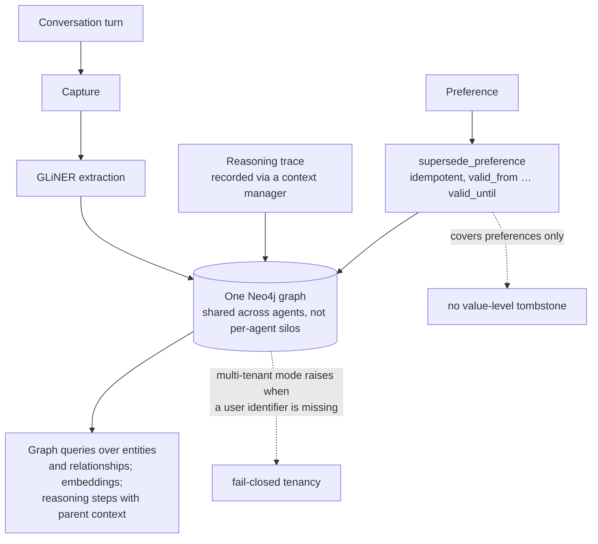

## 1. Executive Summary

Neo4j Labs' agent-memory is an Apache-2.0 Python package of about 45,000 lines
under `src/neo4j_agent_memory/`, positioned as "a graph-native memory system for
AI agents… let your agents learn from their own reasoning — all backed by
Neo4j". It complements [Graphiti](../graphiti/), which is also Neo4j-adjacent and
already in this atlas, but is a different package aimed at agent tooling rather
than at temporal knowledge graphs.

Three tiers: short-term, long-term, and **reasoning**. The third is the reason to
read it.

`memory/reasoning.py` records "reasoning traces and tool usage" — and it records
them through a **context manager**, which means the interesting case is handled
without anyone remembering to handle it:

```python
self._outcome = str(exc_val) if exc_val else f"Error: {exc_type.__name__}"
```

When a traced task raises, the exception becomes the trace's outcome on the way
out. **Failures are stored by default.** Nearly every procedural-memory system in
this atlas records successes — [Voyager](../voyager/) writes a skill only after
verified execution, and the
[skills as procedural memory](../../patterns/skills-as-procedural-memory/)
pattern is built around that gate. Storing what *did not* work is the other half,
and it is rare: [Verel](../verel/) has a failure ledger and little else here does.

The outcome is structured rather than a string:

```python
class TraceOutcome(BaseModel):
    """Structured outcome attached to a reasoning trace at completion time."""
    success: bool
    summary: str
    # plus an indexable error kind, structured related entities, and metrics
```

with the docstring noting it "lets a caller attach an indexable error kind…
while remaining fully back-compatible with the legacy string + boolean API". An
*indexable error kind* makes "what else failed this way" a query.

Two more things are worth a builder's attention. Multi-tenancy is **fail-closed
on the write path** — `_enforce_multi_tenant` (`memory/long_term.py:431`)
*"raise[s] if multi-tenant is on and `user_identifier` is missing"*, so a
preference cannot be stored unattributed once the mode is on. And preferences
carry `valid_from` / `valid_until` with a `supersede_preference` that is
explicitly *"idempotent: re-running on an already-superseded preference is a"*
no-op.

**Which read path carries the scope key is worth stating exactly, because only
one does.** `get_preferences_for` (`:830`) takes a `user_identifier` and compiles
it into the pattern — `MATCH (u:User {identifier: $user_identifier})-[:HAS_PREFERENCE]->(p:Preference)`
(`:854`) — so the stored key reaches the query and `scope_enforced` is earned
there. The semantic surface does not: `search_entities` (`:1073`),
`search_preferences` (`:1139`) and `get_context` (`:1260`) accept no user
parameter at all, and the last of those is the one whose docstring reads *"Get
long-term context for LLM prompts"*. So the boundary holds where a caller asks
for one user's preferences by name, and the path an agent uses to assemble its
context is unscoped. `_enforce_multi_tenant` does not close that: it is an
argument check on writes, and no amount of fail-closed writing filters a read
that never takes the key.

Reservations: bi-temporal validity and supersession apply to *preferences*, not
to every memory kind; there is no value-level tombstone; and the reasoning tier's
value depends on retrieval surfacing past failures at the moment they would help,
which was not traced.

## 2. Mental Model

| Store | Holds |
| --- | --- |
| short-term | conversation turns, recent context |
| long-term | entities, relationships, preferences — a preference carries `valid_from` and `valid_until`, and `supersede_preference(old, new)` is **idempotent** |
| reasoning | a trace of steps and tool calls; the with-block makes success *or* the raised exception the outcome on exit, recorded as `TraceOutcome{success, summary, error kind, entities, metrics}` |

Two details worth taking. Preferences are the only thing here with validity time,
and an idempotent supersede means a retried write cannot double-supersede. And the
reasoning trace cannot silently succeed: leaving the block always records an
outcome, including the exception.

All three live in **one Neo4j instance shared across agents** rather than in
per-agent stores — the stated position being a single brain rather than silos.

How a memory stops being current: a preference is superseded and its
`valid_until` closes. Nothing else has a defined end state, and nothing records
that a value was judged wrong.



## 3. Architecture

`src/neo4j_agent_memory/` — `memory/long_term.py` (2,357), `__init__.py` (1,827),
`memory/short_term.py` (1,727), `memory/reasoning.py` (1,394),
`graph/queries.py` (1,385), `extraction/gliner_extractor.py` (1,256),
`integrations/strands/tools.py` (1,014), `mcp/_tools.py` (963),
`cli/main.py` (954), `config/settings.py` (823), `extraction/pipeline.py` (787),
plus `core/`, `llm/`, `embeddings/`, `nams/`, `observability/`,
`memory/consolidation.py`, `memory/users.py`, `memory/eval.py`.

Entity extraction uses GLiNER — a local NER model — rather than an LLM call,
which puts a meaningful part of the write path outside the token budget.

### Deployment and ergonomics

Needs a Neo4j instance; there is a `docker-compose.test.yml` and a `deploy/`
tree. Beyond that it is a Python package with an MCP server, a CLI, and
integrations for AWS Strands and the OpenAI Agents SDK.

The shared-graph design is the ergonomic trade: one database to run, and every
agent sees the same entities — which is the point, and also means a mistake by
one agent is visible to all of them.

## 4. Essential Implementation Paths

### Failures recorded because the control flow records them

The context-manager shape is what makes this reliable rather than aspirational. A
system that asks callers to log failures gets failure logs proportional to
discipline; a system where `__exit__` captures the exception gets them
proportional to coverage.

The atlas has repeatedly noted that memory systems remember what worked. The
[skills as procedural memory](../../patterns/skills-as-procedural-memory/)
pattern's gate — write only on verified execution — is correct and one-sided: an
agent that has failed the same approach four times has learned nothing, because
nothing wrote it down. Here the failing path is the *default* path.

`ReasoningStepWithContext` — "a reasoning step plus its parent trace's task and
outcome" — matters for the same reason. A step retrieved without knowing whether
the attempt it belonged to succeeded is worse than useless, because it reads as
precedent.

### An indexable error kind

Attaching a typed error kind alongside the human-readable summary turns the trace
store into something queryable by failure mode rather than by text similarity.
"Show me every trace that failed with a timeout against this tool" is a graph
query; against a free-text outcome it is a guess.

The back-compatibility note is worth copying too — the structured outcome was
added without breaking the string-plus-boolean callers, which is how a schema
gets richer in a released package rather than in a rewrite.

### Fail-closed multi-tenancy

```python
def _enforce_multi_tenant(self, user_identifier: str | None) -> None:
    """Raise if multi-tenant is on and ``user_identifier`` is missing."""
```

The [scope as a first-class key](../../patterns/scope-as-a-first-class-key/)
pattern asks for scope on the read path. This adds the posture: with the mode on,
a query that forgets the tenant **fails** rather than returning the union. The
common bug in scoped stores is not a missing filter clause — it is a code path
where the filter is optional and someone omitted it.

The cost is that the guard depends on the mode being on, which is a
configuration, not a constraint.

### Bi-temporal preferences, superseded idempotently

`valid_from` is set to now on write; `valid_until` "stays null until
`supersede_preference`", which is idempotent — re-running on an already-superseded
preference does nothing. The code notes a "v0.5 bi-temporal time-travel API on
top of `valid_from` / `valid_until`".

Idempotency in a supersession path is a small thing that prevents a specific
mess: a retried consolidation pass that closes an interval twice, producing a
preference whose validity bounds no longer describe anything.

The limitation is the scope of it. Preferences get validity intervals; entities,
relationships and reasoning traces do not, so "what did we believe last March"
is answerable for one memory kind.

## 5. Memory Data Model

Conversation turns, extracted entities and relationships, preferences with
validity bounds, and reasoning traces containing steps and tool calls with
statistics.

What is absent:

- **No value-level tombstone.** A superseded preference closes an interval;
  nothing prevents the same value being re-extracted.
- **No trust state.** Outcomes describe whether a *task* succeeded, not whether a
  *fact* is believed.
- **Bi-temporality is partial** — preferences only.
- **The shared graph has no per-agent provenance** traced here, so which agent
  asserted an entity was not established.

## 6. Retrieval Mechanics

Graph queries over entities and relationships (`graph/queries.py`, 1,385 lines),
embeddings, and reasoning-step retrieval that carries parent-trace context.
`memory/eval.py` exists inside the package, and `benchmarks/` provides a runner
and metrics module.

## 7. Write Mechanics

Conversation capture into short-term memory, a GLiNER extraction pipeline into
the graph, traces written by the context manager, and a consolidation module.

### Operational cost

Entity extraction runs on a local NER model rather than an LLM, so the highest-
frequency write path costs no tokens. Trace recording is a graph write. The
consolidation path is where model cost concentrates.

No figures for extraction latency or graph growth were found, and a shared graph
across agents grows with the union of their activity rather than with any one
agent's.

## 8. Agent Integration

An MCP server, a CLI, AWS Strands tools (`integrations/strands/tools.py`, 1,014
lines), and OpenAI Agents SDK examples. The MCP tool surface is nearly a thousand
lines, so the integration is a first-class part of the package rather than a
wrapper.

### A TypeScript client, a hosted service, and one guard in two places

The largest arrival is `typescript/` — a client, not a second implementation.
`RestTransport` *"talks to the hosted Neo4j Agent Memory Service REST API"* at a
`/v1` root, so the enforcement described above stays in Python and the client
cannot weaken it by reimplementing a query badly. Integrations for Strands,
Mastra and the Vercel AI SDK arrived with it.

One surface crosses both languages and is guarded in only one. A read-only Cypher
console lets a caller run arbitrary `MATCH` against the graph, which is an escape
hatch around every scoped accessor by construction, so where the read-only check
lives is the whole question.

On the Python side it lives in one place and is shared. `is_read_only_query`
(`core/query.py:41`) is called by the direct-Bolt accessor (`:72`), by the hosted
NAMS accessor (`nams/query.py:53`) and by the MCP tool (`mcp/_tools.py:777`) —
which imports it under its old private name with a comment recording the move and
why: *"so the bolt and NAMS Cypher accessors share the same validator."* One
predicate, three surfaces, no second opinion. The Strands agent tool that exposes
the console to a model routes through the NAMS accessor, so its docstring claim
that writes are *"rejected client-side"* is accurate.

The TypeScript `QueryConsole.cypher` has no such check. It passes the string
straight to the transport, and its header states a different guarantee —
*"Hosted service only: write operations are rejected with HTTP 400"* — so the
same logical surface is defended client-side in Python and server-side in
TypeScript, by a component that is not in this repository:

```sh
grep -rn -i "readonly\|isReadOnly\|read_only" typescript/src --include="*.ts"
```

Nothing at the pinned commit but `private readonly` field modifiers. This is not
a defect in the client — a hosted service that trusts no client is the right
design, and a client-side check would be a convenience rather than a boundary.
It is a difference in what a reader of this repository can verify: the Python
guarantee is checkable here and the TypeScript one is a claim about a service
that is not.

## 9. Reliability, Safety, and Trust

**Four writes that reported success while the graph kept nothing.** Version 0.6
fixes a cluster of defects in the Bolt entity write path, and they are worth
reading as a set because the commit is right that they compound: `add_entity`
handed out an id addressing no node, and `add_relationship` then acknowledged the
write that id was used for, so the failure surfaced only as missing data much
later.

`add_entity` MERGEs on `(name, type)`, so a repeat add takes the `ON
MATCH` arm, keeps the pre-existing node's id — and returned the freshly
minted one anyway, addressing what the commit calls a ghost entity. No
second node is created, which is why the repair belongs in the return
value rather than in a caller-side name lookup.

`add_relationship` MATCHes both endpoints before MERGEing the edge, so a
pair of ids matching no node wrote zero rows and the method still returned
a `Relationship`; it now raises `NotFoundError` naming both ids and
telling the caller to use the ids stored on the nodes rather than ones
minted client-side (`memory/long_term.py:1058-1069`).

Aliases were written into the JSON metadata blob while the alias lookup
reads a top-level `aliases` property — which is what the merge query
already wrote — so an entity was never findable by an alias passed to
`add_entity`; `aliases` is now a top-level list everywhere, appended on
match, with a metadata fallback in the parser so rows written earlier
still read back. And `merge_duplicate_entities` carried subqueries for
`MENTIONS` and `SAME_AS` only, against a docstring promising that
relationships were transferred, so a merge silently dropped `RELATED_TO`
in both directions, both provenance edges and the v0.2 audit edges. All
are now copied onto the survivor tagged `migrated_from`, and *copied*
rather than moved so the merge stays reversible.

Two details generalise past this store. A write and a read that disagree about
where a field lives are the same defect as two copies of a predicate that
disagree — here the field was `aliases`, and the disagreement made a lookup
silently return nothing rather than fail. And the commit names why none of this
was caught: *"every defect here is invisible to a mocked client — the mechanism
is a real MERGE/ON MATCH."* A suite that stands in for the database cannot see a
defect that lives in the database's own semantics, which is the argument for the
integration tests the fix ships beside it — 28 unit cases and an integration file
reproducing the reported sequence.

Strengths:

- **Failures captured by control flow**, not by caller discipline.
- **Structured trace outcomes** with an indexable error kind and metrics.
- **Reasoning steps carrying their parent's outcome**, so a step is never read
  as precedent without knowing whether it worked.
- **Fail-closed multi-tenancy.**
- **Idempotent supersession** with validity bounds.
- **Local NER extraction**, keeping the frequent write path off the token budget.
- **A benchmarks tree and an in-package eval module.**
- **Schema extended back-compatibly** rather than by rewrite.

Gaps:

- **No value-level tombstone.**
- **Bi-temporality limited to preferences.**
- **No trust state on facts.**
- **A shared graph means shared mistakes** — one agent's bad extraction is every
  agent's context, and no per-agent provenance was traced.
- **The tenancy guard is conditional** on a configuration flag.

## 10. Tests, Evals, and Benchmarks

A `benchmarks/` tree with `runner.py` and `metrics.py`, an in-package
`memory/eval.py`, a `docker-compose.test.yml`, and codecov configuration.
Nothing was run for this review and no scored results were located.

The measurement this design invites is whether the reasoning tier changes
behaviour: does an agent with access to its own failed traces stop repeating an
approach? That is a before/after comparison on a fixed task set, and the trace
store is the instrument.

## 11. For Your Own Build

### Steal

- **Record traces with a context manager**, so a raised exception becomes the
  outcome on the way out. Failure memory that depends on callers remembering to
  write it will be proportional to their discipline.
- **Store the failures.** Procedural memory that only holds successes cannot stop
  an agent retrying an approach that has never worked.
- **Give outcomes an indexable error kind**, so the store is queryable by failure
  mode rather than by text similarity.
- **Attach the parent outcome to a retrieved step**, or a step from a failed
  attempt reads as precedent.
- **Make the tenancy guard raise.** A missing scope should be an error, not a
  wider result set.
- **Make supersession idempotent**, so a retried pass cannot close an interval
  twice.
- **Extract entities with a local model** where you can — it moves the highest-
  frequency write off the token budget.

### Avoid

- **Bi-temporality on one memory kind.** Preferences having validity while
  entities do not means "what did we believe then" has a partial answer, which is
  harder to reason about than none.
- **A shared graph without per-agent provenance.** One brain is the design goal;
  not knowing which agent asserted something is a cost of it that should be paid
  deliberately.

### Fit

Right when several agents should share one view of the world and you already run
Neo4j — the shared-graph position is the product, and the reasoning tier is the
best argument for it, since operational history is exactly the thing worth
pooling. Wrong when memories need trust state or durable correction: supersession
here closes an interval on a preference, and nothing stops a re-extraction
putting the old value back.

## 12. Open Questions

- Does retrieval surface past *failures* at the moment they would prevent a
  repeat, or only when queried for?
- Which agent asserted a given entity in the shared graph?
- Why do preferences get validity bounds and entities not?
- What happens to a superseded preference on the next extraction pass over the
  same conversation?
- Have the benchmarks been run, and against what?

## Appendix: File Index

- Reasoning tier: `src/neo4j_agent_memory/memory/reasoning.py`
  (`record_tool_call`, `set_outcome`, `ReasoningStepWithContext`, the
  context-manager exit).
- Trace outcome: `src/neo4j_agent_memory/schema/models.py` (`TraceOutcome`,
  `EntityRef`).
- Long-term and bi-temporality: `memory/long_term.py` (`supersede_preference`,
  `valid_from`, `valid_until`, `_enforce_multi_tenant`).
- Short-term: `memory/short_term.py`; consolidation: `memory/consolidation.py`.
- Graph: `graph/queries.py`; extraction: `extraction/gliner_extractor.py`,
  `extraction/pipeline.py`.
- Surfaces: `mcp/_tools.py`, `cli/main.py`, `integrations/strands/tools.py`.
- Evaluation: `memory/eval.py`, `benchmarks/runner.py`, `benchmarks/metrics.py`.

## History

**2026-09-17** — [`f801acc654398e5bbe5551b49af66c17d3da5d5e`](https://github.com/neo4j-labs/agent-memory/commit/f801acc654398e5bbe5551b49af66c17d3da5d5e) — re-read after 6 commits, at 0.6.0. `long_term.py` is the only anchored file and it moved, gaining 97 lines; both marks were re-derived there and hold. The window is a fix for four write-path defects in which a call reported success while the graph did not hold what the caller was told, written up in section 9 — an id returned for a node it does not address, a relationship acknowledged against endpoints that matched nothing, aliases written where the alias lookup does not read, and a merge that orphaned every edge type its docstring promised to transfer except two. The commit's own account of why none of it was caught is the transferable part: the defects are invisible to a mocked client because the mechanism is real `MERGE`/`ON MATCH` semantics. Nothing was installed, built or run.

**2026-09-13** — [`f801acc654398e5bbe5551b49af66c17d3da5d5e`](https://github.com/neo4j-labs/agent-memory/commit/f801acc654398e5bbe5551b49af66c17d3da5d5e) — 116 commits and about 187,000 added lines past the previous pin, most of it a new `typescript/` client and integrations for Strands, Mastra and the Vercel AI SDK. Both marks re-verified in the Python implementation, which the client calls rather than reimplements.

**A published claim is corrected in the direction that matters.** The first reading named `_enforce_multi_tenant` as the scope mechanism; it is an argument check on the write path, and it cannot filter a read. The predicate that earns `scope_enforced` is in `get_preferences_for`, which compiles the caller's `user_identifier` into a `MATCH (u:User {identifier: $user_identifier})` pattern. The bound now recorded with it: `search_entities`, `search_preferences` and `get_context` accept no user parameter, so the semantic path an agent uses to assemble a prompt is unscoped. The mark stands on the by-user read and the report says which read carries it.

Section 8 records the Cypher console, whose read-only check is shared by three Python surfaces through one predicate and absent from the TypeScript client, which states the guarantee as a server-side HTTP 400 instead. Three separate near-misses were dropped before publication on this reading — a guard that looked missing in `nams/query.py` and was present, a private alias in `mcp/_tools.py` that looked like a typo and is documented, and a raw-Cypher escape hatch that looked unguarded in Python and is not — each found by grepping the whole tree rather than the file in hand.

**2026-07-28** — [`b017db4449d592a982944986c2e3c18652bb36ad`](https://github.com/neo4j-labs/agent-memory/commit/b017db4449d592a982944986c2e3c18652bb36ad) — first reading.
