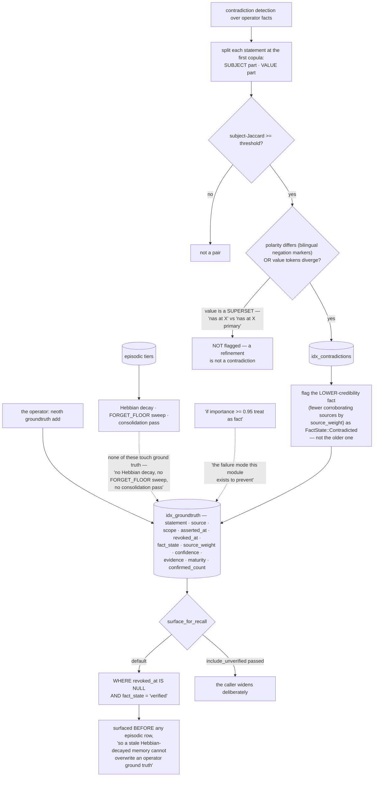

## 1. Executive Summary

NEOTH is "[y]our private AI buddy" — a local-first personal AI daemon in Rust,
dual MIT and Apache-2.0, 1,119,998 lines with 15,232 test functions in its daemon
crate, offering "[o]ne memory. Three brain paths. Five memory tiers + your vault."
It ships a GUI, bridges, a plugin SDK with a WASM sandbox, and a migration tool.

The memory subsystem is 52,353 lines of that, and one module in it is built
against a mistake this atlas withholds marks over again and again. Its header:

> "Sliding 'if importance ≥ 0.95 treat as fact' is the failure mode this module
> exists to prevent."

**Ground truth is a table, not a threshold.** Facts the operator stated
explicitly live in `idx_groundtruth` with their own scoring path — "no Hebbian
decay, no FORGET_FLOOR sweep, no consolidation pass" — promoted only by an
explicit command and revoked by another. And they are placed rather than merely
stored: surfaced "in every recall hit BEFORE any episodic row so a stale
Hebbian-decayed memory cannot overwrite an operator ground truth."

That is the correct structural answer to a problem most systems here solve with a
number. An importance score is continuous, drifts with reinforcement, and offers
no place to record that a person asserted something; a separate table with its
own lifecycle does all three.

**The state gates recall.** `FactState` is `Raw | Candidate | Verified |
Superseded | Contradicted | Deprecated`, and `surface_for_recall` emits
`WHERE revoked_at IS NULL` plus `AND fact_state = 'verified'` unless a caller
passes `include_unverified`. Narrow by default, widened by an argument, with
revocation as a separate terminal condition — the shape this atlas marks.

**Contradiction is what fills the withholding value, and it is carefully
bounded.** Two operator facts can disagree — the module's own examples are "the
nas is at X" against "the nas is at Y", and "the vpn is up" against "the vpn is
not up". The detector splits each statement at the first copula into a subject
part and a value part, requires subject-Jaccard above a threshold, then fires on
either a polarity difference — using bilingual English/German negation markers —
or diverging value tokens. And the case it deliberately does not fire on is the
one that matters:

> "a superset like 'nas at X' vs 'nas at X primary' is NOT flagged"

A refinement is not a contradiction, and a detector that treats it as one
produces a contradiction ledger nobody reads. When it does fire, it flags the
*lower-credibility* fact — fewer corroborating sources by the store's source
weight — rather than the older one, so recency does not decide.

**Consent is a file the operator can list.** Every remote provider route requires
an explicit grant under `~/.neoth/consent/`, with canonical-origin grant sets so
"endpoint A never authorizes endpoint B", in-process providers never gating, and
Ollama treated as local on loopback but requiring the same origin-bound consent
on LAN or public endpoints. The rationale for files over configuration is
practical and good: markers "survive `neoth init` reconfigure passes that rewrite
`freedom.yaml`, and they let the operator audit consent state with
`ls ~/.neoth/consent/`."

What to weigh. The scale is extraordinary — one crate of a million lines with a
22,382-line chat module — and the memory subsystem this report covers is under
five per cent of it. `scope` is a column on a ground-truth row and no scope
predicate appears on the recall path, so it tags rather than isolates. The
contradiction core is token-Jaccard with an optional semantic lift, so it is a
textual comparison with a structural split rather than a claim-level one, and its
thresholds are constants. And the write-ahead log — single writer, `O_APPEND`,
`fdatasync` per flush, mode 0600, rotation at 16 MiB or 24 hours — is a
durability mechanism rather than a mutation record with an actor and an action,
so the question "who changed this fact" is answered by `asserted_at`,
`revoked_at` and the contradiction ledger rather than by a change log.

## 2. Mental Model

A **fact** is something the operator said, and it lives somewhere episodic memory
cannot reach.

A **score** is not a fact, and the table is the difference.

A **contradiction** demotes the side with fewer sources, not the older one.

A **refinement** is not a contradiction.

## 3. Architecture

| Area | Role |
| --- | --- |
| `memory/groundtruth.rs` | The fact table, its states, and the recall gate |
| `memory/contradiction.rs` | Subject/value split, polarity, the ledger, demotion |
| `memory/forget.rs`, `decay_task.rs`, `consolidation_sweep.rs` | The episodic lifecycle ground truth is exempt from |
| `memory/drift.rs`, `compaction_guard.rs`, `eval_harness.rs` | Drift, compaction safety, evaluation |
| `wal/writer.rs` | Durability: one writer, append-only, fdatasync, 0600 |
| `consent.rs` | Origin-bound grants before any outbound route |

## 4. Essential Implementation Paths

`SRC/neothd/src/memory/groundtruth.rs:1-14` — the failure mode, named, and the
structural answer.

`SRC/neothd/src/memory/groundtruth.rs:635-653` — narrow by default, widened by an
argument.

`SRC/neothd/src/memory/contradiction.rs:1-18` — what counts as a disagreement,
and what does not.

`SRC/neothd/src/consent.rs:1-14` — grants as files, and why not configuration.

## 5. Memory Data Model

Five tiers plus a vault; the tier read here is ground truth, whose row carries a
source constrained at insert time "so the audit trail stays clean", a scope, a
source weight, a confidence, evidence, a maturity and a confirmed count. The
confirmed count and source weight are what let contradiction demote by
credibility rather than by recency.

## 6. Retrieval Mechanics

Hybrid retrieval across tiers with ground truth placed ahead of episodic rows.
The ordering is the mechanism: a fact that merely scored higher would still be
competing with decayed episodic memories on one scale, and this takes it off that
scale entirely.

## 7. Write Mechanics

Explicit promotion, explicit revocation, and a contradiction pass that writes a
ledger row and a state rather than deleting either side. Nothing in the episodic
lifecycle can promote into the fact table.

## 8. Agent Integration

A daemon with bridges, a GUI, a WASM plugin sandbox, and consent gating between
the local system and any cloud provider. The consent design's endpoint-awareness
— loopback Ollama local, LAN and public not — is the kind of distinction that is
usually collapsed.

## 9. Reliability, Safety, and Trust

The trust story is the separation: operator facts in their own table, exempt from
the decay and forgetting that govern everything else, ordered ahead of it, and
withheld when contradicted. The gap is a change record — the WAL gives durability
rather than accountability.

## 10. Tests, Evals, and Benchmarks

15,232 test functions in the daemon crate, with an evaluation harness inside the
memory module itself. Nothing was built or run for this reading.

## 11. For Your Own Build

Do not let a threshold promote a memory into a fact. An importance score is
continuous and drifts with reinforcement; if you want "the operator said so" to
mean something, it needs a table, a lifecycle and a place in the ordering.

Exempt facts from the sweeps explicitly. "No Hebbian decay, no FORGET_FLOOR
sweep, no consolidation pass" is a sentence you should be able to write about
your own fact store.

Do not flag a refinement as a contradiction. "nas at X" against "nas at X
primary" is the case that fills a contradiction ledger with noise, and excluding
it is one condition.

Demote by credibility, not recency. The newer statement is not the better
supported one, and choosing by corroborating sources says which rule you are
applying.

And make consent something the operator can list. A marker file survives the
reconfiguration that rewrites your config, and `ls` is an audit interface nobody
has to build.

## 12. Open Questions

Whether scope is ever enforced. It is a column on every ground-truth row and no
predicate on the recall path was found.

What the other four tiers do with fact state. The gate read here is ground
truth's; how the episodic tiers treat a contradicted subject was not traced.

Whether the semantic lift changes the contradiction rate. It is optional over the
Jaccard core, and no comparison was found.

## Appendix: File Index

| Path | What to read it for |
| --- | --- |
| `SRC/neothd/src/memory/groundtruth.rs:1-14`, `:158-165` | A named failure mode and a six-value state |
| `SRC/neothd/src/memory/groundtruth.rs:635-653` | Narrow by default, widened on purpose |
| `SRC/neothd/src/memory/contradiction.rs:1-18` | A disagreement, and a refinement that is not one |
| `SRC/neothd/src/consent.rs:1-14` | Grants as files an operator can audit with `ls` |

## History

**2026-09-19** — [`6a37557357b8758f5f826a9f7e655ddca0823110`](https://github.com/The-Geek-Freaks/NEOTH/commit/6a37557357b8758f5f826a9f7e655ddca0823110) — `trust_state` re-tested against the narrowed line and every anchor held. `FactState` is still the six values at `SRC/neothd/src/memory/groundtruth.rs:158-165`, and `surface_for_recall` (`:631-658`) still composes `WHERE revoked_at IS NULL` and appends `AND fact_state = 'verified'` only when the caller has not asked to widen. Two things are added to the record. The doc comment above that function names what the widening argument is *for* — the operator inspection path that also returns candidates — so a reader does not have to infer it from the parameter name, and there is a second, separate read at `:598-607` that deliberately returns all trust states for one scope under the same revocation condition. Having the narrow default and the wide inspection as two named functions rather than one function and a boolean is the clearer arrangement, and this system has both. Revocation stays a separate condition on the same query, so a revoked fact is out whatever its state. Screened again first; nothing was installed and no suite was run.

**2026-09-16** — [`6a37557357b8758f5f826a9f7e655ddca0823110`](https://github.com/The-Geek-Freaks/NEOTH/commit/6a37557357b8758f5f826a9f7e655ddca0823110) — first reading, at a commit dated 16 September 2026. Screened before opening, from a shallow clone: thirty-four files scanned, no auto-run surfaces, two build-time execution points, no unpinned surfaces and twenty-eight dependency files inside the seven-day cooldown. Nothing was installed, built or run.
