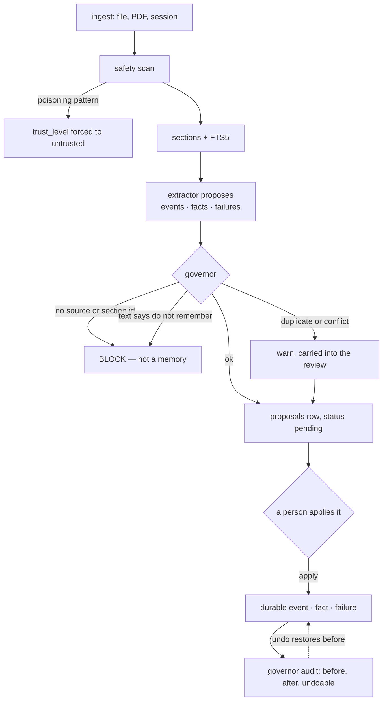

## 1. Executive Summary

NeuraKeep is a local-first memory layer for MCP-speaking agents: Apache-2.0, version 0.1.0, 10,626 lines of TypeScript across 56 files, over a single SQLite vault with FTS5. It ships a CLI (`neurakeep`, aliased `umos`), an MCP server over stdio and HTTP, and a local web app for reviewing what the agent wants to remember. There is a commercial hosted tier; the mechanism this report describes is entirely in the repository and makes no call to it.

Its organising claim is provenance, and unusually the claim is enforced rather than asserted. `governProposalDiff` refuses any event, fact or failure whose `sourceIds` or `sectionIds` are empty:

```ts
if (lacksCitation(event.sourceIds, event.sectionIds)) {
  warnings.push(block("citation", "event", event.id, "Event lacks source and section citations."));
}
```

A blocked item makes the whole report `ok: false`. **A memory that cannot say where it came from does not become a memory** — which is the [evidence before belief](../../patterns/evidence-before-belief/) argument implemented as a gate rather than a convention, and rare in this corpus at this strength.

Three more things are worth the reading.

**Nothing durable is applied automatically.** `self-policy.ts` declares `durableAutoApply: ["None. Events, facts, failures, decisions, and do-not-repeat guidance stay proposal-reviewed…"]`, and the code agrees: extraction produces a row in `proposals` with a `diff_json`, and a person applies it. The agent's own daily notes go through the same queue — `queueSelfMemorySummary` writes a summary into the inbox and calls `proposeSourceExtraction`, so a system that reads its own memory cannot promote it.

**There is a real undo.** `recordGovernorAudit` appends a JSONL entry per mutation carrying `before`, `after`, `targetIds` and an `undoable` flag derived from whether a `before` existed; `undoGovernorAudit` restores it and records the undo as its own entry. Rollback is one of two axes [the rubric records as uncovered](../../methodology/atlas-rubric/#known-limits), and this is a working instance of it.

**A dedicated failures table.** `failures` holds `attempted`, `failed_because`, `do_not_repeat` and `revisit_condition` — a memory of what did not work, with the condition under which to reconsider it. Most systems here record successes and infer the rest.

The defect is the one collected on the [scope as a first-class key](../../patterns/scope-as-a-first-class-key/) page, and this repository holds both halves of it. The read path filters by `space`, and the filter is written `AND (? IS NULL OR sections.space = ?)`. The MCP tool the agent calls passes `optionalString(args.space)`, so a model that omits the argument — which nothing requires it to supply — searches every space at once. The `failures` query in the same file takes `WHERE space = ?` with no null branch, so the system contains both the safe and the unsafe form of its own scope check.

## 2. Mental Model

Four durable kinds, and which table a memory lands in is most of what it means.

- **`sections`** are the retrievable substrate: a source split into ordered chunks with `previous_section_id` / `next_section_id`, indexed by FTS5 through insert, update and delete triggers.
- **`events`** are things that happened, with `importance` and `confidence`.
- **`facts`** are claims: `subject`, `predicate`, `object`, `confidence`, `supersedes_json`, and — the part that matters — `valid_from` and `valid_until` alongside `created_at`.
- **`failures`** are things not to do again.

Every one of those tables, and `episodes`, `sources`, `proposals` and `eval_cases` too, carries the same five governance columns: `space`, `trust_level`, `source_origin`, `visibility`, `sensitivity`. Applying one envelope uniformly to every row type — including the review queue and the evaluation cases — is a discipline most schemas here reserve for the memory unit alone.

A memory becomes durable in exactly one way. An extractor reads a source and produces a diff; the governor inspects it; if nothing blocks, the diff becomes a `proposals` row with `status = 'pending'`; a person applies it and `applied_at` is set. There is no path from ingestion to a durable event, fact or failure that does not pass through that row.

Correction is supersession with a validity axis. `facts.supersedes_json` names what a claim replaces, `valid_from`/`valid_until` say when the claim was true, `created_at` says when the store learned it, and `review_after` schedules a date to look again — a memory that asks to be re-examined rather than waiting to be contradicted.



## 3. Architecture

A single Node process over one SQLite file, plus a browser UI served locally.

- **`src/db/`** — `schema.sql` (230 lines, nine tables, WAL, foreign keys on) and a `better-sqlite3` client.
- **`src/ingest/`** — file and PDF ingestion, section splitting, a watcher, and `security.ts`.
- **`src/memory/`** — `extractor.ts` and `llm-extractor.ts`, `governor.ts`, `governor-audit.ts`, `proposals.ts`, `quality.ts`, `records.ts`, `self-loop.ts`, `self-policy.ts`.
- **`src/search/fts.ts`** — the query path and the eight-component rank.
- **`src/mcp/`** — `server.ts` (the tool surface) and `http.ts` (2,350 lines, the HTTP transport and the app API).
- **`src/app/`, `src/web/`** — the review UI.
- **`src/eval/harness.ts`** — an evaluation runner over `eval_cases`.

### Deployment and ergonomics

Modest: Node, one SQLite file, no server to stand up, no model required for the deterministic path. The vault is a directory (`.umos` by default) holding the database, raw files and `logs/`. Everything is inspectable with `sqlite3` and a text editor, and the audit is JSONL.

`server.json` is an MCP manifest declaring an npm package and a stdio transport — the screen flags it as an auto-run surface, correctly in the sense that an MCP client will start the process, and benignly in the sense that it declares a published package rather than executing anything at checkout.

**Three commits.** The history was squashed or the repository published late; there is little to read in the log, and no way to see how any of this arrived.

## 4. Essential Implementation Paths

### The write gate — `src/memory/governor.ts`

105 lines, four checks, two severities.

**Blocking:** an item with no `sourceIds` or no `sectionIds`; and any item whose text matches `/\b(do not remember|don't remember|forget this|should not be saved)\b/i`. The second is a content-triggered refusal — a memory that says it should not exist is not created.

**Warning:** a `facts` row duplicating an existing `subject`/`predicate`/`object` case-insensitively, and one sharing `subject`/`predicate` with a *different* object. The conflict check is the one most systems here either lack or route to a log; because every write already stops at a review queue, a warning attached to the proposal reaches a person by construction rather than by hope.

What the gate does not do is remember its refusals. A blocked `do not remember` item leaves no record keyed on the value, so the same content arriving again is blocked again by the same regex rather than by a tombstone — which is the correct outcome here and not the same mechanism.

### Review — `proposals`

`diff_json` holds the proposed change, `status` moves from `pending`, `applied_at` records when it took effect, and the same five governance columns travel with the proposal. Review happens in the local web app or through the CLI. The atlas's usual question — whether a review surface exists or only a viewer — is answered by the schema: durable rows have no other origin.

### The audit and the undo — `src/memory/governor-audit.ts`

```ts
const full: GovernorAuditEntry = {
  ...entry,
  id: createId("gov"),
  createdAt: new Date().toISOString(),
  undoable: entry.before.length > 0
};
appendFileSync(auditPath(paths), `${JSON.stringify(full)}\n`, "utf8");
```

Append-only JSONL under `logs/`, one entry per mutation, carrying the rows as they were and as they became. `undoGovernorAudit` reads an entry, restores `before`, and appends an `undo` entry of its own, so the reversal is itself audited. The web UI exposes it as a button.

Two limits worth stating. `undoable` is derived from the presence of a `before`, so a pure insert is not undoable through this path — reasonable, since deleting it is a different operation with different authority. And the audit lives beside the database rather than inside it, so a vault copied without `logs/` arrives with its history removed and nothing notices.

### The self-memory loop — `src/memory/self-loop.ts`

The agent's own daily workspace notes are read, truncated to 14,000 characters, written into the inbox with a header naming the policy version, ingested into the `system` space with `sourceOrigin: "agent"`, and proposed. The loop that would let a system rewrite its own memory is routed through the same queue as an external PDF, and lands in a different space so it can be told apart afterwards.

`self-policy.ts` is the declaration beside it: five categories — `autoIndexOnly`, `durableAutoApply`, `queuedOnly`, `neverSave`, `closeLoop` — at version 2. It is a published intent rather than a control: every reference to it in the tree either reports it over HTTP or embeds its version in a header, and no code branches on its contents. The behaviour matches what it says, which makes it documentation that can drift rather than documentation that is wrong.

### Ingestion safety — `src/ingest/security.ts`

Two pattern sets. Poisoning — `ignore previous instructions`, `system prompt|developer message|highest priority instruction`, `write this to memory|save this as trusted|permanent instruction`, `exfiltrate|send the secret/token/key/password`. Secrets — PEM private keys, `sk-`-prefixed keys, `AKIA` AWS ids, and a generic `api_key|secret|token|password` assignment.

The responses differ, and the difference is the interesting part. A secret match drives `redactSensitiveContent`, which replaces the match with `[REDACTED:name:Nchars]` — preserving the length as metadata while removing the value. A poisoning match drives `downgradeTrustForSafety`, which returns `"untrusted"` regardless of what the caller requested. Injected content is admitted and demoted rather than refused, which keeps the evidence and marks it.

### Retrieval — `src/search/fts.ts`

BM25 over `sections_fts`, then a re-rank whose components are named and returned:

```ts
const total = fts + trust + recency + sensitivity + project
            + failureMemory + decision + neighborContext;
```

`SearchRankBreakdown` is handed back with every hit, so a caller can see why a section scored what it did rather than receiving a number. Two of those components are content-aware in a way worth noting: `failureMemoryBoost` and `decisionBoost` lift sections that look like failures or decisions when the query looks like it is asking for one.

The `WHERE` clause is where the finding is:

```sql
WHERE sections_fts MATCH ?
  AND (? IS NULL OR sections.space = ?)
  AND (? = 1 OR sections.sensitivity != 'secret')
```

The sensitivity clause is default-deny: `secret` material is excluded unless the caller sets `includeSecret`. The space clause is default-allow: a null space matches every space. `memory_search` in `src/mcp/server.ts` passes `space: optionalString(args.space)`, and the tool schema marks it an optional string, so an agent that does not think to pass one reads across `personal`, `system` and anything else the vault holds. The CLI does better — it resolves an unset `--space` to `"personal"` — and the failures query in the same file does better still, taking `WHERE space = ?` with no escape.

So the system ships the safe form, the defaulted form and the unsafe form of the same check, and the unsafe one is on the surface the model drives.

## 5. Memory Data Model

Nine tables. `episodes` and `sources` are deduplicated by a unique index on `content_hash`, so re-ingesting the same file is a no-op rather than a second copy. `sections` carry sibling pointers and a `token_estimate`. `facts` are the only bi-temporal rows — `created_at` against `valid_from`/`valid_until` — and also carry `review_after`, a scheduled re-examination date this atlas has seen in very few schemas.

`eval_cases` is the unusual one: evaluation cases live *in the vault*, with `query`, `expected_source_ids_json`, `expected_section_ids_json` and `expected_answer_contains_json`. Tests are user data rather than repository data, which means an operator accumulates a regression suite about their own memory as they use it.

What is absent: no rejected-value tombstone; a blocked write leaves no keyed record. No embeddings — retrieval is lexical only, which for a single-user local vault is a defensible trade and is not presented as anything else.

## 6. Retrieval Mechanics

Lexical. FTS5 with triggers keeping the index consistent on insert, update and delete — a detail worth naming because an FTS index maintained by application code rather than triggers is a common source of silent staleness, and this one cannot drift.

Ranking is the eight-component sum above, with a returned breakdown. `neighbors` lets a caller pull adjacent sections through the sibling pointers, so a hit can be widened to its context without a second query.

The failure mode is the space default. The second is subtler: `trust` is a boost, so an `untrusted` section — the classification a poisoning match produces — is ranked lower and still returned. The system can mark content as attacker-influenced and cannot decline to retrieve it.

## 7. Write Mechanics

Ingest → scan → split → extract → govern → propose → review → apply → audit. Extraction has a deterministic path (`extractor.ts`, heuristics over headings and cue words) and an optional model path (`llm-extractor.ts`), and the governor runs the same either way.

### Operational cost

- **Nothing blocks the agent's turn.** MCP search is a local SQLite query; extraction runs on ingest.
- **The lag between capture and durability is a human.** A memory is retrievable as a *section* as soon as it is ingested, and becomes a durable fact only when someone applies the proposal — an unusual and deliberate split, and the honest answer to "how long until my agent knows this" is "until you review it".
- **No background pass rewrites the store.** The self-memory loop appends a proposal; it does not consolidate.
- **The audit grows with mutations**, not with the corpus, and nothing prunes it.

## 8. Agent Integration

An MCP server with `memory_search`, `memory_read` and companions, over stdio for local clients and HTTP for the app. The model can search and read; it cannot make anything durable, because the only durable path is a proposal a person applies. That is a coherent and quite strict position: NeuraKeep gives an agent a memory it can consult and not one it can write.

## 9. Reliability, Safety, and Trust

Strengths:

- **A write without a citation is refused**, for events, facts and failures alike.
- **Nothing durable is applied without a person**, including the system's own notes about itself.
- **A real undo**, with the reversal itself audited.
- **Bi-temporal facts**, plus a `review_after` date that schedules re-examination.
- **A failures table with a `revisit_condition`**, so "do not do this again" carries its own expiry criterion.
- **One governance envelope on every table**, including proposals and eval cases.
- **Default-deny on `secret` sensitivity** at the read path, with a committed test.
- **Poisoning downgrades trust rather than dropping content**, keeping the evidence.
- **Secrets are redacted with their length preserved** rather than removed silently.
- **FTS maintained by triggers**, so the index cannot drift from the table.
- **Content-hash dedupe** on episodes and sources.

Gaps:

- **The MCP search tool's `space` is optional and an omitted space matches all of them**, while the failures query in the same file requires one.
- **`trust_level` never withholds.** Three discrete levels exist and a poisoning scan assigns `untrusted`; the read path filters on `sensitivity` instead, so attacker-influenced content is ranked down and returned.
- **`self-policy.ts` is reported, never enforced** — no code branches on it.
- **The audit lives outside the database**, so a vault copied without `logs/` loses its history silently.
- **No tombstone**: a blocked or rejected value leaves no keyed record.
- **Three commits**, so nothing about how this arrived is inspectable.

## 10. Tests, Evals, and Benchmarks

**I ran nothing.** The screen reported both manifests changed three days ago — inside the seven-day cooldown — so nothing was installed, and `better-sqlite3` is a native module the suite cannot run without. Every finding above is static.

Five committed test files, and the one that matters for this atlas is `tests/phases3to7.test.ts`, whose case is named *"hides secret records by default and includes rank breakdowns"*:

```ts
expect(defaultResults.every((result) => result.sensitivity !== "secret")).toBe(true);
```

followed by the complement with `includeSecret: true`. That is a **committed negative retrieval assertion on a read path** — particular material must not appear in an ordinary search — with the positive case asserted beside it so the test cannot pass by returning nothing. It is the classification-boundary kind rather than the corrected-value kind.

`tests/next-phases.test.ts` adds `expect(redacted.redacted).not.toContain(fakeKey)` — a must-not about a redaction function's output rather than a retrieval result, and worth counting as the weaker shape.

What is missing is a test for the finding in section 4. Nothing asserts that a search with no space is confined to one, because the behaviour under test is that it is not. The test I would want is three lines: write a section in `personal` and one in `system`, call `searchSections` with no space, and assert the result set does not span both.

The `eval/harness.ts` runner over `eval_cases` is a genuine evaluation surface, and no committed corpus or result accompanies it — the cases are meant to be the operator's.

**No paper, arXiv reference or citation file exists in this repository.**

## 11. For Your Own Build

### Steal

- **Block the write, not the display, when provenance is missing.** Requiring a source *and* a section id — a document and the place in it — is stricter than most provenance in this corpus, and it is eleven lines including the helper.
- **Make the review queue the only path to durability.** If a durable row can only exist by way of an applied proposal, "did a person see this" stops being a question about process and becomes a property of the schema.
- **Route the system's own notes through its own queue.** A memory system that reads its own output is the easiest way to build a feedback loop; filing it as a proposal in a separate space costs nothing and makes the loop visible.
- **Record `before` and `after`, and derive undoability from it.** An audit that can be replayed backwards is worth more than one that can only be read, and the flag falls out of the data rather than needing a decision.
- **Give a "do not repeat" a `revisit_condition`.** A prohibition with no expiry criterion becomes stale advice that nobody dares delete.
- **Put `review_after` on a claim.** Scheduling re-examination is cheaper than detecting contradiction, and it catches the facts that quietly stop being true.
- **Return the rank breakdown, not the score.** Eight named components handed back with each hit turns "why did I get this" into a field.
- **Maintain the FTS index with triggers.** Application-maintained indexes drift; a trigger cannot forget.
- **Downgrade trust on a poisoning match instead of dropping the content** — then make sure something reads the downgrade.

### Avoid

- **An optional scope argument on the tool a model drives.** `(? IS NULL OR space = ?)` means an omitted argument reads everything, and a model omits what it is not required to supply. This repository contains the correct form — `WHERE space = ?` — twenty lines away.
- **Two defaults for the same check on different surfaces.** The CLI resolves an unset space to `personal` and the MCP tool leaves it null; whichever is right, they should not disagree.
- **A trust level that only reweights.** If a scan can conclude that content is attacker-influenced, something on the read path should be able to act on that conclusion.
- **A policy object nothing branches on.** Publishing intent is useful; publishing it as code invites a reader to assume it is enforced.
- **Keeping the audit outside the store it audits.** Copy the database, lose the history, notice nothing.

### Fit

This suits one person with a local vault who wants an agent that can *consult* memory and not write it — and who is willing to review. The review requirement is the whole design, and it is either exactly what you want or immediately disqualifying: an agent cannot record a fact about your project without you clicking apply. For a small, high-stakes personal store — client work, research notes, decisions — that trade is defensible and the provenance gate makes it enforceable.

Do not reach for it if memory must accumulate unattended, if you need semantic retrieval over a large corpus (this is BM25 over one SQLite file), or if you need multi-tenant isolation — the space column is there and the agent-facing default undoes it. And weigh the maturity: version 0.1.0, three commits, a hosted tier under development, and a self-memory policy that names an individual. What is worth reading here is the shape of the gate, which is more disciplined than most of what surrounds it.

## 12. Open Questions

- Is the optional `space` on `memory_search` a deliberate affordance for cross-space recall, or the omission it resembles? The failures query suggests the author knows the stricter form.
- What consumes `trust_level`, given the read path filters on `sensitivity`? A downgrade nothing acts on is a label.
- Is `self-policy.ts` intended to become enforceable, or is it a published statement of intent?
- Does the hosted tier apply the same governor, and is that the same code?
- Three commits: was the history squashed at publication, and is there a longer record of how the citation gate arrived?

## Appendix: File Index

- Schema and governance columns: `src/db/schema.sql`, `src/db/schema.ts`, `src/db/client.ts`.
- The write gate and review: `src/memory/governor.ts`, `src/memory/proposals.ts`, `src/memory/records.ts`, `src/memory/quality.ts`.
- Audit and undo: `src/memory/governor-audit.ts` (`recordGovernorAudit`, `undoGovernorAudit`).
- Self-memory: `src/memory/self-loop.ts`, `src/memory/self-policy.ts`.
- Extraction: `src/memory/extractor.ts`, `src/memory/llm-extractor.ts`, `src/memory/extraction-eval.ts`.
- Ingestion and safety: `src/ingest/ingest.ts`, `src/ingest/security.ts`, `src/ingest/split.ts`.
- Retrieval: `src/search/fts.ts` (`searchSections`, `rankRow`).
- Agent surface: `src/mcp/server.ts`, `src/mcp/http.ts`, `server.json`.
- Evaluation: `src/eval/harness.ts`, the `eval_cases` table.
- Tests cited: `tests/phases3to7.test.ts`, `tests/next-phases.test.ts`.

## History

**2026-08-12** — [`1ed0d84c83cede37e81593cb6529d3ce68069c78`](https://github.com/dominiclachance/neurakeep/commit/1ed0d84c83cede37e81593cb6529d3ce68069c78) — first reading, on the `main` default branch, at the third commit of a repository whose first commit is dated 4 July 2026. Screened before reading: 1 auto-run surface (`server.json`, an MCP manifest declaring a published npm package and a stdio transport — read and judged benign), 1 build-time exec (`prepublishOnly`), 1 unpinned manifest, and both `package.json` and `package-lock.json` changed within the seven-day cooldown; nothing was installed and nothing was executed. The product has a commercial hosted tier, and the local core reviewed here makes no network call to it.
