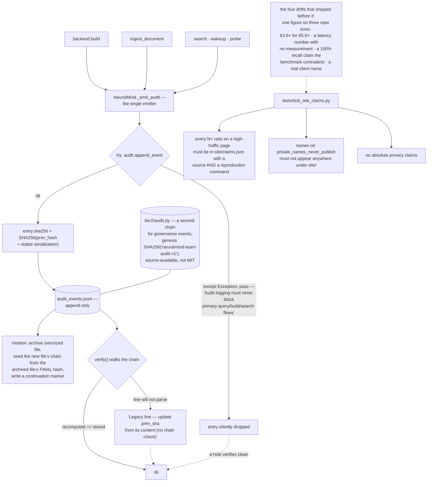

## 1. Executive Summary

NeuralMind is "[p]ersistent memory and context compression for AI coding
agents" — 102,514 lines of Python at version 3.11.3, open-core: MIT for
everything except `neuralmind/tier2/`, which is source-available under a
Commercial Modules License.

Three things here are worth taking somewhere else, and one of them is not about
memory at all.

The audit trail is a genuine tamper-evident chain. `AuditTrail` appends JSONL
entries whose SHA-256 covers the previous hash plus a stable serialization,
`verify` walks the chain recomputing every entry, and — the detail that
separates a real implementation from a gesture — the archive path preserves
chain continuity across rotation by seeding the new active file from the
archived file's final hash and writing a continuation marker. A second,
independently chained log in `tier2/audit.py` carries governance events with its
own genesis hash, `SHA256("neuralmind-team-audit-v1")`, and a doctest that
asserts `verify()["ok"]`.

The licensing statement is the clearest open-core boundary in this corpus. One
repository, two licences, one directory, and a forward-only guarantee stated
without hedging: "every release up to and including v2.0.1 was published
entirely under MIT and remains MIT permanently. The boundary takes effect with
v3.0.0." The commercial modules stay in the repository and stay readable —
"source-available, not closed" — and a one-seat licence auto-issues with no
signup and no expiry.

And then there is `tests/test_site_claims.py`, which is the most unusual test in
this corpus. It guards the project's own marketing site against untrue numbers,
and its docstring explains why it exists by listing four classes of drift that
had already shipped:

> "the same token-reduction figure attributed to three different repo sizes …
> a transcription error of that figure (`63.6×` for `65.6×`) sitting one card
> away from the original, a query-latency number with no measurement behind it
> anywhere in the repo, a `100%` gold-file recall claim the current public
> benchmark contradicts (93.75% mean; `click` is 0.79), and the real name of a
> private client whose field report every doc deliberately anonymizes."

The three rules it now enforces are: every `N×` ratio on a high-traffic page
must be listed in `site/claims.json` "with a source and a reproduction command";
names on a `private_names_never_publish` manifest must not appear anywhere under
`site/`; and the absolute-privacy-claim patterns the docs guard forbids apply to
the site too. Multipliers under 2× are exempt with a stated reason — "those are
decay coefficients and worked examples in the publications, not claims."

Requiring a *reproduction command* is what makes rule one more than a citation
check. A vendor benchmark with a command anyone can run is a different artifact
from a number in a card.

The weakness is in the same place as the strength. The chain proves that no
entry was altered. Nothing proves that no entry is missing, and the code
contains two ways for one to go missing. `_emit_audit` wraps the append in a
bare `except Exception: pass`, under a comment stating the intent — "Audit
logging must never block primary query/build/search flows" — so a disk error or
a serialisation failure drops the entry silently. And `verify` treats a line it
cannot parse as a "[l]egacy line", updates the running hash from its content,
and proceeds with "no chain check".

For a tamper-evident log, a hole verifies clean.

## 2. Mental Model

A **content node** is a piece of the repository in a code graph, with synapse
weights learned from use.

A **build** regenerates that graph; there is no edit and no delete.

An **audit entry** is a link in a chain that survives file rotation.

A **claim** — in the marketing sense — is a number that must be reproducible or
it may not be published.

## 3. Architecture

| Area | Role |
| --- | --- |
| `neuralmind/audit.py` | The MIT hash-chained trail, its verifier and its rotation |
| `neuralmind/tier2/audit.py` | The source-available governance chain |
| `neuralmind/core.py` | Build, ingest, search, and the single audit emitter |
| `neuralmind/context_selector.py`, `compressors.py` | Context compression, the product claim |
| `neuralmind/bm25.py`, `bge_embedder.py` | The retrieval arms |
| `evals/` | Faithfulness, quality, parity, onboarding, SWE-bench and a book corpus |
| `tests/test_site_claims.py`, `test_docs_claims.py` | The project's own numbers, gated |
| `LICENSING.md` | One directory, two licences, forward-only |

## 4. Essential Implementation Paths

`tests/test_site_claims.py:1-26`. Read the docstring before the code — it is a
post-mortem of four shipped inaccuracies and the rules that followed, and it is
the most transferable thing in the repository.

`neuralmind/audit.py:234-290` for rotation that preserves chain continuity,
which is the part of a hash chain most implementations get wrong or skip.

`neuralmind/core.py:442-465` for the emitter, and the `except Exception: pass`
that is the chain's blind spot.

## 5. Memory Data Model

The memory is an index over a repository rather than a store of claims: content
nodes in a code graph with synapse weights, ingested documents, and chapter
indexes for long-form text.

That shape answers most of the atlas's usual questions by construction. There is
no epistemic status because a node is not a belief; there is no supersession
because a rebuild replaces the graph; there is no delete path in the core
because forgetting means not indexing. Provenance is the source file.

The consequence worth naming is correction. If the graph encodes something
wrong — a stale file, a misattributed symbol — the remedy is a rebuild, and
there is no way to mark a single node as not-to-be-trusted in the meantime.

## 6. Retrieval Mechanics

BM25 and embeddings with a context selector and compressors, tuned by a CI tuner
and measured by the eval harnesses in `evals/`. Unlike several projects read
recently, the corpora are committed — `evals/book_retrieval/` carries an actual
book, `evals/quality/baseline.json` an actual baseline — so the numbers can be
reproduced by someone who is not the author. That is the same discipline the
site-claims test enforces, applied upstream of the claim.

## 7. Write Mechanics

Build and ingest, both audited. A build failure emits an audit event with
`status="failure"`, which is the right half to remember: a log that records only
successes tells you nothing about the run that went wrong.

## 8. Agent Integration

An MCP server, editor extensions, agent hooks, a CLI, a daemon with
backpressure, and a dashboard. The product claim is token reduction through
context compression, and the claim is one of the numbers `site/claims.json` has
to justify.

## 9. Reliability, Safety, and Trust

Two independent hash chains, a compliance annotation engine, an MCP security
layer with its own audit integration, and no telemetry.

The honest assessment of the chains is that they are well built and
under-guarded at the edges. A tamper-evident log answers "was this record
changed?" and not "is this record complete", and completeness is the property an
audit is usually wanted for. Two lines of code decide it here: the swallowed
exception, and the legacy-line branch.

Both have cheap fixes that do not compromise the stated intent. The emitter
could increment a dropped-entry counter and surface it in `verify`'s result, so
a gap becomes visible without ever blocking a query. The legacy branch could
record how many unchained lines it skipped, so "ok" stops meaning "ok, apart
from the ones I did not check."

## 10. Tests, Evals, and Benchmarks

150 test files, committed eval corpora, a self-benchmark CI workflow, and the
two claims guards.

The claims guards deserve the last word because they are rare enough to be worth
naming as a category. Most projects treat their README as marketing and their
tests as engineering. This one treats a published number as an assertion that
can be false, gives it a source and a reproduction command, and fails the build
if a new one appears without them. The four drifts listed in the docstring are
what happens without that, and every one of them is a mistake an honest project
makes.

## 11. For Your Own Build

Test your own claims. If you publish a multiplier, put it in a manifest with its
source and the command that regenerates it, and fail CI when a number appears on
a high-traffic page without one. The exemption for values under 2× — "decay
coefficients and worked examples … not claims" — is the detail that keeps the
rule usable.

Keep a list of names that must never be published and assert it against the
site. The drift that motivated this one included a real client name in a
document every other copy anonymised; a grep in CI is a complete defence.

Preserve the chain across rotation. A hash chain that resets when the file rolls
over is two chains, and the seam is exactly where a missing entry would sit.
Seeding the new file from the archived final hash and writing a continuation
marker costs a few lines.

Count what you swallow. "This must never block the primary flow" is a correct
requirement and a silent `pass` is the wrong implementation of it: increment a
counter, surface it in the verifier, and the log can be both non-blocking and
honest about its gaps.

And state your licence boundary the way this one does — one directory, one
sentence, and a forward-only promise about what stays permissive.

## 12. Open Questions

Whether a memory node can be corrected without a full rebuild. No delete,
forget or invalidate path was found in the core.

Whether `verify` is run anywhere automatically. It exists on both chains and a
doctest exercises the tier2 one; nothing observed schedules it.

How many audit entries are lost in practice. The swallowed exception makes the
answer unknowable from the log itself, which is the point of the finding.

## Appendix: File Index

| Path | What to read it for |
| --- | --- |
| `tests/test_site_claims.py` | Four shipped inaccuracies, and the three rules that followed |
| `neuralmind/audit.py:234-290` | Rotation that preserves hash-chain continuity |
| `neuralmind/core.py:442-465` | The single emitter, and the exception it swallows |
| `neuralmind/audit.py:173-196` | The verifier, and the legacy line it does not check |
| `neuralmind/tier2/audit.py` | A second chain, source-available, with a genesis hash |
| `LICENSING.md` | One directory, two licences, forward-only |

## History

**2026-09-16** — [`38c74096f5e8e82c79feb037ece7395461fab4f8`](https://github.com/dfrostar/neuralmind/commit/38c74096f5e8e82c79feb037ece7395461fab4f8) — first reading, at a commit dated 16 September 2026. The repository is open-core: MIT except `neuralmind/tier2/`, which is source-available under a Commercial Modules License and was read as source. Screened before opening, from a shallow clone: fifteen files scanned, no auto-run surfaces, one build-time execution point, three unpinned surfaces, eight dependency files inside the seven-day cooldown, and the `CLAUDE.md` read as data. Nothing was installed, built or run.
