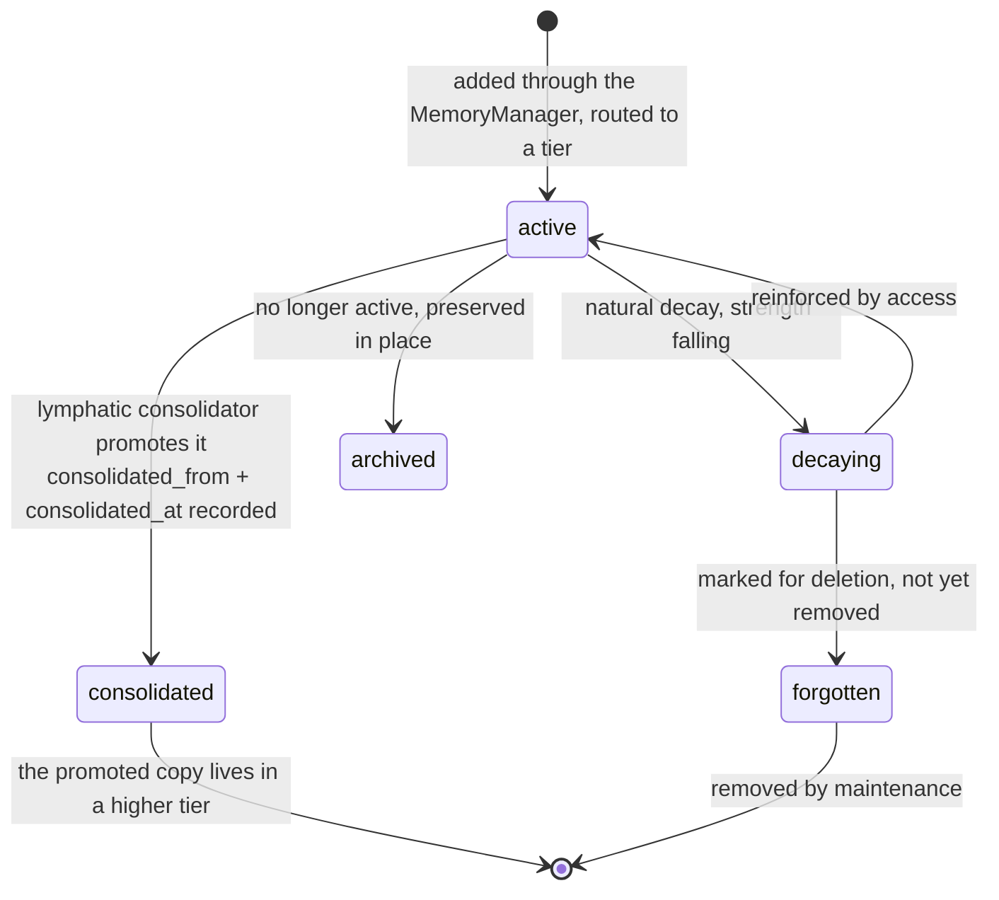

## 1. Executive Summary

NeuroCA is a "Persistent Memory System for LLMs" organised as a
NeuroCognitive Architecture: short-, medium- and long-term tiers, a **lymphatic**
subsystem for consolidation, an **annealing** optimizer, and **tubules** carrying
weighted connections. MIT, roughly 134,000 lines of Python.

**The finding is the state of its own test suite, and it is checkable in four
lines.**

`tests/integration/memory/test_memory_integration.py:18` and
`tests/integration/memory/test_tiered_storage.py:22` both begin with the same
module-level skip:

```python
pytest.skip("These tests use the old memory architecture and need to be
             refactored", allow_module_level=True)
```

`allow_module_level=True` means the entire file is skipped before a single test
runs. The remaining integration file, `test_memory_tier_integration.py`, skips
Redis by default and skips SQLite with the reason "SQLite tests need further
investigation for thread safety and initialization" — leaving, in effect, the
in-memory backend.

So at this commit **no integration test exercises the memory system against a
durable backend.** The unit tests that remain add three more skips for search,
count and stats, each reasoned "implementation varies across backends" — which is
the assertion a backend-agnostic interface most needs.

An outside corpus declined this project as "alpha; ~110K lines of AI-generated
scaffolding, integration tests all skipped". This report does not repeat the
scaffolding claim, which is a judgement about provenance the code cannot settle.
The testing claim is precise, and it holds: the tests are skipped, the reason is
recorded in the skip itself, and the reason is that the architecture they test
has been replaced.

**That is a report about a moment, which is what a pinned report is for.** The
skips are not neglect — they are an honest marker left by someone mid-migration,
and they say so. A reader evaluating NeuroCA today should read them as "the new
memory architecture is not yet covered", not as "the tests fail".

## 2. Mental Model

A `MemoryItem` carries content — structured (`text`, `summary`, `json_data`) or
raw — plus metadata: `created_at`, `last_accessed`, `updated_at`, `status`,
`importance` and `strength` (both bounded to `[0,1]`), `access_count`, `tags`,
`source`, the `tier` it lives in, `expires_at` (for STM), `priority` (for MTM),
and the consolidation pair.

`MemoryStatus` is five values, and the vocabulary is better than most:

| Value | Meaning, in the code's own comment |
| --- | --- |
| `active` | "Normal status, actively used" |
| `archived` | "No longer active but preserved" |
| `consolidated` | "Moved to a higher tier" |
| `forgotten` | "Marked for deletion but not yet removed" |
| `decaying` | "In the process of natural decay" |

Separating `consolidated` from `archived` is the useful distinction: one means
the memory was promoted and lives on elsewhere, the other means it was set aside
where it is. And `forgotten` as "marked for deletion but not yet removed" is an
explicit soft-delete state rather than an implied one — a memory in that state is
gone from the agent's view and still present for whatever needs to clean it up.



## 3. Architecture

Three tiers (`tiers/stm`, `mtm`, `ltm`) over pluggable backends
(`backends/in_memory`, `sqlite`, vector) selected by a factory, with a
`MemoryManager` as "the primary entry point" orchestrating across both axes.
The `memory/README.md` documents this layout accurately, which made the reading
faster and is worth crediting on its own.

The biologically-named subsystems are the distinguishing surface:

- **`lymphatic/`** — a consolidator, an abstractor and a scheduler. The
  consolidator's header names four strategies (importance filtering, semantic
  clustering, temporal decay modelling, contextual association strengthening)
  and the metaphor: processes "that mimic how the human brain's lymphatic system
  clears waste and consolidates important memories during rest periods".
- **`annealing/`** — an optimizer with phases and a scheduler, i.e. simulated
  annealing applied to the memory store.
- **`tubules/`** — `connections.py`, `pathways.py` and `weights.py`, with the
  weights module citing "Hebbian learning, homeostatic plasticity, and decay
  dynamics".

## 4. Essential Implementation Paths

**Add** — `MemoryManager` → tier selection → backend.

**Consolidate** — `lymphatic/consolidator.py`, with a documented API of
`consolidate(memories)` and `schedule_consolidation(memories, delay=3600)`.

**Optimise** — `annealing/optimizer.py` with `phases.py` and `scheduler.py`.

**Weight** — `tubules/weights.py`.

**Search** — per-tier `search.py` under `tiers/base/`, with `relevance` attached
to the result rather than stored.

## 5. Memory Data Model

The Pydantic model is careful in the places that matter: `importance` and
`strength` are `Field(..., ge=0.0, le=1.0)`, `access_count` is `ge=0`, and
`relevance` is explicitly documented as "often added during search" rather than
persisted — so a query-time score cannot be mistaken for stored state.

`consolidated_from` (the id of the source memory) and `consolidated_at` are the
pair worth lifting. A promoted memory knows where it came from, so consolidation
is traceable rather than an appearance in a higher tier — the same property
[MemoryBear](../memorybear/) gets from a `DERIVED_FROM` edge, expressed as two
columns.

`embedding_model` and `embedding_dimensions` stored alongside the vector is a
small, correct detail: a store that changes embedding models can tell which
vectors are stale.

There is no supersession pointer, no contradiction record and no verification
field. Correction is decay and forgetting.

## 6. Retrieval Mechanics

Per-tier search behind the manager, with backend-specific implementations — and
that variability is exactly what the three skipped unit tests name: search,
count and stats are skipped because "implementation varies across backends".

An interface whose conformance tests are skipped for variance is an interface
whose contract is not settled. That is a fair state for a refactor in progress
and it is the reason this report claims no retrieval property.

There is no scope key. Tiers and backends partition *storage*; nothing partitions
*access*.

## 7. Write Mechanics

Writes go through the manager. STM entries carry `expires_at`; MTM entries carry
`priority`; LTM is the consolidation target.

Correction is the status machine. Nothing is keyed on a value, nothing records a
rejection, and a wrong memory is expected to decay unless access keeps it alive
— with the same weakness that has for every usage-driven store: a wrong memory
that is useful is reinforced.

## 8. Agent Integration

A CLI, an API, adapters including Ollama, an integration package and a
monitoring tier. Benchmarks against Agno are advertised in the README and live
in a **separate repository** (`Neuroca-Benchmarks`), so nothing about them is
checkable here — the fourth instance of that pattern in this pass.

## 9. Reliability, Safety, and Trust

**No marks.** There is no rejected-value record, no validity axis, no scope key
on the read path, no review surface, no mutation log, and no negative retrieval
case. `MemoryStatus` is a five-value lifecycle vocabulary, not an epistemic one:
`archived` and `forgotten` say where a memory is, not whether it is true.

**The honest summary is the test state.** A memory system with three tiers,
three backends and a consolidation subsystem, whose integration coverage against
durable backends is zero at this commit by explicit module-level skips, cannot
be assessed for the properties this atlas measures — because the code that would
demonstrate them is the code the tests were retired for.

That is worth recording rather than working around. The atlas's rule is that a
report describes one commit and "not found" means not found in the inspected
code at that commit. Here the project itself has marked which parts are in
transition, which is more than most systems in that position do.

## 10. Tests, Evals, and Benchmarks

**No paper.** 21 test files. Eight skip markers, of which the two that matter
are module-level skips over the memory integration suites, quoted in section 1.

Benchmarks against Agno are claimed in the README and hosted in
`justinlietz93/Neuroca-Benchmarks`. Not in this tree, not checked here.

**I ran nothing.**

## 11. For Your Own Build

### Steal

- **Give `forgotten` a state of its own.** "Marked for deletion but not yet
  removed" is a real intermediate that most systems leave implicit, and making it
  explicit is what lets a cleanup pass be separate from the decision to forget.
- **Separate `consolidated` from `archived`.** One means promoted and living
  elsewhere; the other means set aside in place. Collapsing them loses the
  question "where did it go".
- **Record `consolidated_from` and `consolidated_at`.** Two fields, and a
  promoted memory stops being an unexplained appearance in a higher tier.
- **Store the embedding model and dimensions with the vector.** It is how you
  find the vectors that need re-embedding after a model change.
- **Mark `relevance` as query-time in the model.** A score attached during
  search and documented as such cannot be mistaken for persisted state.
- **Write the skip reason into the skip.** "These tests use the old memory
  architecture and need to be refactored" is more useful to a reader than a
  green suite that covers nothing, and it is why this report could be specific.
- **Document the directory layout in a README beside the code.**
  `memory/README.md` describes the tier/backend/model split accurately and made
  this reading faster.

### Avoid

- **Do not skip a conformance test because implementations vary.** Search, count
  and stats varying "across backends" is the argument *for* the conformance test,
  not against it — that variance is the contract breaking.
- **Do not let a refactor leave zero durable-backend coverage.** In-memory tests
  passing while SQLite is skipped for "thread safety and initialization" means
  the concurrency behaviour of the real backend is untested.
- **Do not host the benchmark in another repository if the README leads with
  it.** A reader at this commit cannot check it.

### Fit

Nobody should adopt this at this commit. The architecture is legible, the model
is well-typed and the biological framing is coherent, and the memory system's
integration coverage against a durable backend is zero by the project's own
markers.

It is worth reading for the status vocabulary and the consolidation provenance
fields, both of which are small, correct, and independent of the refactor.

## 12. Open Questions

- **Has the new memory architecture been covered since?** The skips are dated by
  the commit and name their own remedy.
- **What is the SQLite thread-safety problem?** The skip names it and nothing in
  the tree resolves it.
- **What do the annealing phases optimise?** An optimizer, phases and a
  scheduler exist; the objective function was not traced.
- **Do tubule weights reach retrieval?** `weights.py` cites Hebbian learning and
  homeostatic plasticity; whether the weights affect what is returned was not
  established.

## Appendix: File Index

**The skipped suites** — `tests/integration/memory/test_memory_integration.py:18`,
`tests/integration/memory/test_tiered_storage.py:22`,
`tests/integration/memory/test_memory_tier_integration.py:300-320`,
`tests/unit/memory/backends/test_sqlite_backend.py:117`, `:193`, `:229`

**Model** — `src/neuroca/memory/models/memory_item.py` (`MemoryStatus` `:17-24`,
`MemoryContent` `:27`, the metadata block `:86-120`), `models/search.py`,
`models/working_memory.py`

**Tiers and backends** — `src/neuroca/memory/tiers/` (`base/`, `stm/`, `mtm/`,
`ltm/`), `src/neuroca/memory/backends/`, `src/neuroca/memory/manager/core.py`,
`manager/working_memory.py`, `src/neuroca/memory/interfaces/`

**Biological subsystems** — `src/neuroca/memory/lymphatic/consolidator.py` (the
four strategies `:4-14`), `abstractor.py`, `scheduler.py`;
`src/neuroca/memory/annealing/` (`optimizer.py`, `phases.py`, `scheduler.py`);
`src/neuroca/memory/tubules/` (`weights.py` and its citations `:1-12`,
`connections.py`, `pathways.py`)

**Documentation** — `src/neuroca/memory/README.md`, `TABLE_OF_CONTENTS.md`

**Not in this tree** — the Agno comparison lives at
`justinlietz93/Neuroca-Benchmarks`

## History

**2026-08-09** — [`b4d4198e0d102be9074aa3c74b660c6d4091cdf4`](https://github.com/Modern-Prometheus-AI/Neuroca/commit/b4d4198e0d102be9074aa3c74b660c6d4091cdf4) — first reading. Screened before reading; the tree was read, never installed, and no test was run.
