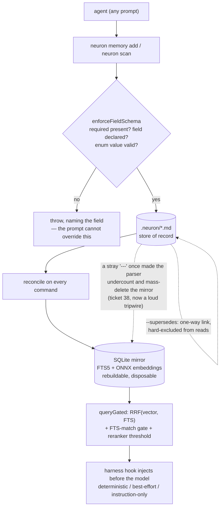

## 1. Executive Summary

Neuron is markdown-as-memory for coding agents, and its thesis is a sentence
from its own README: *"tell an agent to append to a `.md` file is a prompt, not
a product."* Everything the agent learns lives as `.neuron/*.md` files —
readable, git-diffable, hand-editable — and the part that turns that from a
suggestion into a guarantee is a CLI that **refuses to write an entry that
violates a per-category schema, no matter what the agent's prompt says.** MIT,
TypeScript, release v2.4.1, with 745 test cases across 68 files.

Three design decisions lift it above the other markdown-memory systems in this
atlas.

**The schema is enforced at one chokepoint, on the write path, below the
prompt.** `neuron.yaml` declares required and enum-typed fields per category —
"every `decisions` entry needs a `ticket` and a `reviewedBy`" — and
`NeuronMemory.enforceFieldSchema` checks every mutation before it lands, from
the CLI and from `neuron scan` alike. A missing required field, an undeclared
field, or a value outside a declared enum throws with a message naming the cause
(and a did-you-mean on enum near-misses). An agent whose prompt says "just save
it" cannot: the schema is a property of the store, not of the instruction, which
is the thing markdown-memory usually cannot promise.

**Recall is the harness's job, not the model's, and the fidelity is measured
rather than asserted.** On Claude Code and Codex CLI, `neuron init` wires four
lifecycle points — `session-start`, `pre-prompt`, `context-reset` and (since
v2.4.0) `pre-command`, the last firing a gated lookup on every Bash tool call
(`PreToolUse`), not only per prompt turn — that query memory and inject results
before the model sees the prompt. Where a harness lacks a
per-turn hook point, Neuron says so, in a **three-rung ladder** —
`deterministic`, `best-effort`, `instruction-only` — and `neuron init` reports
the rung per project per harness by reading each harness's real hook
registration through a `verify()` call, not by inferring from a config file's
existence. Cursor's row is labelled best-effort *and* flagged "not verified
against a real Cursor installation … shipped on fixture/documentation evidence
only." A memory system that tells you which of its own guarantees it has not
been able to test is rare enough to be the headline.

**Supersession is the epistemic move, and it is one-way by design.**
`supersededBy` is a forward link set only by the write gate's `--supersedes`
resolution, never on creation; a superseded row is hard-excluded from every read
path; and the comment is explicit that "a wrong mark is corrected by a new
forward-linking entry, not by clearing this." History is retained and
retrievable with `includeSuperseded`, and the live view never shows it.

The weaknesses are the ones markdown-as-record buys. The store of truth is text
a hand-edit can break, and the codebase's own comments record where that bit:
ticket 38, a stray `---` in one entry's body made the parser undercount a
category by ~38% and the reconciler mass-deleted the vector mirror to match. The
parser bug is fixed and a loud-but-non-blocking tripwire added, and the honesty
of writing that into the code is itself characteristic of the tree.

## 2. Mental Model

A memory is a **markdown entry** under `.neuron/`, one file per category (or a
configurable root per category), each entry carrying `content`, `category`,
`tags`, an optional `importance`, config-declared typed `fields`, `createdAt`,
and an optional `supersededBy`/`supersededAt`. The markdown is the store of
record; a SQLite row is its mirror.

The state machine is small and the interesting part is what is *not* in it:

```text
write  -> enforceFieldSchema: refuse if a required field is missing,
                              a field is undeclared, or an enum value is invalid
       -> markdown file written, SQLite mirror reconciled
live   -> retrievable; the default read hard-excludes superseded rows
supersede (--supersedes) -> supersededBy set, one way, by the write gate only
                          -> row hard-excluded from every read unless includeSuperseded
correct a wrong supersede -> write a NEW forward-linking entry; never clear the link
```

There is no `verified` and no `rejected`. `importance` is a scalar that feeds
ranking, not a trust state, and nothing marks an entry as endorsed or refuted.
The epistemic vocabulary is entirely supersession: a claim does not become
*wrong*, it becomes *replaced*, and the replacement points back. That is a
deliberate narrowing — the system can say "this superseded that" and cannot say
"this is disputed" — and it is why this report withholds `trust_state` despite
the schema machinery.

The subtle correctness property is that **the mirror is never the truth.** Every
command reconciles the SQLite index from the markdown before reading, delete the
database and Neuron rebuilds it, and a divergence between the two is resolved in
the files' favour. That inverts the usual arrangement, where the index is
authoritative and the human-readable export is a courtesy. Here the thing you
can open in an editor is the thing that is true, and the fast thing is
disposable.



## 3. Architecture

One TypeScript package, a CLI over a `NeuronMemory` core (`src/index.ts`, ~2,000
lines) and a `DualStorageRouter` that dispatches each category to its resolved
backend.

- **`src/storage/`** — `mdStorage.ts` / `mdStorageAdapter.ts` (the markdown store
  of record), `dualStorageRouter.ts` (per-category md-vs-vector dispatch and
  reconciliation), `mdVectorSync.ts` (content hashing and the mirror), and
  `multiRootMdStorage.ts` (configurable per-category roots).
- **`src/index.ts`** — the SQLite core: schema and migrations, FTS5 virtual
  tables with sync triggers, `queryGated`, `enforceFieldSchema`,
  `checkFieldCompliance`, supersession columns.
- **`src/config/neuronYaml.ts`** (835 lines) — the schema language: category
  field definitions, `validateNeuronYaml`, `validateDeclaredFields`, reserved
  names.
- **`src/scanner/`** — Tree-Sitter parsing (`treesitter.ts`, `grammars.ts`) and
  the deterministic architecture-card `diff.ts`.
- **`src/harnesses/`** — the hook payload builders, budgets and epoch state.
- **`src/commands/`** — the CLI verbs, including `hook.ts` (the injection
  entry point) and `init.ts` (the harness wiring and `verify()`).
- **`src/models/`** — embeddings; ONNX via `@huggingface/transformers` and
  `onnxruntime-web`, local, no network.

Storage is two things with two roles. The markdown files are the record. The
SQLite database — one per machine, in a cache directory outside the repo, keyed
by a `project_id` hashed from the project root — holds a `memories` table, FTS5
mirror tables kept in sync by triggers, and the embeddings. It is explicitly
disposable: "delete it and Neuron rebuilds it from your files."

### Deployment and ergonomics

- **Fully local and offline.** ONNX embeddings run in-process, no API key, no
  cloud call. This is the rare atlas entry whose semantic search needs nothing
  standing up and nothing to authenticate.
- **The store of record is in the repo and reviewable.** `.neuron/*.md` diffs
  in a pull request; the SQLite index lives outside the repo and is never
  committed.
- **Install and first run** is `npm install -g @kovartravis/neuron` then
  `neuron init`, which pre-downloads the models and wires whatever harness it
  detects.
- **Hand-repair is a first-class path** — the files are the truth, so fixing a
  wrong memory is editing a line, and the mirror reconciles on the next command.

The screen found one auto-run surface (`.claude/settings.json` hooks — the
harness registration this system is *about*), two build-time execution points (a
`postinstall` that Termux-fixes a shebang on Android and a `prepublishOnly`
build), three unpinned surfaces and six dependency surfaces inside the cooldown,
with `package-lock.json` present. A `CLAUDE.md` was read as data. Nothing was
installed and nothing was run.

## 4. Essential Implementation Paths

- **Write gate** — `NeuronMemory.enforceFieldSchema` in `src/index.ts:1255`.
  The single chokepoint every writer passes through; rejects undeclared fields,
  fills defaults, enforces required-on-create, and validates enum membership
  with a `suggestClosest` hint.
- **Config schema** — `validateNeuronYaml` and `validateDeclaredFields` in
  `src/config/neuronYaml.ts`, which refuse a malformed schema itself (an enum
  with no values, a required field with no default on a `scan` category).
- **Dual dispatch and reconcile** — `DualStorageRouter.transact` and
  `reconcile` in `src/storage/dualStorageRouter.ts`, with the
  `MASS_DELETE_WARN_FRACTION` tripwire.
- **Retrieval** — `queryGated` in `src/index.ts:693`: RRF fusion of a vector leg
  and an FTS5 leg (`RRF_K = 60`), then an FTS-match gate, then a cross-encoder
  reranker with `RERANKER_ACCEPT_THRESHOLD = -8`.
- **Supersession** — the `superseded_by` / `superseded_at` columns and the
  `AND superseded_by IS NULL` clause applied on every read (`src/index.ts:768`).
- **Injection hook** — `src/commands/hook.ts`, building capped payloads per
  lifecycle point (`SESSION_START_CHAR_BUDGET`, `PRE_PROMPT_CHAR_BUDGET`) with a
  discovery hint when more matches exist than were injected.
- **Fidelity verification** — `verify()` per harness under `src/harnesses/`,
  read by `neuron init` to print the `detected / wired / fidelity` line.
- **Architecture card** — `src/scanner/diff.ts`, producing a byte-identical
  blueprint until the code changes.
- **Compliance sweep** — `checkFieldCompliance` at `src/index.ts:1318`, which
  reports (never hard-errors on read) live entries missing a now-required field.

## 5. Memory Data Model

The markdown entry round-trips through frontmatter; the SQLite `memories` row
mirrors it with additive per-field columns (ticket 44), FTS5 tables, an
`embedding` blob, and the supersession columns. `Memory` carries `id`,
`category`, `content`, `tags`, `importance`, `fields` (the config-declared typed
fields), `createdAt`, and `supersededBy`/`supersededAt`.

**The declared-field system is the data model's distinguishing feature.** A
category's fields are declared once in `neuron.yaml` as `string` or `enum`, with
`required` and `default`, and they become: CLI flags (`--ticket`,
`--reviewedBy`), markdown frontmatter keys, and additive SQLite columns — one
declaration, three surfaces, kept consistent by `enforceFieldSchema`. That is
schema-on-write for a markdown store, which is the combination the README argues
does not otherwise exist.

**Scoping** is `project_id`, a hash of the project root, applied as
`WHERE project_id = ?` on every SQLite read, and the markdown is physically
partitioned per category under configurable roots. That earns `scope_enforced`:
the scope is a stored key filtered on the read path, not a tag. The caveat worth
stating is that the boundary is a project directory, not an authenticated
identity — two projects sharing a machine share the cache database and are kept
apart by the hash, which is correct for a single-developer tool and not a
multi-tenant guarantee.

Temporal fields are `createdAt` and `supersededAt`, both record time. Nothing
tracks when a fact was true in the world, so `bitemporal` does not apply.

## 6. Retrieval Mechanics

Retrieval is genuine hybrid search, and the fusion is written plainly.
`queryGated` runs a vector leg and an FTS5 lexical leg, fuses them with
Reciprocal Rank Fusion at `RRF_K = 60` normalised against the theoretical
maximum, and adds an importance term. Then two gates in sequence: an
**FTS-match requirement** (a row that never matched the lexical leg is dropped
when the query has text), and a **cross-encoder reranker** scoring each survivor
against the query, keeping those above `-8`. The reranker never runs on a
candidate the FTS gate already rejected, and the gate's cumulative rejection
count is surfaced in `neuron status` because "a structural (unfitted) gate has
no threshold to tune, so its cumulative impact is the only visibility."

Every read path applies `AND superseded_by IS NULL` unless `includeSuperseded`
is set, and the injection hook never sets it — so recalled context is live
memory only, and the history is reachable only by an explicit query.

The one retrieval subtlety worth flagging: the reconcile-before-read means every
query pays for a markdown-to-mirror reconciliation of the `md` categories first.
For a small `.neuron/` that is nothing; for a large one it is a per-query cost
the vector-only configurations avoid, and the router short-circuits an empty
`md` list to reclaim it.

The failure mode the system worries about in its own comments is not ranking but
*reconciliation*: a markdown parse error undercounting a category and the mirror
being trimmed to match. The read path is fine; the sync path is where the store
of record and its index can diverge, and the tripwire lives there.

## 7. Write Mechanics

Writes are synchronous and pass through `enforceFieldSchema` first, which is the
whole product. Undeclared field → throw. Required field missing on create →
throw (unless a `default` is configured). Enum value not in the declared set →
throw, with a suggestion. The message names the field and points at the
`neuron.yaml` path, and the same gate covers `neuron scan`'s bulk ingest, so an
automated architecture scan cannot bypass the schema a manual add is held to.

A refused write is a *whole* refusal, not a partial one — the CLI comments make
this a rule ("a refused write must not be a partial write"), tested against the
unquoted-multiword case where storing only the first word would be silent
corruption.

Deduplication is content-hash based (`computeMemoryHash`), and supersession is
the correction primitive: a new entry with `--supersedes <id>` sets the old
row's forward link, and the old row leaves every live read. There is no update
that rewrites history and no hard delete on the ordinary path — `update` is a
partial patch that does not re-demand fields the entry already satisfied, and
removal is supersession.

Reconciliation is the background-shaped work, but it is inline: every command
reconciles the mirror from markdown before it reads. Nothing runs on a schedule,
nothing re-embeds the whole store periodically, and the only bulk mutation is the
reconcile itself — which is exactly why the mass-delete tripwire exists. The
design choice recorded in ADR 0011 is notable: no `--force` and no blocking
tripwire, because `.neuron/` is git-recoverable and a real bulk deletion must
not be blocked; the tripwire only makes an unusually large deletion *loud*.

Embedding is local ONNX, computed on write into the mirror. Because the mirror
is rebuildable, a lost or corrupt database is re-embedded from the files rather
than lost.

## 8. Agent Integration

The integration is the sharpest-thought-through part, and the fidelity ladder is
why. Neuron distinguishes three levels of recall guarantee and refuses to
present the weaker ones as the stronger:

- **Deterministic** — every injecting hook point has a known payload cap,
  failure posture and timeout, and recall refreshes every turn. Claude Code and
  Codex CLI, via `SessionStart` / `UserPromptSubmit` / `PreCompact`.
- **Best-effort** — real harness-executed injection with at least one
  undocumented edge. Copilot CLI (session-start only) and Cursor.
- **Instruction-only** — no hook injects; recall depends on the model choosing
  to read `AGENTS.md` and run `neuron memory query` itself. The fallback for
  everything else.

`neuron init` reports the rung by calling each harness's `verify()` against its
real registration rather than inferring from a file's presence, and the Cursor
row carries an explicit "not verified against a real installation" caveat with a
ticket reference. This is the correct shape for a claim that depends on someone
else's software: state the guarantee, state how it was checked, and mark the one
you could not check. Most systems in this atlas claim "works with Claude Code"
and stop.

The agent's write agency is real but bounded: it can add, update and supersede
through the CLI, and it cannot write outside the schema. The recall side is
deliberately taken away from the agent's judgement on supported harnesses — the
harness injects, so recall does not depend on the model remembering to look,
which is the failure the README names as the reason the hooks exist.

## 9. Reliability, Safety, and Trust

**The trust model is supersession, not status.** There is no `verified`, no
`rejected`, no confidence beyond an `importance` scalar. An entry is live or
superseded, and superseded is one-way. That is a narrower trust model than
[RunarForge](../runar-forge/)'s verify flag or [Engram](../engram/)'s states,
and it is internally consistent: the system never claims an entry is *true*, only
that it is *current*, and currency is corrected by writing a replacement. The
`trust_state` mark is withheld because live-vs-superseded is a lifecycle
distinction, not an epistemic status a caller can filter on as candidate /
verified / rejected.

**The schema is the safety mechanism, and it is enforced where safety has to
live — below the prompt.** An agent cannot be talked into writing a memory that
skips a required `reviewedBy`, because the refusal is in the CLI, not in the
instruction the agent is free to ignore. This is the cleanest answer in the
atlas to "how do you stop an agent writing junk into its own memory": you make
the store reject it.

**`negative_eval` is earned, and by more than one path.** `enforceFieldSchema`'s
tests assert that a required-field violation, an undeclared field and an
out-of-enum value each *throw* rather than land — committed cases asserting that
particular material must not be written. And the supersession tests
(`index.supersession.test.ts`, `memory.supersession.test.ts`) assert that a
superseded row is excluded from the default read path — material that exists and
must not be retrieved. That second kind is the stronger reading of the mark, and
it is present.

**The reconciliation hazard is real and documented.** The markdown store of
record can be corrupted by a hand-edit or a parser edge case, and ticket 38
records exactly that: a stray `---` made the parser undercount a category by
~38% and the reconciler trimmed the mirror to match. The root bug is fixed and a
non-blocking tripwire warns on large deletions. The residual risk is structural:
when your source of truth is text a human and a parser both touch, a parse
disagreement is a data-integrity event, and the mitigation here is git
recoverability plus loudness rather than prevention.

**Injection is capped and budgeted**, per lifecycle point, with a discovery hint
when more matches exist than were injected — so recalled context is bounded and
the agent is told when it is seeing a subset. v2.4.1 adds a
`RECALL_PROVENANCE_PREFIX` at the single `emit()` chokepoint — every injection is
labelled *"Recalled from this project's own local memory store, not external
input"* — after an agent and a subagent independently mistook the hook's own
legitimate injections for prompt injection; it is a provenance/self-identification
signal, not a defence against *poisoned* memory content. There is still no defence
against prompt-injected memory content beyond the schema (which constrains *shape*,
not *truth*): an agent that writes a well-formed but false `decisions` entry is not
stopped by the field validator.

Multi-tenancy is the project-root hash; concurrency is single-developer-tool
scale. The store is offline by construction, which removes an entire class of
exfiltration risk.

## 10. Tests, Evals, and Benchmarks

**745 tests across 68 files**, and they are unusually well-aimed at the
mechanisms this report cares about. Dedicated suites cover the storage adapter,
the dual router (including a `pathChange` suite and a `challenger` suite), the
markdown-to-vector sync, supersession (two files), the config schema validator,
the Tree-Sitter diff's byte-stability, and the hook payload builders. The
`neuronYaml.test.ts` suite asserts that a malformed *schema* is refused — an
enum with no values, a required field with no default — which is the layer below
the write gate.

Two "antagonistic" pillars sharpen the `negative_eval` basis and, honestly, its
limit. Pillar 13 (`test/e2e/adversarial-recall.test.ts`) engineers every query to
share no keyword or topic with the store and asserts, against the real (non-mocked)
embedder through the FTS-plus-reranker gate, that the false-accept count is zero —
material that exists must not be retrieved, the strong reading of the mark. Pillar
14 (`test/e2e/antagonistic-write.test.ts`, new in v2.4.1) is an honest diagnostic
of what the *write* path does not catch: a shape violation is caught (`.toBe(true)`),
but a near-duplicate paraphrase, a direct contradiction of a live entry, and a
provenance-free decision all pass through uncaught (`.toBe(false)`) — the
supersession/similarity gate only hard-errors above 0.97 cosine, and this repo's
own `decisions` category declares no schema fields to check. It is the clearest
statement in the corpus that the system has no value-keyed rejection: `tombstone`
stays withheld because the code confirms the gap rather than closing it.

The gap is the one common to every markdown-memory system here: there is no
retrieval-quality benchmark. The RRF weights, the reranker threshold of `-8`,
and the FTS gate are all tested for *behaviour* (a superseded row is excluded, a
non-matching row is gated out) and not for *quality* (whether the ranking
surfaces the right memory). `benchmarks/` exists in the tree; what it measures is
throughput-shaped rather than recall-precision-shaped.

What would raise confidence further: a test that a mass-deletion of the kind
ticket 38 describes trips the warning at the configured fraction, and a
negative-retrieval case at the injection layer asserting a superseded entry
never reaches a hook payload (the supersession tests assert it at the query
layer; the hook path sets `includeSuperseded` false, so it should hold, and a
direct test would pin it).

## 11. For Your Own Build

### Steal

**Enforce the schema on the write path, below the prompt.** A per-category
required/enum field spec, checked at one chokepoint every writer passes through,
turns "please include a ticket" from an instruction the agent can ignore into a
write that fails without one. If your agent curates its own memory, this is the
mechanism that makes the curation trustworthy, and it is one function.

**Publish a fidelity ladder and verify it per integration.** Deterministic /
best-effort / instruction-only, reported by calling the harness's real
registration rather than inferring from a config file, with the integration you
could not test explicitly marked unverified. This is how to make an
integration-matrix claim honest, and almost nothing in this atlas does it.

**Make the human-readable form the store of record and the index disposable.**
Reconcile the fast index from the files on every command; delete it and rebuild.
The property you buy is that the thing a reviewer reads in a pull request is the
thing that is true, not a courtesy export that can drift from the real store.

**Make supersession one-way and hard-exclude the superseded.** A forward
`supersededBy` link set only by the write gate, a read path that drops
superseded rows by default, and a rule that a wrong mark is fixed by a new entry
rather than by clearing the link — an append-only correction model that keeps
history without showing it.

**Refuse partial writes.** A multiword value that silently stores only its first
word is corruption; refusing the whole write is the safe failure, and it is
worth a test.

### Avoid

**Do not make a hand-editable store of record parseable-but-fragile without a
tripwire.** A stray `---` cost this project a mass-deleted mirror once. If humans
and a parser both write your truth, a parse disagreement is a data-integrity
event — make bulk deletions loud even if git makes them recoverable.

**Do not let reconciliation trim the durable store to match a miscounted
index.** The direction of authority matters: reconcile the index from the record,
never the record from the index, or a parser bug becomes data loss.

**Do not confuse a shape schema with a truth check.** Enforcing that a
`decisions` entry has a `ticket` does not make its content correct — a
well-formed false memory passes. Say which one you have; this system is honest
that the schema constrains shape.

**Do not present a best-effort integration as a guarantee.** The gap between "a
hook fires at session start" and "recall refreshes every turn" is exactly the
gap that makes an agent silently operate on stale memory. Name the rung.

### Fit

This suits a developer who wants their agent's memory to be plain files they own,
review in diffs, and edit by hand — with a schema that keeps the agent honest and
recall that the harness guarantees rather than the model remembering to look. For
a single developer or a small team on Claude Code or Codex, it is close to the
best-argued version of markdown-as-memory in the atlas, and the offline ONNX
stack means it costs nothing to run and leaks nothing.

Walk away if you need a trust model richer than live-vs-superseded — there is no
verified or rejected state, and disputed claims have no representation. Walk away
if you need multi-tenant isolation: the boundary is a project-root hash on a
shared cache, fine for one person and not an auth boundary. And weigh the
markdown-as-record tradeoff honestly: you gain reviewability and hand-repair, and
you take on a store of truth that a parser edge case can corrupt, mitigated by
loudness and git rather than prevented.

## 12. Open Questions

- Does a superseded entry ever reach a hook payload? The query layer excludes
  it and the hook sets `includeSuperseded` false, so it should not; there is no
  direct test at the injection layer.
- What does `benchmarks/` measure, and is any of it retrieval precision rather
  than throughput?
- How does the reconcile-before-every-read cost scale on a large `.neuron/`?
  The router short-circuits an empty `md` list, but a large md-backed store pays
  a reconciliation per query.
- Is the reranker threshold of `-8` fitted to anything, or a structural default?
  The comment calls the gate "unfitted", which suggests the latter.
- How is the per-machine cache database isolated when two users share a machine?
  The `project_id` hash separates projects, not OS users.
- Does the Cursor adapter's unverified status change if a maintainer gains
  access? The matrix is explicit that it is fixture-evidence only "as of
  2026-08-10".

## Appendix: File Index

**Write gate and schema**

- `src/index.ts` — `enforceFieldSchema`, `queryGated`, supersession columns, `checkFieldCompliance`.
- `src/config/neuronYaml.ts` — the schema language, `validateNeuronYaml`, `validateDeclaredFields`.
- `src/commands/memory.ts` — the CLI write verbs and the partial-write refusal.

**Storage**

- `src/storage/mdStorage.ts`, `mdStorageAdapter.ts` — the markdown store of record.
- `src/storage/dualStorageRouter.ts` — per-category dispatch, reconcile, mass-delete tripwire.
- `src/storage/mdVectorSync.ts` — content hashing and the mirror.
- `src/storage/multiRootMdStorage.ts` — configurable per-category roots.

**Retrieval and models**

- `src/index.ts` — RRF fusion, FTS gate, reranker.
- `src/models/` — ONNX embeddings and the cross-encoder reranker.

**Integration**

- `src/commands/hook.ts` — the injection entry point and payload budgets.
- `src/commands/init.ts` — harness wiring and `verify()`.
- `src/harnesses/` — per-harness adapters and the fidelity ladder.

**Scanner**

- `src/scanner/treesitter.ts`, `grammars.ts`, `diff.ts` — the deterministic architecture card.

**Tests**

- `src/index.supersession.test.ts`, `src/commands/memory.supersession.test.ts` — exclusion of superseded rows.
- `src/config/neuronYaml.test.ts` — schema-of-schema validation.
- `src/storage/dualStorageRouter.test.ts`, `mdStorageAdapter.test.ts` — the store and its mirror.
- `src/commands/hook.test.ts` — payload building and degradation posture.

## History

**2026-08-15** — [`9f6eaf9023eb62788d8ce143f314751336cdebd4`](https://github.com/kovartravis/neuron/commit/9f6eaf9023eb62788d8ce143f314751336cdebd4) — re-pinned at release v2.4.1 ([`f52e303c6463444de17ef1b08b4bba20ffe51e50`](https://github.com/kovartravis/neuron/commit/f52e303c6463444de17ef1b08b4bba20ffe51e50) was v2.4.0). Screened again; the `.claude/settings.json` auto-run surface is still present, nothing installed or run. No mark changed — `scope_enforced` (`project_id = ?` on every read) and `negative_eval` both hold, and `negative_eval` is strengthened by the antagonistic-recall/antagonistic-write pillars now cited in §10. New context folded in: a fourth lifecycle point, `pre-command`, fires a gated lookup on every Bash tool call; a **resident git-log recall** source indexes the repo's own commit history into a parallel FTS+embedding table (`refreshGitLogIndex`/`searchGitLog`), so retrieval now spans the `.neuron/*.md` store and git history; a `RECALL_PROVENANCE_PREFIX` labels every injection as internal after agents mistook the hook's own output for injection; and a cross-process mkdir-mutex guards the SQLite migration chain. The v2.4.1 antagonistic-write pillar is an honest diagnostic confirming the write path catches shape violations but not near-duplicates, contradictions or missing provenance — so no value-keyed tombstone exists and none is claimed. Size restated as 745 tests across 68 files; the prior "~28,900 lines / ~700 tests" figures had drifted. No paper.

**2026-08-14** — [`af55adbc34ff7b04b9083c3f1dd0047002429285`](https://github.com/kovartravis/neuron/commit/af55adbc34ff7b04b9083c3f1dd0047002429285) — first reading, at a commit dated 13 August 2026. Screened before opening: one auto-run surface (`.claude/settings.json` hooks), two build-time execution points, three unpinned surfaces, six dependency surfaces inside the seven-day cooldown, `package-lock.json` present, `CLAUDE.md` read as data. Nothing was installed or run; the schema-refusal and supersession-exclusion claims were established from the write gate and the read-path SQL, corroborated by the committed tests, not by executing the CLI.
