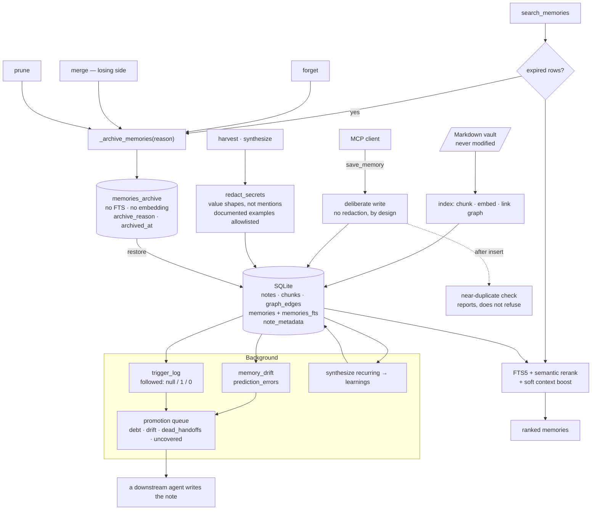

## 1. Executive Summary

NeuroStack indexes a folder of Markdown into SQLite — FTS5, embeddings, a
wiki-link graph — and serves it to any MCP client as search, graph queries and
agent memories. The stated boundary is that indexing never modifies the vault,
and the index lives in its own database so uninstalling leaves the notes
untouched.

One mark, and it rests on a habit that shows up in three separate places.

**Deleting is relocating, and the destination cannot be searched.** Four paths
remove a memory — an explicit forget, losing a merge, a TTL expiry, and a prune
— and all four go through one helper that copies the row into
`memories_archive` and then deletes it. The comment states the guarantee in
the form that matters: archived rows are invisible to search, full-text and
drift *"by construction — this table has no FTS index and no embedding — but
stay greppable and restorable forever."* That is structural invisibility, not a
predicate a future query might forget.

**Expiry runs at read time, by moving the row.** `search_memories` archives
anything past its expiry before it searches, with reason `expire`. A TTL
implemented as a `WHERE` clause is one a caller can omit; a TTL implemented as
a relocation cannot be.

**And the test asserts against the index, not the answer.** After a forget, the
suite runs a full-text MATCH on a unique token and asserts the result is empty.
A search result can be empty for a dozen reasons; an empty MATCH on the index
itself cannot.

What is not here is any notion of belief. Drift against the notes a memory
references is detected and recorded, ignored triggers are counted, and both
feed a promotion worklist for an agent to act on — nothing filters a read.

## 2. Mental Model

Two layers, and the project is careful about which one it owns.

The **vault** is the person's Markdown. NeuroStack reads it, chunks it, embeds
it and builds a link graph, and writes nothing back unless an optional write
tool is enabled. Even note status and tags live in NeuroStack's own
`note_metadata` table rather than in the file's frontmatter, described as the
read-only vault guarantee: *"Source of truth for status/tags/type — vault .md
files are never modified."*

The **memory layer** is what agents write: observations, decisions, learnings,
bugs, conventions, context. These are NeuroStack's own rows, and the background
work runs over them — synthesising recurring ones into learnings, detecting
when a memory no longer matches the notes it cites, and queueing the ones whose
knowledge should become notes.

The promotion queue is where the two layers meet, and the module says exactly
how far it will go: *"Detection is mechanical; only the note-writing needs
judgment."* It computes a worklist in four buckets and makes no LLM calls and
no writes.

## 3. Architecture

## 4. Essential Implementation Paths

- **Schema:** `src/neurostack/schema.py` — every table, and the migration
  ladder.
- **Memories and the archive:** `src/neurostack/memories.py`.
- **Search:** `src/neurostack/search.py`.
- **Redaction:** `src/neurostack/redact.py`.
- **Promotion worklist:** `src/neurostack/promotion.py`.
- **Drift:** `src/neurostack/memory_drift.py`.
- **Evaluation harness:** `src/neurostack/eval.py`.

## 5. Memory Data Model

A memory carries what you would expect plus three fields worth naming.

`embed_pending` exists because of a specific failure: when the embedding
service is down the row would otherwise be *"silently invisible to semantic
search forever"*, so the flag marks it for a backfill command instead. A
partial index over that flag makes finding them cheap.

`revision_count`, `merge_count` and `merged_from` record that a memory has been
edited or absorbed others — counts and a provenance list rather than a version
history. The previous text is not kept.

`expires_at` carries a partial index and is the one field that drives a removal
on its own.

On the note side, `note_metadata` holds status, tags and type in NeuroStack's
database rather than in the file, which is how the read-only guarantee survives
a feature that would otherwise need to edit frontmatter.

## 6. Retrieval Mechanics

FTS5 keyword search with optional semantic reranking, a hybrid path, and a soft
1.4× boost when a caller supplies a context that matches the workspace or a
tag. The docstring notes that the boost applies to the scored semantic paths
and that the no-query listing path has no score to boost — a small accuracy
about where a multiplier can and cannot act.

Workspace is an optional argument matched as an exact or prefix match. There is
no default and no requirement, so a caller who omits it reads every workspace;
this is a personal-vault tool rather than a multi-tenant service, and the field
reads as organisation rather than isolation.

## 7. Write Mechanics

`save_memory` inserts, then checks for near-duplicates and attaches them to the
response. The ordering is deliberate and the comment marks it non-blocking: the
duplicate is stored and the caller is told, rather than the write being refused.

Harvest and synthesize — the paths that write machine-generated text — run
their content through the redactor first. `save_memory` does not, and the
module explains why in a sentence worth keeping: agent-written memories are
deliberate, and *"silently rewriting them would corrupt intentional content.
Machine-generated text — a transcript summary or a synthesized learning — has
no such claim."*

The redactor's own rule is equally well stated. Patterns match *the shape of a
value, not a mention*, so `"the api key is wrong"` survives and a real key does
not, with the AWS documentation example on an explicit allowlist, because
*"false positives here silently damage stored knowledge, so precision beats
recall."*

## 8. Agent Integration

An MCP server with twenty-four tools, on PyPI and npm, with a setup command
that detects the platform and merges MCP configuration for Claude, Cursor,
Windsurf, Gemini CLI, VS Code and Codex. Optional write tools let a client
author or edit notes through git history.

## 9. Reliability, Safety, and Trust

**Negative eval — awarded**, on the two families in the evidence record.

**Tombstone — withheld.** The archive is a good mechanism and it is keyed on
the row. Nothing consults it on a write, so re-saving the same sentence after a
forget stores it again as a new memory. The near-duplicate check is the closest
thing and it looks only at live rows, and it reports rather than refuses.

**Trust state — withheld.** There is no field saying a memory is doubted.
What exists points that way and stops short: a `prediction_errors` row records
that a memory no longer matches the notes it references, and `trigger_log`
records whether a fired trigger was followed, ignored or still pending — the
comment notes that the pending value exists so a trigger has *"an obey count
and not only an ignore count"*, which is a real piece of measurement honesty.
Both feed the promotion worklist, where three ignores produce a `suggest:
retire`. Nothing filters a read on any of it.

**Audit log — withheld**, though `memories_archive` comes close enough to
describe. It is a durable record of every removal with a reason, a timestamp
and the full content — but it is a relocation of the row rather than an
append-only event record, it covers removals only, and an edit leaves nothing
behind but an incremented counter. The other logs are retrieval and feedback
logs, which the rubric excludes by name.

**Scope enforced — withheld.** Workspace is an optional argument, and an
omitted one reads everything.

**Bi-temporal — withheld.** `created_at`, `updated_at` and `expires_at` are all
record time.

**Human review — withheld.** The promotion queue is explicitly built for *"a
downstream agent (a weekly cron, or an interactive session)"* to consume, and
no path gates a write on a person's approval. What the design does protect is
the person's files rather than their judgement, which is a different and
defensible choice.

## 10. Tests, Evals, and Benchmarks

**No paper** and no `CITATION.cff`. The vault template ships notes summarising
memory-consolidation and spaced-repetition research, which are the system's
inspiration rather than a citation for it.

1,109 test functions across fifty-four files. Beyond the two families carrying
the mark, `test_no_answering.py` is an unusual one: it asserts that no
answering tool is exposed, that a particular model id is absent, and that the
output never mentions an LLM — a suite whose job is to keep a design promise
(*retrieval returns evidence and your AI does the reasoning*) from eroding.

`eval.py` is a retrieval-quality benchmark with a per-signal ablation sweep,
and two of its design notes are worth repeating. It is offline in CI, serving
query embeddings from a JSON cache so a run needs no live model. And every
search call passes `record=False` so an ablation sweep *"never mutates usage,
hotness, co-occurrence weights, or the prediction-error log between configs"* —
a system that learns from its own retrievals has to disable that learning to
measure itself, and this one does.

What is not committed is a labelled query set: `tests/eval/` holds a
`queries.sample.yaml` and a README, so the harness ships and the ground truth
is the reader's to supply. No benchmark result is in the tree.

## 11. For Your Own Build

- **Make invisibility structural.** An archive table with no full-text index
  and no embedding cannot be accidentally searched; a `WHERE archived = 0` can
  be accidentally omitted.
- **Route every delete through one helper with a reason.** Four paths
  converging on one function is how the guarantee stays true when the fifth
  path is added.
- **Enforce a TTL by relocating the row, not by a clause.** A clause is a thing
  each caller has to remember.
- **Assert against the index, not the result list.** An empty full-text MATCH
  on a unique token proves the thing is gone; an empty result proves only that
  this query returned nothing.
- **Redact machine-generated writes and leave deliberate ones alone**, and say
  why in the module — silently rewriting what someone meant to store is its own
  kind of data loss.
- **Turn off your learning loop when you measure it.** A retrieval evaluation
  that updates usage and hotness between configurations is measuring its own
  earlier passes.

## 12. Open Questions

- The archive keeps content, reason and time but not the text a revision
  replaced. Is an edit history planned, or is the revision count the intended
  granularity?
- Three ignored triggers produce `suggest: retire` in the worklist. What would
  it take for that to become a read-path effect rather than a suggestion —
  and is keeping it a suggestion the point?
- `eval.py` measures the marginal contribution of every ranking signal, and no
  labelled query set ships. Is there a published run, or is the harness meant
  to be pointed at a personal vault where the ground truth is the owner's?

## Appendix: File Index

- Schema and migrations: `src/neurostack/schema.py`
- Memories, archive, restore: `src/neurostack/memories.py`
- Search and status reconciliation: `src/neurostack/search.py`
- Redaction: `src/neurostack/redact.py`
- Harvest and synthesis: `src/neurostack/harvest.py`,
  `src/neurostack/synthesize.py`
- Drift and triggers: `src/neurostack/memory_drift.py`,
  `src/neurostack/triggers.py`
- Promotion worklist: `src/neurostack/promotion.py`
- Evaluation: `src/neurostack/eval.py`, `tests/eval/`
- Tests: `tests/test_memories.py`, `tests/test_redact.py`,
  `tests/test_no_answering.py`, `tests/test_memory_drift.py`

## Appendix: Recorded Searches

Checked against the repository tree at the pinned revision on 2026-09-20,
without a clone, during a corpus-wide audit of absence claims. The command is
the check that was actually run, not a local equivalent.

| Claim | Check | Result at this pin |
| --- | --- | --- |
| No benchmark result is in the tree | `GET /repos/<owner>/<repo>/git/trees/<this revision>?recursive=1`, filtered for benchmark-shaped paths | Two hits, both the harness the section already names: `tests/eval/README.md` and `tests/eval/queries.sample.yaml`. No result file of any kind, which is the claim. |

## History

**2026-09-19** — [`0616b2b6b663fde6b96cbd099a62c0701020f4ff`](https://github.com/raphasouthall/neurostack/commit/0616b2b6b663fde6b96cbd099a62c0701020f4ff) — first reading, at the head of `main`, version 0.19.0 on PyPI and npm. Screened with `scripts/screen_repo.py` before anything was read: one auto-run surface in an MCP server manifest, four build-time execution paths including an npm postinstall and a pytest conftest — the two files named `setup.py` are a client-configuration command rather than a distutils script, checked by reading their headers — one unpinned dependency surface, and a `CLAUDE.md` addressed to a reading agent, read as data throughout. Nothing was installed, built or run. Apache-2.0 with a third-party `NOTICE` and no rider. One mark. The reading covered the schema and its migration ladder, the memory table and its archive, all four removal paths and the single helper they share, the search path and its read-time expiry, the redaction pass and the reason it is not applied to deliberate writes, the drift, trigger and promotion machinery, and the memory and redaction test suites; the chunker, graph, community, export and CLI modules were read as context rather than as subject. Six marks are withheld with reasons in section 9. The one worth repeating is `tombstone`: the archive is careful, complete and restorable, and it is keyed on the row — nothing consults it when the same sentence is saved again.
