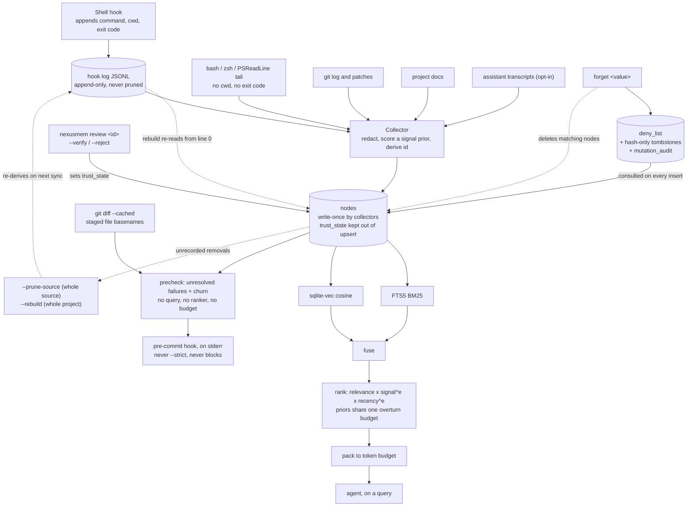

## 1. Executive Summary

NexusMem is a local memory for a coding agent whose central claim is about *what
it stores* rather than how it stores it. The README states it in one line: your
agent can read `git log`, and cannot read the four things you tried last Tuesday
that did not work.

**The unit is an event that happened on the machine.** One `nodes` table carries
every kind, and `NodeKind` declares seven: `shell_command`, `git_commit`,
`code_diff`, `doc_section`, `conversation_turn`, `session_summary` and `note`.
Six have a collector; `note` appears in the union and nowhere else in the tree —
no producer, no reader, no test. Each node has an id of
`sha256(projectId + kind + naturalKey)`, an event timestamp kept verbatim from
the source, a `signal` float, and a JSON `meta` blob. Everything is a
`better-sqlite3` file per repository. There is no server, no daemon, no cloud, no
account and no telemetry.

**Shell commands with exit codes are the part no other store in this atlas
holds.** An opt-in shell hook appends a JSONL line per command carrying the
command text, the working directory and the exit status; without it, scrape
fallbacks tail `~/.bash_history`, `~/.zsh_history` and PSReadLine, which have
none of those three. The distinction is made explicitly in `src/shell/detect.ts`
— once the hook is installed its PowerShell coverage is authoritative and the raw
PSReadLine file is skipped, because it *"duplicates the same commands with worse
data (no cwd, no exit code)."*

**Nothing is summarized on the way out.** Retrieval fuses BM25 over an
external-content FTS5 index with cosine over a `sqlite-vec` vec0 table, ranks the
result, and packs it to a token budget. What the agent receives is stored text
that was written at ingest, chosen by a ranker that decided what *not* to send.
One source, `session_summary`, runs a local model — at ingest, never on the read
path.

**Memory arrives without being asked, once, at the moment before a commit.**
`nexusmem precheck` takes the staged file list, tokenizes each *basename*, and
asks the store for unresolved failed commands that match — then prints them, plus
a high-churn warning, on stderr. `nexusmem hook git install` writes a marked
block into `.git/hooks/pre-commit` that runs it without `--strict`, so it can
warn and cannot block. Other reads here take no query either — `status` counts,
`list_recent_memory` takes the newest — but this is the only one whose selector
is *what the user is doing*, and it is a different design from the retrieval
pipeline beside it: no embeddings, no ranker, no token budget, one question —
*what already went wrong in the files you are about to commit?*

**The scope key is real, and it is maintained in two places rather than one.**
`project_id` is a required `WHERE` predicate on both retrieval arms
(`src/store/store.ts`), and a cross-project query opens each registered
repository's own database separately and tags every hit with its origin rather
than pooling them. The precheck path does not go through those methods: it takes
`store.raw` — *"escape hatch for tests and future modules"* — and writes its own
`nodes_fts MATCH … AND n.project_id = ?`. The predicate is there and the boundary
holds; what is worth noting is that only one of the two files enforcing it is the
store, and the escape hatch invites the third.

**The answer to "a credential got in" is the mechanism worth the report.** A store
that deliberately ingests assistant transcripts and shell command lines is
ingesting the two places a pasted credential actually lives, and deleting the
node is not enough, because the hook log those nodes were derived *from* is
append-only and a `sync --rebuild` reads it again from line zero. So
`nexusmem forget <value>` does not delete: it writes a `deny_list` row keyed on
the value — literal or regex — and `upsertNodes` consults that list before every
insert, forever. The comment on `deny-list.ts` states the shape in one line:
*"a standing rule that a specific value (a leaked key, a name) must never become
a node, checked on every insert rather than swept after the fact."*

Two details make it more than a filter. Over-broad patterns are refused at write
time — an empty literal, a regex that will not compile, and a regex that matches
the empty string, on the stated ground that each *"matches every node just as
broadly as an empty literal does."* And the record of the removal is
**hash-only**: each deleted node leaves a `tombstones` row with kind, source,
timestamp, signal, body length and `sha256` of body and title, never the text,
because *"this table exists to prove a value was removed, not to retain a second
copy of it… so the record that something was forgotten never itself becomes
something worth forgetting."* That sentence is the best argument in this corpus
for why a tombstone should not store what it tombstones.

## 2. Mental Model

An event happens on the machine. A collector notices it, redacts it, scores it a
prior, and writes it once under a content-derived id. No collector ever revises
it. It is retrieved by fusing two indexes, re-ordered by two priors that are
bounded in how far they may overturn the query, cut to a token budget, and handed
over as the text that was stored — or, on the pre-commit path, selected by the
names of the files you staged and printed without any of that.

The epistemic content of that loop is thin by design, and the honest way to draw
it is to show what closes it and what does not. One arrow runs backwards into the
store and it is a person's: `nexusmem review` sets `trust_state` on a node the
collectors are forbidden to overwrite. Everything else leaving the store is
wholesale.

The two dotted paths out of the node store are the finding, and they end
differently. A prune is keyed on the *source*: the append-only hook log is still
on disk, nothing records that the data was meant to be gone, and the next full
sync restores it. A `forget` is keyed on the *value*, and the rule it writes is
consulted on every subsequent insert — including the insert a rebuild performs
from that same untouched log. The coarse operation is the reversible one; the
fine one is not, which is the opposite of the usual arrangement and the right way
round.

## 3. Architecture

Nothing runs. `nexusmem` is an npm package requiring Node 22 whose runtime
dependencies are `better-sqlite3`, `sqlite-vec`, the MCP SDK, `commander`,
`picocolors` and `zod`. State is one SQLite file per repository plus a
user-scoped registry listing the repositories that exist, so a cross-project
query can find them.

Four surfaces read it. The CLI is the primary one (`init`, `sync`, `query`,
`precheck`, `status`, `projects`, per-source `scan-*` verbs, `hook`, `mcp`). The
MCP server exposes four tools over stdio — `search_memory`, `sync_project`,
`get_status`, `list_recent_memory` — none of which writes a memory. A VS Code
extension adds a panel with search, refresh and sync commands. And
`.git/hooks/pre-commit`, if the user installs it, reads the store on every commit.

The operator cost is a `sync`. There is no scheduler in the tree: collection
happens when the CLI is invoked, when the shell hook fires, or when an agent
calls `sync_project`. The tool writes into two files it does not own — a shell
profile and `.git/hooks/pre-commit` — one to feed the store, one to read it, and
neither happens unless asked: `init --hook` is off by default and the git hook
has no `init` flag at all.

## 4. Essential Implementation Paths

- **Ingest.** `src/collectors/` per source → `redact()` → a `signal` prior →
  `sha256(projectId + kind + naturalKey)` → `INSERT` in `src/store/store.ts`,
  with a per-source cursor in `sync_state` so a re-run is incremental.
- **Shell tiering.** `src/shell/detect.ts` chooses between the hook log
  (`src/shell/hook-log.ts`) and the three scrape parsers, and suppresses
  PSReadLine once the hook covers it.
- **Retrieval.** `src/retrieval/query-pipeline.ts` fans out to
  `store.search` (BM25) and `store.vectorSearch`, fuses in `fuse.ts`, orders in
  `rank.ts`, and cuts in `pack.ts`.
- **Pre-commit read.** `src/cli/commands/precheck.ts` gets the staged paths from
  `git diff --cached --name-only`, `src/correlate/precheck.ts:assessFiles` runs
  two SQL queries per file through `store.raw`, and
  `src/hooks/install-git-precommit.ts` is what puts the caller in
  `.git/hooks/pre-commit`.
- **Identity migration.** `src/store/reconcile.ts` moves nodes to a new project
  id when a repository's remote is renamed, preserving each node's original
  `created_at`.
- **Correlation.** `src/correlate/` links a failed `shell_command` to whatever
  later resolved it, and `filterBoilerplateTokens` there is the shared
  corpus-relative token filter both the linker and the pre-commit read use.
- **Structure.** `src/structure/` extracts relative import specifiers by regex,
  resolves them against the tracked-path set, and `store.replaceFileEdges` swaps
  the whole `file_edges` snapshot in one transaction.

## 5. Memory Data Model

Alongside `nodes`: `node_files` (path,
insertions, deletions, rename source) with its own index because path-scoped
recall — *"what happened to `src/store/db.ts`?"* — is a first-class query;
`node_links` for directed typed edges; `nodes_fts`, an **external-content** FTS5
index that stores no copy of the text and points back at `nodes.rowid`, halving
the searchable footprint; `nodes_vec`, a vec0 table; `sync_state` for per-source
cursors; and `projects`.

`file_edges` (schema v4) is the one table that is not made of memories, and the
migration comment says why it could not be: a source file is not a node, and
`node_links` foreign-keys both of its columns to `nodes.id`, so the import graph
needs its own table *and* its own `project_id` column — *"there is no node to
join through for it."* It also has the opposite lifecycle to everything else
here. Nodes are write-once and never pruned below a whole source; `file_edges`
describes the working tree rather than history, has no cursor to resume from, and
is deleted and reinserted in its entirety on every sync. The store's only
wholesale, routine, unremarkable delete is over the data that is not memory.

Two timestamps sit on every node and the distinction is deliberate: `ts` is the
event's own time kept verbatim from the source, `ts_epoch` the same instant as
integer milliseconds *"so range scans and ordering never parse strings"*, and
`created_at` the moment the row was written. `reconcile.ts` carries `created_at`
forward unchanged through a project-id migration, so ingest time survives a
repository rename.

**Both axes are queried, which is what makes the pair bi-temporal rather than
decorative.** Event time drives ranking; record time is what `--as-of` filters
on, adding `AND (? IS NULL OR n.created_at <= ?)` to the lexical arm in
`src/store/search.ts` and its equivalent to the vector arm. So "what did you hold
last Tuesday" and "what happened last Tuesday" are different questions here, and
`tests/store.test.ts:468` pins the distinction in its case title — *"asOfEpoch
excludes a node recorded after the cutoff, even though it happened before"*.
Section 9b names the one path on which that separation goes lossy.

Two schema columns carry the epistemics. `provenance` is a four-tier ordering —
`observed`, `authored`, `recorded`, `derived` — backfilled by kind on migration
*"since an unchanged node is never rewritten by a later sync… and so would never
otherwise pick up the right value"*, and set explicitly by each collector.
`defaultProvenanceForKind` is the whole taxonomy in one `switch`: commits, diffs
and shell commands are `observed`; docs and notes are `authored`, *"a human's own
written claim"*; conversation turns are `recorded`, *"verbatim discourse about
events"*; session summaries are `derived`, *"a model's distillation"*.
`supersedes` is a nullable pointer from the newer node to the one it replaces,
with a partial index over the non-null rows.

**An ordering is not a state machine, and the code makes the distinction better
than the rubric does.** Four tiers distinguish where a claim came from, not
whether anyone has checked it, and the V10 migration says so in as many words
before adding `trust_state` as the separate axis — which is a genuine
candidate/verified/rejected field, and is withheld for a different reason set out
in section 9a. More to the point here, the ranker's floors
are an explicit decision that no tier may gate — *"Floors keep the combination a
reordering within each dimension instead of an on/off gate"* — so `derived`
decays four times faster than `observed` and is still returned. The tier has
exactly one exclusion anywhere in the system, and it is not from retrieval: an
`observed` node is never offered as a staleness candidate, because the store
declines to suggest that something that happened has gone out of date.

There is no `deleted_at`, because a deletion is a row in a different table.

## 6. Retrieval Mechanics

BM25 and vector cosine run as independent arms and are fused, then ranked as
`relevance x signalWeight^e1 x recencyFactor^e2`.

**The exponents are the interesting part, and the reasoning behind them is
committed in a comment that is worth reading in full.** `relevance` is the only
factor derived from the question; `signal` and `recency` are priors that hold
before any query exists. Multiplied as equals, the priors win outright: signal
spans 5x and recency 3.33x against relevance's 6.7x, so *"a well-scored recent
commit could outrank a document that matched the question far better"* — observed
live, a `fix:` commit at signal .9 taking rank 1 from the top-fused doc section
at signal .55, on a 44% signal edge against a 15% relevance deficit.

The fix bounds rather than bans: exponents cap how far the priors may jointly
overturn the query, and because the transform is monotonic the priors still order
equally-relevant hits exactly as before. The second iteration is the one worth
copying — capping each prior separately caps neither, because the score
multiplies them and two priors each worth 2x are worth 4x together. The comment
names why that is not a corner case: it *"describes every commit made during an
active working day, both fresh and high-signal at once, so the failure
concentrated on exactly the days with the most worth remembering."* So
`MAX_PRIOR_OVERTURN` became a budget for all priors jointly, split evenly, each
prior raised to the power that makes its whole range worth its share — and adding
a third prior re-divides the same budget rather than enlarging it.

The vector arm carries a subtlety worth flagging: `nodes_vec` applies its `MATCH`
and `k` before the `project_id` filter is joined, so `vectorSearch` overfetches by
8x (`Math.max(limit * 8, 50)`) to compensate. That is a heuristic, not a
guarantee — a project whose nodes are sparse among a large neighbour set can
still under-return.

`pack.ts` then cuts to a token budget. Nothing is rewritten on the way out.

**The second read path answers a question nobody typed, and it is built from a
different set of parts.** `assessFiles` takes the staged paths and, per file,
word-splits the *basename* — dropping the trailing extension first, because a
bare `.ts` would become a required AND-match token that *"almost no real command
or discussion ever types out literally, silently suppressing nearly every match
on this (TS-heavy) codebase"* — then asks for `shell_command` nodes with a
non-zero `exitCode`, inside a 30-day window, that carry no `resolved_by:*` link.
Beside it, a churn count from `node_files` scoped to `kind = 'git_commit'` only,
because `code_diff` nodes record the identical per-commit touches and summing
both would double-count.

The match is the weak joint and the project says so in the module comment rather
than in a footnote: a failure whose command does not share a word with the file's
name is invisible to it. The direction of that error is the safe one — silence
rather than noise — but the pairing is worth naming, because the two arms fail
oppositely. Retrieval over-returns and then ranks; the pre-commit read
under-returns and then prints everything it found.

**Two AND-matches run through a document-frequency filter first — this one and
the failure-to-fix linker's — and the reasoning behind it is the best empirical
work in the repository.** `filterBoilerplateTokens` drops any token appearing in more than 20% of this
project's own nodes of the relevant kinds, skipping the filter entirely below ten
such nodes because *"any word can trivially hit 20%+ just by appearing once or
twice"* on a young corpus. The threshold comes from measurement, not taste: the
known `id` false positive measures 22–40% document frequency across two real
corpora, this repository's own name and verbs measure 33–39% in its own history,
and the terms that carried real links — `whoami`, `wsl`, `publish` — all measure
under 2%.

What makes it worth copying is the failure it was written for. Dogfooding against
a second, previously unseen project found a command made entirely of the tool's
own words (`nexusmem sync`) AND-matching an unrelated turn, and **bm25 could not
separate it from a true positive**: the false positive scored −9.685, stronger
than two real links at −5.899 and −6.559. The comment names why, and it is a
property of the scoring function rather than a tuning miss — bm25 *"rewards
rarity within whatever corpus it's run against"*, and in the smaller corpus those
words had not accumulated enough occurrences to look generic. Then the disclosure
that makes the whole passage trustworthy: at that project's measured frequencies
(9.3% and 4.6%) the filter *does not* catch that instance, and the comment
says so, restricting the claim to the class the numbers support. When every token
is boilerplate the heuristic returns nothing rather than falling back unfiltered,
because its design *"already prefers a missed link over a false one."*

**Two query-independent priors ride on top of the fused score, and provenance
tunes one of them.** Recency decays on a half-life multiplied per tier by
`HALF_LIFE_RATIO`, so a `derived` node's relevance halves fastest and an
`observed` one's slowest. The comment scopes the claim exactly as far as the
evidence goes: *"The exact ratios are judgment calls, not measured optima; only
the ordering (observed > authored > recorded > derived) is the design claim."*
That is the right way to ship a tuned constant — assert the monotonicity, not the
numbers. A superseded node is multiplied by `SUPERSEDED_PENALTY = 0.5` rather
than dropped, *"not near-zero, since it must stay reachable if it's still the
best match"* — a supersession that demotes and refuses to hide. And `pack.ts`
prints the provenance into the packed context, one bracket per line, so the model
reading the memory is told which kind of claim it is looking at. A field that is
set by every producer, consumed by the ranker and rendered to the reader is a
rarer thing than its few lines of code suggest.

## 7. Write Mechanics

Writes are synchronous and happen inside a `sync`; there is no queue and no
background pass. Each collector resumes from a cursor in `sync_state`, so a
re-run is incremental rather than a re-scan.

**Redaction runs before anything reaches the index**, and it is split into two
profiles for a reason the module states precisely. Shape rules — private-key
blocks, `AKIA` keys, `gh[pousr]_` tokens, Slack tokens, JWTs — match strings
nothing else produces and are safe over source code. The broader key/value rule
is not: it would match `const apiKey = process.env.API_KEY` *"and would corrupt
the very lines a diff is indexed for."* So conversation text gets the full set
and code diffs get `high-confidence` only. The header calls it *"a safety net,
not a guarantee."*

**Deletion has three granules and only the finest one is recorded.**
`forget <value>` is the finest: one transaction inserts the deny-list entry,
opens a `mutation_audit` row *before* the sweep so tombstones can foreign-key a
real id, deletes every matching node across the live project and its prior
identities, writes a hash-only tombstone each, and closes the audit row with the
affected count. The audit row is written *"whether or not anything matched —
pre-emptively blocking a value that hasn't appeared yet is a valid, auditable
call."* Without `--yes` it counts and prints, matching the prune convention
exactly. `forget --list` shows the standing rules, and `--export`/`--import`
move them between checkouts, since `deny_list` lives in the gitignored
`.nexusmem/memory.db` and *"is exactly what… never travels with `git clone`."*

`pruneSourceNodes` is the middle granule: one source, applied across the live
project id **and every prior identity of the same repository** — a scope derived
from `listOtherProjectIds` rather than from "every `project_id` in the table",
which is the conservative choice. Without `--yes` it prints the matching count
and removes nothing; with it, the output says *"this cannot be undone."* It
writes no audit row and no tombstone, so the coarse path is the unrecorded one
and a store's removal history covers only what was removed by value.
`sync --rebuild` is the coarsest and is likewise silent.

**Supersession is the non-destructive option and the write is still manual.**
`mark-stale <nodeId> --supersedes <newNodeId>` sets one pointer and validates
that neither id is the other and that both belong to the current project.
`nexusmem stale` prompts it, listing non-`observed` nodes older than 45 days that
nothing supersedes, oldest first — and its header refuses the stronger claim:
*"Heuristic surfacing only, not contradiction detection."*

**What sits on top of that list is the most interesting thing in the tree, and
its cost model is the reason it can be on by default.** `checkContradictions`
takes each stale candidate, finds the nearest node *newer* than it by vector
search, and asks a local Ollama model one question: does the newer one make the
older one wrong? The instruction is narrow — *"Say YES only if the NEWER memory
states something that makes the OLDER one factually wrong or obsolete — a
decision reversed, a bug fixed, a plan abandoned… When unsure, say NO"* — and an
unparseable reply is a `null`, never a guessed YES, on the stated grounds that a
missed contradiction costs nothing while a false accusation prints beside a real
memory.

Three decisions make it affordable. Judgments are **memoized** in
`contradiction_checks` either way, so re-running against the same corpus
converges to zero model calls. New judgments are **bounded** — `maxPerSync`
defaults to three, so `sync` spends at most three completions and an explicit
`stale --check-contradictions` run is unbounded. And either provider being
unreachable degrades a candidate to "no suggestion" rather than an error. The
neighbour limit is the one number with a measurement behind it: five was raised
to twenty-five because a chunked conversation's own same-timestamp siblings
*"dominate a candidate's own nearest neighbours by construction"*, measured at
fifteen siblings ahead of the first genuinely newer node across ten real
candidates, so every candidate silently got zero suggestions regardless of the
model.

**It is suggest-only, and both answers are recordable.** The checker's only write
is the memoized judgment; `supersedes` is never set by it, so accepting a
suggestion means a person typing `mark-stale`. Declining one is the other write:
`nexusmem stale --dismiss <candidateId>` sets `dismissed = 1` on the memo row
through a statement scoped by the same `nodes.project_id` join the listing uses,
and both open-suggestion queries carry `c.dismissed = 0`, so a suggestion the
reviewer judged wrong stops resurfacing without anyone marking the candidate
stale to silence it. That column earns its place precisely because the
memoization makes re-runs free: a judged pair is never re-asked, so without a
dismissal the same rejected suggestion would print on every `sync` and every
`status` forever. What it does not carry is *who* dismissed it or *when* — the
memo holds the verdict and not its provenance, so the store can say a suggestion
was declined and cannot say by whom.

`nexusmem status` closes half of the gap that leaves: it calls
`listOtherProjectIds` and `countProjectNodes` and prints how many nodes prior
identities of this repository still hold, with the prune command to run, so data
a rename stranded is visible without opening the database by hand.
What it does not do is make that data reachable by a query — the read arms filter
on the live `project_id`, so a stale identity's nodes are counted, named and
still unretrievable.

## 8. Agent Integration

Four MCP tools, none of which writes a memory: `search_memory`, `sync_project`,
`get_status`, `list_recent_memory`. The VS Code extension is a panel — search,
refresh, sync — and by the rubric's own line, viewing is not reviewing; the
pre-commit warning prints and asks nothing either.

**The review surface is the CLI, and only the CLI.** `nexusmem review <nodeId>
--verify` / `--reject` (`src/cli/commands/review.ts`, wired at
`src/cli/index.ts:283-297`, which refuses unless exactly one of the two flags is
passed) resolves the node, refuses an id belonging to another project, and writes
the person's verdict to `trust_state` through `store.setTrustState`. Beside it
`nexusmem stale --dismiss <nodeId>` records the other kind of verdict — that a
contradiction the local model proposed is wrong — by setting `dismissed = 1` on
the memo row, which both open-suggestion queries filter on. Either way a human's
judgement lands in the store as a row a later read consults, which is the
distinction the mark draws. That none of it is reachable from the agent-facing
surfaces is a fact about who the reviewer has to be, not about whether the review
happens.

Two components run without being asked. The shell hook writes to its own JSONL
rather than to the database. The git pre-commit hook reads.

**The git-hook installer is the most carefully written file in the release, and
none of its care is about memory.** `.git/hooks/pre-commit` is a file real tools
own — husky, lint-staged, lefthook — so the installer marks its block with
sentinels, refuses a foreign hook without `--force`, and under `--force`
*appends* rather than prepends, so *"the existing hook's own commands still run
first"* and nexusmem's check cannot reorder or override a decision the other hook
already made. Removing restores the foreign content and deletes the file when
nothing but the shebang the installer itself added remains. The generated script
resolves `command -v nexusmem` at runtime and no-ops when it is missing, so an
uninstalled binary prints nothing rather than breaking a commit; it passes no
`--strict`, and a committed test asserts exactly that — *"the rendered snippet
invokes precheck with no flags, so it can never block a commit on its own."*
Stated limits are in the module comment rather than discovered: a foreign hook
that `exit`s early prevents this block from ever running, and the installer says
so.

## 9. Reliability, Safety, and Trust

`signal` is a float in `[0.2, 1]` consulted only by the ranker. It is set at
ingest from the kind and source and nothing updates it from use, so a node that
is retrieved constantly and one that is never retrieved carry the same prior
forever. **Nothing withholds a node from being returned.** `provenance`,
`supersedes`, a confirmed contradiction and a human's own `rejected` verdict all
change a node's *weight* or its *visibility in a maintenance list*, and none of
them changes its *admissibility*. That is one sentence about four separate
mechanisms, and it is why `trust_state` is withheld: the store has a reviewer, a
verdict and three states, and no query that acts on them.

**The audit is real and its coverage is partial, which is the thing to check
before relying on it.** `mutation_audit` is append-only, has one producer, and
that producer sits on a user-reachable CLI command. It is also the only producer:
a grep for `INSERT INTO mutation_audit` across `src/store/` returns exactly one
file. So the store can answer "what values have been forgotten here, when, by
what pattern, and how many nodes went" and cannot answer the same question about
a pruned source. The asymmetry runs the useful way — the recorded path is the one
a compliance question is about — and it is still an asymmetry a reader should
know before quoting the table as a removal history.

The local-first posture is genuine — no network egress on the read path, no
account, no telemetry — and the failure modes chosen under it are consistently
the non-fatal ones. `openAllProjectSources` treats every failure as recoverable
by design: *"a cross-project query that refuses to answer because one of six
repositories is on an unplugged drive would be worse than one that answers from
five and says so."*

The privacy exposure is structural and the remedy is the deny list. The two
collectors most likely to capture a credential are the two the design most wants
— assistant transcripts and shell command lines — and redaction declares itself
*"a safety net, not a guarantee."* What closes the loop is that the remedy
survives the operation that would undo it: the hook log still holds the line
after a `forget`, and the deny list is what stops it becoming a node again. The
committed test is the one that proves the claim rather than the code — ingest a
secret, confirm it is retrievable, forget it, `sync --rebuild` from the untouched
log, then assert the secret returns `[]` *and* that a control command in the same
log still returns hits, which is what separates a working deny list from a broken
rebuild.

The pre-commit path widens where that text can surface without widening what is
stored. A failed command is printed, truncated to 90 characters, into the output
of `git commit` — which is a terminal a person may be screen-sharing, and a
buffer CI logs if the hook ever runs there. The store's redaction pass is the
only thing standing between a credential typed into a shell and that output, and
the module that wrote it calls itself *"a safety net, not a guarantee."*

## 9a. The two trust axes, and who is allowed to set them

`provenance` says where a claim came from — `observed`, `authored`, `recorded`,
`derived` — and the V10 migration opens by saying what that does not cover:

> `provenance` records where a claim came from […] it says nothing about whether
> anyone has checked it. `trust_state` is that separate axis — 'candidate' until
> a human runs `nexusmem review`, then 'verified' or 'rejected'.

Three properties make it a mechanism rather than a column, and a fourth is
the reason the mark is withheld anyway.

**A re-sync cannot overwrite a verdict.** `trust_state` is deliberately left out
of `upsertNodes`' own INSERT columns and its `ON CONFLICT SET` clause, the same
rule `supersedes` already followed, so a collector re-reading the same shell
command or commit tomorrow cannot silently return a rejected node to
`candidate`. The default does the work for a genuinely new node and nothing
else touches it.

**It reaches the ranker, and it is not a delete.** Both retrieval arms select
`trust_state`, and `rank.ts` multiplies a rejected node's score by
`REJECTED_TRUST_PENALTY = 0.3` — harsher than the supersession penalty, under a
comment that draws the distinction: *"a human explicitly rejected this claim, not
just a newer node quietly replacing it. Still not zero — `review` demotes, it
doesn't delete."* A rejected memory can still surface when nothing better exists,
which is a defensible product decision for a store whose reviewer may have been
wrong.

**And it is why `trust_state` is withheld.** The mark asks for a discrete status
*"including at least one state that withholds a memory from being treated as
true"*, and draws the line at what the status is used for: a score gets used for
ranking, a state gets used for filtering. A grep for `trust_state` across `src/`
returns the schema, the two retrieval arms selecting it, `nodes.ts:290` writing
it, and `rank.ts:192` multiplying by `REJECTED_TRUST_PENALTY = 0.3`. Nothing
filters on it anywhere. So this is the rubric's own collapse case built
deliberately and well: a genuine three-value status, human-set, protected from
re-sync, surfaced to the model — used as a confidence number. Everything except
the property the mark is for is here, and one `WHERE trust_state != 'rejected'`
on an opt-in flag would supply it.

**It reaches the model.** `pack.ts` prefixes a reviewed node's line with
`[verified]` or `[rejected]` in the injected context and stays *"silent for the
overwhelming default ('candidate'): only a reviewed node earns a tag."* The
absence of a tag means unreviewed rather than fine, and the tag budget is spent
only where a person actually looked.

Beside it, `nexusmem stale --dismiss` closes the gap the contradiction memo had.
A YES verdict a reviewer disagreed with sets `dismissed = 1` and both
open-suggestion queries filter `c.dismissed = 0`, so it stops resurfacing. The
migration says why that needed its own column rather than reusing supersession:
without it the listing *"re-prints every open YES verdict on every run forever,
with mark-stale as the only way to make one stop, which only works when the
suggestion was actually right."* Marking a node stale to silence a wrong
suggestion is a lie in the data, and this is the field that avoids telling it.

## 9a-bis. What the GitHub source carries in with it

`nexusmem sync --github` collects issue and PR threads into
`kind: 'github_thread'` nodes, rendering the opening body and every comment
under a `--- @author (date) ---` header, truncated at 4,000 characters. Two
properties of that node are worth stating because they are the first time this
store ingests text **a stranger wrote**.

**Its provenance tier is `recorded`** — the collector's own comment says
*"verbatim discourse, same tier as conversation_turn."* Within the four-tier
ordering that is defensible: `provenance` encodes *how the claim was obtained*,
and an issue comment is obtained the same way a chat turn is. The consequence is
that the ordering carries no information about **who** made the claim. A shell
command the user ran is `observed`; a sentence the user typed is `recorded`; a
sentence a stranger typed into a bug report three years ago is also `recorded`,
and the ranker's per-tier decay multiplier treats them identically. Authorship
survives only as `@author` text inside the body, which nothing parses.

**It does not pass through redaction, and the reason is legible.**
`conversation/redact.ts` describes its own scope: it exists *"because
conversation text is the collector most likely to contain something sensitive (a
pasted credential, a key a user asked for help debugging), but a committed `.env`
or a hard-coded key makes the code-diff collector a real second candidate."* Two
collectors call it — `conversation.ts` in full and `diffs.ts` on the
`high-confidence` profile, the latter because the key/value rule *"matches
ordinary code such as `const apiKey = process.env.API_KEY` and would corrupt the
very lines a diff is indexed for."* Neither the store nor `sync` applies it
centrally.

So the coverage is a reasoned two of seven rather than an oversight. A GitHub
thread is nonetheless a third candidate of exactly the shape the docstring
describes — a bug report is where people paste the credential they are asking for
help with — and it is stored verbatim, indexed into FTS, embedded, and packed
into agent context. `shell-history.ts`, the collector this system is named for,
does not redact either; a `curl -H "Authorization: Bearer …"` is captured as
typed.

## 9b. Scope pushed into the nearest-neighbour search

`nodes_vec` declares `project_id TEXT PARTITION KEY` rather than carrying it as a
plain column, and the migration comment reports the failure that change removes,
reproduced before it was written:

> `vectorSearch` had no way to ask vec0 for "k nearest *in this project*", only
> "k nearest globally, then discard the wrong project's rows" […] a heuristic
> that returns fewer than `limit` results, silently, whenever a small project
> shares a database with a much larger one and none of its true nearest
> neighbours make the global cut. Reproduced exactly that failure in a scratch
> script before writing this: 495 rows in one project + 5 in another, global
> `k=50` surfaced 0 of the 5; partitioned `k=5` surfaced all 5.

That is a scope filter applied *inside* the search rather than after it, and the
failure it closes is the one worth naming: the arrangement it replaced was not
wrong about which rows it returned, it was silently short. The migration also
records that vec0 cannot `ALTER TABLE ADD COLUMN` or be renamed without
orphaning its shadow tables — *"tried first, confirmed broken"* — so the upgrade
stages into a temp table, drops the virtual table and reloads.

One overfetch survives, scoped to a single path, and the function's own comment
concedes it: *"`created_at` isn't a partition column though (an `--as-of` query is
rare and per-query, not worth a second one), so that path still over-fetches to
compensate for rows the time filter drops afterward — the same heuristic this
function used to need for both dimensions, now needed for only one."*

The residual failure is worth spelling out, because it bites hardest on the query
the feature exists for. With `--as-of`, vec0 returns the `k = max(limit * 8, 50)`
nearest neighbours *within the project* — the partition key does its job — and
`n.created_at <= ?` then removes rows, and `LIMIT` takes what is left. The result
is short, silently, whenever more than `k - limit` of the project's nearest
neighbours to that query were recorded after the cutoff. In a project whose
recent months are its busiest, asking what the store held a year ago is exactly
the case where the k-window fills with post-cutoff rows the filter was always
going to discard, and an empty answer is indistinguishable from *the store knew
nothing about this a year ago*.

The bi-temporal semantics are pinned — `store.test.ts`'s *"asOfEpoch excludes a
node recorded after the cutoff, even though it happened before"* is the exact
distinction the mark is about. What no committed case covers is the short
return: the cross-project version of this bug was reproduced in a scratch script
before it was fixed, and its surviving twin on the time axis is reasoned about
rather than measured.

## 10. Tests, Evals, and Benchmarks

835 test declarations across 57 files, beside a 28-case labelled retrieval
corpus in `eval/queries.json` driven by `scripts/eval.ts`. Coverage tracks the
mechanisms:
`store.test.ts`, `query-pipeline.test.ts`, `retrieval.test.ts`, `vector.test.ts`,
`reconcile.test.ts`, `cross-project.test.ts`, `conversation.test.ts`,
`correlate.test.ts`, `precheck.test.ts`, `forget.test.ts`, `stale.test.ts`,
`contradiction.test.ts`, `slm-contradiction.test.ts`,
`sync-auto-contradictions.test.ts`, `schema.test.ts`, `git-hook-install.test.ts`,
`structure.test.ts`, a per-command CLI file for each `scan-*` subcommand, and
per-parser shell tests. I did not run the suite.

**The eval harness produced the best sentence in the repository, and it is an
argument against its own score.** `MAX_PRIOR_OVERTURN` bounds how far the
query-independent priors may overturn a relevance gap. Its value was a guess, and
once the harness existed it was grid-searched:

> 1.5 regresses (MRR 0.864), 2 scores 0.924, 2.4 scores 0.943, and 3-5 tie at a
> higher 0.946 plateau, before a cliff at 6 (0.927, q007 regresses) — all with
> zero per-case regressions *in that corpus*. But the corpus doesn't cover every
> case this constant guards: `tests/retrieval.test.ts`'s "dogfooded regression"
> case […] starts failing again anywhere above ~2.5 — the eval-optimal 3-5
> plateau silently re-opens the original bug this mechanism exists to prevent,
> just outside this specific 28-query corpus's view.

The constant is set to 2.4: not the optimum, but the highest value that still
passes every case in both suites, with the instruction to re-run both after
touching it.

**Nobody outside that machine can check any of it.** `scripts/eval.ts` imports
`loadContext` and `OllamaEmbeddingProvider` and runs against the local project's
own store, and a case's ground truth is a list of `relevantNodeIds` — which are
`sha256(projectId + kind + naturalKey)`, computed over the author's own shell
commands, commits and conversations. A reader cloning this repository gets 28
queries whose correct answers are ids no other database contains. The harness is
real, the discipline around it is real, and the corpus is not portable: the MRR
figures, the grid search and the plateau it declined are all unreproducible
outside the machine that produced them. Nothing about that is hidden — it is a
consequence of content-addressed ids over private data, and it is the same
trade the atlas records for every production-derived evaluation. A project that builds a scoring harness and then *declines to take
its top score* — because a regression test outside the corpus knows something the
corpus does not — is the answer to the failure this atlas records as a metric
optimised into a bug. The eval corpus is 28 hand-labelled cases and its limits
are stated rather than implied.

The contradiction files are worth naming for what they assert rather than what
they cover. `contradiction.test.ts` pins the memoization contract from both
sides — *"remembers a judged pair either way, so the next run can skip re-asking
the model"* and *"lists only YES verdicts"* — and pins the lifecycle at both ends:
a suggestion *"drops … once the candidate is superseded"*, and a check
*"cascades away with either node, so a check never outlives what it judged."*
`schema.test.ts` replays a real subset of the migrations against hand-seeded
old-shaped rows rather than re-typing frozen SQL, which is how a backfill claim
gets tested instead of asserted.

**`forget.test.ts` is the file to read first, because it tests the failure the
feature exists to prevent rather than the feature.** Its central case is titled
*"the resurrection bug is fixed: a forgotten value does not come back after
`sync --rebuild`, while an unrelated command in the same log does"*, and it is
built as a positive control around a negative assertion: append a fake key and a
control command to the hook log, sync, **assert the secret is retrievable** —
the comment says why, *"confirms the secret was actually ingested before we try
to forget it"* — forget it, rebuild from the untouched append-only log, then
assert `search(projectId, secret, 10)` returns `[]` while the control command
still returns hits, *"proves it's the deny-list, not a broken rebuild"*. It then
checks `deny_list` still holds one row, because *"`--rebuild` must not wipe the
deny-list along with the nodes"*. Four of the five assertions exist to rule out a
way of passing for the wrong reason.

**The negative assertions are on the read path, which is what earns the mark.**
`store.test.ts` writes a node under one project and asserts `search('proj-b', …)`
returns nothing; `vector.test.ts` embeds a node under another project and asserts
`vectorSearch` for that exact vector returns nothing; and `store.test.ts` names a
live defect in its own case title — *"does not let the generic word `id` pull in
an unrelated node over a real match"* — then asserts the noise node is absent
from the results *and* that the right node is first. Material that exists and
must not come back is what each of them pins. `precheck.test.ts` extends the same
shape to the pre-commit arm: a failure already linked as resolved, a failure
outside the window, and a failure whose command shares no word with the file are
each asserted to produce an empty list.

**`prune-source.test.ts` is still the file to read, for a reason the mark does
not capture.** Its cases assert that a prune *"deletes exactly the named source
and nothing else"*, that it reaches a stale prior identity of the same
repository, and — the sharp one — that it *"never touches a project id this
repo's database never registered."* That last test carries an inline
discriminating control: `// discriminating: an unscoped sweep would remove this
too`, naming in the test what a broken implementation would do to it. Very few
negative suites in this atlas do that, and the technique is worth more than the
flag beside it. The adjacent case documents a real defect the project found on
2026-08-15: after a remote rename, `reconcile.ts` deliberately leaves dead
pre-hook shell nodes under the old project id, and a live-id-only prune could not
reach them.

**A benchmark is committed, and it measures packing rather than retrieval.**
`scripts/benchmark.ts` (`npm run bench`) runs the real query pipeline over a
synced corpus and compares `packed.tokensUsed` against two baselines built from
the same file set the packed answer draws on — `git show HEAD:<path>` for every
file touched, and `git log -p` over those files' full history. Its own header
draws the distinction the number needs: holding the file set constant *"isolates
the value the packing step adds, without also re-litigating retrieval quality in
the same number."* The query set is derived mechanically from the corpus rather
than hand-picked — real conversation questions where a corpus has them, generated
"why" questions from conventional-commit subjects where it does not — and results
are gitignored on purpose, so what is reproducible is the script and not a table.
The published figures (95.1% and 98.8% aggregate against full-file reads, on this
repository and on a synced clone of `vitejs/vite`) need an Ollama embedding
endpoint and a synced database to reproduce, so this reading did not run them.

What is still absent is the harder measurement: no retrieval-quality evaluation,
no committed eval corpus, and no ablation of the ranker's exponents — notable
because the exponent design is the most carefully argued code in the repository.
Its evidence is dogfooding recorded in comments, and `docs/competitor-comparison.md`
says the same thing about its own numbers: the file set is *"NexusMem's own
ranking, not an independent judge."*

## 11. For Your Own Build

### Steal

- **Bound how far query-independent priors may overturn the query, as one budget
  shared between them.** Recency and importance are priors that exist before
  anyone asks anything, and multiplying them in as equals lets them win. Capping
  each separately does not work, because the score multiplies. One joint budget,
  split evenly, with each prior raised to the power that makes its range worth its
  share — and a third prior re-divides rather than enlarges it.
- **Split redaction by whether a rule is safe over code.** A key/value regex is
  right for prose and destroys the diff lines you indexed the diff for. Two named
  profiles, chosen per collector, is a five-line distinction that prevents a class
  of silent corruption.
- **Capture the exit code.** The cheapest high-value field in this whole design is
  the one scrollback loses. What was attempted and failed is not in git, and a
  store that has it can answer questions no repository-derived index can.
- **Use an external-content FTS index.** `nodes_fts` stores no copy of the body
  and points back at `nodes.rowid`, which halves the searchable footprint for a
  store whose whole premise is keeping raw text.
- **Name the discriminating assertion in the test.** `// discriminating: an
  unscoped sweep would remove this too` is one comment that tells the next reader
  what the case is protecting against.
- **Filter tokens by frequency in *your* corpus, not by a global stopword list.**
  A word is generic relative to a body of text, and bm25 only knows the body it
  was run against — so a tool's own name is a strong signal in a corpus that
  rarely mentions it and pure noise in one that always does. A document-frequency
  check before the match query is a few lines and catches the class a relevance
  score structurally cannot.
- **Deliver a memory at the moment it changes a decision.** The pre-commit read
  is worth more than its retrieval quality suggests, because it costs the user
  nothing to ask: it fires when the files are chosen and the commit is not yet
  made. A store that only answers questions is only as useful as the questions
  someone remembers to ask.
- **Append, never prepend, when you install into someone else's hook.** Under
  `--force` this installer puts its block last so the existing hook still runs
  first and keeps whatever it decided, refuses outright without `--force`, and
  restores the original on removal. Every tool that writes to `.git/hooks` should
  read this file first.

### Avoid

- **Deletion keyed on the source when the source is still on disk.** Pruning
  nodes derived from an append-only log that nothing prunes means the next full
  sync re-derives them. If a store ingests anything sensitive, deletion has to be
  keyed on the value and consulted at the write path, or it is a pause rather
  than a removal.
- **A prior nothing updates.** `signal` is assigned at ingest from kind and
  source and never moves, so retrieval outcomes never feed back into ranking.
- **A signal keyed on a filename, presented as a signal about the file.** The
  pre-commit warning matches a failed command against the *basename* of a staged
  file. `npm run precheck` failing implicates every path whose name contains
  "precheck", and a build that failed because of a change in a file nobody named
  implicates nothing. The heuristic is disclosed and the failure direction is
  quiet rather than noisy, but a warning that says *"what already failed here"* is
  making a claim about a location from evidence about a word.
- **A churn threshold nobody measured, beside a token filter somebody did.**
  `HIGH_CHURN_THRESHOLD = 4` is flagged in its own comment as *"not tuned against
  real data (unlike the discussion-bridge heuristic's thresholds)"*. That honesty
  is the right practice and the contrast is the lesson: in the same file, one
  number carries two corpora of measurement behind it and the other is a guess,
  and the output presents both as `WARN`.

### Fit

Take this if you work in one repository at a time on your own machine, you want
an agent to know what you already tried, and you are comfortable that the store
is append-only in practice. It is small, dependency-light, genuinely local, and
the ingest side is more carefully reasoned than most stores twice its size.

Walk away if you need staleness *handled* rather than surfaced. A local model
will tell you which older node a newer one refutes, and the write is still a
person typing `mark-stale` or `stale --dismiss`; until one of those is typed, a
wrong document sits in the corpus at full weight. Review is a CLI verb, so the
person doing it has to be at a terminal in the repository — an agent holding the
four MCP tools cannot reach it and the VS Code panel only displays. The deletion
story, by contrast, is one of the more complete in this
atlas for the *value*-keyed case, and thin for the source-keyed one: a prune
leaves no record that it happened.

## 12. Open Questions

- `dismissed` is a boolean with no reviewer and no timestamp beside it. A
  dismissal is a human judgement the store keeps and cannot attribute or date,
  which is the one property `mutation_audit` supplies for the other human-driven
  write in the tree.
- Review is reachable only from the CLI. What would a reviewed verdict look like
  as an MCP tool — one an agent may *propose* and a person confirms — without
  becoming the model grading its own memory?
- The four tiers are ordered and the ratios are declared judgment calls. What
  would a committed evaluation over this repository's own corpus say about the
  ordering, which is the part the code actually claims?
- Why is `pruneSourceNodes` outside the audit? The transaction shape `forget`
  uses would drop onto it with little change, and the coarser operation is the
  one whose blast radius is hardest to reconstruct afterwards.
- The deny list is checked per node at insert, with entries loaded once per
  project per batch. What does a project with hundreds of regex entries cost on
  a full rebuild, and is there a point where the check becomes the sync?
- Does the 8x overfetch on the vector arm hold for a sparse project in a large
  database, and what does under-return look like when it does not?
- The ranker's exponents are the most argued code in the tree and rest on
  dogfooded anecdotes. What does a committed evaluation set change about them?
- `signal` never moves after ingest. Would feeding retrieval outcomes back into it
  help, or does it recreate the popularity-versus-truth problem the atlas records
  elsewhere?
- The pre-commit read matches on basename tokens. What would a version keyed on
  the *paths a failed command touched* cost — the store already has `node_files`
  for commits, but nothing records which files a shell command was about.
- `file_edges` is populated, indexed for the reverse direction, and read by
  nothing but a status line. What does an import graph change about ranking, if a
  file's blast radius becomes a prior — and does that prior have to fit inside
  the same overturn budget the other two share?

## Appendix: File Index

**Store**
- `src/store/schema.ts` — every table and the four migrations, with the reasoning
  for the external-content FTS index, the separate path index, and why the import
  graph could not reuse `node_links`
- `src/store/store.ts` — writes, both retrieval arms, `clearProject`,
  `pruneSourceNodes`, `node_links`, `replaceFileEdges`, and the `raw` escape hatch
- `src/store/reconcile.ts` — project-id migration preserving `created_at`, and
  the second place the deny list is consulted
- `src/store/deny-list.ts` — the value-keyed rule, its matcher, and the guards
  against a pattern that would deny everything
- `src/store/forget.ts` — the one transaction that writes the deny-list entry,
  the audit row, the deletes and the hash-only tombstones
- `src/cli/commands/forget.ts` — the dry-run default, `--list`, and the
  export/import payload that carries the list between checkouts
- `src/cli/commands/mark-stale.ts`, `src/cli/commands/stale.ts` — manual
  supersession and the heuristic list that prompts it
- `src/retrieval/contradiction.ts`, `src/slm/contradiction.ts`,
  `src/store/contradictions.ts` — the neighbour search, the one-question prompt
  and its refusal to guess a YES, and the memo table with the open-suggestion
  query that has no way to record a rejection
- `src/store/fts.ts` — query construction and `significantTokens`, exported for
  the corpus-relative filter that layers on top of it

**Ingest**
- `src/collectors/` — per-source collection
- `src/shell/detect.ts`, `hook-log.ts`, `parse-bash.ts`, `parse-zsh.ts`,
  `parse-psreadline.ts` — the two shell tiers
- `src/conversation/redact.ts` — the rule table and the two profiles
- `src/slm/summarize.ts`, `provider.ts` — session summaries, the one model call

**Retrieval**
- `src/retrieval/query-pipeline.ts`, `fuse.ts`, `rank.ts`, `pack.ts`,
  `sources.ts` — fan-out, fusion, the prior-overturn budget, the token cut,
  cross-project opening
- `src/correlate/failure-fix.ts` — failure-to-fix linking, `filterBoilerplateTokens`
  and its measured thresholds, `getChainStats`
- `src/correlate/precheck.ts` — the pre-commit read, and the only memory query
  outside the store class

**Structure**
- `src/structure/extract.ts`, `resolve.ts`, `collect.ts` — regex extraction, the
  `./foo.js` → `foo.ts` rewrite, and the full-rescan collector

**Surfaces**
- `src/cli/`, `src/mcp/server.ts`, `vscode-extension/src/`
- `src/hooks/git-pre-commit.ts`, `install-git-precommit.ts` — the marked block,
  the foreign-hook refusal, and the append-not-prepend rule
- `scripts/benchmark.ts` — the token-saving benchmark and its baselines

**Tests**
- `tests/` — `store.test.ts`, `vector.test.ts` and `precheck.test.ts` carry the
  negative retrieval assertions; `prune-source.test.ts` and
  `cross-project.test.ts` pin the scope boundary; `contradiction.test.ts`,
  `slm-contradiction.test.ts` and `sync-auto-contradictions.test.ts` cover the
  suggestion path and its memo

## History

**2026-08-31** — [`8c196e84199dec64761870a16949b8089a0c0bf6`](https://github.com/yaminbkk/NexusMem/commit/8c196e84199dec64761870a16949b8089a0c0bf6) — two marks resolved in favour of the frontmatter, at the same pin, and in both cases the section arguing the other way was reasoning from the wrong surface.

**`human_review` holds.** `src/cli/commands/review.ts:41` calls `store.setTrustState` after refusing an id that belongs to another project, and `src/cli/index.ts:283-297` requires exactly one of `--verify` / `--reject`. `src/store/contradictions.ts:102-111` is the second verdict, flipping `dismissed = 1` on a memo row through a statement scoped by the same `nodes.project_id` join `listContradictionSuggestions` uses, with both open-suggestion queries carrying `c.dismissed = 0`. Section 8 had weighed the four MCP tools and the VS Code panel — where viewing is indeed not reviewing — and drawn the conclusion for the whole system; the review surface is a CLI verb neither of those reaches. Section 7's account of the contradiction checker, the *Fit* paragraph and one open question followed from the same reading and state what the two verdicts write instead.

**`bitemporal` holds.** `src/store/search.ts` puts `AND (? IS NULL OR n.created_at <= ?)` on the lexical arm and its equivalent on the vector arm, and `tests/store.test.ts:468` — *"asOfEpoch excludes a node recorded after the cutoff, even though it happened before"* — pins the separation. Section 5 had described the record-time column as inert on the read path, which section 9b's account of the surviving `--as-of` overfetch contradicted three sections later in the same report.

**2026-08-30** — [`8c196e84199dec64761870a16949b8089a0c0bf6`](https://github.com/yaminbkk/NexusMem/commit/8c196e84199dec64761870a16949b8089a0c0bf6) — same commit, a second reading covering three things the first pass left open, and it corrected a published claim.

**The matrix said pattern redaction ran before anything reached the index. It does not.** `conversation/redact.ts` is called by two collectors of seven — `conversation.ts` in full and `diffs.ts` on a `high-confidence` profile — and by neither the store nor `sync` centrally. The scoping is reasoned rather than accidental: the module's docstring names conversation text as the likeliest carrier and a committed `.env` as the second, and explains why only the shape rules are safe over source code. The claim has been narrowed to what the code does. `shell-history.ts` does not redact, which matters for a system whose headline source is shell commands.

**The GitHub source, traced end to end.** A thread becomes one `github_thread` node at `provenance: 'recorded'` — *"verbatim discourse, same tier as conversation_turn"* — so the four-tier ordering, which encodes how a claim was obtained, treats a stranger's issue comment exactly as it treats the user's own typing; authorship survives only as `@author` text in the body that nothing parses. The collector does not call `redact`, so a credential pasted into a bug report is indexed, embedded and packable verbatim. Section 9a-bis.

**The eval harness cannot be run by anyone but its author.** `scripts/eval.ts` resolves the local project's store through `loadContext` and embeds through Ollama, and each case's ground truth is a list of content-addressed node ids computed over that machine's own shell history and commits. The MRR figures and the `MAX_PRIOR_OVERTURN` grid search are therefore unreproducible outside it. Recorded in section 10 beside the decision itself, which remains the strongest thing in the repository.

**The surviving `--as-of` overfetch, stated as a failure rather than a caveat.** The function's comment concedes that `created_at` is not a partition column, so that path still fetches `max(limit * 8, 50)` and filters afterwards. The consequence is a silent short return whenever more than `k - limit` of a project's nearest neighbours postdate the cutoff — worst on exactly the far-back queries the feature exists for, and indistinguishable from the store having known nothing. The bi-temporal semantics are pinned by a committed case; the short return is not, where the cross-project twin of this bug was reproduced in a scratch script before being fixed.

Nothing was installed and nothing was run: the tree carries two manifests inside the seven-day dependency cooldown, and the eval harness needs a store this machine cannot reconstruct in any case.

**2026-08-29** — [`8c196e84199dec64761870a16949b8089a0c0bf6`](https://github.com/yaminbkk/NexusMem/commit/8c196e84199dec64761870a16949b8089a0c0bf6) — re-pinned 61 commits on, and the marks go from four to **six**. Three schema migrations carry it, and each names in its own comment the failure it removes.

V10 adds `trust_state` to `nodes`, `candidate` by default and set to `verified` or `rejected` by a new `nexusmem review <nodeId>`, kept out of `upsertNodes`' INSERT and `ON CONFLICT SET` clauses so a re-sync cannot overwrite a person's verdict, selected on both retrieval arms, worth a 0.3 multiplier against a rejected node in `rank.ts`, and tagged into the packed context by `pack.ts`. That earns `human_review`; `trust_state` is withheld because the verdict is a ranking multiplier and nothing filters on it, which section 9a sets out. V9 adds `dismissed` to `contradiction_checks`, so a suggestion the reviewer disagreed with can be silenced through `nexusmem stale --dismiss` without marking the candidate stale — the lie in the data that was previously the only way to stop it resurfacing. V11 makes `project_id` a vec0 `PARTITION KEY` on `nodes_vec`, pushing the scope filter into the k-nearest-neighbour search itself; the migration reports the failure reproduced first in a scratch script, 495 rows in one project against 5 in another where a global `k=50` surfaced none of the 5.

`bitemporal` is earned by `--as-of`, which adds `n.created_at <= ?` to both arms while the event's own `ts` stays on the row — a record-time read beside an event time the schema describes as *"kept verbatim from the source event."* The one surviving `limit * 8` overfetch is now confined to that path, so the silent-short failure the partition key removed is still reachable through a time-travel query.

The four existing marks hold and `audit_log` widened: `src/store/audit.ts` extracts the writer so `sync` records a mutation-audit row too, not only `forget`.

Two more things arrived. An opt-in GitHub issue and PR source — `nexusmem scan-github`, `sync --github` — added across a run of commits that separate *"add syncGithub, not yet wired into runSync"* from *"wire syncGithub into runSync"*, which is the producer distinction this atlas checks for, written into the project's own history. And a 28-case labelled retrieval corpus under `eval/`, whose first result was an argument against itself: section 10 has the grid search that found a higher-scoring plateau and rejected it because a regression test outside the corpus fails there.

Screened again first: one auto-run surface, one build-time execution surface, two unpinned surfaces and two manifests inside the seven-day cooldown; nothing was installed and no test was run.
**2026-08-22** — [`517d691fd20977f2e5b11b2057629e9300ebb5a5`](https://github.com/yaminbkk/NexusMem/commit/517d691fd20977f2e5b11b2057629e9300ebb5a5) — third reading, 21 commits and two releases on. Screened again first: one auto-run surface, one build-time execution point, two unpinned surfaces and two files inside the seven-day cooldown; nothing was installed and no test was run. Provenance widened from two values to a four-tier ordering with a per-tier decay multiplier, and `sync` gained automatic contradiction checking — a local model asked whether a newer node refutes an older one, memoized either way, bounded at three new judgments per run, on by default. No mark changes: the tiers reorder and do not gate, the checker writes a suggestion and never `supersedes`, and the suggestion has no rejected state. Two published counts were wrong at the previous pin — the test total appeared as 619 across 47 files in section 10 and as 451 across 29 in the appendix, against 618 across 49 in the tree — and the count is now stated once.

**2026-08-20** — [`c52dac9ceae08c4ee55df304bef0097d8b985f03`](https://github.com/yaminbkk/NexusMem/commit/c52dac9ceae08c4ee55df304bef0097d8b985f03) — second reading, 35 commits on. Screened again first: one auto-run surface (`server.json`), one build-time execution point, two unpinned surfaces, three files inside the seven-day cooldown; nothing was installed and no test was run. Two marks were added that the code supports at both this pin and the previous one — `src/store/schema.ts` is byte-identical between them, and `deny-list.ts` and `forget.ts` are unchanged — so `tombstone` and `audit_log` are awarded here on mechanisms that were present and unread before. Sections 1, 5, 7, 9, 11 and 12 were rewritten around them. New at this pin: `nexusmem stale`, a provenance-dependent recency half-life in `rank.ts`, extractors and resolvers for Go, Java, PHP, Python and Rust, a Dockerfile, and a per-command CLI test file for each `scan-*` subcommand.

**2026-08-19** — [`8aee1391ad40f158d98f922f267d44c10a610dd9`](https://github.com/yaminbkk/NexusMem/commit/8aee1391ad40f158d98f922f267d44c10a610dd9) — re-read 41 commits on. Almost all of it is test coverage and one structural refactor: `src/store/store.ts` was split, with `search` moving to `src/store/search.ts:51` and node, project, schema and meta helpers extracted beside it. No claim in this report moved with them — the scope predicate is still `project_id = ?` on every read arm, and `tests/store.test.ts`'s 'does not leak nodes across projects' still names it.

**One evidence record went stale under the refactor** and is re-anchored: `scope_enforced` named `src/store/store.ts`, and the arm it describes now lives in `src/store/search.ts`. The record was true when written and false at this pin, which is the failure mode a re-read exists to catch and which nothing else would have.

**2026-08-16** — [`eca25c6800fe1f049f60181bedb454a410798c48`](https://github.com/yaminbkk/NexusMem/commit/eca25c6800fe1f049f60181bedb454a410798c48) — First reading, at 104 commits. Screened first: one auto-run surface (`server.json`, an MCP manifest declaring a start command, which fires only where a host is configured to run it), one build-time execution path (`prepublishOnly`), and four manifests inside the seven-day cooldown; nothing was installed, built or run. One mark: `scope_enforced`. Three near-misses stated in place — a bi-temporal pair where the record-time column is never queried, a prune-scope test with an inline discriminating control that asserts about deletion rather than retrieval, and a VS Code panel that displays without reviewing.
