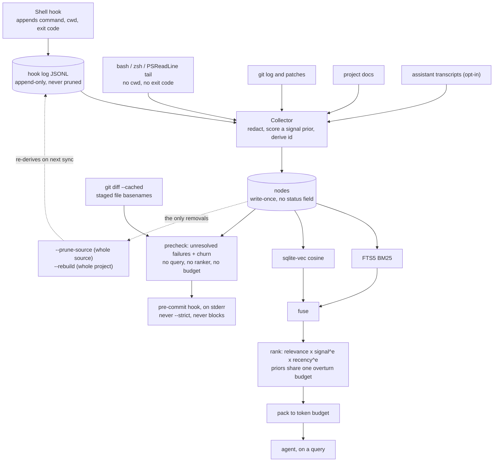

## 1. Executive Summary

NexusMem is a local memory for a coding agent whose central claim is about *what
it stores* rather than how it stores it. The README states it in one line: your
agent can read `git log`, and cannot read the four things you tried last Tuesday
that did not work.

**The unit is an event that happened on the machine.** One `nodes` table carries
every kind, and `NodeKind` declares seven: `shell_command`, `git_commit`,
`code_diff`, `doc_section`, `conversation_turn`, `session_summary` and `note`.
Six have a collector; `note` appears in the union and nowhere else in the tree —
no producer, no reader, no test. Each node has an id of
`sha256(projectId + kind + naturalKey)`, an event timestamp kept verbatim from
the source, a `signal` float, and a JSON `meta` blob. Everything is a
`better-sqlite3` file per repository. There is no server, no daemon, no cloud, no
account and no telemetry.

**Shell commands with exit codes are the part no other store in this atlas
holds.** An opt-in shell hook appends a JSONL line per command carrying the
command text, the working directory and the exit status; without it, scrape
fallbacks tail `~/.bash_history`, `~/.zsh_history` and PSReadLine, which have
none of those three. The distinction is made explicitly in `src/shell/detect.ts`
— once the hook is installed its PowerShell coverage is authoritative and the raw
PSReadLine file is skipped, because it *"duplicates the same commands with worse
data (no cwd, no exit code)."*

**Nothing is summarized on the way out.** Retrieval fuses BM25 over an
external-content FTS5 index with cosine over a `sqlite-vec` vec0 table, ranks the
result, and packs it to a token budget. What the agent receives is stored text
that was written at ingest, chosen by a ranker that decided what *not* to send.
One source, `session_summary`, runs a local model — at ingest, never on the read
path.

**Memory arrives without being asked, once, at the moment before a commit.**
`nexusmem precheck` takes the staged file list, tokenizes each *basename*, and
asks the store for unresolved failed commands that match — then prints them, plus
a high-churn warning, on stderr. `nexusmem hook git install` writes a marked
block into `.git/hooks/pre-commit` that runs it without `--strict`, so it can
warn and cannot block. Other reads here take no query either — `status` counts,
`list_recent_memory` takes the newest — but this is the only one whose selector
is *what the user is doing*, and it is a different design from the retrieval
pipeline beside it: no embeddings, no ranker, no token budget, one question —
*what already went wrong in the files you are about to commit?*

**The scope key is real, and it is maintained in two places rather than one.**
`project_id` is a required `WHERE` predicate on both retrieval arms
(`src/store/store.ts`), and a cross-project query opens each registered
repository's own database separately and tags every hit with its origin rather
than pooling them. The precheck path does not go through those methods: it takes
`store.raw` — *"escape hatch for tests and future modules"* — and writes its own
`nodes_fts MATCH … AND n.project_id = ?`. The predicate is there and the boundary
holds; what is worth noting is that only one of the two files enforcing it is the
store, and the escape hatch invites the third.

**What it cannot do is forget one thing.** There is no per-item deletion, no
deletion by value, and no record that anything was removed. The coarsest granule
available is `--prune-source`, which wipes one source across the live project id
and its prior identities; below that, `sync --rebuild` clears the project. And
the append-only hook log the shell nodes were derived *from* is never touched by
either, so a full re-sync re-derives exactly what was pruned. For a store that
deliberately ingests assistant transcripts and shell command lines — the two
places a pasted credential actually lives — that is the risk worth stating first.

## 2. Mental Model

An event happens on the machine. A collector notices it, redacts it, scores it a
prior, and writes it once under a content-derived id. It is never revised. It is
retrieved by fusing two indexes, re-ordered by two priors that are bounded in how
far they may overturn the query, cut to a token budget, and handed over as the
text that was stored — or, on the pre-commit path, selected by the names of the
files you staged and printed without any of that.

The epistemic content of that loop is thin by design, and the honest way to draw
it is to show where the loop does not close: nothing reads a node back to change
it, and the only arrows out of the store are wholesale.

The dotted path is the finding. Removal is keyed on the *source*, the source file
is still on disk, and nothing anywhere records that a value was meant to be gone
— so the next full sync restores it and no code consults anything to prevent
that.

## 3. Architecture

Nothing runs. `nexusmem` is an npm package requiring Node 22 whose runtime
dependencies are `better-sqlite3`, `sqlite-vec`, the MCP SDK, `commander`,
`picocolors` and `zod`. State is one SQLite file per repository plus a
user-scoped registry listing the repositories that exist, so a cross-project
query can find them.

Four surfaces read it. The CLI is the primary one (`init`, `sync`, `query`,
`precheck`, `status`, `projects`, per-source `scan-*` verbs, `hook`, `mcp`). The
MCP server exposes four tools over stdio — `search_memory`, `sync_project`,
`get_status`, `list_recent_memory` — none of which writes a memory. A VS Code
extension adds a panel with search, refresh and sync commands. And
`.git/hooks/pre-commit`, if the user installs it, reads the store on every commit.

The operator cost is a `sync`. There is no scheduler in the tree: collection
happens when the CLI is invoked, when the shell hook fires, or when an agent
calls `sync_project`. The tool writes into two files it does not own — a shell
profile and `.git/hooks/pre-commit` — one to feed the store, one to read it, and
neither happens unless asked: `init --hook` is off by default and the git hook
has no `init` flag at all.

## 4. Essential Implementation Paths

- **Ingest.** `src/collectors/` per source → `redact()` → a `signal` prior →
  `sha256(projectId + kind + naturalKey)` → `INSERT` in `src/store/store.ts`,
  with a per-source cursor in `sync_state` so a re-run is incremental.
- **Shell tiering.** `src/shell/detect.ts` chooses between the hook log
  (`src/shell/hook-log.ts`) and the three scrape parsers, and suppresses
  PSReadLine once the hook covers it.
- **Retrieval.** `src/retrieval/query-pipeline.ts` fans out to
  `store.search` (BM25) and `store.vectorSearch`, fuses in `fuse.ts`, orders in
  `rank.ts`, and cuts in `pack.ts`.
- **Pre-commit read.** `src/cli/commands/precheck.ts` gets the staged paths from
  `git diff --cached --name-only`, `src/correlate/precheck.ts:assessFiles` runs
  two SQL queries per file through `store.raw`, and
  `src/hooks/install-git-precommit.ts` is what puts the caller in
  `.git/hooks/pre-commit`.
- **Identity migration.** `src/store/reconcile.ts` moves nodes to a new project
  id when a repository's remote is renamed, preserving each node's original
  `created_at`.
- **Correlation.** `src/correlate/` links a failed `shell_command` to whatever
  later resolved it, and `filterBoilerplateTokens` there is the shared
  corpus-relative token filter both the linker and the pre-commit read use.
- **Structure.** `src/structure/` extracts relative import specifiers by regex,
  resolves them against the tracked-path set, and `store.replaceFileEdges` swaps
  the whole `file_edges` snapshot in one transaction.

## 5. Memory Data Model

Alongside `nodes`: `node_files` (path,
insertions, deletions, rename source) with its own index because path-scoped
recall — *"what happened to `src/store/db.ts`?"* — is a first-class query;
`node_links` for directed typed edges; `nodes_fts`, an **external-content** FTS5
index that stores no copy of the text and points back at `nodes.rowid`, halving
the searchable footprint; `nodes_vec`, a vec0 table; `sync_state` for per-source
cursors; and `projects`.

`file_edges` (schema v4) is the one table that is not made of memories, and the
migration comment says why it could not be: a source file is not a node, and
`node_links` foreign-keys both of its columns to `nodes.id`, so the import graph
needs its own table *and* its own `project_id` column — *"there is no node to
join through for it."* It also has the opposite lifecycle to everything else
here. Nodes are write-once and never pruned below a whole source; `file_edges`
describes the working tree rather than history, has no cursor to resume from, and
is deleted and reinserted in its entirety on every sync. The store's only
wholesale, routine, unremarkable delete is over the data that is not memory.

Two timestamps sit on every node and the distinction is deliberate: `ts` is the
event's own time kept verbatim from the source, `ts_epoch` the same instant as
integer milliseconds *"so range scans and ordering never parse strings"*, and
`created_at` the moment the row was written. `reconcile.ts` carries `created_at`
forward unchanged through a project-id migration, so ingest time survives a
repository rename.

**That is close to bi-temporal and the mark is withheld, because nothing queries
the second axis.** Event time drives ranking; record time is preserved but no
read path accepts an as-of parameter, so the store cannot answer "what did you
hold last Tuesday" — only "what happened last Tuesday". The columns are there and
one of them is inert on the read path.

There is no status field, no supersession pointer, no `deleted_at` and no
provenance beyond the source name.

## 6. Retrieval Mechanics

BM25 and vector cosine run as independent arms and are fused, then ranked as
`relevance x signalWeight^e1 x recencyFactor^e2`.

**The exponents are the interesting part, and the reasoning behind them is
committed in a comment that is worth reading in full.** `relevance` is the only
factor derived from the question; `signal` and `recency` are priors that hold
before any query exists. Multiplied as equals, the priors win outright: signal
spans 5x and recency 3.33x against relevance's 6.7x, so *"a well-scored recent
commit could outrank a document that matched the question far better"* — observed
live, a `fix:` commit at signal .9 taking rank 1 from the top-fused doc section
at signal .55, on a 44% signal edge against a 15% relevance deficit.

The fix bounds rather than bans: exponents cap how far the priors may jointly
overturn the query, and because the transform is monotonic the priors still order
equally-relevant hits exactly as before. The second iteration is the one worth
copying — capping each prior separately caps neither, because the score
multiplies them and two priors each worth 2x are worth 4x together. The comment
names why that is not a corner case: it *"describes every commit made during an
active working day, both fresh and high-signal at once, so the failure
concentrated on exactly the days with the most worth remembering."* So
`MAX_PRIOR_OVERTURN` became a budget for all priors jointly, split evenly, each
prior raised to the power that makes its whole range worth its share — and adding
a third prior re-divides the same budget rather than enlarging it.

The vector arm carries a subtlety worth flagging: `nodes_vec` applies its `MATCH`
and `k` before the `project_id` filter is joined, so `vectorSearch` overfetches by
8x (`Math.max(limit * 8, 50)`) to compensate. That is a heuristic, not a
guarantee — a project whose nodes are sparse among a large neighbour set can
still under-return.

`pack.ts` then cuts to a token budget. Nothing is rewritten on the way out.

**The second read path answers a question nobody typed, and it is built from a
different set of parts.** `assessFiles` takes the staged paths and, per file,
word-splits the *basename* — dropping the trailing extension first, because a
bare `.ts` would become a required AND-match token that *"almost no real command
or discussion ever types out literally, silently suppressing nearly every match
on this (TS-heavy) codebase"* — then asks for `shell_command` nodes with a
non-zero `exitCode`, inside a 30-day window, that carry no `resolved_by:*` link.
Beside it, a churn count from `node_files` scoped to `kind = 'git_commit'` only,
because `code_diff` nodes record the identical per-commit touches and summing
both would double-count.

The match is the weak joint and the project says so in the module comment rather
than in a footnote: a failure whose command does not share a word with the file's
name is invisible to it. The direction of that error is the safe one — silence
rather than noise — but the pairing is worth naming, because the two arms fail
oppositely. Retrieval over-returns and then ranks; the pre-commit read
under-returns and then prints everything it found.

**Two AND-matches run through a document-frequency filter first — this one and
the failure-to-fix linker's — and the reasoning behind it is the best empirical
work in the repository.** `filterBoilerplateTokens` drops any token appearing in more than 20% of this
project's own nodes of the relevant kinds, skipping the filter entirely below ten
such nodes because *"any word can trivially hit 20%+ just by appearing once or
twice"* on a young corpus. The threshold comes from measurement, not taste: the
known `id` false positive measures 22–40% document frequency across two real
corpora, this repository's own name and verbs measure 33–39% in its own history,
and the terms that carried real links — `whoami`, `wsl`, `publish` — all measure
under 2%.

What makes it worth copying is the failure it was written for. Dogfooding against
a second, previously unseen project found a command made entirely of the tool's
own words (`nexusmem sync`) AND-matching an unrelated turn, and **bm25 could not
separate it from a true positive**: the false positive scored −9.685, stronger
than two real links at −5.899 and −6.559. The comment names why, and it is a
property of the scoring function rather than a tuning miss — bm25 *"rewards
rarity within whatever corpus it's run against"*, and in the smaller corpus those
words had not accumulated enough occurrences to look generic. Then the disclosure
that makes the whole passage trustworthy: at that project's measured frequencies
(9.3% and 4.6%) the filter *does not* catch that instance, and the comment
says so, restricting the claim to the class the numbers support. When every token
is boilerplate the heuristic returns nothing rather than falling back unfiltered,
because its design *"already prefers a missed link over a false one."*

## 7. Write Mechanics

Writes are synchronous and happen inside a `sync`; there is no queue and no
background pass. Each collector resumes from a cursor in `sync_state`, so a
re-run is incremental rather than a re-scan.

**Redaction runs before anything reaches the index**, and it is split into two
profiles for a reason the module states precisely. Shape rules — private-key
blocks, `AKIA` keys, `gh[pousr]_` tokens, Slack tokens, JWTs — match strings
nothing else produces and are safe over source code. The broader key/value rule
is not: it would match `const apiKey = process.env.API_KEY` *"and would corrupt
the very lines a diff is indexed for."* So conversation text gets the full set
and code diffs get `high-confidence` only. The header calls it *"a safety net,
not a guarantee."*

Deletion is where the design is thinnest. `pruneSourceNodes` wipes one source,
and `runPruneSources` applies it across the live project id **and every prior
identity of the same repository** — a scope derived from `listOtherProjectIds`
rather than from "every `project_id` in the table", which is the conservative
choice. Without `--yes` it prints the matching count and removes nothing; with
it, the output says *"this cannot be undone."* Below that granule there is
nothing.

`nexusmem status` closes half of the gap that leaves: it calls
`listOtherProjectIds` and `countProjectNodes` and prints how many nodes prior
identities of this repository still hold, with the prune command to run, so data
a rename stranded is visible without opening the database by hand.
What it does not do is make that data reachable by a query — the read arms filter
on the live `project_id`, so a stale identity's nodes are counted, named and
still unretrievable.

## 8. Agent Integration

Four MCP tools, none of which writes a memory: `search_memory`, `sync_project`,
`get_status`, `list_recent_memory`. The VS Code extension is a panel — search,
refresh, sync — and by the rubric's own line, viewing is not reviewing, so
`human_review` is withheld. The pre-commit warning does not change that: it
prints and asks nothing, and no verdict of the reader's is recorded anywhere.

Two components run without being asked. The shell hook writes to its own JSONL
rather than to the database. The git pre-commit hook reads.

**The git-hook installer is the most carefully written file in the release, and
none of its care is about memory.** `.git/hooks/pre-commit` is a file real tools
own — husky, lint-staged, lefthook — so the installer marks its block with
sentinels, refuses a foreign hook without `--force`, and under `--force`
*appends* rather than prepends, so *"the existing hook's own commands still run
first"* and nexusmem's check cannot reorder or override a decision the other hook
already made. Removing restores the foreign content and deletes the file when
nothing but the shebang the installer itself added remains. The generated script
resolves `command -v nexusmem` at runtime and no-ops when it is missing, so an
uninstalled binary prints nothing rather than breaking a commit; it passes no
`--strict`, and a committed test asserts exactly that — *"the rendered snippet
invokes precheck with no flags, so it can never block a commit on its own."*
Stated limits are in the module comment rather than discovered: a foreign hook
that `exit`s early prevents this block from ever running, and the installer says
so.

## 9. Reliability, Safety, and Trust

`signal` is a float in `[0.2, 1]` consulted only by the ranker. It is set at
ingest from the kind and source and nothing updates it from use, so a node that
is retrieved constantly and one that is never retrieved carry the same prior
forever. There is no state that withholds a node from being returned, which is
why `trust_state` is withheld.

The local-first posture is genuine — no network egress on the read path, no
account, no telemetry — and the failure modes chosen under it are consistently
the non-fatal ones. `openAllProjectSources` treats every failure as recoverable
by design: *"a cross-project query that refuses to answer because one of six
repositories is on an unplugged drive would be worse than one that answers from
five and says so."*

The privacy exposure is the honest weak point, and it is structural rather than a
bug. The two collectors most likely to capture a credential are the two the
design most wants — assistant transcripts and shell command lines — redaction is
declared best-effort, and the remedy for a miss is to wipe a whole source and
then avoid a full re-sync forever, because the hook log still holds the line.

The pre-commit path widens where that text can surface without widening what is
stored. A failed command is printed, truncated to 90 characters, into the output
of `git commit` — which is a terminal a person may be screen-sharing, and a
buffer CI logs if the hook ever runs there. The store's redaction pass is the
only thing standing between a credential typed into a shell and that output, and
the module that wrote it calls itself *"a safety net, not a guarantee."*

## 10. Tests, Evals, and Benchmarks

451 test cases across 29 files, over roughly 9,100 lines of source. Coverage
tracks the mechanisms: `store.test.ts`, `query-pipeline.test.ts`,
`retrieval.test.ts`, `vector.test.ts`, `reconcile.test.ts`, `cross-project.test.ts`,
`conversation.test.ts`, `correlate.test.ts`, `precheck.test.ts`,
`git-hook-install.test.ts`, `structure.test.ts`, and per-parser shell tests. I did
not run the suite.

**The negative assertions are on the read path, which is what earns the mark.**
`store.test.ts` writes a node under one project and asserts `search('proj-b', …)`
returns nothing; `vector.test.ts` embeds a node under another project and asserts
`vectorSearch` for that exact vector returns nothing; and `store.test.ts` names a
live defect in its own case title — *"does not let the generic word `id` pull in
an unrelated node over a real match"* — then asserts the noise node is absent
from the results *and* that the right node is first. Material that exists and
must not come back is what each of them pins. `precheck.test.ts` extends the same
shape to the pre-commit arm: a failure already linked as resolved, a failure
outside the window, and a failure whose command shares no word with the file are
each asserted to produce an empty list.

**`prune-source.test.ts` is still the file to read, for a reason the mark does
not capture.** Its cases assert that a prune *"deletes exactly the named source
and nothing else"*, that it reaches a stale prior identity of the same
repository, and — the sharp one — that it *"never touches a project id this
repo's database never registered."* That last test carries an inline
discriminating control: `// discriminating: an unscoped sweep would remove this
too`, naming in the test what a broken implementation would do to it. Very few
negative suites in this atlas do that, and the technique is worth more than the
flag beside it. The adjacent case documents a real defect the project found on
2026-08-15: after a remote rename, `reconcile.ts` deliberately leaves dead
pre-hook shell nodes under the old project id, and a live-id-only prune could not
reach them.

**A benchmark is committed, and it measures packing rather than retrieval.**
`scripts/benchmark.ts` (`npm run bench`) runs the real query pipeline over a
synced corpus and compares `packed.tokensUsed` against two baselines built from
the same file set the packed answer draws on — `git show HEAD:<path>` for every
file touched, and `git log -p` over those files' full history. Its own header
draws the distinction the number needs: holding the file set constant *"isolates
the value the packing step adds, without also re-litigating retrieval quality in
the same number."* The query set is derived mechanically from the corpus rather
than hand-picked — real conversation questions where a corpus has them, generated
"why" questions from conventional-commit subjects where it does not — and results
are gitignored on purpose, so what is reproducible is the script and not a table.
The published figures (95.1% and 98.8% aggregate against full-file reads, on this
repository and on a synced clone of `vitejs/vite`) need an Ollama embedding
endpoint and a synced database to reproduce, so this reading did not run them.

What is still absent is the harder measurement: no retrieval-quality evaluation,
no committed eval corpus, and no ablation of the ranker's exponents — notable
because the exponent design is the most carefully argued code in the repository.
Its evidence is dogfooding recorded in comments, and `docs/competitor-comparison.md`
says the same thing about its own numbers: the file set is *"NexusMem's own
ranking, not an independent judge."*

## 11. For Your Own Build

### Steal

- **Bound how far query-independent priors may overturn the query, as one budget
  shared between them.** Recency and importance are priors that exist before
  anyone asks anything, and multiplying them in as equals lets them win. Capping
  each separately does not work, because the score multiplies. One joint budget,
  split evenly, with each prior raised to the power that makes its range worth its
  share — and a third prior re-divides rather than enlarges it.
- **Split redaction by whether a rule is safe over code.** A key/value regex is
  right for prose and destroys the diff lines you indexed the diff for. Two named
  profiles, chosen per collector, is a five-line distinction that prevents a class
  of silent corruption.
- **Capture the exit code.** The cheapest high-value field in this whole design is
  the one scrollback loses. What was attempted and failed is not in git, and a
  store that has it can answer questions no repository-derived index can.
- **Use an external-content FTS index.** `nodes_fts` stores no copy of the body
  and points back at `nodes.rowid`, which halves the searchable footprint for a
  store whose whole premise is keeping raw text.
- **Name the discriminating assertion in the test.** `// discriminating: an
  unscoped sweep would remove this too` is one comment that tells the next reader
  what the case is protecting against.
- **Filter tokens by frequency in *your* corpus, not by a global stopword list.**
  A word is generic relative to a body of text, and bm25 only knows the body it
  was run against — so a tool's own name is a strong signal in a corpus that
  rarely mentions it and pure noise in one that always does. A document-frequency
  check before the match query is a few lines and catches the class a relevance
  score structurally cannot.
- **Deliver a memory at the moment it changes a decision.** The pre-commit read
  is worth more than its retrieval quality suggests, because it costs the user
  nothing to ask: it fires when the files are chosen and the commit is not yet
  made. A store that only answers questions is only as useful as the questions
  someone remembers to ask.
- **Append, never prepend, when you install into someone else's hook.** Under
  `--force` this installer puts its block last so the existing hook still runs
  first and keeps whatever it decided, refuses outright without `--force`, and
  restores the original on removal. Every tool that writes to `.git/hooks` should
  read this file first.

### Avoid

- **Deletion keyed on the source when the source is still on disk.** Pruning
  nodes derived from an append-only log that nothing prunes means the next full
  sync re-derives them. If a store ingests anything sensitive, deletion has to be
  keyed on the value and consulted at the write path, or it is a pause rather
  than a removal.
- **A prior nothing updates.** `signal` is assigned at ingest from kind and
  source and never moves, so retrieval outcomes never feed back into ranking.
- **A signal keyed on a filename, presented as a signal about the file.** The
  pre-commit warning matches a failed command against the *basename* of a staged
  file. `npm run precheck` failing implicates every path whose name contains
  "precheck", and a build that failed because of a change in a file nobody named
  implicates nothing. The heuristic is disclosed and the failure direction is
  quiet rather than noisy, but a warning that says *"what already failed here"* is
  making a claim about a location from evidence about a word.
- **A churn threshold nobody measured, beside a token filter somebody did.**
  `HIGH_CHURN_THRESHOLD = 4` is flagged in its own comment as *"not tuned against
  real data (unlike the discussion-bridge heuristic's thresholds)"*. That honesty
  is the right practice and the contrast is the lesson: in the same file, one
  number carries two corpora of measurement behind it and the other is a guess,
  and the output presents both as `WARN`.

### Fit

Take this if you work in one repository at a time on your own machine, you want
an agent to know what you already tried, and you are comfortable that the store
is append-only in practice. It is small, dependency-light, genuinely local, and
the ingest side is more carefully reasoned than most stores twice its size.

Walk away if anything you capture must be removable on request. There is no
per-item delete, no delete by value, no audit of removals, and a re-sync
resurrects what a prune removed — so a store containing a customer's pasted
credential, or anything under a deletion obligation, cannot be brought into
compliance by any command in this tree. That is a design gap rather than an
oversight in a young project: the append-only hook log is load-bearing for the
feature the whole system is built around.

## 12. Open Questions

- Where would a value-keyed refusal live? The hook log is append-only by design
  and the collectors are cursor-resumed, so the natural place is a consulted
  deny-list at the collector seam rather than a delete on the table.
- Does the 8x overfetch on the vector arm hold for a sparse project in a large
  database, and what does under-return look like when it does not?
- The ranker's exponents are the most argued code in the tree and rest on
  dogfooded anecdotes. What does a committed evaluation set change about them?
- `signal` never moves after ingest. Would feeding retrieval outcomes back into it
  help, or does it recreate the popularity-versus-truth problem the atlas records
  elsewhere?
- The pre-commit read matches on basename tokens. What would a version keyed on
  the *paths a failed command touched* cost — the store already has `node_files`
  for commits, but nothing records which files a shell command was about.
- `file_edges` is populated, indexed for the reverse direction, and read by
  nothing but a status line. What does an import graph change about ranking, if a
  file's blast radius becomes a prior — and does that prior have to fit inside
  the same overturn budget the other two share?

## Appendix: File Index

**Store**
- `src/store/schema.ts` — every table and the four migrations, with the reasoning
  for the external-content FTS index, the separate path index, and why the import
  graph could not reuse `node_links`
- `src/store/store.ts` — writes, both retrieval arms, `clearProject`,
  `pruneSourceNodes`, `node_links`, `replaceFileEdges`, and the `raw` escape hatch
- `src/store/reconcile.ts` — project-id migration preserving `created_at`
- `src/store/fts.ts` — query construction and `significantTokens`, exported for
  the corpus-relative filter that layers on top of it

**Ingest**
- `src/collectors/` — per-source collection
- `src/shell/detect.ts`, `hook-log.ts`, `parse-bash.ts`, `parse-zsh.ts`,
  `parse-psreadline.ts` — the two shell tiers
- `src/conversation/redact.ts` — the rule table and the two profiles
- `src/slm/summarize.ts`, `provider.ts` — session summaries, the one model call

**Retrieval**
- `src/retrieval/query-pipeline.ts`, `fuse.ts`, `rank.ts`, `pack.ts`,
  `sources.ts` — fan-out, fusion, the prior-overturn budget, the token cut,
  cross-project opening
- `src/correlate/failure-fix.ts` — failure-to-fix linking, `filterBoilerplateTokens`
  and its measured thresholds, `getChainStats`
- `src/correlate/precheck.ts` — the pre-commit read, and the only memory query
  outside the store class

**Structure**
- `src/structure/extract.ts`, `resolve.ts`, `collect.ts` — regex extraction, the
  `./foo.js` → `foo.ts` rewrite, and the full-rescan collector

**Surfaces**
- `src/cli/`, `src/mcp/server.ts`, `vscode-extension/src/`
- `src/hooks/git-pre-commit.ts`, `install-git-precommit.ts` — the marked block,
  the foreign-hook refusal, and the append-not-prepend rule
- `scripts/benchmark.ts` — the token-saving benchmark and its baselines

**Tests**
- `tests/` — 451 cases across 29 files; `store.test.ts`, `vector.test.ts` and
  `precheck.test.ts` carry the negative retrieval assertions, and
  `prune-source.test.ts` and `cross-project.test.ts` pin the scope boundary

## History

**2026-08-17** — [`ed923035b4a0aa34244a042a05e55e040c1e9c8f`](https://github.com/yaminbkk/NexusMem/commit/ed923035b4a0aa34244a042a05e55e040c1e9c8f) — re-pinned at v0.4.0, 14 commits and 118 total. Screened again before reading: the same profile as the previous pin — one auto-run surface (`server.json`), one build-time path (`prepublishOnly`), four manifests inside the seven-day cooldown, two unpinned surfaces with lockfiles; nothing installed, built or run, and the committed benchmark needs an Ollama endpoint and a synced corpus, so it was read rather than executed. **`negative_eval` is added and the previous reading was wrong to withhold it.** The prune tests were named as the near-miss and the retrieval tests that already satisfied the rubric were missed: `tests/store.test.ts` *"does not leak nodes across projects"* and `tests/vector.test.ts` *"does not leak vector hits across projects"* both existed at the previous pin and both assert that material which exists is absent from a result set. The error was in the report's favour of strictness, which is the direction that costs a system a mark it earned. `tests/precheck.test.ts` adds three more on the new read path. Second correction: section 10 said there was no committed benchmark. `scripts/benchmark.ts` and the `bench` npm script predate the previous pin (`f599a68`, 15 August); it measures packing savings against full-file and `git log -p` baselines and says in its own header that it deliberately does not measure retrieval quality, which is the distinction the report should have drawn instead of the absence it claimed. Third: the unit was described as five node kinds. `NodeKind` declares seven at this commit and at the previous one — `code_diff` was omitted although `src/collectors/diffs.ts` produces it and `pack.ts` special-cases it, and `note` was omitted although it is the more interesting of the two, appearing in the union and nowhere else in the tree. New since the previous pin: a git pre-commit hook (`nexusmem hook git install`) running `nexusmem precheck`, which is the first read path here that takes no query — it selects on staged basenames and prints unresolved failures and churn to stderr, never with `--strict`; `filterBoilerplateTokens`, a corpus-relative document-frequency filter with thresholds measured across two real corpora and an unusually honest note that it does not retroactively catch the false positive that motivated it; a `file_edges` import graph (schema v4) replaced wholesale on every sync and read only by a status line; a stale-identity warning in `status`; and `docs/competitor-comparison.md`. One curiosity worth recording: `src/structure/collect.ts` contains a raw NUL byte used as a key delimiter, the only one in the tree outside images, so git classifies the file as binary and shows `Binary files … differ` instead of a diff — a collector that is invisible to code review by accident.

**2026-08-16** — [`eca25c6800fe1f049f60181bedb454a410798c48`](https://github.com/yaminbkk/NexusMem/commit/eca25c6800fe1f049f60181bedb454a410798c48) — First reading, at 104 commits. Screened first: one auto-run surface (`server.json`, an MCP manifest declaring a start command, which fires only where a host is configured to run it), one build-time execution path (`prepublishOnly`), and four manifests inside the seven-day cooldown; nothing was installed, built or run. One mark: `scope_enforced`. Three near-misses stated in place — a bi-temporal pair where the record-time column is never queried, a prune-scope test with an inline discriminating control that asserts about deletion rather than retrieval, and a VS Code panel that displays without reviewing.
