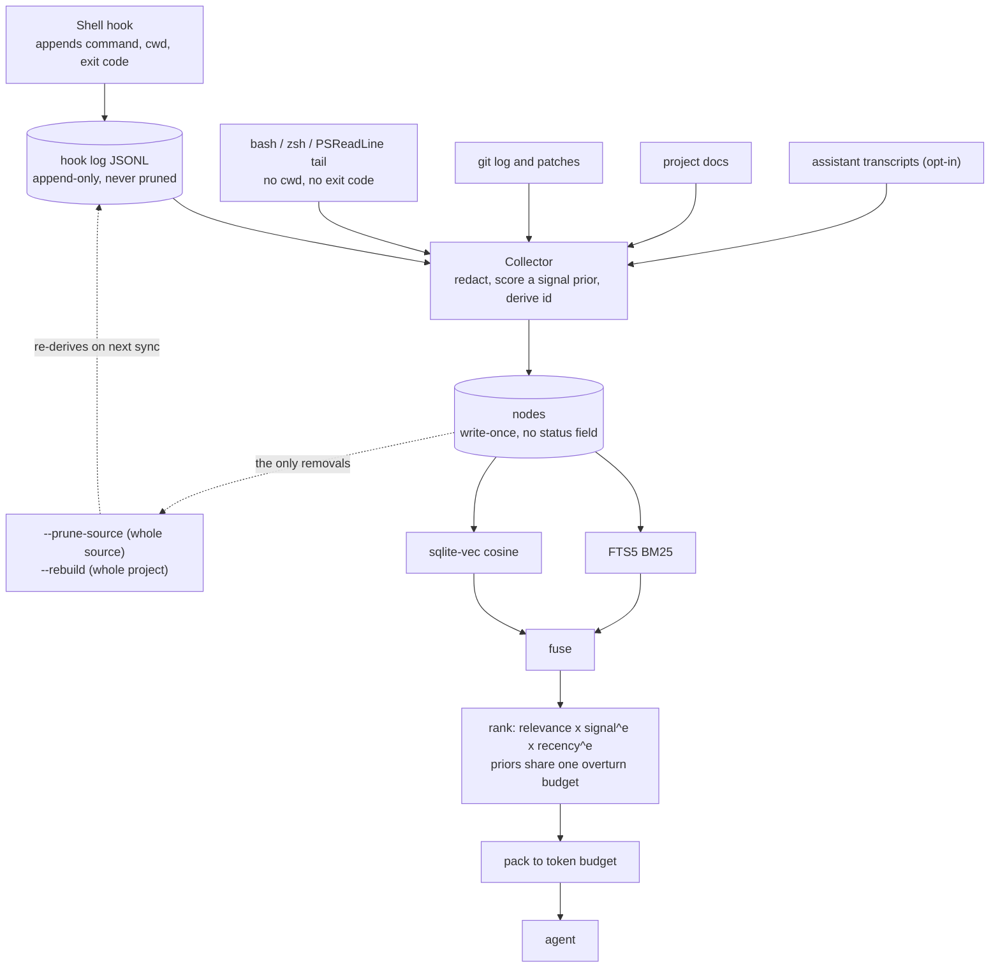

## 1. Executive Summary

NexusMem is a local memory for a coding agent whose central claim is about *what
it stores* rather than how it stores it. The README states it in one line: your
agent can read `git log`, and cannot read the four things you tried last Tuesday
that did not work.

**The unit is an event that happened on the machine.** Five kinds go into one
`nodes` table — `shell_command`, `git_commit`, `doc_section`, `conversation_turn`
and `session_summary` — each with an id of `sha256(projectId + kind + naturalKey)`,
an event timestamp kept verbatim from the source, a `signal` float, and a JSON
`meta` blob. Everything is a `better-sqlite3` file per repository. There is no
server, no daemon, no cloud, no account and no telemetry.

**Shell commands with exit codes are the part no other store in this atlas
holds.** An opt-in shell hook appends a JSONL line per command carrying the
command text, the working directory and the exit status; without it, scrape
fallbacks tail `~/.bash_history`, `~/.zsh_history` and PSReadLine, which have
none of those three. The distinction is made explicitly in `src/shell/detect.ts`
— once the hook is installed its PowerShell coverage is authoritative and the raw
PSReadLine file is skipped, because it *"duplicates the same commands with worse
data (no cwd, no exit code)."*

**Nothing is summarized on the way out.** Retrieval fuses BM25 over an
external-content FTS5 index with cosine over a `sqlite-vec` vec0 table, ranks the
result, and packs it to a token budget. What the agent receives is stored text
that was written at ingest, chosen by a ranker that decided what *not* to send.
One source, `session_summary`, runs a local model — at ingest, never on the read
path.

**The scope key is real, and it is the only rubric mark this system earns.**
`project_id` is a required `WHERE` predicate on both read arms
(`src/store/store.ts`), and a cross-project query opens each registered
repository's own database separately and tags every hit with its origin rather
than pooling them.

**What it cannot do is forget one thing.** There is no per-item deletion, no
deletion by value, and no record that anything was removed. The coarsest granule
available is `--prune-source`, which wipes one source across the live project id
and its prior identities; below that, `sync --rebuild` clears the project. And
the append-only hook log the shell nodes were derived *from* is never touched by
either, so a full re-sync re-derives exactly what was pruned. For a store that
deliberately ingests assistant transcripts and shell command lines — the two
places a pasted credential actually lives — that is the risk worth stating first.

## 2. Mental Model

An event happens on the machine. A collector notices it, redacts it, scores it a
prior, and writes it once under a content-derived id. It is never revised. It is
retrieved by fusing two indexes, re-ordered by two priors that are bounded in how
far they may overturn the query, cut to a token budget, and handed over as the
text that was stored.

The epistemic content of that loop is thin by design, and the honest way to draw
it is to show where the loop does not close: nothing reads a node back to change
it, and the only arrows out of the store are wholesale.

The dotted path is the finding. Removal is keyed on the *source*, the source file
is still on disk, and nothing anywhere records that a value was meant to be gone
— so the next full sync restores it and no code consults anything to prevent
that.

## 3. Architecture

Nothing runs. `nexusmem` is an npm package requiring Node 22 whose runtime
dependencies are `better-sqlite3`, `sqlite-vec`, the MCP SDK, `commander`,
`picocolors` and `zod`. State is one SQLite file per repository plus a
user-scoped registry listing the repositories that exist, so a cross-project
query can find them.

Three surfaces read it. The CLI is the primary one (`init`, `sync`, `query`,
`status`, `projects`, per-source `scan-*` verbs, `hook`, `mcp`). The MCP server
exposes four tools over stdio — `search_memory`, `sync_project`, `get_status`,
`list_recent_memory` — none of which writes a memory. A VS Code extension adds a
panel with search, refresh and sync commands.

The operator cost is a `sync`. There is no scheduler in the tree: collection
happens when the CLI is invoked, when the shell hook fires, or when an agent
calls `sync_project`.

## 4. Essential Implementation Paths

- **Ingest.** `src/collectors/` per source → `redact()` → a `signal` prior →
  `sha256(projectId + kind + naturalKey)` → `INSERT` in `src/store/store.ts`,
  with a per-source cursor in `sync_state` so a re-run is incremental.
- **Shell tiering.** `src/shell/detect.ts` chooses between the hook log
  (`src/shell/hook-log.ts`) and the three scrape parsers, and suppresses
  PSReadLine once the hook covers it.
- **Retrieval.** `src/retrieval/query-pipeline.ts` fans out to
  `store.search` (BM25) and `store.vectorSearch`, fuses in `fuse.ts`, orders in
  `rank.ts`, and cuts in `pack.ts`.
- **Identity migration.** `src/store/reconcile.ts` moves nodes to a new project
  id when a repository's remote is renamed, preserving each node's original
  `created_at`.
- **Correlation.** `src/correlate/` links a failed `shell_command` to whatever
  later resolved it.

## 5. Memory Data Model

One `nodes` table carries every kind. Alongside it: `node_files` (path,
insertions, deletions, rename source) with its own index because path-scoped
recall — *"what happened to `src/store/db.ts`?"* — is a first-class query;
`node_links` for directed typed edges; `nodes_fts`, an **external-content** FTS5
index that stores no copy of the text and points back at `nodes.rowid`, halving
the searchable footprint; `nodes_vec`, a vec0 table; `sync_state` for per-source
cursors; and `projects`.

Two timestamps sit on every node and the distinction is deliberate: `ts` is the
event's own time kept verbatim from the source, `ts_epoch` the same instant as
integer milliseconds *"so range scans and ordering never parse strings"*, and
`created_at` the moment the row was written. `reconcile.ts` carries `created_at`
forward unchanged through a project-id migration, so ingest time survives a
repository rename.

**That is close to bi-temporal and the mark is withheld, because nothing queries
the second axis.** Event time drives ranking; record time is preserved but no
read path accepts an as-of parameter, so the store cannot answer "what did you
hold last Tuesday" — only "what happened last Tuesday". The columns are there and
one of them is inert on the read path.

There is no status field, no supersession pointer, no `deleted_at` and no
provenance beyond the source name.

## 6. Retrieval Mechanics

BM25 and vector cosine run as independent arms and are fused, then ranked as
`relevance x signalWeight^e1 x recencyFactor^e2`.

**The exponents are the interesting part, and the reasoning behind them is
committed in a comment that is worth reading in full.** `relevance` is the only
factor derived from the question; `signal` and `recency` are priors that hold
before any query exists. Multiplied as equals, the priors win outright: signal
spans 5x and recency 3.33x against relevance's 6.7x, so *"a well-scored recent
commit could outrank a document that matched the question far better"* — observed
live, a `fix:` commit at signal .9 taking rank 1 from the top-fused doc section
at signal .55, on a 44% signal edge against a 15% relevance deficit.

The fix bounds rather than bans: exponents cap how far the priors may jointly
overturn the query, and because the transform is monotonic the priors still order
equally-relevant hits exactly as before. The second iteration is the one worth
copying — capping each prior separately caps neither, because the score
multiplies them and two priors each worth 2x are worth 4x together. The comment
names why that is not a corner case: it *"describes every commit made during an
active working day, both fresh and high-signal at once, so the failure
concentrated on exactly the days with the most worth remembering."* So
`MAX_PRIOR_OVERTURN` became a budget for all priors jointly, split evenly, each
prior raised to the power that makes its whole range worth its share — and adding
a third prior re-divides the same budget rather than enlarging it.

The vector arm carries a subtlety worth flagging: `nodes_vec` applies its `MATCH`
and `k` before the `project_id` filter is joined, so `vectorSearch` overfetches by
8x (`Math.max(limit * 8, 50)`) to compensate. That is a heuristic, not a
guarantee — a project whose nodes are sparse among a large neighbour set can
still under-return.

`pack.ts` then cuts to a token budget. Nothing is rewritten on the way out.

## 7. Write Mechanics

Writes are synchronous and happen inside a `sync`; there is no queue and no
background pass. Each collector resumes from a cursor in `sync_state`, so a
re-run is incremental rather than a re-scan.

**Redaction runs before anything reaches the index**, and it is split into two
profiles for a reason the module states precisely. Shape rules — private-key
blocks, `AKIA` keys, `gh[pousr]_` tokens, Slack tokens, JWTs — match strings
nothing else produces and are safe over source code. The broader key/value rule
is not: it would match `const apiKey = process.env.API_KEY` *"and would corrupt
the very lines a diff is indexed for."* So conversation text gets the full set
and code diffs get `high-confidence` only. The header calls it *"a safety net,
not a guarantee."*

Deletion is where the design is thinnest. `pruneSourceNodes` wipes one source,
and `runPruneSources` applies it across the live project id **and every prior
identity of the same repository** — a scope derived from `listOtherProjectIds`
rather than from "every `project_id` in the table", which is the conservative
choice. Without `--yes` it prints the matching count and removes nothing; with
it, the output says *"this cannot be undone."* Below that granule there is
nothing.

## 8. Agent Integration

Four MCP tools, none of which writes a memory: `search_memory`, `sync_project`,
`get_status`, `list_recent_memory`. The VS Code extension is a panel — search,
refresh, sync — and by the rubric's own line, viewing is not reviewing, so
`human_review` is withheld.

The shell hook is the one component that runs without being asked, and it writes
to its own JSONL rather than to the database.

## 9. Reliability, Safety, and Trust

`signal` is a float in `[0.2, 1]` consulted only by the ranker. It is set at
ingest from the kind and source and nothing updates it from use, so a node that
is retrieved constantly and one that is never retrieved carry the same prior
forever. There is no state that withholds a node from being returned, which is
why `trust_state` is withheld.

The local-first posture is genuine — no network egress on the read path, no
account, no telemetry — and the failure modes chosen under it are consistently
the non-fatal ones. `openAllProjectSources` treats every failure as recoverable
by design: *"a cross-project query that refuses to answer because one of six
repositories is on an unplugged drive would be worse than one that answers from
five and says so."*

The privacy exposure is the honest weak point, and it is structural rather than a
bug. The two collectors most likely to capture a credential are the two the
design most wants — assistant transcripts and shell command lines — redaction is
declared best-effort, and the remedy for a miss is to wipe a whole source and
then avoid a full re-sync forever, because the hook log still holds the line.

## 10. Tests, Evals, and Benchmarks

407 test cases across 24 files, over roughly 8,100 lines of source. Coverage
tracks the mechanisms: `store.test.ts`, `query-pipeline.test.ts`,
`retrieval.test.ts`, `vector.test.ts`, `reconcile.test.ts`, `cross-project.test.ts`,
`conversation.test.ts`, `correlate.test.ts`, and per-parser shell tests. I did not
run the suite.

**`prune-source.test.ts` is the file to read, and it comes within one step of a
negative retrieval assertion without being one.** Its cases assert that a prune
*"deletes exactly the named source and nothing else"*, that it reaches a stale
prior identity of the same repository, and — the sharp one — that it *"never
touches a project id this repo's database never registered."* That last test
carries an inline discriminating control: `// discriminating: an unscoped sweep
would remove this too`, naming in the test what a broken implementation would do
to it. Very few negative suites in this atlas do that.

It is withheld from `negative_eval` on the rubric's wording rather than on its
quality: it asserts material must not be *deleted*, which is a scope boundary on
the write path, not an assertion that particular material must not be
*retrieved*. The near-miss is worth more than several awarded marks elsewhere.

The adjacent case documents a real defect found on 2026-08-15: after a remote
rename, `reconcile.ts` deliberately leaves dead pre-hook shell nodes under the old
project id, and a live-id-only prune could not reach them.

There is no retrieval-quality benchmark, no committed eval corpus, and no ablation
of the ranker's exponents — which is notable because the exponent design is the
most carefully argued code in the repository and its evidence is two dogfooded
anecdotes recorded in comments.

## 11. For Your Own Build

### Steal

- **Bound how far query-independent priors may overturn the query, as one budget
  shared between them.** Recency and importance are priors that exist before
  anyone asks anything, and multiplying them in as equals lets them win. Capping
  each separately does not work, because the score multiplies. One joint budget,
  split evenly, with each prior raised to the power that makes its range worth its
  share — and a third prior re-divides rather than enlarges it.
- **Split redaction by whether a rule is safe over code.** A key/value regex is
  right for prose and destroys the diff lines you indexed the diff for. Two named
  profiles, chosen per collector, is a five-line distinction that prevents a class
  of silent corruption.
- **Capture the exit code.** The cheapest high-value field in this whole design is
  the one scrollback loses. What was attempted and failed is not in git, and a
  store that has it can answer questions no repository-derived index can.
- **Use an external-content FTS index.** `nodes_fts` stores no copy of the body
  and points back at `nodes.rowid`, which halves the searchable footprint for a
  store whose whole premise is keeping raw text.
- **Name the discriminating assertion in the test.** `// discriminating: an
  unscoped sweep would remove this too` is one comment that tells the next reader
  what the case is protecting against.

### Avoid

- **Deletion keyed on the source when the source is still on disk.** Pruning
  nodes derived from an append-only log that nothing prunes means the next full
  sync re-derives them. If a store ingests anything sensitive, deletion has to be
  keyed on the value and consulted at the write path, or it is a pause rather
  than a removal.
- **A prior nothing updates.** `signal` is assigned at ingest from kind and
  source and never moves, so retrieval outcomes never feed back into ranking.
- **Shipping correlation heuristics undogfooded.** The project says so itself —
  the failure-to-fix link is *"a first pass sized for that validation, not a claim
  that either heuristic is correct yet"* — which is the right disclosure, and it
  is still an unvalidated edge in a graph a reader might trust.

### Fit

Take this if you work in one repository at a time on your own machine, you want
an agent to know what you already tried, and you are comfortable that the store
is append-only in practice. It is small, dependency-light, genuinely local, and
the ingest side is more carefully reasoned than most stores twice its size.

Walk away if anything you capture must be removable on request. There is no
per-item delete, no delete by value, no audit of removals, and a re-sync
resurrects what a prune removed — so a store containing a customer's pasted
credential, or anything under a deletion obligation, cannot be brought into
compliance by any command in this tree. That is a design gap rather than an
oversight in a young project: the append-only hook log is load-bearing for the
feature the whole system is built around.

## 12. Open Questions

- Where would a value-keyed refusal live? The hook log is append-only by design
  and the collectors are cursor-resumed, so the natural place is a consulted
  deny-list at the collector seam rather than a delete on the table.
- Does the 8x overfetch on the vector arm hold for a sparse project in a large
  database, and what does under-return look like when it does not?
- The ranker's exponents are the most argued code in the tree and rest on two
  dogfooded anecdotes. What does a committed evaluation set change about them?
- `signal` never moves after ingest. Would feeding retrieval outcomes back into it
  help, or does it recreate the popularity-versus-truth problem the atlas records
  elsewhere?
- Are the two correlation heuristics precise enough to be worth an edge, once
  dogfooded against a real corpus?

## Appendix: File Index

**Store**
- `src/store/schema.ts` — every table, with the reasoning for the external-content
  FTS index and the separate path index
- `src/store/store.ts` — writes, both read arms, `clearProject`,
  `pruneSourceNodes`, `node_links`
- `src/store/reconcile.ts` — project-id migration preserving `created_at`
- `src/store/fts.ts` — query construction, including the strict AND form

**Ingest**
- `src/collectors/` — per-source collection
- `src/shell/detect.ts`, `hook-log.ts`, `parse-bash.ts`, `parse-zsh.ts`,
  `parse-psreadline.ts` — the two shell tiers
- `src/conversation/redact.ts` — the rule table and the two profiles
- `src/slm/summarize.ts`, `provider.ts` — session summaries, the one model call

**Retrieval**
- `src/retrieval/query-pipeline.ts`, `fuse.ts`, `rank.ts`, `pack.ts`,
  `sources.ts` — fan-out, fusion, the prior-overturn budget, the token cut,
  cross-project opening
- `src/correlate/` — failure-to-fix linking

**Surfaces**
- `src/cli/`, `src/mcp/server.ts`, `vscode-extension/src/`

**Tests**
- `tests/` — 407 cases across 24 files; `prune-source.test.ts` and
  `cross-project.test.ts` are the ones that pin the scope boundary

## History

**2026-08-16** — [`eca25c6800fe1f049f60181bedb454a410798c48`](https://github.com/yaminbkk/NexusMem/commit/eca25c6800fe1f049f60181bedb454a410798c48) — First reading, at 104 commits. Screened first: one auto-run surface (`server.json`, an MCP manifest declaring a start command, which fires only where a host is configured to run it), one build-time execution path (`prepublishOnly`), and four manifests inside the seven-day cooldown; nothing was installed, built or run. One mark: `scope_enforced`. Three near-misses stated in place — a bi-temporal pair where the record-time column is never queried, a prune-scope test with an inline discriminating control that asserts about deletion rather than retrieval, and a VS Code panel that displays without reviewing.
