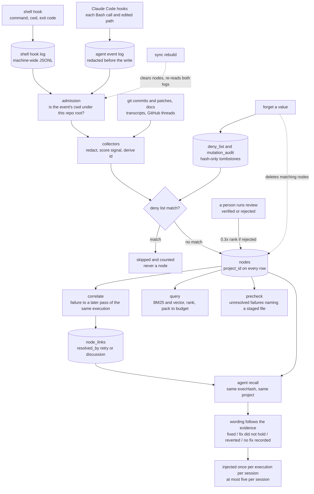

## 1. Executive Summary

NexusMem is a local memory for a coding agent that stores events that happened
on the machine. They are shell commands with exit codes, the commands and edits
a Claude Code session made, git history and patches, docs and, opt-in,
transcripts and GitHub threads. Its notable mechanism is recall keyed on an execution: when a
command fails, a hook tells the agent whether that execution failed in this
repository before, what was edited each time, and whether the fix that followed
held. Its weak point is that nothing withholds a memory. A human `rejected`
verdict, a supersession and a failed fix all reorder or reword, and the
committed experiment on whether ambient recall changes agent behaviour has not
separated its arms.

**The unit is an event, written once.** One `nodes` table carries every kind,
and `NodeKind` declares eight (`src/core/types.ts:9-17`). Seven have a
collector; `note` has no producer. Each node has an id of
`sha256(projectId + kind + naturalKey)`, an event timestamp, a `signal` float
and a JSON `meta` blob. State is one `better-sqlite3` file per repository, with
no server, account or telemetry.

**Exit codes arrive from two hooks, and the second is the one an agent needs.**
An opt-in shell hook appends command, cwd and exit status for each interactive
command. A command an agent runs never reaches an interactive prompt, so
`nexusmem agent install` adds Claude Code hooks that record every Bash call and
every edited path (`src/adapters/claude-code/install.ts:47`). Edits attach to
the next command, so a node reads as an attempt: files changed, execution,
result.

**Memory reaches the agent three ways.** A query fuses BM25 with vector search,
ranks, and packs stored text to a token budget; nothing is summarised on the
read path. The recall hook answers a failed Bash call with past failures of the
same execution and prints nothing on no match (`src/agent/recall.ts:123`).
`nexusmem precheck` warns before a commit about unresolved failures whose
command names a staged file's basename.

**The scope key is on every read, and each repository also has its own file.**
`project_id` is a predicate on both retrieval arms, the recall queries, the
session digest and the precheck queries. The database lives under the
repository's `.nexusmem/`, so inside one file the key separates the
repository's current identity from the identities it had before a remote
rename. Which events enter a project is a second boundary, decided lexically
from the event's cwd (section 9c).

**A forgotten value is refused at every later write.** `nexusmem forget <value>`
writes a `deny_list` row keyed on the value, and `upsertNodes` consults the list
before every insert, so a `sync --rebuild` that re-reads the hook logs cannot
restore it. Each deleted node leaves a hash-only `tombstones` row. The deny-list
row and the audit row's `detail` hold the pattern in cleartext
(`src/store/forget.ts:135`), so the hash-only property covers the per-node
records and not the forgotten value (section 9b).

Five marks: `tombstone`, `bitemporal`, `scope_enforced`, `audit_log` and
`negative_eval`. `trust_state` and `human_review` are withheld, and section 9a
gives each near-miss.

## 2. Mental Model

**A memory is an event with a result; the only inferred belief is a link
between two of them.** A collector notices an event, redacts it, scores a
prior and writes it under a content-derived id. A re-sync rewrites a node only
when its derived title, body or signal changed, and never touches
`trust_state`, `supersedes` or the retrieval counters (`src/store/nodes.ts:60-69`).

**The inferred belief is "this failure was fixed by that".**
`correlateFailures` links a failed `shell_command` to what resolved it under
one of two relations (`src/correlate/failure-fix.ts:71-72`).
`resolved_by:retry` is a later pass of the same execution in the same cwd
within 24 hours. `resolved_by:discussion` is the best AND-match among
transcript nodes in the following 24 hours. For two agent-recorded rows, a pass
with nothing edited in between is counted as unexplained and left unlinked
(`:254-256`).

**What the agent is told about a failure is derived at read time, and stored
nowhere.** Recall classifies each execution as resolved, stale, superseded,
uncertain or unresolved (`src/agent/recall.ts:256`):

- *resolved*: the newest failure has a retry link.
- *stale*: a retry link exists and the same execution failed again after it.
- *superseded*: a later commit whose subject says revert touches a file the fix
  edited (`:88-106`).
- *uncertain*: only a discussion link exists. The digest words it as
  *"possibly discussed"* and never as fixed.
- *unresolved*: no link.

**Four writes change what a node means, and one of them is on the agent's
tool surface.** Collectors write nodes. `nexusmem review` sets `trust_state`
and `forget` writes the deny list; both are CLI verbs with no MCP twin.
`mark-stale` sets `supersedes`, and the MCP `resolve_stale_suggestion` tool
reaches the same write (section 8).

**A memory dies by value, by source or wholesale, and only the first is
permanent.** `forget` deletes and writes a rule that refuses the value at every
later insert. `--prune-source` deletes one source and leaves the source file on
disk, so a rebuild re-derives what that file still holds. `sync --rebuild`
clears the project.
A `rejected` verdict and a supersession demote a node, by 0.3 and 0.5 in the
ranker, and return it anyway.

```mermaid
%% caption: events enter through two hook logs and the collectors, a deny list stands between every collector and the node table, and three reads leave it — a ranked answer, a note when a command fails again, a pre-commit warning; a rebuild re-reads the logs and only the deny list stops a forgotten value returning
flowchart TD
    SH["shell hook<br/>command, cwd, exit code"] --> SLOG[("shell hook log<br/>machine-wide JSONL")]
    CC["Claude Code hooks<br/>each Bash call and edited path"] --> ALOG[("agent event log<br/>redacted before the write")]
    SLOG --> ADMIT["admission<br/>is the event's cwd under this repo root?"]
    ALOG --> ADMIT
    ADMIT --> COLL["collectors<br/>redact, score signal, derive id"]
    GIT["git commits and patches, docs<br/>transcripts, GitHub threads"] --> COLL
    FORGET["forget a value"] --> DENY[("deny_list and mutation_audit<br/>hash-only tombstones")]
    DENY --> CHECK{"deny list match?"}
    COLL --> CHECK
    CHECK -->|"match"| DROP["skipped and counted<br/>never a node"]
    CHECK -->|"no match"| N[("nodes<br/>project_id on every row")]
    FORGET -. "deletes matching nodes" .-> N
    REVIEW["a person runs review<br/>verified or rejected"] -->|"0.3x rank if rejected"| N
    N --> CORR["correlate<br/>failure to a later pass of the same execution"]
    CORR --> LINKS[("node_links<br/>resolved_by retry or discussion")]
    N --> Q["query<br/>BM25 and vector, rank, pack to budget"]
    N --> PRE["precheck<br/>unresolved failures naming a staged file"]
    N --> RECALL["agent recall<br/>same execHash, same project"]
    LINKS --> RECALL
    RECALL --> WORD["wording follows the evidence<br/>fixed / fix did not hold / reverted / no fix recorded"]
    WORD --> INJ["injected once per execution per session<br/>at most five per session"]
    REBUILD["sync rebuild"] -. "clears nodes, re-reads both logs" .-> ADMIT
```

The two dotted paths end differently. A rebuild is keyed on the project: both
logs are on disk, so the next pass restores what it cleared. A `forget` is
keyed on the value, and the rule it writes is consulted on every insert,
including the inserts a rebuild performs from those logs.

## 3. Architecture

`nexusmem` is an npm package requiring Node 22. Its runtime dependencies are
`better-sqlite3`, `sqlite-vec`, the MCP SDK, `commander`, `picocolors` and
`zod`. Two optional local model calls go to Ollama: `nomic-embed-text` for
embeddings and a small chat model for session summaries and contradiction
checks.

**State is split between the repository and the user's home.**
`<repo>/.nexusmem/` holds `config.json` and `memory.db`, and ignores itself
through its own `.gitignore`. `~/.nexusmem/`, or `NEXUSMEM_HOME`, holds
machine-wide files, among them:

- `projects.json`, the registry a cross-project query opens;
- `shell-history.jsonl`, the shell hook log;
- `agent-events.jsonl`, the agent event log (`src/agent/paths.ts:9`);
- `agent-recall-state.json`, the per-session injection quota
  (`src/agent/recall-state.ts:25`).

Both logs are shared by every repository on the machine and are filtered by cwd
when a sync reads them.

**Six surfaces touch the store.**

- The CLI: `init`, `sync`, `query`, `precheck`, `status`, `forget`, `review`,
  `mark-stale`, `stale`, `scrub-secrets`, `projects`, `agent`, `hook`, `mcp` and
  a `scan-*` verb per source.
- A stdio MCP server with six tools (`src/mcp/server.ts`).
- Three Claude Code hooks written into a settings file by `agent install`.
- Shell hooks for PowerShell, bash and zsh.
- Git pre-commit and post-commit hooks.
- A VS Code extension that speaks to the MCP server.

### Deployment and ergonomics

Nothing has to be running. There is no scheduler: collection happens when
`sync` runs, and four things run it. They are a person, the MCP `sync_project`
tool, the post-commit hook under a lock that skips when a sync is in flight,
and the SessionStart hook, which spawns a detached `sync --auto --quiet`
(`src/cli/commands/agent.ts:207`).

It runs offline. Without Ollama the vector arm, session summaries and
contradiction checks drop out and retrieval is BM25 alone. No API key is
needed to store anything.

The tool writes into files it does not own, and each write is opt-in: a shell
profile, `.git/hooks/pre-commit`, `.git/hooks/post-commit`, and a Claude Code
settings file. `agent install` targets the user settings by default, or
`.claude/settings.local.json` with `--project`, and never a settings file a team
would commit (`src/cli/commands/agent.ts:42-46`).

The store is a SQLite file a person can open. Repairing it by hand is not
needed for anything `sync` can re-derive; the deny list, verdicts and links are
the parts a rebuild cannot reproduce.

## 4. Essential Implementation Paths

- **Ingest.** `src/collectors/` per source → `redact()` where the source calls
  it → a `signal` prior → `makeNodeId` → `upsertNodes` in `src/store/nodes.ts`,
  with a per-source cursor in `sync_state`.
- **Agent capture.** `src/adapters/claude-code/hook-entry.ts` reads a hook
  payload on stdin, `payload.ts` maps it to an `AgentEvent`, `redactAgentEvent`
  in `src/agent/event.ts` hashes and redacts it, and `record.ts` appends one
  line. `src/collectors/agent-events.ts` turns the log into `shell_command`
  nodes at the next sync.
- **Ambient recall.** `runAgentRecall` in `src/cli/commands/agent.ts` parses the
  payload, resolves the repository from the event's cwd, and calls
  `recallFailure` or `recallUncertain` in `src/agent/recall.ts`.
  `claimInjection` in `recall-state.ts` decides whether to print.
- **Session digest.** `runAgentSessionStart` starts a background sync and prints
  `recallSessionStart`'s text.
- **Query.** `src/retrieval/query-pipeline.ts` fans out to `store.search` and
  `store.vectorSearch`, fuses in `fuse.ts`, orders in `rank.ts`, pulls linked
  resolutions in beside their failure, and cuts in `pack.ts`.
- **Pre-commit read.** `src/cli/commands/precheck.ts` lists staged paths and
  `assessFiles` in `src/correlate/precheck.ts` runs two SQL queries per file.
- **Correlation.** `src/correlate/failure-fix.ts` writes the failure-to-fix
  links and holds `filterBoilerplateTokens`.
- **Forget.** `src/store/forget.ts` writes the deny-list entry, the audit row,
  the deletes and the tombstones in one transaction; `deny-list.ts` is the
  matcher and its guards.
- **Project boundary.** `isUnderRoot` in `src/shell/detect.ts` admits a hook
  event into a project; `src/store/reconcile.ts` moves nodes to a new project id
  after a remote rename and carries their links across.
- **Remediation.** `src/store/scrub.ts` re-applies redaction to stored rows and
  purges SQLite remnants.

## 5. Memory Data Model

**One table holds every memory, and seven more sit beside it**
(`src/store/schema.ts`, thirteen migrations). `node_files` indexes touched
paths. `node_links` holds directed typed edges. `nodes_fts` is an
external-content FTS5 index that stores no copy of the text. `nodes_vec` is a
vec0 table. `sync_state` holds per-source cursors. `contradiction_checks`
memoises model judgments. `file_edges` is an import graph of the working tree,
replaced wholesale on every sync and read only by a status line.

**Two timestamps sit on every node and both are queried.** `ts` is the event's
own time, `ts_epoch` the same instant as integer milliseconds, and `created_at`
the moment the row was written (`src/store/schema.ts:26-36`). Event time drives
ranking. Record time is what `--as-of` filters on, with
`AND (? IS NULL OR n.created_at <= ?)` on the lexical arm
(`src/store/search.ts:85`) and the same clause on the vector arm.
`reconcile.ts` carries `created_at` forward through a project-id migration, so
ingest time survives a repository rename.

**An agent command carries its identity in `meta`.** The collector writes
`commandHash`, a hash of the raw command, and `execHash`, a hash of the command
reduced to its one real execution (`src/agent/event.ts:42-52`). It also writes
`exitCode`, `outcome`, `agentSessionId`, `toolUseId` and the `cwd`
(`src/collectors/agent-events.ts:85-104`). The stored command text is redacted,
so matching runs on the hashes and two commands that differ only by a secret
are never treated as one.

**Three columns describe where a claim came from, and they are kept apart on
purpose.** `provenance` is a four-tier ordering — `observed`, `authored`,
`recorded`, `derived` — set per collector. `capture_mode` records whether the
store saw the event happen or reconstructed it from an artifact that predates
installation; the V13 migration states that the evidence-quality axis *"cannot
also say"* that. `source_ts` is null where an artifact has no trustworthy
timestamp, for untimestamped shell history and document mtimes.

**Two more columns carry a person's judgement.** `trust_state` is `candidate`,
`verified` or `rejected` and is set only by `nexusmem review`. `supersedes` is a
nullable pointer from a newer node to the one it replaces. `upsertNodes`
updates neither on conflict, so a re-sync cannot return a rejected node to
`candidate`.

**Deletion is a row in other tables.** There is no `deleted_at`. `deny_list`
holds the standing rules, `tombstones` one hash-only row per removed node, and
`mutation_audit` one row per forget or confirmed source prune.

## 6. Retrieval Mechanics

### The query path

BM25 and vector cosine run as independent arms, are fused by reciprocal rank
when both return hits, and are ranked as `relevance x signalWeight^e1 x recencyFactor^e2`
(`src/retrieval/rank.ts:190`).

**The exponents bound how far two query-independent priors may overturn the
query.** `relevance` is the only factor derived from the question. Multiplied
as equals, the priors win: the comment records a `fix:` commit at signal .9
taking rank 1 from the top-fused doc section on a 44% signal edge against a 15%
relevance deficit. `MAX_PRIOR_OVERTURN` is therefore one budget for all priors
jointly, split evenly, and each prior is raised to the power that makes its
whole range worth its share (`:97-101`). A third prior would re-divide the
budget.

**The budget is shared because capping each prior separately caps neither.**
The score multiplies them, so two priors each worth 2x are worth 4x together.
The comment calls that the common case: it *"describes every commit made
during an active working day"*.

**Provenance tunes recency, and no tier gates.** Recency decays on a half-life
multiplied per tier, so a `derived` node's weight halves fastest
(`:59-64`). Every factor has a floor, so a tier reorders and never excludes. A
superseded node is multiplied by 0.5 and a rejected one by 0.3. `pack.ts` prints
the tier, the capture mode and a non-default trust state as bracketed labels on
each packed line (`src/retrieval/pack.ts:41-44`).

**A linked resolution rides in beside its failure.** `pullLinkedResolutions`
inserts the node a failure links to directly after it, with the failure's own
score, so the fix survives the budget cut without matching the query
(`src/retrieval/query-pipeline.ts:42-87`). It hydrates by id; section 9c
covers why that read is in scope.

**The vector arm takes its neighbours inside the project.** `nodes_vec`
declares `project_id` as a vec0 partition key (`src/store/schema.ts:294`), and
the query binds `v.project_id = ?` (`src/store/embeddings.ts:124`). The V11
migration comment reports the failure this removed: with 495 rows in one
project and 5 in another, a global `k=50` surfaced none of the 5.

**An as-of read on the vector arm can return short.** `created_at` is not a
partition column, so that path fetches `max(limit * 8, 50)` neighbours and
filters afterwards (`src/store/embeddings.ts:117`). The result is short whenever more than
`k - limit` of the project's nearest neighbours were recorded after the cutoff.
A project whose recent months are its busiest fills the window with rows the
filter then discards, and an empty answer reads the same as a store that held
nothing.

### Ambient recall

**The hook matches an execution, not a string.** Claude Code rarely runs a
command bare: it prefixes `cd`, appends `; echo "exit: $?"`, or leads with
`ls`. `canonicalizeCommand` splits on `&&` and `;`, classifies each segment as
navigation, observation or target, and hashes the single target
(`src/agent/event.ts:198-207`). Any shape it cannot prove inert — two real
commands, an env assignment, a pipeline, a `cd` to another directory — leaves
the command whole. The comment gives the reason for the asymmetry: a missed match costs a
silent recall, and a wrong one *"teaches the model a false fact"*.

**Recall reads up to three past failures of that execution in this project.**
`SELECT_BY_HASH` filters on `project_id`, `kind`, `execHash` and a non-zero
`exitCode` (`src/agent/recall.ts:41-51`). Each line names the day and the files
edited before that attempt. The text is capped at 1,200 characters. No model,
embedding or network call is on the path.

**A fix is reported as current only when the evidence still supports it.**
The first linked fix decides the wording (`:139-160`). A revert commit touching
the fix's files yields *"that fix was reverted"*. A newer failure of the same
execution after the fix yields *"that fix no longer holds"*. Until commit
[`888c3295f741192af2125cf73144e51eeec876e9`](https://github.com/yaminbkk/NexusMem/commit/888c3295f741192af2125cf73144e51eeec876e9), dated 16 September 2026, the second case was reported as fixed. The
result carries `resolved`, `superseded` and `stale` flags, and the footer
changes with them.

**An undetermined run is never counted as a failure.** A command piped into
`head`, `tail` or `tee` is captured with `outcome: 'unknown'` and a null exit
code (`src/adapters/claude-code/payload.ts:122`). `recallFailure` requires a
non-null exit code, so those rows are outside its count. `recallUncertain`
reads them under its own header, which states that the status was hidden.

**Delivery is rationed per session.** `claimInjection` takes a `mkdir` lock,
refuses a key the session has already been told, and refuses a sixth injection
(`src/agent/recall-state.ts:107-136`). Contention returns false without
waiting. The CHANGELOG records the race this replaced: with a separate read
and write, 3/20 concurrent invocations printed the same recall.

### The session digest

`recallSessionStart` reads up to 40 failures from the last 14 days in this
project and groups them by execution (`src/agent/recall.ts:297-316`). It lists three, resolved
chains first, inside 600 characters. A row with no `execHash` falls back to its
raw-command hash, and a redacted row with neither hash stays its own entry,
because two different secrets can redact to the same text (`:231-239`).

### The pre-commit read

`assessFiles` word-splits each staged file's basename, drops the extension,
and asks for `shell_command` nodes with a non-zero exit code inside 30 days
that carry no `resolved_by` link (`src/correlate/precheck.ts:84-96`). A failure
whose command shares no word with the file's name is invisible to it. The
printed line says so: *"commands naming this file failed"*, with a code comment
that overclaiming location would misdirect the reader
(`src/cli/commands/precheck.ts:78-83`).

A churn count beside it is printed as a dim `note` labelled an untuned
heuristic, and `HIGH_CHURN_THRESHOLD = 4` carries the same admission in its
comment (`src/cli/commands/precheck.ts:20-28`, `:97`).

**Two AND-matches run through a document-frequency filter first.**
`filterBoilerplateTokens` drops a token that appears in more than 20% of the
project's nodes of the relevant kinds, and skips the filter below ten such
nodes (`src/correlate/failure-fix.ts:112-168`). The threshold is measured: the
known `id` false positive sits at 22–40% across two corpora, the project's own
name and verbs at 33–39%, and the terms that carried real links under 2%. When
every token is boilerplate it returns nothing, because the heuristic *"already
prefers a missed link over a false one."*

## 7. Write Mechanics

Writes are synchronous inside a `sync`. Each collector resumes from a cursor
in `sync_state`, and every node passes through `upsertNodes`, which is where
the deny list is checked.

### Capturing what an agent did

**The adapter records an outcome only as far as its evidence goes.**
`classifyBashResult` checks four cases in order
(`src/adapters/claude-code/payload.ts:113-124`):

1. a real `PostToolUseFailure` carries its own exit code;
2. a command ending in `; echo "exit: $?"` has its status recovered from the
   last line of stdout;
3. a pipe into `head`, `tail` or `tee` is `unknown`;
4. otherwise the hook's verdict stands.

Output alone is never evidence, because a program can print `exit: 1` itself
(`:59-63`).

**Recall is installed on both tool events for that reason.** A wrapped command
exits 0, so Claude Code reports a success and `PostToolUseFailure` never fires
(`src/adapters/claude-code/install.ts:59-68`). The cost is one full CLI start
per successful Bash call; commit [`eec8088578533475ae1f1533cd6c598c17963c25`](https://github.com/yaminbkk/NexusMem/commit/eec8088578533475ae1f1533cd6c598c17963c25) measures it at about 195 ms.

**An edit is a path and nothing else.** The payload of an edit tool also holds
the file's old and new content, and the adapter keeps only `file_path`
(`payload.ts:252-256`). Edits accumulate per session and attach as the `files`
of the next command in that session (`src/collectors/agent-events.ts:113-131`).

**The capture hook cannot block the agent.** It prints nothing, never exits 2,
and records a dropped event as two normalised codes and a timestamp
(`src/adapters/claude-code/hook-entry.ts:1-11`). `agent status` reports drops
and the age of the last captured event, so a silent install is visible.

### Redaction

**Redaction runs per collector, and its coverage is five sources of eight.**
Shell history, agent events, conversation turns and session summaries get the
full rule set; code diffs get the `high-confidence` profile; docs, git commit
messages and GitHub threads are stored as read. The split has a stated reason:
the key/value rule *"matches ordinary code"* and *"would corrupt the very lines
a diff is indexed for"* (`src/conversation/redact.ts:16-23`). The module
header calls itself *"a safety net, not a guarantee"*.

**The shell log is redacted where it lies.** The recorder redacts at capture,
and each sync runs `sanitizeHookLog` over the shared log for lines an older
hook wrote raw (`src/cli/commands/sync.ts:266-279`). `scrub-secrets` re-applies
current rules to stored rows under the profile each kind's collector uses, then
rebuilds the FTS index, runs `VACUUM` and truncates the WAL
(`src/store/scrub.ts:166-185`).

### Forgetting

**Deletion has three granules, and two of them are recorded.**

- `forget <value>` runs one transaction: it inserts the deny-list entry, opens a
  `mutation_audit` row, deletes every matching node across the live project and
  its prior identities, writes a hash-only tombstone each, and closes the audit
  row with the count (`src/store/forget.ts:113-186`). The audit row is written
  whether or not anything matched. Without `--yes` it counts and prints.
- `--prune-source` wipes one source across the same identities and writes one
  `prune_source` audit row, with no tombstones, because there is no single
  matched value to hash (`src/cli/commands/sync.ts:660-671`).
- `sync --rebuild` clears the project and writes no row.

**The deny list refuses over-broad rules and cannot be shrunk.**
`validatePattern` rejects an empty literal, a regex that will not compile, and
a regex that matches the empty string (`src/store/deny-list.ts:47-63`).
`docs/forget-mechanism.md` states that an entry *"cannot be removed once
written"*. `--export` and `--import` carry the list between checkouts, because
the database is gitignored and a fresh clone starts with none.

### Supersession and the contradiction checker

`mark-stale <nodeId> --supersedes <newNodeId>` sets one pointer after checking
that both ids belong to the current project
(`src/cli/commands/mark-stale.ts:37-47`). `nexusmem stale` lists non-`observed`
nodes older than 45 days that nothing supersedes.

**A local model proposes, and its only write is a memo.** For each stale
candidate, `checkContradictions` finds the nearest newer node by vector search
and asks an Ollama model whether it makes the older one wrong
(`src/retrieval/contradiction.ts:68-132`). Judgments are memoised either way, so
a re-run converges to zero model calls. `sync` spends at most three new
judgments per run. A malformed reply records nothing. `stale --dismiss` sets
`dismissed = 1` on a memo row, and both open-suggestion queries filter on it.

### Operational cost

The write path runs no model unless session summaries are enabled. A failure
is recallable only after a sync has ingested it: `recallFailure`'s own comment
says the node for the current run *"is not in the database yet"*. Three
triggers narrow that lag — session start, a commit, and an explicit sync.
Injection is bounded at 1,200 characters per recall, 600 per digest and five
recalls per session.

## 8. Agent Integration

**The MCP server registers six tools, and two of them write**
(`src/mcp/server.ts:16-160`).

- `search_memory`, `get_status`, `list_recent_memory` and
  `list_stale_suggestions` read.
- `sync_project` ingests, and with `pruneSource` or `pruneStaleShell` plus
  `yes: true` it deletes a whole source. The confirmation is an argument of the
  same call.
- `resolve_stale_suggestion` takes `action: 'accept' | 'dismiss'`. Accept
  reuses `runMarkStale`; dismiss calls `store.dismissContradictionSuggestion`
  (`src/mcp/tools.ts:278-309`).

Every tool takes `projectRoot` from the caller, and `search_memory` takes
`allProjects`, which searches every registered repository.

**The ambient path needs no tool call.** `agent install` writes three hook
entries: a capture command on `PostToolUse` and `PostToolUseFailure` for Bash
and the edit tools, a recall command on both events for Bash, and a
session-start command. Recall replies with `hookSpecificOutput.additionalContext`
under the event name that carried the payload; the digest is plain stdout. The
recall and digest hooks carry a five-second timeout.

**The project's own experiment found the tools unused.** A comment in
`scripts/eval-ambient.ts` records zero `mcp__nexusmem__*` calls across the 18
trials that had the tools available, and declines to prompt the model into
calling them. The digest's closing line points at the tools all the same.

**The agent-facing instruction file asks for restraint.** `claude.md` tells an
agent working on this repository to consult NexusMem before retrying an
approach that may have failed, not on every prompt, and adds: *"Treat retrieved memory as evidence, not
ground truth."*

**Review is a CLI verb.** `nexusmem review <nodeId> --verify` or `--reject`
refuses an id from another project and writes `trust_state`
(`src/cli/commands/review.ts:33-41`). The VS Code extension adds a stale-review
view whose accept and dismiss commands call `resolve_stale_suggestion`
(`vscode-extension/src/mcpClient.ts:220-230`), so a person and an agent reach
that verdict through the same tool.

**The git-hook installer appends and never reorders.**
`.git/hooks/pre-commit` is a file husky, lint-staged and lefthook own, so the
installer marks its block with sentinels and refuses a foreign hook without
`--force`. Under `--force` it appends, so *"the existing hook's own commands
still run first"* (`src/hooks/git-hook-snippet.ts:36-48`). The generated script
resolves `command -v nexusmem` at run time and passes no `--strict`, so it can
warn and cannot block. A test asserts the rendered snippet carries no flag
(`tests/git-hook-install.test.ts:50`).

## 9. Reliability, Safety, and Trust

**Nothing withholds a node from being returned.** `provenance`, `supersedes`, a
confirmed contradiction and a person's `rejected` verdict change a node's
weight or its place in a maintenance list. None changes whether a read returns
it. The same holds on the ambient path: a fix that failed again is still named,
with different words beside it.

**The audit covers two kinds of confirmed removal, and no other mutation.**
`mutation_audit` has two writers, `forget` and a confirmed source prune
(`src/store/forget.ts:129`, `src/store/audit.ts:31`). One statement updates a
row, and it is `forget` closing the row it opened in the same transaction. A
rebuild, the docs collector's own prune, a deny-list drop during reconcile, a
review verdict, a supersession, a dismissal and a scrub write nothing. The
reader `listMutationAudit` has no caller outside tests, so the table answers a
question only through SQL.

**The MCP surface holds a destructive verb.** `sync_project` with
`pruneSource` and `yes: true` wipes a source in one call
(`src/mcp/server.ts:69-77`). The prune is audited and its source file stays on
disk, so a rebuild re-derives what that file still holds. Rows under a prior
project identity whose natural key cannot be rebuilt are the exception.

**Failure modes are chosen to be quiet.** Every error path in the recall and
session-start commands returns 0 and prints nothing
(`src/cli/commands/agent.ts:318-322`). A cross-project query answers from the
databases it can open; `sources.ts` argues that refusing *"because one of six
repositories is on an unplugged drive would be worse"*. The cost is that a
broken install and a quiet week look alike, which is what `agent status`
exists to tell apart.

### 9a. Two withheld marks, and two fields that resemble them

**`trust_state` is withheld because no read filters on it.** The column is a
discrete three-value status, set only by a person, protected from re-sync and
shown to the model. Its readers are the ranker, which multiplies a `rejected`
node by `REJECTED_TRUST_PENALTY = 0.3` (`src/retrieval/rank.ts:192`), and the
packer, which prints a label (`src/retrieval/pack.ts:43`). The comment on the
constant states the intent: *"`review` demotes, it doesn't delete."* A
`verified` verdict changes no score. The three ambient-recall queries and the
precheck queries do not select the column at all.

**`human_review` is withheld on two grounds.** No memory waits: a `candidate`
node is served at full weight from the moment it is written, so a verdict
arrives after the write has taken effect. And the one queue the system keeps,
open contradiction suggestions, is cleared by an MCP tool the agent holds
(`src/mcp/server.ts:143-160`).

**`outcome: 'unknown'` is a stored status that one read sets apart, and it is
not an epistemic state of the memory.** It is fixed at capture and no path
moves a row out of it. The read that excludes it does so through the exit-code
predicate. The memory it marks — this command ran and its status was hidden —
is served as true by `recallUncertain`.

**Resolved, stale, superseded and uncertain are computed per call.** They have
the vocabulary of a trust state and none of its storage: no query can ask for
stale rows without replaying the links, and the classification changes wording
only.

### 9b. What a forget leaves behind

**The tombstone is hash-only and the rule beside it is not.** The schema
comment gives the reason for hashing: the table exists *"to prove a value was
removed, not to retain a second copy of it"*. The `deny_list.pattern` column
holds the value itself (`src/store/schema.ts:156`), and `forget` copies the
pattern into the audit row's `detail` JSON (`src/store/forget.ts:135`). A
literal matcher needs the value, so the first copy is structural; the second is
a choice. `forget --list` prints the patterns, and `--export` warns that its
file holds the raw values in plaintext.

**Four other places can hold the value after a forget, or bring it back.**

- Both JSONL logs. `forget` reads neither file, and the deny list exists because
  they persist.
- Any `<db>.backup-*` file an earlier `scrub-secrets --yes` wrote. The command
  warns that a backup *"still contains every secret removed here"* and that
  NexusMem never deletes backups (`src/cli/commands/scrub-secrets.ts:102-107`).
- Freed SQLite pages, FTS5 segments and WAL frames. `scrub.ts` names all three
  as places old text survives and purges them; `forget` does not call that
  purge.
- Another checkout. The deny list does not travel with a clone, so a fresh
  sync there re-derives the value. `tests/forget.test.ts` pins both the gap and
  its `--export`/`--import` remedy.

**The mechanism has a dated origin.** `docs/forget-mechanism.md` says it shipped
on 17 August 2026 in response to this atlas's report on the project, and quotes
the finding it answers. The same document lists what the change does not close.

### 9c. The project boundary has two halves

**The read half is a predicate.** Every query that returns node content to an
agent binds `project_id`: lexical search, the vec0 partition, three recall
queries, the digest, precheck, the recent listing and the stale-suggestion
listing. Two reads take an id instead — `getNodesByIds`
(`src/store/nodes.ts:195-204`) and recall's `SELECT_BY_ID`
(`src/agent/recall.ts:65-68`). Both are reached only through `node_links` from
a row the predicate already admitted.

**Those id reads hold because links never cross projects.** `correlateFailures`
selects both ends under one `project_id`. `restoreLinks` re-creates a migrated
link only when both ends landed under the new id, so one whose other end was
left behind *"stays dropped rather than bridging two project identities"*
(`src/store/reconcile.ts:165-183`). Until commit [`bf4140060eaf8f3b260c7a121d4455c505121832`](https://github.com/yaminbkk/NexusMem/commit/bf4140060eaf8f3b260c7a121d4455c505121832), dated 23 September 2026,
a migration dropped every such link, and a failure came back from recall with
no resolution.

**The write half is lexical, and it leaked until 21 September 2026.** Both hook
logs are machine-wide, and `isUnderRoot` decides which events a sync takes in
(`src/shell/detect.ts:69-74`). It used to fold case and read every backslash as
a separator on every platform. Commit [`a4c8bbb3982dfa981c70d6ddaddb8e579d3d1885`](https://github.com/yaminbkk/NexusMem/commit/a4c8bbb3982dfa981c70d6ddaddb8e579d3d1885) records the consequence,
reproduced end to end: on a case-sensitive filesystem a command from
`/home/dev/Repo` became a node in `/home/dev/repo`, was returned by ambient
recall and appeared in the digest.

**The fix compares by the host's own rules and admits nothing it cannot
prove.** Case folds only on Windows. `..` is resolved. macOS compares
case-sensitively though its volumes usually are not, so a case-insensitive
volume loses recall instead of gaining another directory's history. No call
touches the filesystem and symlinks are not resolved.

**A key on the row did not stop that leak, and could not.** The node was
stamped with the admitting project's id at write, so every scoped read returned
it correctly. `scope_enforced` measures the predicate, and this was upstream of
it.

**An MCP caller chooses its scope.** `projectRoot` is an argument on every tool
and `allProjects` opens every registered database. The server's own comment
gives the model: a client that can spawn the process already has the same
filesystem access.

### 9d. What the GitHub source carries in

`sync --github` collects issue and PR threads into `github_thread` nodes,
rendering the opening body and every comment, truncated at 4,000 characters.

**Its provenance tier is `recorded`**, the same tier as a conversation turn
(`src/collectors/github.ts:83`). The tier encodes how a claim was obtained and
says nothing about who made it. A sentence a stranger typed into an issue and a
sentence the user typed into a chat decay identically, and authorship survives
only as `@author` text in the body.

**It is stored unredacted.** `github.ts` does not import `redact`, and a bug
report is where people paste the credential they want help with. The thread is
indexed, embedded and packed into agent context as written.

## 10. Tests, Evals, and Benchmarks

The suite is Vitest, run by CI on Linux, Windows and macOS across Node 22 and
24 (`.github/workflows/ci.yml:33-44`). I ran none of it. The README's Status
section gives 701 tests; the tree holds more declarations than that.

### The negative assertions

**The scope boundary on ambient recall is pinned by a paired case.**
`tests/agent-recall.test.ts:79` seeds the same execution under two projects in
one database. It requires the first project's recall to count two failures and
omit the other's edited file, and the second's to count one and omit all three
of the first's. Commit [`377d9c225b5ded07107119e9135690231b9f4b66`](https://github.com/yaminbkk/NexusMem/commit/377d9c225b5ded07107119e9135690231b9f4b66) states why it was added: the preflight check
seeded its second project in a separate repository, and *"a recall query that
lost its project_id predicate would still pass it"*.

**The older arms carry the same shape.** `tests/store.test.ts:433` asserts a
node that exists is absent from another project's lexical search, and
`tests/vector.test.ts:153` repeats it for a vector seeded at the exact query
point. `tests/project-admission.test.ts:233` drives the admission leak end to
end: an event from a path differing only by case must reach neither the
project's rows, nor recall, nor the digest.

**`forget.test.ts` tests the failure the feature exists to prevent.** Its
central case appends a value and a control command to the hook log, syncs, and
asserts the value is retrievable. It then forgets the value, rebuilds, and
asserts no hit carries it while the control still returns
(`tests/forget.test.ts:231-306`). The assertion was narrowed from an empty
result to *the value is gone* after a macOS fixture path matched one word of
the test value.

**`prune-source.test.ts` names its discriminating assertions inline.** One
reads `// discriminating: an unscoped sweep would remove this too`
(`tests/prune-source.test.ts:188`). Another asserts a dry run writes zero audit
rows and a confirmed prune writes one (`:266-284`).

### The ambient-memory experiments

**Three generations are committed, and none reports an effect.**

- **`eval/ambient/` with `scripts/eval-ambient.ts`.** Three arms — git history
  only, MCP tools reachable, hooks installed — over three scenarios. It measures
  agent behaviour from the session transcript: files edited and in what order,
  tool calls, when the fix was reached, what was injected.
  `eval/ambient-v2/README.md` records the result as 9/9 in every arm, with
  ambient useful recall at 4/9 and a dead-end rate of 0/27 in every arm. Its own reading: a measure with no variance in the control arm *"cannot
  discriminate, at any sample size"*.
- **`eval/ambient-v2/`.** A frozen design whose primary endpoint is the repeated
  dead-end rate, over 63 trials, with fingerprints, an isolation check and a
  contamination guard. Its README states that no model trial of it has been run.
  A comment in `eval/ambient-v3/scenario.ts` says a run happened and found a
  control dead-end rate of 1/14, because the fixture's commit subjects narrated
  every abandoned attempt. The two files disagree and no result file settles it.
- **`eval/ambient-v3/`.** Fixtures with one uninformative commit and the
  attempts held only in the seeded event log, a scorer that separates a dead end
  from a different edit to the same file, and `checkPilotDiscriminates`, a gate
  on the control arm's base rate. Commit [`001a8473d728ef71120f77e509baeefd35440b25`](https://github.com/yaminbkk/NexusMem/commit/001a8473d728ef71120f77e509baeefd35440b25) states that no pilot has been
  run and no orchestration harness exists for it.

**No run output is committed.** `eval/results/` is gitignored, and the tree
holds no `records.json`, `scores.json` or `manifest.json`. Every figure above is
a sentence in a README or a code comment. Neither `README.md` nor
`CHANGELOG.md` states a result from these experiments; the 0.11.0 entry
describes the feature and two fixes.

**The preflight is a deterministic gate, and it is a script.**
`eval/ambient/verify-preflight.ts` drives the built CLI with Claude-shaped
payloads through fifteen lettered checks, A to O, with no model call. Its
header counts twelve. Nothing in `package.json`, the workflows or the Vitest
config runs it. The `tests/eval-*.test.ts` files do run in the suite, and they
test the harness: fixtures, scorers, fingerprints and the hook runner.

### Retrieval quality and the benchmark

**The retrieval corpus argued against its own top score.** `eval/queries.json`
holds 28 labelled cases, and `MAX_PRIOR_OVERTURN` was grid-searched against
them. The comment in `rank.ts` records a higher-scoring plateau at 3 to 5 and
the reason it was declined. A regression test outside the corpus fails above
about 2.5, so the plateau *"silently re-opens the original bug this mechanism
exists to prevent"*. The constant is 2.4.

**That corpus is not portable.** `scripts/eval.ts` runs against the local
project's own store, and a case's ground truth is a list of `relevantNodeIds`.
Those ids hash the author's own shell commands, commits and conversations, so a
clone holds 28 queries whose answers no other database contains.

**The token benchmark measures packing, not retrieval.** `scripts/benchmark.ts`
compares the packed context against reading in full the files the packed nodes
touch. The README reports a 95% saving on this repository and 99% on a synced
clone of `vitejs/vite`, and states the limit beside them: the file set is the
system's own ranking and not an outside answer key.

## 11. For Your Own Build

### Steal

- **Key recall on the execution, not on the command text.** An agent wraps the
  same command in a dozen shapes. Reduce a compound to its one real execution by
  an allowlist of inert segments, and leave anything unproven whole.
- **Record what was edited before each attempt.** "The test failed twice" is not
  a dead end anyone can recognise; "failed after editing a.ts, then after
  editing b.ts" is.
- **Re-check a recorded fix against what happened after it.** A later failure of
  the same execution, or a revert touching the fix's files, turns "fixed" into
  history. Say so in the injected text.
- **Give an unknown outcome its own value.** A pipe into `head` hides the exit
  status. Recording `unknown` costs one enum member and stops a false pass
  becoming a link.
- **Bound how far query-independent priors may overturn the query, as one
  budget shared between them.** Capping each separately does not work, because
  the score multiplies.
- **Key deletion on the value and consult it at the write seam.** A delete on
  the table is a pause when the source file is still on disk.
- **Pair every scope negative with a positive in the same store.** A second
  project in a second database passes a query that lost its predicate.
- **Gate an experiment on its control arm's base rate before the full run.** A
  dead-end rate near zero in control cannot separate any arm from it.

### Avoid

- **A hash-only tombstone beside a cleartext audit detail.** The care taken in
  one table is undone by a copy in the next one.
- **A destructive verb whose confirmation rides in the same tool call.** A `yes`
  argument guards against a slip and not against a decision.
- **A scope decided by string comparison on paths you did not canonicalise.**
  Case folding and separator handling differ per platform, and the leak is
  upstream of every scoped query.
- **A prior nothing updates.** `signal` is assigned at ingest and never moves.
  `retrieved_count` is written on every packed result and read by nothing in
  the ranker.
- **A signal keyed on a filename.** The pre-commit warning matches a failed
  command against the basename of a staged file, so a build that failed because
  of an unnamed file implicates nothing.

### Fit

Take this if you run Claude Code in one repository at a time on your own
machine and want the agent told, unprompted, that it has been down this road.
The ambient path costs a process start per Bash call and injects at most five
short notes and one digest per session. It is small, dependency-light and
local.

Walk away if a wrong memory must be withheld and not merely outranked, or if
forgetting a value must also remove it from logs, backups and the rule that
blocks it. Walk away too if you need evidence that ambient recall changes what
an agent does: the project has looked three times and reports that its designs
could not tell.

## 12. Open Questions

- Does the v2 experiment have a run? Its README says none; the v3 scenario
  comment cites a control dead-end rate from one.
- What does a v3 pilot show, and does the control arm clear the gate?
- Why does the audit row's `detail` carry the forgotten pattern when the
  tombstones beside it are hashed?
- What does `forget` cost on a full rebuild with hundreds of regex entries,
  given entries are loaded per project per batch and matched per node?
- Would a `WHERE trust_state != 'rejected'` behind an opt-in flag change the
  product, given the partial index for it already exists?
- How often does lexical admission lose events on a case-insensitive macOS
  volume in practice?
- `dismissed` is a boolean with no reviewer and no timestamp. Should a
  dismissal be an audit row?
- `file_edges` is populated and read by one status line. What would an import
  graph change about ranking, and would it share the overturn budget?
- `retrieved_count` is recorded and unused. What evaluation would admit it into
  the score?

## Appendix: File Index

**Store**
- `src/store/schema.ts` — every table and thirteen migrations, with the
  reasoning for the external-content FTS index, the vec0 partition key and the
  hash-only tombstone
- `src/store/nodes.ts` — `upsertNodes` and its deny-list check, `clearProject`,
  `pruneSourceNodes`, `getNodesByIds`, `setTrustState`
- `src/store/search.ts`, `src/store/embeddings.ts` — the two retrieval arms and
  the as-of clause
- `src/store/deny-list.ts`, `src/store/forget.ts` — the value-keyed rule, its
  guards, and the forget transaction
- `src/store/audit.ts` — the second audit writer and the unused reader
- `src/store/reconcile.ts` — project-id migration, the deny check on both
  migration paths, link snapshot and restore
- `src/store/scrub.ts` — re-redaction, the pre-scrub backup, remnant purge
- `src/store/contradictions.ts`, `src/retrieval/contradiction.ts`,
  `src/slm/contradiction.ts` — the memo table, the neighbour search, the prompt

**Agent adapter**
- `src/adapters/claude-code/payload.ts` — payload mapping and the outcome
  evidence rules
- `src/adapters/claude-code/install.ts`, `hook-entry.ts` — the three hook
  entries and the capture bundle
- `src/agent/event.ts` — `canonicalizeCommand`, `sameDirectory`,
  `redactAgentEvent`
- `src/agent/recall.ts` — failure recall, uncertain recall, the session digest
- `src/agent/recall-state.ts` — the per-session quota and its lock
- `src/agent/capture-health.ts`, `src/cli/commands/agent.ts` — drop accounting,
  install, status, recall and session-start commands
- `src/collectors/agent-events.ts` — events to `shell_command` nodes

**Ingest**
- `src/collectors/` — per-source collection
- `src/shell/detect.ts` — source tiering and `isUnderRoot`
- `src/shell/hook-log.ts`, `src/shell/recorder.ts` — the shell log and its
  in-place sanitiser
- `src/conversation/redact.ts` — the rule table and the two profiles

**Retrieval**
- `src/retrieval/query-pipeline.ts`, `fuse.ts`, `rank.ts`, `pack.ts`,
  `sources.ts` — fan-out, fusion, the overturn budget, the token cut,
  cross-project opening
- `src/correlate/failure-fix.ts`, `src/correlate/precheck.ts` — links, the
  boilerplate filter, the pre-commit read

**Surfaces**
- `src/cli/index.ts`, `src/cli/commands/` — every verb
- `src/mcp/server.ts`, `src/mcp/tools.ts` — six tools
- `src/hooks/` — shell and git hook installers
- `vscode-extension/src/` — search, recent-memory and stale-review views

**Tests and evals**
- `tests/agent-recall.test.ts`, `tests/project-admission.test.ts`,
  `tests/store.test.ts`, `tests/vector.test.ts`, `tests/forget.test.ts`,
  `tests/prune-source.test.ts` — the scope, value and audit assertions
- `tests/agent-execution-identity.test.ts`, `tests/agent-payload.test.ts` —
  canonicalisation and outcome evidence
- `eval/ambient/`, `eval/ambient-v2/`, `eval/ambient-v3/`,
  `scripts/eval-ambient.ts` — the three experiment generations
- `eval/queries.json`, `scripts/eval.ts`, `scripts/benchmark.ts` — the retrieval
  corpus and the token benchmark

## Appendix: Recorded Searches

Run at the repository root at the pinned revision.

- **No read filters on `trust_state`.**
  `grep -rn -E "trust_state (=|!=|IN)|trustState (===|!==)" src` returns four
  lines: the rank multiplier, the pack label, the partial index and the
  `UPDATE` in `setTrustState`.
- **`note` has no producer.** `grep -rn "kind: 'note'" src` returns nothing.
  Control: `grep -rn "kind: 'github_thread'" src` returns one line.
- **Two audit writers and one caller.**
  `grep -rn -E 'INSERT INTO mutation_audit|recordMutationAudit\(' src` returns
  six lines: the insert in `forget.ts`, the insert and definition in
  `audit.ts`, the wrapper in `store.ts`, and one call at `sync.ts:663`.
- **One statement updates the audit table and none deletes from it.**
  `grep -rn -E '(UPDATE|DELETE FROM) mutation_audit' src` returns
  `forget.ts:182`.
- **The audit reader has no caller in `src`.** `grep -rn 'listMutationAudit' src`
  returns four lines, all definitions or the import.
- **`forget` does not purge remnants.**
  `grep -rn -l -E 'purgeRemnants|VACUUM|secure_delete' src` lists `scrub.ts` and
  `scrub-secrets.ts` only.
- **`forget` reads neither log.**
  `grep -n -E 'hookLogPath|agentEventLogPath|VACUUM' src/store/forget.ts`
  returns nothing.
- **Three collectors do not redact.**
  `grep -n -E 'redact' src/collectors/docs.ts src/collectors/git-commits.ts src/collectors/github.ts`
  returns nothing. Control: `grep -c redact src/collectors/shell-history.ts`
  returns 6.
- **No as-of case on the vector arm.**
  `grep -n -E 'asOf' tests/vector.test.ts tests/query-pipeline.test.ts` returns
  nothing. Control: `tests/store.test.ts:468`.
- **The ranker reads no retrieval counter.**
  `grep -n -E 'retrieved|Retrieved' src/retrieval/rank.ts` returns nothing.
- **One read names `outcome`.** `grep -rn -F '$.outcome' src` returns
  `recall.ts:185`.
- **No review or trust verb on the MCP server.**
  `grep -n -i -E 'review|trust' src/mcp/server.ts` returns nothing. Control:
  `grep -c registerTool src/mcp/server.ts` returns 6.
- **No experiment result in the README or CHANGELOG.**
  `grep -n -i -E 'trial|dead.end rate|9/9|useful recall' README.md CHANGELOG.md`
  returns nothing.
- **No run output committed.**
  `git ls-files | grep -i -E 'records\.json|scores\.json|manifest\.json|eval/results'`
  returns nothing.
- **Nothing runs the preflight or the experiment.**
  `grep -rn -E 'verify-preflight|eval-ambient' package.json .github vitest.config.ts`
  returns nothing.
- **No scheduler.** `grep -rn -i -E 'setInterval|cron' src` returns nothing.

## History

**2026-10-02** — [`e1842964dec6f268febbc99d5c429a37c9116a2a`](https://github.com/yaminbkk/NexusMem/commit/e1842964dec6f268febbc99d5c429a37c9116a2a) — 72 commits on, through release v0.11.0. No mark moved: five, with `trust_state` and `human_review` withheld ([section 9](#9-reliability-safety-and-trust)). `scope_enforced` and `negative_eval` are re-anchored on a two-project recall test added on 22 September 2026 ([section 10](#10-tests-evals-and-benchmarks)). Upstream stopped recall calling a failed-again fix current, closed a case-folding admission leak, and kept links through a project-id migration ([section 6](#6-retrieval-mechanics)). These published claims were wrong at the previous pin. The Claude Code capture and recall hooks, in the tree since 11 September 2026, were missing. A source prune was called unaudited. The MCP server was given four tools and no write, and the VS Code extension was called read-only. Shell commands were called unredacted. The vector arm was called post-filtered. The test count was 1,011 at that pin, not 835. Screened: one auto-run manifest, one build-time script, two files in cooldown. Nothing installed, built or run.

**2026-09-19** — audited at the unchanged pin [`0003e2432ba7dd9c0e7dc4558fffed56235dcf95`](https://github.com/yaminbkk/NexusMem/commit/0003e2432ba7dd9c0e7dc4558fffed56235dcf95); nothing upstream moved, so both corrections are ours. `human_review` is **withdrawn** on two independent grounds, and section 9 carried a claim that contradicted the frontmatter. First, neither verdict withholds: `verified` and `rejected` buy a 0.3 ranking multiplier, which the trust matrix row already calls *"a score, not a gate"*, and a dismissal silences a listing. Second, section 9 said *"none of it is reachable from the agent-facing surfaces"* while the evidence record cited `resolveStaleSuggestion` in `src/mcp/tools.ts` and the 2026-09-07 entry recorded that addition as *extending* the evidence to MCP. Reading the server settles it: `src/mcp/server.ts:140-158` registers `resolve_stale_suggestion` with `action: z.enum(['accept', 'dismiss'])`, the dismiss branch calls the same `store.dismissContradictionSuggestion` the CLI does, and the accept branch reuses `runMarkStale`. The producing agent disposes of its own queue. The other five marks stand. Screened again first; nothing was installed, built or run.

**2026-09-16** — [`0003e2432ba7dd9c0e7dc4558fffed56235dcf95`](https://github.com/yaminbkk/NexusMem/commit/0003e2432ba7dd9c0e7dc4558fffed56235dcf95) — re-read at a commit dated 12 September 2026, 55 commits past the previous pin. All six marks re-tested and held. Two additions are recorded above. Schema v13 puts `capture_mode` and `source_ts` on `nodes`, separating whether an event was witnessed from how good the evidence for it is, and making the timestamp nullable where an artifact has none worth trusting. And `scrub.ts` re-applies current redaction to rows written before the key/value rule and the shell `meta.command` fix, bounded so it can neither redact more than a fresh sync would nor disturb ids, links, trust state or reconcile keys. Screened before reading, from a full clone: one auto-run surface, one build-time execution point, two unpinned dependency surfaces and two dependency files inside the seven-day cooldown; an agent-addressed instruction file was recorded as data. Nothing was installed, built or run.

**2026-09-07** — [`f8d9c33ce0ad0c79585e1a6d09ea965a6e9674b7`](https://github.com/yaminbkk/NexusMem/commit/f8d9c33ce0ad0c79585e1a6d09ea965a6e9674b7) — re-pinned forty commits on, release v0.10.3. Live bash and zsh hooks join the PowerShell one (`src/hooks/bash.ts`, `zsh.ts`; `reconcile.ts` recomputes natural keys per hook source); a git post-commit hook triggers `sync --auto` under a lock that skips when a sync is running (`src/hooks/git-post-commit.ts`, `src/cli/sync-lock.ts`); shell commands pass through `redact()` before their title and body reach the index (`src/collectors/shell-history.ts:76`); schema V12 adds `retrieved_count` and `last_retrieved_at`, bumped for packed nodes by both query pipelines and read by nothing in `rank.ts`; the MCP server gains `listStaleSuggestions` and `resolveStaleSuggestion`, the latter reusing `runMarkStale` for *accept* and the memo's dismiss for *dismiss* (`src/mcp/tools.ts`), which extends the `human_review` evidence to MCP; the benchmark grew a grep baseline. The deny list, the audit row, the project predicate and the as-of read did not move; six marks stand. Screened before reading: one auto-run surface (`server.json`), two manifests inside the seven-day cooldown, nothing installed or run.

**2026-08-31** — [`8c196e84199dec64761870a16949b8089a0c0bf6`](https://github.com/yaminbkk/NexusMem/commit/8c196e84199dec64761870a16949b8089a0c0bf6) — two marks resolved in favour of the frontmatter, at the same pin, and in both cases the section arguing the other way was reasoning from the wrong surface.

**`human_review` holds.** `src/cli/commands/review.ts:41` calls `store.setTrustState` after refusing an id that belongs to another project, and `src/cli/index.ts:283-297` requires exactly one of `--verify` / `--reject`. `src/store/contradictions.ts:102-111` is the second verdict, flipping `dismissed = 1` on a memo row through a statement scoped by the same `nodes.project_id` join `listContradictionSuggestions` uses, with both open-suggestion queries carrying `c.dismissed = 0`. Section 8 had weighed the four MCP tools and the VS Code panel — where viewing is indeed not reviewing — and drawn the conclusion for the whole system; the review surface is a CLI verb neither of those reaches. Section 7's account of the contradiction checker, the *Fit* paragraph and one open question followed from the same reading and state what the two verdicts write instead.

**`bitemporal` holds.** `src/store/search.ts` puts `AND (? IS NULL OR n.created_at <= ?)` on the lexical arm and its equivalent on the vector arm, and `tests/store.test.ts:468` — *"asOfEpoch excludes a node recorded after the cutoff, even though it happened before"* — pins the separation. Section 5 had described the record-time column as inert on the read path, which section 9b's account of the surviving `--as-of` overfetch contradicted three sections later in the same report.

**2026-08-30** — [`8c196e84199dec64761870a16949b8089a0c0bf6`](https://github.com/yaminbkk/NexusMem/commit/8c196e84199dec64761870a16949b8089a0c0bf6) — same commit, a second reading covering three things the first pass left open, and it corrected a published claim.

**The matrix said pattern redaction ran before anything reached the index. It does not.** `conversation/redact.ts` is called by two collectors of seven — `conversation.ts` in full and `diffs.ts` on a `high-confidence` profile — and by neither the store nor `sync` centrally. The scoping is reasoned rather than accidental: the module's docstring names conversation text as the likeliest carrier and a committed `.env` as the second, and explains why only the shape rules are safe over source code. The claim has been narrowed to what the code does. `shell-history.ts` does not redact, which matters for a system whose headline source is shell commands.

**The GitHub source, traced end to end.** A thread becomes one `github_thread` node at `provenance: 'recorded'` — *"verbatim discourse, same tier as conversation_turn"* — so the four-tier ordering, which encodes how a claim was obtained, treats a stranger's issue comment exactly as it treats the user's own typing; authorship survives only as `@author` text in the body that nothing parses. The collector does not call `redact`, so a credential pasted into a bug report is indexed, embedded and packable verbatim. Section 9a-bis.

**The eval harness cannot be run by anyone but its author.** `scripts/eval.ts` resolves the local project's store through `loadContext` and embeds through Ollama, and each case's ground truth is a list of content-addressed node ids computed over that machine's own shell history and commits. The MRR figures and the `MAX_PRIOR_OVERTURN` grid search are therefore unreproducible outside it. Recorded in section 10 beside the decision itself, which remains the strongest thing in the repository.

**The surviving `--as-of` overfetch, stated as a failure rather than a caveat.** The function's comment concedes that `created_at` is not a partition column, so that path still fetches `max(limit * 8, 50)` and filters afterwards. The consequence is a silent short return whenever more than `k - limit` of a project's nearest neighbours postdate the cutoff — worst on exactly the far-back queries the feature exists for, and indistinguishable from the store having known nothing. The bi-temporal semantics are pinned by a committed case; the short return is not, where the cross-project twin of this bug was reproduced in a scratch script before being fixed.

Nothing was installed and nothing was run: the tree carries two manifests inside the seven-day dependency cooldown, and the eval harness needs a store this machine cannot reconstruct in any case.

**2026-08-29** — [`8c196e84199dec64761870a16949b8089a0c0bf6`](https://github.com/yaminbkk/NexusMem/commit/8c196e84199dec64761870a16949b8089a0c0bf6) — re-pinned 61 commits on, and the marks go from four to **six**. Three schema migrations carry it, and each names in its own comment the failure it removes.

V10 adds `trust_state` to `nodes`, `candidate` by default and set to `verified` or `rejected` by a new `nexusmem review <nodeId>`, kept out of `upsertNodes`' INSERT and `ON CONFLICT SET` clauses so a re-sync cannot overwrite a person's verdict, selected on both retrieval arms, worth a 0.3 multiplier against a rejected node in `rank.ts`, and tagged into the packed context by `pack.ts`. That earns `human_review`; `trust_state` is withheld because the verdict is a ranking multiplier and nothing filters on it, which section 9a sets out. V9 adds `dismissed` to `contradiction_checks`, so a suggestion the reviewer disagreed with can be silenced through `nexusmem stale --dismiss` without marking the candidate stale — the lie in the data that was previously the only way to stop it resurfacing. V11 makes `project_id` a vec0 `PARTITION KEY` on `nodes_vec`, pushing the scope filter into the k-nearest-neighbour search itself; the migration reports the failure reproduced first in a scratch script, 495 rows in one project against 5 in another where a global `k=50` surfaced none of the 5.

`bitemporal` is earned by `--as-of`, which adds `n.created_at <= ?` to both arms while the event's own `ts` stays on the row — a record-time read beside an event time the schema describes as *"kept verbatim from the source event."* The one surviving `limit * 8` overfetch is now confined to that path, so the silent-short failure the partition key removed is still reachable through a time-travel query.

The four existing marks hold and `audit_log` widened: `src/store/audit.ts` extracts the writer so `sync` records a mutation-audit row too, not only `forget`.

Two more things arrived. An opt-in GitHub issue and PR source — `nexusmem scan-github`, `sync --github` — added across a run of commits that separate *"add syncGithub, not yet wired into runSync"* from *"wire syncGithub into runSync"*, which is the producer distinction this atlas checks for, written into the project's own history. And a 28-case labelled retrieval corpus under `eval/`, whose first result was an argument against itself: section 10 has the grid search that found a higher-scoring plateau and rejected it because a regression test outside the corpus fails there.

Screened again first: one auto-run surface, one build-time execution surface, two unpinned surfaces and two manifests inside the seven-day cooldown; nothing was installed and no test was run.
**2026-08-22** — [`517d691fd20977f2e5b11b2057629e9300ebb5a5`](https://github.com/yaminbkk/NexusMem/commit/517d691fd20977f2e5b11b2057629e9300ebb5a5) — third reading, 21 commits and two releases on. Screened again first: one auto-run surface, one build-time execution point, two unpinned surfaces and two files inside the seven-day cooldown; nothing was installed and no test was run. Provenance widened from two values to a four-tier ordering with a per-tier decay multiplier, and `sync` gained automatic contradiction checking — a local model asked whether a newer node refutes an older one, memoized either way, bounded at three new judgments per run, on by default. No mark changes: the tiers reorder and do not gate, the checker writes a suggestion and never `supersedes`, and the suggestion has no rejected state. Two published counts were wrong at the previous pin — the test total appeared as 619 across 47 files in section 10 and as 451 across 29 in the appendix, against 618 across 49 in the tree — and the count is now stated once.

**2026-08-20** — [`c52dac9ceae08c4ee55df304bef0097d8b985f03`](https://github.com/yaminbkk/NexusMem/commit/c52dac9ceae08c4ee55df304bef0097d8b985f03) — second reading, 35 commits on. Screened again first: one auto-run surface (`server.json`), one build-time execution point, two unpinned surfaces, three files inside the seven-day cooldown; nothing was installed and no test was run. Two marks were added that the code supports at both this pin and the previous one — `src/store/schema.ts` is byte-identical between them, and `deny-list.ts` and `forget.ts` are unchanged — so `tombstone` and `audit_log` are awarded here on mechanisms that were present and unread before. Sections 1, 5, 7, 9, 11 and 12 were rewritten around them. New at this pin: `nexusmem stale`, a provenance-dependent recency half-life in `rank.ts`, extractors and resolvers for Go, Java, PHP, Python and Rust, a Dockerfile, and a per-command CLI test file for each `scan-*` subcommand.

**2026-08-19** — [`8aee1391ad40f158d98f922f267d44c10a610dd9`](https://github.com/yaminbkk/NexusMem/commit/8aee1391ad40f158d98f922f267d44c10a610dd9) — re-read 41 commits on. Almost all of it is test coverage and one structural refactor: `src/store/store.ts` was split, with `search` moving to `src/store/search.ts:51` and node, project, schema and meta helpers extracted beside it. No claim in this report moved with them — the scope predicate is still `project_id = ?` on every read arm, and `tests/store.test.ts`'s 'does not leak nodes across projects' still names it.

**One evidence record went stale under the refactor** and is re-anchored: `scope_enforced` named `src/store/store.ts`, and the arm it describes now lives in `src/store/search.ts`. The record was true when written and false at this pin, which is the failure mode a re-read exists to catch and which nothing else would have.

**2026-08-16** — [`eca25c6800fe1f049f60181bedb454a410798c48`](https://github.com/yaminbkk/NexusMem/commit/eca25c6800fe1f049f60181bedb454a410798c48) — First reading, at 104 commits. Screened first: one auto-run surface (`server.json`, an MCP manifest declaring a start command, which fires only where a host is configured to run it), one build-time execution path (`prepublishOnly`), and four manifests inside the seven-day cooldown; nothing was installed, built or run. One mark: `scope_enforced`. Three near-misses stated in place — a bi-temporal pair where the record-time column is never queried, a prune-scope test with an inline discriminating control that asserts about deletion rather than retrieval, and a VS Code panel that displays without reviewing.
