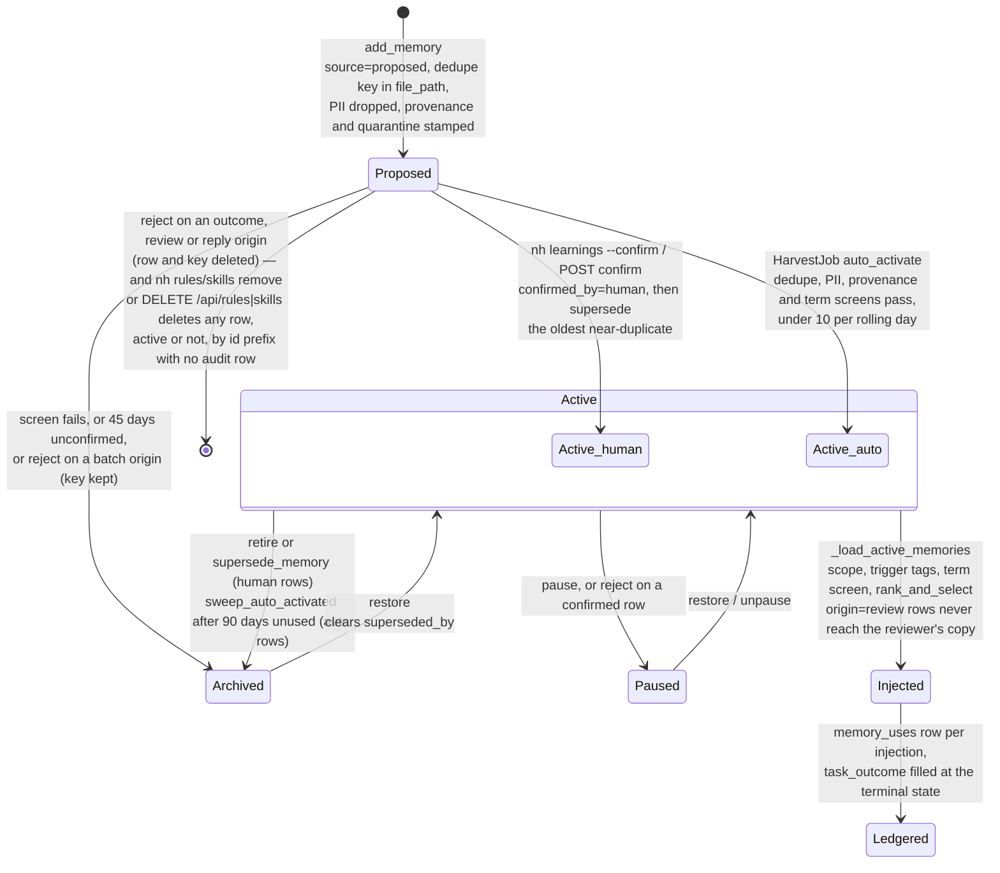

## 1. Executive Summary

no_human is a ticket-to-pull-request coding agent with a learning store
inside it, the product's **second brain**: one `memories` table of rules,
skills, facts and anti-patterns that later tasks are shown.
What makes it worth reading is that the store's own flood is written into
the code that fixed it, and that on 31 August 2026 an operator directive
reversed the module's founding contract — *"a human confirms every
learning"* — into bounded auto-management. Its weaknesses are measurement
and uniformity: nothing measures whether an injected rule changed an
outcome, and the care spent on the one injection chokepoint is not spent on
a second SQL route into the prompt or on four commands that hard-delete any
row without an audit row.

The flood is measured in the code's comments. A comment in
`learning/queue.py` records that the confirm queue reached 197 pending rows,
almost all budget and environment failures; the curator's docstring says 211;
the retirement module says 487 to 488 pending against 53 active, measured
against a copy of the operator's database on 12 August 2026, with roughly 394
of them produced by one templated per-success proposal that carried no
evidence beyond *"a task finished."*

Four mechanisms answer numbers like those. The flood source is gated off by
default (`PROPOSE_ON_SUCCESS_DEFAULT = False`, `queue.py:424`); unconfirmed
proposals archive after 45 days; corrections must recur twice before they are
proposed; and since the directive a proposal that passes four screens
activates itself, at most ten per rolling day, with every transition in an
append-only `learning_events` table and a kill switch that restores the
confirm queue byte for byte.

The implementation is strongest where it is most paranoid. There is one place
a task becomes an active rule set, `_load_active_memories`, and a test parses
the orchestrator's source with `ast` to assert that exactly one assignment
installs it, with a sibling test proving the scan fires on the mutants that
defeated an earlier version (`core/orchestrator.py:16743-16853`). The
reviewer reads a filtered copy of the rules from which every auto-confirmed
review-origin lesson is dropped in code, so the gate can never consume a rule
distilled from its own verdicts. A rejected proposal from a batch-driven
producer is archived with its dedupe key intact, so the next harvest cannot
re-propose it.

It is weakest where the same care is applied unevenly. A second raw-SQL route
into the prompt has had `archived`, `quarantined` and `paused` clauses added
one flag at a time, each after a test found the route open
(`context/sessions.py`). The vendor-term screen that holds rules carrying
customer names ships with an eight-name list because the real list is a
private supplement. `nh recall`, named in the coder's own instructions, is
substring matching over titles and bodies. `nh rules remove`, `nh skills
remove` and their API routes delete any row an id prefix resolves, outside
the lifecycle and its audit.

And there is no evaluation of whether an injected rule changes an outcome.
The ledger that could answer it is labelled *"CORRELATIONAL, NOT CAUSAL"* in
the migration that created it, and the label is repeated in the CLI that
reads it.

## 2. Mental Model

A memory here is a **lesson with a lifecycle**, never an observation, and
the lifecycle is what an operator gets in exchange for having no search:
every rule the model was shown can be traced to the signal that produced it
and switched off with one flag. Nothing is written because a conversation
happened; something is written because a labelled failure signal recurred, a
reviewer refused a diff, or a person typed a rule.

The row answers two questions in two columns because answering them in one
once broke the queue: three producers wrote their provenance into `source`
and were therefore never queued at all (`queue.py:52-56`). So `source` says
whether the confirm queue may see the row, and `origin` says which signal
produced it. The values of `source` are `proposed`, `confirmed`, `auto`, and
an operator's `board`. The values of `origin` are `review`, `supervisor`,
`history`, `reply`, `curator`, `escalation`, `review_fail`, `tamper`, and
NULL for the outcome path.

A proposal is born `confirmed = 0` and is inert. The injection query selects
`confirmed = 1`, the sessions route selects `WHERE confirmed = 1`, and
`nh recall` lists confirmed rows unless an operator passes
`--include-pending`. It becomes active by one of three doors.

The first door is a person. A human confirm writes `source = 'confirmed',
confirmed_by = 'human'` and then archives the oldest active near-duplicate in
the same scope with a `superseded_by` pointer (`LearningQueue.confirm`,
`queue.py:1162-1197`). The second is the harvest job's `auto_activate`, which
promotes a proposal that passes dedupe against active and paused rows, a
personal-data gate, a provenance check requiring an `origin` or an
`evidence.task_id`, and a vendor-term screen, writing `source = 'auto',
confirmed_by = 'auto', activated_at`; a row that fails any screen is archived
on the spot, never left pending (`queue.py:1423-1471`).

The third door is recurrence: a review-origin lesson that has recurred on two distinct tasks
whose pull requests a person merged is auto-confirmed into the coder's
channel only, behind a flag that is off by default
(`_maybe_auto_confirm_recurring`, `queue.py:666-735`).

An active row stops being one in five ways through the queue, and every one
of them is a flag with an audit row, reversible by `restore` in one call.
`pause` sets `paused = 1` and the default query stops returning it; `retire`
and the UI's `delete` archive it; `sweep_auto_activated` archives an
auto-activated row unused for ninety days, and cannot select a human-confirmed
one because `confirmed_by = 'auto' AND activated_at IS NOT NULL` is the whole
WHERE clause (`db.py:4088-4148`); `supersede_memory` archives it with a
pointer to the row that replaced it. `restore` reverses all of them and
clears `superseded_by`.

Two things do delete, and they differ in whether anyone wrote the rule down.
The first is a human's reject of an unconfirmed proposal whose origin is
outside the six batch-driven ones — the outcome path, `review` and `reply` —
on the argument written out at `queue.py:1246-1313`: such a lesson returns
only on new evidence, whereas a batch producer that re-reads its whole input
every twelve hours would re-propose a deleted lesson forever, so for those
six origins *"no"* must archive and keep the dedupe key. A reject on a
confirmed row pauses it instead.

The second is four remove paths that were never part of that argument: `nh rules remove`, `nh skills remove` and the
`DELETE /api/rules` and `DELETE /api/skills` routes call `Store.delete_memory`
on whatever row an id or unique prefix resolves, with no origin check and no
`learning_events` row (`cli/commands.py:2568-2582`, `:2941-2955`,
`api/app.py:4143-4150`, `:4180-4187`, `db.py:3930-3935`, `:4507-4510`).

Orthogonal to all of that is `quarantined`, set at write time by
`learning/provenance.py` when a row carries an employer or vendor term or a
project outside a configured allowlist, and set retroactively by
`nh memories scan --apply`. It withholds a row from every default read and
from the skill files written to disk, fails closed on a matcher error, and is
one `UPDATE` from being lifted. The read-side term screen in the orchestrator
is the same matcher pointed the other way and fails open, and the docstring
says why: a false hold there withholds a good rule forever with nobody
watching, while a false quarantine costs a human one click.

Memory is therefore treated as **candidate evidence until a screen or a
person promotes it, and as advisory context after**. The block the coder
receives says *"Critical rules (MUST follow)"* for the high-importance tier,
but the system's trust in a rule is expressed by which channel receives it,
not by any weight the model is told.

## 3. Architecture

Everything is one Python process and one SQLite file, which is why a broken
lifecycle state is repairable with one statement and why nothing here
replicates or backs up the store. `nh serve` runs a FastAPI application
(`api/app.py`), a scheduler with `HarvestJob`, `RetirementSweepJob`,
`ReanalysisJob` and `WikiRefreshJob` (`core/scheduler.py`), and the
orchestrator that drives tasks through the Claude Agent SDK; the React board
in `web/` and an Electron shell in `desktop/` talk to the API.

The store is `core/db.py`, a 5,092-line `Store` class over `aiosqlite` with a
`serialized_write` decorator that funnels every write through one lock. Its
schema is `migrations/0001_init.sql` plus seventeen further SQL files
replayed on every connect, plus `PRAGMA`-guarded `ALTER TABLE` blocks in
Python for every `memories` column added since the base table, because SQLite
has no `ADD COLUMN IF NOT EXISTS` (`db.py:1140-1434`).

The learning package (`src/no_human/learning/`) is twelve modules with one
job each: `queue.py` (proposal construction, the lifecycle verbs, harvest and
auto-activation), `corrections.py` (clustering supervisor corrections on a
positional gist), `failures.py` (escalations, repeated review failures and
tamper trips loaded into the same cluster shape), `curator.py` (dedupe and an
advisory model pass over the pending queue), `retire.py` (the sweeps, the
suggest-only retirement report, supersede-on-confirm and the flood-source
predicate), `ranking.py` (a pure scoring function), `triggers.py` (tag
matching), `vocab.py` (a canonical tag vocabulary with alias families),
`scope.py` (the remote-hash identity), `pii.py` (the personal-data gate) and
`provenance.py` (the quarantine gate and the inventory scan). None of them
imports a model client; distillation is an injected async callable the
orchestrator supplies from its utility tier, and
`test_ranking_imports_no_vendor_client` pins that for the ranker.

Two retrieval routes reach a prompt, and only one of them is the guarded
chokepoint. The main one is `Orchestrator._load_active_memories`, called
before the coder's attempt loop and again on the review path, feeding
`_format_active_memories` for the coder and supervisor and
`_format_reviewer_memories` for the reviewer. The second is
`context/sessions.py`'s `SessionsSource`, a context-gatherer that runs its own
`SELECT type, title, content FROM memories WHERE confirmed = 1 …` with
keyword `LIKE` clauses over the task's terms and screens its rows for banned
terms itself, because — as its docstring records — a confirmed rule whose
title carried one *"appeared in the digest under `[sessions]`"* through it.

Two more surfaces carry memory out of the table. `_materialize_skills`
writes confirmed skills verbatim to `.claude/skills/<name>/SKILL.md` for the
coder's session to load (`orchestrator.py:14987`). A separate `brain/`
package can pull signed, confirmed global rules from a hosted team brain into
`brain_rules` tables that are rendered as their own block and never enter
`memories`, on five invariants each pinned by a test.

### Deployment and ergonomics

One process, one SQLite database under `~/.no_human/`, Python 3.12, and a
Claude Agent SDK dependency that makes an Anthropic credential necessary to
run a task at all — but not to store, confirm or inject a memory, none of
which calls a model. Distillation of a reviewer finding or a correction
cluster into a lesson does call the utility tier, and a harvest run without
one stores the raw findings as the lesson instead (*"degraded, never
absent"*).

The store is plain SQLite and every lifecycle verb is an `UPDATE` on flags,
so a broken state is repairable with one statement, which the code comments
assume: three of them give the operator the exact SQL for options they chose
not to automate. Reading the memory outside the product is `nh rules`,
`nh skills`, `nh learnings` and `nh recall`, or the pane.

## 4. Essential Implementation Paths

Six paths carry a lesson from a signal to a prompt and back to an outcome,
and the design spends its care unevenly across them: injection is guarded by
a source-parsing test, the lifecycle verbs write an audit row each, and the
remove commands do neither.

**Proposal from a reviewer FAIL round.** `Orchestrator` calls
`LearningQueue.propose_from_review(task, findings=…, distill=…)`
(`learning/queue.py:541-664`). `_build_from_review` drops infrastructure
findings, keeps the three most severe with up to 200 characters of cited
evidence each, and either asks the utility tier for a one-line lesson with a
`TAGS` line or falls back to the findings themselves
(`build_review_distill_prompt`, `:244-263`). `contains_pii` runs over title,
content, the sanitised tags, the raw pre-vocabulary tags and every evidence
string; a hit drops the proposal and, through the `note` sink, tells the
operator which category was found without the value.

The write itself is `Store.add_memory` (`core/db.py:3407-3560`). It refuses
an unconfirmed row whose `source` is not `proposed`, returns None on a
`file_path` dedupe-key hit, resolves the project allowlist from
`NO_HUMAN_LEARNING_PROJECT_ALLOWLIST`, computes `quarantine_reason`, and
inserts with a provenance JSON of project, scope, context, ingestion time and
reason. A dedupe hit on a review-origin key is also the recurrence signal:
`_maybe_auto_confirm_recurring` appends the task to the deduped row's own
`evidence` JSON and, only if the flag is on, confirms the row once two
distinct tasks with merged pull requests carry the same finding
(`add_review_recurrence`, `db.py:3593`).

**Proposal from corrections and failure signals.** `HarvestJob` calls
`harvest_supervisor_corrections` and `harvest_failure_signals` every 43,200
seconds (`core/scheduler.py:2801`, `queue.py:988-1112`). Each loads
persisted events into `CorrectionRecord` rows, `cluster_corrections` groups
them by `(project, source, gist)` where the gist is the first *k* content
tokens of the message, and only a cluster of two or more is proposed; the
module docstring records the measured alternative keys and why they lost.
Before spending a distillation call the cluster's `correction_dedupe_key` is
checked with `memory_dedupe_key_exists`, which sees archived rows, so a
rejected cluster costs nothing on later runs.

**Injection.** `_load_active_memories` runs `list_memories(confirmed=True,
project=task.repo_path, scope=…)`, then `filter_triggered` over
`_trigger_haystack(task)` — title, description, acceptance criteria and the
plan's `FILES TO CHANGE/CREATE` paths — with `_term_fires` requiring the tag
at ASCII word boundaries and a canonical tag firing on its alias family
minus the generic aliases; then `_screen_memories_for_terms`; then
`rank_and_select` with a ceiling of 25 and a floor of the five most-used
high-importance rules (`orchestrator.py:16743-16853`,
`learning/triggers.py:22-45`). The selected list is installed through a
property whose setter re-screens on read, stamped into `last_used_at` and
`use_count`, appended to `memory_uses` with `attempt_id` NULL on the
implement path, and written to `learning_events` as one `inject` row per
memory with `trigger_reason`.

Rendering is separate from selection. `build_memories_block` renders three
tiers under character caps of 8,000 and 4,000 and a twenty-title long tail
(`core/prompt_blocks.py:1060-1130`); `_format_reviewer_memories` removes
`origin = 'review' AND confirmed_by = 'auto'` rows before rendering the
reviewer's copy (`orchestrator.py:17306-17340`). The block is appended to the
rules block of the implement prompt and handed to the supervisor as the same
text (`:16358-16361`, `:14880`).

**Outcome.** `run_task`'s finalizer calls `fill_memory_use_outcomes(task.id,
label)` with one of `success`, `failure`, `cancelled` or `timeout`, only on
rows whose outcome is still NULL, so a resumed task's new injections get
their own label (`orchestrator.py:2575`, `db.py:4276-4300`).
`memory_usage_report` and `memory_outcome_counts` aggregate the ledger for
`nh learnings --usage` and the API's per-row counts.

**Lifecycle verbs.** `confirm`, `retire`, `reject`, `pause`, `unpause` and
`delete` on `LearningQueue`, each writing through `_audit` after the
transition (`queue.py:1162-1350`); the API routes including `restore`, which
undoes archive and pause in one call (`api/app.py:4240-4352`); the CLI's
`nh learnings` with `--confirm`, `--reject`, `--retire`, `--stale`,
`--usage`, `--harvest` and `--triage-templated`. Beside them, and not through
`LearningQueue`, `nh rules remove` and `nh skills remove` and the `DELETE`
routes for rules and skills resolve a row by id prefix with `find_memory` and
call `delete_memory` on it, which is a `DELETE FROM memories` with no audit
write (`cli/commands.py:2568-2582`, `:2941-2955`, `api/app.py:4143-4150`,
`:4180-4187`, `db.py:4507-4510`).

**Sweeps.** `RetirementSweepJob` runs `sweep_unconfirmed` daily —
`archive_unconfirmed_older_than` with a literal `confirmed = 0`, a
`source = 'proposed'` clause so board-added rows are never touched, and a
limit of 500 with a warning when hit — and, when `auto_manage` is on,
`sweep_auto_activated` (`core/scheduler.py:2704`).

**Quarantine.** `quarantine_reason` in `learning/provenance.py` with three
needle classes; `Store.set_quarantine` (`db.py:3981`); `nh memories scan
[--apply]` reporting counts by class index only; `GET /api/memories/quarantine`
for the pane's footer.

**Tests.** `tests/test_learning.py`, `test_learning_auto_activation.py`,
`test_memory_quarantine.py`, `test_knowledge_triggers.py`,
`test_memory_term_screen.py`, `test_active_memories_mutation_guard.py`,
`test_memory_retirement.py`, `test_memory_usage_ledger.py`,
`test_memory_ranking.py`, `test_project_scope.py`, `test_review_learning.py`,
`test_supervisor_learning.py`, `test_curator.py`,
`test_memory_triage_runbook.py`, `test_lesson_evidence_vocab.py` and
`test_usage_ledger_retention.py`.

## 5. Memory Data Model

The row is the state machine: every lifecycle verb is a flag on it, and the
column list carries the schema's history in the order the flags were needed.
`memories` (`migrations/0001_init.sql:57-69` plus the Python `ALTER` blocks
at `core/db.py:1140-1434`) holds `id`, `type` in rule, skill, fact,
anti_pattern (no CHECK), `title`, `content`, `file_path` — which holds the
dedupe key, a naming accident the code acknowledges and keeps — `tags` JSON,
`project` (the checkout path, NULL for global), `source`, `confirmed`,
`created_at`, `updated_at`, then `archived`, `origin`, `evidence` JSON,
`project_scope`, `last_used_at`, `confirmed_by`, `use_count`,
`quarantined NOT NULL DEFAULT 0`, `provenance` JSON, `superseded_by`,
`paused NOT NULL DEFAULT 0` and `activated_at`.

Every added column but the two flags has no default, and the comments say why
each time: a legacy row *"genuinely has no recorded provenance, and NULL says
so honestly."* `archive_memory` appends `[archived: <reason>]` to `content`
so the reason survives a restore.

Three sibling tables carry what the row does not. `memory_uses`
(`migrations/0012_memory_usage_ledger.sql`) is one row per memory per
injection with `task_id`, nullable `attempt_id`, `injected_at` and
`task_outcome` filled later. `learning_events` (`db.py:1422-1433`) is
`memory_id`, `event`, `detail` JSON, `created_at`; `add_review_recurrence`
records the distinct tasks a review-origin dedupe key recurred on.
`playbooks` (`migrations/0007`) is a sibling store of operator-authored
procedures with their own trigger keywords, matched against the same
haystack.

Scope is two columns: `project` for the human-readable checkout path and
`project_scope` for `prj:` plus the SHA-256 of the normalised remote URL, a
hash rather than the URL so a credential in a remote can never be persisted,
with `tests/test_project_scope.py` asserting the credential appears nowhere
in the database file (`learning/scope.py`). Provenance is `origin`, the
`evidence` record (`kind`, `what`, `task_id`, `status`, and for a review
finding the round and attempt) and the write-time `provenance` JSON.

Time is record time only: `created_at`, `updated_at` (which injection
deliberately does not touch, because it is *"the only timestamp that says
when the operator last had an opinion"*), `last_used_at`, `activated_at`.
There is no validity interval and no TTL on content; the windows — 45 and 90
days — act on state. Importance is a tag (`importance:high`,
`importance:low`, default medium), read in exactly one place
(`ranking.importance_tier`). The `sessions` table's `learnings` JSON column
from the base migration has no writer in `src/`; the learning store never
used it.

## 6. Retrieval Mechanics

There is no query at injection time, so the tag vocabulary is the retrieval
quality: an untagged rule injects into every task in its scope, and none of
the three routes sees a paraphrase. The candidate set is every active row in
scope; relevance is decided by tags. A memory with no tags is unconditional
and always injects (`triggers.py:74-90`); a memory tagged only with a
provenance tag never auto-injects; a canonical tag fires on its alias family.

Matching moved from substring to word boundary on 1 September 2026 after an
effectiveness study found `fact` firing inside *artefact* and *"up to 25
irrelevant rules"* injected into one task (`triggers.py:22-45`, CHANGELOG
0.1.9). The haystack includes planned file paths, so a rule tagged
`triggers.py` fires only for a task whose plan names that file, and
`test_the_file_signal_is_the_only_thing_that_could_have_matched` pins that
the prose could not have.

Ranking is `importance_weight × exp(−days_since_use/14) ×
(1 + use_count)/(1 + max_use_count)`, with an unknown recency treated as
thirty days, a ceiling of 25 rows, and a floor of the five most-used
high-importance rows placed first regardless of score (`learning/ranking.py`).
Ties break on `id`, so `test_selection_is_identical_across_ten_runs` holds.
The module docstring works three examples by hand and
`test_score_matches_hand_computed_formula` checks them. Formatting then
applies character caps per tier and stops at a whole rule rather than
truncating one.

Two on-demand routes sit beside injection. `nh recall <query>` is the one the
coder is told it may run from Bash: lower-cased substring hits over task
titles, memory titles and bodies, and cached history findings, scoped to the
repository the command runs in, confirmed rows only — the docstring names the
alternative, *"the confirm gate, bypassed by a search box."*
(`cli/commands.py:4373-4460`) The `SessionsSource` route is `LIKE` over up
to six task keywords, five rows, 2,000 characters each, plus an FTS5 query
over the failure and fix record in `events_fts` (`context/sessions.py:60-115`).

The failure modes follow from the design. Two rules with the same tag compete
on use count, and use count is stamped on injection, not on effect, so a rule
that injects often ranks higher for having injected often. The term screen
holds a rule with a bad noun silently except for an event line.

## 7. Write Mechanics

Writes are deferred and evidence-driven, so nothing memory-related blocks the
coder's session and a lesson can take up to twelve hours plus the screens to
reach a task. The four producers that run without a person are
`propose_from_outcome` (a structural blocker becomes an anti-pattern
proposal; a success becomes a skill proposal only with `propose_on_success`
on), `propose_from_review` (per FAIL round, distilled),
`harvest_supervisor_corrections` and `harvest_failure_signals` (batch,
clustered, two occurrences minimum).

The human-driven producers are `nh rules add` and `nh skills add`, the
board's rule and skill endpoints, `nh reply` mining an operator's reply for a
rule (`origin = 'reply'`), `nh history --analyze` mining Claude Code
transcripts with a fixed phrase list and no model (`history/analyzer.py`),
and the onboarding wizard's confirmed rules. `learning/curator.py` runs a
free dedupe pass over the pending queue — identical normalised title and
content prefix, keep the oldest, archive the rest — and an advisory model
pass proposing archives and consolidations that apply only with `--apply` and
whose unparseable reply curates nothing.

Deduplication happens three times with three keys: by `file_path` at write
time, by `curator.dedupe_key` — a normalised title-and-content prefix — at
confirm and activation time, and by the gist at cluster time. An update is a
new row that supersedes the old one, never an edit of content by the machine;
the only content rewrite is the `[archived: …]` suffix.

Personal data is dropped, not redacted, with the reasoning at the top of
`learning/pii.py`: a redacted shopping fact is still not a coding rule, and
*"User's shipping address is [REDACTED]"* is itself a disclosure. The
detectors demand context — an address keyword, a phone keyword near a digit
run, a consumer mailbox domain, a Luhn-passing formatted card number — so
ports, IPs, commit author lines and version strings survive.

### Operational cost

Proposals are written after a terminal state or a review round, harvests run
on a twelve-hour timer, and the utility-tier distillation is the only model
call, paid once per new cluster or finding and never for a deduped one. The
lag before a lesson can affect a task is the human's, or up to twelve hours
plus the screens for auto-activation.

The read path runs a handful of `SELECT`s and three writes — a chunked
`last_used_at` UPDATE, the ledger inserts, and one `executemany` of audit
rows — at the start of every attempt and every review round, all best-effort
so a locked database cannot stop a task. The injected block is bounded at
12,000 characters plus twenty titles and sits inside the rules block of the
system prompt, which changes whenever the active set does. No pass re-reads
or rewrites the whole store; the sweeps are two indexed `UPDATE`s.

## 8. Agent Integration

The agent has no write access to memory at all, and that is what lets the
product afford auto-activation: the worst an auto-activated lesson can do is
be wrong, not be adversarial. The only paths into `memories` are the queue's
proposers and a person, and `brain/store.py`'s docstring lists exactly why a
remote or model-authored rule must not reach the table — it feeds one string
into the coder, the supervisor and the reviewer, an untagged row injects
unconditionally, and the coder can search it. That is a stronger stance than
most systems in this atlas take.

The coder never calls a memory tool. Its prompt carries the rules block; its
instructions name `nh recall <query>` as a Bash command; a confirmed skill is
also a `SKILL.md` on disk that the Claude Agent SDK session loads. The
supervisor receives the same block; the reviewer receives the filtered copy
and turns it into a numbered `RULE ADHERENCE` pass.

The operator's surface is the Second brain pane in Settings (`web/src/`) —
learnings with origin task, usage count, Pause, Delete and Restore, a Rules
and Skills panel with archived rows behind a footer, a suggest-only retire
list — and the `nh learnings` family in the CLI. Adapting the store to
another agent would mean re-implementing the orchestrator side: the
chokepoint, the haystack and the channel split are orchestrator methods, not
a library.

## 9. Reliability, Safety, and Trust

The guards are strongest around the prompt and weakest around the row: the
chokepoint has a test that parses source for any other writer, while four
remove commands reach the table with no lifecycle and no audit.

**Provenance.** Every row written by the product carries `origin` or an
`evidence.task_id`, and auto-activation refuses one with neither; the
write-time `provenance` JSON records the ingestion context. A row written
before a column existed carries NULL, and the code treats NULL as *"human /
legacy"* for `confirmed_by` and as live for the flags.

**Gate independence.** The reviewer never sees a rule derived from its own
verdict without a human between. `_format_reviewer_memories` drops
`(origin = 'review', confirmed_by = 'auto')` rows, the exclusion lives in code
rather than a prompt, and a human confirm overwrites `confirmed_by` to
`human` and thereby admits the rule to the reviewer;
`tests/test_auto_confirm_recurring.py:102` fails if the filter is deleted,
and `test_reviewer_channel_guard.py` fails if any `self.reviewer.review(…)`
call appears outside the one chokepoint.

**The chokepoint and its guard.** `_active_memories` is a property whose
setter screens and whose getter returns a fresh screened list, because an
assignment-site guard was defeated by *"nine ordinary Python forms"*
(`orchestrator.py:16855-16870`). `test_active_memories_mutation_guard.py`
parses the source for direct mutation, and
`test_knowledge_triggers.py:241-298` asserts a single install site inside
`_load_active_memories` and then asserts the scan detects each mutant form.
That second test is the shape this atlas asks for and rarely finds: a guard
with its own known positive.

**Two screens, two failure directions, stated.** Write-time quarantine fails
closed; read-time term screening fails open; `provenance.py:1-45` argues
each. What follows from the open direction is that a matcher error lets an
otherwise eligible memory into the prompt without that screening step, with
only the write-time quarantine in front of it. The limits are stated too: the
matcher sees plaintext terms on letter boundaries, cannot see an encoded term
or a description that identifies without naming, and outside the operator's
install the list is eight names.

**Flood control with numbers.** The daily cap is a rolling 24-hour count on
`activated_at`, not a calendar day, so a tick after midnight cannot reset it.
The sweeps carry a limit and warn when they hit it, because a sweep that
silently stops at its cap is the bug they exist to fix.

**Concurrency and loss.** All writes serialise on one connection lock; the
bookkeeping writes are wrapped so an exception logs and the task proceeds;
a supersede failure never undoes a confirm. Nothing here replicates the
database.

**Deletion.** Inside the queue the semantics are written down: a reject
deletes an unconfirmed proposal from the outcome, review or reply path with
its dedupe key, archives one from a batch-driven origin, and pauses a
confirmed row; the UI's Delete archives. Outside the queue they are not:
`nh rules remove`, `nh skills remove`, `DELETE /api/rules/{id}` and
`DELETE /api/skills/{id}` resolve any row by id prefix and run
`DELETE FROM memories` on it, with no origin check, no reversal and no
`learning_events` row, so the trail that records every pause and archive has
no entry for a row removed this way.

**What is not covered.** Paraphrase: two corrections that say one thing in
different words are two one-offs, and
`test_a_paraphrase_of_the_same_correction_does_not_cluster` pins the limit so
it is not mistaken for a bug. Effect: nothing measures whether a rule helped.
Uncertainty: a rule is active or not; the importance tier is the only
gradation, and it is a tag a human or the distiller wrote.

## 10. Tests, Evals, and Benchmarks

293 test functions in seventeen files cover the store directly, inside a
suite of 9,137 that CI runs with `pytest -n 4`; three of them exist to prove
that other tests can fail, and none evaluates retrieval quality or the effect
of an injected rule.

The lifecycle has cases in `test_learning.py`: not active until confirmed,
confirm promotes, reject removes or archives per origin with a parametrised
table, transient blockers do not propose, success proposes nothing by
default. Auto-activation has them in `test_learning_auto_activation.py`: the
eleventh proposal stays inert, the window is rolling, a paused row is absent
from both routes, the kill switch restores a byte-identical block, an
auto-activated row retires at ninety days and a pinned one never does, each
screen archives and a clean proposal is the positive control for all four,
audit rows record the tags that fired and each transition survives an audit
failure.

Quarantine has them in `test_memory_quarantine.py`: absent from list, API,
CLI, injection on both routes and skill files; the row is preserved; a
matcher error quarantines; an allowlist sibling prefix is not trusted; a scan
that reads zero rows while the UI lists items fails. Triggers, the term
screen and ranking have their own files — the hand-computed formula, the
floor within the tier, the empty-ledger fallback, determinism, and that
scoring only reorders — as do retirement (the sweep never archives a
confirmed row, is idempotent and reversible, respects limit and source; a
supersede refuses self and dead targets and respects scope), the usage
ledger end to end through `run_task`, and the scope identity.

The three tests that prove other tests can fail are
`test_the_positive_control_can_fail`,
`test_the_kill_switch_test_can_actually_fail` and
`test_the_single_install_site_scan_can_actually_fail`; one sweep test,
`test_a_rule_held_by_the_term_screen_is_not_recorded_as_used`, guards the
specific lie the ledger could tell. `test_quarantined_never_injected` asserts
absence on a one-row store, which would pass against an empty result; the
same file's `test_clean_memory_is_not_quarantined` and the auto-activation
file's positive control cover the other side in sibling cases rather than in
that one.

There is no retrieval-quality evaluation and no benchmark of the learning
store: `eval/` holds the product's task corpora, reviewer-recall cases and
judge calibration, and the string *memories* occurs there only inside
fixture copies of the product's own source. The ledger is the closest thing
to an effect measurement and is labelled correlational in the migration, the
CLI and the UI.

The channel split has its own file, `tests/test_auto_confirm_recurring.py`:
an auto-confirmed review lesson reaches the coder and is absent from the
reviewer, a human-confirmed one reaches the reviewer, a non-review origin is
never excluded, and the flag off, the same task twice, an unapproved outcome
and one approved task of two each refuse to auto-confirm. Two tests one
would still want before trusting the store: a case that the sessions route
and the chokepoint agree on the same set for the same task, and a case that
`nh rules remove` cannot reach a row the queue owns.

## 11. For Your Own Build

### Steal

- **One install site, proven by parsing.** Put the assignment that turns a
  store into a prompt behind one function, then write the test that parses
  the source for any other assignment — and the test that shows the parser
  catches the mutants. The second test is what makes the first one evidence.
- **Two "no" verbs chosen by the producer's shape.** If the producer re-reads
  its whole input every run, a rejection must archive and keep the dedupe key;
  if it fires only on new evidence, deleting is fine. Write the criterion
  down beside the list so the next origin gets the right verb.
- **Confirm-then-supersede.** When a human promotes a near-duplicate, archive
  the oldest active twin with a pointer to the survivor, one hop, no chains,
  inside the same scope only. It keeps the active set from growing by
  restatement without asking the human to find the twin.
- **A channel split in code for gate independence.** If a lesson was
  distilled from a gate's verdict, do not feed it back to that gate without a
  human between; make the exclusion a filter the reviewer's prompt builder
  applies, and pin it with a test that fails when the filter is removed.
- **Ledger presence and outcome separately, and say what it is not.** One row
  per injection with the outcome filled at the terminal state, labelled
  correlational at the table, in the CLI and in the UI.
- **Provenance in two columns.** Visibility (`source`) and origin are
  different questions; a producer that writes its name into the visibility
  column disappears from the queue.
- **A drop-not-redact personal-data gate with context-demanding detectors,**
  and the reasons written at the top of the file.

### Avoid

- **A second SQL route into the prompt.** Every lifecycle flag here had to be
  added to `context/sessions.py` by hand after a test found the route open.
  One chokepoint is a mechanism only if it is the only reader.
- **A remove command that bypasses the lifecycle.** Four paths here delete
  any row by id prefix with no audit row while the queue's own delete verb
  archives and audits. If a store has a lifecycle, every exit goes through it.
- **Use count as a ranking signal when it is stamped on injection.** It
  rewards rules for having been injected. Rank on outcome-joined counts or
  not at all.
- **Auto-management on by default with a cap as the only ceiling.** Ten
  unread rules a day is 300 a month; the store's own history shows what an
  unattended queue becomes.
- **A screen whose real term list ships separately.** A guard that protects
  the operator's install and nobody else's is a guard for one user.

### Fit

This is a memory for an autonomous coding agent whose operator wants to be
able to say why every rule the model was shown exists, where it came from,
and how to make it stop — and who will accept that the price is a rule
vocabulary of tags rather than any search. It suits a single operator or a
small team running the whole product on one machine, with SQLite as the
database and a willingness to read `nh learnings`.

It is not separable. The lifecycle lives in twelve modules that can be
lifted, but the injection, the haystack, the channel split and the guards
are methods on a 21,785-line orchestrator, so adopting the design means
rebuilding that side.

Walk away if you need semantic recall, a memory the agent itself may write,
more than one project per store with different trust levels, or any
measurement that an injected rule changed an outcome; the product does not
claim any of those, and its ledger says so on its face.

## 12. Open Questions

- What the private vendor-term supplement holds and how many rules an
  operator's install actually quarantines; the code reports counts by class
  index only, on purpose.
- Whether the twelve-hour harvest and the ten-a-day cap produce an active set
  that the ninety-day retirement keeps bounded in practice, or whether
  auto-activated rows accumulate faster than they retire on a busy board.
- What `nh reply` mining and the transcript analyser produce on a real
  history, given that both are phrase lists.
- Whether the team brain's hosted tier, which is closed and out of scope here,
  ever gains a write path; `brain/__init__.py` says the first increment is
  read-only.

## Appendix: File Index

- Size and screen: MIT; 1,456 commits between 21 June and 6 September 2026,
  1,430 of them by one author under two names; 130,065 lines of Python under
  `src/no_human/`, of which the learning package is 3,800 lines in twelve
  modules and the orchestrator that injects it is a single 21,785-line file;
  9,137 test functions in 437 files, 293 of them in seventeen files about the
  learning store. The screen found no auto-run surface in the tree; two
  `conftest.py` files execute on collection, six manifests were inside the
  seven-day cooldown, and nothing was installed or run.
- Storage and schema: `migrations/0001_init.sql:57-69`,
  `migrations/0012_memory_usage_ledger.sql`, `src/no_human/core/db.py:1140-1434`
  (column additions and `learning_events`), `:3407-3560` (`add_memory`),
  `:3639-3720` (`list_memories`), `:3930-3935` (`find_memory`), `:3938-4030`
  (archive, unarchive, sweep), `:4088-4200` (auto-retire sweep,
  `supersede_memory`), `:4198-4300` (usage stamps and ledger), `:4459-4568`
  (stale, confirm, delete, activate, pause), `:4569-4646` (audit writers and
  reader).
- Write path: `src/no_human/learning/queue.py:424-540` (outcome proposals
  and the flood gate), `:541-735` (review proposals, recurrence auto-confirm),
  `:822-1112` (corrections and failure harvests), `src/no_human/learning/corrections.py`,
  `src/no_human/learning/failures.py`, `src/no_human/learning/pii.py`,
  `src/no_human/learning/provenance.py`, `src/no_human/learning/scope.py`,
  `src/no_human/learning/vocab.py`, `src/no_human/learning/curator.py`,
  `src/no_human/history/analyzer.py`, `src/no_human/history/ingester.py:111`.
- Lifecycle: `src/no_human/learning/queue.py:86-94` (`ARCHIVE_ON_REJECT`),
  `:1113-1471`, `src/no_human/learning/retire.py`,
  `docs/design/memory-lifecycle-triage.md`, `scripts/memory_triage_runbook.py`;
  the remove paths outside it, `src/no_human/cli/commands.py:2568-2582`,
  `:2941-2955`, `src/no_human/api/app.py:4143-4150`, `:4180-4187`.
- Retrieval and injection: `src/no_human/core/orchestrator.py:16710-16742`
  (caps and haystack), `:16743-16853` (`_load_active_memories`),
  `:16855-16900` (the property), `:17186-17260` (`_screen_memories_for_terms`),
  `:17292-17340` (`_format_active_memories`, `_format_reviewer_memories`),
  `src/no_human/learning/triggers.py`, `src/no_human/learning/ranking.py`,
  `src/no_human/core/prompt_blocks.py:1060-1130`,
  `src/no_human/context/sessions.py`, `src/no_human/cli/commands.py:4373-4460`
  (`nh recall`).
- Background: `src/no_human/core/scheduler.py:2704` (`RetirementSweepJob`),
  `:2801` (`HarvestJob`), `src/no_human/config.py:2228-2295` (`learning`
  defaults: `auto_confirm_recurring` off, `propose_on_success` off,
  `archive_unconfirmed_days` 45, `retire_suggest_days` 90, `auto_manage` on,
  `auto_activate_daily_cap` 10).
- API, CLI and UI: `src/no_human/api/app.py:4116-4375`,
  `src/no_human/cli/commands.py:2510-2680` (rules, memories scan),
  `:5778-6210` (`learnings-curate`, `learnings`), `web/src/Settings.jsx:913-1100`,
  `web/src/learningCard.js`, `web/src/learningRetire.js`, `web/src/memoryArchive.js`.
- Team brain, out of scope: `src/no_human/brain/__init__.py`,
  `src/no_human/brain/store.py`.
- Tests: the seventeen files listed in section 4.
- Searches behind the absence claims: `rg -n 'DELETE FROM memories' src`
  (one hit, `delete_memory`) and `rg -n 'delete_memory\(' src` (five call
  sites: `LearningQueue.reject`, `rules_remove`, `skills_remove`,
  `remove_rule`, `remove_skill`); `rg -n 'DELETE FROM learning_events|UPDATE learning_events' src`
  (none); `rg -n 'INSERT INTO sessions' src` (none — the `learnings` column
  has no writer); `rg -l -i 'memories|learning' eval` (five hits, all
  fixture copies of product source under `eval/reviewer_recall/cases/`);
  `rg -n 'add_memory\(' src`
  (fourteen call sites, all through `Store.add_memory`);
  `rg -n 'embedding|vector' src/no_human/learning src/no_human/context/sessions.py`
  (none).

## History

**2026-09-06** — [`aab935b6df7c7c350773c7712ed7daeb8c572e68`](https://github.com/no-human-ai/no_human/commit/aab935b6df7c7c350773c7712ed7daeb8c572e68) — first reading, at the head of `main`, 1,456 commits in. The screen found no auto-run surface; two `conftest.py` files execute on collection, six manifests were inside the seven-day cooldown, and nothing was installed or run. Six marks: `tombstone` for the archive that keeps its dedupe key against a batch producer, `trust_state` for the five flags the default query applies, `scope_enforced` for the remote-hash scope on the injection query, `audit_log` for `learning_events`, `human_review` for the Second brain pane and the CLI, `negative_eval` for the trigger, screen and pause cases with positive controls in the same case. `bitemporal` withheld: every timestamp is record time.
