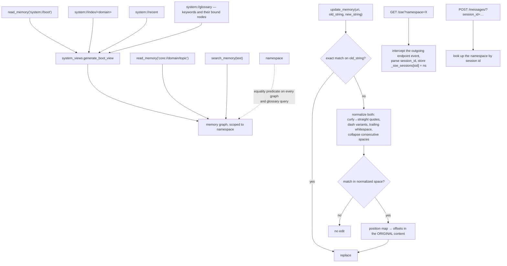

## 1. Executive Summary

Nocturne Memory is an MCP long-term memory server, Chinese-first with an English
README, framed around persona continuity — *"让你的 AI 跨会话、跨模型地记住自己
是谁"*, roughly "let your AI remember who it is across sessions and across
models" — and usable from any MCP client.

**Two mechanisms are worth other people's attention, and neither is the
framing.**

**First, memory is a URI namespace.** Nodes are addressed as
`core://work_jobstation/commercialization`, and a set of generated `system://`
views sit beside the stored ones: `system://boot`, `system://index/<domain>`,
`system://recent`, `system://glossary`, and a diagnostic. The README's worked
example shows the agent opening a session with `read_memory("system://boot")`
before anything else.

A scheme-and-path address gives an agent something a similarity score does not:
a way to navigate deliberately. `system://index/core` lists what exists in a
domain, so the model can *look up* rather than only *search*, and
`system://boot` is a designated entry point rather than a convention in a prompt.
The views are generated from the graph on read rather than materialised, so they
cannot drift from it.

**Second — and this is the transferable one — `backend/text_patch.py`:**

> "When the LLM reads memory content and re-emits it as `old_string`, subtle
> character-level differences creep in (curly vs straight quotes, dash variants,
> trailing whitespace, consecutive space collapse). These helpers let
> `update_memory` fall back to a normalized comparison when the exact match
> fails, **while keeping a position map so the replacement targets the correct
> range in the original content**."

Every memory system that lets an agent edit by quoting the text it wants to
replace hits this. The model re-emits `"` as `"`, an em dash as a hyphen, or
collapses a double space, the exact match fails, and the edit silently does
nothing. Normalising both sides fixes the *match* and breaks the *replacement* —
unless you keep a map from normalised offsets back to original ones, which is
what this does.

## 2. Mental Model

Memory is a graph of URI-addressed nodes inside a namespace. An agent boots by
reading a system view, navigates by URI or searches by text, and edits by quoting
the passage it wants to change.

## 3. Architecture

`backend/` holds `mcp_server.py`, `mcp_wrapper.py`, `run_sse.py` (SSE and
streamable HTTP), `main.py` and `web_app.py` (REST), `api/`, `db/` (a graph
service and a glossary service), `models/`, `system_views.py`,
`namespace_middleware.py`, `text_patch.py`, `auth.py`, `health.py`, `locales/`.
Plus a `frontend/`, a `desktop_pet/`, Docker Compose and 12 test files.

`system_views.py` opens with a note on its own import discipline — "Imports from
`mcp_server` (parse_uri, make_uri, config constants) are done inside function
bodies to avoid circular imports at module level" — which is a small honesty
about a layering compromise rather than a silent workaround.

19,200 lines of Python and TypeScript.

## 4. Essential Implementation Paths

**Address** — `backend/system_views.py` (the package contract `:1-10`, the boot
view `:161`, the index view `:213`, `system://recent` `:301`,
`system://glossary` `:350`).

**Patch** — `backend/text_patch.py` (the normalisation-and-position-map
rationale `:1-10`).

**Scope** — `backend/namespace_middleware.py` (the SSE session workaround
`:1-21`), `backend/db/glossary.py` (`namespace ==` predicates `:90`, `:126`,
`:152`, `:263`), `backend/db/namespace.py`.

## 5. Memory Data Model

A graph of nodes under a URI scheme, with a glossary binding keywords to nodes —
`system://glossary` generates "a view of all glossary keywords and their bound
nodes", which is a second navigation index alongside the domain index.

There is no status field, no confidence, no supersession pointer and no
tombstone. `update_memory` patches content in place, so a corrected passage
replaces the old one with nothing recording that it changed. For a system whose
stated purpose is months of accumulated persona and strategy memory, that is the
gap worth naming: the README's own example shows the agent reasoning from
"战略复盘" — strategic retrospectives — recorded over months, and nothing
distinguishes a conclusion the user has since abandoned from a current one.

## 6. Retrieval Mechanics

Three ways in: read a URI, search text, or read a generated `system://` view.
Having all three matters — an agent that can only search cannot enumerate, and
one that can only enumerate cannot find by meaning.

**Namespace is a real predicate.** `Path.namespace == namespace` and
`GlossaryKeyword.namespace == namespace` appear on the graph and glossary
queries, so a stored key reaches the query and `scope_enforced` is earned.

**The namespace middleware documents a genuine protocol problem**, and the
solution is worth reading if you build MCP servers:

> "For legacy SSE transport (GET /sse → POST /messages/), namespace cannot be
> re-read from each request because FastMCP's POST /messages/ carries only a
> session_id and no namespace information. We solve this by: on
> `GET /sse?namespace=X` — wrapping `send` to intercept the outgoing `endpoint`
> SSE event… parse the hex UUID and store `_sse_sessions[session_id] =
> namespace` before forwarding the event."

Binding a scope at connection time because the transport drops it on subsequent
requests is the kind of thing that is either done carefully or becomes a
cross-tenant bug. It is done carefully here, and it is worth a reader noting that
the mapping lives in process memory, so it does not survive a restart or span
multiple server instances.

## 7. Write Mechanics

`update_memory` takes an `old_string` to locate the passage. The fallback path in
section 1 is the mechanism; the design decision underneath it is that the *edit
target is quoted text*, which is the same interface Claude Code's own edit tool
uses and inherits the same failure mode.

Two details make the fallback safe rather than sloppy. Normalisation is applied
only after the exact match fails, so an unambiguous edit is never fuzzed. And the
position map means the replacement is spliced into the original content — a
system that normalised, replaced, and wrote back the normalised text would
silently rewrite every curly quote in the document as a side effect of one edit.

## 8. Agent Integration

MCP over both SSE and streamable HTTP with a namespace query parameter, a REST
API, a web frontend, a desktop pet, Docker Compose, and a localisation layer.
The README lists eleven MCP clients it targets.

The worked examples in the README are unusually concrete: a real session
transcript showing the tool calls the agent made (`read_memory("system://boot")`,
then `search_memory`, then two `read_memory` calls on specific URIs) before its
answer. Showing the retrieval trace rather than only the output is the right way
to demonstrate a memory system, and it lets a reader see that the boot document
is doing the navigation work.

## 9. Reliability, Safety, and Trust

**One mark: scope enforced**, per section 6.

**Trust state, tombstone, bitemporal, audit log, human review, negative eval —
no.**

**`demo.db` is committed to the repository.** For a project whose README
demonstrates months of a specific person's work strategy, business
commercialisation notes and stated personal traits, a committed database file is
worth a second look before publication — this report did not open it, and the
name suggests demonstration data, but the file is in the tree and the surrounding
material is personal.

**The persona framing deserves a plain note.** "Alignment is for tools. Memories
are for sovereign AI" is a positioning claim, not a mechanism, and nothing in the
code implements sovereignty in any sense the atlas can assess. What the code
implements is a URI-addressed graph with namespaces and a boot document, which is
a good design and does not need the framing.

## 10. Tests, Evals, and Benchmarks

**No paper, no benchmark, no committed results.** 12 test files against 19,200
lines, which is thin — and thinnest exactly where it matters most: the fuzzy
patcher is the component whose failure mode is a *silently wrong edit to stored
memory*, and a table of normalisation cases (curly quote, en dash, em dash,
non-breaking space, collapsed run, trailing whitespace, each with the expected
original-offset result) is the test that would pin it.

The `system://diagnostic` view suggests some self-checking exists at runtime;
nothing measures retrieval.

**I ran nothing.**

## 11. For Your Own Build

### Steal

- **Match on normalised text, replace on original offsets.** If your agent edits
  memory by quoting the passage, the model *will* re-emit curly quotes as
  straight ones and em dashes as hyphens. Normalise to find it, keep a position
  map, splice into the original — never write the normalised form back.
- **Only fuzz after the exact match fails.** An unambiguous edit should never go
  through the lenient path.
- **Address memory with a URI scheme.** `core://domain/topic` gives an agent a
  way to navigate deliberately, which similarity search cannot; and it makes a
  citation stable.
- **Generate index views rather than materialising them.** `system://index/…`,
  `system://recent` and `system://glossary` computed from the graph on read
  cannot drift from it.
- **Designate a boot document.** `system://boot` as the agreed entry point is
  more reliable than hoping a prompt convention holds, and the README's trace
  shows the agent using it first.
- **Bind the scope at connect time when the transport drops it.** The SSE
  session-id mapping is the right shape for a protocol that carries the namespace
  only on the initial GET — and know that an in-process map does not survive a
  restart or a second instance.
- **Show the retrieval trace in your demo.** The tool calls the agent made,
  before its answer.

### Avoid

- **Do not patch memory in place with no record of the change.** A persona built
  over months contains conclusions the user has abandoned, and nothing here
  distinguishes them.
- **Do not leave the fuzzy patcher under-tested.** Its failure is a wrong edit to
  stored memory, which is the least visible failure a memory system has.
- **Do not commit a `.db` file next to a README full of personal strategy notes.**

### Fit

Worth looking at if you are building an MCP memory server and want a navigation
model richer than search — the URI scheme plus generated index views is a good
pattern and is independent of the persona framing around it.

`text_patch.py` is the file to lift. The problem it solves will appear in any
system where a model quotes memory back to edit it.

## 12. Open Questions

- **What is in `demo.db`?** Not opened for this report.
- **Does the SSE namespace map survive a restart?** `_sse_sessions` is in-process.
- **Is there a diagnostic view contract?** `system://diagnostic` is named among
  the generated views and was not read.
- **How are glossary keywords bound to nodes?** The view exists; the binding
  mechanism was not traced.

## Appendix: File Index

**System views** — `backend/system_views.py` (the module contract and the
circular-import note `:1-10`, `generate_boot_view` `:161`, the index view and its
public-caller note `:190-213`, `system://recent` `:301`, `system://glossary`
`:350`)

**Patching** — `backend/text_patch.py` (the normalisation cases and the
position-map requirement `:1-10`)

**Scoping** — `backend/namespace_middleware.py` (the SSE transport problem and
the session-id workaround `:1-21`), `backend/db/glossary.py` (`:90`, `:126`,
`:152`, `:263`), `backend/db/namespace.py`

**Surfaces** — `backend/mcp_server.py`, `mcp_wrapper.py`, `run_sse.py`,
`main.py`, `web_app.py`, `api/`, `auth.py`, `health.py`, `locales/`,
`frontend/`, `desktop_pet/`

**Documentation** — `README.md` (the worked session traces), `README_EN.md`,
`docs/`

## History

**2026-08-09** — [`7cd214ff9107ae722555ed8c2688a6922d719e9e`](https://github.com/dataojitori/nocturne_memory/commit/7cd214ff9107ae722555ed8c2688a6922d719e9e) — first reading. Screened before reading; the tree was read, never run, and the committed `demo.db` was not opened.
