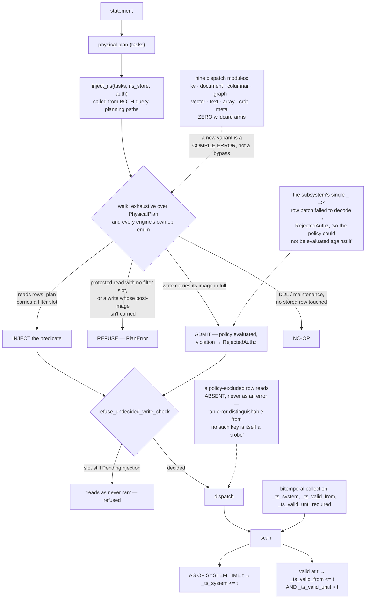

## 1. Executive Summary

NodeDB calls itself "[t]he memory and storage engine for AI agents — from the
edge to the cloud": 117,535 lines of Rust across twenty-five crates,
16,585 test functions, version 0.5.0, licensed BUSL-1.1 with a change date of
1 May 2030 and Apache-2.0 as the change licence.

The memory claim should be dealt with first, because it is the reason the
project is in this atlas and it is mostly framing. The README promises
"[s]emantic, relational, episodic, and time-series memory in one engine, one
process, with no network hops between them." The string `episodic` does not
appear anywhere in the engine's Rust. There is no memory schema, no decay, no
consolidation, no importance or salience, no provenance model, no extraction
and no agent-facing memory API. The four "kinds of memory" are the vector,
graph, time-series and document engines described in memory vocabulary.
`nodedb-mem`, the one crate whose name suggests otherwise, is arena allocation,
budgets, pressure and spill — RAM management.

What is here instead is worth more to a memory system than any of that, and it
is the reason this is a report rather than a bullet.

A memory store that serves several agents, or several people's agents, needs
one property above all others: a caller must not be able to read a row it is
not entitled to, and that must be true on *every* read path, including the ones
added next quarter. Almost every system in this corpus asserts that property in
prose and implements it as a predicate that some code path remembers to apply.

NodeDB implements it as an exhaustive match.

`control/planner/rls_injection` walks the physical plan after conversion and
before dispatch. Its module header states the design: it is "[e]xhaustive over
[`PhysicalPlan`] and every engine's own op enum (one module per engine)", and
"[e]ach variant resolves to one outcome: **Inject** (op reads rows, plan carries
a filter slot), **Refuse** (protected read with no filter slot, or a write
whose post-image isn't carried …), **Admit** (write carries its image in full,
policy evaluated, violation → `Error::RejectedAuthz`), or **No-op** (DDL/
maintenance, no stored row touched). A write is never a silent no-op."

The nine per-engine dispatch modules — kv, document, columnar, graph, vector,
text, array, crdt, meta — contain no wildcard match arm between them. In Rust
that is not a stylistic preference; it means adding an operation to any engine
fails to compile until someone decides which of the four outcomes it gets. The
single `_ =>` in the whole subsystem is on a MessagePack decode result and
returns `RejectedAuthz` because "the policy could not be evaluated against it".

And a write whose policy never ran is detectable. The check slot's default is
`PendingInjection`, which the comment says "reads as 'never ran'", and
`refuse_undecided_write_check` walks the plan again afterwards to catch it.
The absence of a decision is a distinct state from a decision to allow —
which is the difference between a fence and a habit.

## 2. Mental Model

A **collection** lives in one of nine engines and holds rows.

A **policy** is a predicate with `$auth.*` references, compiled and substituted
against the caller's identity into scan filters.

A **plan** is a tree of physical tasks. RLS injection rewrites it in place: read
ops get a filter, write ops get their row images admitted or rejected, and
anything that can be neither is refused.

A **bitemporal collection** additionally carries `_ts_system`,
`_ts_valid_from` and `_ts_valid_until` as required columns, so a read can ask
two independent questions: what was recorded as of *this* instant, and what was
true at *that* one.

## 3. Architecture

| Area | Role |
| --- | --- |
| `nodedb/src/control/planner/rls_injection/` | The walker and its nine per-engine dispatch modules |
| `nodedb/src/control/security/rls/` | Policy types, store, predicate evaluation, namespace authorization |
| `nodedb/src/control/security/` | 59,732 lines: identity, JWT/OIDC, mTLS, API keys, scope grants, redaction, rate limits, risk, SIEM, audit |
| `nodedb/src/data/executor/handlers/` | Per-engine execution, including the timeseries bitemporal scan |
| `nodedb-wal`, `-raft`, `-cluster` | Durability and replication |
| `nodedb-vector`, `-graph`, `-fts`, `-columnar`, `-spatial`, `-crdt`, `-array` | The engines |
| `nodedb-mem` | Arena, budget, pressure and spill — RAM, not memory in this atlas's sense |

## 4. Essential Implementation Paths

`rls_injection/plan.rs:1-64`. The header is the design document; read it before
the code.

Then `rls_injection/context.rs:206-232`, for what happens when a row batch
cannot be decoded — the only wildcard in the subsystem, and it rejects.

Then `tests/inproc/cases/resp_row_level_security.rs:196-210`, for
`assert_absent_not_error` and the reasoning behind it.

## 5. Memory Data Model

There isn't one, in this atlas's sense. A row is whatever the collection's
schema says.

The one exception is genuinely useful. A collection declared bitemporal gets
`_ts_system`, `_ts_valid_from` and `_ts_valid_until` as required `Int64`
columns, written through one ingest path per engine and read through one
extraction helper whose contract is explicit: `(None, None)` means "not
bitemporal", and "[c]allers MUST treat absence as 'not bitemporal', never as an
error", because heartbeats, schemaless point KV writes and replayed bulk
summaries all legitimately produce it.

For an agent memory built on this, that is the piece to use: a fact's validity
interval kept separately from when the database learned it, with both
queryable.

## 6. Retrieval Mechanics

SQL and RESP over one planner, with the vector, graph, text and spatial
operators available in the same process — which is the genuine architectural
claim, and the one the README makes accurately: "no network hops between them."

Temporal reads come in two independent forms. `SystemTimeScope` is `Current`,
`AsOf(ms)`, or `AllVersions` — the last returning "every system-time version of
each matching row, ordered ascending by system time, with the system-time column
projected into the output (audit-log semantics)". Separately, a valid-time point
becomes `_ts_valid_from <= point AND _ts_valid_until > point`. Both are
ordinary column predicates, so the columnar segment reader's block-skip applies
them against per-block minima and maxima without special-casing.

## 7. Write Mechanics

A write reaches dispatch only after its row images have been admitted. The batch
admission "[a]dmit[s] every row of a MessagePack batch; the first violation
fails the whole statement before dispatch" — all-or-nothing rather than partial
application, and the verdict is recorded in the check slot rather than inferred.

## 8. Agent Integration

Embedded in-process or as a server, with RESP and SQL surfaces and a client
crate. For an agent that runs on a device and syncs when connected, the
embedded-plus-cluster story is the reason to look at this rather than at a
hosted vector database.

What it does not give an agent is a memory API. There is no remember, recall,
forget or consolidate; there is `SET`, `GET`, `SELECT`. Anything memory-shaped
is the caller's to build, and the atlas's usual questions — what is a memory,
when does it expire, who said it, what does it supersede — are all answered by
whatever schema that caller writes.

## 9. Reliability, Safety, and Trust

The audit log is "[i]mmutable audit log for security-relevant events" with a
hash-chain helper, covering authentication success and failure, authorization
denial, privilege change, tenant lifecycle, snapshot and restore, certificate
rotation and DDL. It does not record row-level data mutations; those go to the
WAL, which is a durability mechanism rather than a queryable record of who
changed which memory and when. That is why `audit_log` is not awarded here
despite the subsystem's quality — the mark is about mutations to the store's
own contents.

Scope grants are worth noting for anyone building multi-agent memory on this.
A grant carries `expires_at`, a `grace_period_secs`, an `on_expire_action` of
`revoke_all`, `grant:<scope>` or plain expiry, and a list of conditions — with
the distinction between the two mechanisms spelled out: expiry retires "the
whole grant on a wall clock", while "a conditional grant stays granted and
simply does not apply to requests that fail its conditions."

The cluster recovery check verifies the in-memory policy store against the
catalog and can repair it, which closes the gap where a replica comes back with
policies it has forgotten.

## 10. Tests, Evals, and Benchmarks

16,585 test functions across 874 test files, plus a `fuzz/` tree with libFuzzer
targets.

The RLS tests are the ones to read. `rls_fuzz.rs` is proptest over generated
auth contexts and predicates, asserting that substitution never panics, that
`AlwaysFalse` produces a deny filter, that a deny filter matches no document
whatever the document, and — the control — that a role the caller actually
holds produces `match_all`.

`resp_row_level_security.rs` drives a real RESP listener end to end, and its
baselines are deliberate: the unpoliced `KEYS` and `SCAN` cases exist because
"a scan that cannot decode its own result cannot be said to filter it either."
That is the right instinct — a filtering test that passes because the read was
broken proves nothing.

## 11. For Your Own Build

Make coverage a compile error. If your store has several read paths and an
access predicate, dispatch over a closed enum with no wildcard, so adding a path
forces a decision. Prose in a header cannot do this; `match` can.

Give the undecided case its own state. `PendingInjection` — "reads as 'never
ran'" — is the detail that turns a missing check from an invisible allow into a
detectable refusal. A boolean `allowed` defaulting to false is not the same
thing, because false also means "checked and denied", and you cannot tell a bug
from a policy afterwards.

Make an excluded row absent, not an error. `assert_absent_not_error` states the
reason: "an error distinguishable from 'no such key' is itself a probe for keys
the caller may not read." Any memory store that serves more than one principal
has this hole, and almost none of them test for it.

Keep valid time separate from system time and let both be plain column
predicates. `_ts_valid_from <= t AND _ts_valid_until > t` needs no special
execution path and inherits block-skip for free.

And if you write a README that promises episodic memory, either implement it or
say "a database you can build episodic memory on." The second is true and still
sells.

## 12. Open Questions

Whether the memory framing is aspirational or reflects a layer not in this
repository. Nothing in `docs/ai/` was read here beyond its index entry, and the
engine carries no memory-specific code at this pin.

Whether row-level data mutations are meant to reach the audit log. The
machinery — hash-chained entries, a structured detail body per event type —
would carry them, and `AllVersions` already offers "audit-log semantics" over
system time from the data side.

What the BUSL additional-use grant permits in practice. The licence names a
change date of 1 May 2030 and Apache-2.0 after it; the production-use grant's
bounds were not analysed.

## Appendix: File Index

| Path | What to read it for |
| --- | --- |
| `nodedb/src/control/planner/rls_injection/plan.rs` | Four outcomes, exhaustively, and "a write is never a silent no-op" |
| `nodedb/src/control/planner/rls_injection/context.rs` | The one wildcard, and that it rejects |
| `nodedb/src/control/security/rls/mod.rs` | "Not bypassable by application code" |
| `nodedb/src/data/executor/handlers/timeseries/scan.rs` | Both temporal axes as ordinary predicates |
| `nodedb/tests/inproc/cases/resp_row_level_security.rs` | Absent, not an error — and why the baselines are there |
| `nodedb/tests/inproc/cases/rls_fuzz.rs` | Deny asserted over generated inputs |
| `nodedb/src/control/security/scope/grant/types.rs` | Expiry versus condition, distinguished |

## History

**2026-09-16** — [`124cc53a6bdc7bde4cbe34a38ea670c9cf90786f`](https://github.com/NodeDB-Lab/nodedb/commit/124cc53a6bdc7bde4cbe34a38ea670c9cf90786f) — first reading, at a commit dated 13 September 2026. Screened before opening, from a shallow clone; a dependency surface had changed inside the seven-day cooldown. Nothing was installed, built or run.
