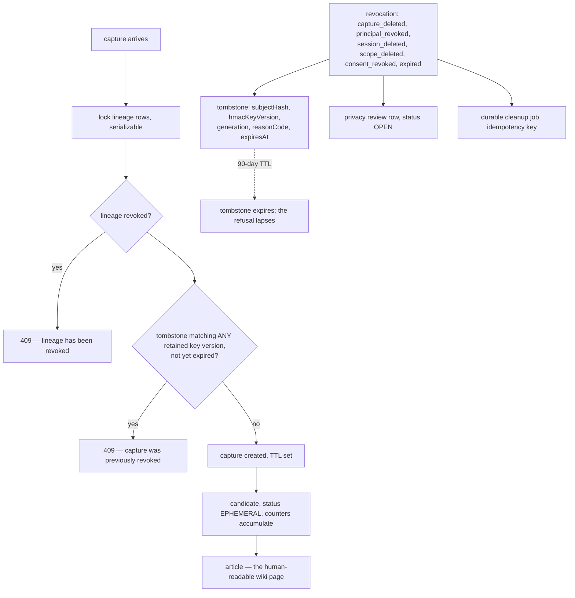

## 1. Executive Summary

Noosphere is a self-hosted knowledge and memory layer where the same data is an
agent's memory and a human's browsable Markdown wiki — topics, revisions and
scopes. Apache-2.0, roughly 68,000 lines of TypeScript on Next.js and Postgres
through Prisma, with plugins for OpenClaw, OpenCode, Kilo Code and Hermes.

**It carries a rejected-value tombstone of the *consulted* kind, and it is the
most rigorous one in this atlas.**

The mechanism, in `src/lib/memory/capture/repository.ts:244`, sits inside a
serializable transaction after the lineage rows are locked and before the
capture is created:

```ts
// A tombstone from any retained key version blocks recreation. Historical
// keys remain in the bounded keyring until their tombstones and source TTLs
// have expired.
const blocked = await tx.memoryTombstone.findFirst({
  where: {
    kind: MemoryLineageKind.CAPTURE,
    subjectHash: { in: dedupeDigests.map((entry) => entry.digest) },
    expiresAt: { gt: now },
  },
  select: { id: true },
});
if (blocked) {
  throw new MemoryCaptureError("Capture was previously revoked", 409);
}
```

Against the four properties the
[pattern page](../../patterns/rejected-value-tombstone/) requires of the strong
form: it is **value-keyed** (an HMAC digest of the capture content, not a row
id), **normalized** (`digestWithAllKeys` produces the digest set),
**consulted before the write**, and the write is **refused** — a 409, not a
silent no-op.

**And it handles a problem no other tombstone here addresses: key rotation.**
The digest is an HMAC, so rotating the key changes every digest. A naïve
implementation would let every revoked value back in on the next rotation. This
one keeps historical keys "in the bounded keyring until their tombstones and
source TTLs have expired", computes the digest under *all* retained versions, and
matches the tombstone against the whole set. `MemoryTombstone` stores
`hmacKeyVersion` alongside `subjectHash` so a reader can tell which key produced
which record.

The deliberate limit is `TOMBSTONE_TTL_MS = 90 days`. The refusal is durable for
ninety days and then the row expires, which bounds the keyring and means the
guarantee is a window rather than forever. That is a defensible choice for a
privacy-driven revocation — the source data has its own TTL — and it is a real
difference from a permanent tombstone, so a reader should not read this as
"never again".

## 2. Mental Model

Memory is promoted through three tiers, and only the last is the wiki.

A **capture** is a raw exchange with `userText` and `assistantText`, an HMAC
`dedupeKey`, `sourceSessionHash`, `sourceRunHash`, `restrictedTags` and a TTL. A
**candidate** is a distilled memory with a title, content, a recall summary,
search terms, a confidence and a status starting at `EPHEMERAL`, carrying
`occurrenceCount`, `retrievedCount`, `injectedCount`, `explicitGetCount`,
`relevanceSum` and `distinctSessionCount`. An **article** is the wiki page a
person reads.

Alongside runs a lineage system: `MemoryLineageState` per subject kind
(capture, session, scope, principal), `MemoryProvenanceEdge` linking them, and
generations. Revocation is expressed against a *lineage*, not a row, which is
why revoking a session or a scope propagates to everything derived from it.



The three parallel writes on revocation are the design: a record that blocks
re-entry, a review row for a person, and a job that does the cleanup — none of
them depending on the other two succeeding.

## 3. Architecture

Next.js with Postgres through Prisma, a migration history, and an optional
hybrid storage tier in separate schemas (`noosphere_hybrid`,
`noosphere_hybrid_b`) holding embedding state, an embedding job queue, a search
cache epoch and — notably — an `embedding_consent` table. Embedding is treated
as a consent-bearing operation rather than an implementation detail.

Four editor plugins ship as sibling packages, plus an `noosphere-injected-memory`
package and an OpenClaw install script.

An operator needs Postgres and a Node runtime; Docker Compose files are
provided.

## 4. Essential Implementation Paths

**Capture** — `src/lib/memory/capture/repository.ts`: `withSerializableRetry`
→ `lockLineages` → revocation check → tombstone check → create.

**Revocation** — `src/lib/memory/capture/lifecycle.ts`: a
`MemoryRevocationReason` from six values (`capture_deleted`,
`principal_revoked`, `session_deleted`, `scope_deleted`, `consent_revoked`,
`expired`) → upsert the privacy review → upsert the tombstone on
`(lineageStateId, generation)` → upsert a durable cleanup job with the
idempotency key `memory-cleanup:{lineage}:{generation}`.

**Digests** — `src/lib/memory/capture/crypto.ts`: `digestWithAllKeys` over a
`CaptureHmacKeyring`.

**Admin** — `/api/memory/{candidates,jobs,tombstones,privacy-reviews}`, with
`admin-list.ts` noting that "jobs, tombstones, and privacy reviews inherit scope
through lineage rather than [carrying it directly]".

## 5. Memory Data Model

`MemoryTombstone` is the row this report is about:

```
lineageStateId, kind, subjectHash, hmacKeyVersion, generation,
agentPrincipalId, reasonCode, expiresAt, createdAt
@@unique([lineageStateId, generation])
@@index([kind, subjectHash])  @@index([expiresAt])
```

Three details are worth naming. `generation` plus the unique constraint means a
lineage can be revoked more than once and each revocation is its own tombstone
rather than an overwrite. `reasonCode` records *why*, from the six-value
vocabulary. And the index on `(kind, subjectHash)` is exactly the shape the
write-path check queries, so the refusal costs an index lookup rather than a
scan.

`MemoryPrivacyReview` is the human side: `status` defaulting to `OPEN`,
`reasonCode`, `resolvedAt`, `resolvedBy`, unique on
`(articleId, lineageStateId, generation)` and indexed on `(status, createdAt)`.
Every revocation that touches an article opens one.

`MemoryCandidate` carries five separate usage counters —
`occurrenceCount`, `retrievedCount`, `injectedCount`, `explicitGetCount` and
`distinctSessionCount`. Separating *injected* from *explicitly fetched* is the
same distinction [Token Savior](../token-savior/) draws with `was_visible`, and
`distinctSessionCount` is the one that stops a single enthusiastic session
promoting a memory on its own.

## 6. Retrieval Mechanics

Postgres full-text search with an optional embedding tier, gated by
`restrictedTags` and `privateScopeTag`. `MemoryCandidate` is indexed on
`(agentPrincipalId, privateScopeTag, status, expiresAt)` — the composite that
says the read path always filters by principal *and* scope *and* status *and*
liveness.

`RestrictedScope` is a table, so a scope is a first-class row that can be
deleted — and `scope_deleted` is one of the six revocation reasons, so deleting
a scope revokes what was captured under it. Scope here is not a tag, it is an
object with a lifecycle.

The wiki side is the same data with revisions and topics, which is what makes
the human-and-agent claim true rather than aspirational: a person edits an
article, and the agent's memory is the article.

## 7. Write Mechanics

Writes are serializable transactions with an explicit retry wrapper and row
locks on the lineage, which is why the tombstone check is sound: the digest set
is computed, the lineage is locked, the tombstone is checked and the capture is
created without a window where a concurrent revocation could be missed.

The comment beside the session-digest lookup shows the same care: a
deliberately-kept query exists "so a serializable retry observes concurrent
session revocations consistently" — a read whose only purpose is to make the
transaction's conflict detection see something.

Deletion is revocation plus a cleanup job with an idempotency key, so the
cleanup can be retried without double-executing, and the tombstone stands
whether or not the job has run.

## 8. Agent Integration

Four plugin packages (OpenClaw, OpenCode, Kilo Code, Hermes), an injected-memory
package, an install script, and the web wiki. The agent and the human read the
same store through different surfaces, which is the product.

## 9. Reliability, Safety, and Trust

**Tombstone — awarded, consulted kind.** Value-keyed on an HMAC digest,
normalized across the keyring, read inside the write transaction, and the write
refused with a 409. The key-rotation handling is the part that distinguishes it
from the other five consulted implementations in this atlas, none of which
computes its value key under a rotating secret.

The honest qualification is the TTL. At ninety days the tombstone expires and
the refusal lapses. The project's reasoning is visible in the comment —
historical keys are retained "until their tombstones and source TTLs have
expired", so the tombstone lifetime bounds the keyring size. That is a real
engineering trade and it means this tombstone answers "not again for ninety
days", not "never again".

**Scope — awarded.** `privateScopeTag` on the principal and on every derived
row, `RestrictedScope` as a table with its own revocation reason, and a
composite index whose leading columns are principal and scope.

**Human review — awarded.** `MemoryPrivacyReview` is a row with an `OPEN`
status, a `resolvedBy` and a `resolvedAt`, opened automatically on any
revocation touching an article and exposed through an admin API.

**Audit log — awarded.** The tombstone table is itself an append-only record of
revocations with reason codes and generations, and `MemoryDurableJob` records
every cleanup attempt under an idempotency key. Between them a reader can
reconstruct what was revoked, why, and whether the cleanup ran.

**Trust state — withheld.** `MemoryCandidateStatus` starts at `EPHEMERAL` and
promotes on usage; that is a lifecycle ladder, not an epistemic vocabulary.

**Bitemporal, negative eval — no** on what was inspected, though the integration
tests around capture races come close in spirit.

## 10. Tests, Evals, and Benchmarks

**No paper.** 84 test files, including `capture-integration.test.ts` and
`capture-race-integration.test.ts` — the second of which exists because the
tombstone check and the capture creation must be correct under concurrency, and
it is the right test to have written.

**I ran nothing.** The screen flagged `.github/copilot-instructions.md` as an
auto-run surface and ten dependency manifests inside the seven-day cooldown.

No retrieval benchmark is committed and none is claimed. For a system whose
distinguishing work is revocation correctness rather than ranking, the tests
that matter are the concurrency ones, and they exist.

## 11. For Your Own Build

### Steal

- **Check the tombstone inside the write transaction, after locking.** The
  refusal is only sound if a concurrent revocation cannot slip between the check
  and the insert.
- **If your value key is an HMAC, keep the old keys and check them all.** This
  is the failure mode nobody else in this atlas has addressed: rotate the key and
  every rejected value silently becomes acceptable again. `digestWithAllKeys`
  plus a bounded keyring is the fix.
- **Store the key version on the tombstone.** `hmacKeyVersion` beside
  `subjectHash` is what makes the keyring's retention policy auditable.
- **Refuse with a status code, not a no-op.** A 409 saying "Capture was
  previously revoked" tells the caller what happened; a silent skip does not.
- **Give revocation a reason vocabulary.** Six values covering deletion,
  principal revocation, session deletion, scope deletion, consent withdrawal and
  expiry — each of which propagates differently.
- **Write the tombstone, the review and the cleanup job as three independent
  upserts.** None depends on the others succeeding, and the idempotency key means
  the job can be retried.
- **Make scope a row, not a tag.** `RestrictedScope` can be deleted, and
  `scope_deleted` revokes what was captured under it.
- **Count distinct sessions, not just occurrences.** One enthusiastic session
  should not promote a memory.
- **Treat embedding as consent-bearing.** An `embedding_consent` table says
  sending text to an embedding provider is a decision, not a detail.
- **Keep a query whose only purpose is conflict detection.** The comment says it
  plainly, and without it a serializable retry would miss a concurrent
  revocation.

### Avoid

- **Do not read a TTL'd tombstone as permanent.** Ninety days is deliberate and
  bounded; if your requirement is "never again", this shape needs an unbounded
  tier beside it.
- **Do not assume the review queue is worked.** The rows open automatically;
  nothing found forces resolution, and `resolvedBy` can stay null indefinitely.

### Fit

This suits a small team or an individual who wants one store that is both agent
memory and a human wiki, is willing to run Postgres, and cares about revocation
being real — consent withdrawal, session deletion, scope deletion — rather than
best-effort.

Even a project with no interest in the wiki should read
`src/lib/memory/capture/repository.ts:230-260` and
`lifecycle.ts:385-420`. Fifty lines, and between them the strongest answer in
this atlas to "how do I make a deletion stick".

## 12. Open Questions

- **What happens on day ninety-one?** The tombstone expires and the same content
  can be captured again. Whether that is reachable in practice depends on the
  source TTLs, and the interaction was not traced end to end.
- **Who resolves a privacy review?** `resolvedBy` is a string; whether the admin
  API requires an authenticated person was not established.
- **Does the candidate promotion ladder consult the tombstone?** The capture
  path does; whether a candidate distilled before a revocation is cleaned up by
  the job or blocked at promotion was not traced.
- **How large does the keyring get?** Bounded by the tombstone TTL by design;
  no figure is published.

## Appendix: File Index

**The tombstone** — `src/lib/memory/capture/repository.ts:241-254` (the check
and the 409), `src/lib/memory/capture/lifecycle.ts:398-412` (the upsert and
`TOMBSTONE_TTL_MS`), `prisma/schema.prisma:507` (`MemoryTombstone`),
`src/lib/memory/capture/crypto.ts` (`digestWithAllKeys`, `CaptureHmacKeyring`)

**Revocation** — `src/lib/memory/capture/lifecycle.ts:13-19` (the reason
vocabulary), the privacy-review and durable-job upserts `:385-425`

**Schema** — `prisma/schema.prisma` (`MemoryAgentPrincipal` `:246`,
`MemoryCapture` `:273`, `MemoryCandidate` `:323`, `MemoryRetrievalStat` `:407`,
`MemoryLineageState` `:447`, `MemoryProvenanceEdge` `:477`, `MemoryDurableJob`
`:527`, `MemoryPrivacyReview` `:560`, `RestrictedScope` `:231`)

**Concurrency** — `withSerializableRetry` and `lockLineages` in
`repository.ts`, the deliberate conflict-detection read `:256-267`

**Admin** — `src/app/api/memory/tombstones/route.ts`,
`src/lib/memory/capture/admin-list.ts`

**Hybrid storage** — `docker/hybrid-storage/feature-schema.sql`,
`phase-b-schema.sql` (`embedding_consent`, `embedding_job`,
`search_cache_epoch`)

**Integration** — `openclaw-noosphere-memory/`, `opencode-noosphere-memory/`,
`kilocode-noosphere-memory/`, `hermes-noosphere-memory/`,
`noosphere-injected-memory/`

**Tests** — `src/__tests__/memory/capture-integration.test.ts`,
`capture-race-integration.test.ts`

## History

**2026-08-09** — [`8bb93ee67d46e661f47ab16a23d03c84a0bb08de`](https://github.com/sweetsophia/noosphere/commit/8bb93ee67d46e661f47ab16a23d03c84a0bb08de) — first reading. Screened before reading: one auto-run surface (`.github/copilot-instructions.md`), no build-time execution, ten dependency manifests inside the seven-day cooldown. The tree was read, never installed, and no test was run.
