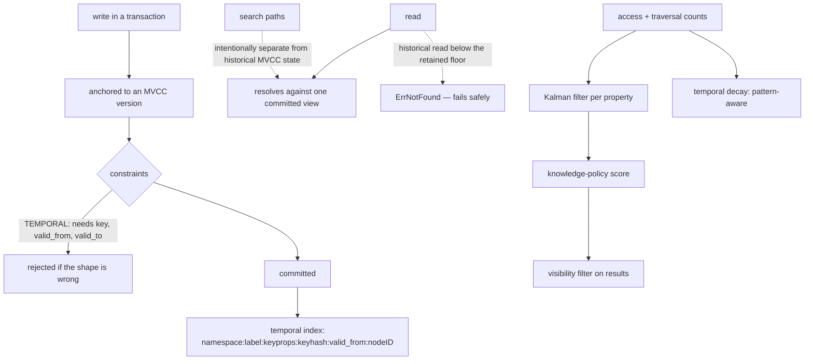

## 1. Executive Summary

NornicDB is a Neo4j-compatible graph database with vector search and MVCC
historical reads, written in Go — roughly 780,000 lines including tests, MIT by
the README badge and `LICENSE.md`. It is a database first and an agent-memory
product second, exposing Bolt, Cypher, gRPC, GraphQL, a Qdrant-compatible API
and MCP.

It earns a place here for two mechanisms that sit below where most memory
systems operate.

**Temporal validity is a declarable constraint.** Alongside the usual unique and
required-property constraints, `ConstraintTemporal` exists, and its validator
enforces its shape: "TEMPORAL constraint requires 3 properties (key, valid_from,
valid_to)". The storage layer carries a matching index prefix —
`temporal:namespace:label:keyprops:keyhash:valid_from:nodeID`.

Every other bi-temporal system in this atlas implements validity as a
*convention*: two columns that the write path fills and the read path is
expected to filter, with nothing preventing a query from forgetting. Several
reports here exist because someone did forget — the columns are written and no
read consults them. NornicDB lets you declare it, so the database rejects a node
that claims a temporal label without the three properties.

**Confidence is Kalman-filtered per property.**
`knowledgepolicy/kalman_accumulator.go` runs a Kalman filter over each property's
measurement stream, and `kalman_anti_sycophancy_test.go` names the failure it
exists to prevent. The test feeds fifty measurements of 0.6, asserts the filtered
value has settled near 0.6, then feeds a single 0.99 and asserts the result stays
below 0.8 — "hallucinated spike should be dampened" — then feeds five more 0.6s
and asserts recovery to within 0.15.

That is a direct answer to a failure this atlas has described repeatedly and seen
addressed almost nowhere: an agent that agrees enthusiastically with itself
ratchets a confidence score upward, and nothing distinguishes fifty independent
confirmations from one loud one. A filter with a high measurement-noise term
makes a single spike cheap and a sustained shift expensive.

## 2. Mental Model

The unit is a graph node or edge with properties and an optional vector.
"Memory" behaviour is layered on top by three packages:

- **`knowledgepolicy`** accumulates access and traversal counts per entity,
  flushes them asynchronously, and compiles a scoring filter that decides what a
  query can see;
- **`temporal`** turns access *patterns* into decay behaviour — the package
  header states the intent: "Frequently accessed nodes decay SLOWER… Rarely
  accessed nodes decay FASTER… Nodes with daily patterns maintain longer (routine
  knowledge)… Burst-accessed nodes get temporary boost (current focus)";
- **`lifecycle`** and **`retention`** handle the terminal states.

Underneath, MVCC gives every transaction a consistent snapshot and preserves
older versions down to a retained floor.

The two dotted edges are both stated in the README as deliberate: an
out-of-retention historical read "fails safely with `ErrNotFound`", and "current
search paths are intentionally separate from historical MVCC state".

## 3. Architecture

Badger as the storage engine with byte-prefixed key spaces per index type, MVCC
snapshot isolation at the storage layer, an HNSW vector index with tombstoned
deletes, and multi-architecture builds for CPU, CUDA, Metal and Vulkan.

Forty-plus packages under `pkg/`, including `audit`, `compliance`, `encryption`,
`kms`, `security`, `auth`, `heimdall`, `replication`, `retention`, `multidb`,
`observability` and `eval` — the operational surface of a database rather than a
memory library.

The HNSW implementation documents its own trade in the file header: "`Remove()`
tombstones a vector via a dense `deleted []bool` flag", "Neighbor lists are not
eagerly rewired (tombstones keep deletes cheap)", with `TombstoneRatio()`
exposed and a note that rebuilding "avoids tombstone growth from hot upsert
workloads". Those are index tombstones — a different mechanism from a
rejected-value record, and this report does not count them toward the mark.

## 4. Essential Implementation Paths

**Constraint validation** —
`pkg/storage/badger_constraint_validation.go:164-200` for nodes and `:717` for
edges, both requiring the three temporal properties.

**Temporal index** — `pkg/storage/badger.go:36`, the prefix layout.

**Access accounting** — `pkg/knowledgepolicy/access_accumulator.go` (atomic
per-entity deltas), `access_flusher.go` (asynchronous flush with a
supernode-suppression path and metrics).

**Scoring and visibility** — `pkg/knowledgepolicy/scorer.go`,
`scoring_filter.go`, `compiled_binding.go`, `resolver.go`.

**Kalman** — `pkg/knowledgepolicy/kalman_accumulator.go`
(`ProcessKalmanMutation`, "inlined from `pkg/filter/kalman.go` for
zero-allocation hot path"), with `Q` scaled by 0.001 and `R` taken from config.

**Audit** — `pkg/audit/audit.go`.

## 5. Memory Data Model

The property graph is the model, so the memory-specific state lives in access
metadata rather than on the node: `AccessMetaEntry` carries `accessCount`,
`traversalCount`, `lastAccessedAt`, `lastTraversedAt` and a
`KalmanFilters map[string]*KalmanPropertyState` — one filter per property being
smoothed.

Keeping the filter state keyed by property name is the detail that makes the
anti-sycophancy mechanism usable: `confidenceScore` is filtered independently of
anything else, and a system can smooth exactly the properties an agent is
allowed to move.

Namespace is a component of the storage key prefix rather than a column, so
scoping is structural in the key layout and cannot be omitted by a query that
forgets a predicate — the same shape of guarantee as
[Octopoda](../octopoda-os/)'s row-level security, reached at the key level.

## 6. Retrieval Mechanics

Cypher over the graph, hybrid graph-and-vector retrieval, and a knowledge-policy
scoring filter that acts on visibility — the test names
(`scorer_property_visibility_test.go`,
`access_flusher_property_suppression_test.go`) show that scoring decides what is
returned, not only how it is ordered.

**Two clocks are reachable from Cypher, and the atlas's question is which read
path carries them.** `db.temporal.asOf` is a registered built-in procedure
(`procedure_registry_builtin.go:256`) whose signature is
`asOf(label, keyProp, keyValue, validFromProp, validToProp, asOf [, systemTime
[, systemSequence]])`. The sixth argument is a **validity** instant; the seventh
and eighth are an **MVCC commit timestamp and sequence** — the record clock. They
are independent, and the code treats them as such: with no system version the
call takes a fast path through `GetTemporalNodeAsOf` over current state, and with
one it deliberately skips that path (`ok && !hasSnapshot`) and reads
`GetNodesByLabelVisibleAt(label, version)` before applying the `[valid_from,
valid_to)` window.

A committed test demonstrates the difference rather than asserting it. It creates
a node valid from 2024-01-01 to 2024-02-01, captures its head version, **deletes
it**, then asks for the validity instant 2024-01-15 twice: without a system time
the result is empty, and with the captured commit timestamp and sequence the node
comes back. The same validity instant answers differently depending on when you
ask the database to have been. That is bitemporality, exercised.

**The README's limitation is real and it is about a different arm.** "Search
remains current-state focused: current search paths are intentionally separate
from historical MVCC state." The hybrid graph-and-vector search a memory client
reaches for does not consult either clock; the Cypher procedure surface does. So
the capability is not stranded at the storage layer — it is reachable through the
system's primary query language, and absent from its similarity search. A memory
client that speaks Cypher has both clocks; one that only calls the vector
endpoint has neither.

**"Tritemporal facts" is the two clocks and a property.** The README claims
tritemporal facts three times (`README.md:78`, `:223`, `:232`); the canonical
graph ledger guide is where the third clock would come from, a `FactVersion` that
carries `asserted_at` and `asserted_by` beside `valid_from` and `valid_to`. The
engine gives that property no meaning. The temporal procedures take one interval
— two property names the caller chooses — and the MVCC selectors, so a call has
two axes whichever properties it names, and nothing selects among versions by
assertion time. Outside the docs and the tests, the only file that writes
`asserted_at` is `neural/scripts/generate_nornicdb_cypher_dataset.py`, a generator
of example Cypher. The guide's own examples set `valid_from` and `asserted_at` to
`datetime()` in the same committing statement, so as written all three read one
instant. An assertion time here is a property any graph could hold, reachable
with `WHERE` and nothing more; the mark is `bitemporal`.

MVCC retention is handled with an explicit safety posture: pruning "preserves the
current head and a retained floor per logical key; requests below that retained
floor fail safely with `ErrNotFound`". A historical read that has aged out
returns a clean not-found rather than a stale or partial answer.

## 7. Write Mechanics

Transactional, anchored to an MVCC version, with constraint validation before
commit. Deletes are versioned rather than destructive at the storage layer, and
the vector index tombstones rather than rewires.

There is no rejected-value record and no supersession semantics above the version
chain: a corrected fact is a new version of a node, and re-asserting a previously
deleted value succeeds. What the database provides instead is the ability to
*ask what was true before*, which is the other half of correction and the half
most memory systems lack.

## 8. Agent Integration

Bolt and Cypher for anything that speaks Neo4j, a Qdrant-compatible gRPC
endpoint for anything that speaks Qdrant, GraphQL, native gRPC, and MCP. A
memory layer built on this does not have to choose between a graph client and a
vector client.

The `eval`, `inference`, `localllm`, `embed` and `linkpredict` packages mean
embedding and link prediction can run inside the database rather than in the
application, which is the design decision that makes the access-pattern decay
possible at all — the database sees every access.

## 9. Reliability, Safety, and Trust

**Audit log — awarded.** `pkg/audit` declares itself as implementing "immutable
audit trails required by major regulatory frameworks" and names them with
article numbers — GDPR Art.30 and Art.15, HIPAA §164.312(b) and
§164.308(a)(1)(ii)(D), FISMA AU-2 and AU-3, SOC2 CC7.2, SOX §404 — with
append-only entries, structured JSON, real-time alerting and a seven-year default
retention. Citing the specific clause a control answers, rather than a framework
name, is what makes a compliance claim checkable.

**What that trail actually covers is narrower than the clause list implies.**
`Logger.Log` has two live producers: the retention manager, which calls
`LogDataAccess("system", "retention-manager", "node", recordID, action, …)` for
every record it acts on (`pkg/server/server.go:1839`), and the MCP auth
middleware, gated on `config.AuditEnabled` (`pkg/mcp/auth.go:688-724`). The call
sites that would log Bolt query execution and authentication are present as
commented-out code — `// e.audit.LogDataAccess(user, user, "query", query,
"EXECUTE", true, "")` in `pkg/bolt/server.go:732`, `// auditLogger.Log(audit.Event{`
in `pkg/auth/auth.go:455`. The mark is for the mechanism and the retention trail
it carries; a reader planning on GDPR Art.15 coverage of query access should
grep those two files first.

**Scope — awarded**, and the tier is the read path rather than the layout. The
namespace is a key prefix (`prefixNodeID`: `"123"` becomes `"tenant_a:123"`), and
`NamespacedEngine`'s read methods do not rely on that alone — `GetNodesByLabel`
asks the inner engine for every node with the label and then keeps only those
whose id carries the prefix, with twenty-seven such filters across the file. One
store, filtered on the way out, which is a predicate and not a partition.
Multi-database separation sits above it.

**Bitemporal — awarded**, on the Cypher temporal procedures. `db.temporal.asOf`
accepts a validity instant and an MVCC commit version as separate arguments and
honours both, and `TestTemporalAsOf_WithSnapshotVersion` proves the axes are
independent by deleting the node and getting it back at the same validity instant
under an older commit version. The mark names that read path and not the other
one: the hybrid and vector search arm is current-state by design and consults
neither clock, which is the limitation section 6 records.

**Trust state — no.** `confidenceScore` is a filtered float. The Kalman work is a
trust *model* of unusual quality with no trust *state* attached to a node.

**Tombstone — no.** The HNSW `deleted []bool` flags are index bookkeeping.

**Human review, negative eval — no** on what was inspected.

**One caution about the surface.** Forty-plus packages including encryption,
KMS, replication, GPU kernels and SIMD, with compliance and audit among them,
is a large amount of security-relevant machinery for any single reviewer to
assess. This report checked the memory-relevant packages and did not audit the
security ones; a deployment decision should not treat this section as coverage of
them.

## 10. Tests, Evals, and Benchmarks

**No paper.** The test discipline is the evidence: `pkg/knowledgepolicy` alone
carries benchmark tests, property tests, scenario tests, integration tests and a
legacy-fallback test beside almost every implementation file, and the
anti-sycophancy test is written as a behavioural specification with three
assertions covering settle, spike and recovery.

`pkg/eval` exists in the tree. No committed benchmark result or scorecard was
found, and the README makes no retrieval-quality claim — it claims
Neo4j-compatibility, hybrid retrieval and MVCC, which are architectural claims a
reader can check by reading rather than by running.

**I ran nothing.** The screen flagged `.githooks/` as an auto-run surface, two
`Makefile`s with build-time execution, and five dependency manifests inside the
seven-day cooldown including `go.mod` and `go.sum`. A tree with active git hooks
is one to read only.

## 11. For Your Own Build

### Steal

- **Make temporal validity a constraint, not a convention.** `TEMPORAL (key,
  valid_from, valid_to)` validated at write time means a node cannot claim a
  temporal label without the fields, and a reader cannot forget them. Several
  reports in this atlas exist because a validity pair was written and never
  queried; a declared constraint is the structural fix.
- **Put the namespace in the key prefix.** Scoping that lives in the key layout
  cannot be omitted by a query that forgets a predicate.
- **Filter a confidence signal before you trust it.** A Kalman filter with a
  large measurement-noise term makes one enthusiastic 0.99 cost almost nothing
  and a sustained shift cost what it should. The test is the specification: settle,
  spike, recover.
- **Name the failure in the test file.** `kalman_anti_sycophancy_test.go` tells a
  reader in the filename what the mechanism is defending against.
- **Keep filter state per property.** One filter per property name means you can
  smooth exactly the values an agent is allowed to move and leave the rest alone.
- **Fail a stale historical read, don't approximate it.** Below the retained
  floor, `ErrNotFound` — a clean refusal beats a plausible answer from the wrong
  version.
- **Cite the clause, not the framework.** "HIPAA §164.312(b)" is checkable;
  "HIPAA compliant" is not.
- **Derive decay from access pattern, not just recency.** Daily-pattern nodes
  persisting and burst-accessed nodes getting a temporary boost is a better model
  of what an agent needs than a single half-life.

### Avoid

- **Do not build the temporal machinery and route search around it.** The
  constraint, the index and MVCC are all present, and "search remains
  current-state focused" means a memory client gets none of it.
- **Do not read index tombstones as memory tombstones.** The HNSW `deleted`
  flags are a delete-cost optimisation with a `TombstoneRatio()` to watch, not a
  record of a rejected value.
- **Do not assume a memory story from a database feature list.** Everything here
  that behaves like memory — decay, access scoring, visibility — lives in
  `knowledgepolicy` and `temporal`, and both are layers a client has to opt into.

### Fit

This suits a team that wants one engine for graph, vector and history and is
willing to run a database — particularly one already speaking Bolt or Qdrant that
would rather not add a second system. The MVCC historical reads are a genuine
capability almost no memory store has.

It is not a memory product. Nothing here decides what to remember, extracts a
fact, resolves a contradiction or forgets on purpose beyond decay. Those are the
application's job. What NornicDB offers is a substrate where validity is
enforceable and history is queryable — and a reader building the layer above
should start from `pkg/knowledgepolicy` and the temporal constraint, and check
whether the search-path separation blocks what they need.

## 12. Open Questions

- **Will search ever meet MVCC?** The separation is stated as intentional; what
  it would take to answer "what did the graph say about X last March" through the
  search path rather than a point read is the question a memory client cares
  about most.
- **What sets `Q` and `R` in practice?** The anti-sycophancy behaviour is
  entirely a function of the noise terms; the test pins `Q=0.05, R=50.0` in
  manual mode, and what an automatic mode chooses was not traced.
- **What consumes the knowledge-policy score?** The property-visibility tests
  show it gates results; whether a client can inspect why something was filtered
  was not established.
- **Is the temporal constraint used by anything shipped?** It is validated and
  indexed; no built-in query path that exploits it was found.

## Appendix: File Index

**Temporal constraint and index** —
`pkg/storage/badger_constraint_validation.go:164-200` (node validation), `:717`
(edge validation), `pkg/storage/badger.go:36` (`prefixTemporalIndex`),
`pkg/storage/badger_edge_constraint_validation_test.go:163`,
`pkg/storage/constraint_validation.go`

**The two clocks** — `pkg/cypher/call_temporal.go`
(`callDbTemporalAsOf` `:93-192`, the fast-path skip `:134`,
`coerceOptionalMVCCVersion` `:269-286`, `temporalNodesByLabel` `:316-324`),
`pkg/cypher/procedure_registry_builtin.go:256` (registration),
`pkg/cypher/call.go:3952` (dispatch),
`pkg/storage/badger_mvcc.go:1450` (`GetNodesByLabelVisibleAt`),
`pkg/storage/badger_temporal_index.go:367`
(`GetTemporalNodeAsOfInNamespace`),
`pkg/cypher/temporal_procedures_test.go:120-161`

**Recorded searches.** Run from a checkout at
`5c03eb157216c421b234202f2a12587a81bd3706`.

- **The system clock is not a decorative argument.**
  `grep -rn "GetNodesByLabelVisibleAt" --include="*.go" pkg` — implementations on
  `BadgerEngine`, `WALEngine`, `NamespacedEngine`, `AsyncEngine`, the
  size-tracking and transaction wrappers, plus a benchmark. The Cypher call
  reaches it only when a system version was supplied.
- **The search arm does not.** `grep -n -i "current search paths are
  intentionally separate" README.md` — `README.md:97`, unchanged.
- **"Tritemporal" is a README word.** `grep -rniE "tri-?temporal" .
  --exclude-dir=.git` — `README.md:78`, `:223`, `:232`, and nothing else.
- **The third clock has no engine writer or reader.** `grep -rliE "asserted_?at" .
  --exclude-dir=.git --exclude-dir=docs --exclude="*_test.go" --exclude="*.md"` —
  `neural/scripts/generate_nornicdb_cypher_dataset.py` only; the same search over
  tests alone finds seven `_test.go` files, and `pkg/cypher/call_temporal.go`
  mentions no assertion or decision time.

**Kalman / anti-sycophancy** — `pkg/knowledgepolicy/kalman_accumulator.go`
(`ProcessKalmanMutation`), `kalman_anti_sycophancy_test.go`,
`kalman_multiagent_test.go`, `pkg/filter/kalman.go`

**Access and scoring** — `pkg/knowledgepolicy/access_accumulator.go`,
`access_flusher.go`, `access_meta.go`, `scorer.go`, `scoring_filter.go`,
`compiled_binding.go`, `resolver.go`, `inverse_decay_scenario_test.go`

**Decay** — `pkg/temporal/decay_integration.go` (the pattern-to-decay mapping
`:1-13`), `pattern_detector.go`, `relationship_evolution.go`

**Audit and compliance** — `pkg/audit/audit.go` (the framework clause list
`:3-19`), `pkg/compliance/`, `pkg/retention/`, `pkg/lifecycle/`

**Vector index** — `pkg/search/hnsw_index.go` (the tombstone trade `:6-7`,
`TombstoneRatio` `:619`), `pkg/qdrantgrpc/vector_index_cache.go`

**Interfaces** — `pkg/bolt/`, `pkg/cypher/`, `pkg/graphql/`, `pkg/nornicgrpc/`,
`pkg/qdrantgrpc/`, `pkg/mcp/`

**MVCC** — `docs/user-guides/transactions.md`,
`docs/user-guides/historical-reads-mvcc-retention.md`,
`docs/user-guides/canonical-graph-ledger.md`

## History

**2026-09-11** — [`5c03eb157216c421b234202f2a12587a81bd3706`](https://github.com/orneryd/NornicDB/commit/5c03eb157216c421b234202f2a12587a81bd3706) — re-read. Screened before reading: a committed `.githooks/pre-commit` (harmless unless `core.hooksPath` points at it), an `AGENTS.md` addressed to a reading agent, five dependency manifests inside the cooldown, four floating ranges, two build-time execution hooks. The tree was read, never built, and nothing was run. 785 files and 73,886 insertions past the previous pin, most of it a knowledge-policy admin UI and a localization catalogue for storage-validation messages. **`bitemporal` awarded**, and it is a correction rather than drift: `systemSequence` was already in `call_temporal.go` at the previous pin. `CALL db.temporal.asOf` takes a validity instant and, optionally, an MVCC commit timestamp and sequence, as separate arguments; supplying the system version makes the call skip its current-state fast path and read `GetNodesByLabelVisibleAt(label, version)` before filtering the validity window. `TestTemporalAsOf_WithSnapshotVersion` creates a node valid 2024-01-01 to 2024-02-01, records its head version, deletes it, and asserts the validity instant 2024-01-15 returns nothing without a system time and returns the node with one. The previous withholding rested on the README's "search remains current-state focused", which is true of the hybrid and vector arm and not of the Cypher procedure surface — the mark names the read path that carries the predicate, as the scope marks in this corpus do. `audit_log` and `scope_enforced` unchanged. The README's "tritemporal facts" was checked at the same pin: the engine's temporal procedures take one caller-named interval and an MVCC version, and the guide's third clock, `asserted_at`, is a property no engine code writes or reads, so the mark stays `bitemporal`.

**2026-08-09** — [`a5f623399830d76e3e22e56264548c613ba897aa`](https://github.com/orneryd/NornicDB/commit/a5f623399830d76e3e22e56264548c613ba897aa) — first reading. Screened before reading: one auto-run surface (`.githooks/`), build-time execution in two `Makefile`s, and five dependency manifests inside the seven-day cooldown including `go.mod` and `go.sum`. The tree was read, never built, and no test was run. The licence is MIT per the README badge and `LICENSE.md`; there is no plain `LICENSE` file.
