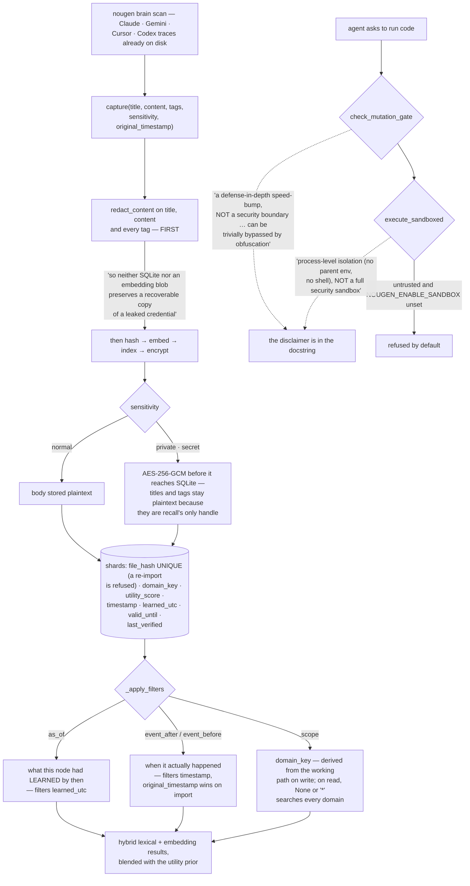

## 1. Executive Summary

NouGenShards is "[p]ersistent local memory for AI assistants — so your best
fixes, decisions, and context don't disappear between tools." Python, version
1.3.1, 97,044 lines with 1,491 test functions across 182 test files, a CLI, an
MCP server and a Docker image, built by Who Visions; the name is Haitian Creole,
"Nou Gen" meaning "we have".

Its central act is unusual in this corpus: `nougen brain scan` walks your machine
for the traces other AI tools left behind — Claude, Gemini, Cursor, Codex — and
imports them into local SQLite. Most systems here start empty and accumulate;
this one starts by harvesting what already exists.

The licence is source-available and not open source, stated plainly in the
README: commercial use requires a subscription or written permission,
redistribution for a fee and competing hosted services are prohibited, and
"[v]iew the source code for inspection and learning purposes" is expressly
granted.

**Both of its guards say what they are not.** The command gate:

> "This is a defense-in-depth speed-bump, NOT a security boundary. It is a
> best-effort denylist meant to catch obvious destructive commands and slow down
> accidents; it can be trivially bypassed by obfuscation (encoding, indirection,
> aliases, etc.) and must never be relied upon as the sole protection against
> malicious input."

And the sandbox:

> "this is process-level isolation (no parent env, no shell), NOT a full security
> sandbox. Untrusted callers (MCP tools, `nougen ctx execute`) are refused unless
> the operator opts in with NOUGEN_ENABLE_SANDBOX=1."

This atlas has reported regex denylists presented as guarantees more than once.
This is the first whose author writes the argument against relying on it, in the
docstring, above the code. The gate still normalises whitespace and case before
matching so `rm   -rf` and `RM -RF` are caught — it does the job it claims, and
claims only that job.

**Redaction runs before the embedding, which is the ordering that matters.**
Capture redacts credential-shaped text from the title, content and every tag
first, and the comment says why:

> "A shard is a durable publication surface. Redact credential-shaped text before
> hashing, embedding, indexing, or encryption so neither SQLite nor an embedding
> blob preserves a recoverable copy of a leaked credential."

An embedding computed over a secret is a lossy but recoverable copy of it.
Redacting after embedding — the common ordering, because redaction is usually
bolted on later — leaves that copy in the vector column.

**Encryption states its own edge.** A shard's `sensitivity` is `normal`,
`private` or `secret`; private and secret bodies are AES-256-GCM encrypted by a
vault before they reach SQLite, "so personal-scope material (finances, health,
identity documents) is not readable from the DB file". And immediately: "[t]itles
and tags stay plaintext: they are the only handle recall has on an encrypted
shard, so keep identifying detail out of them." A system that encrypts a body,
names what it cannot encrypt, and tells the user what that implies for their
titles.

The mark is for the two clocks, declared in the migration that added the second
one:

> "Bi-temporal (memmesh move, schema v4): `timestamp` is EVENT time (when it
> happened; original_timestamp wins), learned_utc is when THIS node stored it.
> retrieve(as_of=) filters on learned_utc; legacy rows are NULL and fall back to
> timestamp, their best available estimate."

`_apply_filters` takes `as_of`, `event_after` and `event_before` as independent
parameters, so "what had I learned by March" and "what happened in March" are
different questions with different answers. For a product whose first action is
importing years of other tools' history, that separation is load-bearing rather
than ornamental — `original_timestamp` stamps migrated content "at its TRUE era
instead of migration time, so date-window queries and coverage histograms reflect
when the experience actually happened", falling back to now with a warning rather
than failing the write.

What is not here: `domain_key` is derived from the working path on write but is
an ordinary argument on read, where `None` or `*` searches every domain, so it
organises rather than isolates. Nothing is epistemic — `sensitivity` changes how
a body is stored, not whether it is returned; `utility_score` is a weight; no
status withholds a shard. There is no mutation record.

And the premise deserves a deliberate decision rather than a default: a single
local database that has ingested every AI tool's history off one machine is a
concentration of material that was previously scattered, which is the product's
value and also its risk profile.

## 2. Mental Model

A **shard** is one unit of experience, hashed so the same trace cannot be
imported twice.

**When it happened** and **when I learned it** are different columns and
different filters.

A **guard** here is a speed bump, and says so.

**Redaction** comes first, because everything downstream keeps a copy.

## 3. Architecture

| Area | Role |
| --- | --- |
| `src/nougen_shards/core.py` | The schema, capture, retrieval and the filters |
| `src/nougen_shards/gatekeeper.py` | The command denylist, and its disclaimer |
| `src/nougen_shards/nougen_sandbox.py` | Opt-in execution, and its disclaimer |
| `src/nougen_shards/private_vault.py` | AES-256-GCM for private and secret bodies |
| `src/nougen_shards/brain_scan/` | Harvesting other tools' traces, and redaction |
| `src/nougen_shards/mcp.py`, `cli.py` | The agent and human surfaces |
| `src/nougen_shards/handoff.py`, `nougenmsg.py` | Federation between nodes |

## 4. Essential Implementation Paths

`src/nougen_shards/core.py:491-497` — two clocks, declared where the second was
added.

`src/nougen_shards/core.py:1018-1046` — the sensitivity contract and the
redaction ordering.

`src/nougen_shards/gatekeeper.py:1-26` — a denylist arguing against its own
sufficiency.

`src/nougen_shards/nougen_sandbox.py:9-33` — execution off by default, with the
reason.

## 5. Memory Data Model

A shard carries its timestamps, an event type, a title, content, tags, a utility
prior seeded by the publisher, an access count, a `file_hash` with a UNIQUE
constraint, a `domain_key` defaulting to `global`, a sensitivity, an embedding,
and the verification pair. The uniqueness constraint on the hash is the dedup
mechanism: re-running a scan cannot double-import a trace, enforced by the
database rather than by a check the caller might skip.

## 6. Retrieval Mechanics

Hybrid lexical and embedding retrieval blended with the utility prior, indexed on
`(domain_key, utility_score DESC)`, with the three filters above applied to the
fused candidates. `valid_until` and `last_verified` support a freshness question
the retrieval can ask, set together by `mark_verified`.

## 7. Write Mechanics

Redact, hash, embed, index, encrypt — in that order, stated as an ordering rather
than left to the call sequence. An unparseable original timestamp logs a warning
and falls back to now, which "never crashes a write": the right priority for an
import that might be processing years of someone else's log formats.

## 8. Agent Integration

A CLI, an MCP server with a compatibility shim for both the pre- and post-rename
`mcp` package spellings, and hooks. Screening flags two auto-run surfaces and two
build-time execution points, which is what a Docker-packaged tool with agent
hooks looks like.

## 9. Reliability, Safety, and Trust

Covered above: redaction first, encryption by sensitivity with its limit stated,
and two guards that describe themselves accurately. The absence is epistemic
rather than operational — nothing distinguishes a fact a person stated from a
line scraped out of a chat log, and every imported trace becomes a shard of the
same kind.

## 10. Tests, Evals, and Benchmarks

1,491 test functions across 182 files, including suites for the gatekeeper, the
sandbox, federation tiering and the message envelope. Nothing was installed,
built or run for this reading.

## 11. For Your Own Build

Redact before you embed. The order is the whole protection: an embedding of a
secret is a recoverable copy, and redaction bolted on afterwards leaves it.

Say what your guard is not. A denylist that documents its own bypassability is
more useful than one presented as a boundary, because the next person to build on
it will not mistake it for one.

Keep event time when you import. A migration that stamps everything with the
migration date destroys the only axis that made the imported history worth
importing.

Put the dedup in the schema. A `UNIQUE` on the content hash cannot be skipped by
a caller who forgot to check.

And if a title is the only handle on an encrypted body, tell the user that before
they write the title.

## 12. Open Questions

Whether the event axis survives every importer. `original_timestamp` is a
parameter, and which of the scanners supply it was not traced.

What federation sends. Nodes exchange messages through an envelope and a relay;
whether encrypted bodies or their plaintext titles cross was not established.

Whether anything distinguishes an imported trace from an authored shard. Both
become rows of the same kind, and no provenance column was found.

## Appendix: File Index

| Path | What to read it for |
| --- | --- |
| `src/nougen_shards/core.py:491-497` | Two clocks, and which one `as_of` filters |
| `src/nougen_shards/core.py:1018-1046` | Sensitivity, and redaction before everything |
| `src/nougen_shards/gatekeeper.py:1-26` | A guard that argues against relying on it |
| `src/nougen_shards/nougen_sandbox.py:9-33` | Execution refused unless opted in |

## History

**2026-09-16** — [`73078c05b5a36ad04a2d63b9dd6d42fa7f912bd3`](https://github.com/Who-Visions/NouGenShards/commit/73078c05b5a36ad04a2d63b9dd6d42fa7f912bd3) — first reading, at a commit dated 16 September 2026. Screened before opening, from a shallow clone: twenty-two files scanned, two auto-run surfaces, two build-time execution points, four unpinned surfaces and nine dependency files inside the seven-day cooldown. Nothing was installed, built or run.
