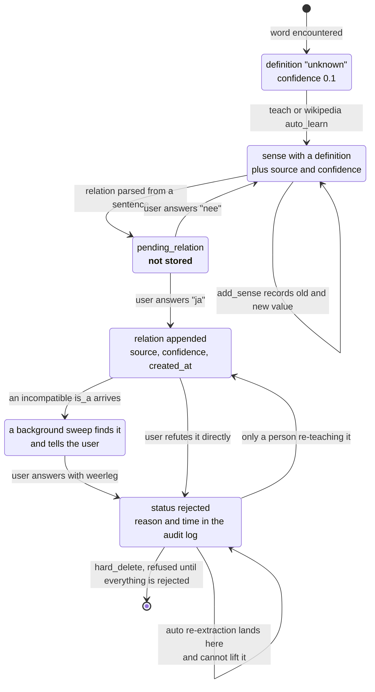

## 1. Executive Summary

Nova is a personal companion built by one author for one user, running 24/7 as a
local Windows background process. It is roughly 25,000 lines of Python across
about 40 modules, and its defining constraint is stated in the README: **no LLM,
no cloud**. Nothing here calls a model. Every mechanism in this report is
symbolic — string matching, a hand-built concept graph, and rules.

That constraint is what makes it worth reading. Most systems in this atlas reach
for an embedding when they need similarity and a model when they need judgement,
which means their correction machinery competes with a component that can always
produce something plausible. Nova has no such component, so every epistemic
decision is somewhere in the code, in the open.

**Its knowledge memory is a concept graph with provenance on every edge.** A
concept is a word; a word has senses carrying `sense_id`s; a sense has relations
(`is_a`, `part_of`, `causes`, `synonym`, `antonym`) and each relation carries a
`source`, a `confidence` and a `created_at`. The committed `concepts.json` holds
242 concepts with real, differing provenance — `"source": "wikipedia"` on edges
the auto-learner derived, `"source": "user"` on edges Kevin supplied.

**Writes to it pass a spoken confirmation gate.** Before a relation is stored,
Nova asks *"Mag ik onthouden dat 'X' is een soort van 'Y'?"* — may I remember
that X is a kind of Y — and writes only on "ja". If the subject has more than one
known sense it asks which one first, by number. The gate is not a review UI; it
is a turn in the conversation, and it is the only thing standing between a parsed
sentence and a stored belief.

**Every record carries its own audit log.** `ensure_concept` seeds an `audit_log`
array, and `_append_audit`, `_audit_sense` and `_audit_relation` append to it on
creation, on sense upgrade, on confidence change and on every relation added,
with `old_value` and `new_value` where a value changed. The same entries are
mirrored to `logs/concepts.jsonl`. Nova can answer "when did I come to believe
this, and who told me" for anything in the graph.

**The refusal is the mechanism worth reading, and it holds by an omission.**
`weerleg` — refute — sets `status = "rejected"` on a sense, a concept's every
sense, or a relation, with the reason and timestamp written into that record's
own audit log. The reasoning layer then filters `status != "rejected"` when
choosing a sense and when offering disambiguation candidates, while `get_senses()`
deliberately keeps showing it *"transparantie"* — so a person inspecting the graph
sees what the reasoner refuses to use.

What makes it a tombstone rather than a soft delete is the deduplication loop in
`add_sense`. It matches an incoming definition against existing senses **by
definition text, without excluding rejected ones**, and the status branch below
it only promotes on `source == "user"`. So when `wikipedia_teacher` or
`auto_extract` re-derives a definition that was refuted, the write lands on the
rejected row, leaves the status where it is, and the reasoner still cannot see
it. The rejection is keyed on the value and survives its own re-assertion.

A person can lift it — re-teaching the same definition as `user` sets
`confirmed`, which is the audited human override the atlas asks for and not a
hole. Automatic sources cannot.

`hard_delete` sits behind it as a second step: it refuses while any sense is
still unrejected, so physical removal requires the refusal first.

**Licence caveat, stated because it governs what a reader may do with the rest.**
`LICENSE.txt` is headed *"Viewable, Not Reusable"* — all rights reserved,
published so others can read the project and follow how it is being built. This
report analyses mechanisms; it is not an invitation to copy code, and the ideas
below are described so they can be re-implemented rather than lifted.

## 2. Mental Model

Nova has two memories that never touch. Events are what happened; concepts are
what is true. The second one is the interesting one, and its state machine has an
entrance, a gate, and no exit.



The gate between `Pending` and `Believed` is the design's best idea: a parsed
relation is not a belief, and a person decides which it becomes. That is
[evidence before belief](../../patterns/evidence-before-belief/) arrived at
independently, in a system with no model to distrust.

The arrow that matters is the self-loop on `Rejected`. Nova is monotonic in the
direction that is safe — a person's confirmation outranks any later automatic
match, and an automatic match can never downgrade what a person confirmed — and
the refusal is the exit the graph needs, because `is_a_chained` walks inference
chains and a wrong edge left in place would be reasoned through confidently
forever.

## 3. Architecture

One process, one machine, no services. `main.py` builds an in-process `EventBus`
and loads modules from `core/`, `modules/` and `identity/`. Storage is `data/`:
`interactions.db` and `interactions.jsonl` for events, `concepts.json` for
knowledge, and a dozen smaller JSON files for the profile, learned patterns,
chess state and classifier models.

`core/` carries the infrastructure — `memory.py` (816 lines), `semantic.py`
(1,546), `intent_router.py` (2,565), `event_bus.py`, `response_engine.py`,
`module_loader.py`. `modules/` is the surface area: knowledge, learning, weather,
chess, math, activity, preferences, context. `identity/` holds personality,
emotion, expression and self-query.

### Deployment and ergonomics

`pip install -r requirements.txt` and run `main.py`. The dependencies are
ordinary — `python-chess`, a Stockfish binary for the chess module, scikit-learn
for the intent classifier. No database server, no vector store, no API key, and
no network call is required for the memory itself to work.

The cost is that it is one person's machine. There is no scope key anywhere in
`memory.py` or `semantic.py` — no user, no tenant, no project — because the
system is built for exactly one named user, and the profile module is literally
`kevin_profile.py`. That is a coherent choice rather than an oversight, and it is
also what makes the design non-transferable without a schema change.

## 4. Essential Implementation Paths

### The confirmation gate

`RelationFlow` holds one `pending_relation` at a time and drives a short
conversation. If the subject has several real senses it asks which, by number;
then the same for the object; then it asks for confirmation in words a person can
answer:

> `"Mag ik onthouden dat '{subject}' {rel_text} '{obj}'?"`

`handle_confirm` writes on `ja`/`yes`/`y`, discards on `nee`/`no`/`n`, and on
anything else re-asks rather than guessing. Senses whose definition is `"unknown"`
are excluded from the choice list, so Nova never asks a person to disambiguate
between meanings it does not actually hold.

What makes this more than a prompt is that it is the *only* path from parsed
language to a stored relation. There is no bulk import and no background
extractor writing edges unattended.

### The correction that is kept out of the ground truth

The intent classifier learns from Kevin's corrections — the "nee ik bedoelde X"
("no, I meant X") flow — and the handling of that data is the sharpest piece of
engineering in the repository. Corrections go to
`data/gecorrigeerde_voorbeelden.jsonl`, deliberately **not** into
`training_data.json`. `retrain_vanuit_bestanden` combines three sources — the
curated base set, the confirmed corrections, and Layer 0 examples that a
deterministic `detect_*()` already got right without the classifier guessing —
and the docstring is explicit about why the combination is temporary:

> "BELANGRIJK: dit schrijft GEEN van de twee aanvullende bronnen terug naar
> `training_data.json` zelf — dat bestand blijft Kevin's eigen, schone basisset.
> De combinatie gebeurt enkel TIJDELIJK, in het geheugen, vlak vóór het trainen."

The merge happens in a local copy because `retrain()` writes `self.voorbeelden`
back to disk, so extending the instance attribute would have silently persisted
corrections into the human-owned file. The hazard is named in a comment beside
the line that avoids it, and a `try/finally` restores the clean set even when
training fails.

This is a real answer to a problem most memory systems have and few separate: the
difference between what a person carefully asserted and what the system inferred
from being corrected. Here the curated set is a file a human owns, the derived
set is a different file, and the merge exists only in RAM for the duration of a
training run.

Two consequences worth stating. Words the classifier could not place go to
`data/onbekende_correcties.jsonl` as a hint list for future categories, rather
than being forced onto the nearest existing label — a refusal to guess, recorded
rather than discarded. And both files are **empty at this commit**: the machinery
is wired to a four-hourly retrain in `main.py` and documented as confirmed
end-to-end in the changelog, but the author has not committed his live
corrections, so what ships is the mechanism without the data.

### Retrieval that says what it is not

`memory.search` is `SELECT * FROM interactions WHERE data LIKE ?` over the event
JSON, newest first, with an optional `recent_weeks` cutoff. `find_similar` pulls
the newest 500 rows and scores them with `difflib.SequenceMatcher`. The docstring
draws the boundary itself:

> "Dit is PUUR symbolisch (difflib, standaard in Python) — GEEN ML, GEEN
> embeddings, GEEN betekenis-matching. 'hond' wordt dus niet gelinkt aan 'kat'
> met deze methode, enkel woorden die er letterlijk op lijken."

Purely symbolic; no ML, no embeddings, no meaning-matching — "dog" is not linked
to "cat", only to words that literally resemble it. Stating the limit next to the
method is the same discipline [memU](../memu/) applies to its retrieval, and it
matters more here, because a reader who assumed semantic recall would misread
every result the function returns.

Semantic recall does exist, but it lives in the graph rather than the index:
`is_a_chained`, `part_of_chained` and `causes_chained` walk relations with a
visited set and return the path, and `explain_is_a` renders that path as a
sentence — *"Ja, een {source} is een {target}, want: hond → dier → levend wezen."*
A memory that can show its reasoning as a chain of stored edges is rare in this
atlas, and it is a direct consequence of refusing the embedding.

### Contradiction detection, and the loop that answers it

`find_contradictions` checks a word's `is_a` parents against three hardcoded
incompatible groups — `{dier, plant, meubel, voertuig, gebouw, apparaat,
voedsel}`, `{levend, niet-levend}`, `{vloeibaar, vast, gas}` — and returns a list
with a readable reason per conflict.

`modules/knowledge/contradiction_checker.py` is its caller: a periodic sweep in
`main.py`'s background loop, on the same pattern as the weather and emergence
modules, walking the whole knowledge graph, collecting conflicts, and raising
them with the user through `layer4_response` **with a concrete `weerleg:`
proposal per conflict** so the refusal is one spoken sentence away. Its module
docstring is explicit that it adds no intelligence: *"Puur symbolisch: geen ML,
geen generatie — roept enkel bestaande, al-geteste reasoning-code aan"* — purely
symbolic, calling existing already-tested reasoning code and formatting the
result.

It also solves the problem that makes proactive reporting unbearable. A
`contradiction_state.json` remembers which conflicts have already been raised,
keyed on the word plus its sorted conflict list so the same collision produces
the same key whatever order the `is_a` relations were stored in. An unresolved
conflict is mentioned once, not every cycle.

That is [resolve, don't just detect](../../patterns/resolve-not-just-detect/)
completed end to end: detection, a bounded proactive surface, a named resolution
verb, and a state that ends in the store rather than in a conversation.

## 5. Memory Data Model

Two stores, different shapes.

**Events.** SQLite `interactions` with `timestamp`, `month`, `year`,
`event_type`, `data` (the JSON payload) and `created_at`, plus an
`interactions_old` archive table with the same columns, plus a JSONL mirror. An
`ignore_types` set keeps loop-inducing types out, including
`memory:interaction_added` — memory listens to everything, including itself.

**Concepts.** `concepts.json`, keyed by lowercased word:

```json
"hond": {
  "senses": [{
    "sense_id": "hond#1",
    "definition": "De hond is de gedomesticeerde ondersoort van de wolf.",
    "pos": "noun",
    "relations": [
      {"type": "is_a", "target": "wolf", "confidence": 0.8,
       "source": "wikipedia", "created_at": "2026-06-27T18:58:08"},
      {"type": "is_a", "target": "zoogdier", "confidence": 0.9,
       "source": "user", "created_at": "2026-07-05T00:00:00"}
    ],
    "audit_log": []
  }],
  "metadata": {"created_at": "...", "updated_at": "...", "sources": ["..."],
               "last_used_at": "...", "usage_count": 0,
               "confidence_history": []},
  "audit_log": ["..."]
}
```

Provenance sits per edge, which is the right grain — a concept assembled from a
Wikipedia definition and three user-supplied relations records which is which.
`confidence_history` and `usage_count` give decay and reinforcement somewhere to
land.

What is absent: no status field, so nothing distinguishes a candidate from a
verified belief as a *state*; no validity time separate from record time; no
rejected values; no scope key. The `"unknown"` definition sentinel comes closest
to a trust state — it is filtered out when choosing a sense to attach a relation
to, and carries `confidence: 0.1` — but it is a value in the definition field
rather than a status, and it has no rejected counterpart, so the mark is
withheld.

The whole file is `json.dump`ed on every save. At 242 concepts that is fine;
`ConceptStore.save` rewrites the entire graph for a single confidence bump, and
does so non-atomically, so an interrupted write truncates the memory.

## 6. Retrieval Mechanics

Three paths, none of them ranked by a model:

1. **Keyword** — `LIKE '%term%'` against the event JSON blob, newest first. This
   matches key names as readily as values.
2. **Fuzzy** — `SequenceMatcher` over the newest 500 events, `min_ratio=0.6`,
   top 5. Catches typos; the 500-row window means older events are unreachable
   this way regardless of relevance.
3. **Graph** — chained relation walks with cycle protection, returning the path.

The write buffer is flushed before both SQL paths so a just-written event is
searchable, and a comment notes that `_flush_buffer` is deliberately called
outside the caller's lock because it takes its own.

The absence of fusion is not the usual gap here — there is no semantic arm to
fuse with. What a reader should take is the shape:
[hybrid retrieval fusion](../../patterns/hybrid-retrieval-fusion/) assumes an
embedding arm that misses exact tokens. Nova is the other half of that trade
running alone — exact and near-exact matching only, with meaning handled by an
explicit graph rather than by proximity in a vector space.

## 7. Write Mechanics

Events arrive on the bus and land in a write buffer flushed after 50 events or 5
seconds, whichever comes first, with `append_to_disk` retrying up to three times.
Writes do not block the conversation; the lag before an event is searchable is
bounded by the flush, and because both search paths force a flush first, that lag
is not observable through them. `atexit` and signal handlers flush on shutdown.

Knowledge writes are different in kind: synchronous, one at a time, and gated on
a human answer. `add_relation` deduplicates on `(type, target)` within a sense,
appends the relation, stamps `metadata.updated_at`, writes an audit entry, and
saves the whole file.

One detail worth flagging. `add_relation` hardcodes `"confidence": 1.0` and
`"source": "user"` into the relation object it builds, regardless of caller. The
committed data contains `"source": "wikipedia"` edges, so another path — the
auto-extractor behind `_auto_extract_is_a` and `auto_learn` — writes provenance
properly. The result is a field that is meaningful for historical rows and
constant for everything arriving through the confirmation flow, which is the flow
a reader would most want provenance from.

### Operational cost

No model calls, so there is no token cost and no provider latency anywhere in the
memory path. The background loop runs maintenance every six hours: trim the RAM
cache from a daytime ceiling of 5,000 events back to 500, move events older than
90 days to `interactions_old`, gzip anything past 365 days, vacuum, rotate
backups, and run a health check. The classifier retrains every four hours.

Nothing rewrites the store's contents — archival moves rows between tables and
compression moves them to files, but no pass reconsiders or rewrites a memory.
That is why cost does not scale with corpus size, and also why the graph never
improves on its own.

## 8. Agent Integration

There is no agent framework here and no tool protocol. The integration surface is
the `EventBus`: modules publish and subscribe, `MemoryModule.on_event` records
everything not in `ignore_types`, and `intent_router.py` decides what a message
meant and which module answers.

The genuinely unusual integration is temporal. Nova runs continuously and decides
on her own initiative whether *now* is a reasonable moment to speak, using
`interruption_tracker.py` against a learned `interruption_patterns.json` of when
interruptions were previously tolerated. Memory feeds that decision rather than
only answering questions with it — a use of stored history most systems here have
no place for, and the nearest thing in this atlas to prospective memory driven by
a person's habits rather than a schedule.

## 9. Reliability, Safety, and Trust

Strengths:

- **An audit log on the record itself**, appended on create, upgrade, confidence
  change and relation add, with old and new values, mirrored to a JSONL log.
- **A confirmation gate** as the only path from parsed language to a stored
  relation, with sense disambiguation asked first.
- **Per-edge provenance and confidence** in the schema, with real, differing
  sources in the committed data.
- **Corrections quarantined from the curated training set**, the merge held in a
  local copy, restored under `try/finally` even when training fails.
- **A refusal to guess, recorded** — unplaceable correction words go to a hint
  file instead of being forced onto the nearest label.
- **Explainable inference** — chained walks that return the path, and helpers
  that render it as a sentence a person can check.
- **A real operational lifecycle** — buffered writes with retry, RAM trimming,
  archival, compression, vacuum, backup rotation, health check, shutdown flush.

Gaps:

- **A rejection only a person can make.** Every path to `rejected` runs through
  the user; nothing lets the system refuse its own bad inference, so a
  contradiction sits until someone answers the prompt.
- **The status is written and barely read.** Three call sites read it back, all
  to compute an audit diff, and two reasoning queries filter on it. Nothing
  reports on it, counts it, or surfaces the unverified backlog.
- **The whole graph is rewritten on every save**, non-atomically.
- **`tombstone` — earned, and by an omission rather than a design.** The record
  is keyed on the definition text, the reasoner filters it, and `add_sense`'s
  dedup loop finds it without exempting it, so automatic re-extraction lands on
  the refusal instead of routing around it. Nothing in the code claims this
  property and no test pins it; adding an `and s.get("status") != "rejected"` to
  that loop during a tidy-up would remove it silently.
- **`trust_state` — earned.** `unverified`, `confirmed` and `rejected` on every
  sense and relation, set from `source` at write time, with a stated
  monotonicity rule: a user confirmation may overwrite `unverified`, and a later
  automatic match may never push a confirmed sense back down.
- **No scope key**, by design, which makes the schema single-user rather than
  merely deployed that way.

### The asymmetry worth naming

Nova *can* forget — just not the things that would matter most. The preference
store implements `vergeet: <woord>`: `remove_preference` deletes a word, or with
a `bron` argument removes only the automatic or only the explicit sub-block and
leaves the word standing under the other, then publishes `preference_forgotten`.
That is a more careful forget than several dedicated memory systems in this atlas
manage, and it is source-aware in exactly the way a correction should be.

It applies to what Kevin likes, and `weerleg` applies to what Nova knows. The two
verbs differ in kind and the difference is right: `vergeet` deletes a preference
outright, and `weerleg` leaves the refuted knowledge in the file where a person
can still see it while the reasoner cannot use it. Deleting a taste is harmless;
deleting a belief loses the record that it was ever held and refuted.

## 10. Tests, Evals, and Benchmarks

`tests/` holds 21 files, and the shape is worth stating precisely: **five
assertions in total, all in one file** (`test_randgeval_fase5.py`), against
roughly 230 `print` calls across the rest. These are manual exploration scripts
whose output a person reads, not a suite that fails.

The consequence is specific rather than general. Nothing detects that
`find_contradictions` has no caller. Nothing pins the confirmation gate's
behaviour on an unparseable answer. And nothing asserts that a retrain leaves
`training_data.json` byte-identical — the invariant the most carefully reasoned
code in the repository exists to preserve, guarded today by a `try/finally` and a
comment.

No retrieval-quality benchmark, and no negative retrieval cases. The changelog
compensates in a way worth noting: it is unusually detailed, records live
end-to-end confirmations with dates, and documents bugs found while building —
including one where an over-broad search-and-replace deleted an entire method,
caught by a local harness before the file shipped. That is a real verification
practice. It is a person's practice rather than the repository's, and it does not
survive the person.

## 11. For Your Own Build

### Steal

- **Gate the write on a spoken confirmation.** "May I remember that X is a kind
  of Y?" is a better governance surface than a review queue nobody opens, and it
  costs one turn at exactly the moment the user has the context to answer.
- **Quarantine corrections from curated ground truth.** Keep the human-authored
  set in its own file, keep derived corrections in another, and merge only in
  memory for the duration of a training run — with the reason written beside the
  local copy that makes it safe.
- **Record the inputs you refused to classify** instead of forcing them onto the
  nearest existing label. The hint file is how the next category gets discovered.
- **Put the audit log on the record**, not only in a side channel, so exporting
  one concept exports its history — the placement
  [NOOA Memory](../nooa-memory/) argues for from the other direction.
- **Return the inference path, not just the answer.** Turning a graph walk into a
  sentence a person can check is what makes a symbolic store auditable in a way a
  similarity score is not.
- **Say what your retrieval does not do.** "No embeddings, no meaning-matching —
  'dog' is not linked to 'cat'" prevents every downstream misreading of a result.

### Avoid

- **Detection with no caller.** A finder nothing invokes is worse than none,
  because the repository reads as though the problem is handled. Nova wrote the
  caller afterwards; write it in the same change, and give it a state file so a
  standing conflict is raised once rather than every cycle.
- **A knowledge store with no removal path.** Additive-only is defensible for an
  event log and indefensible for beliefs, especially with inference on top: one
  wrong `is_a` is walked by every chained query forever.
- **Rewriting the whole store on every mutation, non-atomically.** A confidence
  bump should not put the entire graph at risk of truncation.

### Fit

Read this if you are building symbolic or graph memory without a model, or if you
want to see what correction looks like when there is no LLM to blame. The
confirmation gate and the training-set quarantine are both stronger than what
several model-driven systems here manage, and they are stronger *because* the
author had to decide each case explicitly rather than delegate it.

Do not read it as a component. The licence forbids reuse, the schema has no scope
key, and the store is a single JSON file rewritten whole. It is a well-kept
notebook of one person's design decisions, and its value to a reader is the
decisions — of which the strongest is that a refusal should be keyed on what was
said, not on the row that said it.

The honest summary of the whole system: Nova is careful about *how* something
becomes a belief and has no theory at all about how something stops being one.
That is the same asymmetry the atlas finds almost everywhere, arrived at from the
opposite direction — not because a model made correction hard, but because nobody
has yet written the delete.

## 12. Open Questions

- Is the dedup loop's blindness to `rejected` deliberate? It is what makes the
  refusal survive automatic re-extraction, and no comment claims it.
- What happens to the `unverified` backlog? Nothing counts it or offers it for
  confirmation, so it grows silently as Wikipedia and auto-extraction run.
- Why does `add_relation` hardcode `source: "user"` and `confidence: 1.0` when
  the schema and the committed data both carry real values?
- Does `ConceptStore.save` need to become atomic before the graph grows, or is
  242 concepts near the intended ceiling?
- Are `gecorrigeerde_voorbeelden.jsonl` and `onbekende_correcties.jsonl` empty
  because they are runtime-only, or because the flow rarely fires?
- What would `concepts.json` need for a second user, given no scope key exists?

## Appendix: File Index

- Event memory: `core/memory.py` (`MemoryModule`, `on_event`, `_flush_buffer`,
  `search`, `query`, `find_similar`, `archive_old_events`,
  `compress_ancient_events`, `run_maintenance`, `health_check`).
- Knowledge: `core/semantic.py` (`ConceptStore`, `_append_audit`,
  `SenseEngine.add_sense`, `upgrade_unknown_sense`,
  `RelationEngine.add_relation`, `ReasoningEngine.find_contradictions`,
  `is_a_chained`, `explain_is_a`, `RelationFlow.start_relation_flow`,
  `handle_confirm`).
- Corrections and learning: `modules/learning/intent_classifier.py`
  (`retrain_vanuit_bestanden`, `_laad_gecorrigeerde_voorbeelden`),
  `modules/learning/pattern_matcher.py`,
  `modules/learning/word_associations_learner.py`.
- Preferences and the one forget path: `modules/preferences/kevin_profile.py`
  (`remove_preference`).
- Routing and integration: `core/intent_router.py`, `core/event_bus.py`,
  `core/response_engine.py`, `main.py`.
- Timing: `core/interruption_tracker.py`, `modules/activity/session_watcher.py`.
- Committed state: `data/concepts.json` (242 concepts),
  `data/training_data.json`, `data/gecorrigeerde_voorbeelden.jsonl` (empty),
  `data/onbekende_correcties.jsonl` (empty).
- Licence: `LICENSE.txt` ("Viewable, Not Reusable").

## History

**2026-08-06** — [`c4c000b17487683deecb06cf810dc82c17ef0894`](https://github.com/Whooptie/NOVA_AI/commit/c4c000b17487683deecb06cf810dc82c17ef0894) — 5 commits on. Four published criticisms went stale together, all closed by the project, and the report is rewritten around what replaced them.

`weerleg` sets `status = "rejected"` on a sense, a whole concept's senses or a relation, with reason and timestamp in the record's own audit log; the reasoning query and the disambiguation candidate list both filter it out while `get_senses()` still shows it. `add_sense`'s dedup loop matches an incoming definition without exempting rejected rows, and its status branch promotes only on `source == "user"` — so `wikipedia_teacher` and `auto_extract` re-deriving a refuted definition land on the refusal and cannot lift it. `tombstone` earned, keyed on the value. `hard_delete` refuses while any sense is unrejected, so physical removal requires the refusal first.

`trust_state` earned: `unverified`, `confirmed`, `rejected` as a field on senses and relations, written from `source`, with `scripts/migrate_trust_state.py` backfilling existing rows — dry-run by default, timestamped backup before `--apply`, re-read and revalidated after writing, idempotent.

`find_contradictions` has a caller. `modules/knowledge/contradiction_checker.py` sweeps the graph on the background loop, raises each conflict with the user through `layer4_response` with a concrete `weerleg:` proposal, and keeps a `contradiction_state.json` keyed on the word plus its sorted conflict list so a standing conflict is raised once rather than every cycle.

Unchanged: the licence is still *"Viewable, Not Reusable"*, all rights reserved; 21 test files still carry five assertions between them, so none of the above is pinned by a test; and `ConceptStore.save` still rewrites the whole graph non-atomically.

Nothing was run — `requirements.txt` changed three days before this reading, inside the cooldown.

**2026-08-04** — [`4a7d89b915b8bd785606c347b6ae5733030edc1f`](https://github.com/Whooptie/NOVA_AI/commit/4a7d89b915b8bd785606c347b6ae5733030edc1f) — first reading.
