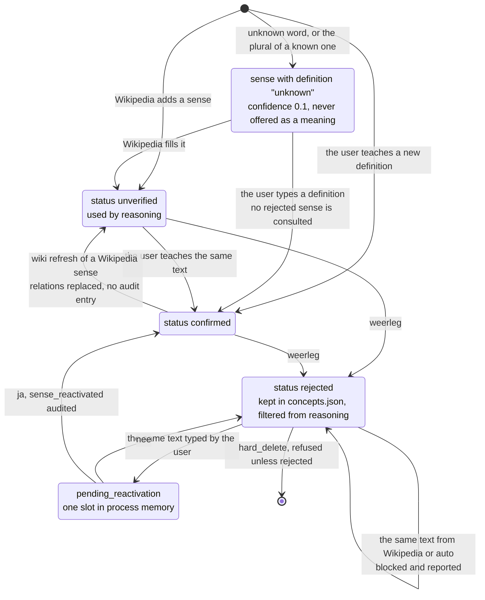

## 1. Executive Summary

Nova is a personal companion built by one author for one user, and its defining
constraint is stated in the README: **no LLM in the core, no cloud AI**. Nothing
on a running path calls a model. `core/llm_bridge.py`, an Ollama client, has no
caller outside a manual script. Its refusal of a refuted belief is keyed on the
value and consulted first on the main write path, and two other writes go
around it.

That constraint puts every epistemic decision in the code. Nova has no
embedding to supply similarity and no model to supply judgement, so string
matching, a hand-built concept graph and rules do all of it.

**Its knowledge memory is a concept graph with provenance on every edge.** A
concept is a word; a word has senses carrying `sense_id`s; a sense has relations
(`is_a`, `part_of`, `causes`, `synonym`, `antonym`) and each relation carries a
`source`, a `confidence`, a `status` and a `created_at`. The committed
`concepts.json` holds 299 concepts and 258 relations: 236 from the user, 15 from
Wikipedia and 7 extracted from definitions.

**A relation parsed from the user's sentence passes a typed confirmation gate.**
Before storing it, Nova asks *"Mag ik onthouden dat 'X' is een soort van 'Y'?"*
— may I remember that X is a kind of Y — and writes only on `ja`. If the subject
has more than one known sense it asks which one first, by number. The gate is a
turn in the conversation at the terminal prompt. Two automatic writers do not
pass it: `_auto_extract_is_a` and the Wikipedia teacher append `unverified`
edges without asking.

**Every concept carries its own audit log.** `ensure_concept` seeds an
`audit_log` array, and sense creation, upgrade, confidence change, relation add,
rejection and reactivation append to it, with `old_value` and `new_value` where a
value changed. Only concept creation and hard deletes are mirrored to
`logs/concepts.jsonl` (`core/semantic.py:81`, `:438`).

**The refusal is consulted before the write on the main path.** `weerleg` —
refute — sets `status = "rejected"` on a sense, a concept's every sense, or a
relation, with the old status and a timestamp in the concept's audit log. The
reasoning layer filters `status != "rejected"` when choosing a sense and when
disambiguating by context, while `get_senses()` keeps showing it for
*"transparantie"* — so a person inspecting the graph sees what the reasoner
refuses to use.

`reject_sense`, `reject_relation` and `reject_concept` take a `reason`, and
none of the three `weerleg` handlers passes one (`core/intent_router.py:504`,
`:575`, `:636`). The two refutations in the committed graph carry no reason.

What makes it a tombstone rather than a soft delete is the deduplication loop in
`add_sense` (`core/semantic.py:188`). It matches an incoming definition against
existing senses by definition text, and its **first** test on a match is the
rejected status (`:204`). A hit returns not a sense but a signal —
`{"blocked": "rejected", "sense": …, "attempted_source": …}` — and the stored
sense is not touched at all.

The signal is threaded up rather than swallowed. `TeachEngine.teach` passes it
through untouched and skips `_auto_extract_is_a` on that path — *"er is niets
nieuws om relaties uit te halen"* (`:1634`). `SemanticConceptsModule.teach`
(`:2146`) holds the chat bus and splits on the source. A non-user source —
`wikipedia`, `auto_extract` — is only reported, never applied.

A re-assertion by the user becomes a `pending_reactivation` and a typed
question: *"I had already rejected '`<word>`' → '`<definition>`'. Do you really
want to confirm this again?"* Answering `nee` leaves the rejection standing.
Answering `ja` sets `confirmed` and writes a `sense_reactivated` audit entry
carrying the previous status and *"Kevin bevestigde expliciet opnieuw"*
(`:2211`). The committed graph holds one such round trip, `gitaar#1`, rejected
and reactivated on 8 August 2026.

So the value-keyed refusal is durable against automatic re-derivation, and
lifting it requires a person to answer a question about that value, as an
audited event. That is the [rejected-value
tombstone](../../patterns/rejected-value-tombstone/) built with string equality
and a dict.

**Three limits.** The match is `s.get("definition") == definition`, so a
paraphrase is a different string and is not blocked. `TeachEngine.teach` calls
`upgrade_unknown_sense` before `add_sense` (`:1601`), and that upgrade consults
no rejected sense. On a concept that also holds an `unknown` placeholder, a
re-typed refuted definition fills the placeholder as `confirmed`, with no
question. And a `wiki <word>` refresh of a Wikipedia-sourced sense sets it
`unverified` and replaces its relation list, rejected edges included, without an
audit entry (`modules/knowledge/wikipedia_teacher.py:329-330`).

`hard_delete` sits behind the refusal as a second step: it refuses while any
sense is still unrejected, so physical removal requires the refusal first.

**Licence caveat, stated because it governs what a reader may do with the rest.**
`LICENSE.txt` is headed *"Viewable, Not Reusable"* — all rights reserved,
published so others can read the project and follow how it is being built. This
report analyses mechanisms; it is not an invitation to copy code, and the ideas
below are described so they can be re-implemented rather than lifted.

## 2. Mental Model

Nova has two memories that never touch. Events are what happened; concepts are
what is held true. The refusal is keyed on a sense's definition text, so the
diagram follows a sense, including the two writes that go around the refusal.


```mermaid
%% caption: a sense's status in the concept graph, with the placeholder upgrade and the Wikipedia refresh that bypass the rejected check
stateDiagram-v2
    [*] --> Placeholder: unknown word, or the plural of a known one
    Placeholder: sense with definition "unknown"<br/>confidence 0.1, never offered as a meaning
    [*] --> Confirmed: the user teaches a new definition
    [*] --> Unverified: Wikipedia adds a sense
    Placeholder --> Unverified: Wikipedia fills it
    Placeholder --> Confirmed: the user types a definition<br/>no rejected sense is consulted
    Unverified: status unverified<br/>used by reasoning
    Confirmed: status confirmed
    Unverified --> Confirmed: the user teaches the same text
    Confirmed --> Unverified: wiki refresh of a Wikipedia sense<br/>relations replaced, no audit entry
    Unverified --> Rejected: weerleg
    Confirmed --> Rejected: weerleg
    Rejected: status rejected<br/>kept in concepts.json, filtered from reasoning
    Rejected --> Rejected: the same text from Wikipedia or auto<br/>blocked and reported
    Rejected --> Asking: the same text typed by the user
    Asking: pending_reactivation<br/>one slot in process memory
    Asking --> Rejected: nee
    Asking --> Confirmed: ja, sense_reactivated audited
    Rejected --> [*]: hard_delete, refused unless rejected
```

The self-loop on `Rejected` is the design's best idea: no automatic source can
re-admit a refuted definition, and a person re-admits one only by answering for
it. That matters because `is_a_chained` walks inference chains, and a wrong edge
left in place would be reasoned through confidently forever.

The placeholder edge is how the refusal leaks. `auto_learn` runs on nouns in
unmatched sentences, normalises a plural to an existing singular
(`core/semantic.py:1562-1571`) and adds an `unknown` sense beside that concept's
real ones. `werk#3` in the committed graph has that shape: source `auto`,
created 24 September 2026 beside two confirmed senses. A later typed teach of a
refuted definition for such a word fills the placeholder rather than reaching
`add_sense`.

The refresh edge breaks the monotonicity the trust-state comments promise. In
`add_sense` an automatic match never downgrades a confirmed sense (`:217-225`).
For a word with no user-sourced sense, the Wikipedia refresh branch
(`modules/knowledge/wikipedia_teacher.py:317-334`) sets its Wikipedia sense
back to `unverified` and replaces its relation list when the new extraction
returns any. `gitaar#1` is confirmed with
source `wikipedia`, and `hond#1` holds the graph's one rejected relation.

Relations have a smaller machine. A relation parsed from a typed sentence waits
in `pending_relation` until `ja` and is stored `confirmed` — [evidence before
belief](../../patterns/evidence-before-belief/) in a system with no model to
distrust. `weerleg` rejects a relation. Nothing promotes an `unverified` edge or
lifts a rejected one: `add_relation` returns early on any existing type and
target (`core/semantic.py:776-778`), and `handle_confirm` announces *"Oké, ik
onthoud nu…"* without reading that return (`:2062-2068`).

## 3. Architecture

One process on one host. `main.py` builds an in-process `EventBus`, loads
modules from `core/`, `modules/` and `identity/`, and reads the user's turns
from a terminal prompt (`main.py:436`). Storage is `data/`: `interactions.db`
and `interactions.jsonl` for events, `concepts.json` for knowledge, and a dozen
smaller JSON files for the profile, learned patterns, chess state and classifier
models.

`core/` carries the infrastructure — `memory.py` (870 lines), `semantic.py`
(2,496), `intent_router.py` (4,485), `event_bus.py`, `response_engine.py`,
`module_loader.py`. `modules/` is the surface area: knowledge, learning,
weather, chess, math, activity, preferences, context, chat, network, time. `identity/`
holds personality, emotion, expression and self-query.

### Deployment and ergonomics

The core runs as a Linux daemon; the README names Docker on Unraid as the tested
platform. The `Dockerfile` installs Python 3.11.9 and Stockfish only; code and data
are mounted as a volume, so the image holds no memory. `requirements.txt` adds
`python-chess`, scikit-learn for the intent classifier, MediaPipe and
`websockets`. No database server, no vector store, no API key, and no network
call is required for the memory itself to work.

A Windows companion client, not in this tree, streams activity, focus and
presence labels to `modules/network/client_bridge.py`. The bridge listens on
`0.0.0.0` with no authentication, relying on Tailscale by its own docstring
(`:212`), and sends whitelisted open-app and open-URL commands back. None of its
five message types is a chat turn, so it cannot answer the confirmation gate.

The cost is that it is one person's machine. There is no scope key anywhere in
`memory.py` or `semantic.py` — no user, no tenant, no project — because the
system is built for exactly one named user, and the profile module is literally
`kevin_profile.py`. That is a coherent choice rather than an oversight, and it is
also what makes the design non-transferable without a schema change.

## 4. Essential Implementation Paths

### The confirmation gate

`RelationFlowEngine` holds one `pending_relation` at a time and drives a short
conversation. If the subject has several real senses it asks which, by number;
then the same for the object; then it asks for confirmation in words a person can
answer:

> `"Mag ik onthouden dat '{subject}' {rel_text} '{obj}'?"`

`handle_confirm` writes on `ja`/`yes`/`y`, discards on `nee`/`no`/`n`, and on
anything else re-asks rather than guessing. It is reached from
`core/intent_router.py:4465-4467` only when the whole turn is `ja` or `nee` and
no earlier pending question claimed it. Senses whose definition is `"unknown"`
are excluded from the numbered list (`core/semantic.py:1965`, `:1982`); rejected
senses are not, so a person can be offered a refuted meaning and attach an edge
that `get_relations` then ignores.

The gate is the only path from the user's sentence to a stored relation. It is
not the only path to a stored relation: `_auto_extract_is_a` derives an `is_a`
from a taught definition that matches one of its patterns and appends it `unverified` with source
`auto_extract` (`:1742`), and the Wikipedia teacher appends the edges it
extracts (`modules/knowledge/wikipedia_teacher.py:440`). Neither goes through
`add_relation`, so neither writes an audit entry.

### The correction that is kept out of the ground truth

The intent classifier learns from Kevin's corrections — the "nee ik bedoelde X"
("no, I meant X") flow — and the handling of that data is the sharpest piece of
engineering in the repository. Corrections go to
`data/gecorrigeerde_voorbeelden.jsonl`, deliberately **not** into
`training_data.json`. `retrain_vanuit_bestanden` combines three sources — the
curated base set, the confirmed corrections, and Layer 0 examples that a
deterministic `detect_*()` already got right without the classifier guessing —
and the docstring is explicit about why the combination is temporary:

> "BELANGRIJK: dit schrijft GEEN van de twee aanvullende bronnen terug naar
> `training_data.json` zelf — dat bestand blijft Kevin's eigen, schone basisset.
> De combinatie gebeurt enkel TIJDELIJK, in het geheugen, vlak vóór het trainen."

The merge happens in a local copy because `retrain()` writes `self.voorbeelden`
back to disk, so extending the instance attribute would have silently persisted
corrections into the human-owned file. The hazard is named in a comment beside
the line that avoids it, and a `try/finally` restores the clean set even when
training fails.

This is a real answer to a problem most memory systems have and few separate: the
difference between what a person carefully asserted and what the system inferred
from being corrected. Here the curated set is a file a human owns, the derived
set is a different file, and the merge exists only in RAM for the duration of a
training run.

Words the classifier could not place go to `data/onbekende_correcties.jsonl` as
a hint list for future categories, rather than being forced onto the nearest
existing label — a refusal to guess, recorded rather than discarded. Both files
are **empty at this commit**: the machinery is wired to a four-hourly retrain in
`main.py` (`:192`) and documented as confirmed end-to-end in the changelog, but
the live corrections are not committed, so what ships is the mechanism without
the data.

### Retrieval that says what it is not

`memory.search` is `SELECT * FROM interactions WHERE data LIKE ?` over the event
JSON, newest first, with an optional `recent_weeks` cutoff (`core/memory.py:328`).
`find_similar` pulls the newest 500 rows and scores them with
`difflib.SequenceMatcher` (`:569`). The intent router calls both for memory
questions (`core/intent_router.py:2624`, `:2643`). The docstring draws the
boundary itself:

> "Dit is PUUR symbolisch (difflib, standaard in Python) — GEEN ML, GEEN
> embeddings, GEEN betekenis-matching. 'hond' wordt dus niet gelinkt aan 'kat'
> met deze methode, enkel woorden die er letterlijk op lijken."

Purely symbolic; no ML, no embeddings, no meaning-matching — "dog" is not linked
to "cat", only to words that literally resemble it. Stating the limit next to the
method is the same discipline [memU](../memu/) applies to its retrieval, and it
matters more here, because a reader who assumed semantic recall would misread
every result the function returns.

Semantic recall does exist, but it lives in the graph rather than the index.
`is_a_chained`, `part_of_chained` and `causes_chained` walk relations with a
visited set and return the path, and `explain_is_a` renders that path as a
sentence — *"Ja, een {source} is een {target}, want: hond → dier → levend wezen."*
Each walk reads through `get_relations`, so a rejected edge breaks the chain.

### Contradiction detection, and the loop that answers it

`find_contradictions` checks a word's `is_a` parents against three hardcoded
incompatible groups — `{dier, plant, meubel, voertuig, gebouw, apparaat,
voedsel}`, `{levend, niet-levend}`, `{vloeibaar, vast, gas}` — and returns a list
with a readable reason per conflict (`core/semantic.py:1154`).

`modules/knowledge/contradiction_checker.py` is its caller: a sweep every 15
minutes of `main.py`'s background loop (`main.py:203`), walking the whole
knowledge graph, collecting conflicts, and raising them with the user through
`layer4_response` **with a concrete `weerleg:` proposal per conflict** so the
refusal is one typed line away. Its module docstring says it adds no
intelligence: *"Puur symbolisch: geen ML, geen generatie — roept enkel
bestaande, al-geteste reasoning-code aan"*.

A `contradiction_state.json` remembers which conflicts have been raised, keyed
on the word plus its sorted conflict list, so the same collision produces the
same key whatever order the `is_a` relations were stored in. An unresolved
conflict is mentioned once, not every cycle.

That is [resolve, don't just detect](../../patterns/resolve-not-just-detect/)
completed end to end: detection, a bounded proactive surface, a named resolution
verb, and a state that ends in the store rather than in a conversation.

## 5. Memory Data Model

Two stores, different shapes.

**Events.** SQLite `interactions` with `timestamp`, `month`, `year`,
`event_type`, `data` (the JSON payload) and `created_at`, plus an
`interactions_old` archive table with the same columns, plus a JSONL mirror that
rotates at 50 MB; `search` and `query` read both tables through a `UNION ALL`
unless the caller passes `include_archief=False`, so an event older than ninety
days is still found (`core/memory.py`, `tests/test_memory_archief_search.py`).
An `ignore_types` set keeps loop-inducing types out, including
`memory:interaction_added` — memory listens to everything, including itself
(`:44`). The SQLite file and `data/backups/` are gitignored and in no commit on
`main`; the JSONL mirror and two rotated archives of it are committed.

**Concepts.** `concepts.json`, keyed by lowercased word. `hond` at this commit:

```json
"hond": {
  "senses": [{
    "sense_id": "hond#1",
    "definition": "De hond is de gedomesticeerde ondersoort van de wolf.",
    "pos": "noun", "source": "wikipedia", "confidence": 0.8,
    "status": "unverified",
    "relations": [
      {"type": "is_a", "target": "wolf", "confidence": 0.8,
       "source": "wikipedia", "status": "unverified", "created_at": "..."},
      {"type": "is_a", "target": "zoogdier", "confidence": 0.9,
       "source": "user", "status": "confirmed", "created_at": "..."},
      {"type": "is_a", "target": "meubel", "confidence": 1.0,
       "source": "user", "status": "rejected", "created_at": "..."}
    ],
    "audit_log": []
  }],
  "metadata": {"created_at": "...", "updated_at": "...", "sources": ["..."],
               "last_used_at": "...", "usage_count": 0,
               "confidence_history": []},
  "audit_log": ["concept_created", "sense_created", "relation_add",
                "relation_rejected"]
}
```

The concept-level `audit_log` is shown by event type. Every sense also carries
an `audit_log` array, and no writer appends to it: `_audit_sense` and
`_audit_relation` write to the concept's list (`core/semantic.py:164`, `:736`).

Provenance sits per edge, which is the right grain — a concept assembled from a
Wikipedia definition and three user-supplied relations records which is which.
The `status` field is the trust state: `unverified` rows are used by reasoning,
`rejected` rows are not. `confidence_history` and `usage_count` give decay and
reinforcement somewhere to land. What is absent: no validity time separate from
record time, and no scope key.

The whole file is `json.dump`ed on every save: `ConceptStore.save` rewrites the
entire graph for a single confidence bump. At 299 concepts that is affordable,
and the write is atomic — a temporary file in the same directory, `flush` plus
`os.fsync`, then `os.replace`, with the PID in the temporary name and the
orphaned file cleaned up if the write fails (`core/semantic.py:31`). An
interrupted write leaves the previous graph intact rather than truncating it.
The cost is still O(graph) per mutation; the failure mode is not.

## 6. Retrieval Mechanics

Three paths, none of them ranked by a model:

1. **Keyword** — `LIKE '%term%'` against the event JSON blob, newest first. This
   matches key names as readily as values.
2. **Fuzzy** — `SequenceMatcher` over the newest 500 events, `min_ratio=0.6`,
   top 5. Catches typos; the 500-row window means older events are unreachable
   this way regardless of relevance.
3. **Graph** — chained relation walks with cycle protection, returning the path,
   over relations filtered of rejected rows and rejected senses.

The write buffer is flushed before both SQL paths so a just-written event is
searchable, and a comment notes that `_flush_buffer` is deliberately called
outside the caller's lock because it takes its own.

The absence of fusion is not the usual gap here — there is no semantic arm to
fuse with. What a reader should take is the shape:
[hybrid retrieval fusion](../../patterns/hybrid-retrieval-fusion/) assumes an
embedding arm that misses exact tokens. Nova is the other half of that trade
running alone — exact and near-exact matching only, with meaning handled by an
explicit graph rather than by proximity in a vector space.

## 7. Write Mechanics

Events arrive on the bus and land in a write buffer; an arriving event flushes it
when 50 are buffered or 5 seconds have passed since the last flush
(`core/memory.py:61-62`), and `append_to_disk` retries up to three times.
Writes do not block the conversation; because both search paths force a flush
first, the lag is not observable through them. `atexit` and signal handlers
flush on shutdown.

Knowledge writes are different in kind: synchronous, one at a time, and
`add_relation` is called from the gate with its defaults, `source="user"` and
`confidence=1.0`, which is what a confirmed answer is. `add_relation`
deduplicates on `(type, target)` within a sense, appends the relation, stamps
`metadata.updated_at`, writes an audit entry, and saves the whole file
(`core/semantic.py:751`).

The two automatic relation writers skip that function. `_auto_extract_is_a`
appends an `is_a` with `confidence 0.9`, source `auto_extract` and status
`unverified` directly to the sense (`:1742`), and the Wikipedia teacher appends
its extracted edges the same way (`wikipedia_teacher.py:440`). Each dedups by
target against every existing edge on the sense, rejected ones included, so a
refuted target is not appended again on that sense. Neither writes an audit
entry, so the log answers "who told me" only for edges that came through the
gate.

### Operational cost

No model calls, so there is no token cost and no provider latency anywhere in the
memory path. The background loop runs maintenance every six hours: trim the RAM
cache from a daytime ceiling of 5,000 events back to 500, move events older than
90 days to `interactions_old`, gzip anything past 365 days, vacuum, rotate
backups, and run a health check. The classifier retrains every four hours.

No background pass rewrites the store's contents — archival moves rows between
tables and compression moves them to files, and the contradiction sweep only
reads. That is why cost does not scale with corpus size, and also why the graph
never improves on its own.

## 8. Agent Integration

There is no agent framework here and no tool protocol. The integration surface is
the `EventBus`: modules publish and subscribe, `MemoryModule.on_event` records
everything not in `ignore_types`, and `intent_router.py` decides what a message
meant and which module answers. `chat_message` has one publisher, the terminal
loop (`main.py:498`).

The unusual integration is temporal. Nova runs continuously and decides on her
own initiative whether *now* is a reasonable moment to speak, using
`interruption_tracker.py` against a learned `interruption_patterns.json` of when
interruptions were previously tolerated. Activity and presence arrive from the
Windows client through the bridge. Memory feeds that decision rather than only
answering questions with it — prospective memory driven by a person's habits
rather than a schedule.

## 9. Reliability, Safety, and Trust

Strengths:

- **An audit log on the concept itself**, appended on create, upgrade,
  confidence change, relation add, rejection and reactivation, with old and new
  values.
- **A confirmation gate** as the only path from the user's sentence to a stored
  relation, with sense disambiguation asked first.
- **Per-edge provenance, confidence and status** in the schema, with real,
  differing sources in the committed data.
- **Corrections quarantined from the curated training set**, the merge held in a
  local copy, restored under `try/finally` even when training fails.
- **A refusal to guess, recorded** — unplaceable correction words go to a hint
  file instead of being forced onto the nearest label.
- **Explainable inference** — chained walks that return the path, and helpers
  that render it as a sentence a person can check.
- **A real operational lifecycle** — buffered writes with retry, RAM trimming,
  archival, compression, vacuum, backup rotation, health check, shutdown flush,
  and an atomic graph save.

Gaps:

- **Two writes go around the refusal.** The placeholder upgrade in
  `TeachEngine.teach` runs before `add_sense` and checks no rejected sense; the
  Wikipedia refresh resets a confirmed sense to `unverified` and replaces its
  relation list, rejected edges included, with no audit entry.
- **A rejection only a person can make.** Every path to `rejected` runs through
  `weerleg`; nothing lets the system refuse its own bad inference, so a
  contradiction sits until someone answers the prompt.
- **A rejection with no reason.** The `reason` parameter exists on all three
  reject functions and no caller fills it.
- **The unverified backlog has no exit for relations.** Four reasoning reads
  filter on `rejected`; nothing counts `unverified`, and nothing in the running
  system sets a relation to `confirmed` after it is stored — a confirmation through the gate
  is a no-op that reports success.
- **The whole graph is rewritten on every save**, though atomically.
- **`tombstone` — earned, by design and pinned by tests.** The record is keyed on
  the definition text; the reasoner filters it; and `add_sense`'s dedup loop
  tests the rejected status before anything else, returning a `blocked` signal
  and leaving the stored sense untouched. The Wikipedia path checks it too. No
  automatic source reaches the placeholder bypass: it takes a typed teach.
- **`negative_eval` — earned, with a positive control.**
  `test_part_of_chained_na_weerlegging_is_false` asserts that a refuted
  intermediate link removes a reasoning path, and
  `test_get_relations_negeert_rejected_relatie` asserts a refuted `is_a` is
  absent from `get_relations` while remaining in `concepts.json`. Each first
  asserts that the same query *succeeds* on the populated graph, so a pass
  cannot come from retrieval being broken.
- **`trust_state` — earned.** `unverified`, `confirmed` and `rejected` on every
  sense and relation, set from `source` at write time, and `rejected` excluded
  by `get_best_definition`, `detect_sense`, `get_relations` and
  `get_all_relations`.
- **No scope key**, by design, which makes the schema single-user rather than
  merely deployed that way.

### The asymmetry in forgetting

Nova can forget two kinds of thing, with verbs that differ in kind. The
preference store implements `vergeet: <woord>`: `remove_preference` deletes a
word, or with a `bron` argument removes only the automatic or only the explicit
sub-block and leaves the word standing under the other, then publishes
`preference_forgotten` (`modules/preferences/kevin_profile.py:323`). That is a
source-aware forget, the way a correction should be.

It applies to what Kevin likes, and `weerleg` applies to what Nova knows.
`vergeet` deletes a preference outright, and `weerleg` leaves the refuted
knowledge in the file where a person can still see it while the reasoner cannot
use it. Deleting a taste is harmless; deleting a belief loses the record that it
was ever held and refuted.

## 10. Tests, Evals, and Benchmarks

`tests/` holds 54 `test_*.py` files carrying **807 test functions and 1,313
assert lines**, and they are pytest cases that fail rather than exploration
scripts whose output a person reads. Twelve print-only scripts sit apart in
`tests/manual tests/`. `conftest.py` in the repository root makes pytest treat
the root as `rootdir`; it runs at collection, before any test. I ran none of
them.

The memory-relevant suites are the ones to read. `test_tombstone.py` holds the
refusal in seven cases — a reasoning chain before and after a refuted
intermediate link, a refuted relation kept in `concepts.json`, `get_relations`
ignoring a refuted relation and every relation under a refuted sense, and the
re-assertion path through `add_sense` from a user and from a non-user source. Each isolates itself in
`tmp_path` with its own `ConceptStore`, and the module docstring says why it
drives `SenseEngine`/`RelationEngine` directly rather than
`SemanticConceptsModule`: the latter always constructs a store at the default
path, which is the author's real `concepts.json`.

The rejected-sense case asserts an empty list with no positive assertion
before the rejection; the two relation cases carry one.
`test_reactivatie_flow.py` drives the typed reactivation question through
`SemanticConceptsModule` and the Wikipedia teacher's rejected-sense guard.
`test_hard_delete_en_atomic_save.py` covers `hard_delete`'s refusal while any
sense is unrejected, and that an interrupted `save` leaves the previous graph
intact.

What is unasserted follows the gaps in section 9. No test teaches a refuted
definition to a concept that holds a placeholder, so the bypass through
`upgrade_unknown_sense` is uncovered. No test refreshes a Wikipedia sense that
carries a rejected relation or a confirmed status. A test pins that a second
`add_relation` on a stored edge is refused and keeps the first version
(`tests/test_add_relation_source.py`); none drives `handle_confirm` on such an
edge, where the refusal is announced as success. Nothing asserts that a retrain leaves
`training_data.json` byte-identical, the invariant the most carefully reasoned
code in the repository exists to preserve. There is no retrieval-quality
benchmark, which for a store with no embeddings is a smaller gap than it sounds.

`README.md` cites no paper and there is no `CITATION.cff`. The changelog records
live end-to-end confirmations with dates and documents bugs found while building
— including one where an over-broad search-and-replace deleted an entire method,
caught by a local harness before the file shipped.

## 11. For Your Own Build

### Steal

- **Gate the write on a typed confirmation.** "May I remember that X is a kind
  of Y?" is a better governance surface than a review queue nobody opens, and it
  costs one turn at exactly the moment the user has the context to answer.
- **Quarantine corrections from curated ground truth.** Keep the human-authored
  set in its own file, keep derived corrections in another, and merge only in
  memory for the duration of a training run — with the reason written beside the
  local copy that makes it safe.
- **Record the inputs you refused to classify** instead of forcing them onto the
  nearest existing label. The hint file is how the next category gets discovered.
- **Put the audit log on the record**, not only in a side channel, so exporting
  one concept exports its history — the placement
  [NOOA Memory](../nooa-memory/) argues for from the other direction.
- **Return the inference path, not just the answer.** Turning a graph walk into a
  sentence a person can check is what makes a symbolic store auditable in a way a
  similarity score is not.
- **Make the refusal a return value the caller has to handle.** The `blocked`
  signal forces each layer to decide between reporting and asking.

### Avoid

- **A refusal on one write path when another runs first.** The rejected check
  lives in `add_sense`, and the placeholder upgrade that precedes it in the same
  function's caller never asks. Put the check where every writer of that value
  passes.
- **A refresh that replaces a record's children wholesale.** Overwriting a
  relation list erases the rejections and confirmations on it, and with them the
  only record that they happened.
- **A confirmation that cannot tell a write from a no-op.** Announcing
  "remembered" when the store returned `False` teaches the user that the gate
  worked when nothing changed.
- **A reason parameter nothing fills.** A rejection record without a reason is
  half of what a person reviewing it later needs.

### Fit

Read this if you are building symbolic or graph memory without a model, or if you
want to see what correction looks like when there is no LLM to blame. The
confirmation gate, the typed re-admission and the training-set quarantine were
each decided explicitly, because there was no model to delegate them to.

Do not read it as a component. The licence forbids reuse, the schema has no scope
key, and the store is a single JSON file rewritten whole. It is a well-kept
notebook of one person's design decisions, and its value is the decisions — of
which the strongest is that a refusal should be keyed on what was said, not on
the row that said it. The gaps are the other lesson: a refusal holds only on the
paths that consult it, and each new writer is a new path.

## 12. Open Questions

- Does the exact-text refusal need a looser key? A paraphrase of a refuted
  definition is a different string, and a store with no embedding has no cheap
  way to close that — `difflib.SequenceMatcher`, which `find_similar` in
  `core/memory.py` uses, would be the obvious candidate.
- What happens to the `unverified` backlog? Nothing counts it or offers it for
  confirmation, and a stored relation has no path to `confirmed`, so it grows as
  Wikipedia and auto-extraction run.
- Is the Wikipedia refresh's reset of a confirmed sense intended? The comment
  beside it assumes Kevin never confirmed the sense, and `gitaar#1` is one he
  did.
- Are `gecorrigeerde_voorbeelden.jsonl` and `onbekende_correcties.jsonl` empty
  because they are runtime-only, or because the flow rarely fires?
- What would `concepts.json` need for a second user, given no scope key exists?

## Appendix: File Index

- Event memory: `core/memory.py` (`MemoryModule`, `on_event`, `_flush_buffer`,
  `_rotate_if_needed`, `search`, `query`, `find_similar`, `archive_old_events`,
  `compress_ancient_events`, `run_maintenance`, `health_check`).
- Knowledge: `core/semantic.py` (`ConceptStore.save`, `_append_audit`,
  `SenseEngine.add_sense`, `upgrade_unknown_sense`, `reject_sense`,
  `hard_delete_concept`, `RelationEngine.add_relation`, `reject_relation`,
  `get_relations`, `ReasoningEngine.find_contradictions`, `is_a_chained`,
  `explain_is_a`, `TeachEngine.teach`, `_auto_extract_is_a`, `auto_learn`,
  `RelationFlowEngine.start_relation_flow`, `handle_confirm`,
  `SemanticConceptsModule.teach`, `handle_reactivation_confirm`).
- Automatic knowledge writers: `modules/knowledge/wikipedia_teacher.py`
  (`_teach_word`), `modules/chat/response_pipeline.py`
  (`_auto_learn_from_sentence`).
- Refutation commands: `core/intent_router.py` (`handle_weerleg`).
- Contradictions: `modules/knowledge/contradiction_checker.py`.
- Corrections and learning: `modules/learning/intent_classifier.py`
  (`retrain_vanuit_bestanden`, `_laad_gecorrigeerde_voorbeelden`),
  `modules/learning/pattern_matcher.py`,
  `modules/learning/word_associations_learner.py`.
- Preferences and their forget path: `modules/preferences/kevin_profile.py`
  (`remove_preference`).
- Routing and integration: `core/intent_router.py`, `core/event_bus.py`,
  `core/response_engine.py`, `main.py`, `modules/network/client_bridge.py`.
- Timing: `core/interruption_tracker.py`, `modules/activity/session_watcher.py`.
- Unwired: `core/llm_bridge.py` (Ollama client, called only from
  `tests/manual tests/manual_llm_bridge.py`).
- Tests: `tests/test_tombstone.py`, `tests/test_reactivatie_flow.py`,
  `tests/test_hard_delete_en_atomic_save.py`,
  `tests/test_memory_archief_search.py`.
- Committed state: `data/concepts.json` (299 concepts),
  `logs/concepts.jsonl`, `data/training_data.json`,
  `data/gecorrigeerde_voorbeelden.jsonl` (empty),
  `data/onbekende_correcties.jsonl` (empty).
- Deployment: `Dockerfile`, `requirements.txt`.
- Licence: `LICENSE.txt` ("Viewable, Not Reusable").

### Recorded searches

Run from the repository root at the pinned commit.

```sh
git grep -n -E 'llm_bridge|genereer_zin' -- core modules identity main.py ':!core/llm_bridge.py'   # nothing: the Ollama client has no caller
git grep -n -i -E 'embedding|sentence_transformers|faiss|chromadb' -- '*.py' ':!engines' ':!tests'   # one docstring saying there are none
git grep -n -E 'user_id|tenant|scope' -- core/memory.py core/semantic.py   # nothing: no scope key
git grep -n -E 'publish\("chat_message"' -- '*.py' ':!tests'   # main.py:498 only
git grep -n -E 'reject_(sense|relation|concept)\(' -- core/intent_router.py   # three calls, none passing reason
git grep -n -E 'unverified' -- '*.py' ':!tests' ':!core/semantic.py' ':!scripts'   # wikipedia_teacher.py writes it; nothing reads it
git grep -n -E 'rel\["status"\] *=' -- '*.py' ':!tests' ':!scripts'   # core/semantic.py:835 only, the rejection
git grep -n -E 'relations"?\]?\)?\.append\(|setdefault\("relations"' -- core modules   # writers at :796, :1742 and wikipedia_teacher.py:440, plus :241 building a list; only :796 is followed by an audit entry
git grep -n -E '_write_log\(|_append_audit\(' -- '*.py'   # mirror writers: concept creation and the three hard deletes
git grep -n -E 'upgrade_unknown_sense|"unknown"' -- tests/test_tombstone.py tests/test_reactivatie_flow.py   # nothing: no placeholder case
git grep -n -E 'retrain_vanuit_bestanden' -- tests   # nothing: the quarantine is untested
git grep -n -E 'handle_confirm\(' -- tests   # a stub in test_intent_router_reactivatie_en_woordmatch.py; no test drives the real one
git grep -n -E 'setdefault\("audit_log"' -- '*.py' ':!tests'   # four appends, each to the concept's list; none to a sense's
git grep -n -E '\.(reject_sense|reject_relation|reject_concept)\(' -- '*.py' ':!tests'   # the three weerleg handlers and their wrappers only
git grep -n -E 'bericht_type ==' -- modules/network/client_bridge.py   # five message types, none a chat turn
git grep -n -i -E 'arxiv|bibtex|@article|@misc|doi\.org' -- README.md   # nothing: no paper
git log --format=%h origin/main -- data/interactions.db data/backups   # nothing: no commit on main holds the database
```

## History

**2026-09-28** — re-pinned to [`802a3218f2d99b2216258e23feb68893217cb54b`](https://github.com/Whooptie/NOVA_AI/commit/802a3218f2d99b2216258e23feb68893217cb54b). The previous pin left `main` because its history was rewritten once: every commit after [`67b784f746212f19d0f47fb81ba55ab14d979e57`](https://github.com/Whooptie/NOVA_AI/commit/67b784f746212f19d0f47fb81ba55ab14d979e57) (1 July 2026) was replaced by one whose tree lacks only `data/interactions.db` and `data/backups/`, 154 with their subjects and author dates and one emptied commit dropped. The pin's twin is [`4940cff133344fe634baeeec98d4794823ca95e2`](https://github.com/Whooptie/NOVA_AI/commit/4940cff133344fe634baeeec98d4794823ca95e2); the four dated archive branches are successive heads of the old line, not further rewrites. Fifteen later commits leave `core/semantic.py` and `core/memory.py` untouched. Marks unchanged. The refusal's two bypasses, the typed gate and the unfilled `reason` are in [section 2](#2-mental-model). Screened: no auto-run surface, two build-time execution points, twelve unpinned requirements. Nothing installed, built or run.

**2026-09-19** — re-pinned to [`da6b91611b3d973badb9f3a808a7eee332cf338c`](https://github.com/Whooptie/NOVA_AI/commit/da6b91611b3d973badb9f3a808a7eee332cf338c). All five marks stand. `human_review`'s record had one file and no line numbers behind it and now carries both, plus the producer test: `handle_confirm` (`core/semantic.py:2052`) has exactly one caller, `core/intent_router.py:4253`, reached only when the transcribed turn is literally `ja` or `nee` and nothing else holds the floor; the re-admission question and `handle_reactivation_confirm` are at `:2159-2168` and `:2183`. What settles it is the absence rather than a check: `core/` contains no MCP server, tool-call dispatcher or function-call surface, so the only channel an answer can arrive on is the user speaking. That is the same shape as parsing an adjudication out of the user's own message, and it is the strongest form this mark takes. The licence caveat in section 1 is unchanged and still governs what a reader may do with the rest. Screened again first; nothing was installed and no suite was run.

**2026-09-16** — [`4ad85507ab637897cd84abc891f733f2e7fab189`](https://github.com/Whooptie/NOVA_AI/commit/4ad85507ab637897cd84abc891f733f2e7fab189) — re-read at a commit dated 16 September 2026. The previous pin could not be compared against this one: the GitHub comparison refuses with a 422 because `5d989252` is no longer an ancestor of `main`, so the branch was rewritten rather than advanced — and the head moved again between two requests a minute apart, so the rewriting is ongoing. The pinned commit itself survives, both upstream by sha and in the atlas's archive fork, so the previous reading remains checkable. Against the new head the two anchored files show a 2,741-line diff that is not a change: `git diff -w --ignore-cr-at-eol` between the pins is empty, and `core/semantic.py` went from zero carriage returns to 2,496, so the whole difference is a conversion from LF to CRLF. The tombstone mechanism and its test are therefore identical in content, and all five marks hold verbatim. Screened before reading, from a full clone: no auto-run surface, two build-time execution points, one unpinned dependency surface and one dependency file inside the seven-day cooldown. Nothing was installed, built or run.

**2026-09-07** — [`5d9892522d1a275f70db5c2f7d6ec4c59487029d`](https://github.com/Whooptie/NOVA_AI/commit/5d9892522d1a275f70db5c2f7d6ec4c59487029d) — re-pinned eight commits on. On the memory path, `MemoryModule.search` and `query` read the `interactions_old` archive by default with an `include_archief` opt-out, and `get_stats` counts it (`core/memory.py`, ten cases in `tests/test_memory_archief_search.py`); a `core/last_context.py` module tracks the last concept a conversation resolved, the intent router grew by 476 lines, and a response-variant learner with a feedback log was added under `modules/response_learning/`. The committed state moved with use — `interactions.db`, the word-association map, the intent classifier. The concept graph, its statuses, tombstones and audit fields did not change; five marks stand on the same evidence. Screened before reading: no auto-run surface, two build-time execution points, nothing installed or run.

**2026-08-15** — [`924f91acb98e9f5d46121c09d3429f981cc99f7f`](https://github.com/Whooptie/NOVA_AI/commit/924f91acb98e9f5d46121c09d3429f981cc99f7f) — 11 commits on. Two published criticisms closed and the tombstone's provenance reversed: what this report described as a property held by an omission is a designed, tested, human-gated refusal.

Bug #32 (`core/semantic.py:204`, dated 8 August 2026 in the source comment) puts the rejected-status test first in `add_sense`'s dedup loop. A definition matching a refuted sense returns `{"blocked": "rejected", "sense": …, "attempted_source": …}` and leaves the stored sense untouched, where before it fell through to the status branch — which meant a `user` re-assertion silently set `confirmed` and lifted the refusal. The signal is threaded through `TeachEngine.teach` (`:1634`, which also skips `_auto_extract_is_a` on that path) to `SemanticConceptsModule.teach` (`:2154`), where a non-user source is reported only and a user re-assertion becomes a `pending_reactivation` and a spoken yes/no. A `ja` writes a `sense_reactivated` audit entry carrying the old status; a `nee` leaves the rejection standing.

`negative_eval` is earned. `tests/test_tombstone.py` asserts that a refuted intermediate link removes a `part_of_chained` path, that `get_relations` returns neither a refuted relation nor anything under a refuted sense, and that a re-asserted rejected definition changes no status and creates no second sense. Each negative case is paired with an assertion that the same query succeeds before the refutation.

`ConceptStore.save` is atomic (`:31`): temporary file in the same directory, `flush` plus `os.fsync`, `os.replace`, PID in the temporary name, orphan cleaned up on failure. At the previous pin it was a bare `open(…, "w")` on `concepts.json` itself.

The test suite is the other reversal: 21 files carrying 3 test functions and 4 assertions at the previous pin, 27 files carrying 272 test functions and 491 assertions here.

Unchanged: the licence is still *"Viewable, Not Reusable"*, all rights reserved; there is still no scope key; and the refusal still matches definition text exactly, so a paraphrase evades it.

Nothing was run. Screening found no auto-run surface, two build-time execution surfaces (`conftest.py`, a vendored Stockfish `Makefile` that is new since the previous pin) and ten unpinned requirements.

**2026-08-06** — [`c4c000b17487683deecb06cf810dc82c17ef0894`](https://github.com/Whooptie/NOVA_AI/commit/c4c000b17487683deecb06cf810dc82c17ef0894) — 5 commits on. Four published criticisms went stale together, all closed by the project, and the report is rewritten around what replaced them.

`weerleg` sets `status = "rejected"` on a sense, a whole concept's senses or a relation, with reason and timestamp in the record's own audit log; the reasoning query and the disambiguation candidate list both filter it out while `get_senses()` still shows it. `add_sense`'s dedup loop matches an incoming definition without exempting rejected rows, and its status branch promotes only on `source == "user"` — so `wikipedia_teacher` and `auto_extract` re-deriving a refuted definition land on the refusal and cannot lift it. `tombstone` earned, keyed on the value. `hard_delete` refuses while any sense is unrejected, so physical removal requires the refusal first.

`trust_state` earned: `unverified`, `confirmed`, `rejected` as a field on senses and relations, written from `source`, with `scripts/migrate_trust_state.py` backfilling existing rows — dry-run by default, timestamped backup before `--apply`, re-read and revalidated after writing, idempotent.

`find_contradictions` has a caller. `modules/knowledge/contradiction_checker.py` sweeps the graph on the background loop, raises each conflict with the user through `layer4_response` with a concrete `weerleg:` proposal, and keeps a `contradiction_state.json` keyed on the word plus its sorted conflict list so a standing conflict is raised once rather than every cycle.

Unchanged: the licence is still *"Viewable, Not Reusable"*, all rights reserved; 21 test files still carry five assertions between them, so none of the above is pinned by a test; and `ConceptStore.save` still rewrites the whole graph non-atomically.

Nothing was run — `requirements.txt` changed three days before this reading, inside the cooldown.

**2026-08-04** — [`4a7d89b915b8bd785606c347b6ae5733030edc1f`](https://github.com/Whooptie/NOVA_AI/commit/4a7d89b915b8bd785606c347b6ae5733030edc1f) — first reading.
