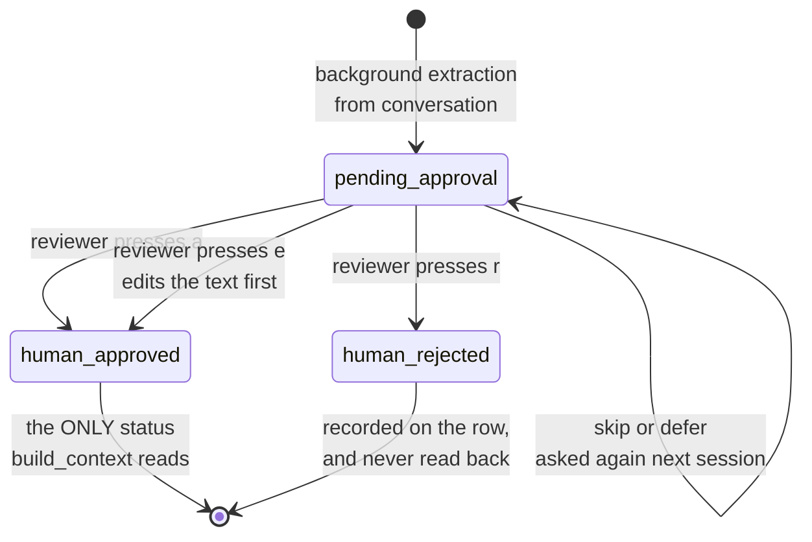

## 1. Executive Summary

npcpy is a CLI-first agent framework — NPCs, teams, jinxes, a shell — MIT
licensed, about 53,000 lines, with roughly 3,500 in `npcpy/memory/`: a knowledge
graph (1,291 lines), a knowledge store (954), graph population (606), a memory
processor (276), search (254) and an index (129).

**It is the clearest instance in this atlas of memory a person approves before
it takes effect.** Extracted candidates are stored with
`status: str = "pending_approval"`. A terminal review loop then walks them one
at a time offering five choices — approve, reject, **edit**, skip, defer, plus
approve-all — printing a tally at the end, and stamping each decision as
`"human-approved"` or `"human-rejected"`. And the gate is real rather than
advisory: `build_context` calls
`self.get_memories(status="human-approved", limit=max_memories)`, so a candidate
nobody has said yes to reaches no prompt.

That combination earns two of the atlas's rarer marks. `trust_state` is a stored
field with four values — `pending_approval`, `auto-extracted`, `human-approved`,
`human-rejected` — of which exactly one is retrievable, so the store genuinely
distinguishes "we have this on record" from "we believe this". `human_review` is
the strongest form of the column: adjudication *before* the memory takes effect,
not a UI for inspecting what already did.

The gap is on the other side of the same mechanism. `human-rejected` is a status
on a row, and no read path filters on it: the same sentence extracted again
arrives as a fresh `pending_approval` candidate and the user is asked the same
question. The rejection is recorded and never used — the quarantine shape this
atlas has recorded before in the OWASP guard, arriving here in a system that
otherwise takes human judgement more seriously than most.

The documentation describes the loop that would close it.
`docs/guides/knowledge-graphs.md` states that approved and rejected memories
*"are fed back as positive and negative examples to future extraction calls,
creating a self-improving quality loop."* The only code that consumes rejections
is `npcpy/ft/memory_trainer.py`, and three things separate it from that
sentence. It runs only inside a fine-tuning job launched with
`strategy == 'memory_classifier'`, so it is an operator action rather than
anything the extraction pass does. Its examples come from the request body —
`training_data = data.get('trainingData', [])` — not from a query against the
store. And it partitions on `status in ['approved', 'model-approved']`, which is
not the vocabulary the store writes: a row carrying the store's own
`human-approved` matches neither, and would be sorted into the *rejected*
bucket. The loop is documented, the trainer exists, and nothing joins them.

## 2. Mental Model

A memory is a *proposal* until a person promotes it. That is a genuinely
different posture from the rest of the corpus, where extraction writes and
retrieval reads and the only question is ranking. Here extraction produces
candidates, review produces beliefs, and the two are different populations in
the same table separated by a column.

The **edit** option is what makes it more than an approve/deny switch. A user can
rewrite the extracted text before approving, and the store keeps both — the row
carries an initial memory and a final memory — so the difference between what
the model heard and what the user meant is preserved rather than overwritten.
Almost nothing else in this atlas keeps the pre-correction text of a corrected
memory.

**Defer** is the other honest affordance. A review queue with no way to say
"not now" gets answered carelessly, and the loop treats deferral as a distinct
outcome in its statistics rather than as a skip.

## 3. Architecture

A JSON-backed store per directory plus a knowledge graph, and no service to run.
The memory processor uses a `queue` and a background thread so extraction does
not block the conversation, which is the right split given a human is going to
be asked about the results later anyway.

The knowledge layer is the larger half — `knowledge_graph.py` at 1,291 lines and
`kg_population.py` at 606 — with concepts, links and a separate index, and a set
of packaged skills (`knowledge_graph_skill`, `knowledge_store_skill`,
`knowledge_index_skill`, `knowledge_sememolution_skill`) exposing them.

## 4. Essential Implementation Paths

- `npcpy/memory/memory_processor.py` (276) — the extraction queue and the review
  loop with its five choices.
- `npcpy/memory/knowledge_store.py` (954) — `add`, `update_memory`,
  `get_memories`, `get_pending`, `build_context`.
- `npcpy/memory/knowledge_graph.py` (1,291) and `kg_population.py` (606).
- `npcpy/memory/search.py` (254), `knowledge_index.py` (129).

## 5. Memory Data Model

`MemoryItem` carries `message_id`, `conversation_id`, `npc`, `team`,
`directory_path`, `content`, `context`, `model` and `provider` — so provenance
is unusually complete for a small store: which model produced it, in which
conversation, for which NPC, in which directory. The stored row adds `status`
and keeps the initial text alongside the final one.

What is missing is a clock pair — everything is record time — and any notion of
a value. Statuses attach to rows, which is what makes the rejection
non-transferable.

## 6. Retrieval Mechanics

`build_context(max_memories=10)` selects approved memories, caps them, and
formats them under a "Local knowledge:" heading, preferring `final_memory` over
`initial_memory` so the human-edited text wins. That is the entire injection
path, and its simplicity is the point: there is no ranking to tune because the
population has already been filtered by a person.

**Scope is recorded and not applied.** `npc`, `team` and `directory_path` are on
every item; `get_memories` filters by status and limit only. A team's memories
and an NPC's are the same pool at read time, which is the "storing a boundary is
not enforcing one" case the rubric names, and the mark is withheld.

Search and the knowledge graph are separate surfaces with their own paths and
were not traced in full here.

## 7. Write Mechanics

Extraction runs on a background thread fed by a queue, so the conversation does
not wait. Nothing reaches a prompt from that path — the write is to the pending
population. The second write is the human decision, which is synchronous, manual
and offline from any conversation.

That two-phase shape has an operational consequence worth stating: memory only
becomes useful when someone runs the review. An unattended npcpy accumulates
candidates and its `build_context` returns nothing.

## 8. Agent Integration

NPCs and teams are the framework's units, jinxes are its tools, and the
knowledge skills package the memory surface for agent use. Memory is not a
service and has no MCP surface here.

## 9. Reliability, Safety, and Trust

Two marks earned, as above.

**No tombstone**, and the near-miss is the report's sharpest point: a system that
has gone to the trouble of asking a human whether to believe something throws
the answer away when the answer is no. Keying the rejection on the normalised
content — the [rejected-value tombstone](../../patterns/rejected-value-tombstone/)
— would cost one hash column and one lookup in the extraction path, and it is the
single change that would take this system from three marks' worth of shape to a
value-keyed rejection the store could act on.

**No bi-temporality, no append-only mutation audit.** `update_memory` moves the
status in place; the previous status is gone, so "when was this approved, and by
whom" is unanswerable even though the decision was deliberate enough to be worth
recording.

## 10. Tests, Evals, and Benchmarks

`tests/test_memory_processor.py` exists and was not run; no memory benchmark, no
retrieval-quality measurement and no published numbers were found. Nothing
asserts that an unapproved memory stays out of `build_context`, which is the one
behavioural claim the whole design rests on and the cheapest negative assertion
available to it.

## 11. For Your Own Build

### Steal

- **Make approval a state the retriever respects, not a workflow step.** One
  `status` column and one `WHERE` in the context builder is the whole mechanism,
  and it is what makes the review real rather than decorative.
- **Offer edit, not just approve and reject.** Most rejected memories are nearly
  right; a user who can fix the wording produces a better store than one who can
  only discard.
- **Keep the pre-edit text.** Initial alongside final tells you where extraction
  is going wrong, which is a signal almost nobody collects.
- **Put defer in the loop.** A queue with no "not now" gets answered by
  approve-all.
- **Record which model produced a memory.** `model` and `provider` on the row
  make an extraction regression attributable after a model swap.

### Avoid

- **Recording a rejection you never consult.** If a user has said no to a
  sentence, the extractor should be told before it asks again.
- **Scope fields that nothing filters on.** `npc`, `team` and `directory_path`
  read like isolation and are not.
- **A design that needs a human and does not say when.** Memory that only works
  after a review session should surface how many candidates are waiting.

### Fit

Take this shape if your memory is small, your user is present, and wrong facts
are expensive — a personal assistant, a research notebook, anything where ten
approved memories beat a thousand extracted ones. It is the right architecture
for exactly the case most of this atlas designs around rather than for.

Do not take it where memory must accumulate unattended, or where the same facts
will be re-extracted often enough that answering the same question repeatedly
becomes the user's whole experience of the product.

## 12. Open Questions

- **How often is the same rejected content re-proposed?** Directly measurable
  from the store and not measured, and it decides whether the review loop is
  sustainable.
- **What is the approval rate?** The loop already tallies approved, rejected,
  edited, skipped and deferred per session; nothing aggregates it over time.
- **Do the knowledge graph and the approved store agree?** `kg_population` runs
  its own extraction, and whether graph concepts inherit the approval gate was
  not traced.

## Appendix: File Index

| Path | Lines | What it holds |
| --- | --- | --- |
| `npcpy/memory/knowledge_graph.py` | 1,291 | Concepts, links, graph operations |
| `npcpy/memory/knowledge_store.py` | 954 | The store, statuses, `build_context` |
| `npcpy/memory/kg_population.py` | 606 | Graph population from conversation |
| `npcpy/memory/memory_processor.py` | 276 | Extraction queue and the review loop |
| `npcpy/memory/search.py` | 254 | Search over the store |
| `npcpy/memory/knowledge_index.py` | 129 | The index |

## History

**2026-09-16** — [`26fc78b5c578b85d4552eabfb0f195cc806927e5`](https://github.com/npc-worldwide/npcpy/commit/26fc78b5c578b85d4552eabfb0f195cc806927e5) — re-pinned after 9 commits. `npcpy/memory/knowledge_store.py` and `tests/test_memory_processor.py` are byte-identical, so both marks rest on unchanged code; `serve.py` gained four net lines around line 4,980, in the streaming endpoint rather than the memory routes. The two anchored lines were checked directly and hold the same code — the `status="human-approved"` read at `:1656` and `approve_memories()`, which shifted to `:5875`. One correction independent of the drift: this report's diagram caption said a rejection stops extraction proposing the same memory again, which is the opposite of what section 1 establishes and of what the code does. The caption and the diagram's terminal label now say what the body says — the rejection is recorded on the row and nothing reads it back. Nothing was installed, built or run.

**2026-09-13** — [`26fc78b5c578b85d4552eabfb0f195cc806927e5`](https://github.com/npc-worldwide/npcpy/commit/26fc78b5c578b85d4552eabfb0f195cc806927e5) — re-read, 61 commits past the previous pin. `npcpy/memory/knowledge_store.py` was substantially rewritten, 202 lines added against 162 removed of 364, and both marks survive it: the four-value status field is intact, `add` still defaults to `pending_approval`, and the context read is still `get_memories(status="human-approved")` at both the store and the server, so admission rather than ranking is still what the status decides. The published criticism also holds, and is sharpened. `docs/guides/knowledge-graphs.md` claims approved and rejected memories are fed back as positive and negative examples to future extraction calls; the only consumer of rejections is a classifier fine-tune reachable through a `strategy == 'memory_classifier'` job, fed from the request body rather than from the store, and partitioning on `['approved', 'model-approved']` — values the store never writes, so a row carrying its own `human-approved` would be sorted as rejected. Evidence records were written for both marks, which the report previously carried none of. Screened again first; nothing was installed and no suite was run.

**2026-07-30** — [`a31ba52203062f7a586a901f6870176bf3961707`](https://github.com/npc-worldwide/npcpy/commit/a31ba52203062f7a586a901f6870176bf3961707) — first reading.
