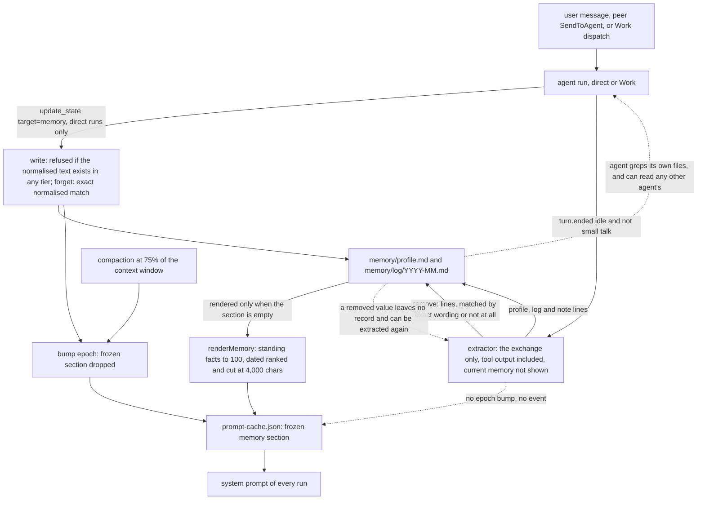

## 1. Executive Summary

Nuum is a local-first Electron desktop for persistent AI agents. Each Agent has its own append-only JSONL transcript, a memory directory, a scratch workspace and a persistent shell; agents message one another asynchronously, and join shared *Works* with a timeline, a task board and handoffs. Apache-2.0 with a `NOTICE`, four commits by one author between 3 and 6 September 2026 (UTC), 13,968 lines of TypeScript outside tests and 4,880 in 31 test files. Code comments are in Chinese; every model-facing prompt is in English.

The memory is small and deliberate — `packages/host/src/memory.ts`, 327 lines. Two kinds of Markdown file per agent, `profile.md` for standing facts and `log/YYYY-MM.md` for dated facts and notes, are the only source of truth; the module header rules out a `memory` transcript event as a second one (`memory.ts:4-10`). Two writers reach them: the `update_state` tool the agent calls, and an extractor that runs after every completed turn and emits `profile:`, `log:`, `note:` and `remove:` lines. The read side is a rendered `## Memory` section in the system prompt, plus a sentence telling the agent where the files are so it can grep them.

**What is technically interesting is the prompt-cache discipline.** The memory section is frozen per *epoch* in `prompt-cache.json` so the system-prompt prefix stays byte-identical between turns. An explicit write bumps the epoch, because a user who says "remember this" expects it on the next turn; background extraction deliberately does not, because it runs every turn — and a committed test pins both halves. The consequence is the finding that matters most here: a fact the extractor writes, *or removes*, is on disk at once and absent from the injected section until the next epoch, which comes from compaction at 75% of the context window or from an explicit write or forget that changed something.

**The weak part is correction.** `forget` deletes lines whose normalised text matches exactly, and the extractor's `remove:` lines have to reproduce a recorded fact's wording without being shown the memory — its input is the exchange alone. Nothing records a removed value, so the next exchange can extract it again; nothing records a line's source, so a peer agent's claim or a file the agent read is stored like the user's own words. The design earns none of the seven capability marks.

## 2. Mental Model

A memory is one self-contained sentence, filed in a tier: `profile` (a standing fact — a preference, a name, how a project works), `log` (a dated decision or event) or `note` (a minor dated observation). It becomes a memory when either writer appends it and no existing line in any tier has the same normalised text. It is believed unconditionally: there is no status, no confidence and no source. It stops being a memory only when a `forget` names it with the same normalised text, or when its agent is deleted. Nothing supersedes, decays or expires it; recency only decides whether a dated line makes the injected section.

What the model *sees* is a second state layered on top: the section rendered at the start of the current epoch. The files and the section agree after an explicit write and after compaction, and drift apart after every extraction in between.



## 3. Architecture

Three processes over stdio JSON-RPC: the Electron main process (window, tray, API keys in a `secrets.bin` encrypted with Electron's `safeStorage`), the **Host** (`packages/host`), which owns every piece of product state, and the **Kernel** (`packages/kernel`), which runs the model loop and the local tools and never owns agent state. Everything persists under one data directory — `userData/data` from the desktop, `~/.nuum` when the Host runs alone — guarded by a single-instance `host.lock`. Per agent: `profile.json`, `settings.json`, `transcript.jsonl`, `memory/`, `scratch/`, `terminals/`, `prompt-cache.json`, `tool-approvals.json` and `read-cursor.json`, all laid out by `agent-store.ts`. Works keep their own append-only timeline in a separate store.

There is no database, no embedding model and no index. Search is the Kernel's `grep` tool, which spawns ripgrep (`packages/tools/src/search-tools.ts:59-126`). Model calls go to OpenAI, Anthropic or DeepSeek with the user's key; the extractor uses the agent's own model.

### Deployment and ergonomics

`pnpm install` and `pnpm dev` from source; Node 22 and pnpm 10. Nothing to stand up beyond the app, and the memory is two Markdown files a person can read, edit or version by hand — with the caveat that a hand edit, like an extraction, reaches the prompt only at the next epoch. Every turn needs an API key for the agent's provider (`packages/host/src/precheck.ts`), and both writers run inside or after a turn, so nothing is remembered without one.

## 4. Essential Implementation Paths

- **Explicit write and forget.** `update_state` with `target: "memory"` (`packages/protocol/src/product-tools.ts:30-49`) reaches `HostRuntime.updateState` (`packages/host/src/runtime.ts:1057-1102`). A `forget` calls `MemoryStore.forget` and bumps the epoch only if a line was removed (`:1092-1097`); a `write` calls `MemoryStore.write` and bumps only if something was written (`:1098-1101`). The tool is registered for direct runs only (`delegated-tools.ts:65`, `:134`).
- **Store.** `MemoryStore.write` (`memory.ts:50-80`) normalises the fact, refuses it if its `dedupeKey` matches any existing line in any tier (`:53-56`), and appends it to `profile.md` or under `## Facts` or `## Notes` in the month's log with the date. `forget` (`:83-98`) rewrites every file without the lines whose `dedupeKey` equals the target's.
- **Extraction.** On `turn.ended` with status `idle`, `onKernelEvent` backgrounds `extractMemory` and immediately pumps the next queued wake (`runtime.ts:1613-1633`). `extractMemory` (`:1519-1543`) finds the last `user` or `wake` event, skips it if `isMemorableExchange` says small talk, sends every event since then through `assembleContext` with an empty system prompt to a tool-less `summarize` call under `EXTRACTION_PROMPT` (`memory.ts:230-248`), parses the prefixed lines (`:255-268`), and applies all removals, then all writes (`runtime.ts:1540-1542`).
- **Injection.** `buildSystemPrompt` (`runtime.ts:1258-1340`) uses the frozen section from `prompt-cache.json` if there is one and otherwise renders `renderMemory(await new MemoryStore(memoryDir).all(), memoryDir)` (`:1276-1277`) and freezes it (`:1326-1332`). The same function builds the prompt for Work runs, and passes the memory section whatever the run kind (`:1298`).
- **Epoch.** `bumpPromptEpoch` writes `{ epoch: next }` and so drops both frozen segments (`agent-store.ts:442-446`). Its three callers are the two memory branches above and `compact` (`runtime.ts:1483-1513`), which the launch path calls when the assembled context exceeds 75% of the model window (`:788-804`).
- **Model-side reads.** The rendered section names the directory and says to grep it (`memory.ts:167-175`). The sandbox allows `read-file` and `list-directory` anywhere under the agents root and denies writes there (`packages/sandbox/src/create-sandbox.ts:97-105`).

## 5. Memory Data Model

| File | Shape |
| --- | --- |
| `memory/profile.md` | `# Standing facts`, then `- <fact>` per line; no date |
| `memory/log/YYYY-MM.md` | `# YYYY-MM`, `## Facts` and `## Notes`, then `- YYYY-MM-DD · <fact>`; the section heading is the tier |
| `prompt-cache.json` | `epoch`, the frozen profile render and identity, and the frozen memory render |
| `transcript.jsonl` | the agent's append-only event log: `user`, `wake`, `assistant`, `tool`, `message`, `profile`, `compact` |

The parser reads any `- ` line as a fact and any `YYYY-MM-DD · ` prefix as its date (`memory.ts:288-296`). The date is the UTC date of writing (`:321-327`), used for filing and for recency, not a time the fact was true. There is no id, so a fact's identity is its normalised text: `normalize` collapses whitespace and strips a bullet and a final full stop, and `dedupeKey` lowercases and drops punctuation (`:271-286`). A tier is importance, not status.

The memory directory is per agent. There is no scope key on a line and none on a read: the partition is the directory.

## 6. Retrieval Mechanics

There is no retriever. `renderMemory` (`memory.ts:132-177`) puts the first 100 standing facts in file order, then ranks dated lines by `log2(importance) − age_days / 30`, with importance 2 for a `log` line and 1 for a `note` (`:184-188`) — a fact outranks a note until it is thirty days older — keeps lines in rank order until one does not fit a 4,000-character budget at `length + 16` each (`:138-145`), and re-sorts the kept lines by date. A count of dated lines left out, and the directory path, close the section.

The standing-fact cut is not counted. `slice(0, PROFILE_LIMIT)` at `:133` keeps the *oldest* hundred, and the "did not fit" line counts only dated entries (`:163-166`), so the hundred-and-first standing fact — the newest — is dropped from the section with no count and no mention. The test that pins the overflow notice is written against dated lines only (`memory.test.ts:116-126`), beside a comment calling silent truncation the worst option.

Beyond the section, the agent reads or greps the Markdown itself. That is lexical search over a few files, chosen by the model, with the same ripgrep the agent uses on code.

## 7. Write Mechanics

**Two writers, one rule.** A fact is written only if no line anywhere has its normalised text, so re-extraction of a known fact is idempotent and a fact filed as `profile` is not filed again as `log`. There is no update: changing a fact is a forget and a write, and the extractor's contract for that is a `remove:` line naming the old fact, applied before the new lines.

**The extractor cannot see what it is removing.** Its messages are the events since the last prompt, with an empty system prompt stripped off (`runtime.ts:1530-1537`); the memory section and the files are not in them. A `remove:` line therefore takes effect only if the model reproduces a recorded line's wording up to case and punctuation — the committed parser test uses `remove: The user prefers npm`, which matches only a line that says exactly that. A paraphrase removes nothing, and `extractMemory` reports nothing either way.

**Gate.** `isMemorableExchange` (`memory.ts:213-218`) skips a fixed list of acknowledgements in English and Chinese and requires more than ten estimated tokens or a question mark, where the estimate counts one token per CJK character and one per four other characters (`:225-228`), so a short Chinese instruction is not mistaken for small talk. A cancelled or errored turn is not mined.

**Input.** Every `wake` counts as a prompt: a peer's `SendToAgent` message (`runtime.ts:1172-1184`) and a Work dispatch (`:645-658`) are mined like a user's message, and tool results — file contents, shell output — are in the extractor's input verbatim (`context.ts:220-231`). The model-facing wake text says it is not from the user (`context.ts:176-195`); the stored line does not.

### Operational cost

- **Not blocking.** The extraction runs after `turn.ended`, and the next queued run starts at once (`runtime.ts:1628-1632`).
- **Lag.** A written line is on disk after one model call, seconds after the turn; grep sees it then. The injected section shows it at the next epoch, which for a lightly used agent may be the next explicit `update_state` rather than any compaction.
- **Per-turn bill.** One extra model call per non-small-talk turn, over the whole exchange since the last prompt with no cap — a turn that read large files sends them again. No pass rewrites the store.
- **Read side.** At most 100 standing facts and 4,000 characters of dated lines, placed in the system prompt before the teammate directory and frozen so the prefix cache holds.

## 8. Agent Integration

Memory is Nuum's own, not a library for other agents. The model gets `update_state` with `target: "memory"` and `action: "write" | "forget"`, with guidance in the section to record what "will still matter in a later conversation" and not what can be read off disk (`memory.ts:167-175`); like every delegated tool it goes straight from the Kernel to the Host with no approval card (`packages/kernel/src/loop.ts:167-168`). Everything else is automatic. There is no memory view in the UI and no memory method in the Host's RPC contract; a person reaches the memory by opening the files. Adapting the design elsewhere means lifting `memory.ts` and the epoch cache, which is about 400 lines and has no dependencies.

## 9. Reliability, Safety, and Trust

**Background changes, including deletions, lag the prompt.** The extractor's writes and removals do not bump the epoch; `run.test.ts:846-873` asserts that a fact extracted after the section was frozen is on disk and that the next system prompt still says *"not recorded anything"*. The same holds for a removal: a fact the extractor deleted from disk stays in the injected section until the next epoch. The design trade is stated in the code and is defensible for additions. For removals it means "forget that" said in passing is honoured on disk and not in what the model is shown.

**A removed value can come back.** `forget` deletes the line and keeps nothing (`memory.ts:83-98`); the next exchange that mentions the old fact can extract it again, and the write-time duplicate check has nothing to compare it against.

**No provenance.** A line has no source. Peer messages, Work instructions and tool output all feed the extractor, and a prompt-injected sentence in a file the agent read is one `profile:` line away from being a standing fact in every later prompt.

**Private memory is readable by teammates and present in Work runs.** File tools may read anywhere under the agents root — tested as intended in `create-sandbox.test.ts:66-72`, *"other agent stores are readable but never writable"* — and that agents-root rule does not depend on the run kind, so a Work run that has `read` or `grep` through a knowledge entry (`runtime.ts:816-827`) can read another member's `memory/`. The memory section is rendered into Work runs as into direct ones, and extraction runs after Work runs as after direct ones. The README's rule that shared Work context must not expose an Agent's private memory is, at this commit, left to the model.

**The read-only rule is a file-tool rule.** The prompt calls other agents' writable state a hard limit no approval bypasses (`prompt.ts:75-76`); `shell` is authorised on the command's first token (`create-sandbox.ts:246-255`, `:301-305`) and is not path-checked, so an approved `sed` or standing `always` permission can write any memory file.

**Writes are not atomic and not serialised.** `writeFileEnsured` is a plain `writeFile` (`memory.ts:316-319`), where the same store writes JSON through a temporary file and a rename (`agent-store.ts:583-588`); a crash mid-write can truncate `profile.md`. Both writers read, modify and rewrite a whole file with no lock, and the extractor for one turn can overlap an `update_state` in the next run, which starts while it is still waiting on its model call.

**Capability marks, all withheld.**

- `tombstone` — `forget` removes the line and records nothing; no path reads a removed value.
- `trust_state` — tiers are importance weights in ranking; no field withholds a line from being treated as true.
- `bitemporal` — one date, the UTC date the line was written.
- `scope_enforced` — the per-agent directory is a physical partition with no key on a line and no predicate on a read, and the sandbox lets every agent read every directory.
- `audit_log` — deliberately absent: the header refuses a `memory` event (`memory.ts:8-9`) and the `summarize` call that extraction uses emits no event and writes nothing (`packages/kernel/src/summarize.ts:8`). An explicit `update_state` call survives as a `tool_call` and a `tool` result in the transcript; the extractor's writes and removals, the high-frequency path, leave no record at all.
- `human_review` — no surface; a person can edit the files, which is not a review step.
- `negative_eval` — see section 10.

## 10. Tests, Evals, and Benchmarks

Seventeen cases in `memory.test.ts` and five memory cases in `run.test.ts` among its forty-nine, under `node:test` through `tsx --test`. There is no CI configuration in the tree. I did not run anything; the manifests and lockfile are inside the seven-day cooldown.

The store tests cover filing by tier, the round trip of the tier through the section heading, idempotence across case, punctuation and tier, forget across files, an honest zero on a forget that matches nothing, rendering order and the dated overflow notice, the small-talk gate in both scripts, and the extraction parser. The runtime tests are the stronger half: an explicit write bumps the epoch and appears in the next prompt (`run.test.ts:760-784`); a duplicate write does not burn an epoch (`:786-806`); an extracted fact lands on disk, does not bump the epoch, and uses a tool-less call rather than a second run (`:846-873`); small talk and a cancelled turn spend no extraction call (`:875-902`).

**`negative_eval` is withheld.** The one negative case on the memory path, *"forget removes a fact wherever it was filed"* (`memory.test.ts:69-77`), writes one fact, forgets it, and asserts `all()` is empty and the log no longer contains it. The `removed: 1` return proves the fact was present, but nothing else is in the store, so an `all()` that returned nothing would pass; adding a second fact and asserting `all()` returns exactly that one would make it the case the mark asks for. No test exercises `forget` or a `remove:` line through the runtime, and none covers memory in a Work run.

No paper, and no benchmark or recall evaluation.

## 11. For Your Own Build

### Steal

- **Freeze the memory section per epoch, and choose which writers break the cache.** User-requested writes invalidate at once; high-frequency background writes wait for compaction. It keeps the prefix cache warm and is two small functions and a JSON file.
- **Say what was left out.** Ending the injected section with a count of entries that did not fit and the path to grep them tells the model its view is partial.
- **Estimate tokens, not characters, in any length gate** that sees CJK text.
- **Deduplicate across tiers**, so the same fact extracted as a profile item and a log item is stored once.

### Avoid

- **Asking an extractor to contradict memory it cannot see.** Put the current facts, or at least the candidates it may remove, in its input, or give removals a fuzzy match with a confirmation.
- **Exempting deletions from the cache bump.** A background addition can wait; a background removal should invalidate the frozen section, or the prompt keeps asserting what the store no longer holds.
- **Storing a fact without its source** when peers, shared rooms and tool output all feed the same extractor.

### Fit

A clear, readable reference for the simplest durable agent memory worth having — Markdown, two writers, one bounded section — inside a desktop product whose real subject is multi-agent coordination. Worth reading for the epoch cache and the prompt text. Not a memory to depend on where corrections must stick, where agents must not read one another's memory, or where facts arrive from sources other than the user; at four commits it is an early product, not a component.

## 12. Open Questions

- How often, on real use, the extractor's `remove:` lines match anything, given they must reproduce a line it has not been shown.
- Whether a lightly used agent ever reaches compaction, or whether its extracted facts reach the prompt only when it next calls `update_state`.
- Whether the design documents the code cites by section number (`§8`, `§2.Q4`, `§6.1`) exist elsewhere; they are not in the tree.

## Appendix: File Index

- Memory store, rendering, gate, extraction prompt and parser: `packages/host/src/memory.ts`. Tests: `packages/host/src/memory.test.ts`.
- Tool handler, extraction, prompt building, compaction, Work dispatch: `packages/host/src/runtime.ts`. Tests: `packages/host/src/run.test.ts`.
- Per-agent paths, prompt cache and epoch, transcript: `packages/host/src/agent-store.ts`.
- Prompt segments: `packages/host/src/prompt.ts`. Context assembly: `packages/host/src/context.ts`.
- Tool schema and run-kind gating: `packages/protocol/src/product-tools.ts`, `packages/host/src/delegated-tools.ts`.
- Sandbox: `packages/sandbox/src/create-sandbox.ts` and its test. Search tools: `packages/tools/src/search-tools.ts`. Summarize call: `packages/kernel/src/summarize.ts`.

**Searches recorded for the negative claims**

```sh
rg -n 'z.literal\("memory"\)' packages/protocol/src/transcript.ts          # 0: no memory event type in the transcript
rg -n "bumpPromptEpoch\(" packages --glob '!*.test.ts'                      # memory forget, memory write, compact: extraction never bumps
rg -n "new MemoryStore" packages --glob '!*.test.ts'                        # three sites: update_state, buildSystemPrompt, extractMemory
sed -n 1519,1543p packages/host/src/runtime.ts | rg -n "runContext|kind"    # 0: extraction does not check the run kind
rg -n "lock|rename|\.tmp" packages/host/src/memory.ts                       # 0: no lock and no atomic write on memory files
rg -n "PROFILE_LIMIT|hidden" packages/host/src/memory.ts                    # the overflow count covers dated entries only
rg -n -i "memory" packages/ui/src apps/desktop/src --glob '!**/i18n/messages.ts'   # two strings, no memory view
rg -n -i "memory" packages/protocol/src/host-contract.ts packages/host/src/server.ts   # 0: no memory RPC method
rg -n -i "memory" packages/host/src/work-runtime.test.ts packages/host/src/work-store.test.ts   # 0: no memory case for Work runs
rg -n '"forget"|removals' packages --glob '*.test.ts'                       # parser tests only: no runtime forget or remove case
rg -n -i "arxiv|bibtex|@article|@misc|citation|doi\.org" . --glob '!pnpm-lock.yaml'   # 0: no paper
ls .github                                                                  # absent: no CI
```

## History

**2026-09-11** — [`51c9ec346b03e9c7885e4a81784bca14afae3c80`](https://github.com/stevefunng/Nuum/commit/51c9ec346b03e9c7885e4a81784bca14afae3c80) — first reading. Screened with `scripts/screen_repo.py`: no auto-running configuration and no build-time execution path; eight manifests and `pnpm-lock.yaml` inside the seven-day cooldown, four manifests with floating ranges in one pnpm workspace under that lockfile, and an `AGENTS.md` read as data. Read only, nothing built or run.
