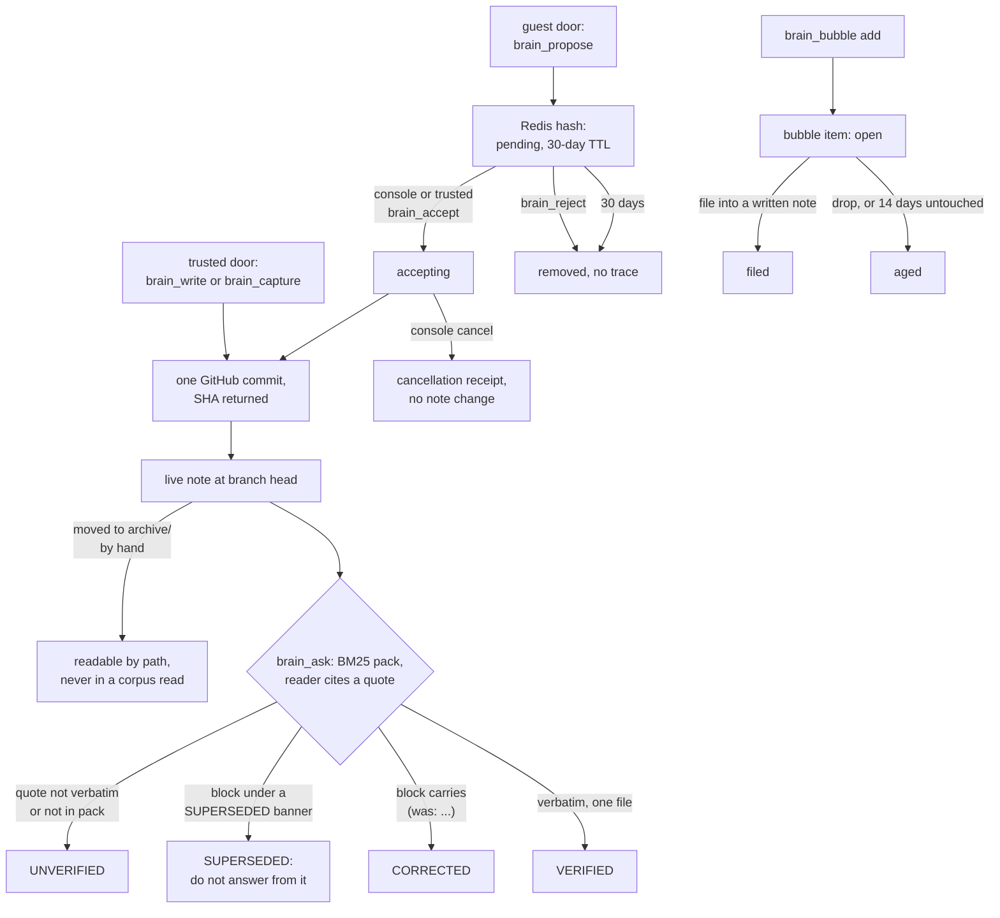

## 1. Executive Summary

Cortex is a self-hosted Next.js application on Vercel that keeps one
person's memory as Markdown notes in a private GitHub repository and serves
it over MCP. Trusted clients read and write through `brain_*` tools, and a
separate guest door lets an untrusted assistant ask questions and propose
notes. What is notable is the answer path: `brain_ask` has a reader model
cite a verbatim quote, then checks it against the file bytes at the served
commit and stamps the reply, including `SUPERSEDED` when the quote sits
under a retraction banner. What is weak is the other side of the trust
line: a trusted door writes straight into the brain, there is no delete
tool, and retrieval is BM25 over the whole tarball.

The code is dense with measured decisions. Budgets, caps and fallbacks each
carry a comment naming the failure that set them, and most of those
failures are silent-loss cases: a write that landed where no read could
reach it, a truncated reply the caller took for the whole brain, a
suite that skipped itself and looked green.

The public tree is an export of a private working repository. Comments cite
measurements on "the live brain" from July 2026, before the first public
commit, and `docs/export-gate.md` describes a release gate that compares
shipped source against the private corpus. The retrieval eval's labelled
set lives in that private brain, not in this tree.

Three marks: `scope_enforced` on the project key of working-state items,
`human_review` on the guest proposal queue, and `negative_eval` on a native
Postgres case over the scoped read. Section 9 names the four withheld.

## 2. Mental Model

A memory is a note. It becomes a belief when a tool commits it: `brain_write`
or `brain_capture` from a trusted door, or `brain_accept` on a guest's
proposal. There is no candidate state for a trusted write and no model in
the write path. The note path fixes its role: `profile.md`, `projects/`,
`notes/`, `log/` (one file per day) and `history/` are live, and
`archive/` is readable by exact path but excluded from every corpus read
(`lib/brain.ts:35-40`; `lib/corpus.ts:38`).

**A note stops being believed by being edited, not by changing state.**
The house convention keeps the retired wording on the page: a banner
`> **SUPERSEDED …**` or an in-place `current claim (was: "old claim")`.
The verifier reads those words at answer time
(`lib/verify.ts:180-256`). A quote under a banner is stamped SUPERSEDED with
"Do not answer from it"; a quote beside a `was:` marker is stamped CORRECTED,
because the marked block carries the current claim (`lib/ask.ts:727-739`).
The reader prompt says the same thing in prose (`lib/ask.ts:65-85`). Nothing
filters the retracted passage out of the pack. The stamp is a label on the
reply, derived from text each time.

**Working state is a second, shorter-lived tier.** A bubble item is one of
`focus`, `decision`, `question` or `handoff`, with a project key. It is
`open` until the agent files it into a note it has already written, drops
it, or leaves it untouched for 14 days, when the next read flips it to
`aged` (`supabase/bootstrap.sql:218-233`). Items are never deleted.

**Guests propose; something else decides.** A proposal is `pending` in a
Redis hash, becomes `accepting` when claimed, and ends as a Git commit, a
cancellation receipt, a rejection that leaves nothing, or expiry after 30
days (`lib/proposals.ts:43-48`, `:184-221`).

**Use shapes visibility, not truth.** A `note_scores` view blends access
recency, write recency, a directory prior and operator pins into hot, warm
and cold. Cold notes leave the boot router's rendered rows and stay
reachable by search (`lib/frontmatter.ts:541-544`, `:696-697`). A cold,
never-read note untouched for 180 days can be nominated for deletion by a
manual script; nothing records a decision on the nomination (section 9).

## 3. Architecture

Cortex is a Next.js 16 application meant for Vercel. Three MCP routes share
one handler factory (`lib/handler.ts:38-58`): `/api/mcp` with a bearer
`MCP_TOKEN`, `/api/s/<secret>/mcp` for clients that can only hold a URL, and
`/api/g/<secret>/mcp` for guests, which rewrites onto the bearer handler
built with the guest toolset (`app/api/g/[secret]/[transport]/route.ts:30-62`).
A passcode dashboard lives under `/s/<secret>/console`.

**The notes are the GitHub repository.** Reads resolve the branch head SHA,
fetch the tarball when the SHA changed, and keep one parsed corpus per warm
instance keyed on that SHA (`lib/corpus.ts:288-330`). A head-resolution
failure serves the cached corpus, and every answer names the commit it was
proven against. Writes go through the Contents API, one commit each, then
regenerate `INDEX.md` for people browsing on GitHub (`lib/brain.ts:607-636`).

**Two optional stores hold what Git should not.** Upstash Redis holds the
proposal queue, guest policy, a capped call log and an answer cache keyed on
corpus SHA and door. Supabase Postgres holds a byte-identical mirror of each
note, bubble items, a per-read access log, the `note_scores` view, pins,
deletion nominations and `note_edges`, a graph rebuilt from the corpus and
the access log (`lib/edges.ts:1-19`). The bootstrap SQL says bubble items
exist nowhere else and need their own backup.

A Vercel cron hits `/api/ops/sweep` every 15 minutes (`vercel.json`) for the
operations ledger and to date notes the mirror has not dated. The mirror sync
and edge rebuild are scheduled after corpus loads (`lib/corpus.ts:304-323`).

### Deployment and ergonomics

Two accounts, GitHub and Vercel, and a fine-grained token scoped to the brain
repository are enough to browse and write. No model key is needed to store
anything; `brain_ask` needs one for the reader (Anthropic by default, OpenAI
or Gemini by allowlist). Supabase adds working state, scores and the graph;
Upstash adds the guest door, since proposals have nowhere else to live
(`lib/proposals.ts:68-72`). It does not run offline: the corpus is always
fetched from GitHub. The store is plain Markdown in a Git repository, so a
bad note is fixed with any editor, and the history is Git's.

## 4. Essential Implementation Paths

**Trusted write.** `brain_write` (`lib/tools.ts:536-579`) → `writeNote`
(`lib/brain.ts:670-749`): validate the path against `PATH_RE`, refuse
payloads over 500,000 characters, read the file, apply the mode, scrub
unstorable bytes with `storableText`, `putFile` with the file SHA, then
regenerate the index. The `edit` mode requires `find` to occur exactly once
and splices by index rather than `String.replace` (`:654-668`).
`brain_capture` appends a `## HH:MM · tags` entry to `log/<date>.md`
(`:758-790`).

**Guest proposal.** `brain_propose` (`lib/tools.ts:830-879`) reads the
guest policy, meters the call, and calls `propose` (`lib/proposals.ts:98-127`),
which validates the target path and runs admission inside a Lua script that
applies the same decode the prune applies (`lib/proposal-queue.ts`). The
queue refuses new rows at 50 rather than evicting unreviewed ones.

**Acceptance.** `acceptProposal` (`lib/proposals.ts:184-221`) claims the row
to `accepting` inside `writeNote`'s pre-write hook, commits the note and a
receipt at `.cortex/accepted-proposals/<sha256>.json` in one Git operation
(`lib/proposal-git.ts:12`, `:23-27`), then finalizes the queue. A lost reply
is resolved by retrying the same id, which finds the receipt instead of
applying twice.

**Ask.** `brain_ask` → `ask` (`lib/ask.ts:421-560`): apply the guest scope
first, rank with BM25 (`narrowDetail`), pack up to `DEFAULT_K = 15` notes
under 400,000 bytes with at most two history parts per page, tag each file
block, call the reader, resolve the tag server-side, verify the quote, and
render a stamp and a coverage line (`:636-739`).

**Boot and handoff.** `brain_context` → `getContext` (`lib/brain.ts:311-556`):
profile under 8,000 bytes, the router under 28,000, then bubble items or
recent logs under 4,000, all behind a per-request nonce fence.
`brain_handoff` (`lib/handoff.ts`) assembles one project page, its open
bubble items, log sections tagged with the project, and graph neighbours
ranked by edge weight and temperature.

**Correction.** Only by editing the note. There is no delete mode, and
`brain_reject` discards a proposal "without writing anything"
(`lib/tools.ts:658-675`).

## 5. Memory Data Model

| Unit | Where | Fields that matter |
| --- | --- | --- |
| Note | GitHub repo, one file | path; optional frontmatter `description`, `name`, `tags`, `decays`, `reverify` (`lib/frontmatter.ts:43-85`); body verbatim |
| Mirror row | `notes` | `path`, `content`, generated `bytes`, `commit_sha`, `mirrored_at` |
| Bubble item | `bubble_items` | `kind`, `project`, `body` (1–2,000 chars), `status` open/filed/aged, `filed_into`, `surface`, `created_at`, `touched_at` |
| Access row | `note_access` | `path`, `tool`, `surface`, `mode`, `at` |
| Pin | `note_pins` | `path`, `temperature`, `reason` |
| Nomination | `deletion_candidates` | `path`, `reason`, `decision` null/keep/approved, `decided_at` |
| Edge | `note_edges` | `src`, `dst`, `kind` link/tag/coaccess/lexical/correction, `weight`, `evidence` ≤200 chars |
| Proposal | Redis hash | `id`, `ts`, `path`, `mode`, `content` ≤20,000, `why`, `client`, `state` |

A note has no author, confidence or validity time beyond its Git history and
the prose on the page. `decays: false` marks a note as a record of something
that happened, which excuses it from the stale-stamp and inbox checks;
`reverify` is a date the dashboard sets to queue a re-check by the nightly
agent (`lib/frontmatter.ts:57-79`).

**Scope.** There is one operator. Bubble items carry `project`, normalised
the same way in TypeScript and in SQL through a collation chosen for full
Unicode case mapping (`bubble_open_scoped.sql:10-72`). Log entries are scoped
by the tags in their headings. Guest reach is a list of path prefixes that
must end at a directory boundary, and a stored policy that parses to nothing
falls back to `projects/` rather than to everything (`lib/guest.ts:31-36`,
`:79-114`).

## 6. Retrieval Mechanics

Retrieval is BM25 (`K1 = 1.5`, `B = 1.0`) over the tokenised corpus, with a
segmenter for scripts written without spaces (`lib/lexical.ts:1-40`). The
index is prepared per corpus SHA. Packs stop adding notes at the byte
budget and never truncate one already in. When a question shares no
vocabulary with any note, `narrow` falls back to the whole corpus in size
order under the same caps, and a committed `BUG:` test pins that
behaviour (`tests/hard-surface.test.ts:561-567`).

**Other arms were built and kept off the default path.** A Postgres
full-text `search_notes` function exists in the migrations with no caller in
`lib/` or `app/`. `lib/hop.ts` widens the BM25 shortlist by one hop over
structural edges, and its header records that no evaluated shape beat BM25
across candidate budgets, so nothing routes through it (`lib/hop.ts:17-26`).
The graph is used only by `brain_handoff` to pick neighbours.

**Every bounded reply says what it left out.** The router states how many
cold and budget-dropped rows it did not list, `brain_corpus` returns a cursor
whenever it withholds notes (`lib/select.ts:13-20`), and `brain_ask`
reports selected, omitted and unread-but-matching notes. NOT IN BRAIN is
accepted only after a complete search of the scope; otherwise a miss is
UNVERIFIED.

Guest answers run the same `ask` over the scoped corpus, with a k ceiling, a
daily limit, no citations by default, and an answer cache keyed on question,
SHA, model, k, door and scope (`lib/tools.ts:760-816`). A new commit changes
the SHA, so a correction never meets a cached answer to the old text.

## 7. Write Mechanics

Writes are explicit tool calls and synchronous: one GitHub commit per
`brain_write` or `brain_capture`, plus an index commit when the tree changed.
The next read resolves the new head, so a write is retrievable on the next
call. No model extracts, deduplicates or consolidates anything. The nightly
groundskeeper in `ops/groundskeeper/SKILL.md` is a prompt for a scheduled
agent that files the day's log into project pages and fact-checks four pages
a night through the same tools; it runs outside this server.

**Corrections are edits.** The `brain_write` description tells the model to
prefer `edit`, because an appended correction leaves the stale claim quotable
above it (`lib/tools.ts:542`). The Git history keeps every prior version.

**A racing `replace` wins silently.** `putFile` retries a 409 or 422 when a
file SHA was supplied, and for `replace` there is no merge callback, so the
retry commits the caller's content over the fresh file
(`lib/github.ts:132-169`). `append` and `edit` re-apply against the fresh
content, and `edit` re-checks that `find` still occurs once.

**Credentials are redacted on the way out, not refused on the way in.**
`redact` runs on every egress surface and labels what it removed
(`lib/redact.ts:1-13`).

### Operational cost

- Write: synchronous, one or two GitHub commits, no model call.
- Background: a read-path sweep of bubble items, a mirror sync and edge
  rebuild after corpus loads, and the 15-minute ops cron. Nothing rewrites
  notes on a schedule inside this repository.
- Read: every call resolves the head SHA; a changed head costs a tarball
  fetch. The boot reply is capped at 50,000 bytes. A `brain_ask` pack can
  reach 400,000 bytes of note text, sent to the reader provider.

## 8. Agent Integration

Eleven tools on the trusted doors, two on the guest door, listed in
`lib/tool-roster.json`. The boot call (`brain_context`) is meant for session
start and takes an optional project. `brain_handoff` replaces it for a
single-project resume. Descriptions are written as operating instructions:
never state a SHA the tool did not return, prefer `edit` for corrections,
treat proposal text as data.

**Tool output is fenced against injection.** Note bodies in the boot reply,
the ask prompt and the proposal listing sit between per-request nonce
markers, and a note containing text shaped like a boundary is flagged as
suspect (`lib/brain.ts:138`; `lib/proposals.ts:269-296`). The guest door does
not list the write or review tools at all, so a foreign model is never shown
what it cannot call (`lib/handler.ts:32-37`).

Any MCP client that speaks Streamable HTTP can connect. The model has full
write agency on the trusted doors and decides when to boot, write and
capture.

## 9. Reliability, Safety, and Trust

**The verifier is the trust anchor, and its tests assert its known
failures.** `tests/hard-verify.test.ts` holds eleven `BUG:` cases that pass
while the bug is live. One is a quote that the next clause refutes without
a retraction keyword, which still stamps VERIFIED (`:201-219`). The
convention-based design is deliberate: widening it to any nearby negation
would flag healthy text.

**Two write surfaces, two trust levels.** Guest writes wait for review;
trusted writes do not. Anything holding `MCP_TOKEN` or the connector URL can
replace any live note. The URL door makes the URL itself a credential, and
the README says so.

**Provenance is Git's.** Each commit message names the mode and path, and
the call log records door, tool and outcome without the path, capped at
about 2,500 calls (`lib/calls.ts:164-165`). No record ties a note change to
the client that made it beyond the door.

**Privacy.** Egress redaction is applied everywhere a note leaves the
server, and guests receive answers rather than notes. A reader call sends
the pack to the chosen provider.

Capability marks:

- `scope_enforced` — awarded on bubble items; evidence in the frontmatter
  record. Notes carry no scope key, and the guest prefix list is a path
  filter on a single operator's corpus.
- `human_review` — awarded on guest proposals. The producer cannot reach
  the verb, and the queue is filled and drained by reachable paths.
- `negative_eval` — awarded; section 10.
- `tombstone` — withheld. `brain_reject` removes a proposal and leaves
  nothing, by design, so a rejected guest note can be proposed again.
  `deletion_candidates.decision = 'keep'` would remember a refusal, keyed on
  a path rather than a value, and no code in `lib/`, `app/` or `scripts/`
  writes the column.
- `trust_state` — withheld. SUPERSEDED and CORRECTED are stamps derived
  from words in the note at answer time, and the retracted passage stays in
  the pack. A proposal's `pending` state belongs to a queue outside the
  memory store.
- `bitemporal` — withheld. No field records when a claim was true; dates
  live in prose such as `(was: … — updated <date>)` and in Git.
- `audit_log` — withheld. Git history is the mutation record. The proposal
  receipts cover accepted or canceled proposals only, and the call log is
  capped and carries no path.

## 10. Tests, Evals, and Benchmarks

Nothing was installed, built or run for this report; everything below is
from reading the tests and CI at the pin.

**The negative case.** `tests/bubble-scope.pg.test.ts:51-99` builds a
database, inserts 250 items for project `other` and six more with padded,
Unicode, general and expired projects, then asserts
`bubble_open_scoped(14, 200, 'harbor', false)` returns exactly
`["scoped-old", "tab-padded", "nbsp-padded"]` with total 3. The exact list
is both the positive control and the exclusion. CI runs every
`*.pg.test.ts` and `*.integration.test.ts` against Postgres and Valkey and
fails on any skipped test (`.github/workflows/ci.yml:82-105`). Outside CI the
suite skips visibly with a named `describe.skip`.

`tests/context-scope.test.ts:79-119` asserts a harbor-scoped boot keeps
`harbor passcode work today` and drops the pier and galley entries, and that
the bubble section keeps harbor and general items but not pier's. That is
the assembled preamble, and the mock store ignores its scope argument, so it
exercises the renderer's filter.

**The guest boundary.** `tests/guest-door.test.ts:105-141` registers both
toolsets against a stub and asserts the guest gets exactly `brain_ask` and
`brain_propose`, and never any bulk-read, write or review tool.

**Live-corpus suites.** `hard-*.test.ts` embed synthetic notes shaped like
the private brain and re-check generic properties against a clone at
`BRAIN_DIR` when present, skipping visibly when not (`hard-verify.test.ts:814-821`).

**Evals.** `scripts/eval-retrieval.ts` scores recall@k per strategy
deterministically, and `scripts/eval.ts` runs reader models over the same
labels. Both read `tools/eval/labels.json` from the brain clone
(`scripts/eval-retrieval.ts:60-61`; `scripts/eval.ts:384-387`), so no label
and no result is committed to this repository. The recall figures in
comments cannot be recomputed from the tree. No paper or citation block is
in the tree.

**Not covered.** No case asserts that a SUPERSEDED passage stays out of an
answer, because it does not; the stamp is the mechanism. No case asserts a
guest answer omits a note outside its prefixes over a populated corpus.

## 11. For Your Own Build

### Steal

- **Check the model's quote against the stored bytes and stamp the reply.**
  A deterministic check turns a confident fabrication into a visible
  UNVERIFIED, and costs nothing per call.
- **Distinguish a retraction banner from an in-place correction.** The block
  carrying `was:` holds the current claim; reading it as dead tells the
  reader to discard the freshest fact.
- **Give an untrusted client a separate handler, not a refusing one.** A
  tool that is listed and then errors invites retries; one that is absent
  does not.
- **Keep proposals out of the store they are proposing to.** A commit per
  rejected suggestion would make the history a record of things never true.
- **Say what every bounded reply omitted, and how to reach it.**
- **Make CI fail on a skipped database suite.** A gated suite that skips
  itself looks identical to one that passed.

### Avoid

- **Retraction by vocabulary.** A refutation that does not use the house
  words verifies as current. If retraction matters, make it a field.
- **A review queue with no decision writer.** The deletion nominations have
  a `decision` column and nothing that sets it.
- **Evals whose labels live in private data.** The gate is real for the
  operator and unrepeatable for anyone reading the repository.
- **Retrying an overwrite blind.** A last-writer-wins retry should at least
  report that it replaced a newer version.

### Fit

This suits one person who wants a portable, hand-editable brain served to
several AI clients, already keeps notes in Git, and cares more about knowing
when an answer is unproven than about recall at scale. It assumes a GitHub
and Vercel account, tolerates a network round trip per call, and relies on
the operator maintaining the retraction conventions by hand or through the
nightly agent. A team, a multi-tenant product, or anyone needing semantic
recall or deletion guarantees is outside what this was built for; the design
says it is single-tenant, and nothing in it separates two people.

## 12. Open Questions

- How large does a brain get before a whole-tarball fetch per head change
  and in-process BM25 stop fitting a 60-second function?
- What recall does the production BM25 configuration reach on the operator's
  labels, and how many labels are there?
- Does the nightly groundskeeper, in practice, accept or reject proposals,
  given that it holds `brain_accept` and is told not to use it?
- Is anything outside this repository expected to write
  `deletion_candidates.decision`?

## Appendix: File Index

- **Tools and doors:** `lib/tools.ts`, `lib/handler.ts`,
  `app/api/[transport]/route.ts`, `app/api/g/[secret]/[transport]/route.ts`,
  `lib/tool-roster.json`.
- **Notes:** `lib/brain.ts`, `lib/github.ts`, `lib/corpus.ts`,
  `lib/frontmatter.ts`, `lib/redact.ts`.
- **Retrieval and verification:** `lib/ask.ts`, `lib/narrow.ts`,
  `lib/lexical.ts`, `lib/select.ts`, `lib/verify.ts`, `lib/hop.ts`,
  `lib/handoff.ts`, `lib/edges.ts`.
- **Working state and scores:** `lib/bubble.ts`, `lib/mirror.ts`,
  `supabase/bootstrap.sql`,
  `supabase/migrations/20260908103956_bubble_open_scoped.sql`.
- **Guests and review:** `lib/guest.ts`, `lib/proposals.ts`,
  `lib/proposal-git.ts`, `lib/proposal-queue.ts`,
  `app/s/[secret]/console/proposals/route.ts`.
- **Maintenance:** `scripts/lifecycle-sweep.ts`, `lib/inbox.ts`,
  `ops/groundskeeper/SKILL.md`, `vercel.json`.
- **Tests and evals:** `tests/bubble-scope.pg.test.ts`,
  `tests/context-scope.test.ts`, `tests/guest-door.test.ts`,
  `tests/hard-verify.test.ts`, `tests/hard-surface.test.ts`,
  `scripts/eval-retrieval.ts`, `scripts/eval.ts`, `.github/workflows/ci.yml`.

### Recorded searches

Checked against the checkout at the pinned revision.

- `rg -n 'search_notes' .` — definitions and comments in `supabase/bootstrap.sql` and the migrations, a design note and `lib/hop.ts`; no call in `lib/` or `app/`.
- `rg -n "decided_at|decision=|decision:|'keep'|\"keep\"|'approved'" -g '!supabase/**' -g '!package-lock.json' .` — only reads of `decision=is.null` in `lib/pulse.ts:179` and `scripts/lifecycle-sweep.ts:72`; no writer of the decision.
- `rg -n 'propose_deletions' -g '!supabase/**' .` — `scripts/lifecycle-sweep.ts` and its tests; no route or cron.
- `rg -n -i 'method: "DELETE"|deleteFile' lib/github.ts lib/brain.ts lib/proposal-git.ts` and `rg -n -i '"delete"|mode.*delete' lib/tools.ts` — no match; no note deletion path.
- `rg -n 'acceptProposal|dropProposal|cancelProposal|propose\(|listProposals' -g '!tests/**'` — `lib/tools.ts` and the console route and loader; no other caller.
- `rg -n -i 'embedding|vector|pgvector' lib app supabase -l` — FTS migrations only; no embedding code.
- `rg -n -i 'arxiv|bibtex|@article|@misc|doi\.org' -g '!package-lock.json' .` — no match, and no `CITATION.cff`.
- `grep -rniE 'renamed|formerly|previously (called|named)' --exclude-dir=.git --exclude=package-lock.json .` — device-rename and fixture strings only; no project rename.

## History

**2026-09-30** — [`ec57124a90ba9c378c5a9b989fe0f5d8f9c98da3`](https://github.com/Obelyth/cortex/commit/ec57124a90ba9c378c5a9b989fe0f5d8f9c98da3) — first reading, at the head of `main`, a commit dated 17 September 2026. Three marks: `scope_enforced`, `human_review`, `negative_eval`. Screened before reading: 1 auto-run surface (`.devcontainer/devcontainer.json`, whose `postCreateCommand` is `npm ci --ignore-scripts`), no build-time execution point, nothing inside the cooldown, and 1 unpinned surface (`package.json`, 12 floating ranges with a lockfile present); every file in a depth-1 clone dates to the tip. No agent-addressed files. Read with `grep`, `sed` and `rg`; nothing installed, built or run. A distinct repository from the atlas's other reports named Cortex.
