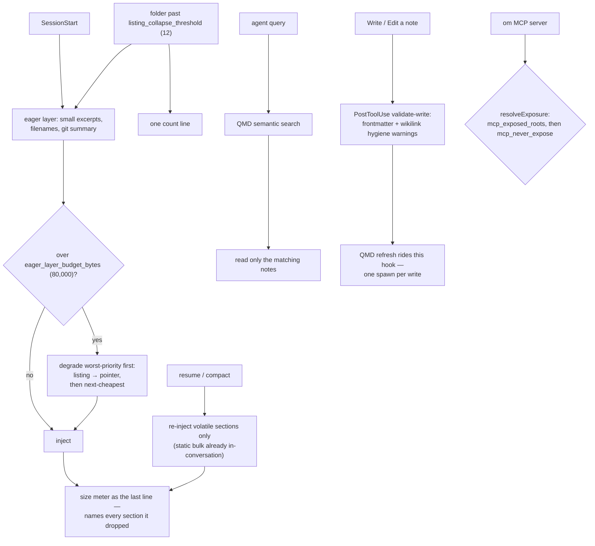

## 1. Executive Summary

obsidian-mind is a vault template rather than an engine: an Obsidian vault laid
out for AI coding agents, with `brain/` (Key Decisions, Patterns, Gotchas, People
& Context, North Star, Skills), `work/`, `perf/`, Obsidian `.base` database
views, a `vault-manifest.json`, TypeScript lifecycle hooks, and QMD semantic
search. It targets Claude Code with working hooks for Codex CLI and Gemini CLI,
and ships in four languages.

**The contribution is a solved problem most of this atlas has not noticed it
has: what session-start injection costs, and what happens when the vault
outgrows it.**

`ARCHITECTURE.md` states the failure first:

> "Two of those inputs grow with the vault — the file listing grows with every
> note, the North Star excerpt with every status edit — so without a ceiling the
> eager layer drifts upward a little every day and nobody notices until a session
> is paying for it."

Then five mechanisms, each with a reason:

1. **Source-aware injection** — resume and compact re-inject only the volatile
   sections, because "the static bulk is already in-conversation".
2. **An injection-size meter** as the last line of every injection, so "you
   always see what context costs".
3. **An injection budget** enforcing what the meter measures — "over the ceiling,
   the cheapest-to-lose sections degrade to pointers — and **the meter names
   every one it dropped, because a silent loss is worse than the bloat**".
4. **A single hook spawn per write** — the QMD refresh rides the validation hook.
5. **Listing collapse** — "any folder past a note-count threshold folds to one
   count line, so a vault can't outgrow the ceiling through whichever folder
   nobody thought to configure."

Both the budget (`eager_layer_budget_bytes: 80000`) and the threshold
(`listing_collapse_threshold: 12`) live in `vault-manifest.json`.

**And the argument for how to degrade is the part to steal:**

> "Rank the eager layer by **value density, not size**: filenames are the
> cheapest bytes (one Glob rebuilds them), so the listing surrenders first.
> Anything irreplaceable — identity, personal context, correctness guards —
> carries no fallback and is never traded for plumbing. Optimizing this layer
> means removing **duplication**, not **information**."

Plus the case against the obvious alternative: "Line-based caps cannot do this
job: shortening entries under a line cap just slides the window deeper and
refills it."

## 2. Mental Model

Memory is markdown. `brain/` holds the durable knowledge; `work/` holds active
material with configured open loops; `perf/` accumulates evidence. Session start
injects a bounded excerpt; the agent then queries QMD by meaning and reads only
what it needs.

## 3. Architecture

There is no engine — the vault *is* the system. `vault-manifest.json` is the
configuration surface: `open_loop_dirs`, `open_loop_sections`,
`eager_layer_budget_bytes`, `listing_collapse_threshold`, `memory_root`,
`mcp_exposed_roots`, `mcp_never_expose`, `mcp_inbox`, plus a `qmd_context`
paragraph describing the vault in prose for the semantic index.

The executable parts are TypeScript hooks under `.claude/scripts/` and
`.shardmind/hooks/`: `validate-write`, `pre-compact`, `classify-message`,
`charcount`, `generate-memory-index`, `qmd-refresh-run`, `tidy-fix`,
`personalize`, `bootstrap`, `post-update`.

`bases/` holds Obsidian database views — Memories, Competency Map, Incidents,
People Directory, Recently Touched, Review Evidence, 1-1 History, Work Dashboard
— so the human side of the same store is queryable without an agent.

`ARCHITECTURE.md` is long, argued, and contains Mermaid diagrams of its own
decision procedures; `CHANGELOG.md` records the budget and meter arriving as
separate releases.

## 4. Essential Implementation Paths

**Budget** — `ARCHITECTURE.md` `:99-103`, `README.md` `:225`,
`vault-manifest.json` (`eager_layer_budget_bytes`,
`listing_collapse_threshold`).

**Validate** — `.claude/scripts/validate-write.ts` (the PostToolUse contract
`:1-9`), `.claude/scripts/lib/frontmatter.ts` (`isBlockedMemoryPath` `:45-54`).

**Expose** — `ARCHITECTURE.md` `resolveExposure` `:491-513`.

**Index** — `.claude/scripts/generate-memory-index.ts`,
`.claude/scripts/qmd-refresh-run.ts`.

## 5. Memory Data Model

Markdown with frontmatter and wikilinks. `brain/Memories.md` is an index note
pointing at six topic notes — Key Decisions, Patterns, Gotchas, People &
Context, North Star, Skills — each described by what it is for: "**Gotchas** —
things that have bitten before and will bite again".

There is no status, no confidence, no supersession and no tombstone. A note that
stops being true is edited or it is not; git is the history. That is consistent
with the design — this is a personal knowledge vault, not a belief store — and it
means correction is entirely the user's discipline.

`isBlockedMemoryPath` is a small piece of care worth noting: it unifies path
separators **before** normalising, because "`normalize()` on a POSIX host doesn't
treat `\` as a separator, so backslash-spelled `..` segments would otherwise
survive uncollapsed". A path check that anticipates the Windows-separator bypass
on a POSIX host is the kind of thing that is usually learned from an incident.

## 6. Retrieval Mechanics

Two paths. The **eager layer** at session start is bounded and self-reporting.
The **lazy path** is QMD semantic search — "the agent queries by meaning via QMD
before reading files, so it pulls only what's relevant".

**Exposure, not scope.** `resolveExposure` decides which notes the `om` MCP
server serves: `mcp_exposed_roots` narrows, `mcp_never_expose` blocks, and
`ARCHITECTURE.md` explains why both ship empty — the allowlist "exists for the
unusual vault holding material that is *not the user's to share* —
employer-confidential notes, a client's data. Both exposure keys ship empty: the
template must not impose one vault's sensitivities on every install."

That is a genuine read-path gate and it is a **path** policy rather than a stored
scope key on a memory, so the `scope_enforced` mark — which certifies a user,
project, agent or tenant key reaching the query — is not earned. Naming the
distinction matters here because the mechanism is good: it is publication
control, not multi-tenancy.

## 7. Write Mechanics

The agent writes notes; a PostToolUse hook validates them. The hook "skips files
outside the vault-note scope (dotfiles, templates, root docs, translated READMEs,
thinking drafts), and emits a `hookSpecificOutput` with vault hygiene warnings
when frontmatter or wikilinks are missing" — warnings, not refusals, which is the
right register for a hygiene check on a human's own vault.

The QMD refresh rides that same hook rather than spawning its own process, which
is the fourth of the five budget mechanisms: the cost being controlled is process
spawns per write, not just bytes per session.

## 8. Agent Integration

`CLAUDE.md`, `AGENTS.md` and `GEMINI.md` at the root, with lifecycle hooks for
SessionStart, UserPromptSubmit (message classification), PostToolUse (validation)
and pre-compact. Skills as slash commands. Four README translations. An
`om` MCP server for the vault.

Supporting three agent CLIs from one vault, with a manifest that declares which
roots each may see, is the integration story most single-agent memory tools do
not attempt.

## 9. Reliability, Safety, and Trust

**No marks**, and for this design that is the expected result rather than a
shortfall: notes are notes. No trust state, no tombstone, no bitemporality, no
audit log beyond git, no review surface, no negative eval.

**The honest risk is the one section 5 names.** A vault that accumulates
"Gotchas" and "Key Decisions" over a year contains decisions that were reversed
and gotchas that were fixed, and nothing in the system distinguishes them from
the live ones. The budget mechanism controls how *much* gets injected with real
rigour; nothing controls whether what gets injected is still true.

The two safety-adjacent mechanisms are both well-judged. The exposure policy
ships empty and explains why. The path check anticipates a separator bypass.

## 10. Tests, Evals, and Benchmarks

**No paper, no benchmark, no test suite found.** The verification artifacts here
are the hooks themselves — `validate-write` checks vault hygiene on every write,
and `charcount` and the size meter make the injection cost observable at runtime
rather than measured offline.

That is a defensible answer for a template: the thing worth measuring is what a
session costs, and it is measured continuously and printed, rather than
benchmarked once. The meter *naming what it dropped* is the part that makes it an
instrument rather than a number.

What is not measured is whether the vault layout helps — no comparison against a
flat `CLAUDE.md`, which is the baseline every reader will have.

**I ran nothing.**

## 11. For Your Own Build

### Steal

- **Put a byte budget on session-start injection and enforce it.** Without a
  ceiling, the eager layer "drifts upward a little every day and nobody notices
  until a session is paying for it".
- **Print a size meter as the last line of every injection.** Context cost that
  is invisible is context cost that is unmanaged.
- **Name every section the budget dropped, in the meter.** "A silent loss is
  worse than the bloat" — an agent that quietly lost your identity section will
  behave strangely and you will not know why.
- **Rank by value density, not size.** Filenames are the cheapest bytes because
  one Glob rebuilds them, so the listing degrades first; identity, personal
  context and correctness guards carry no fallback and are never traded.
- **Use a byte budget, not a line cap.** "Shortening entries under a line cap
  just slides the window deeper and refills it."
- **Re-inject only the volatile sections on resume and compact.** The static bulk
  is already in the conversation; omitting it removes duplication rather than
  information.
- **Collapse any folder past a note threshold to a single count line**, so the
  vault cannot outgrow the ceiling through the one directory nobody configured.
- **Ride an existing hook rather than spawning another.** One process per write,
  not two.
- **Ship your exposure allowlist empty, and say why.** "The template must not
  impose one vault's sensitivities on every install."
- **Unify path separators before normalising.** `normalize()` on POSIX will not
  collapse a backslash-spelled `..`.
- **Give the semantic index a prose description of the vault.** `qmd_context` is
  a paragraph telling the index what this collection is for.

### Avoid

- **Do not let an accumulating knowledge vault have no staleness story.** A year
  of "Key Decisions" contains reversed ones, and nothing here separates them.
- **Do not measure only the budget.** Whether the layout beats a flat
  `CLAUDE.md` is the comparison a reader wants and it is not made.

### Fit

The right choice if you already live in Obsidian and want your agent working from
the same vault you read — the `.base` views mean the human and the agent query
one store. It is a template you adopt wholesale, not a component.

`ARCHITECTURE.md`'s injection-budget section is worth reading whatever you build.
It is the clearest treatment in this atlas of a cost every agent memory system
pays and most never measure.

## 12. Open Questions

- **What happens when the budget drops something irreplaceable?**
  The design says identity and correctness guards carry no fallback; what the
  meter does if they alone exceed the ceiling was not traced.
- **Is there a staleness pass?** Nothing found marks a note as superseded.
- **How does QMD rank?** The semantic index is external to this repository.
- **Does the layout beat a flat instructions file?** Unmeasured.

## Appendix: File Index

**The budget** — `ARCHITECTURE.md` (the drift argument and the byte-budget case
`:99`, value-density ranking and the duplication-not-information rule `:103`,
`resolveExposure` `:491-513`), `README.md` (the five mechanisms `:225`),
`vault-manifest.json` (`eager_layer_budget_bytes`, `listing_collapse_threshold`,
`open_loop_dirs`, `open_loop_sections`, `mcp_exposed_roots`, `mcp_never_expose`,
`qmd_context`), `CHANGELOG.md` (`:75`, `:100`)

**Hooks** — `.claude/scripts/validate-write.ts` (`:1-22`),
`.claude/scripts/lib/frontmatter.ts` (`isBlockedMemoryPath` `:45-54`),
`.claude/scripts/pre-compact.ts`, `classify-message.ts`, `charcount.ts`,
`generate-memory-index.ts`, `qmd-refresh-run.ts`, `tidy-fix.ts`,
`.shardmind/hooks/{personalize,bootstrap,post-update}.ts`

**The vault** — `brain/{Memories,Key Decisions,Patterns,Gotchas,North Star,Skills}.md`,
`work/`, `perf/`, `reference/`, `org/`, `thinking/`, `templates/`,
`bases/*.base`

**Agent surfaces** — `CLAUDE.md`, `AGENTS.md`, `GEMINI.md`, `Home.md`

## History

**2026-08-09** — [`b84464b983d7b25e811d52986f8b61dbcbad961d`](https://github.com/breferrari/obsidian-mind/commit/b84464b983d7b25e811d52986f8b61dbcbad961d) — first reading. Screened before reading; the tree was read, never installed, and no hook was run. QMD is an external dependency and was not examined.
