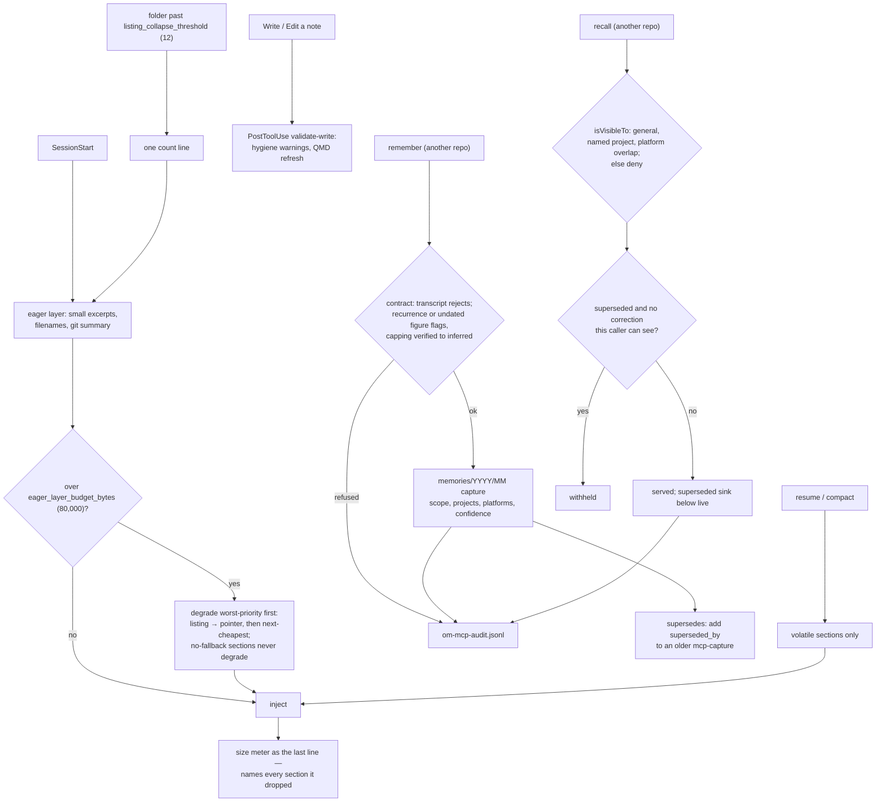

## 1. Executive Summary

obsidian-mind is an Obsidian vault template for AI coding agents, with a small
memory service inside it rather than an engine under it. Its notable mechanism is
a byte budget on session-start injection that degrades the cheapest sections to
pointers and names every one it dropped. Its weak point is correction: a
`brain/` note carries no status, so a reversed Key Decision is served like a
live one until someone runs a sweep.

The vault is `brain/` (Key Decisions, Patterns, Gotchas, People & Context, North
Star, Skills), `work/`, `perf/`, Obsidian `.base` database views, a
`vault-manifest.json`, TypeScript lifecycle hooks and QMD hybrid search. It
targets Claude Code with working hooks for Codex CLI and Gemini CLI, ships in four
languages, and runs an `om` MCP server through which sessions in other
repositories read the vault and file scoped memory captures into it.

`ARCHITECTURE.md` states the failure the budget exists for:

> "Two of those inputs grow with the vault — the file listing grows with every
> note, the North Star excerpt with every status edit — so without a ceiling the
> eager layer drifts upward a little every day and nobody notices until a session
> is paying for it."

Then five mechanisms, each with a reason:

1. **Source-aware injection** — resume and compact re-inject only the volatile
   sections, because "the static bulk is already in-conversation".
2. **An injection-size meter** as the last line of every injection, so "you
   always see what context costs".
3. **An injection budget** enforcing what the meter measures — "over the ceiling,
   the cheapest-to-lose sections degrade to pointers — and **the meter names
   every one it dropped, because a silent loss is worse than the bloat**".
4. **A single hook spawn per write** — the QMD refresh rides the validation hook.
5. **Listing collapse** — "any folder past a note-count threshold folds to one
   count line, so a vault can't outgrow the ceiling through whichever folder
   nobody thought to configure."

Both the budget (`eager_layer_budget_bytes: 80000`) and the threshold
(`listing_collapse_threshold: 12`) live in `vault-manifest.json`.

**And the argument for how to degrade is the part to steal:**

> "Rank the eager layer by **value density, not size**: filenames are the
> cheapest bytes (one Glob rebuilds them), so the listing surrenders first.
> Anything irreplaceable — identity, personal context, correctness guards —
> carries no fallback and is never traded for plumbing. Optimizing this layer
> means removing **duplication**, not **information**."

Plus the case against the obvious alternative: "Line-based caps cannot do this
job: shortening entries under a line cap just slides the window deeper and
refills it."

## 2. Mental Model

Memory is markdown in two kinds. A `brain/` note is a document the user maintains;
`ARCHITECTURE.md` calls a capture under `memories/` *"an immutable claim with a
declared audience and a confidence level"*. Session start injects a bounded
excerpt of the first kind. A session in another repository reaches the second
kind through `recall`, which serves only captures scoped to reach it and sinks
any capture a later one superseded.


```mermaid
%% caption: the eager layer degrades worst-priority sections to fit its byte budget and names each one it dropped; recall filters captures by declared reach, then by whether a correction can follow
flowchart TD
    SS["SessionStart"] --> EL["eager layer: small excerpts,<br/>filenames, git summary"]
    LC["folder past listing_collapse_threshold (12)"] --> ONE["one count line"]
    ONE --> EL
    EL --> BUD{"over eager_layer_budget_bytes (80,000)?"}
    BUD -->|no| INJ["inject"]
    BUD -->|yes| DEG["degrade worst-priority first:<br/>listing → pointer, then next-cheapest;<br/>no-fallback sections never degrade"]
    DEG --> INJ
    RC["resume / compact"] --> VOL["volatile sections only"]
    VOL --> INJ
    INJ --> MET["size meter as the last line —<br/>names every section it dropped"]
    W["Write / Edit a note"] --> VH["PostToolUse validate-write:<br/>hygiene warnings, QMD refresh"]
    REM["remember (another repo)"] --> CON{"contract: transcript rejects;<br/>recurrence or undated figure flags,<br/>capping verified to inferred"}
    CON -->|refused| AUD["om-mcp-audit.jsonl"]
    CON -->|ok| CAP["memories/YYYY/MM capture<br/>scope, projects, platforms, confidence"]
    CAP --> SUP["supersedes: add superseded_by<br/>to an older mcp-capture"]
    CAP --> AUD
    REC["recall (another repo)"] --> VIS{"isVisibleTo: general,<br/>named project, platform overlap;<br/>else deny"}
    VIS --> FIX{"superseded and no correction<br/>this caller can see?"}
    FIX -->|yes| WH["withheld"]
    FIX -->|no| RANK["served; superseded sink below live"]
    RANK --> AUD
```

## 3. Architecture

There is no engine — the vault *is* the store. `vault-manifest.json` is the
configuration surface: `open_loop_dirs`, `open_loop_sections`,
`eager_layer_budget_bytes`, `listing_collapse_threshold`, `memory_root`,
`mcp_exposed_roots`, `mcp_never_expose`, `mcp_inbox`, plus a `qmd_context`
paragraph describing the vault in prose for the semantic index.

The executable parts are TypeScript hooks under `.claude/scripts/` and
`.shardmind/hooks/`: `session-start`, `validate-write`, `pre-compact`,
`classify-message`, `stop-checklist`, `charcount`, `generate-memory-index`,
`qmd-refresh-run`, `tidy-fix`, `personalize`, `bootstrap`, `post-update`.

The `om` MCP server (`.claude/scripts/om-mcp.ts`, `lib/mcp-server.ts`) serves
seven tools to sessions outside the vault: `search`, `expand`, `recall`,
`record_work`, `remember`, `reason` and `health`. `ARCHITECTURE.md` documents it
under *Reaching the Vault From Another Repo* (`:341`), with its own Mermaid
diagrams of which notes are served (`:491-513`) and which captures reach which
repository (`:606`).

`bases/` holds Obsidian database views — Memories, Competency Map, Incidents,
People Directory, Recently Touched, Review Evidence, 1-1 History, Work Dashboard
— so the human side of the same store is queryable without an agent.
`CHANGELOG.md` records the meter (`:150`, v7.0.0) and the budget (`:125`,
v7.0.1) arriving as separate releases.

## 4. Essential Implementation Paths

**Budget** — `ARCHITECTURE.md` `:99-103`, `README.md` `:225`,
`.claude/scripts/lib/session-start.ts` (`applyInjectionBudget` `:92-124`, the
meter line `:45`), `vault-manifest.json` (`eager_layer_budget_bytes`,
`listing_collapse_threshold`).

**Validate** — `.claude/scripts/validate-write.ts` (the PostToolUse contract
`:1-9`), `.claude/scripts/lib/frontmatter.ts` (`isBlockedMemoryPath` `:45-54`).

**Capture** — `.claude/scripts/lib/memory-write.ts` (`validateMemory` `:407`,
`CONTRACT_RULES` `:353`, `renderMemory` `:585`),
`.claude/scripts/lib/memory-supersede.ts` (`markSuperseded` `:111`),
`.claude/scripts/lib/mcp-server.ts` (`callRemember` `:432`).

**Recall** — `.claude/scripts/lib/memory-recall.ts` (`isVisibleTo` `:236`,
`servedAfterSupersession` `:331`, `recallFrom` `:538`),
`.claude/scripts/lib/mcp-server.ts` (`callRecall` `:269`).

**Expose** — `.claude/scripts/lib/mcp-exposure.ts`, `ARCHITECTURE.md`
`resolveExposure` `:491-513`.

**Index** — `.claude/scripts/generate-memory-index.ts`,
`.claude/scripts/qmd-refresh-run.ts`, `.claude/scripts/lib/mcp-qmd-client.ts`.

## 5. Memory Data Model

Markdown with frontmatter and wikilinks. `brain/Memories.md` is an index note
pointing at six topic notes — Key Decisions, Patterns, Gotchas, People &
Context, North Star, Skills — each described by what it is for: "**Gotchas** —
things that have bitten before and will bite again". A `brain/` note carries no
confidence, no validity interval and no tombstone. Decision records and work
notes carry a `status` that the correction sweep and the active-folder hygiene
scan read; no retrieval path filters on it.

A capture is a different record. `renderMemory` writes `source: mcp-capture`,
`origin`, `session`, `scope`, `projects`, `platforms`, `confidence`, and, when
the contract fired, `claimed_confidence`, `flags` and `claimed_scope`
(`memory-write.ts:585-619`). `confidence` is one of `verified`, `inferred` or
`unverified`, and the caller chooses it. The contract caps a flagged `verified`
to `inferred` and keeps the claim beside it: *"Capping is the enforcement; the
marker is the audit"* (`:537-541`).

Correction is supersession, not deletion. A new capture names older ones in
`supersedes`; `markSuperseded` appends its title to their `superseded_by` list,
refuses any file whose `source` is not `mcp-capture`, and only adds a key
(`memory-supersede.ts:111-132`). Its header names it the one place the server
edits an existing file (`:18`).

`isBlockedMemoryPath` unifies path separators **before** normalising, because
"`normalize()` on a POSIX host doesn't treat `\` as a separator, so
backslash-spelled `..` segments would otherwise survive uncollapsed". The check
closes a Windows-separator traversal on a POSIX host.

## 6. Retrieval Mechanics

Three paths. The **eager layer** at session start is bounded and
self-reporting. The **lazy path** is QMD search, which sends a lexical and a
vector sub-query together (`mcp-qmd-client.ts:373-375`). The **recall path**
serves captures to other repositories under a scope rule.

**The eager layer overflows rather than dropping what it cannot replace.**
`applyInjectionBudget` degrades only sections with a fallback, worst priority
first, and stops once the text fits. When the load-bearing sections alone exceed
the ceiling, it injects them over budget and the meter reports the overflow
(`session-start.ts:92-124`). `session-start.test.ts:1064` asserts it: *"identity
survives an impossible budget"*.

**Recall filters twice, and the order is the design.** `isVisibleTo` passes a
`general` capture, a capture naming the caller's project, or a `platform`
capture sharing a platform, and otherwise returns false (`memory-recall.ts:236-245`).
Then `servedAfterSupersession` removes a superseded capture when none of its
corrections is served to this caller, as a greatest fixpoint so a chain of
narrowing corrections cannot leave a retired claim served alone (`:331-363`).
Where the correction is visible, the older capture is served below it (`:392-406`,
`mcp-server.ts:307-309`).

The caller's identity is the folder name, or a `.om-project` marker, of the
client's first MCP root (`mcp-caller.ts:128-141`). It separates the user's own
repositories; the client reports it and nothing verifies it. `ARCHITECTURE.md`
says the same of the exposure list: *"It is not an egress control"* (`:519`).

**Exposure governs the other surfaces.** `resolveExposure` decides which notes
`search`, `expand` and resource reads serve: `mcp_exposed_roots` narrows,
`mcp_never_expose` blocks, and the memory root is stripped from every root list,
so captures reach another repository only through `recall`. `ARCHITECTURE.md`
explains why both keys ship empty: *"the template must not impose one vault's
sensitivities on every install"*. The allowlist exists for material *"not the
user's to share"*.

**The `reason` tool reads outside both rules.** It spawns a Claude session with
`Read,Grep,Glob` at the vault root and tells it in the prompt not to read
`memories/` or anything outside the exposed roots. Its docstring states the
limit: *"It is a boundary the spawn observes, not one the filesystem enforces"*
(`mcp-reason.ts:247-264`). The tests assert the prompt carries the prohibition
(`mcp-reason.test.ts:332`), and the server refuses the call when no root is
exposed (`mcp-server.ts:613`).

## 7. Write Mechanics

Inside the vault the agent writes notes and a PostToolUse hook validates them.
The hook "skips files outside the vault-note scope (dotfiles, templates, root
docs, translated READMEs, thinking drafts), and emits a `hookSpecificOutput` with
vault hygiene warnings when frontmatter or wikilinks are missing" — warnings, not
refusals. The QMD refresh rides that hook, debounced and fire-and-forget, so the
cost controlled is process spawns per write as well as bytes per session.

From another repository, `remember` writes a capture and refuses three kinds of
input. It refuses a session running inside the vault, a field carrying tool-call
markup, and a capture that fails validation, including one that would reach
nobody (`memory-write.ts:491-510`). A near-identical capture in the same facets
is refused unless `force: true`, with a pointer to `supersedes` instead
(`mcp-server.ts:496-507`). The write is synchronous: the parse cache is
invalidated and QMD reindexed before the call returns, so `recall` serves the
capture on the next call.

`record_work` files a work note into an exposed folder, which is a vault note
rather than a capture. Captures are listed as *"awaiting review"* at session
start until a vault session copies one into a `brain/` note and adds a
`promoted:` marker (`active-hygiene.ts:554`). An anchored marker makes `recall`
serve the promoted block in place of the capture body.

## 8. Agent Integration

`CLAUDE.md`, `AGENTS.md` and `GEMINI.md` at the root, with lifecycle hooks for
SessionStart, UserPromptSubmit (message classification), PostToolUse
(validation), PreCompact and Stop. Skills as slash commands. Four README
translations.

The `om` MCP server is the integration for everything outside the vault. A
coding session in another repository gets search over the exposed roots, a
wikilink neighbourhood through `expand`, its own scoped captures through
`recall`, and a write path through `remember` and `record_work`. The vault
serves several repositories from one store, and the scope facets keep one
repository's captures out of another's `recall`.

## 9. Reliability, Safety, and Trust

**Three marks, all on the cross-repo capture layer and its server.**
`isVisibleTo` is a default-deny scope predicate on `recall`, `om-mcp-audit.jsonl`
logs every served call and the two write tools, and the recall suite asserts
that one project's captures do not reach another caller. The records name the
limits: `reason` carries the scope rule as a prompt, and the log rotates and
omits two refusals and the supersession edit.

**Four marks are withheld.** `tombstone`: supersession keeps the corrected
capture and nothing is keyed on a rejected value; a literal re-capture is caught
only by the near-duplicate check, which `force: true` passes. `trust_state`:
`confidence` is a discrete field, but the caller writes it, `verified` needs no
evidence, and no read excludes on it; `recall` prints it, and the Memories base
lists non-verified captures as *Needs review*. `bitemporal`: a capture records
its write time, and validity is prose. `human_review`: a capture is served the
moment it is written, and the review inbox is a count.

**The risk is correction in `brain/`.** A vault that accumulates "Gotchas" and
"Key Decisions" over a year holds reversed decisions and fixed gotchas, and no
read path of the eager layer or of QMD search tells them from live ones. The
budget controls how *much* gets injected; nothing at read time controls whether
it is still true.

`correction-sweep.ts` is the answer, run on demand. It exists because the vault's
own rules asked for something it could not do — *"`signals.ts` already tells the
agent to sweep on a decision reversal. So on the one path where the vault detects
a correction happening, it issued an instruction and handed over nothing to act
with — an instruction that looks like a control and cannot act."*

The predicate is the part to copy. A candidate is classified **AUTHORITATIVE**
(the single source, where the correction is applied), **RESTATEMENT** (a living
note asserting the fact, replaced with a link to the source) or **HISTORICAL**
(a note that correctly records what was believed at the time, and must not be
touched):

> *"A sweep that cannot tell a stale claim from a historical record is worse than
> no sweep. It silently rewrites the vault's memory of what it used to believe,
> and that damage is both unrecoverable and invisible, because the note still
> reads fine afterwards."*

This is the bitemporal problem stated in markdown terms, answered by protecting
the historical class from correction rather than by adding a validity column.
Historical status is keyed on the naming convention *and* explicit signals,
because the convention alone *"silently misclassifies the moment someone names a
note differently"*. `/om-correct` takes the corrected fact as its argument; the
`correction-sweep` subagent only plans, and the parent session applies the plan
and leaves it uncommitted for review.

## 10. Tests, Evals, and Benchmarks

**No paper and no benchmark. The test suite is substantial** and runs on
`node:test`. Beside it the hooks are their own verification artifacts —
`validate-write` checks vault hygiene on every write, and `charcount` and the
size meter make the injection cost observable at runtime rather than measured
offline.

The cases that carry the most assert a boundary rather than a shape.
`memory-recall.test.ts` writes eight captures through the real writer and
asserts the exact visible set per caller, so absent ids are asserted beside
present ones (`:152-201`); its supersession block asserts a retired capture is
withheld where its correction cannot reach (`:449`), with the served case on the
same corpus as control (`:454`). `correction-sweep.test.ts` pins the
classification in both directions — *"a living work note is NOT historical"*
beside *"a completed work note is historical"* — and includes *"a malformed
status is not a licence to edit"*.

`mcp-refusal-audit.test.ts` drives the real `tools/call` dispatch rather than a
helper, and says why: *"A test that only checked the success path would have
passed throughout the old behaviour, which is exactly how the gap survived."* It
covers the markup refusal on both write tools. The near-duplicate refusal writes
no audit line, and `om-mcp.integration.test.ts:410` asserts only its message.

For a template the thing measured is what a session costs, printed on every
injection rather than benchmarked once. The meter *naming what it dropped* is
what makes it an instrument rather than a number. No comparison against a flat
`CLAUDE.md` is committed, and that is the baseline a reader will have.

**I ran nothing.**

## 11. For Your Own Build

### Steal

- **Put a byte budget on session-start injection and enforce it.** Without a
  ceiling, the eager layer "drifts upward a little every day and nobody notices
  until a session is paying for it".
- **Print a size meter as the last line of every injection.** Context cost that
  is invisible is context cost that is unmanaged.
- **Name every section the budget dropped, in the meter.** "A silent loss is
  worse than the bloat" — an agent that quietly lost your identity section will
  behave strangely and you will not know why.
- **Rank by value density, not size.** Filenames are the cheapest bytes because
  one Glob rebuilds them, so the listing degrades first; identity, personal
  context and correctness guards carry no fallback and are never traded.
- **Use a byte budget, not a line cap.** "Shortening entries under a line cap
  just slides the window deeper and refills it."
- **Re-inject only the volatile sections on resume and compact.** The static bulk
  is already in the conversation; omitting it removes duplication rather than
  information.
- **Collapse any folder past a note threshold to a single count line**, so the
  vault cannot outgrow the ceiling through the one directory nobody configured.
- **Serve a superseded memory only where its correction can follow it.** A
  correction that narrows reach otherwise leaves the retired claim served alone
  to exactly the caller it was meant to exclude.
- **Refuse a memory that would reach nobody** rather than widening it to
  everyone.
- **Ship your exposure allowlist empty, and say why.** "The template must not
  impose one vault's sensitivities on every install."
- **Unify path separators before normalising.** `normalize()` on POSIX will not
  collapse a backslash-spelled `..`.

### Avoid

- **Do not leave a maintained knowledge store with correction only on demand.**
  A year of "Key Decisions" contains reversed ones, and the eager layer serves
  them until someone runs `/om-correct`.
- **Do not let the writer set the confidence the reader trusts.** `verified`
  here asks for a `verification` string and warns without it; nothing refuses.
- **Do not put a scope boundary in a prompt.** The `reason` spawn can read every
  project's captures and is asked not to.

### Fit

The right choice if you already live in Obsidian and want your agent working from
the same vault you read — the `.base` views mean the human and the agent query
one store. It is a template you adopt wholesale, not a component.
`ARCHITECTURE.md`'s injection-budget section applies whatever you build: it
prices a cost every agent memory system pays.

## 12. Open Questions

- **Does the `reason` spawn observe its boundary?** `mcp-reason.test.ts:332`
  asserts the prompt carries the prohibition; nothing in the tree measures
  whether a spawned session reads `memories/` when a capture would answer.
- **How does QMD rank?** The server sends a lexical and a vector sub-query; the
  fusion and rerank run in the external package.
- **Does the layout beat a flat instructions file?** Unmeasured.

## Appendix: File Index

**The budget** — `ARCHITECTURE.md` (the drift argument and the byte-budget case
`:99`, value-density ranking and the duplication-not-information rule `:103`),
`README.md` (the five mechanisms `:225`),
`.claude/scripts/lib/session-start.ts` (`applyInjectionBudget` `:92-124`),
`vault-manifest.json` (`eager_layer_budget_bytes`, `listing_collapse_threshold`,
`open_loop_dirs`, `open_loop_sections`, `mcp_exposed_roots`, `mcp_never_expose`,
`qmd_context`), `CHANGELOG.md` (budget `:125`, meter `:150`)

**Hooks** — `.claude/scripts/validate-write.ts` (`:1-22`),
`.claude/scripts/lib/frontmatter.ts` (`isBlockedMemoryPath` `:45-54`),
`.claude/scripts/session-start.ts`, `pre-compact.ts`, `classify-message.ts`,
`stop-checklist.ts`, `charcount.ts`, `generate-memory-index.ts`,
`qmd-refresh-run.ts`, `tidy-fix.ts`,
`.shardmind/hooks/{personalize,bootstrap,post-update}.ts`

**The MCP server and captures** — `.claude/scripts/om-mcp.ts`,
`.claude/scripts/lib/{mcp-server,mcp-tools,mcp-caller,mcp-exposure,mcp-reason,mcp-qmd-client,mcp-graph}.ts`,
`.claude/scripts/lib/{memory-write,memory-recall,memory-supersede,memory-similarity,memory-promoted,memory-index}.ts`,
`.claude/scripts/lib/{correction-sweep,active-hygiene,signals}.ts`,
`.claude/commands/om-correct.md`, `.claude/agents/correction-sweep.md`,
`ARCHITECTURE.md` (`:341-869`)

**Tests** — `.claude/scripts/tests/` (`memory-recall.test.ts`,
`mcp-refusal-audit.test.ts`, `correction-sweep.test.ts`,
`session-start.test.ts`)

**The vault** — `brain/{Memories,Key Decisions,Patterns,Gotchas,North Star,Skills}.md`,
`work/`, `perf/`, `reference/`, `org/`, `thinking/`, `templates/`,
`bases/*.base`

**Agent surfaces** — `CLAUDE.md`, `AGENTS.md`, `GEMINI.md`, `Home.md`

**Recorded searches** — run from the repository root at the pin:

```sh
git grep -n 'confidence' -- ':!*tests*'                         # no read filters on it; display at mcp-server.ts:373
git grep -n -E '\baudit\(' -- '.claude/scripts/lib/*.ts' ':!*tests*'   # twelve calls; none on the duplicate refusal or captureNote catch
git grep -n -E 'recallFrom|isVisibleTo' -- ':!*tests*'           # one production caller, mcp-server.ts:277
git grep -n -i -E 'tombstone|rejected_value|valid_from|valid_to'  # nothing in code
git grep -n -i -E 'arxiv|bibtex|@article|@misc|citation\.cff|doi\.org'  # nothing
grep -n 'not one the filesystem enforces' .claude/scripts/lib/mcp-reason.ts
git grep -n -E 'memories/|Never read' -- '.claude/scripts/tests/mcp-reason*.ts'   # prompt-content asserts only
git grep -n -i -E 'baseline|ablation' -- ':!*.json'              # review-cycle baselines only; no flat-file comparison
```

## History

**2026-09-30** — [`af615d100a1d04561409ab9a1e71e615efa1d87b`](https://github.com/breferrari/obsidian-mind/commit/af615d100a1d04561409ab9a1e71e615efa1d87b) — audit at an unchanged pin; upstream HEAD is the pin. Screened again with the same three in-repo auto-run findings; nothing installed, built or run. No mark moved. Corrected: [section 6](#6-retrieval-mechanics) said `scope_enforced` was not earned while the frontmatter awarded it; [section 5](#5-memory-data-model) said there was no confidence and no supersession, while captures carry both. The `negative_eval` record said each scope case carries its positive half; the `:222` case asserts only the predicate. The `audit_log` record omitted the 5 MB rotation, two unaudited refusals and the unlogged supersession edit. The `reason` tool's prompt-only boundary is recorded, and the `CHANGELOG.md` anchors were those of the first pin. Added: the cross-repo capture layer in sections 5–7; census moved to the header band.

**2026-09-14** — [`af615d100a1d04561409ab9a1e71e615efa1d87b`](https://github.com/breferrari/obsidian-mind/commit/af615d100a1d04561409ab9a1e71e615efa1d87b) — second reading, 31 commits on. Screened again: three auto-run findings, all in-repo — the Claude Code plugin manifest, five `.claude/settings.json` hooks running `node` over `.claude/scripts/*.ts` from the project directory, and one MCP server started from `.mcp.json`. Nothing fetches remote code, nothing was installed and nothing was run; the hooks were read rather than executed, and they are the mechanism this report is about. **Three corrections, and they share a cause.** The first reading recorded *"no test suite found"*; the suite was there, 55 files at that pin and 60 now, 1,425 cases over 17,029 lines under `.claude/scripts/tests/`. Missing it meant missing three marks that were earned at the previous pin and are added here rather than described as new: `scope_enforced` on `isVisibleTo`, a default-deny facet check applied at three points on the recall path; `audit_log` on `.claude/om-mcp-audit.jsonl`, appended with `appendFileSync` and never rewritten; and `negative_eval` on the recall suite's three scope-leak cases, each carrying its positive half. All three predate the previous pin — verified by grepping the pinned tree. The substantive addition since then is `correction-sweep.ts` with its `/om-correct` command and subagent, which classifies a correction target as authoritative, restatement or historical and refuses to rewrite the third.

**2026-08-09** — [`b84464b983d7b25e811d52986f8b61dbcbad961d`](https://github.com/breferrari/obsidian-mind/commit/b84464b983d7b25e811d52986f8b61dbcbad961d) — first reading. Screened before reading; the tree was read, never installed, and no hook was run. QMD is an external dependency and was not examined.
