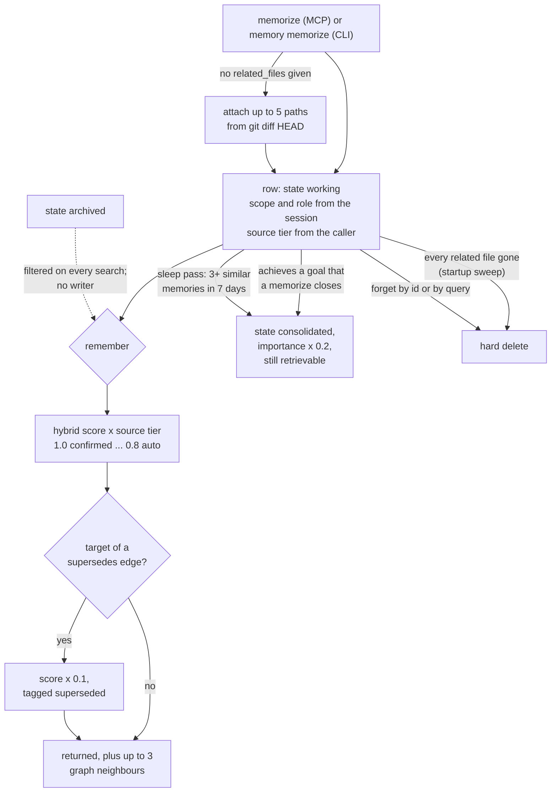

## 1. Executive Summary

Octobrain is a Rust memory server for coding assistants, extracted in January
2026 from Muvon's Octocode. It stores titled notes in one LanceDB table, scopes
them by normalized git remote, and retrieves them through the MCP `remember`
tool with LanceDB's BM25-plus-vector hybrid search. The notable part is the
ranking stack: decay, a source tier multiplier, a supersedes edge that
down-ranks without deleting, and consolidation that folds a goal's
contributions into one parent. The weak part is the plumbing around the scope
key. A write stamps the session's scope on whatever row it rewrites. The
`global` flag the tool schema offers never reaches the store. The memory store
itself has no test that opens it.

The scope key is real. Every memory and relationship row carries `scope`, and
every read in `MemoryStore` pushes down `(scope = 'X' OR scope = '')`, so a
project session sees its own memories and the global ones
(`src/memory/store.rs:83-102`). That earns `scope_enforced`, the one mark. The
key reaches the store only when something supplies it. The MCP client's
session handshake does; the CLI's `--scope` has no default, whatever its help
text says.

The design is advisory about belief. `source: user_confirmed` is a value the
model passes on `memorize`, it multiplies a score by 1.0 instead of 0.85, and
nothing filters on it. The `archived` state has a filter on every search and no
writer anywhere in the tree.

The memory logic is about 4,800 lines in `src/memory/`, beside a knowledge
index of fetched documents and git-backed "boxes" that this report covers only
where it touches the memory. Apache-2.0.

## 2. Mental Model

A memory is a note the agent chose to write. It becomes a belief the moment
`memorize` returns: there is no candidate state, no extraction and no model
call inside Octobrain. The agent supplies the title, content, type, importance,
tags and source tier (`src/mcp/memory.rs:116-182`). Octobrain adds the git
commit, the session's scope and role, and, when the agent named no files, up to
five paths from `git diff --name-only HEAD` (`src/memory/manager.rs:478-500`,
`src/memory/git_utils.rs:120-136`).

**Belief is graded, never withheld.** Retrieval multiplies each score by the
source tier — 1.0 for `user_confirmed`, 0.9 `imported`, 0.85 `agent_inferred`,
0.8 `auto_linked` — and prints the tier as `[CONFIRMED]` or `[INFERRED]`
(`src/memory/types.rs:60-80`, `src/memory/formatting.rs:29-36`). The tier is
the model's own claim, parsed from its argument with any unknown string falling
to `agent_inferred` (`src/memory/types.rs:49-58`). A `confidence` column exists
and every writer leaves it at 1.0.

**A memory stops being current in four ways, and only two remove it.** A later
memory can carry a `supersedes` edge to it, and `remember` then multiplies its
score by 0.1 and tags it `[superseded]` (`src/memory/manager.rs:55-58`,
`:640-667`). A goal it `achieves` can be closed, which marks it `consolidated`
and cuts its importance to a fifth (`:1127-1133`). `forget` deletes the row.
The startup sweep deletes it when every file it names is gone from the working
tree and git's rename history (`:371-377`). Decay lowers importance with a
90-day half-life, offset by a logarithmic access boost
(`src/memory/types.rs:266-287`).

**The state machine has a third state nobody enters.** `MemoryState` declares
`working`, `consolidated` and `archived`, and the doc comment calls `archived`
*"a manual tombstone state used by cleanup paths before hard delete"*
(`src/memory/types.rs:191-204`). Every search excludes it
(`src/memory/store.rs:99-102`). No code path writes it; cleanup hard-deletes.

## 3. Architecture

Octobrain is one binary with three faces: a clap CLI (`octobrain memory …`,
`knowledge …`, `box …`), an MCP server over stdio, and the same server over
streamable HTTP (`src/commands.rs:25-56`). Every memory command and MCP memory call builds a `MemoryManager`,
which owns one `MemoryStore` over a LanceDB database at
`~/.local/share/octobrain/memory`, shared by every project
(`src/storage.rs:172-177`, `src/memory/manager.rs:120-144`).

The store holds two tables. `memories` carries the note, its metadata, decay
columns, `state`, `scope`, `role` and a fixed-size embedding
(`src/memory/store.rs:168-201`). `memory_relationships` carries typed edges with
their own `scope` (`:204-215`). At creation the store builds Bitmap indexes on
`scope`, `memory_type`, `source` and `role`, BTree indexes on `importance`,
`confidence` and `created_at`, and FTS indexes on `title` and `content`
(`:396-499`). An IVF_PQ vector index appears once a row-count optimiser says
brute force is slower (`:650-690`).

Embeddings and the reranker come from Muvon's `octolib` crate. The default
build uses a local fastembed model, `Qdrant/all-MiniLM-L6-v2-onnx`, so nothing
needs an API key (`Cargo.toml:40-42`, `config-templates/default.toml:11-13`).
Voyage, OpenAI, Google and Jina are selectable by model string.

Background work runs on tokio tasks spawned when a manager starts: the
stale-reference sweep, sleep consolidation, and LanceDB compaction, each gated
by a marker file's timestamp (`src/memory/manager.rs:156-214`). Compaction also
fires every 250 writes within one process (`:33-38`, `:507-514`). The MCP
server awaits the compaction handle at shutdown.

### Deployment and ergonomics

Running it is `cargo install octobrain` or a release binary, then
`octobrain mcp` in the client's MCP config. Nothing else runs: no database
server, no queue, no API key. The first start downloads the embedding model,
and the default config also enables a local cross-encoder reranker that the
project's own benchmark notes call a no-op with fastembed models
(`benches/README.md`, *Findings*). The config file is strict: a key deleted by
hand fails startup instead of taking a default.

The store is not repairable by hand. It is Lance columnar files, and tags and
related files are JSON strings inside them. The CLI has `memory get`, `update`,
`forget`, `clear-all` and `maintenance`, which is the operator's repair path.

## 4. Essential Implementation Paths

**Write.** MCP `memorize` (`src/mcp/server.rs:807-830`) resolves a provider,
then `MemoryProvider::execute_memorize` validates lengths, clamps importance,
caps tags and files, and parses `related_to` (`src/mcp/memory.rs:80-236`).
`MemoryManager::memorize` builds metadata, attaches git-diff files when none
were given, and calls `store_memory` (`src/memory/manager.rs:466-505`), which
embeds the searchable text and upserts with `merge_insert(["id"])`
(`src/memory/store.rs:502-592`). Auto-linking is spawned afterwards
(`manager.rs:520-535`). Each `related_to` edge is written, and a `closes` edge
triggers `consolidate_goal` with the new memory as parent
(`src/mcp/memory.rs:257-296`).

**Retrieval.** `remember` → `execute_remember` (`src/mcp/memory.rs:329-511`) →
`MemoryManager::remember` or `remember_multi` (`manager.rs:618-747`) →
`MemoryStore::search_memories` (`store.rs:727-801`), which chooses
`hybrid_search` when hybrid is enabled and a query is present
(`:1136-1252`), otherwise `vector_search` (`:884-1026`), then the reranker.
`suppress_superseded` runs last in the manager. The MCP handler appends up to
three 1-hop neighbours (`src/mcp/memory.rs:451-507`).

**Correction.** `forget` by id → `store.delete_memory`, scoped to the session's
scope (`store.rs:600-619`); by query → `forget_matching`, which deletes every
search hit (`manager.rs:754-765`). `update_memory` loads, mutates and upserts
the whole row (`manager.rs:767-801`). Supersession is an edge written at
`memorize` time; nothing creates it automatically.

**Consolidation.** `consolidate_goal` gathers `working` sources with an
`achieves` edge to the goal, promotes or synthesises a parent at 1.1 times the
strongest source's importance, links parent to sources, and moves each source
to `consolidated` through a partial update that leaves the embedding alone
(`manager.rs:983-1150`, `store.rs:832-852`). `sleep_consolidate` creates a
synthetic goal per cluster and calls the same function (`manager.rs:1168-1259`).

**Background.** `cleanup_stale_references` (`manager.rs:285-424`),
`maybe_sleep_consolidate` (`:235-260`), `run_maintenance` (`store.rs:634-648`).

**Session and scope.** `ensure_session_context` reads `experimental.session`
from the client's capabilities once (`src/mcp/server.rs:335-384`);
`get_memory_provider` decides whether the per-call scope is used
(`:408-447`).

## 5. Memory Data Model

One `Memory` struct, one row (`src/memory/types.rs:296-359`). The fields that
matter for correction are `importance` (the stored base, decayed at read time),
`access_count` and `last_accessed` (throttled to one bump per hour per row,
`src/memory/store.rs:39-42`, `:810-827`), `source`, `state`, `scope`, `role`
and `git_commit`. `created_at` and `updated_at` are the only time fields, and
`updated_at` is overwritten on each change. There is no validity interval and
no version history of a row.

**Relationships are typed, and the neighbour display drops their direction.**
Eleven types, including `supersedes`, `conflicts`, `achieves`, `closes` and a
`Custom(String)` fallback (`types.rs:629-696`). `conflicts` is stored and
displayed and never read by ranking. The graph-neighbour block prints the edge
type without its direction, so an old memory shown beside the one that
superseded it reads `rel: supersedes` either way (`src/mcp/memory.rs:496-505`).

**Scope is a string, and the empty string is global.** `derive_scope`
normalises the git remote to `host/org/repo`, or falls back to
`local/<parent>/<dir>`, and never returns the empty string
(`src/storage.rs:57-72`). A project read returns project and global rows. A
store built with no scope — the CLI without `--scope`, an unlocked MCP call
without the argument — applies no scope clause and writes to global
(`store.rs:88-92`, `:217-221`).

**Role is a second column with a weaker guarantee.** Searches filter on it when
a role is set (`store.rs:94-97`). `get_memory` does not, and `batch_to_memories`
never reads it back (`:692-721`, `:1497-1602`), so graph neighbours and
id-addressed operations cross roles.

`max_memories` (default 10,000) is declared and documented, and nothing reads
it (`types.rs:729-730`, `:786`).

## 6. Retrieval Mechanics

**Two stages of fusion, then a multiplier.** LanceDB's `execute_hybrid` runs
vector and BM25 and fuses them by RRF. Octobrain divides the fused score by
`1/60` and clamps at 1.0, so a top-ranked hit in either list approaches 1.0
(`src/memory/store.rs:1184-1213`). The final score is
`(0.8·rrf + 0.1·recency + 0.1·importance) × tier` (`:1223-1232`). The vector-only
path uses `cosine × importance × tier` instead (`:945-949`). Multi-query calls
fuse the per-query lists by RRF again (`manager.rs:684-747`).

**Query expansion runs before either.** A first vector pass takes the top three
neighbours under the same predicate, and the query embedding is blended 50/50
with their centroid, but only when at least two neighbours exist
(`store.rs:1048-1114`). The guard against a single-neighbour centroid is
reasoned in the comment and is the careful part of this path.

**The thresholds named for similarity compare against a rank score.** Auto-link
uses `auto_link_threshold` (0.78) and sleep consolidation
`sleep_consolidation_threshold` (0.85) as `min_relevance`, and the config
describes both as similarity (`types.rs:749-750`, `:772-774`;
`manager.rs:1192-1198`, `:1290-1295`). In hybrid mode, which the shipped config
enables, the value compared is the weighted rank score above. A neighbour's
cosine affects it only through rank. By that arithmetic, an unaccessed
`agent_inferred` memory at default importance peaks at 0.85 × 0.95 ≈ 0.81, so
it cannot reach the sleep threshold at all.

**The reranker, when it runs, replaces the score.** `rerank_memories`
overwrites `relevance_score` with the cross-encoder's value, so the tier
multiplier affects which candidates survive `min_relevance` and not their final
order (`src/memory/reranker_integration.rs:136-143`).

**Injection is tool-mediated and bounded.** `remember` returns five results by
default and the MCP schema caps `limit` at 5, plus up to three graph neighbours
with full content (`src/mcp/server.rs:718-719`, `src/mcp/memory.rs:381-385`,
`:451-487`). Nothing is injected without a call.

## 7. Write Mechanics

Writes are explicit and synchronous on the embedding: `memorize` returns once
the row is upserted, which is when it becomes retrievable
(`src/memory/manager.rs:502-505`). Auto-linking follows on a spawned task. There
is no deduplication beyond the tool description's advice to call `remember`
first.

**Update is read-modify-upsert of the whole row, with the session's labels.**
`store_memory_with_embedding` writes `self.scope` and `self.role`, not the
row's own, and `merge_insert` updates every column on a match
(`src/memory/store.rs:547-555`, `:585-589`). `get_memory` from a project session
returns global rows (`:698-705`). So `update_memory`, `add_tag`,
`add_related_file`, the stale sweep's penalty and `propagate_staleness` each
re-label a global memory into the current project, and blank or change its role
(`manager.rs:392`, `:453-457`, `:767-787`, `:1454-1497`).

**Deletes are scoped the other way.** `delete_memory` and
`update_state_and_importance` match `scope = self.scope` exactly
(`store.rs:600-607`, `:838-840`). A project session that `forget`s a global
memory it can see deletes nothing and reports *"Memory deleted successfully"*
(`src/mcp/memory.rs:540-549`). `forget_matching` counts every search hit as
deleted, global ones included (`manager.rs:754-765`). Consolidating a global
source leaves it `working`.

**Auto-attached files make a memory deletable by an unrelated edit.** With no
`related_files`, `memorize` attaches up to five files from `git diff HEAD` at
that moment (`manager.rs:495-500`). When HEAD later moves, the sweep deletes a
memory whose files are all gone and multiplies importance by 0.3 per dead file
otherwise, then penalises its neighbours by 0.5 or 0.9 (`:371-392`, `:426-463`).
A preference stored while a scratch file was modified can be deleted when that
file is.

### Operational cost

The write blocks on one embedding call, local by default. There is no LLM on
either path. Background passes are bounded: the stale sweep reads only rows with
related files and only when HEAD moved. Sleep consolidation reads the last seven
days' `working` rows once every 24 hours per scope marker, running one search
per candidate (`manager.rs:1181-1205`). Compaction touches the whole table.
Injection is per call, at most eight notes, and sits in a tool result, so it
does not disturb a provider's prompt-prefix cache.

## 8. Agent Integration

Four MCP tools: `memorize`, `remember`, `forget` (with `confirm: true`) and
`knowledge` (`src/mcp/server.rs:794-939`). The model has full agency: it
writes, labels its own trust tier, links, supersedes, closes goals and deletes
by semantic query. The tool descriptions carry the workflow — supersede rather
than delete, `achieves`/`closes` for goals, `global=true` for cross-project
facts.

**Scope follows a handshake that only Muvon's own client is shown sending.**
`ensure_session_context` reads `scope`, `role`, `session_id` and `git` from the
client's `experimental.session` capability, the shape a code comment attributes
to "octomind" (`src/mcp/server.rs:328-384`). With it, the server caches one
provider for the session and strips `scope` and `role` from the schemas. Without
it, each call builds a fresh provider from the call's own `scope` argument, and
an omitted scope reads everything (`:408-447`).

**The locked branch ignores what the schema still offers.** `get_memory_provider`
returns the cached session provider whenever the session is locked by scope
*or* role (`:415-431`). Two consequences follow. `global=true` is shown only when
both are locked, and it computes `Some("")` that the locked branch discards
(`:814-821`, `:978-983`), so a "global" memory lands in the project. A session
locked by role alone keeps `scope` visible in the schema, caches a provider
whose scope is `None`, and reads and writes across every scope (`:361-370`).

Adapting it to another agent is cheap for the tools and costly for the scope:
a client must send the `experimental.session` object, or pass `scope` on every
call.

## 9. Reliability, Safety, and Trust

**No provenance beyond the commit.** A memory records the git commit and files
at write time. It does not record which session, model or user wrote it;
`created_by` exists and nothing sets it (`src/memory/types.rs:309-310`).

**Prompt-injected memories are indistinguishable from confirmed ones.** The
model can pass `source: user_confirmed` for anything, including text it read
from a web page through the `knowledge` tool, and the label `[CONFIRMED]` is
printed back to it on the next `remember`.

**The HTTP transport is open.** `run_http` mounts the service with a CORS layer
allowing any origin and no authentication layer, and the README's example binds
`0.0.0.0` (`src/mcp/server.rs:504-540`). A client that omits `scope` reads every
project's memories. The `knowledge` tool reads any absolute local path ending in
a supported extension, including `.log` and `.csv`
(`src/knowledge/content.rs:17-28`).

**Concurrency.** `MemoryProvider` changes the process working directory around
each memorize so git commands resolve (`src/mcp/memory.rs:192-206`), which is
process-global state under a multi-threaded runtime. LanceDB writes are
atomic per `merge_insert`; read-modify-write updates are not guarded against a
concurrent writer.

**Uncertainty is representable only as a lower rank.**

Capability marks:

- `scope_enforced` — awarded; the predicate is on every `MemoryStore` read. The
  limits are the unscoped defaults in section 8 and the write-side re-labelling
  in section 7.
- `trust_state` — withheld. `source` is a discrete tier and is spent as a
  multiplier; no read excludes a tier. The one state that withholds, `archived`,
  has a filter and no writer.
- `tombstone` — withheld. `supersedes` is an edge keyed on the old record, and
  `forget` deletes the row. Nothing keyed on the rejected text stops the model
  memorizing it again.
- `bitemporal` — withheld. `created_at` and an overwriting `updated_at` only.
- `audit_log` — withheld. No mutation record exists in the store. LanceDB's own
  table versions are storage history, pruned by `OptimizeAction::All`.
- `human_review` — withheld. No state waits for anyone; `forget`'s `confirm` is
  a flag the caller sets.
- `negative_eval` — withheld; section 10 names the near-miss.

## 10. Tests, Evals, and Benchmarks

Nothing was built or run for this report; everything below is from reading the
tree at the pin.

**The memory tests are pure functions.** 64 test functions sit in
`src/memory/`: decay arithmetic, recency, RRF fusion, Rocchio blending, greedy
clustering, enum round-trips, and predicate strings. None constructs a
`MemoryStore` or `MemoryManager`. The scope and archive tests assert that
`build_scalar_predicate` returns a string containing `scope = 'proj123'` and
`state != 'archived'` (`src/memory/role_tests.rs:22-44`); no case writes to one
scope and reads from another. `consolidate_goal`, the stale sweep,
`suppress_superseded` and the MCP session lock have no test.

**The one store-backed exclusion is vacuous.** The knowledge store's
`test_session_isolation` stores one session-A chunk and asserts a session-B
search returns zero results (`src/knowledge/store.rs:932-968`). The only row in
the fixture is the excluded one, so an empty retriever passes. The positive
control is a separate test. Adding a persistent chunk to the same store and
asserting it returns would make it one.

**Benchmarks.** A BEIR harness (`src/bin/beir_bench.rs`,
`benches/scripts/run_retrieval.sh`) runs the *knowledge* store's retrieval, and
the README reports nDCG@10 of 0.742 hybrid on SciFact and 0.363 on NFCorpus,
with no result file committed. It cites the BEIR paper,
[arXiv:2104.08663](https://arxiv.org/abs/2104.08663), for the BM25 baseline.
The memory benchmark is a LongMemEval Docker harness
(`benches/adapters/longmemeval_run.py`); `benches/results/` holds only a README
and `.gitkeep`. No paper describes Octobrain itself.

**Missing tests to want first:** write in scope A, read from scope B, with a
control in A; update a global memory from a project and check its scope; the
`global=true` path under a locked session; forget a global memory from a
project.

## 11. For Your Own Build

### Steal

- **Put the scope in one predicate builder and route every read through it.**
  `build_scalar_predicate` is the only place the clause is spelled for searches,
  which is why every search path carries it.
- **Down-rank superseded memories instead of deleting them.** A `supersedes`
  edge and a 0.1 multiplier keep history queryable while the current fact wins.
- **Follow git renames before declaring a file reference dead.** Build the
  rename map once for the range since the last scanned commit.
- **Throttle access bookkeeping.** An hourly floor on `last_accessed` bumps
  keeps reads from becoming writes in an append-only store.
- **Refuse query expansion on one neighbour.** Rocchio on a single hit drags
  the query toward noise.

### Avoid

- **Stamping the session's labels on an upsert.** A row's scope and role belong
  to the row; take them from the row on rewrite, or refuse the rewrite.
- **Scoping reads and deletes differently.** If a session can read a row it
  cannot delete, `forget` must say so rather than report success.
- **A flag the schema shows and the handler never reads.** `global` is computed
  and then dropped by a cache the caller cannot see.
- **Deriving ownership from ambient state.** Attaching whatever `git diff`
  lists at write time turns an unrelated file deletion into a memory deletion.
- **Naming a threshold for a quantity it is not compared against.**

### Fit

Octobrain suits a single developer on one machine who uses an MCP client that
sends the session handshake and wants ranked, git-scoped notes with no server
to run. The engineering on ranking and storage upkeep is careful. The scope
layer is the part to distrust: for a CLI user without `--scope`, a generic MCP
client, or anyone relying on global memories staying global, the boundary is
weaker than the README states. A team, or anyone exposing the HTTP transport,
should walk away until writes preserve a row's scope and the server
authenticates.

## 12. Open Questions

- Does Octomind, or any client, send `experimental.session` with a scope in
  practice, and with `git: true`? The server's behaviour turns on it.
- Is LanceDB's raw `_relevance_score` 1-based or 0-based in rank at lancedb
  0.26.2? It moves the rank cutoffs in section 6, not the conclusion.
- Has the LongMemEval harness been run, and against which config? Nothing is
  committed.
- Does the reranker no-op the benchmark notes describe also hold for memory
  search with the default model?

## Appendix: File Index

- **Types and config:** `src/memory/types.rs`, `src/config.rs`,
  `config-templates/default.toml`.
- **Storage and retrieval:** `src/memory/store.rs`, `src/sql.rs`,
  `src/arrow_helpers.rs`, `src/vector_optimizer.rs`,
  `src/memory/reranker_integration.rs`.
- **Lifecycle and background:** `src/memory/manager.rs`,
  `src/memory/git_utils.rs`.
- **Scope derivation:** `src/storage.rs`.
- **MCP and CLI:** `src/mcp/server.rs`, `src/mcp/memory.rs`,
  `src/memory/formatting.rs`, `src/cli.rs`, `src/commands.rs`.
- **Knowledge (read where it touches memory):** `src/knowledge/store.rs`,
  `src/knowledge/manager.rs`, `src/knowledge/content.rs`.
- **Tests and benchmarks:** `src/memory/*_tests.rs`, `src/knowledge/store.rs`
  (tests), `src/bin/beir_bench.rs`, `benches/`.

### Recorded searches

Checked against the checkout at the pinned revision.

- `grep -rn 'Archived' src --include='*.rs'` — declared, displayed and parsed in `types.rs`, excluded in `store.rs:99-102`; no assignment of `MemoryState::Archived`.
- `grep -rn '"global"\|\.global\|global ==' src` — the only reader of the flag is `server.rs:815`; `execute_memorize` never reads it.
- `grep -rn 'derive_scope' src` — callers in the `commands.rs` knowledge and box handlers (`:740`, `:798`, `:828`), `mcp/logging.rs` and `mcp/server.rs` scope discovery; none in the memory command path.
- `grep -rn 'max_memories' src --include='*.rs'` — declaration and default only.
- `grep -rn 'confidence' src --include='*.rs' | grep -v knowledge/` — default 1.0, column, filter and display; no other writer.
- `grep -rln 'MemoryStore::new\|MemoryManager::new' src` and `grep -rn 'tokio::test' src` — no test constructs either; the async tests are in `embedding/shared_tests.rs` and `knowledge/store.rs`.
- `grep -rn -i 'auth\|bearer\|token' src/mcp/server.rs` — no match.
- `grep -rn 'memory_audit\|audit\|event_log\|history' src --include='*.rs' | grep -v knowledge` — doc comments only; no mutation table.
- `grep -rliE 'arxiv|bibtex|@article|@misc|doi\.org|CITATION' . --exclude-dir=.git` — `README.md` only, citing the BEIR paper; no `CITATION.cff`.
- `grep -rn -i 'renamed\|formerly\|octocode' . --exclude-dir=.git` — `src/lib.rs:17` (extracted from Octocode) and `.cargo/config.toml`; no rename of this project.

## History

**2026-09-30** — [`ccc1d53a09ab7065caa23db085acf2de38609f8c`](https://github.com/Muvon/octobrain/commit/ccc1d53a09ab7065caa23db085acf2de38609f8c) — first reading, at the head of `master`, the 0.14.4 release commit dated 30 September 2026. One mark, `scope_enforced`. Screened before reading: 1 auto-run surface (`server.json`, an MCP registry manifest), 2 build-time execution points (`Makefile`, `benches/Makefile`), 3 dependency files inside the cooldown — every file in a depth-1 clone dates to the tip — and no unpinned surface; `AGENTS.md` was treated as data. Read with `grep` and `sed`; nothing installed, built or run.
