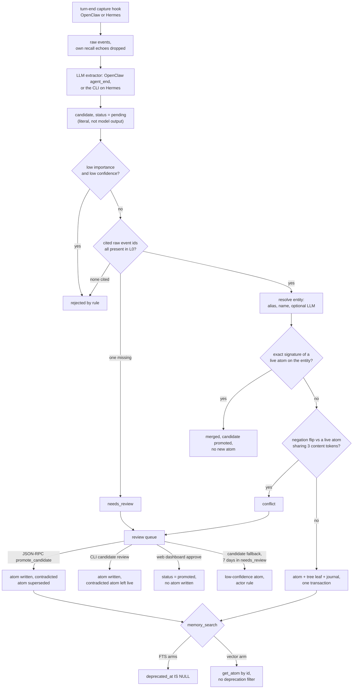

## 1. Executive Summary

Octop Memory is a Python memory runtime for LLM agents, published by
TencentCloud under MIT at version 1.0.0. It runs as a library, a CLI, a
JSON-RPC bridge, and two host plugins: an OpenClaw extension that spawns the
bridge as a subprocess and a Hermes provider that calls it in-process. Storage is
SQLite with FTS5 by default, or PostgreSQL.

The memory is a five-layer pipeline. Raw events are captured at the end of each
agent turn. An LLM extracts candidates from them, on OpenClaw in the same hook, and a rule-only worker decides
each candidate in five checks: value, evidence, entity, duplicate and conflict.
A candidate that passes becomes an `AtomCard`, a fact with a verbatim quote and
the raw event ids it came from. Entity pages and episode summaries are derived
beside the atoms.

What is notable is how much of the write path refuses to trust the model. The
parser writes `pending` as a literal, and the extractor's `recommended_action`
is stored and never read. A candidate whose cited raw event is missing is parked
for review rather than dropped, and promotion writes the atom, its supersession,
its tree leaf, a page-dirty flag and a journal row in one transaction.

What is weak is the review queue's far end. Three surfaces resolve a parked
candidate and they disagree: one supersedes the contradicted atom, one leaves
both live, and the web dashboard marks the candidate promoted without writing an
atom at all. Conflict detection is a negation-token flip between assertions that
share three content tokens. The opt-in vector arm returns atoms that deprecate
and delete have retired.

Five marks: `trust_state`, `scope_enforced` on the PostgreSQL tier,
`audit_log`, `human_review` and `negative_eval`. Section 9 names the two
withheld.

## 2. Mental Model

A fact becomes a belief when a candidate is promoted to an atom. Before that it
is a claim with a status, and nothing that assembles a prompt reads candidates.
The candidate may be dropped as chit-chat, merged into an identical live atom,
parked as `needs_review` or `conflict`, or promoted. An atom stops being a belief
when `deprecated_at` is set by replacement, deprecation, deletion or
consolidation. After 90 days the GC deletes the row.

**The worker demotes; it does not admit.** Every candidate becomes an atom
unless a check fires (`pipeline/promotion/__init__.py:185-258`). Low importance
and low confidence together drop it. An empty evidence list drops it; a cited
raw event missing from L0 parks it, because *"the user might still want to
manually re-attach evidence"* (`checks.py:205-237`). An exact normalised match
against a live atom merges it. An opposite negation polarity against a live atom
on the same entity, sharing at least three content tokens, parks it as
`conflict` (`checks.py:510-553`).

**A person resolves the queue, and where they do it decides the outcome.** The
JSON-RPC `promote_candidate` force-promotes and supersedes the contradicted atom
(`__init__.py:260-314`). The CLI `candidate review` writes the atom and
supersedes nothing (`candidate_cmd.py:595-659`). The web dashboard sets the
status column and writes nothing else (`adapters/dashboard/server.py:578-606`).

## 3. Architecture

`Memory` in `core.py` is the facade over a `MemoryBackend`, with SQLite and
PostgreSQL implementations of one contract (`storage/backends/__init__.py`).
`MemoryRuntime` in `application/runtime.py` holds the host operations: capture,
extract, promote, search and get. `Bridge` wraps the runtime as JSON-RPC and adds
the dashboard's read and write methods to the same dispatch table
(`adapters/bridge/handlers.py:51-61`). `tests/test_architecture_boundaries.py`
pins the layering: pipeline and storage never import adapters.

**The two backends partition differently.** SQLite prefixes every table name
with the namespace, so `agent_x_atoms` and `agent_y_atoms` share a file and
nothing else (`sqlite.py:211-480`). PostgreSQL puts every namespace in one
schema, adds `namespace` to each primary key, and binds it into every query
(`postgres.py:400-423`). A namespace names one agent's store: the portable
exporter discovers them as `~/.octop/agents/*/memory.sqlite`.

The LLM is injected. Without one, capture, manual `store` and FTS recall work,
and extraction returns a failure reason and leaves the events unmarked for the
next turn (`runtime.py:545-554`). A LangGraph checkpointer shares the database
file and a large part of the code; it holds execution state, not memory, and is
not covered here.

### Deployment and ergonomics

`pip install octop-memory` has no core dependencies beyond the standard
library. PostgreSQL, the CLI, and the checkpointers are extras. The dashboard
ships only from a source checkout: `pyproject.toml:87-92` excludes it from the
wheel. The OpenClaw plugin needs `llm.endpoint` configured before it calls
extract (`index.ts:204`). A wrong atom is fixed with `replace_atom` from the
JSON-RPC surface, `Memory.delete` on its tree leaf, or the CLI.

## 4. Essential Implementation Paths

- **Capture** — `MemoryRuntime.capture` filters by role, strips `<think>`
  blocks, drops text carrying the recall marker `## Memory Recall`, skips short
  messages unless they state memory intent, redacts, and writes one batch
  (`runtime.py:316-425`).
- **Extract and promote** — `_extract_impl` lists the session's raw events,
  skips ids this process already extracted, runs `CandidateExtractor`, stores
  candidates, then runs `PromotionWorker.promote` on them (`runtime.py:512-575`).
- **Promotion** — `_promote_one` and the five checks
  (`pipeline/promotion/__init__.py:185-258`; `checks.py:178-553`); `_apply_promote`
  wraps the writes in `backend.transaction()` and indexes the vector after
  commit (`__init__.py:408-507`).
- **Human resolution** — `PromotionWorker.approve` (`__init__.py:165-179`),
  `promote_candidate` and `reject_candidate` in `dashboard_data.py:871-948`, the
  CLI `review` loop (`candidate_cmd.py:523-724`), and the FastAPI PATCH route
  (`server.py:578-606`).
- **Correction** — `Memory.replace_atom` writes a successor, supersedes, journals
  `user_edit` and swaps the vector entry (`core.py:678-762`); `deprecate_atom`
  and `delete` set `deprecated_at` (`core.py:238-279`, `:486-540`).
- **Recall** — `recall_for_prompt` runs cache, parse, route, gather, raw policy,
  rerank, diversify, suppress and budget (`pipeline/recall/__init__.py:330-520`);
  `gather_candidates` does the per-source reads (`multi_source.py:46-226`).
- **Fallback** — `run_fallback_pass` (`pipeline/promotion/fallback.py:61-286`),
  reached only through `candidate fallback` (`candidate_cmd.py:732-772`).

## 5. Memory Data Model

Six stored layers, each a table set per namespace (`types.py`).

- **`RawEvent`** (L0) — host, session, thread, user, timestamp, event type,
  content and payload. The evidence every candidate must cite.
- **`Candidate`** (L1) — an extracted claim: type (`Fact`, `Decision`, `Task`,
  `Preference`, `ConflictCandidate`), status, assertion, a verbatim quote of at
  most 200 characters and the raw event it came from, subject name and type,
  importance and confidence, `decided_at` and `decided_by`
  (`types.py:136-175`). The docstring's anti-dilution rule requires a
  high-importance assertion to equal its quote.
- **`AtomCard`** (L2) — the recalled fact. It carries `candidate_id` and
  `raw_event_ids` back to its evidence, `occurred_at` set to the earliest cited
  raw event, `superseded_by`, and `deprecated_at` (`types.py:184-212`).
- **`Entity`**, **`Alias`** and **`EntityPage`** (L3) — a narrow anchor, its
  normalised aliases, and an LLM-regenerated summary with a protected
  `## My Notes` section.
- **`Episode`** and **`DigestRecord`** — an emotion-tagged event summary with a
  model-supplied `occurred_at`, and period digests over episodes.
- **`JournalEntry`** (L4) — action, actor, target ids, `before`, `after`, note
  (`types.py:448-497`).

A tree of root, branch and leaf nodes organises atoms by entity. A leaf holds
an `atom_id` and projects the atom's text; `Memory.update` refuses to edit leaf
content (`core.py:229-230`), so the tree cannot become a second copy of a fact.

## 6. Retrieval Mechanics

The router picks sources from the parsed query: atoms and raw events always,
page headlines when an entity resolves, vectors when an index is injected
(`router.py:97-108`). Atom search runs once per token and merges, because the
FTS query wraps the whole string as a phrase (`multi_source.py:285-330`). A
time window in the query switches the atom arm to an `occurred_at` range.

Candidates are reranked on five factors with weights `(0.40, 0.20, 0.15, 0.15,
0.10)`: FTS rank position, importance, confidence, a 30-day recency half-life,
and a layer prior of 1.0 for atoms and 0.5 for raw (`rerank.py:1-40`). A
per-entity cap, Jaccard suppression and a character-proxy token budget follow.

**Raw is a last resort.** Under the default `fallback` policy every raw
candidate is dropped once any atom, page or episode hit exists, and raw from the
current session or thread is always dropped (`recall/__init__.py:528-553`). A
parked candidate's contradicting utterance therefore stays out of the prompt
while the old atom still matches.

**The FTS arms filter deprecation and the vector arm does not.**
`search_atoms` appends `deprecated_at IS NULL` in both backends
(`sqlite.py:1448-1468`; `postgres.py:1458-1477`). The vector arm takes ids from
the index and loads each with `get_atom`, which has no filter
(`multi_source.py:417-425`; `sqlite.py:1277-1283`). Only `replace_atom` removes
a vector entry (`core.py:754-755`). With an index configured, an atom retired by
deprecation, deletion, consolidation or a conflict approval is still returned
by semantic search until the GC deletes its row.

`memory_search` also appends hits from the host's own Markdown files
(`MEMORY.md`, daily notes) when a host-file index is attached
(`runtime.py:249-267`). Those files are the host's, and nothing here corrects
them.

## 7. Write Mechanics

Writes are automatic on OpenClaw. The plugin's `agent_end` hook sends the
turn's messages to `capture`, then calls `extract` for the session when an LLM
endpoint is configured (`index.ts:195-251`). The Hermes provider captures only:
`sync_turn`, pre-compression context and the host's own memory writes become raw
events (`plugins/hermes/octopmemory/__init__.py:253-298`), and nothing in it
calls `extract` or `promote`. On Hermes, facts reach the atom layer when someone
runs `candidate extract` or `backfill`; until then recall serves raw events.

Extraction is incremental within one process: `_seen_ids_for` remembers the
event ids already extracted per session, capped by an LRU (`runtime.py:664-673`).
Across a restart, `add_candidates` skips a candidate whose assertion, subject and
raw event id set equal an already `promoted` one (`core.py:380-390`;
`sqlite.py:1070-1100`).

`Memory.store` is the manual path: it writes a raw event, a candidate marked
promoted by the user, an atom and a leaf, with no model call. `Memory.create_atom`
and `replace_atom` are the correction paths, each journalled.

**Consolidation** clusters live atoms on one entity by Jaccard at 0.85 or an LLM
`same_assertion` call, keeps the highest-ranked member, and supersedes the rest
(`pipeline/lifecycle/consolidate.py:1-45`). It is reached from the CLI or a
host's idle timer, never from promotion.

### Operational cost

One extraction call per turn with new events, plus at most one LLM escalation
per candidate for entity disambiguation; duplicate and conflict checks are
rule-only (`pipeline/promotion/__init__.py:16-19`). Page regeneration and episode
extraction add calls when a heavy-tier client is configured. Recall makes no
model call.

## 8. Agent Integration

Both hosts hand the model two tools, `memory_search` and `memory_get`
(`index.ts:368-374`; `plugins/hermes/octopmemory/__init__.py:270-281`). Every
write happens in hooks the model does not drive, or from the CLI. The OpenClaw plugin also
prefetches recall into the prompt through the host's memory-prompt builder
(`src/auto-recall.ts`) and registers a `/octopmemory` chat command limited to
status, search, show and reindex (`chat-command.ts:35-58`).

`memory_get` resolves virtual paths such as `atom/<id>.md` and `raw/<date>/<id>.md`
to rows (`runtime.py:691-751`). It reads through `get_atom` and `get_raw`, so an
agent holding an old atom id reads a deprecated atom without a marker.

The JSON-RPC bridge carries more than the plugin uses: `promote_candidate`,
`reject_candidate`, `deprecate_atom`, `create_atom` and `replace_atom` are on the
same dispatch as `memory_search` (`handlers.py:51-61`;
`dashboard_data.py:1143-1182`). The plugin forwards only fixed method names, so
the model cannot reach them.

## 9. Reliability, Safety, and Trust

**The status column is out of the model's reach.** The parser assigns
`status="pending"` and a worker-generated id (`parser.py:284-288`). The model's
`recommended_action`, including `conflict`, is persisted and has no reader in
the promotion code. A model cannot promote its own claim by saying so.

**The web dashboard's approve loses the memory.** Its confirm dialog says an
approved candidate will be written to long-term memory on the next cycle
(`static/index.html:755-771`). The route sets the status and returns
(`server.py:578-606`). `promote_pending` selects only `pending`, and `promote`
skips `promoted`, so no cycle picks it up. No test calls the route. The
dashboard's atom DELETE likewise sets `deprecated_at` without a journal row.

**Contradiction is resolved three ways.** The JSON-RPC approve supersedes the
old atom and a test pins it (`tests/test_bridge_dashboard.py:690-732`). The CLI
approve does not, so both sides are recalled. Conflict detection itself catches
an assertion and its negation when they share three content words, such as
`user uses PostgreSQL for billing` against `user does not use PostgreSQL for
billing`. It misses `prefers Go` against `prefers Python`, which carry the same
polarity.

**The fallback pass composes against its own intent.** Task 2 flips a pending
candidate whose normalised assertion was rejected at least twice to
`needs_review`. Task 1 promotes any `needs_review` row older than seven days as
a low-confidence atom (`fallback.py:94-155`, `:235-286`). Run daily as the CLI
recommends, a twice-rejected value returns as a memory a week later unless
someone reviews it. Rule drops count as rejections too.

**Privacy.** Capture redacts configured patterns and secret-looking payload
keys (`runtime.py:948-1001`). Raw events are the one layer the web dashboard can
hard-delete.

Capability marks:

- `trust_state` — awarded on the candidate status; the limits are in the record.
- `scope_enforced` — awarded on the PostgreSQL tier. SQLite, the default, is a
  table-prefix partition and would not carry it alone.
- `audit_log` — awarded on the journal; consolidation and GC rows expire after
  14 days.
- `human_review` — awarded: the queue fills on OpenClaw's turn-end path, and no
  approve verb is on either host's tool list. The approve paths' defects are in
  the record.
- `negative_eval` — awarded; section 10.
- `tombstone` — withheld. `check_duplicate` compares against live atoms only
  (`checks.py:470-474`), so a deprecated assertion re-extracted later is promoted
  afresh. The rejection counter in the fallback pass is keyed on the normalised
  value, runs only from the CLI, re-queues rather than blocks, and loses its
  inputs when the GC deletes rejected candidates after 30 days.
- `bitemporal` — withheld. An atom's `occurred_at` is when the claim was said,
  a point; an episode's is a model-supplied event time, never corrected. No row
  carries a validity interval.

## 10. Tests, Evals, and Benchmarks

Nothing was installed, built or run for this report; everything below is from
reading the tests at the pin. `docs/agent/HANDOFF.md` records 1,268 passed and
132 skipped, 129 of them PostgreSQL. That is the project's statement, not a run
of mine.

**Negative cases.** `test_search_excludes_deprecated_by_default` runs against
SQLite always and PostgreSQL when a server answers. It stores two atoms under
one marker, supersedes the first, asserts search returns exactly the second, and
asserts `include_deprecated=True` returns both (`test_backend_parity.py:578-585`).
`test_delete_leaf_clears_recall` asserts recall finds a marker before a delete
and returns `[]` after (`test_memory_tree.py:288-298`).
`test_shared_tables_isolate_namespaces` asserts an exact one-namespace hit list
over shared PostgreSQL tables (`test_postgres.py:285-298`); CI starts no server,
so it skips there.

`TestStrictInjectRaw` asserts a raw event matching the query is excluded once an
atom hits (`test_recall_pipeline.py:197-210`). The promotion, fallback, review
CLI, GC and consolidation modules each have their own file.

**Gaps.** No test puts a deprecated atom in a vector index and searches. No test
drives the web dashboard's PATCH route, which is where the lost approval sits.
Chroma and Qdrant are tested with fakes; the README says real integration is
unverified. `evals/recall/` computes P@5 and MRR over a synthetic corpus and
calls itself not a production benchmark. No paper or citation block is in the
tree.

## 11. For Your Own Build

### Steal

- **Keep the model's opinion off the status column.** Store what the extractor
  recommends; let rules and people set the state. The literal `pending` in the
  parser is one line.
- **Park a claim whose evidence id does not resolve.** A hallucinated source id
  is a signal that the extraction is unreliable, and dropping it loses the case a
  person could repair.
- **One transaction for atom, supersession, index projection and journal.**
  `_apply_promote` does it and raises if the supersede target moved underneath.
- **Refuse your own recall block at capture.** Matching the rendered header, not
  a bare tag, stops the feedback loop without eating user text.
- **Raw as last resort, never from this session.** It keeps the prompt from
  echoing the conversation it is already in.

### Avoid

- **Several resolvers for one queue.** If a CLI, an RPC and a web UI each
  implement approve, they will differ; put the verb in one function and have
  every surface call it — see [resolve, don't just
  detect](../../patterns/resolve-not-just-detect/).
- **An approve that only moves a status.** If the worker selects on `pending`,
  a row set to `promoted` by hand is terminal and empty.
- **Retiring a row in one index and not the other.** Every path that sets
  `deprecated_at` has to drop the vector entry, or every read has to filter.
- **A fallback that promotes what a counter just flagged.** Exclude re-escalated
  rows from the stale sweep, or key the sweep's clock on a human-visible event.

### Fit

This fits a single agent's personal memory on OpenClaw or Hermes, where
transcripts are the source, facts are short, and someone will occasionally open
a review queue. The candidate layer and evidence ids make it more defensible
than a store that writes whatever the extractor emits. It fits less well where
paraphrased contradictions matter, since the conflict rule reads negation words.
It fits poorly with the vector arm on until deprecation reaches the index. A
multi-tenant deployment should use PostgreSQL, where the namespace is a key and
a predicate.

## 12. Open Questions

- Does OpenClaw's `agent_end` context carry the whole conversation or the last
  turn? Capture writes every message it receives with a fresh id, so the answer
  decides whether raw events duplicate each turn. The host's contract is not in
  this tree.
- Which host drives `run_idle_maintenance`? The docstring names the
  `octop-harness` `MemoryMiddleware`, which is not in this repository.
- Is the source dashboard in use anywhere approvals matter, or has the JSON-RPC
  dashboard replaced it? The README calls it source-only.
- What name did the project carry before the rename in `CHANGELOG.md`? The tree
  was scrubbed of it, per `docs/agent/HANDOFF.md`.

## Appendix: File Index

- **Types and API:** `src/octop_memory/types.py`, `src/octop_memory/core.py`,
  `src/octop_memory/service.py`, `src/octop_memory/application/runtime.py`.
- **Promotion:** `src/octop_memory/pipeline/promotion/__init__.py`,
  `checks.py`, `fallback.py`, `llm_hook.py`;
  `src/octop_memory/pipeline/extractor/parser.py`.
- **Recall:** `src/octop_memory/pipeline/recall/__init__.py`,
  `multi_source.py`, `router.py`, `rerank.py`.
- **Storage:** `src/octop_memory/storage/backends/sqlite.py`,
  `src/octop_memory/storage/backends/postgres.py`,
  `src/octop_memory/storage/vector/`.
- **Lifecycle:** `src/octop_memory/pipeline/lifecycle/gc.py`, `consolidate.py`,
  `maintenance.py`.
- **Human surfaces:** `src/octop_memory/adapters/cli/candidate_cmd.py`,
  `src/octop_memory/application/dashboard_data.py`,
  `src/octop_memory/adapters/bridge/handlers.py`,
  `src/octop_memory/adapters/dashboard/server.py`,
  `src/octop_memory/adapters/dashboard/static/index.html`.
- **Host plugins:** `plugins/openclaw/octopmemory/src/index.ts`,
  `plugins/hermes/octopmemory/__init__.py`.
- **Tests:** `tests/test_backend_parity.py`, `tests/test_memory_tree.py`,
  `tests/test_postgres.py`, `tests/test_recall_pipeline.py`,
  `tests/test_bridge_dashboard.py`, `tests/test_promotion_fallback.py`,
  `tests/test_cli_review.py`.

### Recorded searches

Checked against the checkout at the pinned revision.

- `grep -rn -E '\.approve\(|def approve|approve_candidate|reject_candidate' src plugins --include='*.py' --include='*.ts'` — the definition and one caller, `dashboard_data.py:893`, plus `reject_candidate` in the dispatch table.
- `grep -rn -E 'registerTool|get_tool_schemas' plugins --include='*.ts' --include='*.py'` — `index.ts:369` and `:372`, and the Hermes schema list; both name only `memory_search` and `memory_get`.
- `grep -rn 'run_fallback_pass' src plugins` — only `candidate_cmd.py`.
- `grep -rn '_drop_atom_vector' src` — the definition and one caller, `core.py:755` in `replace_atom`.
- `grep -rn 'deprecated' src/octop_memory/pipeline/recall/` — no match.
- `grep -rn -E 'search_candidates|list_candidates\(' src/octop_memory/pipeline/recall src/octop_memory/application/runtime.py src/octop_memory/service.py` — no match.
- `grep -rn 'recommended_action' src --include='*.py'` — the parser, storage, import, fallback copy and two manual constructors; no reader in `checks.py` or the worker.
- A Python regex over every `execute(` string in `postgres.py` for `SELECT|UPDATE|DELETE` without `namespace` — only `meta` (keyed `ns:key`), advisory locks, catalogue queries, and four `{where}` builders whose condition list starts with `namespace = %s`.
- `grep -rn 'append_journal' src/octop_memory/adapters/dashboard/server.py` — no match.
- `grep -rn -iE 'PATCH|api/candidates/' tests` — no match on the dashboard route.
- `grep -rn -iE 'postgres' .github/workflows/` — no match; CI starts no database.
- `grep -rliE 'arxiv|bibtex|@article|@misc|doi\.org' . --exclude-dir=.git` — no match, and no `CITATION` file.

## History

**2026-09-30** — [`8b6abc3b6817f6b6d993d68190bc7ffc0a70dccf`](https://github.com/TencentCloud/octop-memory/commit/8b6abc3b6817f6b6d993d68190bc7ffc0a70dccf) — first reading, at the head of `main`, the 1.0.0 release merge, dated 24 September 2026. Five marks: `trust_state`, `scope_enforced`, `audit_log`, `human_review`, `negative_eval`. Screened before reading: one auto-run surface (`.githooks/pre-commit`, inert unless `make install-hooks` sets `core.hooksPath`), one build-time execution point (`Makefile`), two unpinned surfaces, five dependency files inside the cooldown — every file in a depth-1 clone dates to the tip, and the whole history is four commits that week — and `AGENTS.md` recorded as data. Read with `grep` and `sed`; nothing installed, built or run.
