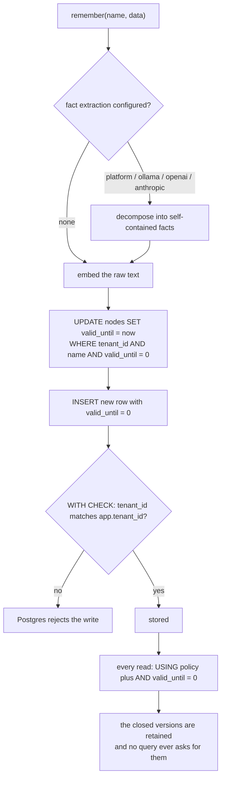

## 1. Executive Summary

Octopoda is a memory and observability layer for AI agents: a Python SDK, an MCP
server, a live dashboard, and a Postgres schema with pgvector. About 42,000 lines
of Python across `synrix`, `synrix_runtime` and `octopoda_zf`.

**The licence is split and a reader should know exactly where the line falls.**
`LICENSE` opens "MIT License (SDK Code Only)" and states that the "Native engine
and binaries (including but not limited to `libsynrix*.dll`, `synrix-server`, and
related executables) are proprietary", free under a 25,000-node evaluation tier
and requiring a commercial licence above it. `synrix/engine.py` downloads that
binary from a separate releases page; **it is not in this tree**.

That would normally be the closed-mechanism exclusion. It is not, because the
same repository ships `init.sql` and an 860-line `postgres_client.py` that
implement the whole memory model in the open: the tables, the indexes, the write
path, the version closing and every query. The native engine is one backend among
three (`auto`, `sqlite`, `lattice`, plus `mock`), and the data model is fully
readable. What cannot be inspected is how the proprietary engine performs the
same operations.

**The mechanism worth the report is where tenant isolation lives.** Section 6 of
`init.sql` is headed "ROW-LEVEL SECURITY — THE TRUST WALL". Five tables —
`nodes`, `fact_embeddings`, `entities`, `relationships`, `tenant_settings` — get
`ENABLE ROW LEVEL SECURITY` and a policy `FOR ALL TO octopoda_app` with both
`USING (tenant_id = current_setting('app.tenant_id', TRUE))` **and** a matching
`WITH CHECK`. The application sets `SET LOCAL app.tenant_id` per transaction.

Most systems in this atlas enforce scope by remembering to add a predicate. Here
a query that forgets the tenant returns nothing, and an insert that carries the
wrong one is rejected — by the database, under a role that cannot bypass it. The
`USING`/`WITH CHECK` pair matters: `USING` alone would let a tenant write a row
they could then never read.

**The audit log is hash-chained, and the reason it lives where it does is stated
plainly.** `synrix_runtime/audit_v2/storage.py` computes SHA-256 over
`(prev_hash + canonical event)` per tenant and agent, so events form a
tamper-evident chain. The rows are stored **inside the `nodes` table** rather
than a dedicated one, and the header gives the reason: "the app-level DB role
doesn't have CREATE TABLE rights on the managed Postgres instance. This keeps the
v1 deployment free of any admin-level schema changes." Audit events are written
with `valid_until = 0` because they "are immutable", and the module asserts that
the connection's effective tenant matches the tenant argument on every call.

## 2. Mental Model

A memory is a **named node** scoped to a tenant: a name, a JSONB payload, a
JSONB metadata blob, a 384-dimension vector, and a validity interval of
`valid_from`/`valid_until` as double-precision epoch seconds, where
`valid_until = 0` means current.

Updating a memory does not overwrite it. The write closes the previous version by
stamping `valid_until`, then inserts a new row — and the unique index
`(tenant_id, name, valid_from)` makes the version chain the primary key.
Reads all carry `AND valid_until = 0`.

Above the node sit two derived layers: `fact_embeddings`, holding LLM-extracted
self-contained facts with their own vectors, and a knowledge graph of `entities`
and `relationships` with a confidence float. Beside them sits an observability
tier — the audit chain and a rule-based loop detector.



The last box is the finding. The write path is careful to preserve history; no
read path in the tree asks for it.

## 3. Architecture

Three deployment shapes from one SDK: a local SQLite backend, a Postgres
deployment with pgvector, and the proprietary native engine. `synrix/engine.py`
detects the platform and, when a download base URL is configured, fetches the
binary.

`synrix_runtime` (27,500 lines) holds the runtime — `core/` with a daemon,
garbage collection, heartbeats, recovery, a registry and a namespace module;
`audit_v2/` with the hash chain, an async writer, framework/LLM/MCP/SDK hooks and
a UI; `loop_intel_v2/` with the loop classifiers; a dashboard; and monitoring.

`loop_intel_v2` states its own contract in its package docstring, and it is a
good contract: every classifier is "Rule-based (no LLMs in the detection path)",
deterministic, versioned with a `rule_version` reported on every detection,
unit-testable as a pure function of input events, and self-documenting with rule
text explaining when it fires. Reporting the rule version alongside the verdict
is what lets an operator tell a behaviour change from a rule change.

## 4. Essential Implementation Paths

**Write** — `synrix/postgres_client.py:300-320`: close the current version with
`UPDATE nodes SET valid_until = %s WHERE tenant_id = %s AND name = %s AND
valid_until = 0`, then insert the new row.

**Fact extraction** — `synrix/fact_extractor.py` decomposes text into
self-contained facts before embedding, across five provider options
(`platform`, `ollama`, `openai`, `anthropic`, `none`) with a documented fallback
chain, claiming this moves semantic search quality "50% → 88%+".

**Read** — `query_prefix`, search and listing, each with `AND valid_until = 0`,
under the RLS policy.

**Audit** — `audit_v2/async_writer.py:138-188`: warm `prev_hash` per
`(tenant, agent)`, compute `this_hash`, write, chain forward, cache.

**Isolation** — `init.sql:194-225`, plus the per-call tenant assertion in
`audit_v2/storage.py`.

## 5. Memory Data Model

`nodes` is nine columns and it is the whole store:

```
nodes(id, tenant_id, name, data JSONB, metadata JSONB,
      embedding vector(384), valid_from, valid_until, created_at)
```

with four indexes doing four different jobs: a unique index on
`(tenant_id, name, valid_from)` enforcing one row per version, a partial index on
`(tenant_id, name) WHERE valid_until = 0` for current lookups, a
`text_pattern_ops` partial index for prefix search, an HNSW index on the vector,
and a GIN index on the JSONB. Choosing partial indexes on the current-version
predicate is the right call given every read carries it.

`fact_embeddings` links extracted facts back to their node by name, with a
category and a collection. `entities` carries `first_seen`, `last_seen` and
`mention_count` under a `UNIQUE(tenant_id, name, entity_type, collection)`;
`relationships` carries a `confidence` float and cascades on entity deletion.

There is no status field, no verification field and no trust state on a memory.
The only epistemic number in the schema is `confidence` on a graph relationship.

## 6. Retrieval Mechanics

Three routes: prefix lookup over the `text_pattern_ops` index, JSONB containment
over the GIN index, and cosine similarity over the HNSW vector index — on
`fact_embeddings` as well as `nodes`, so a query can match an extracted fact
rather than the whole memory.

Every route filters `valid_until = 0`, and the RLS policy is applied by Postgres
underneath. There is no reranker and no fusion in the inspectable path; the
document count claim in the README is about breadth of integration rather than
ranking sophistication, and this is a plain retrieval stack.

**No read path takes a point in time.** `valid_from` and `valid_until` are
written on every update, indexed, and returned in some result rows — and
searching the client for a comparison other than `valid_until = 0` finds none.
So the store accumulates a full version history that nothing can query. This is
the reason `bitemporal` is withheld: the storage is bi-temporal and the access is
not, which is a different and more recoverable state than not tracking validity
at all.

## 7. Write Mechanics

Writes are synchronous, and the version-closing update plus insert happen in one
transaction, so a read can never see two current versions or none.

The ephemeral path is deliberately different and worth knowing about:
`add_node_ephemeral` runs `DELETE FROM nodes WHERE tenant_id = %s AND name = %s`
— **all** versions, not just the current one — before inserting, with the comment
"This keeps the table flat: exactly one row per ephemeral key". So a key written
ephemerally has no history at all, and a key that was durable and is later
written ephemerally loses the history it had.

Nothing records a rejected value. A memory deleted or superseded can be written
again immediately, and the audit chain records that it happened without
preventing it.

## 8. Agent Integration

A Python SDK with three API levels (`Memory` for three-line usage,
`SynrixAgentBackend` for the low-level client, `AgentRuntime` for the high-level
runtime), an MCP server, LangChain integration, framework hooks, an OpenClaw
skill and a dashboard that "runs locally and in the cloud".

The observability tier is the product's own emphasis — loop detection, anomaly
streams, per-agent scores — and it is instrumented through the same audit hooks
that feed the chain, which is why the audit design is more developed than the
memory design.

## 9. Reliability, Safety, and Trust

**Scope enforced — awarded, and it is the strongest instance in this atlas.**
Isolation is a database policy rather than an application convention. Five
tables, `FOR ALL`, both `USING` and `WITH CHECK`, a dedicated application role,
and a per-transaction `SET LOCAL`. A forgotten predicate returns nothing rather
than everything, and `tests/test_e2e_tenant_isolation.py` exists to exercise it.
The audit module adds a second belt, asserting the connection's effective tenant
matches its argument.

**Audit log — awarded.** Per-tenant, per-agent SHA-256 chain over
`(prev_hash + canonical event)`, written asynchronously, with rows marked
immutable. The candour about *why* it lives in `nodes` — no `CREATE TABLE` right
on the managed instance — is worth as much as the mechanism: it is an honest
record of a constraint, and it means the audit rows are subject to the same RLS
as the memory they describe.

**Bitemporal — withheld**, for the reason in section 6.

**Trust state — no.** No status, verification or review field on a node.

**Human review — no.** The dashboard displays fleet health, anomalies and loops;
nothing there adjudicates memory content.

**Tombstone — no.** Supersession closes a version; the ephemeral path hard-deletes
every version. Neither leaves a record keyed on the value.

**Negative eval — no.** 32 test files including tenant isolation, GC, the
knowledge graph, the fact extractor and two audit suites; none asserts that
particular material must not be retrieved. The isolation test is the closest —
if it asserts that tenant B's query returns none of tenant A's rows it would be
a boundary case in the atlas's sense, and I did not read it closely enough to
claim that.

## 10. Tests, Evals, and Benchmarks

**No paper.** No arXiv reference, DOI or citation file.

32 files under `tests/`, including `test_e2e_tenant_isolation.py`,
`test_full_audit.py`, `test_audit_bugfixes_3_1_12.py`, `test_knowledge_graph.py`,
`test_gc.py`, `test_daemon.py`, `test_licensing.py`, a CI smoke test, a
local-mode smoke test and a load-test runner. Two CI workflows are advertised in
the README badges.

**I did not run them.** The screen flagged `tests/conftest.py` as executing on
collection and an unpinned `pyproject.toml`; the tree was read, not installed.
Running them would in any case exercise only the open backends, since the native
engine is downloaded rather than committed.

No retrieval benchmark is committed. The one quality claim in the tree is
`fact_extractor.py`'s "Dramatically improves semantic search quality (50% →
88%+)", which appears in a docstring with no harness, dataset or result file
behind it.

## 11. For Your Own Build

### Steal

- **Put tenant isolation in the database, not in the query.** RLS with a
  dedicated application role and `SET LOCAL` per transaction converts "every
  query must remember the predicate" into "the predicate cannot be forgotten".
  It is roughly thirty lines of DDL.
- **Pair `USING` with `WITH CHECK`.** `USING` filters reads; without
  `WITH CHECK`, a caller can insert a row into another tenant that they will
  never be able to read — the worst possible failure, because nothing surfaces
  it.
- **Assert the connection's tenant inside the module too.** A second check in
  application code costs nothing and catches a connection that was handed over
  without its setting.
- **Chain the audit per tenant and agent.** SHA-256 over `(prev_hash + canonical
  event)` with the last hash cached in memory and warmed from the database on
  first use is cheap enough to run on every event.
- **Write down why the schema is shaped the way it is.** "The app-level DB role
  doesn't have CREATE TABLE rights" is the sentence that stops the next
  maintainer refactoring the audit into its own table and breaking the deploy.
- **Use partial indexes on the current-version predicate.** If every read carries
  `WHERE valid_until = 0`, the indexes should too.
- **Report the rule version with every rule-based verdict.** `loop_intel_v2`
  does, and it is what lets an operator distinguish "the agent changed" from
  "the rules changed".
- **Extract self-contained facts before embedding.** Embedding a decomposed fact
  rather than a paragraph is a well-supported move, and the five-provider
  fallback chain here degrades to raw text rather than failing.

### Avoid

- **Do not write a version history no query can read.** Every update pays the
  cost of a second row and nothing can ask "what did this say last month". Either
  add the `valid_at` predicate — it is one comparison — or stop writing the
  interval.
- **Do not let one write path delete another's history.** `add_node_ephemeral`
  removes *all* versions of a key, so a durable memory later written ephemerally
  loses its past silently.
- **Do not ship a quality claim with no harness.** "50% → 88%+" in a docstring is
  unverifiable from the repository.
- **Do not assume an open SDK means an open mechanism.** The default backend here
  is a proprietary binary from another repository; the Postgres path is what
  makes this analysable, and a reader evaluating the product may not be running
  it.

### Fit

This suits a team running many agents in production that needs hard multi-tenant
isolation and an audit trail, and that is comfortable with a commercial licence
above the free node limit. The memory model itself is plain — named nodes,
versions, vectors, an entity graph — and the value is in the operational layer
around it.

It is the wrong choice for anyone who wants to understand or modify how retrieval
works at the default backend, and for anyone who needs correction semantics:
there is no trust state, no review surface, and no rejected-value record.

## 12. Open Questions

- **What does the native engine do differently?** The Postgres path is the
  readable one and may not be the one most deployments run. Whether the engine
  implements the same version semantics is not answerable from this tree.
- **Was the `valid_at` read removed or never written?** The interval, the
  indexes and the unique constraint are all built for it.
- **Does the audit chain get verified anywhere?** The write side computes and
  chains; a verifier walking the chain and reporting a break was not found.
- **What happens to the chain cache across processes?** `_last_hash_cache` is
  per-process and warmed from the database on first use; two writers for the same
  `(tenant, agent)` racing on the tail was not traced.

## Appendix: File Index

**Schema and isolation** — `init.sql` (`nodes` at `:69`, `fact_embeddings`
`:106`, `entities` `:129`, `relationships` `:145`, the RLS section `:171-225`)

**Memory client** — `synrix/postgres_client.py` (version close and insert at
`:300-320`, `add_node_ephemeral` `:360-390`, `query_prefix` `:392`),
`synrix/memory.py`, `synrix/agent_memory.py`, `synrix/direct_client.py`,
`synrix/client.py`

**The engine boundary** — `LICENSE` (the proprietary-components section),
`synrix/engine.py`, `synrix/licensing.py`

**Audit** — `synrix_runtime/audit_v2/storage.py` (the chain and its rationale),
`async_writer.py:138-188`, `models.py`, `trace.py`, `decisions.py`,
`framework_hooks.py`, `llm_hooks.py`, `mcp_hooks.py`, `sdk_hooks.py`

**Loop detection** — `synrix_runtime/loop_intel_v2/` (the contract in
`__init__.py`)

**Runtime** — `synrix_runtime/core/` (`daemon.py`, `gc.py`, `heartbeat.py`,
`namespace.py`, `recovery.py`, `registry.py`), `synrix_runtime/api/runtime.py`

**Extraction** — `synrix/fact_extractor.py`, `synrix/extractor.py`,
`synrix/embeddings.py`

**Integration** — `octopoda/__init__.py`, `synrix/cloud.py`,
`synrix/langchain/`, `synrix/integrations/`, `synrix_runtime/dashboard/`,
`openclaw-skill/`

**Tests** — `tests/` (32 files; `test_e2e_tenant_isolation.py`,
`test_full_audit.py`, `test_audit_bugfixes_3_1_12.py`, `test_knowledge_graph.py`)

## History

**2026-08-09** — [`583ddf190df809d7380afd6d07ee4095086773c2`](https://github.com/RyjoxTechnologies/Octopoda-OS/commit/583ddf190df809d7380afd6d07ee4095086773c2) — first reading. Screened before reading: no auto-run surface, build-time execution in `tests/conftest.py`, one unpinned dependency surface. The tree was read, never installed, and no test was run. The proprietary native engine is not present in the tree and was not obtained.
