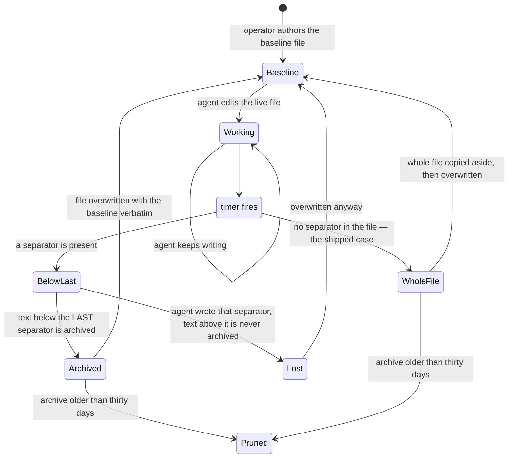

## 1. Executive Summary

ODS is the Osmantic Deployment System — Apache-2.0, 3,266 commits since 9 February 2026, 1,356 files, and overwhelmingly a *deployment* project. It installs and wires a local AI stack: Ollama, Open WebUI, n8n, ComfyUI, Qdrant, SearXNG, Whisper, TTS, LiteLLM, Langfuse and twenty-odd more, including agent hosts this atlas reports on separately ([OpenClaw](../openclaw/), [OpenCode](../opencode/), [Hermes](../hermes-agent/)).

**Almost none of that is memory, and the report says so up front.** Outside `ods/memory-shepherd/`, the phrases `agent memory`, `long-term memory` and `memory system` occur seven times in the whole tree, every one of them prose: two service tables, a changelog line, two model descriptions about GPU RAM, and one comment. Every occurrence of `forget` in code is `wifi-forget`, a Wi-Fi profile endpoint, or the idiom "fire-and-forget" in a test docstring; every occurrence of `embedding` is about deploying and validating embedding *models* for other services. Whatever memory the deployed stack has belongs to Open WebUI or n8n.

One component is the exception, and it is why this report exists. **`ods/memory-shepherd/` is a scheduled forgetting daemon for persistent LLM agents**, and its problem statement is one this atlas has been circling:

> *"Agents **rewrite their own instructions**, subtly altering their operating parameters."*

Its answer is positional. An agent's `MEMORY.md` is split by a `---` separator: above it, an operator-authored baseline — identity, rules, capabilities, pointers — that the agent is not permitted to durably change; below it, whatever the agent writes. Every few hours the scratch is archived to a timestamped file and `MEMORY.md` is replaced with the baseline verbatim. The authority boundary is a position in a file, and the enforcement is that the file is overwritten.

**On the configuration ODS actually ships, the boundary is never drawn.** `memory-shepherd.conf` manages three files per agent, not one — `MEMORY.md` on a three-hour timer, `AGENTS.md` and `TOOLS.md` on a sixty-second one — and none of the three shipped baselines contains a `---`. The split design lives in `baselines/example-agent-MEMORY.md` alone. Every shipped cycle therefore takes the branch meant for an unexpected file shape: copy the whole file aside, log a warning, overwrite. Which means the only way a separator ever enters one of these files is for the agent to write it, and that is exactly the case the boundary handles worst.

The design is honest with the agent about it. The shipped baseline template tells its own holder what is coming: *"Your additions will be periodically archived and this file reset to baseline. For anything worth keeping long-term, write it to your project repo."* A memory that discloses its own retention policy to the thing that writes into it is rare here.

**The defect is in the boundary.** The separator is located with `grep -n "^---$" | tail -1` — the *last* match in the file. A bare `---` is an ordinary Markdown horizontal rule and the fence for YAML front-matter, both of which language models emit constantly. If the agent writes one in its notes, the boundary moves down: only the text below the agent's own rule is archived, and the reset then overwrites `MEMORY.md` with the baseline regardless. Everything the agent wrote between the real separator and its own horizontal rule is neither archived nor retained.

The guards that do exist make the omission sharper rather than softer. The daemon refuses to reset when the baseline is suspiciously small, and backs up the whole file when it finds *no* separator at all — so the total-absence case is handled safely and the ambiguous case is not.

## 2. Mental Model

The memory unit is a Markdown file the operator owns and the agent borrows. The example baseline gives it two halves.

```text
MEMORY.md
  ## Who I Am              ← baseline: operator-authored, agent may not durably change it
  ## Critical Rules
  ## Capabilities
  ## Where to Find Things
  ---                      ← the separator is the contract
  ## Scratch Notes         ← agent-authored, ephemeral by policy
  - Found bug in auth module
```

A memory becomes durable by being in the baseline, which means a person put it there. A memory stops existing when the timer fires. There is no decay, no confidence, no supersession and no correction: the only lifecycle is *survive because an operator wrote you*, or *be archived and cleared*.

The shipped `ods-agent-*` baselines drop the second half. `AGENTS.md` and `TOOLS.md` are described in the config as "pure overwrite, no scratch", and the shipped `MEMORY.md` baseline has no separator either — so for the ODS agent the unit is simply *a file the operator restores*, and everything the agent wrote is displaced wholesale into an archive copy. The two-halves shape is what an operator gets by following the example, not what an install gives them.

That makes the epistemics unusually blunt and unusually clear. The agent's own notes are explicitly not trusted to persist, and the README names what that is for: role drift, context bloat, confusion between past and present tasks, and the agent rewriting its own operating parameters. Where most of this corpus tries to decide *which* agent-written memories deserve to last, this decides that none of them do, and pushes anything worth keeping into a different store — the project repository — by instruction rather than by mechanism.



## 3. Architecture

Two things sit in one repository and only the second is memory.

**The deployment system.** 336 shell scripts, 202 Python files, 179 YAML files and a Tauri installer, orchestrating 27 services under `ods/extensions/services/`. Nothing in it stores agent belief; the durable state is configuration, model inventory, GPU assignment, service health and token accounting (`token-spy/db.py` keeps a `usage` table).

**Memory Shepherd**, at `ods/memory-shepherd/` — 1,435 lines all told: a 338-line shell daemon, a 264-line installer, a 100-line uninstaller, a 277-line README, `docs/WRITING-BASELINES.md`, one example baseline and three shipped ODS ones. It is driven by an INI config with a `[general]` section and one section per agent, installed as systemd user units, and it handles remote agents over ssh as well as local ones.

### Deployment and ergonomics

For the memory component the cost is close to zero: Bash, `grep`, `sed`, `stat`, a config file and a timer. It runs anywhere the rest of ODS does — macOS, Linux, Windows — and the script carries explicit BSD/GNU `stat` divergence helpers, which is the kind of portability detail that is usually discovered in production.

The store is Markdown, so it is diffable, hand-editable, and reviewable in a pull request; the archives are plain files in a directory. An operator who wants to know what an agent has been thinking reads a timestamped file.

For ODS as a whole the cost is a different order — a local AI server with a dozen containers — but that is not what this report is assessing.

## 4. Essential Implementation Paths

### The reset — `memory-shepherd.sh`

The sequence, in order, per agent:

1. **Refuse a bad baseline.** If the baseline file is missing, or smaller than `MIN_BASELINE_SIZE` — 500 bytes by default, and the shipped baselines run 944 to 2,798 — the agent is skipped with an error: *"Baseline for $agent is suspiciously small … skipping"*. This is the guard that matters most, because the failure it prevents — resetting an agent to an empty identity — is unrecoverable from the agent's side.
2. **Force a reset on bloat.** Over `MAX_MEMORY_SIZE`, a warning is logged and the reset proceeds regardless.
3. **Locate the boundary**, discussed below.
4. **Archive the scratch.** Everything below the separator, with the `## Scratch Notes` heading and blank lines stripped, is written to `$archive_dir/$TIMESTAMP.md` under a header naming the agent and the timestamp — only if it is non-empty.
5. **Replace the file.** `cp "$baseline" "$tmpfile"; mv -f "$tmpfile" "$memory_file"` — a copy to a sibling temporary file then a rename, so a reader never sees a half-written `MEMORY.md`.
6. **Prune** archives older than the configured retention, default thirty days.

A lockfile at `/tmp/memory-shepherd.lock` with a cleanup trap keeps two runs from overlapping.

### The shipped schedule, and what the safe branch costs there

Two installers write timers and they disagree. `memory-shepherd/install.sh` generates one unit pair per agent plus an "all" pair, and enables only the latter: `OnCalendar=*-*-* 00/3:00:00`, every three hours, per-agent timers installed but left off. The ODS install phase does something else — `installers/phases/10-amd-tuning.sh` copies the four checked-in units from `ods/scripts/systemd/` into `~/.config/systemd/user`, creates `data/memory-archives/ods-agent/{memory,agents,tools}`, enables both timers and turns on lingering so they survive logout. Those units are `memory-shepherd-memory.timer` at three hours and `memory-shepherd-workspace.timer` at `OnUnitActiveSec=60s`, `AccuracySec=5s`, covering `AGENTS.md` and `TOOLS.md`.

Put that beside the separator-less baselines and the safe branch becomes an unbounded one. Every sixty seconds, for each of the two workspace agents, step 3 finds no separator, step 4 is replaced by `cp "$memory_file" "$archive_dir/${TIMESTAMP}-full-backup.md"`, and step 5 overwrites the file with a baseline it almost always already matched. `TIMESTAMP` is `date '+%Y-%m-%d_%H%M'`, so each run lands on its own filename: roughly 1,440 files per agent per day, 2,880 for the pair, each a copy of the baseline, each accompanied by a logged `WARN: No separator`. The pruner is `find "$ARCHIVE_DIR" -name "*.md" -mtime +30 -delete`, so the directory grows for a month and settles near 86,000 files. Nothing in the tree reads them.

### The archives are outside the backup contract

`ods/lib/backup-paths.sh` is the single source of truth for what `ods backup` captures and `ods restore` puts back, sourced by both so they cannot drift. Its header states the admission rule and names the class of state it exists to protect:

> *"user state that cannot be regenerated: conversations, workflows, vectors, **agent memory**, usage history, device authorisations."*

`data/memory-archives` is not in `ODS_USER_DATA_PATHS`, and not in the `ODS_BACKUP_EXCLUDED_DATA_PATHS` list beside it that exists to distinguish a deliberate skip from a forgotten one. The three backup types between them reach `ODS_USER_DATA_PATHS`, a whole-directory rsync of `$ODS_DIR/config`, `$ODS_DIR/models` and two named caches — so the one durable trace of what an agent wrote and had cleared is captured by none of them. The live files ride along, but incidentally: they sit at `config/openclaw/workspace/`, so a `full` or `config` backup sweeps them up as part of `config/` rather than by any named contract, and `ods backup -t user-data` misses them.

`ods/tests/test-backup-data-coverage.sh` was added to stop exactly this drift, and it cannot see it. It enumerates candidates by grepping `./data/<dir>` strings out of the compose files, then fails on any that appears in neither list. Memory Shepherd is a host systemd timer; it mounts nothing, declares nothing in a compose file, and its directory is created by an installer phase. A check whose enumeration comes from container mounts is blind to the one store in the repository that has no container.

### The boundary, and what it costs

```bash
separator_line=$(grep -n "^${SEPARATOR}$" "$memory_file" | tail -1 | cut -d: -f1 || echo "")
```

`tail -1` takes the last matching line. The intent is obvious and defensible — treat the final separator as the live boundary so an agent appending below it always lands in scratch — but it makes the boundary agent-writable in one direction. An agent that writes

```markdown
## Scratch Notes
- reviewed the auth module, notes below

---

- PR #42 approved, waiting on CI
```

has moved the boundary to its own horizontal rule. On the next cycle only the last two lines are archived, and then `MEMORY.md` is overwritten with the baseline. The first three lines are gone, unarchived, with no warning: step 4 logs *"Archived scratch notes"* and reports the line count of what it did capture, so the log records a success.

The asymmetry with the no-separator path is what makes this worth naming. When the daemon finds no separator at all it copies the entire file to `$TIMESTAMP-full-backup.md` and logs a warning first. The design already knows that an unexpected file shape should be preserved rather than assumed; it applies that instinct to zero separators and not to two.

The fix is small and in keeping with the rest — take the *first* separator, or a distinctive sentinel (`<!-- ods:baseline-end -->`) that a Markdown renderer ignores and an agent has no reason to emit.

### The baseline as an instruction

`baselines/example-agent-MEMORY.md` is a template with `## Who I Am`, `## Critical Rules`, `## Capabilities`, `## Where to Find Things` — and an italic preamble addressed to the agent, quoted in section 1, that states the retention policy and redirects anything durable to the project repository.

Two things follow. The policy is *disclosed* rather than silently applied, which is the difference between an agent that can plan around ephemerality and one that is surprised by it. And the redirect is advice, not a mechanism: nothing checks that the agent wrote the important thing to the repo, and nothing carries a note forward if it did not.

### Remote agents

`reset_remote_agent` performs the same sequence over ssh against `remote_host`/`remote_user`/`remote_memory`, with the same baseline guard applied before anything is touched. Fleet-level memory hygiene from one config file is a reasonable shape for the homelab audience ODS targets.

## 5. Memory Data Model

A file, a separator, and a directory of timestamped archives. There is no schema, no identifier, no timestamp inside the record, no provenance, no scope key and no status. A scratch note has no identity that could be corrected — it exists until the next cycle and then it is a line in an archive nobody indexes.

The archives are the only durable trace of what an agent believed, and they are write-only in fact rather than in practice: outside `ods/memory-shepherd/`, the single reference to `memory-archives` anywhere in the tree is the `mkdir -p` that creates the directory. Nothing reads them back, nothing searches them, nothing re-admits a note that turned out to matter, and no backup type copies them. Thirty days later they are deleted.

That is a coherent position rather than an oversight — the design's whole claim is that agent-written state should not accumulate — but it means the mechanism offers forgetting without any of the machinery this atlas usually asks about alongside it. There is nothing to correct, so there is nothing that can be corrected wrongly.

## 6. Retrieval Mechanics

None, by ODS. The deployed agent reads its own `MEMORY.md` at session start in whatever way its host arranges; Memory Shepherd only writes. There is no query, no ranking, no index and no injection path in this repository, which is why the retrieval stack is empty rather than lexical.

## 7. Write Mechanics

The agent writes by appending Markdown below a line. The operator writes by editing a baseline file outside the agent's reach. Neither goes through a gate, a validator or a model.

### Operational cost

- **Nothing runs on the agent's turn.** The daemon is a timer, entirely out of band.
- **The lag before a memory is usable is zero** and the lag before it is *gone* is bounded by the cycle — three hours for `MEMORY.md`, sixty seconds for `AGENTS.md` and `TOOLS.md`.
- **The background pass rewrites the whole store**, which is the entire mechanism rather than a side effect, and it costs one file copy per agent.
- **Archive growth is bounded** by the retention window, but the bound is high: on the shipped timers the two workspace agents alone write about 2,880 archive files a day, so the directory settles near 86,000 entries.

## 8. Agent Integration

Loose by design. Memory Shepherd knows an agent by a config section naming a memory file, a baseline and an archive directory — it makes no assumption about the harness. That is what lets one daemon manage OpenClaw, OpenCode and a bespoke agent on another host from the same file, and it is also why nothing coordinates the reset with the agent's session: a reset that lands mid-task removes notes the agent is still using, and there is no lease, no quiescence check and no signal. At sixty-second granularity that is not a rare collision — an agent that edits its own `AGENTS.md` has under a minute before the edit is gone, which is a deliberate property of the mechanism and an unpleasant one to debug from inside the agent.

## 9. Reliability, Safety, and Trust

Strengths:

- **The authority boundary is enforced by overwriting**, not by asking the agent to respect it. An agent that edits its own rules loses the edit on the next cycle.
- **A suspiciously small baseline aborts the reset**, which is the failure that would matter most.
- **No separator means a full backup first**, with a warning — though on the shipped baselines this is the path every cycle takes rather than the exception it was written for.
- **The replace is a temp-file rename**, so a reader never sees a partial file.
- **Forgetting is recoverable** for thirty days, in plain files.
- **The retention policy is disclosed to the agent** in the baseline itself.
- **A lockfile prevents overlapping runs**, with a cleanup trap.
- **BSD and GNU `stat` are both handled**, which suggests the script has met real machines.

Gaps:

- **The boundary is the last separator**, so an agent writing a Markdown horizontal rule silently drops its own earlier notes — and the run logs a success.
- **Nothing coordinates with the agent's session**, so a reset can land mid-task.
- **The archives are write-only and unbacked-up**; nothing reads, searches or re-admits them, no backup type captures `data/memory-archives`, and they expire at thirty days.
- **The whole-file branch has no rate limit or de-duplication**, so the sixty-second workspace timer writes a fresh copy of an unchanged file every minute.
- **The log is stdout**, so there is no durable record in the system's own store of what was reset or archived — only whatever the journal keeps.
- **The reset logic is untested.** The repository has a substantial test suite for the deployment system; the only file mentioning the shepherd is a BSD-compatibility bats test covering the `stat` helpers.

## 10. Tests, Evals, and Benchmarks

**I ran nothing.** The screen found no auto-executing surfaces and lockfiles untouched for 78 days, so this tree was outside the cooldown — but the memory component is a shell daemon that rewrites files in place, and every finding above is static.

ODS as a project takes testing seriously: `ods/tests/` holds a large shell and bats suite, and the README describes release validation across a "fleet and distro lab" with fresh installs, lifecycle recovery and a "User Green gate". None of that reaches the reset logic. Searching the tree for the shepherd returns one test file, `ods/tests/bats-tests/macos-bsd-compat.bats`, and it exercises the cross-platform `stat` helpers rather than the boundary, the archive or the guards.

Two tests are missing and both are a few lines of bats. Write a `MEMORY.md` whose scratch contains a `---`, run one cycle, and assert the archive contains every scratch line — that one fails. Run one cycle over an unchanged separator-less file twice and assert the archive did not gain two identical copies — that one fails too, and it is the case the shipped configuration is in every minute.

`tests/test-backup-data-coverage.sh` is worth reading as the near miss. It is a good test, written for this exact failure and pinned to the compose files so the path list cannot drift from the services; it is blind to `data/memory-archives` only because that directory has no container to be enumerated from.

**No paper, arXiv reference or citation file exists in this repository.**

### A note on the screen

`screen_repo.py` flagged `ods/extensions/services/dashboard-api/routers/setup.py` as *"executes arbitrary Python at install time"*. It does not: the file is a FastAPI router whose docstring reads *"Setup wizard, persona management, and chat endpoints"*, and the finding is a filename match on `setup.py` rather than a setuptools entry point. Recorded because the screen's own documentation asks for its false positives to be named, and because a reader checking this report against the tree will hit the same line.

## 11. For Your Own Build

### Steal

- **Put the authority boundary in the artifact, and enforce it by overwriting.** If an operator's rules and an agent's notes live in one file, a positional split plus a scheduled restore is a complete enforcement mechanism in about forty lines. No permissions model, no validation, no trust field — the agent's edits above the line simply do not survive.
- **Refuse to reset against a degenerate baseline.** A minimum-size check is two lines and prevents the one failure that leaves an agent with no identity at all.
- **Tell the memory's writer what the retention policy is, in the memory.** An agent that knows its notes are cleared every three hours can write the durable thing somewhere durable; one that does not will keep losing work and never learn why.
- **Archive before you clear, and prune on a clock.** Forgetting that is recoverable for a bounded window costs a directory and makes the policy arguable after the fact.
- **Handle the unexpected file shape by preserving it.** The full-file backup when no separator is found is the right instinct — apply it to *every* ambiguity, not just the absent one.
- **Put the backup path list in one file and pin it to a test.** `lib/backup-paths.sh` plus `test-backup-data-coverage.sh` replaced a list copied into five places, and the pairing of a captured list with an explicitly-excluded list is what lets the test tell a deliberate skip from a forgotten one. That shape is worth copying whole.

### Avoid

- **A boundary marker the writer can emit.** `---` is a Markdown horizontal rule and a YAML fence; a model will produce it. If a delimiter separates trusted from untrusted content, choose one the untrusted side has no reason to write, and prefer the *first* occurrence over the last so an injected marker cannot move the line.
- **Logging a success for a partial capture.** The archive step reports the line count it captured, which reads as confirmation. Compare what you archived against what was there and warn on the difference.
- **Clearing memory on a wall clock with no regard for what the agent is doing.** A reset mid-task removes notes still in use; a quiescence check or a lease costs little against a job that runs every three hours.
- **Write-only archives.** If nothing can read back what was forgotten, the archive is a compliance gesture rather than a recovery path — and if no backup captures it either, the gesture does not survive a restore.
- **Enumerating what to protect from how it happens to be deployed.** The coverage test derives its candidate list from compose bind mounts, so a store written by a host timer can never appear in it. Enumerate the writers, not the containers.
- **A safe fallback with no de-duplication on a fast timer.** Copying the file aside when its shape is unexpected is right once; doing it every sixty seconds against a file that has not changed turns the safety net into the largest thing in the store.

### Fit

This suits an operator running long-lived agents on their own hardware who has already been bitten by role drift — which, given the problem statement, is evidently how it came about. It is the cheapest mechanism in this atlas for the specific failure of an agent editing its own instructions, and the cost of adopting just this idea, independent of ODS, is a shell script and a timer.

It is not a memory system and should not be evaluated as one. There is nothing to retrieve, nothing to correct, and nothing to scope; the design's entire claim is that agent-written state should not accumulate, and everything the atlas usually looks for is absent because the design does not want it. A reader who needs memory that survives, ranks and corrects should take the baseline/scratch split as a *layer* over a real store rather than as a store.

The wider repository is a different proposition entirely — a deployment system for a local AI stack, well-tested on its own terms — and a reader arriving here for memory should know that is what the other 99% of it is.

## 12. Open Questions

- Was the last-separator rule chosen deliberately to let an operator append a new boundary, and has an agent writing a horizontal rule been observed in practice?
- Is the sixty-second workspace timer the intended cadence, or a debugging value that shipped? The generated units from `memory-shepherd/install.sh` use three hours for everything.
- Was the shipped `ods-agent-MEMORY.md` baseline meant to carry a separator? Dropping it moves every cycle onto the whole-file branch, which is the one the design treats as exceptional.
- Is `data/memory-archives` missing from `ODS_USER_DATA_PATHS` a decision or an omission? The excluded list exists to record the first, and it is not in that either.
- Are the deployed agent hosts told about the reset, or does each discover its cleared memory at the next session start?

## Appendix: File Index

- The mechanism: `ods/memory-shepherd/memory-shepherd.sh` (`reset_agent`, `reset_remote_agent`, the separator lookup, the baseline and size guards, the retention `find`).
- Configuration and lifecycle: `ods/memory-shepherd/memory-shepherd.conf` (what ODS installs) and `memory-shepherd.conf.example` (what the docs describe), `install.sh`, `uninstall.sh`, `ods/scripts/systemd/memory-shepherd-{memory,workspace}.{service,timer}`, `ods/installers/phases/10-amd-tuning.sh` (the phase that copies and enables those units).
- Baselines and guidance: `ods/memory-shepherd/baselines/`, `ods/memory-shepherd/docs/WRITING-BASELINES.md`, `ods/memory-shepherd/README.md`.
- Durability: `ods/lib/backup-paths.sh`, `ods/ods-backup.sh` (`backup_user_data`, `backup_config`, `backup_cache`), `ods/ods-restore.sh`, `ods/tests/test-backup-data-coverage.sh`.
- The deployment surround, for context only: `ods/extensions/services/` (27 services), `ods/bin/ods-host-agent.py`, `installer/`.

### Searches behind the absence claims

Run from the repository root; each returned nothing beyond what is described beside it.

```sh
# "almost none of that is memory": 7 prose hits, no code
grep -rniE 'agent memory|long-term memory|memory system' .   --exclude-dir=.git --exclude-dir=memory-shepherd

# every `forget` is the Wi-Fi endpoint or the fire-and-forget idiom
grep -rniE '\bforget' . --exclude-dir=.git   --include='*.py' --include='*.sh' --include='*.ps1' --include='*.ts' --include='*.tsx'   | grep -viE 'wifi.forget|forget.wifi|fire-and-forget'

# nothing outside the daemon touches the archives — one `mkdir -p`
grep -rn 'memory-archives\|archive_dir\|ARCHIVE_DIR' .   --exclude-dir=.git --exclude-dir=memory-shepherd

# the archives are in neither backup list
grep -n 'memory-archives' ods/lib/backup-paths.sh ods/ods-backup.sh ods/ods-restore.sh

# one test file mentions the shepherd, and it covers the `stat` helpers
grep -rl 'memory-shepherd\|memory_shepherd' ods/tests/

# no paper, citation file or DOI — the one hit is a bundled service's own feature blurb
grep -rniE 'arxiv|@article|@misc|CITATION|\bdoi\b' --include='*.md' --include='*.cff' .
```

## History

**2026-09-14** — [`21f4b3a64dd2a2fac1163f446806091c25b6b814`](https://github.com/Osmantic/ODS/commit/21f4b3a64dd2a2fac1163f446806091c25b6b814) — second reading, 85 commits on. Screened first: 0 auto-run surfaces, 5 build-time exec, 9 unpinned, lockfiles unchanged for 78 days, so nothing was inside the cooldown; nothing installed, nothing executed. `ods/memory-shepherd/` and `ods/scripts/systemd/` are byte-identical to the previous pin — the diff is 101 files elsewhere, and the shepherd's own code did not move. Two findings came from reading the shipped configuration rather than the diff: the installed baselines carry no separator and the workspace timer runs at sixty seconds, so the whole-file branch the previous reading recorded as a safety net is the path every cycle takes; and `data/memory-archives` is in neither list in the new `ods/lib/backup-paths.sh`, whose coverage test enumerates candidates from compose mounts and so cannot see a store written by a host timer. Three claims were wrong at the first pin and are corrected: the phrase count, the component's line total, and the schedule. No capability mark is earned in either direction. The absence claims now carry the searches that ground them.

**2026-08-11** — [`5a4450765976e2ad2792b9ac8927f4873dac60f6`](https://github.com/Osmantic/ODS/commit/5a4450765976e2ad2792b9ac8927f4873dac60f6) — first reading, on the `main` default branch, 3,181 commits from a repository created 9 February 2026. Screened before reading: 0 auto-run surfaces, 5 build-time exec surfaces, 9 unpinned dependency surfaces, and three lockfiles unchanged for 45 days, so nothing was inside the cooldown; nothing was installed and nothing was executed. One screen finding is a false positive and is named in section 10. The report is scoped to `ods/memory-shepherd/`, which is the only agent-memory mechanism in the tree; the rest of ODS is a deployment system and is described only as context.
