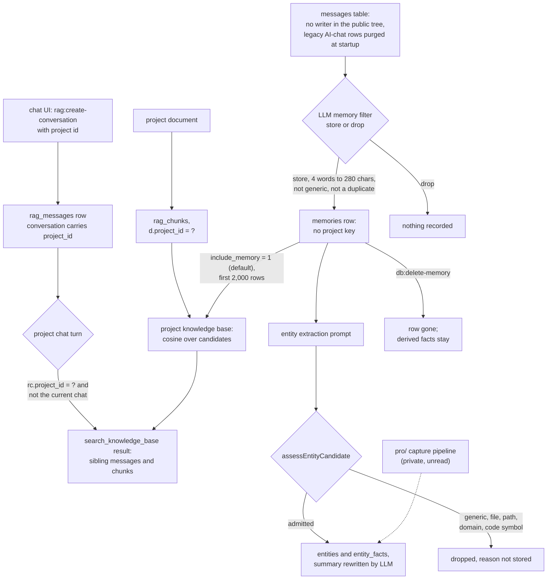

## 1. Executive Summary

Off Grid AI Desktop is an Electron app that runs local models behind an
OpenAI-compatible gateway and adds chat, projects with document retrieval, and
a memory layer. What is notable is that the memory layer has no scope at all:
captured memories carry no project key and join every project's knowledge base
by default, beside chats and documents that are filtered by project. What is
weak is that the layer cannot be followed end to end in public: the code that
feeds it is either a retired feature whose AI-chat source is purged at each
startup or lives in the private `pro/` submodule, which could not be read.

The repository is the open, AGPL core of an open-core product. The paid layer —
screen capture, observations, meetings, the entity CRM, sync between devices —
registers itself through a hook registry, and a Vite alias replaces it with a
null stub when `pro/` is absent (`electron.vite.config.ts:9-20`;
`src/main/bootstrap/hookRegistry.ts`). That seam is clean, and it is also the
boundary of this report. The pinned submodule commit,
`d30893ee92558b8d7f8fc806f02052841b54c9d4` of `off-grid-ai/desktop-pro`,
returns 404.

Three surfaces live in core. **Project chats and documents** are live in the
free build and are context, not memory. **Captured memories, entities and facts** have schema,
extraction prompts, an admission policy, hybrid retrieval and deletion in core.
Their producers in core read a `messages` table that nothing in the public tree
writes, and whose scraped AI-chat rows `purgeLegacyChatImports` deletes on
startup (`src/main/index.ts:307-311`; `src/main/database.ts:560-567`). The
same function's comment says the current capture pipeline, which is Pro's,
also feeds `entities`. **Universal search** fuses keyword and LanceDB hits across all of it, and reads
tables only Pro creates.

No marks. The project-scoping predicates and their tests guard verbatim chat
turns and uploaded documents, which cannot turn out to be false and so sit on
the [conversation-window side](../../families/#not-in-scope-conversation-window-management)
of the line. The one captured-memory assertion rests on rows a fixture writes.
Section 9 names all seven.

## 2. Mental Model

A chat message becomes recallable the moment `addRagMessage` commits it. Its
conversation's `project_id` decides who can recall it. Inside a project the chat
UI offers the model `search_knowledge_base`, which returns up to six sibling-chat
messages ranked by term count beside the top five knowledge-base chunks
(`src/main/tools.ts:371-400`). A second project branch in the `rag:chat`
handler injects the last twelve sibling messages unasked, as *"Related
discussion from other chats in this project"*; no core renderer call reaches it
with memory on (`src/main/ipc.ts:823-885`). The current chat is excluded from
both. A message stops being recallable when it is edited, truncated away, or
its conversation is deleted.

A captured memory is a **sentence an LLM agreed to keep**.
`evaluateAndStoreMemoryForMessage` skips short messages, asks the model
`{store, name, memory}` under a lenient, balanced or strict prompt, then drops
answers under four words or over 280 characters, answers opening *"The user
said"* and similar, and substring duplicates within the session
(`src/main/ipc.ts:391-455`). The balanced prompt stores an assistant message
*"ONLY if it repeats a verified user fact"*, which is an instruction to the
filter model, not a check.

Entities come from the session's memories through a second prompt, then pass
`assessEntityCandidate`, which rejects generic nouns, file names, paths,
domains and code symbols before `resolveEntityRecord` may write
(`src/main/entity-admission-policy.ts:128-157`). New facts append; an LLM
rewrites the entity summary from the old summary plus the new facts
(`src/main/ipc.ts:457-539`). Nothing in either path records a status, a
confidence or the rejected alternatives. A memory stops being one when a person
deletes it, when a clean reprocess wipes and re-derives the layer, or when a
category or full erase runs. Its facts outlive it (section 7).

## 3. Architecture

The main process owns one SQLite file, `memories.db`, opened through
`better-sqlite3-multiple-ciphers`. A fresh profile gets a random 32-byte key
stored as a `safeStorage`-encrypted `.dbkey` beside the file, and a profile
created before that, or on a machine without keychain encryption, stays
plaintext (`src/main/database.ts:27-55`, `:96-102`). A `cosine_similarity` SQL
function is registered on the connection so JSON-text embeddings can be scored
in SQL.

Embeddings are MiniLM, 384 dimensions, computed in-process. Project chunks and
captured memories keep theirs in SQLite; universal search also keeps a LanceDB
table under `userData/lancedb`, keyed `kind:refId` back to SQLite
(`src/main/vectors.ts`). The table is filled by `runBackfill`, which has no
caller outside tests in this tree (`src/main/search.ts:123-140`).

The renderer reaches memory only through IPC handlers registered in
`setupIPC`. The OpenAI-compatible gateway on port 7878 and the MCP server expose
no memory route. Pro, when present, calls core through the `@offgrid/core`
alias and extends it through hooks such as `chat.augmentContext`,
`search.extraSources` and `sync.recordLocalMutation`.

Seven workspace packages resolve to `../shared/...` or `../executorch-speech`,
outside the repository (`package.json:68-76`, `:126`). None holds the memory
path, but the tree does not build on its own.

### Deployment and ergonomics

Nothing runs but the app: SQLite and LanceDB are embedded, inference is local,
and no API key is needed to store anything. Install is a signed DMG or NSIS
installer; building needs Git LFS for the bundled runtimes and the sibling
`shared` packages. The store is a SQLite file, readable by hand only with the
key from the keychain when encryption is on.

## 4. Essential Implementation Paths

**Chat write.** `rag:add-message` → `addRagMessage` inserts with a UUID for
sync and bumps the conversation's `updated_at`
(`src/main/database.ts:1287-1330`). `rag:update-message` and
`rag:truncate-messages` edit and trim (`:1332-1390`).

**Project recall.** The chat UI sends every turn through `toolChat`
(`src/renderer/src/components/MemoryChat/index.tsx:1851-1860`). In a project
it offers `search_knowledge_base` and protects it from the tool budget as the
scope tool; the handler combines `searchProjectConversations` with
`ragService.searchProject` at its default top five
(`src/main/tools.ts:371-400`, `:725-742`, `:765-775`). The `rag:chat` project branch calls
`searchProject` with `topK: 6` and a 4,096-token budget, then
`getProjectChatHistory(projectId, conversationId, 12)`
(`src/main/ipc.ts:823-885`); its core renderer caller passes `noMemory`.

**Knowledge-base candidates.** `getChunkCandidates` selects the project's
enabled document chunks with `d.project_id = ?`, then, if
`projectIncludesMemory`, every memory with an embedding under `LIMIT 2000` and
no `ORDER BY` (`src/main/rag/store.ts:138-191`). `rankBySimilarity` scores all
of them with cosine and keeps the top k (`packages/rag/src/retrieval.ts`).

**Captured-memory write.** `evaluateAndStoreMemoryForMessage` →
`insertMemoryRecord`, which embeds and inserts
(`src/main/ipc.ts:330-455`). Its core callers are the
`db:reprocess-all-sessions` handler (`:1403-1520`) and nothing else. The
separate `db:add-memory` handler embeds the content and, if a memory with the
same `session_id` was written in the last twelve hours, replaces that row's
content rather than adding one (`:607-644`).

**Entity write.** `summarizeSession` → `extractEntitiesForSession` →
`resolveEntityCandidate` → `addEntityFact` and `updateEntitySummary`
(`src/main/ipc.ts:457-574`). Pro can replace the SQLite implementation through
`registerEntityDomain`, and admission still runs first
(`src/main/entity-domain.ts`).

**Universal search.** `universalSearch` runs five FTS5 lists (observations,
summaries, entities, facts, memories), four LIKE lists (meetings, frames,
chats, documents) and one LanceDB list, fuses them with RRF at k = 60, adds a
recency boost and a 0.012 nudge for chats and documents, then filters and sorts
(`src/main/search.ts:223-284`, `:434-499`; `src/main/search-ranking.ts`).

**Delete.** `db:delete-memory`, `db:delete-entity`, `rag:delete-conversation`,
`data:clear` and `data:delete-all` (`src/main/ipc.ts:1158-1191`, `:1305-1311`,
`:1821-1830`; `src/main/data-privacy.ts:329-409`).

## 5. Memory Data Model

| Table | Holds | Scope key | Time |
| --- | --- | --- | --- |
| `rag_conversations`, `rag_messages` | chats, message UUIDs, origin device | `project_id` on the conversation | `created_at`, `updated_at` |
| `projects`, `rag_documents`, `rag_chunks` | knowledge base, `include_memory` flag, chunk embeddings | `project_id` on the document | `created_at` |
| `memories` | `content`, `name`, `raw_text`, `source_app`, `session_id`, `message_id`, embedding | none | `created_at` |
| `entities`, `entity_facts`, `entity_sessions`, `entity_edges` | name and type (unique pair), LLM summary, facts with `source_session_id`, co-occurrence edges | none | `created_at`, `updated_at` |
| `conversations`, `messages`, `chat_summaries`, `master_memory` | the retired scrape and its summaries; `master_memory` is no longer written | none; an `app_name` filter | `created_at` |

Schema is `CREATE TABLE IF NOT EXISTS` plus `ALTER TABLE` in `try` blocks
(`src/main/database.ts:114-426`). `project_id` arrived by migration
(`:376-381`).

**Provenance stops at the session.** A memory keeps the raw message and its
session; a fact keeps its session. Neither records which model or strictness
kept it, and an entity summary records nothing about the facts it was written
from.

**Pro-owned columns appear in core reads.** `universalSearch` filters
`entities.hidden = 0` and joins `observations`, `observation_fts`, `frames` and
`meetings`, none of which core creates; the tests create them by hand
(`src/main/__tests__/rag-empty-memory.dbtest.ts:80-112`). The chat UI offers
the All memory scope, and with it `search_memory`, only when `isPro` is true
(`src/renderer/src/components/MemoryChat/index.tsx:510`, `:4421-4437`).

## 6. Retrieval Mechanics

**Project chats are term count, and recall is the model's call.**
`searchProjectConversations` drops stop words and short terms, scores each
message by how many of up to six terms it contains with `LIKE`, and returns six
by default, each cut to 1,500 characters by the tool. Nothing is recalled
unless the model calls the tool. `getProjectChatHistory`, on the `rag:chat`
path, injects the latest twelve sibling messages regardless of the query.

**The project knowledge base is exhaustive cosine**, recomputed per query over
every candidate in JavaScript. At 2,000 memories plus a project's chunks that
is a few thousand dot products, cheap on a laptop. The `LIMIT 2000` without an
order means a store past 2,000 memories silently drops whichever rows SQLite
returns last, and the tool and the prompt cannot tell.

**Universal search is hybrid and read-verified.** Semantic hits pass
`semanticSourceExists`, which confirms the SQLite row still exists, and hidden
entities are excluded (`src/main/search.ts:355-401`). A deleted memory's
vector cannot surface. A changed one can: `vec_indexed` records a key once,
and only the capture clear ever deletes receipts, so an edited memory or a
rewritten entity summary keeps its first vector. When only the semantic list
returns that key, the fused result carries the stale snippet
(`:85-119`; `src/main/data-privacy.ts:356-359`). Memories, entities and facts
carry `ts = 0`, so the recency boost never lifts them.

**Budgets.** The `rag:chat` branch trims knowledge-base excerpts to 40% of a
4,096-token window; the tool path takes five chunks with no budget of its own,
and every tool result is bounded by `boundToolResult` from the out-of-tree
`@offgrid/models`.

## 7. Write Mechanics

Chats and documents are explicit writes. A document is extracted, chunked,
embedded and stored in one call, and a failed embedding rolls the document back
(`packages/rag/src/service.ts`).

Captured memories are written per message by one blocking LLM call plus one
embedding call, and extraction runs per session. In core the only trigger is
`db:reprocess-all-sessions`, and `startReprocess`, the function that would
call it, has no caller in the core renderer
(`src/renderer/src/hooks/useReprocessing.tsx:39-56`).
A clean reprocess drops the FTS delete triggers, deletes every memory, entity,
fact and edge, recreates the triggers, and re-derives from `messages`
(`src/main/ipc.ts:1403-1520`).

**Deduplication is a substring test inside one session.** A memory equal to,
containing or contained in an earlier memory of the session is dropped. Across
sessions nothing deduplicates memories; entity facts deduplicate on an exact
`UNIQUE(entity_id, fact)`. The one core call to `resolveEntityCandidate` passes
no `selfAliases`, so the admission policy's `self` rule never fires on it
(`src/main/ipc.ts:491`).

**Deletion does not follow derivation.** `deleteMemory` removes one row
(`src/main/database.ts:821-827`). No core path deletes a single entity fact,
and `db:delete-session` removes the session's memories and summary but not its
facts, and its entity links survive because foreign keys are off
(`src/main/ipc.ts:1158-1171`; `src/main/database.ts:1257`). An entity summary written
from a deleted memory keeps saying it.

**Conflicts are not modelled.** A newer fact that contradicts an older one is
appended beside it, and the summary rewrite is the only reconciliation.

### Operational cost

- Chat and document writes are synchronous SQLite inserts; a document write
  also embeds every chunk before returning.
- A captured memory costs one LLM call per message and one per session for
  entities, plus one per entity with new facts; it is retrievable by FTS at
  commit and by LanceDB only after a backfill batch.
- A clean reprocess re-reads every message in the store through the model.
- A project turn that calls the tool adds up to six sibling messages and five
  chunks as a tool result; the `rag:chat` branch injects twelve sibling
  messages and a window-sized knowledge-base block ahead of the history.

## 8. Agent Integration

Memory is used inside the app's own chat loop. `toolChat` builds the tool list
per turn, and `isMemoryToolAllowed` offers `search_knowledge_base` only with an
active project and `search_memory` only in the All memory scope
(`src/main/tools/memory-scope.ts`). The system prompt adds *"Do not invent
project facts or use information from other projects"* in a project
(`src/main/tools.ts:802-812`). `search_memory` excludes the current conversation
so the model cannot cite itself.

No tool writes memory. The model cannot store, correct or delete anything;
those verbs belong to the UI and to Pro. That removes the prompt-injected
write path, and it also means an agent cannot record a correction the user
dictates.

## 9. Reliability, Safety, and Trust

**The project instruction and the project data disagree.** A project's
knowledge base includes every captured memory by default, none of which
carries a project, labelled *"Captured memory"*. The committed lifecycle test
asserts exactly that — a memory added with no project reaches the project
prompt — while the system prompt forbids information from other projects.

**Encryption at rest is conditional.** Existing plaintext databases are never
migrated, and the app falls back to plaintext when the keychain is unavailable,
with a console line as the only signal.

**Delete-all is registry-driven.** `deleteAllData` iterates a list that Pro
extends through `registerPersonalStore`, suspends registered producers first,
and reports failure rather than success when the vector store cannot be
cleared (`src/main/data-privacy.ts:135-162`, `:190-241`, `:395-409`). Its
comment records that observations, connectors, secrets and documents once
survived a full erase.

**Uncertainty is not representable.** A memory is kept or not; the filter's
doubt is resolved at write time by the `If unsure` line of the chosen prompt.

Capability marks:

- `scope_enforced` — withheld. `rag_conversations.project_id` and
  `rag_documents.project_id` are real keys with real predicates
  (`src/main/database.ts:1168-1228`; `src/main/rag/store.ts:138-191`), but what
  they scope is verbatim chat turns and handed-in documents. Neither can turn
  out to be false, so this is context selection, not memory. The memory beside
  them, `memories`, has no scope column.
- `negative_eval` — withheld. Most of the two committed cases assert that
  another project's chats and documents stay out, which is the same non-memory
  side. The one memory assertion, that a deleted captured memory stays out,
  exercises a layer whose producers in the public tree read a table nothing
  writes; the row comes from `db:add-memory` in the fixture, and no core
  renderer calls that handler.
- `tombstone` — none. A deleted memory is a missing row, and a clean reprocess
  can re-derive it from the same message.
- `trust_state` — none in core. `universalSearch` filters `entities.hidden = 0`,
  a column only Pro creates and writes, so its meaning and producer cannot be
  read; the `rag:chat` memory branch does not apply it (`src/main/ipc.ts:967-975`).
- `bitemporal` — `created_at` and `updated_at` only.
- `audit_log` — core emits `put`/`delete` sync mutations for chats and projects
  into a Pro hook (`src/main/sync-mutation.ts`); nothing in core stores them,
  and memories and entities emit none.
- `human_review` — the memory filter is a model; a person can delete after the
  fact. The approval queue the README describes is Pro's and gates actions.

## 10. Tests, Evals, and Benchmarks

Nothing was built or run; everything below is from reading the tests at the pin.

**The exclusion cases.** `searches sibling conversations only inside the
selected project` writes 200, 300 and 400 budgets to the current chat, a
sibling and another project's chat, asserts the search returns exactly the
sibling, and asserts the tool output lacks the other two
(`src/main/__tests__/rag-store-integration.dbtest.ts:57-80`). `keeps project
grounding isolated through policy changes, delete/reindex, and reopen` drives
the real handlers over real SQLite. It asserts the other project's document
and chat and the current chat stay out, that turning `include_memory` off
removes the captured memory, and that after `db:delete-memory` and a
re-index the memory and the old document stay out while the new document is
present, before and after a reopen
(`src/main/__tests__/memory-rag-chat-lifecycle.integration.dbtest.ts:117-291`).

Both are `.dbtest.ts` files. CI's DB journeys run them through
`vitest.db.ci.config.ts`, which excludes four other files by name with reasons
(`.github/workflows/ci.yml:185-198`). The embedding mock returns a constant
vector, so every candidate scores alike and the exclusions rest on SQL
predicates and deletion.

They are good tests of a boundary, and they do not earn `negative_eval`. Of
the material they keep out, the chats and documents are not memory, and the
captured memory was put there by the test through a handler the app's own UI
never calls. The mark needs a must-not case over memory a reachable path
produces, and the public tree has no such path.

**Ranking and admission.** `search-ranking.test.ts` pins RRF, the boosts, the
tokeniser and the rule that `excludeChatId` drops exactly one chat.
`entity-admission-policy.test.ts` and `entity-domain.dbtest.ts` cover
admission and transactional entity deletion.

**Not covered.** No test in `src/` or `integration-tests/` names
`evaluateAndStoreMemoryForMessage`, `extractEntitiesForSession`,
`summarizeSession` or the reprocess handler, so the LLM filter and its
post-filters are untested. No test updates a memory or an entity summary and
then searches. No retrieval-quality evaluation is committed, and the tree carries no
paper of its own.

## 11. For Your Own Build

### Steal

- **Put the scope key on the row and write the negative test against the real
  handler.** A search that returns the sibling and not the other project, with
  the positive case asserted first, is the cheapest proof a boundary holds.
- **Treat the relational row as truth and the vector index as a cache.**
  Checking that a semantic hit's source row still exists makes deletion safe
  without deleting vectors.
- **Drive delete-all from a registry that extensions must join.** A new store
  is erased by registering it, not by remembering to edit the eraser.
- **Admit entities through a pure function that sits before persistence.**
  Extractors are untrusted callers, and the rejection reasons are testable
  without a database.

### Avoid

- **A global pool folded into a scoped context by default.** If some material
  has no scope, keep it out of scoped reads until someone opts it in.
- **A candidate cap without an order.** `LIMIT` with no `ORDER BY` makes what
  is searchable an accident of storage.
- **An index receipt keyed only on identity.** Key it on content or version,
  or an edit is invisible to the semantic arm.
- **Deleting the source and keeping the derivation.** Facts and summaries built
  from a memory need to go when it goes, or be rebuilt.

### Fit

For a reader choosing a private desktop assistant, the open core is a
competent project-scoped RAG with chat recall, and the parts called memory
depend on code that cannot be inspected. For a reader choosing a memory design
to copy, the value is in a few small pieces: the project predicate and its
test, the read-verified vector cache, the deletion registry and the admission
policy. The capture and extraction layer is an interesting prompt stack with no
tests and no correction model. Anyone who needs to audit what gets remembered
about them should walk away until the producer is public.

## 12. Open Questions

- What does the private `pro/` submodule write into `memories`, `entities` and
  `messages`, and does it call `evaluateAndStoreMemoryForMessage`?
- Who sets `entities.hidden`, and does it mean rejected, merged or muted?
- Does Pro schedule `runBackfill`, and does anything re-embed a changed row?
- Does Pro's sync replicate memories and entities, and how does a deletion
  travel to a paired device?
- Is `include_memory` on by default deliberately, given the project prompt?

## Appendix: File Index

- **Storage and schema:** `src/main/database.ts`, `src/main/rag/store.ts`,
  `src/main/vectors.ts`, `src/main/vectors-predicates.ts`.
- **Write path:** `src/main/ipc.ts:330-574`, `:607-644`, `:1403-1520`;
  `src/main/prompts.ts`; `src/main/entity-admission-policy.ts`;
  `src/main/entity-domain.ts`; `packages/rag/src/service.ts`.
- **Retrieval:** `src/main/search.ts`, `src/main/search-ranking.ts`,
  `packages/rag/src/retrieval.ts`, `src/main/database.ts:1154-1228`.
- **Context assembly:** `src/main/ipc.ts:709-1135`, `src/main/tools.ts`,
  `src/main/tools/memory-scope.ts`.
- **Deletion:** `src/main/data-privacy.ts`, `src/main/ipc.ts:1158-1191`.
- **Open-core seam:** `electron.vite.config.ts:9-20`,
  `src/main/bootstrap/hookRegistry.ts`, `src/bootstrap/proStub.ts`.
- **Tests:** `src/main/__tests__/rag-store-integration.dbtest.ts`,
  `src/main/__tests__/memory-rag-chat-lifecycle.integration.dbtest.ts`,
  `src/main/__tests__/search-ranking.test.ts`,
  `src/main/__tests__/entity-admission-policy.test.ts`,
  `src/main/__tests__/entity-domain.dbtest.ts`,
  `vitest.db.ci.config.ts`.

### Recorded searches

Checked against the checkout at the pinned revision.

- `rg -n "INTO (messages|conversations)\b" --glob '!**/__tests__/**' --glob '!**/dist/**' .` — no match; nothing in the public tree writes the tables the memory filter reads.
- `rg -n "api\.(addMemory|summarizeSession|reprocessAllSessions)\(" src` — one match, inside `useReprocessing.tsx`; `rg -n "startReprocess\(" src --glob '!**/__tests__/**'` — no match.
- `rg -n "runBackfill\(" src --glob '!**/__tests__/**'` — only the definition in `search.ts`.
- `rg -n "CREATE (VIRTUAL )?TABLE IF NOT EXISTS (observations|observation_fts|frames|meetings)|ADD COLUMN hidden" src packages --glob '!**/__tests__/**' --glob '!**/dist/**'` — no match.
- `rg -n "DELETE FROM entity_facts" src --glob '!**/__tests__/**'` — the legacy purge, `deleteEntityRecord` and the clean reprocess; no single-fact or per-memory delete.
- `rg -n "DELETE FROM vec_indexed" src --glob '!**/__tests__/**'` — one match, the capture clear in `data-privacy.ts`.
- `rg -n -i "tombstone|rejected|superseded|valid_from|valid_to|audit" src/main/database.ts src/main/ipc.ts src/main/search.ts src/main/rag/store.ts src/main/data-privacy.ts` — only `PromiseRejectedResult` in `data-privacy.ts`.
- `rg -ln "evaluateAndStoreMemoryForMessage|summarizeSession|extractEntitiesForSession|reprocess-all-sessions|memoryFilter" src integration-tests -g '*test*'` — no match.
- `rg -n -i "memor|universalSearch|search_memory|entities" src/main/model-server.ts src/main/mcp-server.ts src/main/model-server/*.ts` — only hardware-memory settings and one comment; no memory route.
- `rg -n "UPDATE memories|updateEntitySummary|db:add-memory" src integration-tests -g '*test*'` — a persistence test of `updateEntitySummary` and the lifecycle test's single add; no case searches after an update.
- `gh api repos/off-grid-ai/desktop-pro` — 404.
- `grep -rliE 'arxiv|bibtex|@article|@misc|doi\.org' --exclude-dir=.git --exclude-dir=node_modules .` — three planning documents citing other work; no `CITATION.cff`.

## History

**2026-09-26** — [`7f073cada0b4555dc3b5d60bfd9928bc11d3f4cc`](https://github.com/off-grid-ai/OGAD/commit/7f073cada0b4555dc3b5d60bfd9928bc11d3f4cc) — first reading, at the head of `main`, a commit dated 25 September 2026. No mark: the project predicates and their tests guard chats and documents, not memory, and the captured-memory layer has no reachable producer in the public tree. Screened before reading: four auto-run surfaces (`.claude/settings.json`, a permission allowlist with no hooks; `.gitattributes` LFS filters, checked out with the filters disabled; `.gitmodules`, the private `pro` submodule, left uninitialised; `.vscode/settings.json`), two build-time execution points, five dependency files inside the cooldown — every file in a depth-1 clone dates to the tip — and two unpinned surfaces. `AGENTS.md` and `CLAUDE.md` were read as data. Nothing was installed, built or run.
