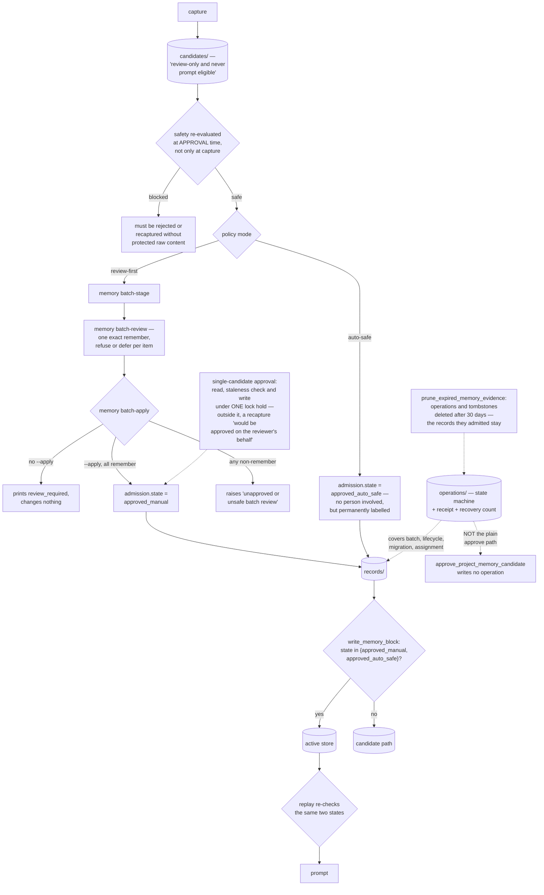

## 1. Executive Summary

oh-my-hermes is an operating layer for NousResearch's Hermes Agent — MIT,
Python, version 2.0.3, 387,713 lines across 720 test files, of which roughly
20,000 lines and 43 test files are memory. Its pitch is "[i]nstall once. Keep
Hermes. Add a stronger operating layer," and the memory half of that layer is
the most elaborate admission-control machinery in this corpus.

The organising idea is worth stating precisely, because most systems here get
it the other way round. Approval is not an event that happened and was logged.
It is a **state the record carries**, and every surface that would put a record
in front of a model checks it again.

`write_memory_block` decides where a block is even stored based on it:
"[p]ersist only approved revisions to the active store; stage all others."
Replay re-checks it. `read_memory_block` is documented as reading and
structurally validating "without granting replay trust" — validation and trust
are kept as separate things, which is a distinction most of this corpus
collapses.

The vocabulary has two approved values, not one: `approved_manual` and
`approved_auto_safe`. A record admitted automatically under the `auto-safe`
policy mode is permanently marked as such. It is trusted for replay exactly as
much as a human-approved one, but you can always tell which it was — the kind
of honesty that costs nothing to implement and that almost nobody bothers with.

The human path is three separate commands and refuses to collapse them.
`memory batch-stage` writes candidates whose own control payload says they are
"review-only and never prompt eligible." `memory batch-review` demands "one
exact remember, refuse, or defer decision for every staged item."
`memory batch-apply` prints `review_required` and changes nothing until it is
rerun with `--apply`. If any decision is not exactly `remember`, the apply
raises "unapproved or unsafe batch review."

And the single-candidate approval carries the best comment in the repository,
because it records a bug that had already been fixed: reading the candidate
outside the store lock made the staleness guard advisory, since a recapture
landing between the revision check and the record write "would be approved on
the reviewer's behalf, with the stale check having already passed." The fix is
a read-check-write under one non-reentrant hold, and the comment states the
guarantee it buys — "no write on a stale card."

The finding is that this discipline is not applied uniformly. That same
`approve_project_memory_candidate` — the ordinary path by which a record enters
the store — writes no operation record, while the batch, lifecycle, migration
and principal-assignment paths all run through `run_memory_operation` with its
state machine and receipt. The per-candidate review file is keyed
`review_{candidate_id}` and written with `atomic_write_json`, so approving a
candidate twice overwrites the first decision. And `prune_expired_memory_evidence`
removes operations and tombstones older than thirty days while the records they
admitted stay.

The state is durable. The evidence for it is not.

## 2. Mental Model

A **candidate** is captured, safety-evaluated, and not prompt-eligible.

A **decision** is `remember`, `refuse` or `defer`, recorded per item.

A **record** is a candidate that carries an `admission` block: a state, the
review id, the reviewer label, the admission time and the policy version.

An **operation** wraps a multi-step mutation in a state machine — prepared,
applying, interrupted, completed, failed, corrupt — with a receipt and a
recovery count, so an interrupted write is resumable rather than ambiguous.

A **tombstone** records that a record id at a revision was forgotten or moved
scope. It does not record the value.

## 3. Architecture

| Area | Role |
| --- | --- |
| `src/workflows/memory.py` | Capture, approval, records, candidates, reviews — 5,126 lines |
| `src/workflows/memory_store.py` | Operations, tombstones, recovery, evidence pruning |
| `src/workflows/_memory_store_validation.py` | The schemas: operation, receipt, tombstone, step outcomes |
| `src/workflows/memory_batches.py` | Stage, review, apply, and the post-apply fidelity check |
| `src/workflows/memory_lifecycle*.py` | Staleness, demotion, retirement, reapproval |
| `src/workflows/memory_principal*.py` | Principal assignment and migration with rollback |
| `src/plugin_bundle/omh/memory_blocks.py` | Where admission decides the storage destination |
| `src/plugin_bundle/omh/memory_block_replay.py` | The second check, at replay |
| `src/commands/memory.py` | The three-step CLI |

## 4. Essential Implementation Paths

`memory.py:1265-1328` is the one to read. It is forty lines that contain a
re-evaluated safety policy, a fail-closed branch for lifecycle candidates that
would otherwise mint a garbage record and block the real reapproval, a
read-check-write under one lock, and the comment explaining why.

Then `memory_blocks.py:218-228`, for admission deciding the destination rather
than only the filter.

Then `memory_batches.py:370-445` — the fidelity check, which verifies after an
apply that the item really left `items` and that a tombstone exists carrying
the right operation id, candidate item id and review id. Verifying that a write
did what the receipt says is a step almost nothing else here takes.

## 5. Memory Data Model

A record carries a summary, a revision, a scope, a retention class of
`standard`, `durable` or `volatile`, a revalidation schedule, a safety
evaluation, and the admission block. Schemas are versioned as strings —
`memory_operation/v1`, `memory_tombstone/v1` — and validated with exact field
sets: `set(record) - _OPERATION_FIELDS` rejects unknown keys rather than
ignoring them, and the receipt check requires `set(receipt) ==
MEMORY_RECEIPT_FIELDS` exactly.

Identifiers are constrained by regex — a `_SAFE_TOKEN` pattern and a
`_GENERATED_MEMORY_REF` pattern that spells out the legal shapes of candidate,
record and review ids — and every path helper calls `_assert_under_memory_root`
before touching a file. For a store addressed by caller-supplied ids written to
a filesystem, that is the right level of paranoia.

A tombstone carries `record_id`, `revision`, `scope`, `operation_id`,
`reason_code`, `actor_class`, `tombstoned_at` and `expires_at`. What it does
not carry is the value. It marks that a particular record at a particular
revision was forgotten; it does not prevent the same content being captured
again tomorrow, approved, and admitted under a new id. That is why the
`tombstone` mark is withheld here despite the name.

## 6. Retrieval Mechanics

Recall is scoped lookup over the record index with ranking. The interesting
surface is the second one.

Rejected decisions are not discarded. They are retrievable through a distinct
`rejected_decision_recall/v1` surface that returns each match with
`approved_memory: false`, `renderable_as_instruction: false`, a `surface_kind`
of `reviewed_negative_decision`, and a boundary string stating it is a
"reviewed-decision surface only", "separate from approved-memory recall" and
"never auto-attached to a coding prompt."

That is the right shape for a refusal: a person can ask what was rejected and
why, and the model cannot be handed it as an instruction. Legacy v1 rejections
come back flagged `legacy: true`, `authoritative: false`, with an
`eligibility_reason` of `eligible_legacy_read_only` — an old record is readable
without being treated as current.

Superseded and corrected decisions are excluded from the ranked surface before
ranking, and the test asserts they carry no `match_score` — the exclusion is
structural, not a post-filter.

## 7. Write Mechanics

Capture writes a candidate. Approval promotes it. Nothing skips the candidate
stage.

The safety evaluation runs twice: once at capture, and again inside the
approval lock, where `evaluate_renderable_strings(candidate)` must still return
`safe` or the approval raises "project memory candidate no longer passes the
current safety policy." A candidate captured under a looser policy cannot be
admitted under a tightened one. Approval metadata is itself checked for
credential-like strings and refused if it contains them.

Batch apply writes items only after `_approved_reviews` confirms every decision
is `remember`, stamps each with its admission block, and then verifies the
result against the expected end state — including that a forgotten item is
absent from `items` *and* has a tombstone linked to the right operation and
review.

The uneven part is the evidence. `run_memory_operation` is called from
`memory_batches.py` twice, from `memory_lifecycle_executor.py`, from
`memory_principal_migration.py` for both migration and rollback, and from
`memory_principal_assignment.py`. It is not called from
`approve_project_memory_candidate`, which writes the record, the updated
candidate, the review decision and the index directly under the store lock. The
lock makes that write consistent; it does not leave a resumable operation
record behind, so an interrupted plain approval is recovered by the index
rebuild rather than by the operation recovery that exists for every other path.

And the review decision it writes is not an append. `review_id` is
`f"review_{candidate_id}"` and `_write_project_memory_review_decision` calls
`atomic_write_json` on the path derived from it. One file per candidate,
overwritten. The current decision is durable; the sequence of decisions is not.

Together with `prune_expired_memory_evidence` — which deletes operations and
tombstones older than `retention_days`, default thirty — the picture is a store
where admission states outlive the evidence that produced them. A record
approved a year ago still says `approved_manual` with a review id; the review
file may have been overwritten by a reapproval and the operation pruned.

## 8. Agent Integration

The layer installs alongside Hermes rather than forking it, which is the same
posture Inno Agent takes toward the Pi SDK and the opposite of a vendored
rewrite. Memory reaches the model as blocks by label and tier, assembled from
the active store, and the replay path is the second admission check rather than
a trusting read.

The CLI is the review surface. There is no web UI for approval here; the
reviewer edits a decisions JSON file and runs a command. For an operator-facing
tool that is a defensible choice, and it makes the decision artifact itself
reviewable and diffable.

## 9. Reliability, Safety, and Trust

The operation state machine is the strongest reliability mechanism here.
Six states, a `recovery_count`, per-step outcomes drawn from a closed set
(`applied`, `already_present`, `copied`, `moved`, `written`, `removed`,
`already_absent`, `rewritten`), and a `recover_memory_operations` entry point.
The `already_present` and `already_absent` outcomes are what make recovery
idempotent, and having them as first-class outcomes rather than inferred
no-ops is the detail that makes a resumable write actually resumable.

The `auto-safe` mode deserves a clear statement rather than a warning. Three
modes exist — `off`, `review-first`, `auto-safe` — and a deployment picks one.
Under `auto-safe`, a candidate that passes the safety evaluation is admitted
with no person in the loop. That is a legitimate configuration, and the design
handles it about as well as it can be handled: the record is stamped
`approved_auto_safe`, so the distinction survives into every later read, audit
and migration. The risk is not that the mode exists; it is that
`approved_auto_safe` and `approved_manual` are treated identically by every
gate that consumes them. Nothing downstream can require a human-approved record
specifically, because no read path distinguishes the two.

`read_memory_block` returning `None` for a symlink or a non-file, and the
`is_directory_link` check in the store, are the kind of filesystem-level
defences that matter for a store rooted in a user-writable home directory.

## 10. Tests, Evals, and Benchmarks

Forty-three memory test files out of 720, covering admission, governance
policy, retention, lifecycle, migration, principals, operations, batches,
recall, prefetch, provider posture and sync fidelity. There is also a
`benchmarks/` tree and a `memory_evaluation.py` that synthesises artifact
fixtures across retention classes and admission states.

`test_rejected_decision_recall.py` is the one to read. Asserting that excluded
decisions carry no `match_score` — that they were dropped before ranking rather
than ranked and hidden — is a stronger claim than "they are not returned," and
it is the assertion that would catch a future refactor moving the filter after
the scorer.

What is not tested is the seam this report names: nothing asserts that a plain
approval leaves an operation record, because it does not, and nothing asserts
anything about a candidate's decision history across two approvals.

## 11. For Your Own Build

Make approval a state on the record, not an event in a log, and re-check it at
every surface that could put the record in front of a model. A log says
something was approved once; a state says this record is approved now, and the
check is local to the read that matters.

Keep `approved_manual` and `approved_auto_safe` as distinct values even if
every current consumer treats them the same. The cost is one string; the
benefit is that a year later you can answer "which of these did a person
actually look at?" without archaeology. Then go one step further than this
system does and let a policy require the manual value where it matters.

Re-run the safety policy at admission, not only at capture. A candidate sitting
in a queue was evaluated under whatever rules applied when it was written, and
those are the wrong rules by the time someone approves it.

Do the read, the staleness check and the write under one lock hold. The comment
in `memory.py:1267-1275` is worth copying verbatim into your own code review
checklist: a guard that reads outside the lock it protects is advisory, and an
approval that lands on a card the reviewer did not see is the specific failure
it permits.

If you write tombstones, decide whether they are deletion receipts or
rejections. These are receipts — keyed on record id and revision, verified
after an apply, pruned after thirty days. That is a good receipt and it is not
a defence against the same content being re-captured and re-approved. If you
want the second thing, key on the value.

Do not let the evidence expire before the state it justifies. If admission
states are permanent and operations are pruned at thirty days, then after a
month the store asserts approvals it can no longer substantiate.

## 12. Open Questions

Whether the plain approval path is intended to run through an operation. Every
other mutation path does, the machinery is already imported in that module, and
the omission reads more like an order-of-development artifact than a decision.

Whether the deterministic `review_id` is meant to make reapproval idempotent or
is an oversight. `test_memory_reapproval_path.py` exists and the lifecycle
reapproval executor routes lifecycle candidates away from the plain path, so
the case was clearly thought about; what happens to the superseded decision
record was not stated anywhere read here.

Which Hermes Agent revision this layer targets. The README badges NousResearch's
repository but `pyproject.toml` records no pin on it, so the pairing was not
verifiable at a commit.

## Appendix: File Index

| Path | What to read it for |
| --- | --- |
| `src/workflows/memory.py:1265-1328` | The approval, the lock, and the comment about the bug it fixes |
| `src/plugin_bundle/omh/memory_blocks.py` | Admission deciding the storage destination, not just the filter |
| `src/workflows/memory_batches.py` | Stage, review, apply, and the post-apply fidelity check |
| `src/workflows/_memory_store_validation.py` | Exact-field schema validation and the safe-id patterns |
| `src/workflows/memory_store.py` | The operation state machine, recovery, and the evidence prune |
| `src/commands/memory.py:637-700` | Three commands, and an apply that refuses without `--apply` |
| `tests/test_rejected_decision_recall.py` | Excluded before ranking, asserted by the absent score |

## History

**2026-09-19** — re-pinned to [`4129002f3c7f5ca2075cfcf836a0ffa9b6bd59b8`](https://github.com/rlaope/oh-my-hermes/commit/4129002f3c7f5ca2075cfcf836a0ffa9b6bd59b8), 100 commits on. All three marks stand and `human_review`'s anchors all moved: `cmd_memory_batch_stage`, `_review` and `_apply` are now at `src/commands/memory.py:639`, `:655` and `:676`, the `review_required` receipts at `memory_batches.py:179-185`, the `approved_manual` stamp at `:451`, `_approved_reviews` at `:458` with its `"unapproved or unsafe batch review"` raise at `:514`, and the reviewer's-behalf comment at `workflows/memory.py:1270`. The record gained its producer test, which the three-step design passes cleanly: `src/omh/mcp_bridge.py` and `src/capabilities/tools.py` contain no `batch_review`, `batch-review` or `approve`, so the review never reaches the model's surface. The stated limit is that `reviewer_label` is a label carried through the receipt rather than a verified principal. Screened again first; nothing was installed and no suite was run.

**2026-09-16** — [`1827c9d95e6438a2a58a4ca5b7291937e236a709`](https://github.com/rlaope/oh-my-hermes/commit/1827c9d95e6438a2a58a4ca5b7291937e236a709) — first reading, at a commit dated 16 September 2026. Screened before opening, from a shallow clone: nine files scanned, one auto-run surface, three build-time execution points, one unpinned surface, one dependency file inside the seven-day cooldown, and the `CLAUDE.md` and `AGENTS.md` read as data. Nothing was installed, built or run.
