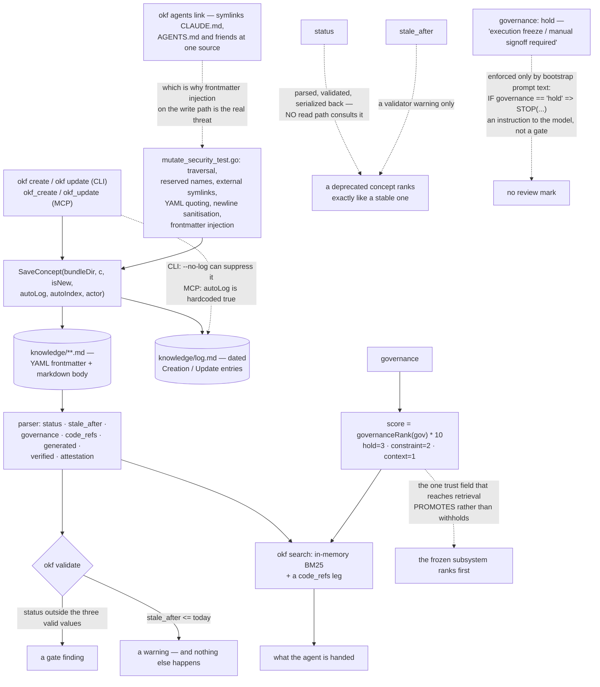

## 1. Executive Summary

OKF Agent Memory is "[a] Domain-Neutral, Git-Native Persistent Project Memory
for AI Agents based on the Open Knowledge Format (OKF) v0.2" — MIT, Go with no
third-party dependencies, 10,217 lines across 27 files, and a memory that is
markdown files under `knowledge/` in the repository being worked on.

The positioning is a middle ground, and it is stated plainly: the format "bridges
the gap between unstructured ad-hoc markdown files (`CLAUDE.md`, `AGENTS.md`)
and complex, black-box vector databases." One binary provides a CLI and an MCP
server with six tools, search is in-memory BM25 over the parsed bundle, and a
validator checks the bundle's structure in CI.

**The frontmatter is where the interest is, and where the gap is.** A concept
carries `status` (`draft | stable | deprecated`), `stale_after` (a date), and
`governance` (`context | constraint | hold`). Two of the three are parsed,
validated, serialized back, and consulted by nothing on the read path.
`okf search` ranks a deprecated concept exactly as it ranks a stable one, and a
concept whose `stale_after` has passed — which `okf validate` will warn about —
is retrieved at full weight.

The third is read, and it moves the score the other way:

```go
func governanceRank(gov string) int {
	switch strings.ToLower(gov) {
	case GovernanceHold:
		return 3
```

`score := float64(governanceRank(gov) * 10)`. So the only trust field that
reaches retrieval is one that **promotes**, and the two that could withhold do
not. `hold` is documented as "execution freeze / manual signoff required", and
the freeze is a sentence in a bootstrap prompt — `IF governance == "hold" =>
STOP(...)` — addressed to the model rather than enforced by the tool. The code
ranks the frozen subsystem first and asks the agent to stop when it gets there.

**What the project does earn is a mutation record that is not git.** The README
leads with `git diff` and `git log`, which is not an audit of what the tool
wrote — a commit records what somebody chose to stage. `knowledge/log.md` is the
real one: `SaveConcept` appends a dated `Creation` or `Update` entry naming the
concept, the CLI can suppress it with `--no-log`, and both MCP handlers pass
`autoLog` as a hardcoded `true`. The agent-facing path cannot write without
leaving the entry.

## 2. Mental Model

A **concept** is one markdown file with frontmatter, in your repository.

A **status** is a value the validator checks and the search ignores.

A **governance level** is a ranking multiplier that reads like a gate.

A **log entry** is written by the tool, not by the committer.



## 3. Architecture

| Area | Role |
| --- | --- |
| `pkg/okf/types.go` | The concept, its frontmatter, and `EffectiveGovernance` |
| `pkg/okf/parser.go` | A hand-written frontmatter parser and serializer, round-tripping unknown keys |
| `pkg/okf/search.go` | BM25, the `code_refs` leg, and `governanceRank` |
| `pkg/okf/validator.go` | Status, staleness, graph and structure checks |
| `pkg/okf/mutate.go` | Writes, the parent index, and the change log |
| `pkg/okf/aag/` | A linter for RFC 2119 modal prefixes in agent instructions |
| `cmd/okf/` | One binary: CLI, MCP server, and the tool symlink manager |

## 4. Essential Implementation Paths

`pkg/okf/types.go:29-32` — `status`, `governance` and `stale_after` declared
side by side, which is what makes the divergence in how they are used worth
checking.

`pkg/okf/search.go:248-257` and `:315` — the only trust field that reaches the
ranker, and the direction it moves the score.

`pkg/okf/validator.go:220-228` — where `status` and `stale_after` are checked,
and the fact that a stale concept produces a warning rather than a filter.

`pkg/okf/bootstrap.go:32` — the `hold` freeze, as prompt text.

`pkg/okf/mutate.go:355-365` — the log entry, and the flag that can turn it off.

`pkg/okf/mutate_security_test.go:191` — frontmatter injection, refused.

## 5. Memory Data Model

One markdown file per concept, addressed by its bundle-relative path without the
extension. Frontmatter carries a required `type`, a title and description, tags,
a `generated` stamp recording which agent produced it and when, a list of
`verified` entries, `status`, `governance`, `code_refs` binding the concept to
source paths or globs, `stale_after`, `sources`, and an optional attestation.
Unknown keys are preserved through the round trip rather than dropped, which is
the right call for a format meant to outlive one tool.

## 6. Retrieval Mechanics

In-memory BM25 over titles, descriptions, tags and bodies, with a second leg
matching a file path against `code_refs` so a concept can be found by the code
it constrains rather than by its words. Results carry the governance level, and
the governance multiplier dominates the ranking at ten points per rank against
BM25's single-digit scores.

## 7. Write Mechanics

Writes go through the parser and serializer rather than through text editing, so
a concept cannot acquire malformed frontmatter by way of an edit. `SaveConcept`
optionally updates the parent index and appends the log entry. There is no
delete in the library: removing a concept means removing a file, which is
consistent with the git-native premise and means erasure leaves no entry in the
log that records every creation.

## 8. Agent Integration

One binary, six MCP tools — `okf_create`, `okf_update`, `okf_relate`,
`okf_search`, `okf_show`, `okf_validate` — and `okf agents link`, which
symlinks `CLAUDE.md`, `.github/copilot-instructions.md` and the other per-tool
instruction files at a single source of truth so they cannot drift apart.

## 9. Reliability, Safety, and Trust

The security posture is the strong part and is unusually complete for a project
this size: traversal refused on save and on index update, reserved filenames
refused at root and in subdirectories, symlinks refused when they point outside
the bundle or at non-markdown, YAML values quoted, newlines sanitised in log
entries and relations, and frontmatter injection refused. The weak part is that
none of the epistemic fields withhold anything at read time.

## 10. Tests, Evals, and Benchmarks

A Go test suite covering the parser, the validator, governance, scenarios, the
security surface and the AAG linter, plus a dogfood test that runs the library
against this repository's own `knowledge/` bundle and a search benchmark. There
are no committed cases asserting that particular material must not be retrieved,
which follows from there being no read path that withholds.

## 11. For Your Own Build

If you add a status field, write down which read path filters on it before you
add the third value. A vocabulary that only the validator consults is
documentation with a schema.

Check the direction of your trust signal. A multiplier that promotes constrained
material is a reasonable design, but it is not the same mechanism as one that
withholds superseded material, and a frontmatter block can make them look alike.

Take the injection tests. Memory written by an agent and symlinked at
`CLAUDE.md` is an instruction channel, and treating the writer as hostile is the
only safe posture.

## 12. Open Questions

Whether `deprecated` is meant to filter. The CLI's own example — `okf update
decisions/adr-001 --status deprecated --desc "Superseded by adr-008."` — reads
like a supersession that should take the old decision out of an agent's way, and
nothing downstream acts on it.

Whether `hold` should be enforceable by the tool at all. The bootstrap text is
the only enforcement, and a model that does not read it, or reads it and
continues, is unconstrained by a field named for a freeze.

## Appendix: File Index

| Path | What to read it for |
| --- | --- |
| `pkg/okf/search.go:248-257` | The only trust field that reaches the ranker, and its direction |
| `pkg/okf/validator.go:220-228` | Two fields checked at validation and nowhere else |
| `pkg/okf/bootstrap.go:32` | A freeze that exists as prompt text |
| `pkg/okf/mutate.go:355-365` | A change log the MCP path cannot switch off |
| `pkg/okf/mutate_security_test.go:191`, `:266` | Injection into frontmatter, and into the log |

## History

**2026-09-16** — [`2649a28213d487fbc764c5d6670ff6216d5f7bfe`](https://github.com/okf-memory/okf-agent-memory/commit/2649a28213d487fbc764c5d6670ff6216d5f7bfe) — first reading, at a commit dated 16 September 2026. Screened before opening, from a shallow clone: eight files scanned, two auto-run surfaces, two build-time execution points, no unpinned surfaces and one dependency file inside the seven-day cooldown. `AGENTS.md` and `CLAUDE.md` are addressed to a reading agent and were recorded as data. Nothing was installed, built or run.
