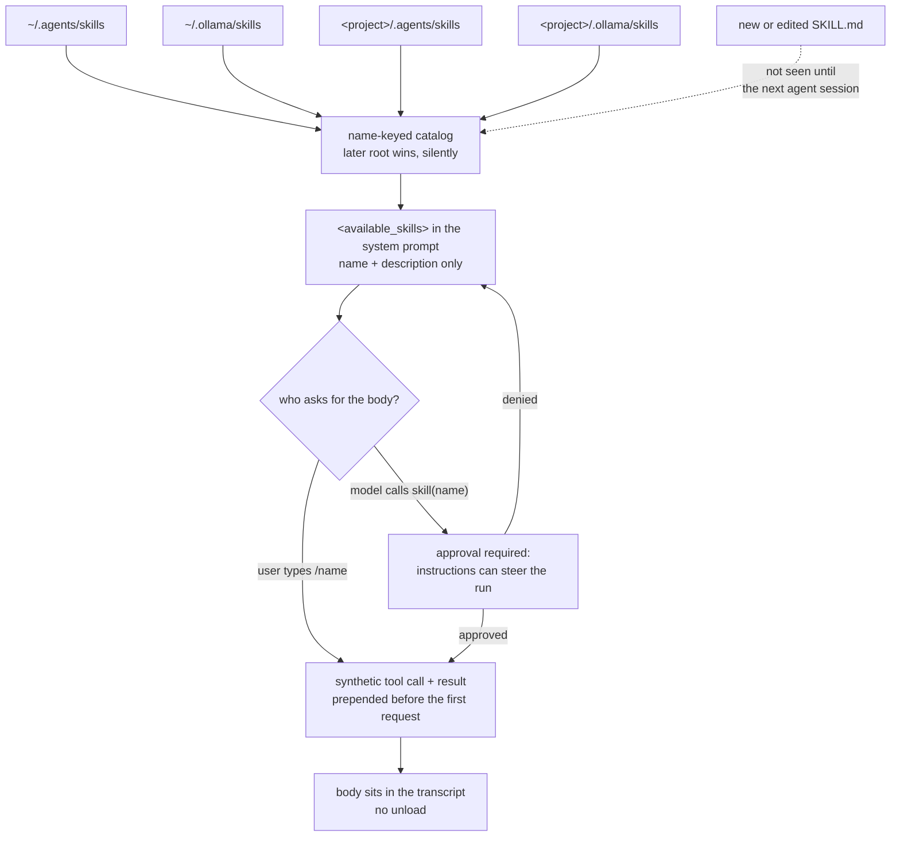

## 1. Executive Summary

Ollama is on a token-cost list as a way to run open-weight models on hardware you
already own. Since it grew an `agent/` package that is no longer all it is: there
is a session loop, a tool registry, an approval gate, a compactor, and a **skill
catalog** — and the skill catalog is durable, cross-session state that shapes how
the agent behaves. That makes it a memory system of exactly one kind.

The scope of what it remembers is worth stating plainly first, because it is
narrow. Nothing the agent *learns* survives a run. There is no episodic store, no
extracted fact, no user profile, no conversation index. Approvals live on the
`Session` struct and die with it. Compaction, at 80% of a 32,768-token window by
default, replaces archived turns with a summary *inside the message history* and
saves nothing to disk. What persists is **procedural**: `SKILL.md` files a person
wrote, discovered at startup, and available to the model for the rest of the
session.

Two mechanisms in that narrow surface are worth a careful reader's time.

The first is **two-stage retrieval, with the reasoning in the code**.
`SkillCatalog.SystemContext()` renders an `<available_skills>` block containing
each skill's name and description and nothing else, above a comment that says why:
*"advertises the catalog without expanding full instructions in every request.
The skill call is the explicit loading boundary."* The body arrives later, as a
tool result, only for the skill actually used. That is the
[cache-preserving injection](../../patterns/cache-preserving-injection/)
split-by-position shape reached from a token argument rather than a caching one —
a stable index in the prefix, the volatile body after it.

The second is **approval on recall**. `agent/tools/skill.go` returns `true` from
`RequiresApproval`, with the reason in a comment: *"Model-initiated loads require
approval because a skill's instructions can influence the rest of the run."* User
activation through `/skill-name` bypasses the gate, because the user asked. Almost
every system in this atlas gates the *write* to memory and lets recall run
unattended; this one is the other way round, and for procedural memory that is the
correct way round.

Where it is weakest is that the catalog is a read-only substrate as far as the
agent is concerned. The bundled `skill-creator` is instructions telling the model
to write a `SKILL.md` with the user's approval and then to tell the user to start
a new session — a convention, not a code path. So the loop from "the agent learned
something" to "the agent remembers it" is closed by a human, deliberately.

## 2. Mental Model

A memory here is **a validated instruction file with a name**. The system's model
of it is exactly the front matter: `name`, `description`, and a Markdown body.

The state machine has three states and a person moves between all of them:

- **On disk, not loaded.** A directory under one of four roots containing
  `SKILL.md`. It must be under 1 MiB, must begin with `---`, must have parseable
  front matter, and must not be empty; anything else is a diagnostic and the skill
  is skipped.
- **Advertised.** At agent start, `LoadDefaultSkills(projectDir)` walks the roots
  and builds a name-keyed map. Every loaded skill's name and description are in
  the system prompt for the whole session. **Nothing rescans**: the bundled
  skill's own text tells the user that *"new and changed skills are discovered
  when the agent starts, so tell the user to begin a new agent session
  afterward."*
- **Loaded.** The body is in the transcript, as a tool result, and stays there.
  There is no unloading.

Death is `rm`. Correction is `$EDITOR`. A name collision across roots is not an
error and not reported — the comment calls it *"expected precedence resolution"* —
so a project skill silently shadows a user skill of the same name, which is the
intended behaviour and also the one way a memory here can quietly become a
different memory.

The epistemics are unusually simple and stated rather than implied. A skill is
never treated as evidence about the world, only as instructions, and it carries no
authority: the type comment says *"It never grants tool permissions; it is
supplied to the model as ordinary tool-result content"*, and the system prompt
repeats the same thing to the model — *"Skills only provide instructions; use
ordinary tools for filesystem or network access, with their normal approval
rules."* Saying it twice, in two audiences, is the design.

## 3. Architecture

There is no memory service, no database and no background process. The whole
subsystem is four files in one Go package:

| File | Lines | Concern |
| --- | --- | --- |
| `agent/skills.go` | 813 | discovery, validation, precedence, the catalog, `SystemContext()`, the bundled skill |
| `agent/skill_activation.go` | 57 | the synthetic tool call that injects an explicitly requested skill |
| `agent/tools/skill.go` | 40 | the model-facing tool, and its approval requirement |
| `agent/session.go` | 1,092 | the run loop that holds `Skills *SkillCatalog` |

Persistence is the filesystem. `SkillsDir()` resolves `OLLAMA_SKILLS`, then
`$XDG_CONFIG_HOME/ollama/skills`, then `~/.ollama/skills`.
`defaultSkillRoots(projectDir)` returns four roots in this order:
`~/.agents/skills`, the resolved user Ollama directory, `<project>/.agents/skills`,
`<project>/.ollama/skills`. Later roots overwrite earlier ones in the map, so
project beats user and — at the same level — Ollama's own directory beats the
cross-client one.

That `.agents/skills` root is the notable line in an otherwise ordinary loader. It
is a convention shared with other harnesses rather than an Ollama path, so a skill
written once is visible to more than one agent, and this runtime reads it at both
the user and project level without owning it.

`installBundledSkillCreator()` writes the bundled `skill-creator` into the user
skills directory at startup, and a failure there is a diagnostic rather than a
fatal error — so the catalog always contains at least one skill even when the disk
write fails, because `bundledSkillCreator()` parses it from a string constant
first.

### Deployment and ergonomics

Nothing to stand up. Ollama is a single binary, the skills are Markdown in a
directory, and the whole path is offline — which is the point of the project. No
API key is needed, nothing is uploaded, and the store is as inspectable and
hand-repairable as a text file, because it is one.

The cost of adoption is the cost of writing skills, and the ceiling is that a
skill is only as good as the description in its front matter, since that
description is the entire basis on which the model decides to load it.

## 4. Essential Implementation Paths

**Discovery.** `LoadDefaultSkills(projectDir)` in `agent/skills.go:211` →
`defaultSkillRoots` → `DiscoverSkills(root.path)` per root → `parseSkill(path,
directoryName)` → `parseSkillContent`. Diagnostics accumulate on the catalog
rather than aborting the load.

**Validation.** `parseSkill` uses `os.Stat` rather than `Lstat` *"so a symlinked
SKILL.md resolves to its target file"*, rejects anything over `maxSkillBytes`
(1 MiB), and `parseSkillContent` rejects an empty file and one that does not begin
with `---\n` or `---\r\n`.

**Advertisement.** `SkillCatalog.SystemContext()` at `agent/skills.go:720` builds
the `<available_skills>` list. `cmd/agent_tui.go:264` registers the `skill` tool
only when the catalog is non-empty, so a user with no skills gets no tool.

**Explicit activation.** `Session.activateSkill` in `agent/skill_activation.go`
loads by name and returns two messages to prepend — an assistant message carrying
a synthetic `skill` tool call, and the tool result carrying `skill.Content()`. It
emits the same `tool_call_detected` → `tool_started` → `tool_finished` event
sequence the real tool path emits, so the transcript and the event stream cannot
tell the difference.

**Model-initiated load.** `tools.Skill.Execute` → `Catalog.Load(name)`, behind
`RequiresApproval` returning an unconditional `true`.

**Discovery in the interface.** `cmd/tui/chat/input.go:1273` offers every catalog
skill as a `/<skill-name>` completion, declining to shadow a built-in slash
command.

## 5. Memory Data Model

A `Skill` is a path, a directory name, a parsed front-matter `name` and
`description`, and a body. That is the whole schema, and it is not persisted
anywhere but the file.

Scoping is **precedence, not isolation**. All four roots are read on every start
and merged into one flat namespace; the ordering decides who wins a collision. No
skill is withheld from any session, no root is filtered out at read time, and
there is no user, tenant or agent key. A project skill cannot be hidden from
another project except by not being in that project.

There are no temporal fields, no versions, no correction chain, no TTL and no
provenance beyond the path the file came from. `Skill.Name` is derived from the
directory name and constrained by the bundled instructions to lowercase letters,
numbers and single hyphens, at most 64 characters — a rule stated to the model
rather than enforced by the loader as far as this reading found.

Nothing separates episodic from semantic material because neither exists. The only
distinction the package draws is procedural instructions versus everything the
session is doing, and the second half is discarded.

## 6. Retrieval Mechanics

**The model is the retriever.** There is no index, no scoring, no embedding and no
query. The system prompt lists `- <name>: <description>` for every skill, and the
model decides which one matches the task and calls `skill(name)` with an exact
name. `Catalog.Load` is a map lookup.

That has a real property worth naming: retrieval quality here is a function of how
well the *descriptions* are written, and the bundled `skill-creator` spends most of
its length on exactly that — its example descriptions all follow the shape "what
it does. Use when …", which is the model's only signal.

The token budgeting is the two-stage split. The catalog costs one line per skill
in every request; the body costs its full length once, in the turn it is loaded,
and then persists in the transcript until compaction archives it. A user with
forty skills pays forty lines of prefix always and one body sometimes, which is
the right trade and is the one the comment names.

Failure modes: a skill whose description does not match how a user phrases the
task is invisible, with no fallback search to find it. Two skills with overlapping
descriptions are disambiguated by nothing. And a shadowed skill is not merely
lower-ranked — it is absent from the catalog entirely, with no diagnostic saying so.

## 7. Write Mechanics

**There is no write path from the agent.** No tool creates, edits or deletes a
skill. The bundled `skill-creator` is a document instructing the model to use its
ordinary file tools — which carry their own approval rules — to write a `SKILL.md`
in the right place, not to overwrite an existing skill without the user's approval,
and to tell the user that a new skill needs a new session before it is visible.

Every one of those is a convention enforced by the model's compliance. The loader
does not check that a file was approved, and the catalog does not notice a file
appearing mid-session because nothing rescans.

Deletion and correction are the filesystem's. There is no conflict handling
because there are no concurrent writers the system knows about.

### Operational cost

The write path costs nothing because there is no write path. The read path costs
one line per skill per request plus one body per load, and no model call is spent
deciding anything — the *model* does the selecting as part of a turn it was going
to take anyway.

No background pass exists. Nothing re-reads the store, nothing rewrites it, and
the catalog is built once per agent start.

The injection sits on the friendly side of the prompt-cache boundary and does so
by construction: `<available_skills>` is computed once at start from a
name-sorted list, so it is byte-identical across turns, and the volatile part —
the loaded body — arrives as a tool result in the message history rather than in
the system prompt. `List()` sorts by name explicitly, which is what keeps the
block stable rather than map-iteration-ordered. Nothing in the tree claims this
was the reason.

## 8. Agent Integration

The surface is one tool, one slash-command convention, and one system-prompt
block. `agenttools.Skill` is registered only when the catalog is non-empty.
Explicit activation goes through `Session.activateSkill` and produces a transcript
indistinguishable from a model-initiated load, which matters because the
compactor, the event stream and any downstream consumer see one shape.

The agency split is the interesting part. The model may *read* memory, with
approval. It may not write it. The user may write it, and may read it without
approval. That is an unusual allocation, and it follows from what the memory is:
instructions that steer the run are more dangerous to load than to store.

Session lifecycle and compaction are handled in `agent/compactor.go`, and they do
not interact with skills at all: a loaded skill body is ordinary message content
and is archived into the summary like anything else. So a long session can lose
the instructions it loaded, and nothing reloads them.

## 9. Reliability, Safety, and Trust

The trust model is small, explicit, and repeated:

- **A skill is not a capability.** Stated in the type comment and again in the
  system prompt. The atlas has several systems where retrieved memory carries
  implicit authority; this one refuses it in text, in both directions.
- **Loading is privileged, storing is not.** The approval gate is on
  `tools.Skill`, which is the model's path, and is bypassed for user activation.
- **Symlinks resolve rather than being refused**, which is a deliberate `Stat`
  over `Lstat` — convenient for a shared skills directory, and it means a skill's
  real content can live outside every root the loader knows about.
- **A 1 MiB ceiling** bounds the worst single injection.

What is not defended:

- **Nothing checks who wrote a skill.** A `SKILL.md` that appears in
  `<project>/.agents/skills` because it was checked into a repository is loaded on
  the next agent start in that project, and the approval prompt the model hits
  shows a *name*, not the instructions behind it. The person approving is
  approving a string they have probably not read. That is the near-miss on
  human review in this design: there is a person in the loop and they are shown
  the wrong artifact.
- **Silent shadowing.** Precedence resolution is correct and unreported, so a
  project skill overriding a trusted user skill of the same name produces no
  signal anywhere.
- **Nothing survives the session but the files.** For the failure modes this
  atlas usually cares about — a wrong fact re-asserted, a deleted memory
  returning — Ollama is immune by not having the mechanism, which is worth saying
  plainly rather than scoring as a strength.

## 10. Tests, Evals, and Benchmarks

Go tests beside the code: 16 `func Test` entries in `agent/skills_test.go`, 21 in
`agent/compactor_test.go`, 38 in `agent/session_test.go`, 3 in
`agent/approval_test.go`, 1 in `agent/skill_activation_test.go`, plus
`agent/tools/skill_test.go` and a `agent/testdata/` tree.

What they assert is the loader's contract — discovery across roots, precedence,
malformed front matter, the size ceiling, the empty-file case, catalog listing.
That is the right coverage for what this is.

There is no evaluation of whether the model picks the right skill from a
description, which is the only quality question the design actually raises, and no
benchmark of any kind touching memory. No paper exists and none is claimed; there
is no `CITATION.cff` and no arXiv reference in the README.

I ran nothing. Every claim here comes from reading the tree at
`acdf81510d58d993de6175f8565b504d9777940a`.

## 11. For Your Own Build

### Steal

- **Split the catalog from the content.** Put a one-line-per-item index in the
  stable prefix and load the body on demand through a tool. It bounds the always-on
  cost at the number of items rather than their size, keeps the prefix
  byte-identical between turns, and gives you a natural place to put an approval
  gate. Sort the index deterministically or the prefix stability is accidental.
- **Gate recall, not only writes, when the memory is instructions.** Anything
  retrieved that will be *followed* rather than *considered* deserves a different
  permission than a fact does. Exempting user-initiated loads keeps the gate from
  becoming noise.
- **Say the trust rule to the model as well as in the code.** "Skills only provide
  instructions; use ordinary tools for filesystem or network access, with their
  normal approval rules" is a one-line defence against a retrieved document
  claiming authority it does not have. It is not enforcement, and it costs nothing.
- **Read the neighbours' directory.** Supporting `.agents/skills` alongside your
  own path means a user writes a skill once. Interoperating on a filesystem
  convention is the cheapest federation there is.

### Avoid

- **Do not resolve name collisions silently.** Precedence is right; not telling
  anyone is what turns a correct rule into a debugging session. Emit the shadowed
  path.
- **Do not make an approval prompt show a name when the risk is in the body.** If
  loading a document can steer the run, the person approving needs to see the
  document, or at least its provenance.
- **Do not rely on the model to tell the user your cache is stale.** "Start a new
  session to see the change" is a real constraint here and it lives in the text of
  a bundled skill, where it holds only if that skill was loaded.

### Fit

Take this shape if your agent's durable memory is genuinely procedural — playbooks
a person curates — and you want it to cost almost nothing. Four files, no
database, no background work, and the whole thing is legible to a user with a text
editor.

Do not take it as a memory system, because it is not one and does not pretend to
be. Anything the agent learns in a run is gone at the end of it, and there is no
seam to add persistence: no store, no event stream for memory, no write tool to
extend. If you need Ollama's local inference *and* durable episodic memory, the
memory belongs in a layer above this one — which is what most of the systems in
this atlas that mention Ollama are doing.

## 12. Open Questions

- Does anything enforce the name rules the bundled skill states — lowercase,
  hyphens, 64 characters — or is the directory name accepted as given? The loader
  path this reading followed derives the name from the directory without
  validating its shape.
- Is the shadowed skill genuinely unreachable, or is the losing path recoverable
  through a longer name? The catalog is a flat name-keyed map, which suggests not.
- How does an approval prompt render a `skill` call in each surface? The TUI path
  was read; the API and app surfaces were not.
- Does the agent package have any other durable artifact this reading missed? The
  probe covered `agent/` and its tools; the wider repository is 1,233 files and
  most of it is inference.

## Appendix: File Index

**Storage, discovery and validation**
`agent/skills.go`

**Context assembly**
`agent/skills.go` (`SystemContext`) · `agent/skill_activation.go`

**Integration**
`agent/tools/skill.go` · `agent/session.go` · `cmd/agent_tui.go` ·
`cmd/tui/chat/input.go`

**Session-bound state, for contrast**
`agent/compactor.go` · `agent/approval.go`

**Tests**
`agent/skills_test.go` · `agent/skill_activation_test.go` ·
`agent/tools/skill_test.go` · `agent/testdata/`

## History

**2026-08-09** — [`acdf81510d58d993de6175f8565b504d9777940a`](https://github.com/ollama/ollama/commit/acdf81510d58d993de6175f8565b504d9777940a) —
first reading, from the
[awesome-ai-tokenomics triage](https://github.com/QuesmaOrg/awesome-ai-tokenomics),
where the entry describes only local inference. Screened before reading: no
auto-run surfaces, one dependency surface inside the seven-day cooldown (`go.mod`,
changed one day earlier) and one unpinned manifest. Nothing was executed and
nothing was installed.
