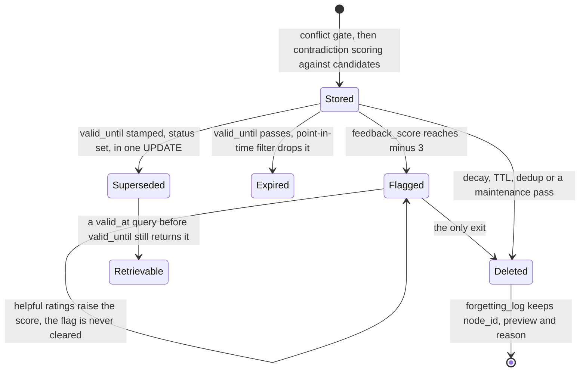

## 1. Executive Summary

OMEGA is a local-first memory server for coding agents: one SQLite database, an
MCP server, hooks, a CLI, Apache-2.0, about 17,300 lines of Python in
`src/omega`. The pitch is portability rather than novelty — "Your agent's brain
shouldn't live on someone else's server, or be locked to one provider" — and the
implementation is broad, with an Obsidian exporter, an OpenClaw skill, a plugin
system and translations.

Three mechanisms are worth reading.

**A real point-in-time query.** `memories` carries `valid_from` and
`valid_until`, both indexed, alongside `created_at`. The retrieval path has a
block labelled "Bi-temporal point-in-time filter" that takes a `valid_at`
argument and drops every candidate where `valid_from > valid_at` or
`valid_until <= valid_at` — both ends, in one batched query. Supersession sets
`valid_until` and `status = 'superseded'` in the same statement, so retirement
writes the validity bound rather than only flipping a flag.

**A forgetting log with reasons.** Deleting a memory writes a row to
`forgetting_log` carrying `node_id`, a `content_preview`, the `event_type`, a
`reason` and `deleted_at`, indexed on both `deleted_at` and `reason`. It is
exposed to the agent as an MCP tool with a reason filter, so "what has this
system forgotten, and why" is a question the agent can ask. Beside it,
`cloud_delete_queue` records a local delete so a cloud copy can be told — the
enumerated-derived-copies discipline, in one small table.

**And a review flag that only goes one way.** Feedback ratings of `helpful`,
`unhelpful` and `outdated` move a `feedback_score` by +1, −1 and −2. At −3 the
memory gets `flagged_for_review = True`, is removed from every retrieval result,
and is written into the forgetting log with reason `feedback_flagged`. There is
an MCP tool that lists the flagged set — "Flagged Memories (N need review)".
**Nothing anywhere in `src/` ever sets the flag back to false or deletes the
key.** A memory that later collects `helpful` ratings climbs its score back and
stays invisible, because the exclusion tests the sticky flag, not the score.

## 2. Mental Model

A memory here is a node in a store that is trying to do three jobs at once:
remember facts, coordinate agents, and forget on purpose. The forgetting is the
part with the most machinery — decay, TTLs, dedup, clustering, a dead-letter
queue for maintenance failures, and the log.

A claim enters through a two-stage contradiction gate. `conflicts.py` runs a
lightweight pre-storage check; `contradictions.py` is the fuller stateless
engine, scoring four signals — negation asymmetry, antonym presence, preference
value changes and temporal override markers — with a cross-encoder similarity
gate and a Jaccard fallback. The module header names all three call sites and
explicitly notes which one does *not* use it, which is unusually good
navigational documentation for a heuristic engine.

Two arrows carry the report. The one from `Superseded` back to retrievable is
what the validity interval buys. The self-loop on `Flagged` is the defect.

## 3. Architecture

`pip install omega-memory[server]` then `omega setup`, which downloads an
embedding model, registers the MCP server and installs hooks. One SQLite file
holds `memories`, `edges`, `entity_index`, `memory_clusters`, `forgetting_log`,
`cloud_delete_queue`, `thompson_arms`, `maintenance_dlq`, `llm_usage` and a
`schema_version` row driving numbered migrations.

`bridge.py` at 5,236 lines is the single largest module and is the API surface
the MCP handlers and the CLI both call. `sqlite_store/` splits into `_store`,
`_query`, `_search` and `_maintenance`, which is where the interesting code is.

`maintenance_dlq` deserves a name: a dead-letter queue for maintenance
operations that failed. A background pass that silently drops work is a common
shape here; one that records what it could not do is not.

## 4. Essential Implementation Paths

**Store** — `sqlite_store/_store.py`: conflict gate → `_check_contradictions`
(calling `contradictions.detect_contradictions`) → insert, with supersession of
a losing candidate as `UPDATE memories SET valid_until = ?, status =
'superseded'`.

**Query** — `sqlite_store/_query.py`: hybrid candidates → drop anything whose
metadata says `superseded` → the `valid_at` point-in-time filter → drop anything
with `flagged_for_review` → rerank.

**Feedback** — `sqlite_store/_maintenance.py:860`: append the rating to
`feedback_signals` with a timestamp and, when available, the retrieval context
that produced the hit; adjust `feedback_score`; at −3 set the flag and log the
crossing.

**Forget** — `_maintenance.py`: delete the row, write `forgetting_log`, enqueue
`cloud_delete_queue`.

## 5. Memory Data Model

`memories` has 25 columns. The structural ones are `valid_from`, `valid_until`,
`status`, `derived_from`, `canonical_hash`, `content_hash`, `entity_id`,
`memory_type` and `project`; everything else is counters, timestamps and
attribution. Sixteen of the columns are individually indexed, which tells you
the query shapes matter more than the write cost.

Two design choices are worth naming. `derived_from` and `source_uri` on the row
mean a synthesised memory can point at what produced it, which is the minimum
provenance a consolidation pass needs to be auditable. And the rich per-memory
state lives in a JSON `metadata` blob — `feedback_signals`, `feedback_score`,
`flagged_for_review`, `superseded` — read with `json_extract` in the queries that
need it. That keeps the schema stable and puts the epistemic state where no
column constraint can protect it, which is exactly why the flag can be set and
never validated.

## 6. Retrieval Mechanics

Hybrid search over the embedding index with query expansion
(`query_expansion.py`) and a cross-encoder reranker (`reranker.py`), followed by
three post-filters applied in order: supersession, point-in-time, and the review
flag.

The point-in-time filter is the good one. Rather than testing each candidate
individually it collects the node ids, runs one batched `SELECT` for the ids that
are *not* valid at the given instant, and removes those — a negative query, which
is the right shape when most candidates are valid.

Project scope is `(project IS NULL OR project = '' OR project = ?)`. The key is
applied on the read path, and the escape clause means every memory stored without
a project is visible from every project — the same hole as
[YesMem](../yesmem/)'s `canonical_project`, reached independently, and the reason
that mark is awarded here with the caveat rather than withheld.

## 7. Write Mechanics

Writes are synchronous through the store and pass a conflict gate before
landing. Contradiction detection is heuristic and deliberately stateless — the
module's header says "Stateless scoring engine with NO side effects" — with the
side-effecting auto-resolve living in a separate pre-storage module. Separating
the scorer from the mutator is what makes the scorer testable, and 70 test files
suggest it is tested.

Supersession is the one mutation that writes the validity axis, and it does both
halves in one statement.

Deletion is where OMEGA is most careful. Every delete leaves a `forgetting_log`
row with a reason, and the reasons are a real vocabulary — decay, TTL, dedup,
`feedback_flagged`. A migration deduplicates the log by `(node_id, reason)`,
keeping the earliest, so a repeatedly-forgotten node does not flood it.

What the log is not is a tombstone. It keeps a `content_preview`, not a
normalized key, and nothing on the write path consults it. Re-storing a memory
that an earlier pass forgot for being unhelpful succeeds, and the only trace is
a second row in the log.

## 8. Agent Integration

An MCP server with a broad tool surface, Claude Code hooks, a CLI, an OpenClaw
skill, a plugin system, an Obsidian exporter and translations. `omega_feedback`
is an agent-callable tool, which is what drives the score.

That is worth pausing on. The signal that suppresses a memory comes from the
model that read it, and the retrieval context is attached to each signal for A/B
tracking. A model that rates its own retrievals is a closed loop; whether it is a
useful one is not something the repository measures.

## 9. Reliability, Safety, and Trust

**Bitemporal — awarded.** Validity time (`valid_from`, `valid_until`) is tracked
separately from record time (`created_at`), both ends are filtered by a
caller-supplied `valid_at`, and supersession writes the bound.

**Scope — awarded, with the leak stated.** `project` is a read-path predicate;
`project IS NULL OR project = ''` admits unscoped rows everywhere.

**Audit log — awarded, and scoped.** `forgetting_log` is append-only, indexed,
carries a reason vocabulary, and is queryable through a tool. It records
deletions and flag crossings rather than every mutation — an edit or a
supersession does not appear — so it is a forgetting record, not a full audit
trail.

**Trust state — withheld.** `feedback_score` is an integer and
`flagged_for_review` is a boolean in a JSON blob; `status` takes `active` and
`superseded`, which is lifecycle. There is no field carrying
candidate-versus-verified-versus-rejected.

**Human review — withheld, and this is the finding.** A queue exists, a tool
lists it, and material is withheld pending review — which looks like the mark.
It fails on the transition: searching `src/` for anything that sets
`flagged_for_review` to false, deletes the key, or otherwise resolves a flagged
memory returns nothing. The three matches are all reads. So a person can see the
queue and cannot clear it; the only exit is deleting the memory. Combined with
the flag being sticky against a recovering score, the mechanism converts a
transient negative streak into permanent invisibility.

**Tombstone — no**, for the reason in section 7.

**Negative eval — no.** 70 test files, none asserting that particular material
must not be retrieved.

## 10. Tests, Evals, and Benchmarks

**No paper, but a `CITATION.cff`** — and the citation file is where a reader
should stop and check.

`CITATION.cff` states the project is "#1 on the LongMemEval benchmark (95.4%,
466/500)". `docs/benchmark-report.md` in the same commit opens with "**76.8% on
LongMemEval**" and repeats that figure throughout, comparing it to Zep at 71.2%
and full-context GPT-4o at 63.8%. **Two self-reported numbers for the same
benchmark differ by 18.6 points inside one repository**, and no result artifact
is committed — `scripts/longmemeval_bench.py` and
`scripts/longmemeval_official.py` are the harnesses, with no output file, no
run configuration and no judge specification beside them. Neither number is
checkable from this tree, and a reader has no way to tell which is current.

70 test files, and a `benchmarks/memorystress` package. **I did not run any of
them** — the screen flagged three auto-run surfaces (`.mcp.json`, `server.json`,
`smithery.yaml`), build-time execution in `tests/conftest.py`, and a
`pyproject.toml` changed inside the seven-day cooldown.

## 11. For Your Own Build

### Steal

- **Filter both ends of the validity interval in one batched negative query.**
  Collecting the candidate ids and asking which are *not* valid at the instant is
  cheaper than testing each, and it is four lines of SQL.
- **Write the validity bound in the same statement that supersedes.**
  `SET valid_until = ?, status = 'superseded'` cannot leave the two out of sync.
- **Log every deletion with a reason from a fixed vocabulary.** "Why is this
  gone" is the question a user asks after a forgetting pass, and a
  `(node_id, preview, reason, deleted_at)` row answers it for the price of one
  insert.
- **Expose the forgetting log to the agent.** An MCP tool with a reason filter
  turns the log from an operator artifact into something the agent can reason
  about before re-deriving what was thrown away.
- **Enqueue the delete for every derived copy you know about.**
  `cloud_delete_queue` is three columns and it is the difference between deleting
  a memory and deleting a memory everywhere.
- **Keep a dead-letter queue for maintenance.** A background pass that fails
  silently is indistinguishable from one that had nothing to do.
- **Attach the retrieval context to a feedback signal.** Knowing which query
  surfaced the memory that got rated `unhelpful` is what makes the signal usable
  for anything beyond a counter.
- **Separate the contradiction scorer from the mutator.** A stateless engine with
  no side effects, and a separate module that acts on it, is why the heuristic
  can be unit-tested at all.

### Avoid

- **Do not set a review flag you have no code to clear.** This is the whole
  lesson. A memory drops out of retrieval at −3 and stays out even if it climbs
  back, because the filter tests the flag and the flag is one-way. The fix is one
  line in the same function that sets it.
- **Do not keep epistemic state only in a JSON blob.** `flagged_for_review` lives
  in `metadata` where no constraint, no `CHECK` and no migration can notice that
  nothing ever unsets it.
- **Do not let a model rate its own retrievals into permanent suppression.** The
  score comes from an agent-callable tool and the threshold is absolute.
- **Do not publish two different numbers for the same benchmark.** The
  `CITATION.cff` figure and the benchmark report differ by 18.6 points, and the
  artifact that would settle it is not committed.
- **Do not let the empty string be a project.** `project = ''` is visible from
  everywhere.

### Fit

This suits a developer who wants one local memory server that works across
Claude, GPT, Gemini, Cursor and OpenClaw, and who values breadth of integration
over depth of any single mechanism. The forgetting machinery is the most
developed part and is a reasonable reason to choose it.

Anyone evaluating it on measured quality should treat the published numbers as
unverified: the two figures in this commit disagree, and the harnesses commit no
output. The `valid_at` filter and the forgetting log are the parts to read.

## 12. Open Questions

- **Was `flagged_for_review` meant to be clearable?** A `was_flagged` local
  variable is computed at two sites specifically to detect the *crossing*, which
  implies someone thought about the transition in one direction and not the
  other.
- **Which LongMemEval number is current?** 95.4% in the citation file, 76.8% in
  the benchmark report, no artifact for either.
- **Does anything consume `thompson_arms`?** A bandit table exists in the schema;
  what it drives was not traced.
- **How does the cloud delete queue drain?** One insert site was found and no
  consumer; whether a cloud sync reads it was not established.

## Appendix: File Index

**Schema** — `src/omega/schema.py` (`memories` at `:297`, `forgetting_log`
`:405`, `cloud_delete_queue` `:420`, `entity_index` `:429`, `memory_clusters`
`:483`, `thompson_arms` `:501`, `maintenance_dlq` `:181`, the log dedup
migration `:255`)

**Bi-temporal filter** — `src/omega/sqlite_store/_query.py:720-740`,
`src/omega/sqlite_store/_store.py:577` (supersession writing `valid_until`)

**Feedback and the sticky flag** —
`src/omega/sqlite_store/_maintenance.py:860-895`,
`src/omega/server/handlers.py:2120-2145` (the flagged listing tool),
`src/omega/server/context_handlers.py:534`

**Forgetting** — `src/omega/sqlite_store/_maintenance.py` (`_log_forgetting`,
the `cloud_delete_queue` insert at `:56`), `src/omega/bridge.py:4365`

**Contradiction** — `src/omega/contradictions.py` (the stateless engine and its
call-site map), `src/omega/reflect.py`, `src/omega/conflicts.py`

**Retrieval** — `src/omega/sqlite_store/_query.py`, `_search.py` (the project
predicate at `:760`), `src/omega/reranker.py`, `src/omega/query_expansion.py`,
`src/omega/embedding.py`

**Scope** — `src/omega/sqlite_store/_search.py:760`, `:993`

**Integration** — `src/omega/server/`, `src/omega/bridge.py`, `src/omega/cli.py`,
`hooks/`, `integrations/`, `openclaw-skill/`, `skills/`,
`src/omega/obsidian_export.py`, `src/omega/plugins.py`

**Benchmarks** — `scripts/longmemeval_bench.py`,
`scripts/longmemeval_official.py`, `docs/benchmark-report.md`, `CITATION.cff`,
`benchmarks/memorystress/`

## History

**2026-08-09** — [`d25e89f9fb8d9cbfca83e23cc368311e743f0e6a`](https://github.com/omega-memory/omega-memory/commit/d25e89f9fb8d9cbfca83e23cc368311e743f0e6a) — first reading. Screened before reading: three auto-run surfaces (`.mcp.json`, `server.json`, `smithery.yaml`), build-time execution in `tests/conftest.py`, and a `pyproject.toml` changed inside the seven-day cooldown. The tree was read, never installed, and no test or benchmark was run.
