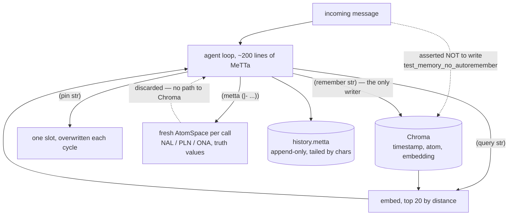

## 1. Executive Summary

OmegaClaw is the ASI Alliance's neural-symbolic agent framework on the Hyperon
stack, Apache-2.0, 296 files, 1,145 commits since 21 February 2026 — about 1,580
lines of MeTTa, 4,680 lines of Python outside the tests, and 15,680 lines of
tests across 32 files. Its README describes the same constraint its sibling does:
*"a minimalist MeTTa-based core of approximately 200 lines of code."*

**It shares early history with [MeTTaClaw](../mettaclaw/) — the root commits are
identical in both repositories — and the two have diverged on exactly the
question this atlas cares about.** MeTTaClaw kept a reinforcement ledger: the
agent promotes and demotes its own memories, promotion decays as a power law, and
recall returns a reinforcement-ranked slice beside a similarity-ranked one.
OmegaClaw removed all of it. `src/memory.metta` is 61 lines where its sibling's
is 112, there is no `promote`, no `demote`, no promotion database and no
inflation factor, and `query` is a single line: embed the string, return the top
twenty by distance. The recall budget went from ten to twenty in the same move.
Neither project has published a comparison, and the pair is the closest thing
this corpus has to a controlled experiment on whether a use-signal earns its
complexity.

**What OmegaClaw has instead is the test.** `test_memory_no_autoremember.py`
sends the agent a fact-shaped statement that asks for nothing, and asserts the
ChromaDB vector count did not grow — the agent *"is allowed to acknowledge via
`(send ...)` or even `(pin ...)`, but must not write a ChromaDB vector unless it
explicitly chose to."* The docstring then refuses the shortcut that would have
made it cheap: *"This test does NOT mock the LLM — the question being asked
('does the agent voluntarily call remember on a fact-shaped sentence?') is only
meaningful with a real model."* `test_memory_chromadb.py` is its control on the
same counter: after an explicit remember prompt, the count must grow by at least
one. A negative assertion whose positive twin uses the same measurement cannot
pass because the store is broken, and that pairing is rarer in this corpus than
either test alone.

**The memory model is documented as three tiers with different persistence, and
the third is the one to notice.** `pin` is a single working-memory slot,
overwritten each cycle, session-local. `remember`/`query` is the durable
embedding store. The AtomSpace — where NAL, PLN and ONA reasoning happens over
truth-valued atoms — is *"per-invocation (fresh AtomSpace each `|-` call)"*. So
the tier that can represent uncertainty, revise conflicting evidence and produce
what the README calls *"auditable proof trails"* is thrown away after every call,
and the tier that persists holds strings with no truth value at all. The formal
layer reasons; the durable layer remembers; nothing carries a conclusion from the
first into the second.

**And the documentation is unusually willing to name its own failure modes.**
`docs/reference-failure-modes.md` runs to eight sections including
confidence-propagation errors, variance and confirmation bias, and
self-improvement limitations, with a "defense stack" and a practical checklist.
A framework that ships a catalogue of the ways its reasoning goes wrong is doing
something most of this corpus does not.

`negative_eval` is the only mark. There is no discrete state on a memory, no
rejected-value record, one time axis, no scope key, and no mutation log.

## 2. Mental Model

A memory becomes durable when the model calls `remember`, and the project treats
that as the property to defend rather than as a limitation to work around — which
is why the absence of an extractor is tested rather than merely documented.

Once written, a memory never changes and never leaves. There is no update, no
supersession, no expiry and no delete anywhere in the tree, and — unlike its
sibling — no way to reduce a memory's standing either. The only lever over what
comes back is the query string, so a memory that turns out to be wrong is
retrieved on the same terms as one that is right, forever, and the correction has
to arrive as another memory that the embedding happens to rank above it.

Working state and durable state are separated deliberately. `pin` holds *"what am
I doing right now?"* in one slot that the next cycle overwrites, and the
documentation warns that choosing the wrong tier is *"one of the easier
performance and reliability foot-guns"* — an explicit instruction not to use
long-term memory as a scratchpad, which several systems in this atlas needed and
did not have.

## 3. Architecture

The runtime is a container: the tests drive it through `docker exec`, and read
ChromaDB by opening its SQLite file inside that container. Channels are Telegram
— the README points at a live agent called Oma — plus Slack and WebSocket, each
with its own mock harness under `Autotests/`.

State is Chroma for memory items, `memory/history.metta` for the transcript, and
per-provider prompt files: `getPrompt` takes a provider name and reads
`./memory/prompt_<provider>.txt`, falling back to `prompt.txt`, and falling back
again to an empty string if neither exists. Both file reads in this module are
guarded the same way — `getHistory` returns `""` when the history file is absent
rather than failing — so a fresh deployment starts empty instead of erroring,
which is the correct choice and a change from the sibling, where the same reads
are unguarded.

`getHistory` uses `read_file_tail` on the character budget. Its sibling reads the
whole file and slices the last 30,000 characters; this reads the tail. The
transcript is the fastest-growing file in either system and this is the version
that does not load all of it per turn.

## 4. Essential Implementation Paths

**Write** — `(remember $str)`: embed, then `lib_chromadb.remember` with the
string, the embedding and the timestamp. Two lines, no validation, no dedupe, no
cap.

**Read** — `(query $str)`: `lib_chromadb.query (embed $str) (maxRecallItems)`.
One line, top twenty by distance. There is no re-ranking pass, no second signal,
no scope filter and no minimum score, so a query against a non-empty store always
returns up to twenty items and can never return nothing.

**Embedding** — `initMemory` sets `embeddingprovider Local` by default, with
OpenAI as the alternative through `rag.openai_embed`. The sibling defaults to
OpenAI; this one defaults to running the embedder locally, which for a framework
whose selling point is a continuously running agent is the cheaper and more
private default.

**Episodes** — `(episodes $time)` calls the same `helper.around_time` as its
sibling: open the transcript, buffer every line, find the nearest timestamp,
return a window of lines around it. A full linear scan and a full in-memory copy
per call.

**History** — each turn appends the timestamp, the human message when there is
one, the response, and `ERROR_FEEDBACK` when the previous action errored, so a
failure is written into the text the next prompt reads.

## 5. Memory Data Model

A memory item is `(timestamp, atom, embedding)` with the atom's representation
left to the agent — the same position as its sibling, and the same consequence:
no schema, no required field, no type, so no code can validate, filter or migrate
a memory, and every mechanism this atlas looks for would have to be a convention
the model maintains inside the atom.

There is no field for a status, a scope, a provenance, a validity interval or a
confidence. The truth values that exist in this system — NAL's `(stv frequency
confidence)`, and PLN's — belong to atoms in the reasoning space, which is
rebuilt on every `|-` call. Nothing writes a truth value into Chroma and nothing
reads one out.

## 6. Retrieval Mechanics

One arm, twenty results, ranked by embedding distance. `stack_retrieval` is
`vector` because that is the whole of it.

**The design question the fork raises is whether that is enough**, and the honest
answer from the code is that it is a different trade rather than a simpler
version of the same one. Twenty similarity hits with no re-ranking cannot
surface a memory the agent found useful but that the query does not resemble;
ten similarity hits plus ten reinforcement hits, the sibling's arrangement, can —
at the cost of a hundred-row over-fetch per query, a SQLite ledger, and a
reinforcement signal supplied by the model that benefits from it. Neither project
measures the difference. What OmegaClaw gets in exchange is a read path with one
parameter and no state.

`episodes` is the second read path and it does not use embeddings at all: given a
timestamp, return the transcript lines around it. That is the recovery path when
similarity fails and the agent knows roughly *when* something happened, and it is
the only retrieval in the system that can reach material the embedding would
never rank.

## 7. Write Mechanics

**Writes are synchronous, unconditional and rare by construction.** The only
writer is a tool call, the only cost is the embedding round trip, and there is no
queue, no batching and no lag beyond it.

**Nothing deduplicates**, so the same fact remembered twice is two items, both
retrievable — and with no promotion signal to separate them and no delete to
remove one, duplication is permanent and accumulates linearly with how often the
agent decides to write.

**There is no correction path at all.** No update, no supersession pointer, no
expiry, no delete, no rejected-value record, and — the difference from its
sibling — no demote either. A memory the agent later judges wrong cannot be
removed, superseded, marked, or even ranked down. The only available action is to
remember a contradicting statement and hope the embedding prefers it.

That is the sharpest cost of the fork's simplification, and it is worth stating
plainly: MeTTaClaw's `demote` is a weak mechanism — it reduces a score and leaves
the memory retrievable — but it is the difference between an agent that can
express "stop preferring this" and one that cannot express anything about a
memory after writing it.

## 8. Agent Integration

Memory is four skills — `remember`, `query`, `episodes`, `pin` — documented in
`docs/reference-skills-memory.md` with signatures, purposes and a stated
constraint: *"All four skills accept quoted string arguments. Variables are not
permitted in LLM-generated calls."* Refusing variables in model-generated skill
calls is a small, deliberate narrowing of what a generated call can do, and it is
written down.

Beside them the agent has shell and file I/O, communication channels, and a
reasoning surface with three libraries — NAL, PLN and ONA — each with its own
reference document and tutorials on grounded and reliable reasoning. The
documentation set is 26 files and includes an internals reference for the loop,
the memory store, skill dispatch and extension points.

## 9. Reliability, Safety, and Trust

**Negative eval — awarded**, on the pair described in section 1. Two properties
make it stronger than its category usually is: it runs against a real model
because the property under test is behavioural, and its control shares the
measurement, so the negative cannot pass by the store being broken.

**Everything else is withheld.** There is no discrete epistemic state on a
memory, nothing keyed on a rejected value, one timestamp, no scope key, no
append-only record of mutations to the store, and no surface where a person
adjudicates memory content.

**The failure-mode documentation is the part worth reading anyway.**
`reference-failure-modes.md` catalogues premise formulation errors,
confidence-propagation errors, missing inference patterns, orchestration
failures, *variance and confirmation bias*, and self-improvement limitations,
then gives a defense stack and a checklist. Naming confirmation bias as a failure
mode of your own reasoning stack, in the reference documentation, is a discipline
this atlas asks for and rarely finds — and it makes the gap in section 5 more
conspicuous rather than less, because the project clearly understands what a
truth value is for and does not attach one to anything it stores.

**The exposure is the same as its sibling's**: shell access and arbitrary MeTTa
evaluation are skills, memory is writable through the same channel, and there is
no approval gate in the tree. The difference is that this one is deployed — the
README invites the reader to chat with a live Telegram agent — so the container
boundary is doing the work an approval gate is not.

## 10. Tests, Evals, and Benchmarks

**32 test files, about 15,700 lines**, which is more test than source. They are
integration tests against a running container: `dexec` shells into it,
`send_prompt` drives a channel, `find_skill_calls` and `wait_for_skill_call`
watch the transcript for the skill the agent chose, and assertions read
ChromaDB's SQLite file directly. Mock harnesses under `Autotests/mock`,
`mock_slack`, `mock_telegram` and `mock_websocket` provide the CI-friendly
variants.

Four cover memory: `test_memory_chromadb` (an explicit remember grows the vector
count), `test_memory_no_autoremember` (a fact-shaped statement does not),
`test_memory_episode` and `test_memory_history`. Beside them
`test_prompt_grounding`, `test_skill_query`, `test_skill_episodes`,
`test_skill_pin` and `test_skill_metta` exercise the skill surface.

**No benchmark, no committed run output, and no paper in the repository.** The
tests answer "does the agent choose the right skill" and never "is what it
recalled the right thing", so retrieval quality is unmeasured — which is the
corpus's normal state, and more noticeable here because the fork's central change
was to the retrieval path.

I ran nothing: the suite needs a running container and a real model.

## 11. Patterns Worth Stealing

### Steal

**Test the absence of an extractor against a real model.** If your design's
claim is "we only write when asked", the assertion has to involve something that
could have chosen otherwise. Mocking the model turns the test into a restatement
of the code.

**Give a negative test a positive control on the same measurement.** Vector count
before and after, once for a statement that should not write and once for a
prompt that should. Neither can pass for the wrong reason.

**Separate the working slot from the durable store, and say which is which in the
documentation.** One overwritten `pin` for task state, an embedding store for
knowledge, and a sentence warning that choosing wrong is *"one of the easier
performance and reliability foot-guns"*.

**Guard every read of a state file and return empty rather than failing.** A
fresh deployment with no history and no prompt file starts, instead of crashing
on the first turn.

**Tail the transcript, do not read it.** `read_file_tail` against a character
budget, where the sibling reads the whole file and slices.

**Publish your failure modes as reference documentation**, including the ones
that are about your own reasoning being wrong.

### Avoid

**Do not ship a durable store with no way to say anything about a memory after
writing it.** No delete, no supersession, no status, and — after the fork — not
even a demote. Every correction has to be a new memory competing on similarity.

**Do not leave the truth calculus and the memory store unconnected.** NAL, PLN
and ONA are here with tutorials, and the AtomSpace they reason in is rebuilt per
call, so no conclusion and no confidence ever lands in Chroma.

**Do not assume twenty similarity hits replace a use-signal.** It may; nothing
here measures it, and the sibling that kept the signal is one fork away.

### Fit

Take this if you want a deployed neural-symbolic agent with a small readable core,
a real test suite, and documentation that argues with itself about where its
reasoning fails. As a framework it is further along than its sibling in every
operational respect: containerised, multi-channel, locally embedded by default,
guarded file reads, and tests that drive a real model.

Do not take it if memory has to be correctable. The store is append-only in the
strongest sense — nothing in the tree can modify or remove an item — and the
retrieval path has no signal but similarity, so a wrong memory is competing on
equal terms with its correction for as long as the deployment lives.

## 12. Antipatterns / Risks

- **Nothing can be said about a memory after it is written.** No delete, no
  supersession, no status, no demote.
- **The reasoning tier is per-invocation.** Truth values, revisions and proof
  trails are discarded after each `|-` call and cannot reach durable memory.
- **Similarity is the only ranking**, so a useful memory the query does not
  resemble is unreachable except through `episodes` and a remembered timestamp.
- **No deduplication**, and with no delete, duplicates are permanent.
- **No scope key.** One collection per deployment.
- **`around_time` buffers the whole transcript** to locate one timestamp.
- **Retrieval quality is untested.** The suite asserts which skill the agent
  chose, never whether what came back was right.
- **Shell and arbitrary MeTTa are skills**, with memory writable through the same
  surface and no approval gate in the tree.

## 13. Build-vs-Borrow Takeaways

Borrow the test pair. Twenty lines of harness, a real model, and a counter read
before and after answer a question about a memory system that no amount of unit
testing can: does it write when nobody asked it to.

Borrow the tier table from `reference-internals-memory-store.md`. Three rows —
skill, persistence, role — settle an argument that recurs in most memory systems
and is usually settled by convention.

Do not borrow the storage layer; it is a thin call into a vector store the
repository does not contain, with no lifecycle. And read
[MeTTaClaw](../mettaclaw/) before deciding the retrieval path is finished: the
two share a root commit, and the reinforcement machinery this one removed is
still running over there.

## 14. Open Questions

- Why was the promotion ledger removed? No commit message, document or issue in
  the tree gives the reason, and the sibling still has it.
- Did the recall budget doubling to twenty compensate for losing the reinforcement
  slice, and how would anyone know?
- What would it take for a NAL conclusion to become a remembered atom with its
  truth value intact? The atoms are already the same format.
- The failure-mode reference names confirmation bias. Does a similarity-only
  recall over a store the agent chose to write make that better or worse?

## 15. Appendix: File Index

| Path | What it holds |
| --- | --- |
| `src/memory.metta` | All four memory verbs in 61 lines, and the guarded prompt and history reads |
| `Autotests/test_memory_no_autoremember.py` | The negative write test, and its docstring on why it refuses to mock |
| `Autotests/test_memory_chromadb.py` | The positive control on the same vector counter |
| `Autotests/helpers.py` | `dexec`, `send_prompt`, `find_skill_calls`, the Checker harness |
| `docs/reference-internals-memory-store.md` | The three-tier table, including the per-invocation AtomSpace |
| `docs/reference-skills-memory.md` | Signatures and the no-variables constraint on generated calls |
| `docs/reference-failure-modes.md` | Eight sections of self-diagnosis, including confirmation bias |
| `src/loop.metta` | The continuous execution loop |

## History

**2026-08-21** — [`b96afaa361f9426e1b7c2e36bdf187fa3a5a6b0f`](https://github.com/asi-alliance/OmegaClaw-Core/commit/b96afaa361f9426e1b7c2e36bdf187fa3a5a6b0f) — first reading. Screened before reading: build-time execution declared in six `conftest.py` files under `Autotests/`; nothing was installed, no container was built and no test was run, so every claim about the suite is from reading it. `negative_eval` awarded on the no-autoremember test and its control, with the mark's write-side form stated in the evidence record. The shared early history with [MeTTaClaw](../mettaclaw/) was established by comparing root commits, which are identical in both repositories, and the divergence in `src/memory.metta` — 61 lines against 112, with the promotion ledger absent — by diffing the two files directly.
