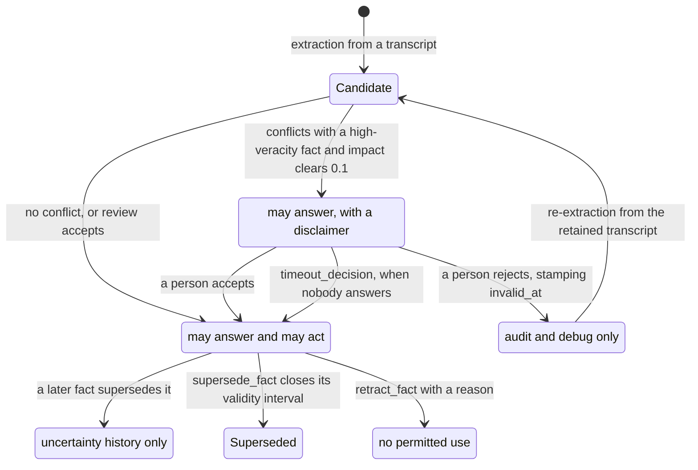

## 1. Executive Summary

Omi is a wearable and desktop capture product — it records conversations and
screen activity, transcribes, summarizes, and answers questions over what it
heard. MIT, 36,370 commits since 22 March 2024, with a Python `backend/` whose unit
suite runs to well over a thousand files. The memory
subsystem proper is about 7,200 lines under `backend/database/memor*.py` and
`backend/config/memor*.py`, over Firestore with Pinecone for vectors.

Most of that is product. The memory core is not, and it carries five of the
seven marks.

**Its most ambitious idea is that epistemic status should decide what a memory
may be *used for*, not merely whether it is returned.** `backend/database/review_queue.py`:

```python
ACTION_POLICY: Dict[str, Set[str]] = {
    'accepted': {'answers', 'actions'},
    'pending': {'answers_with_disclaimer'},
    'pending_review': {'answers_with_disclaimer'},
    'contradicted': {'uncertainty_history'},
    'rejected': {'audit_debug'},
    'dropped': set(),
    'tombstoned': set(),
    'source_tombstoned': set(),
}
```

and the gate written for it:

```python
def can_use_for_action(status: str, action_kind: str) -> bool:
    if action_kind == 'irreversible':
        return 'actions' in permitted_uses(status)
    return bool(permitted_uses(status))
```

**As written, an irreversible action would require an `accepted` fact.** An
unreviewed one could answer with a disclaimer, a contradicted one only feed
uncertainty history, a rejected one only audit. The question it asks — *given how
sure we are, what is this memory licensed to do* — is the right one for a device
that hears everything and can act on what it heard. **At this pin nothing outside
`review_queue.py` calls `can_use_for_action` or `permitted_uses`.** The policy
survives as data: tombstoned and privacy-purged payloads are written with
`permitted_uses: []`, and the review model defaults to
`["answers_with_disclaimer"]`, but no retrieval, chat or tool path reads that
field. What actually withholds a memory is the item status and the review state
on the read path (section 6).

**The store is a projection over a hash-chained ledger.**
`backend/database/memory_ledger.py` builds commits whose id is a SHA-256 over the
canonical JSON of `{parent_commit_id, mutations}`, so the chain is
content-addressed and a replayed commit is recognised rather than duplicated
(`if commit['commit_id'] in commits: return {'applied': False}`). Appending
checks the head and raises `HeadConflict(expected_parent, current_head)` when it
has moved — optimistic concurrency on a per-user history. The mutation
vocabulary is typed and specific: `add_fact`, `supersede_fact` (carrying a
`kind` such as `contradict` and a validity interval), `refine_fact`,
`retract_fact`, `add_evidence`, `remove_evidence`, `tombstone_evidence`,
`merge_entities`, `split_entity`, `reassign_fact_subject`.

**Confidence is two numbers that mean different things.** `capture_confidence`
is *"Fixed confidence that the source was captured correctly"*; `veracity` is
*"Current belief that the fact is true"*. A misheard sentence and a doubted claim
are different failures, and a device whose input is far-field audio needs to tell
them apart. Beside them sit `subject_attribution` — `user`, `third_party`,
`unknown`, `legacy_assumed`, recording *who the fact is about* — and typed
`uncertainty_reasons` (`single_source`, `low_capture_signal`, `contradicted_by`,
`stale`, `third_party_subject`).

**Human review is budgeted rather than unlimited.** `should_escalate_conflict`
raises a conflict to a person only when a low-veracity new fact meets a
high-veracity existing one *and* `impact_score` — importance times the veracity
gap — clears 0.1. A review queue that asks about everything is a review queue
nobody opens.

**The gap is the atlas's usual one, and here it is sharp.** Nothing is keyed on a
rejected *value*. `retract_fact` takes a `fact_id`, `tombstone_evidence` takes an
`evidence_id`, and rejecting through the review queue stamps `invalid_at` and
`review_status` on the row. The transcript that produced the fact is retained by
design — it is the product — so the extractor can re-derive a rejected claim from
the same conversation and it re-enters as a fresh candidate with no memory of
having been refused. For a device that will hear the same sentence again next
week, that is the failure mode with the shortest path to recurrence.


## 2. Mental Model

A memory is a **proposition**, not a sentence. `content` is there for display,
but the modelled unit is `predicate` plus `arguments` keyed by semantic slot,
with a `subject_entity_id` for who the fact is about, `object_entity_ids` for
what it references, and `qualifiers` carrying validity time and
`epistemic_status`. Beneath it sits a list of `Evidence` rows, each naming its
`source_type`, `source_signal`, `extractor_id`, `extractor_version` and a
`redaction_status` — so a claim can be traced to the extractor build that made
it, which matters when an extractor turns out to be wrong in a way that needs
re-running.

Belief has three independent dials rather than one score: `capture_confidence`
(did we hear it correctly), `veracity` (is it true), and `epistemic_status` (what
has been decided about it). The first two are floats banded by
`CONFIDENCE_BANDS` — low 0.0, medium 0.5, high 0.75, certain 0.9 — and the third
is the discrete state the policy table maps to uses.

How a thing becomes a belief: capture, extract into a candidate, and either land
as `accepted` or, when it conflicts with something already held strongly enough
to matter, sit as `pending_review` until a person decides or the timeout does.
How it stops being one: superseded by a newer fact with a validity interval,
retracted, invalidated, or rejected in review — each of which is a typed mutation
in the ledger and a status change on the projection.



The arrow from `Rejected` back to `Candidate` is the finding. Every other
transition is a decision the system records; that one is a decision the system
forgets, because the refusal is keyed on the row and the transcript that produced
it is still there.


## 3. Architecture

**Runtime.** A FastAPI backend (`backend/main.py`, routers under
`backend/routers/`), Firestore as the document store, Pinecone for vectors, and a
set of bounded workers. Clients are a wearable, a macOS and Windows desktop app,
a Flutter phone app, an MCP server under `mcp/`, and a plugin platform — all
against one backend.

**Persistence.** Memories are a **subcollection of the user document**:
`database.collection(users_collection).document(uid).collection(memories_collection)`.
Scope is therefore structural rather than a predicate a query might forget, and
`_encrypt_memory_data(data, uid)` / `_decrypt_memory_data(data, uid)` wrap write
and read, so the payload is encrypted per user at rest.

Beside the projection sits the ledger: per-user commits with a
`current_head_commit_id`, a `projection_version`, and a `memory_state/head`
document whose trusted fields (`uid`, `account_generation`, `head_commit_id`,
`commit_sequence`) have their own schema module and a stated contract that
writers must preserve rather than overwrite.

**Background work.** `memory_outbox_worker.py` is a bounded consumer for
projection and vector writes, and its docstring states the invariant that makes
an outbox safe: *"The canonical Firestore item is always reloaded before an
external projection write. Event payloads carry only fences and intent; they are
never used as a source of memory content."* An event says *something changed*,
never *what it is*. `memory_vector_repair_outbox_worker.py` and its telemetry
module handle vector drift, and a scheduled GitHub workflow runs a memory
maintenance job.

### Deployment and ergonomics

This is the heaviest deployment in the family. Firestore, Pinecone, a queue of
workers, an LLM gateway, transcription (Deepgram, with self-hosted Helm charts in
the tree), and a device. The README's quick start points a desktop build at the
*hosted* backend precisely because standing the backend up locally is not a
one-command affair.

The store is not human-readable in the way a JSONL or SQLite system is — it is
Firestore documents, encrypted per user. Repair is by code: `projection_repair`,
the vector-repair outbox, and a `firestore_index_registry`. That is the right
trade for a product with 300,000 users and the wrong one for someone who wants to
open the file and look.


## 4. Essential Implementation Paths

- **Schema:** `backend/models/memories.py` — `Memory`, `MemoryDB`,
  `ShortTermMemory`, `Evidence`, `MemoryCategory`, `SubjectAttribution`,
  `UncertaintyReason`.
- **Ledger:** `backend/database/memory_ledger.py` — `mutation`, the nine typed
  verbs, `commit_id_for`, `build_commit`, `append_commit_to_history`,
  `append_commit`, `HeadConflict`.
- **State head:** `backend/models/memory_state_head.py` — the trusted-field
  contract.
- **Apply path:** `backend/database/memory_apply_store.py` (1,912 lines) — the
  content-hash fences and the staged application of a commit to the projection.
- **Projection and repair:** `backend/database/memory_compatibility_projection.py`,
  `backend/database/projection_repair.py`.
- **Review:** `backend/database/review_queue.py` — `ACTION_POLICY`,
  `permitted_uses`, `can_use_for_action`, `impact_score`,
  `should_escalate_conflict`, `timeout_decision`, `create_review_conflict`,
  `list_review_conflicts`.
- **Store and lifecycle:** `backend/database/memories.py` — `get_memories`,
  `invalidate_memory`, `delete_memory`, `delete_memories_batch`,
  `delete_all_memories`, `delete_memories_for_conversation`, and the
  encrypt/decrypt wrappers.
- **Workers:** `backend/database/memory_outbox_worker.py`,
  `memory_vector_repair_outbox_worker.py`, `memory_vector_repair_telemetry`.
- **Retrieval:** `backend/utils/retrieval/` — `hybrid.py`, `graph.py`,
  `agentic.py`, `rag.py`, `safety.py`, `tool_result_boundaries.py`.
- **Rollout:** `backend/config/memory_rollout.py`,
  `backend/config/memory_confidence.py`,
  `backend/config/canonical_memory_cohort.py`,
  `backend/utils/memory_ingestion/rollout.py`.
- **Tests:** 76 memory-named files under `backend/tests/unit/`, including
  `test_memory_ledger.py`, `test_memories_user_review.py`,
  `test_short_term_memory.py`, `test_memory_rollout.py`,
  `test_memories_stale_updates.py`, `test_memory_contracts.py`.


## 5. Memory Data Model

The proposition shape is the interesting half. `predicate` plus slot-keyed
`arguments` plus entity ids means a fact is comparable to another fact
structurally, which is what makes `supersede_fact` and `merge_entities`
meaningful verbs rather than string surgery.

**Provenance is per-evidence, not per-memory.** An `Evidence` row carries
`source_type`, `source_signal`, `extractor_id`, `extractor_version` and
`redaction_status`, and a fact holds a list of them. So a claim supported by
three separate overheard mentions is a different object from one supported by
one, and `tombstone_evidence` can remove a single supporting source — with a
reason, defaulting to `source_tombstoned` — without discarding the claim, which
keeps retracting a fact and withdrawing one of its supports distinct.

**Temporal fields carry two clocks.** `normalize_fact_for_ledger` lifts
`valid_at` / `invalid_at` into `qualifiers.valid_from` / `valid_to`, so validity
time travels with the fact, while the ledger stamps `commit_time` and the
projection stamps `updated_at` — record time, separately. `invalidate_memory`
*"keeps the document (history) but stamps invalid_at"* and writes a
`supersede_fact` mutation carrying `valid_interval={'valid_to': invalid_at}`, so
closing a fact's validity and recording when that decision was made are two
different timestamps. The reader that would answer "what held at an instant",
`replay_to`, has no caller (section 9).

**Scoping** is applied twice: Firestore reads are rooted at the user document,
and every memory vector search carries `uid $eq` on stored metadata, with
per-user encryption beneath both.

`ShortTermMemory` is a separate class with `status: "pending_consolidation"` and
its own `scope`, so material that has not yet earned a place in the canonical
store is a different type rather than a flag.


## 6. Retrieval Mechanics

Four paths live under `backend/utils/retrieval/`: `hybrid.py`, `graph.py`,
`agentic.py` and `rag.py`, with vectors in Pinecone and structured filters over
Firestore. `retrieve_memory_context_params` and the date-range extraction in
`backend/utils/llm/chat.py` turn a question into scope before anything is
fetched, which is the cheap gate in front of the expensive one.

Two files in that directory are the ones worth noting, because they exist at all:
`safety.py` and `tool_result_boundaries.py`. A memory system whose input is
everything the user heard, feeding an agent with tools, needs an explicit
boundary between *what a tool returned* and *what the user said*, and it is
unusual to find that named as its own module rather than assumed.

The read path is where the epistemic work lands. `get_memories` applies
`_memory_passes_list_visibility` (`memories.py:244-256`): a row whose
`user_review` is `False` is dropped and, unless `include_invalidated` is passed,
so is one whose `invalid_at` is set. The filter runs in Python on purpose, because
a Firestore predicate would drop legacy documents missing the field. Vector search
is stricter: `_base_memory_vector_filter` requires the `uid`, the current memory
schema version, `status = active`, `source_state = active`, a permitted visibility
and `restricted_sensitivity = false` on every query, and raises when the `uid` is
empty (`memory_vector_metadata.py:209-232`).

**The agent's retrieval surface grew.** Knowledge-ledger read and write tools
(`tools/knowledge_ledger_tools.py`, `knowledge_ledger_write_tools.py`), an
entity timeline over canonical memory items that lists current facts and, on
request, their history within a date range (`tools/entity_timeline_tools.py`),
and just-in-time conversation reads behind a gate (`tools/conversation_jit.py`)
sit beside the original paths. A canonical-to-ledger migration planner
(`utils/memory/knowledge_ledger_migration.py`) is side-effect free and applies
through the canonical apply store with revision and control-head fences.

Failure modes visible in the code: retrieval quality depends on the extractor
that produced the proposition, and `extractor_version` on the evidence is the
only handle for re-running a bad one. Nothing here re-scores an old fact when a
newer extractor would read it differently.


## 7. Write Mechanics

Capture is continuous — audio and screen — and extraction is asynchronous, so the
agent does not block on a memory write. The lag before a new fact is retrievable
is the extraction pass plus the outbox delivery, and nothing in the repository
states it as a number.

The apply path is fenced rather than trusting. `memory_apply_store.py` carries
`content_hash` on the item and compares it against the review item's
`source_content_hash` before applying, so a decision made about one version of a
fact cannot be applied to a different one that arrived in between. The outbox
worker reloads the canonical row before every external write and requires each
adapter to return `True` before it acknowledges delivery — an at-least-once
pipeline that refuses to write content carried in an event payload.

Conflict handling is the part with a policy. A new fact conflicting with an
existing one is escalated only if `should_escalate_conflict` says the conflict is
both ambiguous — new veracity below medium, existing at or above high — and
material, `impact_score` at or above 0.1. Everything else resolves without a
person. `timeout_decision` covers the case where the person never answers.

Deletion is a family of verbs rather than one: `delete_memory`,
`delete_memories_batch`, `delete_all_memories`, `delete_memories_for_conversation`
— the last of which matters for a product whose unit of capture is a
conversation, since deleting the source should be able to take its derived facts
with it. `invalidate_memory` is the non-destructive sibling that keeps history.

**What no write path does is consult a record of what was rejected.** The
`content_hash` machinery exists and is used for staleness fences; it is not used
as a refusal key. A fact rejected in review is stamped on its row, the transcript
stays, and the next extraction over that transcript produces a fresh candidate.


## 8. Agent Integration

One backend, many surfaces: a wearable, desktop apps for macOS and Windows, a
Flutter phone app, an MCP server under `mcp/`, a plugin platform under
`plugins/`, SDKs under `sdks/`, and a public API. `memory_app_key_grants.py`
scopes third-party app access to memory, which is the boundary a plugin platform
over a personal memory store has to have.

The model's agency is mediated rather than direct. It does not write memories by
calling a tool; extraction runs over captured material and the review policy
decides what becomes usable. What the model *can* do was meant to be
bounded by `can_use_for_action` — the same memory available for an answer and
unavailable for an irreversible action until a person has accepted it — and that
gate has no caller at this pin.

The human surface is the review queue, exposed through the app: conflicts listed,
accepted or rejected, with the rejection stamping `invalid_at` and
`review_status` and the memory disappearing from default retrieval. The routes
work. What is missing is anything that files a conflict into the queue.
`create_review_conflict` (`backend/database/review_queue.py:81`) is the only
writer of a new document to the `memory_review_queue` collection — the one
`.set()` on that collection is at `:101`, inside it — and it has no caller in
the backend outside its own definition. `should_escalate_conflict` at `:74`, the
impact test that would decide when to call it, is referenced only from
`backend/tests/unit/test_short_term_memory.py` and mocked in
`backend/tests/unit/memory_import_isolation.py`. So in a running deployment the
queue is empty, the listing returns nothing, and the resolution routes have
nothing to resolve. This is the third mechanism in this subsystem whose
production caller is absent, after `can_use_for_action` and the as-of replay.

The live review path is a different and simpler thing: `POST` at
`backend/routers/memories.py:1023` calls
`review_memory(uid, memory_id, value)` (`backend/database/memories.py:897-902`),
which sets `reviewed` and `user_review` on a memory that is already stored and
already being read. `_memory_passes_list_visibility` then hides it. That is a
rejection after the fact, and it is why this report no longer carries
`human_review`.


## 9. Reliability, Safety, and Trust

**`trust_state` — earned, on the status the read path uses.** Canonical items
carry `active`, `superseded`, `hidden` or `tombstoned`, every memory vector search
filters on `status = active`, and list reads drop user-rejected and invalidated
rows. `epistemic_status` is persisted in a fact's qualifiers as well, and its
eight values are mapped to permitted uses in `ACTION_POLICY`, but that mapping is
not consulted outside its own module.

**`audit_log` — earned.** A per-user commit chain whose ids are SHA-256 over
`{parent_commit_id, mutations}`, with the document store as its projection,
idempotent replay, and a head check that raises rather than last-writer-wins.
Privacy erasure is the one deletion: `purge_legacy_memory_commits_for_memories`
and `purge_canonical_privacy_history_for_memories` remove commits that reference
an erased memory.

**`bitemporal` — withdrawn.** Facts carry `valid_from` and `valid_to` beside
commit time, and `memory_ledger.replay_to(uid, commit_time, valid_time)` folds the
commit history as of both clocks, with `test_fold_commits_replays_head_and_valid_time`
asserting a fact present in January and absent in February. Nothing in the backend
calls `replay_to` or passes `valid_time` to `fold_commits`; the entity timeline
filters by when a fact began, not by what held at an instant. The mark needs an
as-of read a caller can reach.

**`scope_enforced` — earned.** Pinecone memory search always carries
`uid $eq` on the stored `uid` metadata and refuses an empty `uid`; Firestore reads
are rooted at the user document; data is encrypted per user at rest.

**`human_review` — withheld, and the reason is upstream of the queue's design.**
Accept and reject do write real state, and the impact bound on escalation is a
good idea. But nothing calls `create_review_conflict`, so no fact ever waits
there; and the review path that does run sets a flag on a memory already in
use. A queue nothing fills is not a gate, and a rejection after the fact is not
one either.

**`negative_eval` — earned.** `test_memories_user_review.py` builds a mixed set
and asserts the memory a user reviewed away is absent from the result while the
other three are present. A committed case pinning that a human's rejection is
honoured on the read path is exactly what the mark is for.

**`tombstone` — not earned, and it is the gap that matters most here.** Every
refusal is keyed on a row: `retract_fact(fact_id)`,
`tombstone_evidence(fact_id, evidence_id)`, `invalid_at` on the document. The
transcript that produced the fact is retained — it *is* the product — so the same
extraction can re-derive a rejected claim and it re-enters as a candidate. The
machinery to close this is already present and used for something else:
`memory_content_hash` exists in the apply store as a staleness fence. Keyed on
the normalized proposition rather than the row, consulted before a candidate is
admitted, it would be the missing mechanism.

Other observations:

- **Two confidence axes** that mean different things.
- **`subject_attribution`** records whether a fact is about the user or a third
  party. For a device that records other people talking, a store that cannot say
  whose fact this is has a privacy problem, and this one can.
- **The outbox invariant** — events carry fences and intent, never content — is
  the correct discipline for an at-least-once pipeline and is stated in the code.
- **Encryption is per user and applied at the boundary**, so a projection bug
  cannot leak plaintext into a shared index.
- **A `redaction_status` on evidence** suggests redaction is modelled at source
  level; how it is driven was not traced.


## 10. Tests, Evals, and Benchmarks

The unit suite under `backend/tests/unit/` has grown past a thousand files, and
over a hundred are memory-named, and the names track the risky logic:
`test_memory_ledger.py`, `test_memories_stale_updates.py`,
`test_memory_apply_null_evidence_ids.py`, `test_memories_delete_batch_chunk.py`,
`test_memory_contracts.py`, `test_short_term_memory.py`,
`test_memory_rollout.py`, `test_review_queue_non_active_routes.py`, and the
newer `test_knowledge_ledger*.py`, `test_memory_import_isolation_order_independence.py`
and `test_canonical_memory_vectors.py`.

`contract_tests/` sits at the repository root as its own tree, and
`backend/tests/eval/` exists beside the unit suite.

Nothing was run for this review — five dependency surfaces were inside the
seven-day cooldown, and the tree carries two auto-run editor surfaces
(`.cursor/mcp.json`, `.cursor/rules/`) plus agent-directed `AGENTS.md` and
`CLAUDE.md`, all read as data.

What is not established: no scored retrieval or memory-quality benchmark result
was located. For a system whose extraction quality decides everything downstream
— every proposition, every confidence, every conflict — the number that matters
is how often the extractor is right, and it is not in the repository. The
`extractor_version` field on evidence implies the question is anticipated.


## 11. For Your Own Build

### Steal

- **Map trust state to permitted uses, and discriminate on reversibility — then
  call it.** `ACTION_POLICY` plus `can_use_for_action(status, 'irreversible')` is
  about twenty lines and asks *given how sure I am, may I act on this*. Any agent
  that can send, buy, delete or schedule needs the question asked at the point of
  action; here the function exists and no action path calls it.
- **Two confidence numbers.** "Did we capture it correctly" and "is it true" fail
  independently and a single float cannot express a perfectly-heard lie or a
  misheard truth.
- **Record who the fact is about.** `subject_attribution` distinguishes the user
  from a third party from unknown. If your capture surface hears other people,
  this is a privacy control, not a nicety.
- **Evidence as rows, with the extractor build on each.** Withdrawing one
  supporting source is a different act from retracting the claim, and knowing
  which extractor version produced a support is what makes a bad extractor
  recoverable.
- **Budget your escalations.** `should_escalate_conflict` asks a person only when
  the conflict is ambiguous *and* material. A queue that surfaces everything is a
  queue nobody reads, which is the same as no queue with more guilt.
- **Events carry fences, never content.** The outbox reloads the canonical row
  before writing anywhere else, so a stale payload cannot become a stale
  projection.

### Avoid

- **A refusal keyed on a row when the source material is retained.** If you keep
  the transcript — and a capture product must — then rejecting a fact by id is a
  statement about one row that the next extraction pass over the same audio is
  free to contradict.
- **A policy table with no consumer.** Eight statuses mapped to permitted uses
  pay off only where an answer or an action path consults the map; unconsulted,
  the table documents an intention.
- **Assuming your extractor is right because everything downstream is careful.**
  The ledger, the fences, the review queue and the encryption are all downstream
  of one LLM extraction step whose accuracy is unmeasured here.

### Fit

This is a product backend, not a library, and the honest read is that you are not
going to adopt it — you are going to lift mechanisms from it. The deployment is
Firestore plus Pinecone plus a worker fleet plus transcription plus a device, and
the store is encrypted documents rather than something you can open and read.

Study it if you are building memory for anything that captures continuously and
then acts: a wearable, a meeting recorder, a screen agent. The problems it has
solved — a status that gates capability, two confidence axes, per-evidence
provenance, subject attribution, a bounded review queue — are the problems that
arrive with ambient capture and do not arrive with a chat box.

Walk away if you need to inspect the store by hand, if you cannot run a
managed-services deployment, or if you want a memory layer separable from the
product it belongs to. Nothing here is packaged for reuse; the value is the
design decisions, and those transplant.


## 12. Open Questions

- **How accurate is the extractor?** Every mechanism in this report is downstream
  of it and nothing measures it. This is the number the design most needs.
- **Will `can_use_for_action` be wired into the tool and action paths?** The
  policy is written and tested nowhere outside its module.
- **Does `delete_memories_for_conversation` reach the vectors and the ledger, or
  only the projection?** For a deletion request the answer decides whether the
  content is gone or merely unindexed.
- **What drives `redaction_status` on evidence?** The field is modelled; the
  policy that sets it was not traced.
- **How often does `timeout_decision` decide instead of a person?** It is the
  path by which an unreviewed conflict becomes an accepted fact, and its rate is
  the real measure of whether the review queue works.
- **Is `ShortTermMemory` consolidation lossy, and what survives it?** The class
  exists with `pending_consolidation`; the pass that drains it was not traced.
- **Does the vector-repair outbox converge?** It has its own telemetry module,
  which suggests drift is real and measured somewhere not in the repository.


## Appendix: File Index

**Schema**
- `backend/models/memories.py`, `backend/models/memory_state_head.py`,
  `backend/models/memory_contracts.py`, `backend/models/candidate.py`

**Ledger and apply**
- `backend/database/memory_ledger.py`, `backend/database/memory_apply_store.py`
- `backend/database/memory_compatibility_projection.py`,
  `backend/database/projection_repair.py`

**Store and lifecycle**
- `backend/database/memories.py`, `backend/database/memory_collections.py`,
  `backend/database/memory_imports.py`

**Trust and review**
- `backend/database/review_queue.py`, `backend/config/memory_confidence.py`,
  `backend/config/memory_rollout.py`,
  `backend/config/canonical_memory_cohort.py`

**Workers**
- `backend/database/memory_outbox_worker.py`,
  `backend/database/memory_vector_repair_outbox_worker.py`,
  `backend/database/memory_vector_repair_outbox_telemetry.py`,
  `backend/database/memory_vector_repair_pinecone_adapter.py`

**Retrieval**
- `backend/utils/retrieval/hybrid.py`, `graph.py`, `agentic.py`, `rag.py`,
  `safety.py`, `tool_result_boundaries.py`
- `backend/utils/llm/chat.py` (`retrieve_memory_context_params`)

**Integration**
- `backend/database/memory_app_key_grants.py`, `mcp/`, `sdks/`, `plugins/`

**Tests**
- `backend/tests/unit/test_memory_ledger.py`,
  `test_memories_user_review.py`, `test_short_term_memory.py`,
  `test_memory_rollout.py`, `test_memories_stale_updates.py`,
  `test_memory_contracts.py`; `contract_tests/`; `backend/tests/eval/`

## History

**2026-09-19** — re-pinned to [`b38c5457a19cd54e21c6354e989be854496951c4`](https://github.com/BasedHardware/omi/commit/b38c5457a19cd54e21c6354e989be854496951c4), 153 commits on. `human_review` is **withdrawn**, on the same class of finding the previous reading made twice over. `create_review_conflict` is the only function that writes a new document into `memory_review_queue`, and it has no caller in the backend outside its own definition; `should_escalate_conflict`, the impact test that would decide when to call it, appears only in a unit test and a mock. The queue's list, get and resolve routes all work and there is nothing for them to work on. The review path that does run — `POST` to the router at `:1023`, into `review_memory`, setting `user_review` on a stored row — stamps a rejection on a memory already in use. The other four marks stand with anchors re-verified at the new pin, including the list-visibility predicate that `negative_eval` rests on, which is fed by that live path rather than by the queue. Screened again first; nothing was installed and no suite was run.

**2026-09-15** — [`f9e3d0e3dfb5bb0b38c19e33c2f1aa941b95e67a`](https://github.com/BasedHardware/omi/commit/f9e3d0e3dfb5bb0b38c19e33c2f1aa941b95e67a) — 2,353 commits on, 2026-09-15. Read from a blobless checkout of the tree. Screened before reading: three auto-run surfaces, twelve build-time execution points, thirty unpinned surfaces, five dependency surfaces inside the cooldown, and `AGENTS.md` and `CLAUDE.md` read as data; nothing was installed or run. The memory subsystem moved about 7,500 lines: the canonical apply store nearly doubled, knowledge-ledger read and write tools, an entity timeline tool and just-in-time conversation reads joined the agent's retrieval surface, vector search gained a uid-and-status filter builder, and review resolution gained timeout expiry and privacy purges of ledger history. Two findings of the earlier readings were wrong and are corrected. `can_use_for_action` and `permitted_uses` have no caller outside `review_queue.py`, so the report's headline — status decides what a memory may do — is restated as a policy the read and action paths do not consult. `bitemporal` is withdrawn: the as-of replay `replay_to` and `fold_commits(valid_time=…)` have no production caller. `trust_state`, `scope_enforced`, `audit_log`, `human_review` and `negative_eval` are kept with re-anchored records. Five marks.

**2026-08-20** — [`bacd4cf2985bdab6098994345bd52ed91bcf3332`](https://github.com/BasedHardware/omi/commit/bacd4cf2985bdab6098994345bd52ed91bcf3332) — re-pinned 1,925 commits on. The repository moved 3,318 files and +393,125 lines in that span, and **the memory subsystem moved 435 lines across five files**: the rest is apps, SDKs, desktop and firmware. Screened again: two auto-run surfaces (`.cursor/mcp.json` and `.cursor/rules/`), twelve build-time execution points, two manifests inside the cooldown across thirty-three unpinned surfaces; nothing was installed and nothing was run. Marks unchanged at six of seven — still no rejected-value tombstone. Four changes are worth recording.

**A review resolution may no longer mutate the protected historical collection.** `backend/database/review_queue.py` routes `accept` and `correct` through `MemoryService` rather than calling `memories_db.merge_contradict_memory` directly, under a comment that states the new boundary: *"Historical review rows remain readable, but their resolution may not mutate the protected historical memory collection."* The accept path writes the accepted fact and then calls `_delete_review_conflicts_idempotently`, so resolving the same row twice cannot double-delete. The human review surface keeps its authority over current memory and loses it over the frozen slice — a distinction most review queues in this corpus do not draw at all.

**Extraction failure became a contract of its own.** `MemoryExtractionError` in `backend/models/memory_contracts.py` carries the extractor's name and exists so *"callers decide what an absent batch means for their write, and they must be able to catch it without importing an LLM client."* A write path can now distinguish *the extractor failed* from *the extractor produced nothing*, which is the distinction that decides whether an empty result should be persisted.

**The compatibility projection stayed lossless without loosening the strict contract.** `CandidateCompatibilityMetadata` (`backend/models/candidate.py`, `extra='forbid'`) carries `metadata`, `category` and a bounded `relevance_score` on the Candidate envelope rather than in the canonical task payload, because *"staged-task clients historically supplied these fields for presentation and ordering."* Released-client annotations ride beside the contract instead of widening it.

**And one dated operational fact, written where it happened.** `backend/database/memories.py` gains a dual-window list order — `updated_at` with a `created_at` fallback — because the released collection is missing `updated_at` on a material slice and no single index covers the key. The comment says why the shape is what it is: content decryption *"must not run on the prefix an offset skips — that prefix decrypt is what took GET /v3/memories past HTTP_GET_TIMEOUT on 2026-08-18."* Beside it, `prepare_memory_for_read`, `_memory_passes_list_visibility(include_invalidated=...)` and paged historical scans by `updated_at` and `created_at`.

**2026-08-06** — [`4ab6fa0ca7255b2445fc185ee29d456eb7aa01d8`](https://github.com/BasedHardware/omi/commit/4ab6fa0ca7255b2445fc185ee29d456eb7aa01d8) — first reading. Screened before reading: 2 auto-run surfaces (`.cursor/mcp.json` and six `.cursor/rules/` files, both editor-injected agent context), 12 build-time exec paths, 32 unpinned dependency surfaces with five inside the seven-day cooldown, plus `AGENTS.md` and `CLAUDE.md` addressed to a reading agent. All treated as data; nothing was installed, built or run. The report covers the backend memory subsystem, not the device firmware, the Flutter app or the desktop clients.
