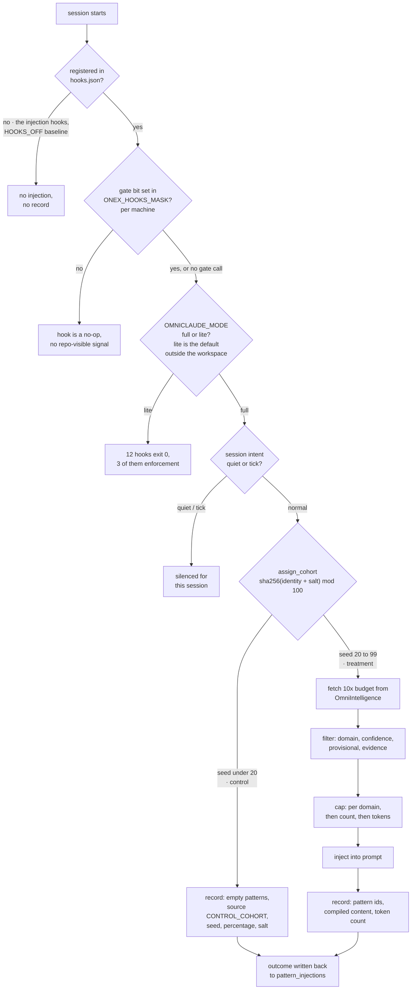

## 1. Executive Summary

OmniClaude is a Claude Code plugin and the delivery half of a two-repository memory loop. [OmniIntelligence](../omniintelligence/) learns patterns from session events and grades them; this repository fetches the survivors over HTTP, injects them into sessions through hooks, records what it injected, and reports outcomes back. MIT-licensed, about 112,000 lines of Python under `src/` with a further 241,000 lines of tests, across 2,502 commits.

It stores no memory of its own, and it is in this atlas for a different reason: **it is the only system here that runs a standing randomized trial on whether its memory helps.** `assign_cohort` hashes an identity with a salt, takes the result mod 100, and sends the bottom 20% to a control cohort that receives no injection at all. The control session still writes an injection record — with an empty pattern list, `source = CONTROL_COHORT`, the assignment seed, and the effective control percentage and salt that produced the assignment — so an analysis months later can tell which configuration generated which arm. Almost every memory system in this corpus argues that its memory helps; this one is set up to find out, and it is the reason the report exists.

Two things complicate that, and both are in the code rather than in the pitch.

**The trial's arms are not independent.** `assign_cohort` takes `user_id` and `repo_path` for exactly this reason — its docstring calls the property "sticky identity" and orders the fallbacks — and the single production caller passes neither. Identity is therefore always the session id, so the same person is re-drawn every session, and a user whose treated sessions have already shaped the shared pattern store will spend their control sessions in a world their treatment sessions built.

**The injection hooks are still not registered, and registration has turned out to be the least of it.** The manifest is explicit — *"Every context-injection/measurement hook stays DISABLED"* — and 28 narrowly-scoped guards are re-registered beside that sentence, none of them an injection hook. That much is the instrumented baseline the previous readings described, modelled as `EnumHookWindow.HOOKS_OFF` versus `HOOKS_ON` with a read-only harness comparing two windows.

What this reading adds is that **`hooks.json` is one of four ways a hook here goes dark, and three of the four are invisible to the repository.** A bit cleared in `ONEX_HOOKS_MASK` — which `common.sh` re-reads from `~/.omnibase/.env` under `set -a`, so it beats the caller's environment — turns a fully registered hook into a no-op. `OMNICLAUDE_MODE` resolves to `lite` for any working directory outside the operator's workspace with no local `omnibase_core`, which is the default on a CI runner and in every external repository, and twelve registered hooks exit 0 silently under it. And a session `intent` of `quiet` or `tick` silences a further set. The project found each of these the hard way and wrote a typed inventory to hold them, which is the best thing in the repository at this pin and the subject of section 4.

**And the plugin a customer installs no longer contains any of it.** The consumer marketplace sources `plugins/onex-delegate` — two delegation skills, zero hooks, zero agents, asserted by a committed test — while the 28-hook manifest lives in `plugins/onex` behind a separate internal-dev marketplace. So the injector is not merely switched off; for anyone who installs this plugin from its published entry, it is not shipped.

What the repository does not have is any epistemics of its own. There is no store, no correction, no scope key, and no state a memory can hold — those all live next door. It now carries one capability mark, `negative_eval`, on the filter that decides which fetched patterns reach a prompt: section 10 records both the evidence and the fact that two previous readings missed it.

## 2. Mental Model

Nothing here becomes a belief. A pattern arrives already graded, is ranked, is placed in a prompt, and the placement is recorded.

The one epistemic decision this repository does make is **how strongly to state something it is not sure of**. Rather than admitting only `validated` patterns, it admits `provisional` ones and multiplies their score:

```text
score = confidence · clamp(success_rate) · min(1, log1p(usage)/k)
        · provisional_dampening        (0.5 when lifecycle_state == "provisional")
        · evidence_modifier            (1.3 on gate pass, 0.6 on gate fail, 1.0 otherwise)
```

`provisional_dampening` must be greater than zero — the docstring says *"use `include_provisional=False` to disable entirely"* — so the config cannot express "keep provisional patterns and give them no weight". Admission and weighting are kept as separate decisions, which is the right separation and the opposite of how the states are treated upstream.

The state that actually matters to a session is not a property of the memory at all. It is which arm the session landed in:



Identity for that hash is chosen by a documented priority — `user_id`, then `repo_path`, then `session_id` — and the caller supplies only the last.

## 3. Architecture

A Claude Code plugin plus a set of Python hook handlers and consumers.

- **`plugins/onex/hooks/hooks.json`** — the registration surface, per the repository's own `CLAUDE.md`. 28 commands registered, all 28 resolving to a file that exists; 120 files sit beside it in `plugins/onex/hooks/scripts/`, helpers included.
- **`plugins/onex/hooks/contracts/hook_inventory.yaml`** (1,293 lines) — the typed inventory of what is supposed to be registered and what is deliberately dark, and the artefact this reading is mostly about.
- **`src/omniclaude/hooks/handler_context_injection.py`** (1,523 lines) — cohort assignment, pattern fetch, filtering, compilation, injection record.
- **`src/omniclaude/hooks/cohort_assignment.py`** (359 lines) — the trial.
- **`src/omniclaude/hooks/injection_limits.py`** — scoring and the three caps.
- **`src/omniclaude/hook_measurement/`** — the hooks-off versus hooks-on harness.
- **`consumers/`, `sql/`, `docker/`, `grafana/`, `monitoring/`** — the operational surround.

The memory store is `GET /api/v1/patterns` on another service. Everything durable this repository writes about itself is telemetry: a `cost_records` SQLite table under `$ONEX_STATE_DIR/hooks/cost_accounting.db`, and JSONL logs under `$ONEX_STATE_DIR/hooks/logs/`.

### Deployment and ergonomics

Installing the plugin is the easy half; the loop needs OmniIntelligence, its Postgres and its Kafka running somewhere reachable. Without them the hook degrades rather than failing — a timeout or a connection error returns an empty pattern list with a warning string (`omniintelligence_api_unavailable`), and the session proceeds unmemoried. That is the right direction for this failure to point.

An operator turning the loop *on* is editing `hooks.json`, which the manifest describes as *"a pure config change"* since the scripts remain on disk. An operator wanting to know whether it helped runs the measurement CLI over two windows whose boundary they recorded by hand.

A customer installing the plugin gets neither. The consumer marketplace at the repository root points at `plugins/onex-delegate`, whose whole surface is `delegate` and `cloud_delegate`; `plugins/onex-dev-marketplace` is where the hook tree lives and its own description says *"INTERNAL DEV ONLY … Not published to consumers"*. The scoping was done physically rather than by a filter, and the stated reason is that the manifest schema has no per-skill allowlist — a slim directory is the only enforcement available.

## 4. Essential Implementation Paths

### The trial — `cohort_assignment.py`

```python
seed_input = f"{identity}:{config.salt}"
hash_bytes = hashlib.sha256(seed_input.encode("utf-8")).digest()
assignment_seed = int.from_bytes(hash_bytes[:8], byteorder="big") % 100
cohort = EnumCohort.CONTROL if assignment_seed < config.control_percentage else EnumCohort.TREATMENT
```

Deterministic, salted, and configured from `contracts/contract_experiment_cohort.yaml` with environment overrides and hardcoded fallbacks used *only* when the contract cannot be loaded — the fallback path logs a warning rather than silently substituting. Default 20% control.

Three details are better than they need to be. The **seed is recorded on the injection row**, so an assignment can be recomputed and audited rather than trusted. The **effective control percentage and salt are recorded too**, so a later change to either does not retroactively mislabel earlier sessions. And the **control arm emits a record**, which is what makes the arms comparable at all — a trial whose control sessions leave no trace can only be analysed by absence.

The gap is the identity. The function exists to be sticky and the one production call site, `handler_context_injection.py:409`, is `assign_cohort(session_id, config=cfg.cohort)` — no `user_id`, no `repo_path`. The parameters are not forgotten: `tests/hooks/test_cohort_assignment.py:531-558` passes them at five call sites and exercises the precedence between them, including blank and whitespace-only values. They are tested and unwired, which is a different state from dead, and a worse one to leave alone — the capability works and nothing reaches it. So `identity_type` is always `SESSION_ID` and cohort membership is redrawn per session. For a treatment whose effect is *within* a session — better patterns in this prompt, fewer tool calls now — that is defensible. For a shared store that treated sessions are continuously teaching, it is not: the control arm is measuring an agent whose memory the same user's treatment sessions helped build.

A smaller one sits above it: cohort assignment is inside `if session_id:`, so a session with no id skips assignment entirely and proceeds to injection. Sessions that cannot be assigned are silently treatment.

### Injection — `handler_context_injection.py`

Treatment sessions fetch from OmniIntelligence with `limit` and `min_confidence`, and `domain` when known:

```python
fetch_limit = max(limits.max_patterns_per_injection * 10, 50)
```

with the reasoning stated — the chained filters *"each of which can eliminate the majority of candidates"* run after the fetch. Then caps are applied in a fixed order that `injection_limits.py` names: `max_per_domain → max_patterns → max_tokens`. Per-domain first is the choice worth noting: it prevents one domain monopolising the budget before the global cap has anything to do.

The token budget is counted with `cl100k_base` and then discounted:

> *"The two tokenizers can differ by ~10-15%, so we apply a 90% safety margin to the configured token budget to avoid over-injection."*

A `budget.cap.hit` event is emitted when the cap bites, so truncation is observable rather than silent — which is the half of a token budget most implementations here skip.

### Recording — `pattern_injections`

Every attempt writes a row, including control and error cases, with the `injection_id` generated before any work so the record exists whatever happens next. The table lives in OmniIntelligence's schema and carries `pattern_ids`, `injection_context`, `cohort`, `assignment_seed`, `compiled_content`, `compiled_token_count`, then the outcome fields, then a `contribution_heuristic JSONB` with its own `heuristic_method` and `heuristic_confidence`.

Naming the attribution method and its confidence *beside* the attribution is a small thing that matters: the loop upstream turns these into evidence tiers, and a reader can tell a measured contribution from a guessed one without reading the code that guessed.

### The baseline — `plugins/onex/hooks/hooks.json` and `hook_measurement/`

The manifest's description is the primary source:

> *"OMN-13244 measurement baseline … Every context-injection/measurement hook stays DISABLED; the only re-registered hooks are the Done-flip durable-evidence guard …, the OMN-7018 worktree canonical-root guard …, the SubagentStop secret-leak guard …, and the SubagentStop report-contract guard … All other scripts remain on disk and re-registration stays a pure config change."*

That sentence has survived thirteen carve-outs. The survivors are safety and observability controls rather than memory — a guard against marking work done without durable evidence, a worktree canonical-root guard, two subagent-report guards, a Bash secret-redaction guard, four bus-mirror hooks that emit one event each, a lane-death pair, a ticket-creation gate, an agent-model guard — and 28 commands are registered in total. Each carve-out is justified in the description by the incident that produced it, which is why a 31,000-character `description` field is the most useful thing in the file.

Two of those 28 are the exception to "not memory", and they matter to this report. `session_start_goal_surface.sh` prints the durable session goal — the `state_as_of` of a `GOAL.md` in a separate knowledge-base clone, its age, and the goal rows — into every session's opening context, with the re-baseline command printed instead when the goal is missing or older than twelve hours. `session_start_workspace_sync.sh` is its sibling for clone and venv drift. So a registered hook *does* put remembered durable state in front of the model at session start; it is not the pattern injector, and both arms of the trial receive it equally, but "nothing reaches the session at SessionStart" stopped being true. The reason the hook exists is stated better than a summary can:

> *"every session is supposed to open from ground state reconciled against the rolling plan. That only happens if the goal is visible without being remembered. An artifact that has to be recalled to be read is the same failure class as a hook that sits on disk unregistered."*

### The inventory — `plugins/onex/hooks/contracts/hook_inventory.yaml`

This file is new since the last reading and it is the strongest artefact in the repository. It exists because the baseline disable carried *"no inventory of what went dark"*, and its header names the consequence: `pre_tool_use_overseer_foreground_block.sh` sat on disk, unregistered, while the rule it enforces was corrected by hand roughly 61 times over 16 of 18 days — *"Nobody noticed, because nothing in the repo could answer the question 'which hooks are supposed to be on?'"*

What it declares, per hook: the script, event, matcher and flat order within the event; owner, ticket and purpose; whether the hook can refuse or rewrite a tool call (`enforcement`); a `canary` block or a `no_canary_reason`; the `mask.gate_call` it makes and whether that bit is actually defined in `hook_bits.sh`; and `lite_mode_exit`. 28 `expected_hooks` entries — exactly the 28 registrations — and four `disabled_hooks`, every one carrying a `review_by` date.

Three properties are worth copying outright:

- **The mechanical half is generated and the semantic half is authored.** `validate_hook_inventory.py --generate` writes script, event, matcher and order from the live manifest, so the file starts green; owner, ticket, purpose, enforcement and canary are written by a person. Adding a registration without declaring it fails the gate, *"by design: an undeclared hook is how an inventory rots."*
- **The same parity runs twice with opposite failure modes, and the split is argued.** `hook-inventory-gate` in CI fails closed on any drift. `session_start_hook_parity.sh` runs the same comparison plus the live mask and warns only, always exiting 0, because *"a hook-manifest mismatch that made the machine unusable would be a far larger outage than the drift it reports."* And the mask is deliberately checked only in the session hook, never in CI: a runner has no `~/.omnibase/.env`, and *"a check that passes because its input is absent is worse than no check."*
- **A gate that cannot fire is recorded as such rather than rounded off.** Four registered hooks name a `gate_call` whose bit is not defined in `hook_bits.sh`; `hook_bits_bit_for_name` returns non-zero, `onex_hook_gate` returns 0, and the hook runs unconditionally. They are declared `bit_defined: false` *"rather than quietly rounded to 'ungated', because the difference is exactly the kind of fact this inventory exists to hold."*

**And the file shows what the inventory does not cover: its own prose.** Two numbers in the header are roll-ups over the entries below it, and one has drifted — the header says *"nine registered hooks exit 0 silently"* in lite mode where twelve entries now declare `lite_mode_exit: true`. The adjacent claim in the same sentence, that three of them are enforcement guards, is exactly right, and so is *"Four registered hooks are in that state today"* about the undefined gate bits. The same shape appears one file over: the baseline regression test's docstring says *"OMN-17006 carves the final exception"* and then goes on to describe a twelfth. In both cases the per-record declaration a gate re-derives stayed true and the summary sentence beside it did not, which is the general rule worth taking: **a count that restates the records next to it will drift unless something recomputes it.**

A smaller one, and a fragility rather than a fault. `test_goal_surface_carve_out_records_owner_reason_expiry_restoration` locates the carve-out's four-field record with `description.split("its own carve-out record:", 1)[1]` — everything after the *first* occurrence of a marker that now appears six times. The goal-surface record happens to be first, so the test checks what it means to check. Move that record below another, or add a record above it, and the assertion silently begins reading a different carve-out's text while still passing. The test's own docstring is sharper about the limit above it than this: the four-word check on the whole description passes *"so a new registration with no record at all still passes that test"*, which is why this narrower test was written. Six of the thirteen carve-outs carry their own record; two of the six are pinned by a test.

`src/omniclaude/hook_measurement/` is the analysis surface, and it is careful about its own limits. It reads *existing* telemetry rather than adding a collection path. It labels each tool-call record into `HOOKS_OFF` or `HOOKS_ON` by comparing `recorded_at` against a boundary **the operator supplies by hand**. And `EnumTokenProvenance` marks each cost record `MEASURED`, `ESTIMATED` or `UNKNOWN`, so the harness knows which of its own inputs are real numbers and which were derived from response length.

That is two experiments of different quality in one repository, and worth separating: the cohort split is randomized and per-session; the hooks-off/on comparison is a before-and-after with a manually recorded boundary and no randomization at all.

## 5. Memory Data Model

There is no memory schema here. What this repository defines are the shapes of the *records about* memory: the injection row described above, the cost record with its token provenance, and the pattern model it deserializes from the API — signature, domain, confidence, success rate, usage count, lifecycle state and gate result.

No scope key is stored or sent. The pattern query carries `domain`, `min_confidence` and `limit`, and the endpoint it calls exposes no project or user parameter, so a session in one repository is served patterns learned in every repository the platform has seen. `domain` is a topical taxonomy, not a boundary.

## 6. Retrieval Mechanics

Delegated, then filtered locally. Ranking is the composite score above; selection is the three caps in order. There is no vector search, no reranking and no query rewriting — the query is a domain and a confidence floor.

Two failure modes follow from the split. **Over-fetch and post-filter** means the store's own ordering is discarded: 10× the budget is pulled by confidence and then re-ranked here by a formula the store knows nothing about, so the evidence tiers that decide promotion upstream reach the prompt only through `gate_result` as a ±40% multiplier. And **the filters that decide what an agent sees run on the far side of an HTTP boundary from the data that justifies them**, so a change to either side's notion of "good enough" is invisible to the other.

## 7. Write Mechanics

No memory is written. Injection records and cost records are written after the fact, off the reply path; the injection record is emitted before the handler returns, but a failure to emit degrades to a warning rather than blocking the session.

### Operational cost

- **Injection is on the critical path of the turn**, which is what the measurement harness exists to price. The API call carries a configured timeout with an asyncio deadline one second beyond it, and every failure path returns an empty pattern list with a warning string rather than raising.
- **The injected block is bounded** by patterns per domain, patterns per injection, and a token budget discounted 10% for tokenizer mismatch.
- **It is a prompt prefix**, injected at `SessionStart`, `UserPromptSubmit`, `PreToolUse` or `SubagentStart`. A per-prompt injection whose content changes between turns invalidates a provider's cached prefix from that point on, and nothing here reasons about that.
- **No background pass rewrites anything**, because there is nothing local to rewrite.

## 8. Agent Integration

A Claude Code plugin. Hooks are declared in `hooks.json` under `${CLAUDE_PLUGIN_ROOT}`, and `CLAUDE.md` warns against the obvious mistake with the reason attached: adding the plugin's hooks to `~/.claude/settings.json` as well makes *"duplicate entries fire every event twice (doubled logs, doubled Kafka emissions)"*.

The model has no agency over memory here at all: it cannot save, search, correct or forget. It receives a block of patterns it did not ask for, and its subsequent behaviour is the signal. That is a coherent position — the loop is measuring whether unrequested advice helps — and it is the opposite of the MCP-tool shape most of this corpus takes.

## 9. Reliability, Safety, and Trust

Strengths:

- **A randomized control arm that leaves a record**, carrying the seed and the parameters that produced it.
- **Contract-first configuration** with environment overrides and a warning when the contract cannot be loaded.
- **Ordered caps** — per domain, then count, then tokens — with an emitted event when the budget bites.
- **A tokenizer safety margin** with the discrepancy stated.
- **Provisional patterns dampened rather than excluded**, with admission and weighting kept separate.
- **Every failure on the fetch path degrades to no memory**, never to a raised exception in the agent's session.
- **Attribution method and confidence recorded beside the attribution.**
- **Token provenance marked** `MEASURED` / `ESTIMATED` / `UNKNOWN`, so the harness cannot mistake an estimate for a measurement.
- **A hook manifest that documents what it disabled and why**, rather than leaving a reader to diff it.
- **A typed inventory of what is supposed to be registered and what is deliberately dark**, generated where it can be and authored where it cannot, with an undeclared registration failing a merge gate.
- **The same parity check run fail-closed in CI and warn-only at session start**, with both choices argued from the outage each would cause — and the per-machine mask surface checked only where its input exists.
- **A gate call naming an undefined bit recorded as `bit_defined: false`** instead of being rounded to "ungated".
- **A committed test that the consumer plugin ships two skills and zero hooks**, so the internal tree cannot reach a customer install by accident.

Gaps:

- **The trial's identity is the session**, so arms are redrawn per session over a store both arms are teaching.
- **A session with no id is silently treatment.**
- **The hooks-off/on comparison is not randomized** and its window boundary is recorded by hand.
- **No scope of any kind** on what is fetched or injected.
- **No local durability for the loop's own record**: if the API is unreachable the injection record for that session is a warning, and the analysis silently has one fewer row.
- **The injection block is a changing prompt prefix** with no reasoning about prefix caching.
- **Registration is one of four ways a hook goes dark**, and three of them — the mask bit, the mode, the session intent — are per-machine or per-session facts no repository gate can see. Building the inventory found `WORKTREE_GUARD` cleared in the operator's own live mask, so a guard registered under a named carve-out was dark in practice.
- **Lite mode is the default outside the operator's workspace**, so an external repository or a CI runner gets none of the twelve hooks that exit under it, three of which are enforcement guards, and nothing says so at the time.
- **Two roll-up counts in the inventory's own header have drifted** from the records beneath them, and the baseline test's docstring still calls a carve-out "final" six carve-outs later.
- **Six of the thirteen carve-outs carry the four-field record the standing rule requires**, and two of those six are pinned by a test.

## 10. Tests, Evals, and Benchmarks

**I ran nothing.** The screen found one auto-run surface (`.claude-plugin/marketplace.json`, the consumer plugin entry — read, and it declares the two delegation skills and no hooks), 11 build-time exec surfaces, three *uninstalled* git-hook payloads under `scripts/`, no unpinned manifest, and both `pyproject.toml` and `uv.lock` changed inside the seven-day cooldown; nothing was installed and nothing was executed.

241,000 lines of tests, larger than the implementation. `tests/hooks/test_injection_tracking.py` covers the trial directly, using pre-computed session ids that deterministically hash into each arm — testing a hash-based assignment by choosing inputs with known outputs, rather than by mocking the hash, which is the right way round. It asserts that a control session returns `pattern_count == 0` and `source == "control_cohort"`, and that both arms emit a record.

That assertion is a **near-miss** on a negative retrieval assertion, and the two previous readings treated it as the closest case in the repository. It is not: the control path returns before retrieval is attempted, so what it asserts is that the retriever was not called — and the fixture it runs under sets `db_enabled=False`, which means `pattern_count == 0` would hold for a treatment session in the same test. A negative assertion that the fixture guarantees is not evidence about the code.

**`negative_eval` is earned, in a file neither previous reading opened.**
`tests/hooks/test_context_injection_api_source.py` mocks `urllib.request.urlopen` rather than the handler's own method, feeds `_load_patterns_from_api` a page holding one well-formed pattern and one missing its `id`, and asserts what came back:

```python
assert len(result.patterns) == 1
assert result.patterns[0].pattern_id == "PAT-VALID"
```

The exclusion is asserted by the identity of the survivor, and the same call proves the arrangement can return something, so the test cannot pass by returning nothing. Three sibling cases exclude a pattern missing its signature, its confidence, and everything below the confidence floor; `test_no_filter_warning_when_some_patterns_pass` runs the full `handle()` path with patterns at 0.90 and 0.10 against a 0.7 floor and asserts one survives; and `test_includes_patterns_when_api_returns_them` is the positive control, written against a named regression — *"OMN-2059 regression: API returned patterns but context has none"*. The weaker half, recorded in the evidence line: the identity assertion sits on the fetch-and-validate call, and the case that exercises the assembled block asserts a count.

**How two readings missed it.** The file is byte-identical at all three pins — blob `25d21d88`, added by the commit that restored injection over the HTTP API — so it was there both times. The previous readings enumerated the three test files the appendix names, found the control-cohort near-miss in one of them, and reasoned about the mark from those. The claim was true about the tests it read and wrong about the repository, which is the failure this atlas has [written up in its own words](https://github.com/neoneye/agent-memory-atlas/blob/main/notes/2026-09-17-the-instrument-that-narrowed-the-thing-it-measured.md): an absence claim is only as wide as the paths it enumerated. The appendix now lists the paths.

One further near-miss is worth naming because it is the same class and does not earn the mark. `plugins/onex-delegate/tests/test_delegate_only_surface.py` asserts that the consumer plugin ships exactly two skills and *zero* hooks and *zero* agents — a must-not about a distribution manifest, not about a retrieval result.

The trial's own machinery is unchanged: `cohort_assignment.py`, `handler_context_injection.py`, `injection_limits.py`, `models_injection_tracking.py` and all three previously cited test files are byte-identical to the last pin, so every claim in sections 4 through 8 was re-checked against the same bytes rather than re-derived.

`tests/hooks/test_graduated_injection.py` pins the dampening: a `validated` pattern is undampened, a `provisional` one is multiplied, a dampening of zero raises, and the lifecycle state is frozen on the record. `tests/hooks/test_injection_limits.py` pins the evidence-boost bounds — rejected above 3.0, rejected at or below 1.0.

What is missing is the trial's own result. Every mechanism for running the experiment is here — assignment, recording, the comparison harness, the two windows — and no analysis, no notebook and no committed figure appears in the repository. The measurement that would answer the question this system is built to ask has not been published in it.

**No paper, arXiv reference or citation file exists in this repository.**

## 11. For Your Own Build

### Steal

- **Hold out a control cohort and make it leave a record.** A memory system that cannot say whether it helps is the normal case in this corpus; a deterministic salted hash and an early return is most of the fix, and the empty record is what makes the arms comparable.
- **Record the experiment's parameters on the assignment**, not only in config. The seed, the percentage and the salt on the row mean a later change to any of them does not retroactively relabel old sessions.
- **Separate admission from weighting.** "Include provisional patterns at half weight" and "exclude provisional patterns" should be two settings, and the one that means *keep but ignore* should be impossible to express.
- **Apply caps in a stated order**, per-scope before global, and emit an event when the budget truncates. A silent cap looks identical to a store that had nothing to say.
- **Discount your token budget for tokenizer mismatch** and write down the percentage and the reason.
- **Mark the provenance of your own measurements.** `MEASURED` versus `ESTIMATED` on a cost record stops an analysis from averaging the two.
- **Document what you disabled in the manifest that disables it.** The description field of `hooks.json` here does more for a reader than a changelog entry would.

### Avoid

- **A stickiness parameter no caller passes.** If cohort identity is meant to be a user and the call site sends a session, the experiment silently answers a different question than the one designed — and the docstring will still describe the intended one.
- **Randomizing per session over a shared store both arms feed.** Either hold the identity stable across sessions or state plainly that the control arm is contaminated by the treatment arm's writes.
- **Treating a before-and-after with a hand-recorded boundary as equivalent to a randomized split.** Both may live in one repository; they should not be reported as one kind of evidence.
- **Skipping assignment when the identity is missing.** "Unassignable" should be its own recorded outcome, not silent treatment.
- **Over-fetching and re-ranking on the client.** It discards the store's ordering and puts the decision about what an agent sees on the far side of a network boundary from the evidence that justifies it.

### Fit

Take the experiment, not the system. This repository has no memory of its own to adopt, and its injection path is specific to Claude Code hooks and to one HTTP contract. What generalises is roughly 400 lines — the cohort assignment, the record it writes, and the harness that compares two windows — and those are worth more to most readers here than the 108,000 they sit in, because the question they answer is the one almost nobody in this corpus is set up to ask.

Adopt the whole loop only if you are already running the other half. And read the manifest before you conclude anything about what the loop does in practice: at this commit it is switched off on purpose, and a reader who assumes otherwise will be describing a system nobody is currently running.

## 12. Open Questions

- Has the trial produced a result? Every mechanism to run it is committed and no analysis is.
- Was the session-id fallback for cohort identity a deliberate choice for within-session effects, or the parameters simply never being threaded through?
- When were the hooks turned off, and is the `HOOKS_OFF` baseline still open at this commit or already closed?
- What refreshes an operator's memory that the boundary between measurement windows has to be recorded by hand?
- Does anything outside this repository persist the injection record when the OmniIntelligence API is unreachable?
- Is the per-prompt injection point intended to sit ahead of the cached prefix, and has the cost of that been measured by the harness that measures everything else?
- Now that the injector is absent from the consumer plugin rather than merely unregistered, what would turning the loop on for a customer consist of?
- Will the inventory's authored half acquire a check of its own? The two counts that drifted are both roll-ups of records the gate already reads, so a generated line would be a short script and would close the one gap the file has.
- Does the measurement baseline itself carry the four-field record its own standing rule requires? The rule is written for *"any future baseline-style disable"*, and the OMN-13244 disable that the rule exists because of predates it.

## Appendix: File Index

- The trial: `src/omniclaude/hooks/cohort_assignment.py`, `src/omniclaude/hooks/contracts/contract_experiment_cohort.yaml` (the path this appendix gave as `contracts/…` through two readings; the repository also has an unrelated top-level `contracts/`).
- Injection: `src/omniclaude/hooks/handler_context_injection.py`, `src/omniclaude/hooks/injection_limits.py`, `src/omniclaude/hooks/models_injection_tracking.py`.
- Hook registration and its inventory: `plugins/onex/hooks/hooks.json` (28 registrations, a 31,000-character `description`), `plugins/onex/hooks/contracts/hook_inventory.yaml`, `plugins/onex/hooks/lib/hook_inventory.py`, `scripts/validation/validate_hook_inventory.py`, `plugins/onex/hooks/scripts/session_start_hook_parity.sh`, `plugins/onex/lib/mode.sh`, `plugins/onex/hooks/hooks-delegation.v1.json`, `CLAUDE.md`.
- Durable state surfaced into a session: `plugins/onex/hooks/scripts/session_start_goal_surface.sh`, `plugins/onex/hooks/scripts/session_start_workspace_sync.sh`.
- Distribution: `.claude-plugin/marketplace.json`, `plugins/.claude-plugin/marketplace.json`, `plugins/onex-dev-marketplace/.claude-plugin/marketplace.json`, `plugins/onex-delegate/`.
- Measurement: `src/omniclaude/hook_measurement/` — `enums.py`, `metrics.py`, `models.py`, `trajectory.py`, `cli.py`.
- Tests cited: `tests/hooks/test_context_injection_api_source.py` (the mark), `tests/hooks/test_hooks_baseline_omn_13244.py`, `tests/hooks/test_injection_tracking.py`, `tests/hooks/test_graduated_injection.py`, `tests/hooks/test_injection_limits.py`, `plugins/onex-delegate/tests/test_delegate_only_surface.py`.
- Searches recorded: every command registered in `hooks.json` was resolved against `plugins/onex/hooks/scripts/` and all 28 exist; the directory holds 120 files, so most of what is on disk is unregistered — shared helpers (`common.sh`, `error-guard.sh`, `hook-gate.sh`) among them, which is why the count is not a count of dark hooks and the inventory's `disabled_hooks` section, four entries, is. `assign_cohort` has one production caller, `handler_context_injection.py:409`. `grep -rn "context_injection" plugins/onex/hooks/hooks.json` returns nothing.
- The store this depends on: [OmniIntelligence](../omniintelligence/), `GET /api/v1/patterns`.

## Appendix: Recorded Searches

Run from the root of the checkout at the pinned commit.

| Claim | Command | Result at this pin |
| --- | --- | --- |
| The production call passes neither identity | `grep -rn "assign_cohort(" . \| grep -v /tests/` | One hit, `src/omniclaude/hooks/handler_context_injection.py:409`, `assign_cohort(session_id, config=cfg.cohort)` |
| ~~Neither is passed anywhere in the repository~~ — **imprecise, corrected 2026-09-20** | `grep -rn "user_id=\|repo_path=" . \| grep -i cohort` | Five call sites in `tests/hooks/test_cohort_assignment.py:531-558`, covering both parameters, their precedence, and blank and whitespace-only values |
| The seed, salt and effective control percentage are recorded on the row | `grep -n "effective_salt\|effective_control_percentage" src/omniclaude/hooks/handler_context_injection.py` | `:424-425` and `:503`, written beside the assignment |

## History

**2026-09-20** — audited at the same pin. One sentence in section 6 said `user_id` and `repo_path` are *"never passed anywhere in the repository"*. They are passed at five call sites in `tests/hooks/test_cohort_assignment.py`, which exercises the precedence between them and the handling of blank values; what is true, and what the finding rests on, is that the single production call site passes neither. The sentence now says that, and the report gains a Recorded Searches appendix — it had none, which is how an absence claim nobody could re-run reached the site.

**2026-09-17** — [`6f062cd55e9141360d2fa7cda151df040874522a`](https://github.com/OmniNode-ai/omniclaude/commit/6f062cd55e9141360d2fa7cda151df040874522a) — third reading, 84 commits along the default `dev` branch. The trial itself did not move: `cohort_assignment.py`, `handler_context_injection.py`, `injection_limits.py`, `models_injection_tracking.py` and the three test files the appendix named are byte-identical to the last pin, and the single production caller at `handler_context_injection.py:409` still passes only the session id, so the sticky-identity criticism holds for the third time. Screened at this pin: one auto-run surface (the consumer plugin's marketplace manifest, read), 11 build-time execution paths, no unpinned manifest, and both `pyproject.toml` and `uv.lock` inside the seven-day cooldown, so nothing was installed and nothing was run.

**A mark is added and a withholding is corrected.** `negative_eval` is earned on `tests/hooks/test_context_injection_api_source.py`, whose `test_mixed_valid_and_invalid_patterns` mocks the transport, runs the real `_load_patterns_from_api` over a page holding one well-formed pattern and one missing its `id`, and asserts the survivor by identity — with a positive control in the same file written against a named regression. That file is byte-identical at all three pins, so the mark was earnable at the first reading and at the second. Both readings reasoned from the three test files this appendix listed, found the control-cohort near-miss in one of them, and published a withholding that was true about those tests and wrong about the repository. The near-miss analysis was also too generous to itself: the control test runs under a fixture with `db_enabled=False`, so its `pattern_count == 0` would hold for a treatment session too.

**The reading's finding is that registration was never the only switch.** The manifest's *"Every context-injection/measurement hook stays DISABLED"* still stands, with the re-registered carve-outs grown from sixteen to 28 commands, and a new 1,293-line `hook_inventory.yaml` now declares per hook what it gates on, whether that bit exists, whether it exits under `lite` mode, and whether it can refuse a tool call — with a canary required of every one that can. Building that file found `WORKTREE_GUARD` cleared in the operator's own live `ONEX_HOOKS_MASK`, so a guard registered under a named carve-out was dark in practice; and `OMNICLAUDE_MODE` resolves to `lite` — twelve registered hooks exiting silently, three of them enforcement guards — by default in every repository that is not the operator's workspace. Two of the four ways a hook goes dark are per-machine facts, a third is per-session, and only the first is visible to a repository gate. The same file's parity check is deliberately fail-closed in CI and warn-only at session start, with the reason given both ways round: a manifest mismatch that made the machine unusable would be the larger outage, and a CI check over a per-machine file *"passes because its input is absent"*.

Two registered hooks now put durable state in front of the model — a session-goal surface and a workspace-sync sibling — so the SessionStart baseline is no longer empty, though both arms receive it equally. And the injector has moved further away from a reader than "switched off": the consumer marketplace ships `plugins/onex-delegate`, two skills with zero hooks, asserted by a committed test, while the hook tree sits behind an internal-dev marketplace whose own description says it is not published to consumers.

Two numbers in the new inventory's header have drifted from the records below it — *"nine registered hooks"* against twelve entries declaring `lite_mode_exit: true` — while the two claims in the same paragraph that a gate re-derives stayed exactly right, and the baseline test's docstring still calls OMN-17006 *"the final exception"* six carve-outs later. Counted here rather than left as an impression: six of the thirteen carve-outs carry the four-field owner/reason/expiry/restoration record their own standing rule requires, and two of those six are pinned by a test whose record locator is the first of six identical markers in a 31,000-character string. This appendix also gave the cohort contract's path as `contracts/contract_experiment_cohort.yaml` through two readings; it is `src/omniclaude/hooks/contracts/contract_experiment_cohort.yaml`, and the repository has an unrelated top-level `contracts/` that made the wrong path look plausible.

**2026-09-09** — [`59b3c0ec3524b029abd4bc9f89e7d43d89be4abe`](https://github.com/OmniNode-ai/omniclaude/commit/59b3c0ec3524b029abd4bc9f89e7d43d89be4abe) — second reading, 128 commits along the default `dev` branch: 460 files, 53,331 insertions, of which 117 files and 26,880 insertions land inside the paths this report's appendix names. Screened before reading; nothing was installed and no suite was run.

Both criticisms hold, and neither has been narrowed. `assign_cohort` still takes `user_id` and `repo_path` for sticky identity, and the single production caller at `handler_context_injection.py:409` still passes neither — `assign_cohort(session_id, config=cfg.cohort)` — so the arms are still re-drawn per session. The injection hooks are still unregistered: the manifest still opens with *"Every context-injection/measurement hook stays DISABLED"*, and the number of narrowly-scoped guards re-registered beside that sentence has grown from four to sixteen.

The growth in that manifest is the reading's finding. Each carve-out now carries a required record — owner, reason, expiry, restoration — under a standing rule the file states in its own words: *"A disable with no expiry and no re-enable ticket is how OMN-13244 left enforcement dark for months while the rule it enforced was corrected by hand ~61 times."* Two of the newer guards were added after measuring exactly that failure shape at a tool seam no repository gate can see: a background-model guard after 41 workflow dispatches in one session inherited a banned model, and a ticket-creation gate after roughly 1,500 tickets were minted in a fortnight against a rule that existed only as prose. The rule this repository derives from its own history — that a control living in prose or in memory fails silently and at scale — is the same claim the atlas makes about memory systems generally, arrived at from the other direction.

No mark moves; this repository still stores nothing of its own. The scoring formula is unchanged, with `provisional_dampening` still a multiplier rather than an admission decision.

**2026-08-11** — [`9604842857f74ecdba5b063c67bf142a7649502e`](https://github.com/OmniNode-ai/omniclaude/commit/9604842857f74ecdba5b063c67bf142a7649502e) — first reading, on the `dev` default branch. Screened before reading: 0 auto-run surfaces, 11 build-time exec surfaces (`conftest.py`), three uninstalled git-hook payloads under `scripts/git-hooks/`, 0 unpinned manifests, and a `uv.lock` unchanged for 9 days; nothing was installed and nothing was executed. Read as the injection half of a loop whose store is [OmniIntelligence](../omniintelligence/); the shared `omnibase-*` git dependencies were not publicly readable at this reading.
