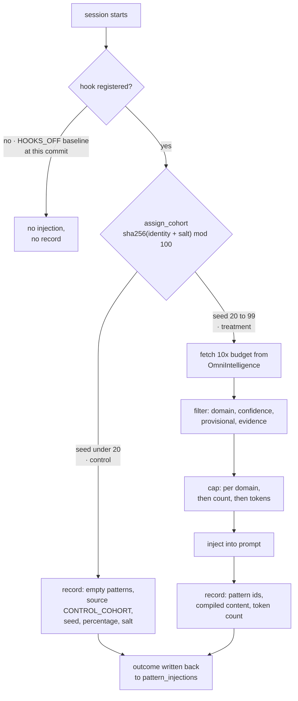

## 1. Executive Summary

OmniClaude is a Claude Code plugin and the delivery half of a two-repository memory loop. [OmniIntelligence](../omniintelligence/) learns patterns from session events and grades them; this repository fetches the survivors over HTTP, injects them into sessions through hooks, records what it injected, and reports outcomes back. MIT-licensed, about 108,000 lines of Python with a further 195,000 lines of tests.

It stores no memory of its own, and it is in this atlas for a different reason: **it is the only system here that runs a standing randomized trial on whether its memory helps.** `assign_cohort` hashes an identity with a salt, takes the result mod 100, and sends the bottom 20% to a control cohort that receives no injection at all. The control session still writes an injection record — with an empty pattern list, `source = CONTROL_COHORT`, the assignment seed, and the effective control percentage and salt that produced the assignment — so an analysis months later can tell which configuration generated which arm. Almost every memory system in this corpus argues that its memory helps; this one is set up to find out, and it is the reason the report exists.

Two things complicate that, and both are in the code rather than in the pitch.

**The trial's arms are not independent.** `assign_cohort` takes `user_id` and `repo_path` for exactly this reason — its docstring calls the property "sticky identity" and orders the fallbacks — and the single production caller passes neither. Identity is therefore always the session id, so the same person is re-drawn every session, and a user whose treated sessions have already shaped the shared pattern store will spend their control sessions in a world their treatment sessions built.

**At this commit the injection hooks are not registered at all.** The shipped manifest is explicit: *"Every context-injection/measurement hook stays DISABLED"*, with four narrowly-scoped guards re-registered by name. This is not decay — it is an instrumented baseline, modelled in the code as `EnumHookWindow.HOOKS_OFF` versus `HOOKS_ON`, with a read-only harness that compares cost, latency and outcomes across the two windows. So the repository ships a memory injector that is deliberately switched off while its effect is measured, which is a defensible thing to do and a fact a reader must be told before borrowing anything here.

What it does not have is any epistemics of its own. There is no store, no correction, no scope key, and no state a memory can hold — those all live next door. It carries no capability marks, and that is the accurate description rather than a criticism of a component doing one job.

## 2. Mental Model

Nothing here becomes a belief. A pattern arrives already graded, is ranked, is placed in a prompt, and the placement is recorded.

The one epistemic decision this repository does make is **how strongly to state something it is not sure of**. Rather than admitting only `validated` patterns, it admits `provisional` ones and multiplies their score:

```text
score = confidence · clamp(success_rate) · min(1, log1p(usage)/k)
        · provisional_dampening        (0.5 when lifecycle_state == "provisional")
        · evidence_modifier            (1.3 on gate pass, 0.6 on gate fail, 1.0 otherwise)
```

`provisional_dampening` must be greater than zero — the docstring says *"use `include_provisional=False` to disable entirely"* — so the config cannot express "keep provisional patterns and give them no weight". Admission and weighting are kept as separate decisions, which is the right separation and the opposite of how the states are treated upstream.

The state that actually matters to a session is not a property of the memory at all. It is which arm the session landed in:



Identity for that hash is chosen by a documented priority — `user_id`, then `repo_path`, then `session_id` — and the caller supplies only the last.

## 3. Architecture

A Claude Code plugin plus a set of Python hook handlers and consumers.

- **`plugins/onex/hooks/hooks.json`** — the single registration surface, per the repository's own `CLAUDE.md`.
- **`src/omniclaude/hooks/handler_context_injection.py`** (1,523 lines) — cohort assignment, pattern fetch, filtering, compilation, injection record.
- **`src/omniclaude/hooks/cohort_assignment.py`** (359 lines) — the trial.
- **`src/omniclaude/hooks/injection_limits.py`** — scoring and the three caps.
- **`src/omniclaude/hook_measurement/`** — the hooks-off versus hooks-on harness.
- **`consumers/`, `sql/`, `docker/`, `grafana/`, `monitoring/`** — the operational surround.

The memory store is `GET /api/v1/patterns` on another service. Everything durable this repository writes about itself is telemetry: a `cost_records` SQLite table under `$ONEX_STATE_DIR/hooks/cost_accounting.db`, and JSONL logs under `$ONEX_STATE_DIR/hooks/logs/`.

### Deployment and ergonomics

Installing the plugin is the easy half; the loop needs OmniIntelligence, its Postgres and its Kafka running somewhere reachable. Without them the hook degrades rather than failing — a timeout or a connection error returns an empty pattern list with a warning string (`omniintelligence_api_unavailable`), and the session proceeds unmemoried. That is the right direction for this failure to point.

An operator turning the loop *on* is editing `hooks.json`, which the manifest describes as *"a pure config change"* since the scripts remain on disk. An operator wanting to know whether it helped runs the measurement CLI over two windows whose boundary they recorded by hand.

## 4. Essential Implementation Paths

### The trial — `cohort_assignment.py`

```python
seed_input = f"{identity}:{config.salt}"
hash_bytes = hashlib.sha256(seed_input.encode("utf-8")).digest()
assignment_seed = int.from_bytes(hash_bytes[:8], byteorder="big") % 100
cohort = EnumCohort.CONTROL if assignment_seed < config.control_percentage else EnumCohort.TREATMENT
```

Deterministic, salted, and configured from `contracts/contract_experiment_cohort.yaml` with environment overrides and hardcoded fallbacks used *only* when the contract cannot be loaded — the fallback path logs a warning rather than silently substituting. Default 20% control.

Three details are better than they need to be. The **seed is recorded on the injection row**, so an assignment can be recomputed and audited rather than trusted. The **effective control percentage and salt are recorded too**, so a later change to either does not retroactively mislabel earlier sessions. And the **control arm emits a record**, which is what makes the arms comparable at all — a trial whose control sessions leave no trace can only be analysed by absence.

The gap is the identity. The function exists to be sticky and the call site is `assign_cohort(session_id, config=cfg.cohort)`; `user_id` and `repo_path` are never passed anywhere in the repository. So `identity_type` is always `SESSION_ID` and cohort membership is redrawn per session. For a treatment whose effect is *within* a session — better patterns in this prompt, fewer tool calls now — that is defensible. For a shared store that treated sessions are continuously teaching, it is not: the control arm is measuring an agent whose memory the same user's treatment sessions helped build.

A smaller one sits above it: cohort assignment is inside `if session_id:`, so a session with no id skips assignment entirely and proceeds to injection. Sessions that cannot be assigned are silently treatment.

### Injection — `handler_context_injection.py`

Treatment sessions fetch from OmniIntelligence with `limit` and `min_confidence`, and `domain` when known:

```python
fetch_limit = max(limits.max_patterns_per_injection * 10, 50)
```

with the reasoning stated — the chained filters *"each of which can eliminate the majority of candidates"* run after the fetch. Then caps are applied in a fixed order that `injection_limits.py` names: `max_per_domain → max_patterns → max_tokens`. Per-domain first is the choice worth noting: it prevents one domain monopolising the budget before the global cap has anything to do.

The token budget is counted with `cl100k_base` and then discounted:

> *"The two tokenizers can differ by ~10-15%, so we apply a 90% safety margin to the configured token budget to avoid over-injection."*

A `budget.cap.hit` event is emitted when the cap bites, so truncation is observable rather than silent — which is the half of a token budget most implementations here skip.

### Recording — `pattern_injections`

Every attempt writes a row, including control and error cases, with the `injection_id` generated before any work so the record exists whatever happens next. The table lives in OmniIntelligence's schema and carries `pattern_ids`, `injection_context`, `cohort`, `assignment_seed`, `compiled_content`, `compiled_token_count`, then the outcome fields, then a `contribution_heuristic JSONB` with its own `heuristic_method` and `heuristic_confidence`.

Naming the attribution method and its confidence *beside* the attribution is a small thing that matters: the loop upstream turns these into evidence tiers, and a reader can tell a measured contribution from a guessed one without reading the code that guessed.

### The baseline — `plugins/onex/hooks/hooks.json` and `hook_measurement/`

The manifest's description is the primary source:

> *"OMN-13244 measurement baseline … Every context-injection/measurement hook stays DISABLED; the only re-registered hooks are the Done-flip durable-evidence guard …, the OMN-7018 worktree canonical-root guard …, the SubagentStop secret-leak guard …, and the SubagentStop report-contract guard … All other scripts remain on disk and re-registration stays a pure config change."*

The four survivors are safety controls, not memory: a guard against marking work done without durable evidence, a guard against creating worktrees outside the canonical root, a guard that fails a subagent's final report if it matches a known secret pattern, and one that fails a lane whose return is a bare "Done" instead of the contracted report.

`src/omniclaude/hook_measurement/` is the analysis surface, and it is careful about its own limits. It reads *existing* telemetry rather than adding a collection path. It labels each tool-call record into `HOOKS_OFF` or `HOOKS_ON` by comparing `recorded_at` against a boundary **the operator supplies by hand**. And `EnumTokenProvenance` marks each cost record `MEASURED`, `ESTIMATED` or `UNKNOWN`, so the harness knows which of its own inputs are real numbers and which were derived from response length.

That is two experiments of different quality in one repository, and worth separating: the cohort split is randomized and per-session; the hooks-off/on comparison is a before-and-after with a manually recorded boundary and no randomization at all.

## 5. Memory Data Model

There is no memory schema here. What this repository defines are the shapes of the *records about* memory: the injection row described above, the cost record with its token provenance, and the pattern model it deserializes from the API — signature, domain, confidence, success rate, usage count, lifecycle state and gate result.

No scope key is stored or sent. The pattern query carries `domain`, `min_confidence` and `limit`, and the endpoint it calls exposes no project or user parameter, so a session in one repository is served patterns learned in every repository the platform has seen. `domain` is a topical taxonomy, not a boundary.

## 6. Retrieval Mechanics

Delegated, then filtered locally. Ranking is the composite score above; selection is the three caps in order. There is no vector search, no reranking and no query rewriting — the query is a domain and a confidence floor.

Two failure modes follow from the split. **Over-fetch and post-filter** means the store's own ordering is discarded: 10× the budget is pulled by confidence and then re-ranked here by a formula the store knows nothing about, so the evidence tiers that decide promotion upstream reach the prompt only through `gate_result` as a ±40% multiplier. And **the filters that decide what an agent sees run on the far side of an HTTP boundary from the data that justifies them**, so a change to either side's notion of "good enough" is invisible to the other.

## 7. Write Mechanics

No memory is written. Injection records and cost records are written after the fact, off the reply path; the injection record is emitted before the handler returns, but a failure to emit degrades to a warning rather than blocking the session.

### Operational cost

- **Injection is on the critical path of the turn**, which is what the measurement harness exists to price. The API call carries a configured timeout with an asyncio deadline one second beyond it, and every failure path returns an empty pattern list with a warning string rather than raising.
- **The injected block is bounded** by patterns per domain, patterns per injection, and a token budget discounted 10% for tokenizer mismatch.
- **It is a prompt prefix**, injected at `SessionStart`, `UserPromptSubmit`, `PreToolUse` or `SubagentStart`. A per-prompt injection whose content changes between turns invalidates a provider's cached prefix from that point on, and nothing here reasons about that.
- **No background pass rewrites anything**, because there is nothing local to rewrite.

## 8. Agent Integration

A Claude Code plugin. Hooks are declared in `hooks.json` under `${CLAUDE_PLUGIN_ROOT}`, and `CLAUDE.md` warns against the obvious mistake with the reason attached: adding the plugin's hooks to `~/.claude/settings.json` as well makes *"duplicate entries fire every event twice (doubled logs, doubled Kafka emissions)"*.

The model has no agency over memory here at all: it cannot save, search, correct or forget. It receives a block of patterns it did not ask for, and its subsequent behaviour is the signal. That is a coherent position — the loop is measuring whether unrequested advice helps — and it is the opposite of the MCP-tool shape most of this corpus takes.

## 9. Reliability, Safety, and Trust

Strengths:

- **A randomized control arm that leaves a record**, carrying the seed and the parameters that produced it.
- **Contract-first configuration** with environment overrides and a warning when the contract cannot be loaded.
- **Ordered caps** — per domain, then count, then tokens — with an emitted event when the budget bites.
- **A tokenizer safety margin** with the discrepancy stated.
- **Provisional patterns dampened rather than excluded**, with admission and weighting kept separate.
- **Every failure on the fetch path degrades to no memory**, never to a raised exception in the agent's session.
- **Attribution method and confidence recorded beside the attribution.**
- **Token provenance marked** `MEASURED` / `ESTIMATED` / `UNKNOWN`, so the harness cannot mistake an estimate for a measurement.
- **A hook manifest that documents what it disabled and why**, rather than leaving a reader to diff it.

Gaps:

- **The trial's identity is the session**, so arms are redrawn per session over a store both arms are teaching.
- **A session with no id is silently treatment.**
- **The hooks-off/on comparison is not randomized** and its window boundary is recorded by hand.
- **No scope of any kind** on what is fetched or injected.
- **No local durability for the loop's own record**: if the API is unreachable the injection record for that session is a warning, and the analysis silently has one fewer row.
- **The injection block is a changing prompt prefix** with no reasoning about prefix caching.

## 10. Tests, Evals, and Benchmarks

**I ran nothing.** The screen found 0 auto-run surfaces, 11 build-time exec surfaces, three *uninstalled* git-hook payloads under `scripts/`, and a `uv.lock` unchanged for 9 days; nothing was installed and nothing was executed.

195,000 lines of tests, larger than the implementation. `tests/hooks/test_injection_tracking.py` covers the trial directly, using pre-computed session ids that deterministically hash into each arm — testing a hash-based assignment by choosing inputs with known outputs, rather than by mocking the hash, which is the right way round. It asserts that a control session returns `pattern_count == 0` and `source == "control_cohort"`, and that both arms emit a record.

That last assertion is the **near-miss on a negative retrieval assertion**, and the reason this report carries no capability marks rather than one. It is a committed case asserting that nothing reaches the prompt — but the control path returns before retrieval is attempted, so what is asserted is that the retriever is not called, not that particular material was withheld from a result. It is a real and useful test; it is not the thing the mark measures.

`tests/hooks/test_graduated_injection.py` pins the dampening: a `validated` pattern is undampened, a `provisional` one is multiplied, a dampening of zero raises, and the lifecycle state is frozen on the record. `tests/hooks/test_injection_limits.py` pins the evidence-boost bounds — rejected above 3.0, rejected at or below 1.0.

What is missing is the trial's own result. Every mechanism for running the experiment is here — assignment, recording, the comparison harness, the two windows — and no analysis, no notebook and no committed figure appears in the repository. The measurement that would answer the question this system is built to ask has not been published in it.

**No paper, arXiv reference or citation file exists in this repository.**

## 11. For Your Own Build

### Steal

- **Hold out a control cohort and make it leave a record.** A memory system that cannot say whether it helps is the normal case in this corpus; a deterministic salted hash and an early return is most of the fix, and the empty record is what makes the arms comparable.
- **Record the experiment's parameters on the assignment**, not only in config. The seed, the percentage and the salt on the row mean a later change to any of them does not retroactively relabel old sessions.
- **Separate admission from weighting.** "Include provisional patterns at half weight" and "exclude provisional patterns" should be two settings, and the one that means *keep but ignore* should be impossible to express.
- **Apply caps in a stated order**, per-scope before global, and emit an event when the budget truncates. A silent cap looks identical to a store that had nothing to say.
- **Discount your token budget for tokenizer mismatch** and write down the percentage and the reason.
- **Mark the provenance of your own measurements.** `MEASURED` versus `ESTIMATED` on a cost record stops an analysis from averaging the two.
- **Document what you disabled in the manifest that disables it.** The description field of `hooks.json` here does more for a reader than a changelog entry would.

### Avoid

- **A stickiness parameter no caller passes.** If cohort identity is meant to be a user and the call site sends a session, the experiment silently answers a different question than the one designed — and the docstring will still describe the intended one.
- **Randomizing per session over a shared store both arms feed.** Either hold the identity stable across sessions or state plainly that the control arm is contaminated by the treatment arm's writes.
- **Treating a before-and-after with a hand-recorded boundary as equivalent to a randomized split.** Both may live in one repository; they should not be reported as one kind of evidence.
- **Skipping assignment when the identity is missing.** "Unassignable" should be its own recorded outcome, not silent treatment.
- **Over-fetching and re-ranking on the client.** It discards the store's ordering and puts the decision about what an agent sees on the far side of a network boundary from the evidence that justifies it.

### Fit

Take the experiment, not the system. This repository has no memory of its own to adopt, and its injection path is specific to Claude Code hooks and to one HTTP contract. What generalises is roughly 400 lines — the cohort assignment, the record it writes, and the harness that compares two windows — and those are worth more to most readers here than the 108,000 they sit in, because the question they answer is the one almost nobody in this corpus is set up to ask.

Adopt the whole loop only if you are already running the other half. And read the manifest before you conclude anything about what the loop does in practice: at this commit it is switched off on purpose, and a reader who assumes otherwise will be describing a system nobody is currently running.

## 12. Open Questions

- Has the trial produced a result? Every mechanism to run it is committed and no analysis is.
- Was the session-id fallback for cohort identity a deliberate choice for within-session effects, or the parameters simply never being threaded through?
- When were the hooks turned off, and is the `HOOKS_OFF` baseline still open at this commit or already closed?
- What refreshes an operator's memory that the boundary between measurement windows has to be recorded by hand?
- Does anything outside this repository persist the injection record when the OmniIntelligence API is unreachable?
- Is the per-prompt injection point intended to sit ahead of the cached prefix, and has the cost of that been measured by the harness that measures everything else?

## Appendix: File Index

- The trial: `src/omniclaude/hooks/cohort_assignment.py`, `contracts/contract_experiment_cohort.yaml`.
- Injection: `src/omniclaude/hooks/handler_context_injection.py`, `src/omniclaude/hooks/injection_limits.py`, `src/omniclaude/hooks/models_injection_tracking.py`.
- Hook registration: `plugins/onex/hooks/hooks.json`, `plugins/onex/hooks/hooks-delegation.v1.json`, `CLAUDE.md`.
- Measurement: `src/omniclaude/hook_measurement/` — `enums.py`, `metrics.py`, `models.py`, `trajectory.py`, `cli.py`.
- Tests cited: `tests/hooks/test_injection_tracking.py`, `tests/hooks/test_graduated_injection.py`, `tests/hooks/test_injection_limits.py`.
- The store this depends on: [OmniIntelligence](../omniintelligence/), `GET /api/v1/patterns`.

## History

**2026-08-11** — [`9604842857f74ecdba5b063c67bf142a7649502e`](https://github.com/OmniNode-ai/omniclaude/commit/9604842857f74ecdba5b063c67bf142a7649502e) — first reading, on the `dev` default branch. Screened before reading: 0 auto-run surfaces, 11 build-time exec surfaces (`conftest.py`), three uninstalled git-hook payloads under `scripts/git-hooks/`, 0 unpinned manifests, and a `uv.lock` unchanged for 9 days; nothing was installed and nothing was executed. Read as the injection half of a loop whose store is [OmniIntelligence](../omniintelligence/); the shared `omnibase-*` git dependencies were not publicly readable at this reading.
