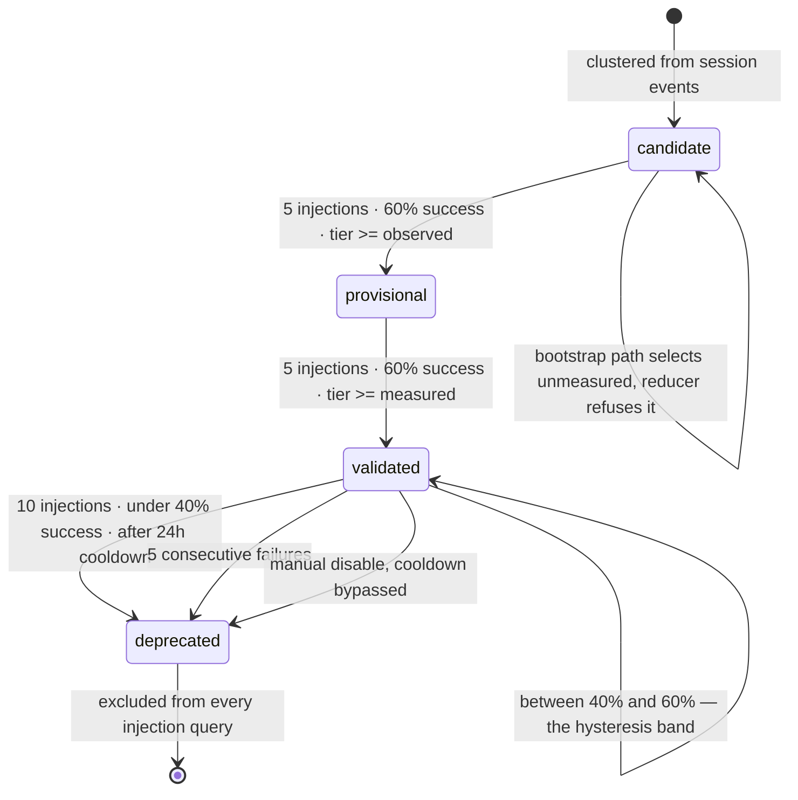

## 1. Executive Summary

OmniIntelligence is the memory half of a two-repository loop: it learns patterns from coding-session events, grades them on evidence, and serves the survivors over HTTP to [OmniClaude](../omniclaude/), which injects them into sessions and reports back what happened. Both are MIT-licensed. This repository is about 164,000 lines of Python across 1,057 source files, with a further 150,000 lines of tests, 68 ONEX node packages and 28 Postgres migrations.

It is the most thoroughly *reasoned* memory lifecycle in this atlas, and the reasoning is in the code rather than in a design document. Demotion is deliberately harder than promotion — ten injections rather than five, a failure streak of five rather than three, a 40% success floor against a 60% ceiling — and the docstring beside each constant says why, in the terms an experimentalist would use: *"The 20% gap between promotion (60%) and demotion (40%) ensures ... random variance doesn't cause flip-flopping between states."* Every transition is written to an append-only table carrying a `gate_snapshot` of the conditions that justified it. The evidence tier can only increase, and the guarantee is not a convention but the `WHERE` clause of the `UPDATE`.

Three things are broken in the way this atlas exists to find, and all three are invisible from the outside.

**The cold-start path selects exactly what the gate refuses.** `SQL_FETCH_CANDIDATE_PATTERNS` deliberately admits `evidence_tier = 'unmeasured'` rows for bootstrap promotion; `apply_transition` — which the same handler then calls — rejects any transition to `PROVISIONAL` from a tier below `OBSERVED`. The one test named "full promotion lifecycle" passes a mock in place of `apply_transition` that returns success, and asserts a promotion the real reducer would refuse.

**The top evidence tier is unreachable.** `verified` is a valid column value, is gated on, and is written by nothing: `compute_evidence_tier` returns only `OBSERVED` or `MEASURED`, and its docstring says *"VERIFIED requires independent validation (not computed here)."*

**The manual kill switch reads a stale view.** Disabling a pattern is a hard override that bypasses the cooldown — and it is read from `disabled_patterns_current`, a materialized view whose only `REFRESH` statements in the tree are inside integration tests.

The Goodhart and reward-hacking guardrails are real, pure, and tested, and nothing calls them.

**A scoping caveat about what can be read here.** The ONEX runtime, node base classes and several enums — including `EnumEvidenceTier` itself — come from `omnibase-core`, `omnibase-infra` and `omnimarket`, which `pyproject.toml` pins as git dependencies on `github.com/OmniNode-ai/…`. None of those three repositories was publicly readable at this reading, so the framework beneath the mechanism cannot be inspected at a pinned commit. Everything this report describes — the schema, the SQL, the handlers, the gates and the tests — is in this repository.

## 2. Mental Model

A memory here is a **learned pattern**: a signature clustered from session events, with a domain, keywords, a confidence float, and two independent axes of standing.

The first axis is **lifecycle status** — `candidate → provisional → validated → deprecated` — and it decides whether the pattern may be injected into a session. The second is **evidence tier** — `unmeasured → observed → measured → verified` — and it decides whether the pattern is *allowed to advance*. Status is what the pattern is; tier is what is known about it.

Tier is computed from one question: was there a measured pipeline run, and did it succeed?

```python
if run_id is None:
    computed = EnumEvidenceTier.OBSERVED          # anecdotal
elif run_result == "success":
    computed = EnumEvidenceTier.MEASURED          # quantitative
else:
    computed = EnumEvidenceTier.OBSERVED          # a run happened and didn't succeed
```

and it can only go up. The monotonicity is not a Python convention — it is the predicate of the statement that writes it:

```sql
UPDATE learned_patterns SET evidence_tier = $2, updated_at = NOW()
WHERE id = $1
  AND (CASE evidence_tier WHEN 'unmeasured' THEN 0 WHEN 'observed' THEN 10
       WHEN 'measured' THEN 20 WHEN 'verified' THEN 30 ELSE 0 END)
    < (CASE $2 WHEN 'unmeasured' THEN 0 WHEN 'observed' THEN 10
       WHEN 'measured' THEN 20 WHEN 'verified' THEN 30 ELSE 0 END)
```

A concurrent writer, a replayed Kafka message and a buggy caller all fail the same way: the statement matches no rows. The migration names one writer — *"The attribution binder is the SOLE writer of this column"* — and the guard holds even if that stops being true.

Status moves only through `apply_transition`, which the demotion handler calls the single source of truth, and which refuses `→ PROVISIONAL` below `OBSERVED` and `→ VALIDATED` below `MEASURED`. So the two axes are wired together in one direction: evidence gates status, and status never touches evidence.

What kills a pattern is asymmetric on purpose. Promotion is optimistic, demotion conservative, and between them sits a 20-point band of success rate that belongs to neither.



## 3. Architecture

An event-driven Python service. ONEX nodes — 68 package directories, each with a `contract.yaml`, handlers, models and its own `node_tests` — are dispatched from Kafka topics through a runtime plugin. Postgres is the only store this repository runs.

- **`deployment/database/migrations/`** — 28 forward migrations with paired rollbacks. `005` is `learned_patterns`, `006` disable events, `007` injections, `010` the lifecycle audit, `011` the evidence tier, `012` measured attributions, `022` project scope.
- **`src/omniintelligence/nodes/node_pattern_*`** — learning, extraction, storage, promotion, demotion, feedback, lifecycle, projection, compliance, matching, assembly.
- **`src/omniintelligence/repositories/learned_patterns.repository.yaml`** — the read SQL, declared as data rather than embedded in Python.
- **`src/omniintelligence/api/router_patterns.py`** — the FastAPI surface that serves patterns to clients.
- **`src/omniintelligence/runtime/dispatch_handler_*.py`** — the wiring from Kafka envelope to handler.

### Deployment and ergonomics

This is the heavy end of the atlas. An operator needs Postgres with 28 migrations applied, Kafka with the topics the node contracts declare, the ONEX runtime, and — for the loop to close — a separate repository running in the agent's session. It cannot run offline as a library; there is no embedded mode and no file-backed fallback.

The store is inspectable and repairable in the way a SQL store is: every state is a row, the audit is a table, and an operator who knows SQL can answer any question this report asks. That is a genuine advantage over the file-and-vector stores that dominate this corpus, and it is bought with an operational floor most single-user memory systems would not accept.

The three private git dependencies are the real adoption cost. `pyproject.toml` pins `omnibase-core` to a commit on a repository a reader cannot open, with a comment explaining that the needed version *"is only available via git"* because it is unreleased. A reader can install the published wheel; they cannot read the framework at the commit this code was written against.

## 4. Essential Implementation Paths

### Learning — `node_pattern_learning_compute`

Session events are clustered, and each cluster is scored by `handler_confidence_scoring.py`, which is explicit that a single number is not the answer:

> *"Confidence scores are DECOMPOSED, not monolithic. A single confidence value cannot answer 'why did this pattern score high?' — but component scores can."*

Three components with fixed weights — `label_agreement` 0.40, `cluster_cohesion` 0.30, `frequency_factor` 0.30 — asserted at import time to sum to 1.0, and a warning in capitals: *"NEVER make downstream decisions solely on the confidence field. The rolled-up score is for convenience only. Inspect components."*

`learned_patterns` has one column, `confidence FLOAT`. The three components appear in no migration. The advice is correct and the schema makes it impossible to follow — and the bootstrap promotion gate, described below, decides on `lp.confidence >= 0.8`.

### Promotion — `handler_auto_promote.py`, and the path that cannot work

Two phases per run: `CANDIDATE → PROVISIONAL`, then `PROVISIONAL → VALIDATED`. The candidate query admits two kinds of row:

```sql
AND (
  lp.evidence_tier IN ('observed', 'measured', 'verified')
  OR (
    lp.evidence_tier = 'unmeasured'
    AND COALESCE(lp.injection_count_rolling_20, 0) = 0
    AND lp.confidence >= 0.8
    AND lp.recurrence_count >= 1
    AND lp.distinct_days_seen >= 1
  )
)
```

The second branch is the cold-start path, and its thresholds carry the clearest record in this repository of a gate being loosened under supply pressure:

> *"Lowered from 2 to 1: existing candidate patterns were initialized with recurrence_count=1 and distinct_days_seen=1. The confidence gate (>= 0.8) is the primary quality signal for the bootstrap path; requiring recurrence >= 2 blocked all 5,384 high-confidence candidates that had never been re-observed."*

Each selected row is then passed to `apply_transition_fn` with `to_status=PROVISIONAL`. In production that function is the real `apply_transition` — `dispatch_handler_promotion_check.py` imports it directly — and it contains:

```python
if (to_status == EnumPatternLifecycleStatus.PROVISIONAL
        and current_evidence_tier < EnumEvidenceTier.OBSERVED):
    return ModelTransitionResult(success=False, …,
        reason="Evidence tier guard: insufficient evidence for PROVISIONAL", …)
```

There is no bootstrap exemption in the guard. Every row admitted by the second branch is `unmeasured`, and every `unmeasured` row is refused. The handler records `promoted=False`, logs a warning, and continues; nothing raises.

So the loosening cannot have unblocked the 5,384 candidates, because the reducer refuses them for a reason the loosened thresholds do not touch. The two halves are individually correct and disagree about what the cold-start rule is.

### Demotion — `handler_demotion.py`

The forgetting half, and the best-argued code in either repository. Three gates, any one of which fires: manual disable (a hard trigger that bypasses the cooldown), a failure streak of five, or a success rate under 40% with at least ten injections in the rolling window. Two eligibility checks precede gates two and three: the pattern must be `validated`, and 24 hours must have passed since promotion.

The override bounds are the part worth copying. An operator may tune the thresholds per request, and the permitted range is itself argued: `SUCCESS_RATE_THRESHOLD_MAX = 0.60` exists to *"prevent setting demotion threshold at or above promotion threshold (60%) which would cause immediate demotion of marginal patterns"*, and `FAILURE_STREAK_THRESHOLD_MIN = 3` prevents demoting *"on small runs of bad luck"*. The hysteresis band cannot be configured away.

The handler also refuses to run without Kafka rather than degrading, and says so: *"Without Kafka, lifecycle events cannot be emitted, and demotions will not occur. This is intentional — the reducer is the single source of truth."* A caller detects it by checking `reason == "kafka_producer_unavailable"`. Failing loudly on the *forgetting* path is the right direction for the failure to point.

### The kill switch that does not reach the reader

Manual disable is an append-only event — `pattern_disable_events`, with `event_type IN ('disabled', 're_enabled')`, a `reason TEXT NOT NULL` and an `actor VARCHAR(100) NOT NULL`. Requiring a reason and an actor on a memory override is rare here and right.

The demotion and promotion queries do not read that table. They join `disabled_patterns_current`, a **materialized view** created in migration `008`, whose own comment carries the operating instruction: *"Refresh with: REFRESH MATERIALIZED VIEW CONCURRENTLY disabled_patterns_current;"*. Searching the tree for that statement returns the comment, one line of the migration explaining the unique-index requirement, and four calls inside `tests/integration/nodes/node_pattern_promotion_effect/test_promotion_integration.py`. No scheduler, no job, no dispatch handler refreshes it.

So the strongest correction the system offers — a person naming a pattern and a reason and turning it off — takes effect when somebody remembers a maintenance command that is documented in a SQL comment. The integration tests pass because they run it themselves.

### Outcome feedback — `node_enforcement_feedback_effect`

The rule here is the one this atlas has been asking for and has not previously found stated in code. A violation only counts as negative evidence when the agent was **both** warned and observed to correct:

```python
return [v for v in violations if v.was_warned and v.was_corrected]
```

> *"If an agent was warned of a violation but did NOT correct it, we cannot confirm the violation was real. The warning might have been a false positive."*

That is a real epistemic distinction — between *the memory fired* and *the memory was right* — and most feedback loops in this corpus collapse it, treating every advisory as a labelled example and learning from their own false positives.

### Audit — `pattern_lifecycle_transitions`

Every status change writes a row: `request_id` for idempotency, `from_status`, `to_status`, `transition_trigger`, `correlation_id`, `actor`, `reason`, and a `gate_snapshot JSONB` holding the gate conditions *at transition time*. The foreign key is `ON DELETE RESTRICT` with the reason in a comment: *"Audit records must never be silently deleted when parent patterns are removed."*

An audit that stores the evidence a decision was made on, rather than only the decision, is the version of this pattern worth having.

### The guardrails nothing calls

`node_anti_gaming_guardrails_compute` implements four defences as pure functions with 452 lines of tests: Goodhart detection over correlated metric pairs, reward-hacking detection when a score improves without matching human acceptance, distributional-shift detection by symmetric KL approximation, and a diversity constraint that is a veto. Its contract declares an operation and no topics. Outside its own package, `run_all_guardrails` appears nowhere in the repository.

The project records this itself. `docs/reference/NODE_INVENTORY.md` marks seven nodes *"(unregistered)"*, including this node's companion alerter and `node_objective_ab_framework_compute`. A published list of what is not wired is a better artifact than most projects offer, and it is the reason this finding is a citation rather than an accusation.

## 5. Memory Data Model

`learned_patterns` carries identity (`pattern_signature`, `signature_hash`, `is_current`, `version`), a domain foreign key with `domain_candidates JSONB`, `keywords TEXT[]`, `confidence FLOAT CHECK (confidence >= 0.5)`, the lifecycle columns, provenance (`source_session_ids UUID[]`, `recurrence_count`, `first_seen_at`, `last_seen_at`, `distinct_days_seen`), and rolling metrics over a window of 20.

The constraints are unusually load-bearing. Every rolling counter is bounded to `[0, 20]`, and:

```sql
CONSTRAINT check_rolling_metrics_sum
    CHECK (success_count_rolling_20 + failure_count_rolling_20 <= injection_count_rolling_20)
```

An arithmetic invariant of the metrics that drive promotion, enforced by the database rather than by whoever writes next.

What is absent:

- **No bi-temporal axis.** `first_seen_at` and `last_seen_at` are observation times of the pattern, not validity times of a claim, and nothing separates when a pattern was true from when the row learned it.
- **No rejected-value tombstone.** `deprecated` is keyed on the pattern row. The clustering path that produced the signature will produce it again from new sessions, as a new `candidate`, and nothing consults the deprecation.
- **No confidence components**, as above.
- **`project_scope` is a column nothing can pass.** Migration `022` adds it with two indexes, and `learned_patterns.repository.yaml` applies it: `AND ($6::text IS NULL OR project_scope IS NULL OR project_scope = $6::text)`. The FastAPI endpoint that serves patterns declares `domain`, `language`, `min_confidence`, `limit` and `offset` — and no project parameter — so `$6` is never bound on the network read path, and every project is served every project's patterns.

## 6. Retrieval Mechanics

Retrieval is SQL. `list_validated_patterns` filters on `status IN ('validated', 'provisional')`, `is_current = TRUE`, a confidence floor, an optional domain, an optional keyword against `keywords`, and the unreachable project predicate. Ordering puts `validated` before `provisional`, then confidence descending, then id — a stable order, which matters when the consumer takes a prefix.

There is no vector search, no embedding, no reranker and no query rewriting in this repository's read path for patterns. For a store of a few thousand short signatures selected by domain and confidence, that is a defensible choice rather than a missing feature, and it is the reason the retrieval stack reads as `lexical` alone.

The failure mode is over-supply at the client. The endpoint caps `limit` at 200, and [OmniClaude](../omniclaude/) requests ten times its injection budget precisely because its own filters *"each of which can eliminate the majority of candidates"* run after the fetch. The filtering that decides what an agent sees happens on the far side of an HTTP boundary from the store that knows the evidence.

## 7. Write Mechanics

Patterns are born from clustering over session events, dispatched through Kafka. Outcomes arrive separately: injections are recorded by the client, run attributions by the binder, violations by the enforcement path. `pattern_measured_attributions` is the evidence table, with a constraint tying tier to the presence of a run:

```sql
CHECK ((run_id IS NULL AND evidence_tier = 'observed')
    OR (run_id IS NOT NULL AND evidence_tier IN ('measured', 'verified')))
```

Attribution inserts are idempotent against Kafka redelivery by `INSERT … WHERE NOT EXISTS` — chosen over `ON CONFLICT` because the unique indexes are partial, with the reasoning written beside it.

### Operational cost

- **Nothing on the agent's turn blocks on this repository's writes.** Learning, attribution and lifecycle work are all consumers of events; the agent's session has moved on.
- **The lag from a session to an injectable pattern is unbounded by anything in the tree** — it is clustering cadence, plus a promotion check, plus a demotion sweep, plus the tier the attribution binder can reach. Nothing measures it.
- **The rolling window is 20 and the counters are capped at 20**, so a pattern's standing is always computed over its last twenty injections rather than its history. That is a decay policy expressed as a bound, and a cheap one.
- **No background pass rewrites the store.** Promotion and demotion touch one row each, and the audit only grows.

## 8. Agent Integration

`GET /api/v1/patterns` and Kafka topics. The model never talks to this repository; the client does, and the model sees the result as text in its context. There are no MCP tools and no agent-callable write path — an agent cannot save a memory here, which is a deliberate shape: what becomes a pattern is decided by clustering over what agents *did*, not by an agent deciding something is worth remembering.

Adapting this to another host means reimplementing the client, which is most of [OmniClaude](../omniclaude/)'s injection module, against an endpoint that is stable and small.

## 9. Reliability, Safety, and Trust

Strengths:

- **Monotonicity enforced in the statement**, not by the writer's discipline.
- **Asymmetric promotion and demotion with a hysteresis band**, argued in the constants themselves and bounded against operator override.
- **An audit that records the gate conditions**, not only the outcome, and a foreign key that refuses to lose it.
- **Confirmed-only negative feedback** — warned *and* corrected — so the loop does not learn from its own unconfirmed advisories.
- **Arithmetic invariants in the schema**, including the one that keeps the promotion metrics coherent.
- **Idempotency against redelivery** on both the attribution insert and the transition, with the choice of mechanism explained.
- **Failing closed on the forgetting path** when Kafka is absent, rather than silently not demoting.
- **A published list of unregistered nodes**, which is how the guardrail finding below is checkable at all.

Gaps:

- **The bootstrap promotion path is refused by the reducer it calls.**
- **`verified` is unreachable**, so a four-tier ladder is a three-tier ladder with a gate nothing can satisfy.
- **The manual kill switch is behind an unrefreshed materialized view.**
- **The anti-gaming guardrails are not wired to anything.**
- **`project_scope` cannot be passed by the API that serves the injector.**
- **Confidence components are computed, warned about, and not persisted.**
- **A deprecated pattern's signature can be relearned** as a new candidate from new sessions.
- **The framework is private.** Three git dependencies on repositories a reader cannot open.

## 10. Tests, Evals, and Benchmarks

**I ran nothing.** The screen found no auto-executing surfaces and a `uv.lock` untouched for 16 days — so this tree was outside the cooldown and could have been installed — but the default posture for this atlas is reading, and the findings above are all static. 29 `conftest.py` files execute at pytest collection.

Roughly 150,000 lines of tests, with per-node suites under `node_tests/` alongside shared `tests/unit`, `tests/integration` and `tests/integration/e2e`.

The **negative retrieval assertion** is `tests/unit/repositories/test_contract_lifecycle_filter.py`, and it is an unusual shape. Rather than asserting about a result set, it loads the repository contract and greps the SQL of every injection query for a status it must not permit:

> *"DEPRECATED patterns have been demoted and should no longer be used. They MUST NOT be injected."*

with a companion asserting the same for `candidate`. Because it asserts over the *query text*, it covers every caller of those operations at once, which an example-based test cannot. It is also a regex over SQL, so a differently-phrased predicate — a negated filter, a status passed as a parameter — would satisfy it without meaning the same thing. Both halves are worth knowing.

`tests/unit/enums/test_enum_injection.py` is the other test worth naming: it asserts in both directions that the Python enum and the database `CHECK` constraint contain the same values, so the two cannot drift.

What is missing is the measurement the design implies. The evidence tiers, the hysteresis band and the rolling windows are an argument that this loop improves outcomes, and no committed result evaluates it; the A/B framework node that would is documented as unregistered, and the guardrails that would watch for the metrics being gamed are not called. The most valuable missing test is narrower and would have caught the headline finding: run the bootstrap path through the real `apply_transition` and assert what happens.

**No paper, arXiv reference or citation file exists in this repository.**

## 11. For Your Own Build

### Steal

- **Put monotonicity in the `WHERE` clause.** A tier, a version or a state that must only advance should be guarded by the statement that writes it, so a concurrent writer and a redelivered message fail identically and silently-correctly.
- **Make demotion harder than promotion, and write down the band.** More observations, a longer streak, a lower floor, and a cooldown after promotion. The 20-point gap between 60% and 40% is a design parameter that deserves a name and a comment.
- **Bound the operator's override.** If thresholds are tunable, refuse a demotion threshold at or above the promotion threshold. A knob that can erase a hysteresis band will.
- **Snapshot the gates into the audit row.** "Why was this promoted" is answerable from the audit only if the audit holds the conditions, not just the verdict.
- **Count a violation only when it was surfaced and then corrected.** An advisory the agent ignored is not evidence the advisory was right, and a loop that treats it as one trains on its own false positives.
- **Require a reason and an actor on a manual override**, as a `NOT NULL` column rather than a convention.
- **Assert enum-versus-constraint parity in both directions.** It is ten lines and it catches the drift that produces a runtime constraint violation months later.
- **Enforce metric arithmetic in the schema** — successes plus failures cannot exceed injections — so the numbers that drive promotion cannot go incoherent.
- **Publish which of your components are unregistered.**

### Avoid

- **A selection query and an enforcement gate with different rules.** If one layer chooses rows and another refuses them, the system reports zero and nobody looks; put the gate where the selection happens, or make the selection call the gate.
- **Mocking the component under test in the test named for the whole flow.** An integration test that replaces the gate with a stub returning success asserts only that the caller is wired, and reads as though it asserts the behaviour.
- **A state at the top of a ladder that nothing writes.** Either something reaches `verified` or the ladder has three rungs; a permanently empty top tier makes every gate that mentions it unsatisfiable and every reader assume it is reachable.
- **A kill switch behind a manual refresh.** Any correction a human can make must reach the read path without a second, undocumented human action.
- **Decomposing a score and persisting only the roll-up.** The warning not to decide on the composite is unfollowable if the components are gone by the time anyone can decide.
- **A scope column the serving API cannot accept.** Storing a boundary that no caller can pass is the same as not having one, and it reads like having one.

### Fit

This suits a team, not a person: a platform group running Kafka and Postgres who want memory to be an auditable process with a lifecycle, and who will staff the operations that lifecycle implies. The design assumes a maintainer who thinks in gates, evidence and windows, and it rewards that — the argued constants and the gate snapshots are worth more than most of the retrieval sophistication elsewhere in this corpus.

Walk away if you want memory as a library. There is no embedded mode, the framework beneath it is three private repositories, and the smallest useful deployment is a message bus plus a database plus a second service inside the agent.

The uncomfortable judgement is about the gap between the design and its wiring. Four of the mechanisms this report praises — the bootstrap path, the top evidence tier, the kill switch, the guardrails — are specified more completely than they are connected, and each was found by following one call rather than by reading a diagram. A reader borrowing from here should borrow the *reasoning*, which is excellent and portable, and verify the wiring in their own tree rather than assuming it.

## 12. Open Questions

- Has the bootstrap path ever promoted a pattern in production, and what did the 5,384 candidates do after the thresholds were lowered?
- What is intended to write `verified` — an independent validator, a human, a second pipeline — and does the design want the tier gated on something that does not exist yet?
- Is `disabled_patterns_current` refreshed by infrastructure outside this repository, such as a cron in a deployment chart not in the tree?
- What consumes the anti-gaming guardrails in the intended design, and what topic would carry their alerts?
- How long is the median path from a session event to an injectable validated pattern?
- Is the private `omnibase-core` intended to become readable, given that the enums it exports are load-bearing for the mechanism this repository publishes as open source?

## Appendix: File Index

- Schema and constraints: `deployment/database/migrations/005_create_learned_patterns.sql`, `006_create_pattern_disable_events.sql`, `007_create_pattern_injections.sql`, `008_create_disabled_patterns_current_view.sql`, `010_create_pattern_lifecycle_audit.sql`, `011_add_evidence_tier_to_learned_patterns.sql`, `012_create_pattern_measured_attributions.sql`, `022_add_project_scope_to_learned_patterns.sql`.
- Evidence tier and attribution: `src/omniintelligence/nodes/node_pattern_feedback_effect/handlers/handler_attribution_binder.py`.
- Lifecycle gates: `src/omniintelligence/nodes/node_pattern_lifecycle_effect/handlers/handler_transition.py`.
- Promotion: `src/omniintelligence/nodes/node_pattern_promotion_effect/handlers/handler_auto_promote.py`; wiring in `src/omniintelligence/runtime/dispatch_handler_promotion_check.py`.
- Demotion: `src/omniintelligence/nodes/node_pattern_demotion_effect/handlers/handler_demotion.py`.
- Confidence decomposition: `src/omniintelligence/nodes/node_pattern_learning_compute/handlers/handler_confidence_scoring.py`.
- Confirmed-only feedback: `src/omniintelligence/nodes/node_enforcement_feedback_effect/handlers/handler_enforcement_feedback.py`.
- Guardrails: `src/omniintelligence/nodes/node_anti_gaming_guardrails_compute/handlers/handler_guardrails.py`.
- Read SQL and API: `src/omniintelligence/repositories/learned_patterns.repository.yaml`, `src/omniintelligence/api/router_patterns.py`.
- Tests cited: `tests/unit/repositories/test_contract_lifecycle_filter.py`, `tests/unit/enums/test_enum_injection.py`, `tests/integration/test_promotion_lifecycle_integration.py`, `tests/integration/nodes/node_pattern_promotion_effect/test_promotion_integration.py`.
- Self-documented wiring: `docs/reference/NODE_INVENTORY.md`.

## History

**2026-08-11** — [`8c67665add2b611307a78a3f351e0fac18c5bad8`](https://github.com/OmniNode-ai/omniintelligence/commit/8c67665add2b611307a78a3f351e0fac18c5bad8) — first reading, on the `dev` default branch. Screened before reading: 0 auto-run surfaces, 29 build-time exec surfaces (all `conftest.py`), 0 unpinned manifests, and a `uv.lock` unchanged for 16 days; nothing was installed and nothing was executed. The three `omnibase-*`/`omnimarket` git dependencies were not readable at this reading, so no claim here rests on them.
