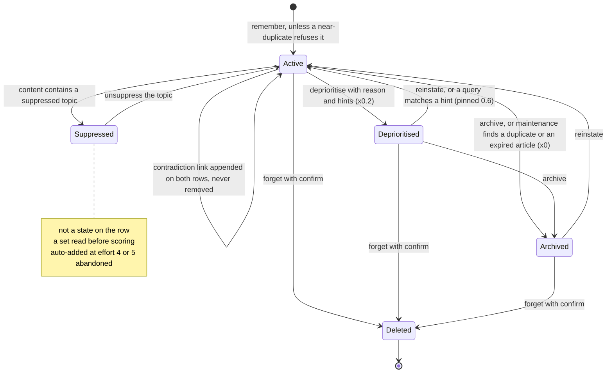

## 1. Executive Summary

OmniMem is a **self-hosted MCP memory server for coding agents**, MIT, 262
commits since 9 March 2026 at release v6.4.2: 14,919 lines of Python across
an MCP server, a web UI and an RSS worker, under 16,621 lines of tests in 62
files with 1,284 test functions. It runs as four containers — Valkey with
valkey-search, a FastMCP server, a Starlette dashboard and a feed ingester —
with embeddings computed locally by sentence-transformers and the Anthropic
API used only for the optional extras. Development happens on Codeberg; the
GitHub repository this report pins is a mirror, and the committed
`OMNIMEM_BUILD_PROMPT.md` is the prompt the project says it was built from,
*"Hand this file to Claude Code and run it from an empty project directory."*

The idea the README leads with is the graveyard. An episodic memory can
carry `effort_score`, `outcome` and a JSON list of `abandoned_approaches` —
name, type, reason — and every `recall` begins, before embedding anything,
with a keyword scan of that list against the query
(`memory/recall.py:166-183`, `:573-598`). A hit is returned first, at score
1.0, as *"Abandoned approach: onnxruntime — SIGILL crash on Alpine musl
libc"*. Effort amplifies successes and never failures:
`compute_experience_weight` gives a battle-hardened success ×1.8 and an
abandoned outcome ×0.1 regardless of effort (`:77-84`). And an approach
abandoned at effort 4 or 5 is automatically suppressed as a topic
(`tools/experience.py:97-108`), after which any memory whose content
mentions it is dropped from every recall until a person lifts the
suppression.

**That suppression is a tombstone in the read-path form, and this report
credits it.** `topics:suppressed` is a Valkey set; `recall` fetches it once
per call and discards any candidate whose content contains a member
(`recall.py:192`, `:216-221`). A re-remembered claim about a suppressed
approach is stored and never surfaces — the shape [Provem](../provem/) earns
the mark with. The key is the approach's name, written by an agent, a person
or the effort rule, and the caveats are the key's breadth and the record's
location: a substring match hides everything that mentions the word,
including the memory that recorded why the approach died, and the reason
lives on that memory's graveyard entry, not on the suppression.

**Memory here is visibility, not belief.** The lifecycle is
`active → deprioritised → archived → deleted` with a `surface_score` per
state — 1.0, 0.2, 0.0, gone — multiplied into the score
(`memory/lifecycle.py:22-34`). Archived rows are excluded in the search
filter itself (`recall.py:26`) and again in Python; a deprioritised row
carries a reason and `reinstate_hints`, and a query matching a hint pins the
row to 0.6 with a flag so the agent can ask whether to bring it back
(`:278-284`). What no state records is whether a memory is *true*.
Contradictions are detected — a negation-pattern heuristic over
semantically similar rows at write time, an optional Claude Haiku pass on
demand — and recorded as links appended to both rows
(`memory/contradiction.py:199-241`). Nothing removes a link. The briefing
warns on every active memory that carries one (`tools/briefing.py:63-74`);
the web UI's resolution is to archive one side, and the survivor keeps the
link and the warning. That is why `trust_state` is withheld: the states
answer *may this surface*, the links answer *these disagree*, and no field
answers *which one is right*.

**Two things the lifecycle drops on the floor.** `MemoryLifecycle.transition`
takes a `reason` for every transition and stores it only when the new state
is `deprioritised` (`lifecycle.py:141-142`); the maintenance pass archives
the older members of a duplicate cluster with the reason *"auto-maintenance:
duplicate of `<key>`"* (`memory/maintenance.py:117-121`) and the string goes to
the log and nowhere else. And `remember(force=True)`, documented as the way
to keep two versions past the duplicate check, also skips the contradiction
check and the fact-extraction queue (`tools/core.py:123`, `:131`, `:150`),
which the docstring calls *"raw bypass write"* and the 6.4.1 changelog found
had silently hollowed out its own test.

**The skill compiler is the most careful writer in the tree.** A skill is
compiled from a domain's lessons — breakthroughs become *do* rules, gotchas
*watch* rules, graveyard entries *don't* rules — with no model in the loop,
clustered by embedding and gated on reinforcement across distinct source
memories. `propose` renders the body, diffs it against the stored skill and
stashes the draft under a TTL with the sha of the body it was diffed against;
`write` commits only that stash and refuses when the stored body has moved
(`memory/skill_compiler.py:293-311`, `:347-365`). The web UI runs the same
function. It is the one write path in the system where a person's acceptance
is structurally required rather than requested.

## 2. Mental Model

A memory is a hash with a state, a score multiplier, and the record of what
it cost. It enters `active` through `remember`, which first asks two
questions of its nearest neighbours: is one of them the same claim (cosine
≥ 0.92 — refuse, return the existing key), and does one of them say the
opposite (cosine ≥ 0.7 and a negation pair such as *avoid*/*use* — store,
and return a warning). It leaves the active state by a person's or an agent's
verb — deprioritise with a reason, archive, forget with confirmation — or by
the maintenance pass, which archives duplicates and expired articles. It
returns from deprioritised when a query matches a hint someone left, and
from archived only by an explicit reinstate.

Around that loop sits the experience layer. `record_experience` writes
effort, outcome, iterations, abandoned approaches, a breakthrough and
gotchas onto an episodic row; the weight it computes multiplies every later
recall; the abandoned names feed the fast-path warning and, at high effort,
the suppression set. The skill compiler reads the same fields and turns
recurring lessons into a document an agent can load.

The self-loop is the finding. A contradiction changes nothing about either
row's state or score; it is a warning that persists until a person archives
one side, and outlives that on the other.

## 3. Architecture

**Four containers, one memory package.** `mcp_server/` holds the engine
(`memory/`) and the tools; `web_ui/` imports the same package and talks to
the same Valkey; `rss_worker/` writes knowledge articles on a schedule. The
README's claim that there is *"one engine and two front doors"* holds in the
imports: the dashboard's lifecycle, duplicate, contradiction and skill routes
call `memory.lifecycle`, `memory.dedup` and `memory.skill_compiler` directly.

**Valkey as the only store.** Every memory is a hash; every namespace has one
HNSW cosine index over the 384-dimension vector plus its tag and numeric
fields (`memory/store.py:74-177`). `_VALID_KEY_PREFIXES` (`:19-23`) refuses a
write to any key outside the memory, topic, log, meta, query-expansion and
queue prefixes; `_NAMESPACE_RETURN_FIELDS` (`:37-72`) is a per-namespace
whitelist of what a search returns, and the comment above it records the bug
that shape produced — a field missing from the tuple made project-filtered
recall drop every knowledge result *"without a trace (issue #20)"*. A startup
migration drops and recreates any index whose field count fell behind the
definition (`:242-262`), and `reindex` rebuilds one whose document count
drifted from the key count after deletes the search module did not observe.

**The search filter is pushed down, with the quirks written next to it.**
`recall.py:23-34` records two properties of valkey-search verified live:
in-brace alternation matches nothing, so the state filter is a clause-level
OR; and tag values must be interpolated raw, so a project name is pushed into
the query only when it passes the tools' character allowlist. A filtered
search that errors degrades to an unfiltered one and the Python loop
re-filters, which is why every filter exists twice.

**Models.** Embeddings are `all-MiniLM-L6-v2` on CPU, chosen so the stack
runs on a Raspberry Pi. Claude Haiku is optional and used in four places:
fact extraction at ingest, RSS summaries, query expansion, and the tier-2
contradiction check. Every one of them fails open — no key, no extraction,
raw storage.

### Deployment and ergonomics

A `curl | bash` installer generates passwords, writes `.env`, binds the MCP
port to localhost unless asked otherwise, and starts the four containers
from Docker Hub images. Remote use goes through a reverse proxy with OAuth
2.1 for claude.ai and a login page on the dashboard. Backups are one MCP call
to a JSON dump; restore merges by `updated_at`, newer wins
(`store.py:693-762`). The operational surface is real — a `/metrics`
endpoint, telemetry pages, a health tool — and the cost is a Valkey with the
search module as a hard dependency: there is no file mode and no SQLite.

## 4. Essential Implementation Paths

- **Store and indexes:** `mcp_server/memory/store.py` — prefixes (`:19-23`),
  return whitelist (`:37-72`), `INDEX_DEFINITIONS` (`:74-177`), `upsert`
  (`:286-294`), `search` with the filter fallback (`:296-372`),
  `restore_all` (`:693-762`).
- **Recall:** `mcp_server/memory/recall.py` — `_STATE_FILTER` (`:26`),
  `_build_filter_expr` (`:50-60`), `compute_experience_weight` (`:77-84`),
  the pipeline (`:137-385`): fast path (`:166-183`), suppression (`:216-221`),
  the score (`:256-260`), reinstate pin (`:278-284`), fact-to-source collapse
  (`:353-377`), the recall log (`:600-626`).
- **Lifecycle:** `mcp_server/memory/lifecycle.py` — transitions and surface
  scores (`:22-34`), `transition` (`:119-179`), suppression (`:181-210`),
  reinstate hints (`:212-251`), `bulk_transition_project` (`:40-107`).
- **Write:** `mcp_server/tools/core.py` — `remember` (`:91-190`),
  `remember_document` (`:193-301`), `forget` (`:617-658`), topic tools
  (`:661-696`); `memory/dedup.py` — `check_duplicate` (`:28-80`),
  `find_all_duplicates` (`:83-226`).
- **Contradiction:** `mcp_server/memory/contradiction.py` — patterns
  (`:24-42`), heuristic (`:69-129`), API tier (`:132-196`), `link_contradiction`
  (`:199-241`); `tools/contradiction.py:27-168`.
- **Experience:** `mcp_server/tools/experience.py` — `record_experience`
  (`:29-120`), `log_abandoned` (`:123-177`), `warn_if_abandoned` (`:336-352`).
- **Maintenance:** `mcp_server/memory/maintenance.py` — knowledge expiry
  (`:27-67`), `run_maintenance` (`:70-216`); triggered from
  `tools/briefing.py:213-235`.
- **Enrichment:** `mcp_server/memory/enrichment.py` — the queue worker and
  `_enrich` (`:93-200`); `memory/extraction.py` — the prompt (`:24-41`) and
  `extract_facts` (`:91-139`).
- **Temporal:** `mcp_server/memory/temporal.py` — `parse_query_date`
  (`:47-81`), `temporal_boost` (`:84-103`).
- **Skills:** `mcp_server/memory/skill_compiler.py` — `compile_skill_flow`
  (`:133-179`), `_propose` (`:182-335`), `_commit_proposal` (`:338-416`);
  `memory/skills.py` — lessons, clustering, rendering.
- **Audit tools:** `mcp_server/tools/audit.py` — `memory_audit` (`:24-128`),
  `why_did_you_mention` (`:131-195`), `explain_memory` (`:198-250`).
- **Review surface:** `web_ui/routes/contradictions.py`, `duplicates.py`,
  `lifecycle.py`, `suppressions.py`, `skills.py`.

## 5. Memory Data Model

Five namespaces share one shape and differ in fields. Every row carries
`content` (50,000 characters at most), `state`, `surface_score`,
`created_at`, `updated_at`, `tags`, `recall_count`, `last_recalled` and the
binary `vector`. Episodic rows add `project`, `effort_score`, `outcome`,
`iterations`, `experience_weight`, `abandoned_approaches`, `breakthrough`,
`gotchas`, `deprioritised_reason`, `reinstate_hints`, `contradictions`,
`event_date`, and `blessed` for skill eligibility. Knowledge rows add
`source_url`, `feed_name`, `published_at`, `topics`, `expires_at`,
`skill_domains` and `skill_rules`; extracted facts add `enriched_from` and
`source_doc_id`. Preference rows add `scope`. Project rows are keyed by name.
Skills are whole documents with a `body`, a rule manifest and a source
manifest, indexed on their discovery text only.

**Record time and event time, with a boost between them.** `created_at` is
when the row was written; `event_date` is when the thing happened, set by
the extractor when a fact names a date and inherited down a fallback chain —
the fact's own date, else the source memory's, else the source's ingest time
(`enrichment.py:179-189`), the chain the issue-20 tests pin after temporal
recall *"fell from 53.4% to 7.5%"* when extraction stripped the anchor. A
query that mentions a date is parsed and every candidate with an
`event_date` within seven days is multiplied by 1.5, falling to 1.0 at sixty
(`temporal.py:32-37`, `:84-103`). That is an event axis used for ranking, not
a validity interval and not an as-of read, which is why `bitemporal` is
withheld with the axis named.

**What is recorded about a removal.** A deprioritised row keeps its reason
and hints. An archived row keeps nothing about why. A deleted row is gone,
with its graveyard entries and its contradiction links; the suppression set
that its abandonment may have written survives it, and the recall log
(`log:recall:*`, 30-day TTL) still names the key.

## 6. Retrieval Mechanics

`recall` runs one pipeline (`recall.py:137-385`). Before the query is
embedded, `warn_if_abandoned` scans a cached parse of every episodic row's
graveyard for a name contained in the query or containing it, and any hit
becomes a result of type `abandoned_warning` at score 1.0, so it sorts first.
Then the query is embedded once and each requested namespace is searched
with a KNN of at least twenty candidates — fifty under a project filter, so
the Python re-filter has something left — and the state and project
predicates in the query. Per candidate: archived and deleted are dropped;
any content containing a suppressed topic is dropped; the project is
re-checked; and the score is `similarity × surface_score × recency ×
experience_weight × temporal`, where recency is 1.0 for ninety days and then
loses 0.05 per month to a floor of 0.3. A deprioritised row whose reinstate
hints match the query is pinned to 0.6 and flagged. Optional query expansion
asks Haiku for variants and unions the results by key.

Two collapses follow. Results are deduplicated by `(key, result_type)`,
keyed so that a graveyard warning never collapses into the memory carrying
it. Then an extracted fact whose verbatim source also matched is dropped and
its score handed to the source (`:353-377`): *"facts supplement, they don't
compete."* The top *k* are returned, the recall is logged with its result
keys and scores, and each returned row's `recall_count` and `last_recalled`
are bumped in the same pipeline — so recall is observability here, feeding
telemetry and the *gone cold* view, and does not enter the score.

`why_did_you_mention` (`tools/audit.py:131-195`) closes the loop from the
other side: it searches the last fifty recall logs by keyword, then by
embedding, and returns the query and result keys that surfaced a topic.

## 7. Write Mechanics

**`remember` is synchronous, refuses duplicates and warns on
contradictions.** It embeds the content, asks the namespace's index for the
five nearest live rows in the same project and returns `duplicate_found`
with the existing key if one is within cosine 0.92 (`core.py:131-145`); then
asks for the ten nearest and returns a `contradiction_warning` beside the new
key if one within 0.7 contains the opposite half of a negation pair
(`:150-160`, `contradiction.py:24-42`). The row is written in one `HSET`
with its vector and is searchable immediately. In `full` mode a job is then
queued for a background thread that asks Haiku for atomic facts and writes
each as its own row in the knowledge or preference namespace at
`surface_score` 0.5, linked back by `enriched_from`, after its own duplicate
check (`enrichment.py:142-193`). `force=True` skips the duplicate check, the
contradiction check and the queue.

**The negation heuristic is cheap and broad.** Seventeen pairs — *don't*/*do*,
*never*/*always*, *avoid*/*use*, *without*/*with*, *remove*/*add*, *failed*/
*succeeded* — fire when one text has the negative and the other the positive.
Gating on similarity is what keeps it usable, and the 3.12.1 fix the tool
comment cites is exactly that: without the 0.5 floor the scan *"flagged AND
cross-linked"* unrelated memories that shared *use* or *with*. The API tier
is a single Haiku call asked for JSON; a failed call returns *not a
contradiction* with confidence 0.0, which the tool then treats as a reason
to skip the pair.

**Links are written and never unwritten.** `link_contradiction` appends
`{key, explanation, detected_at}` to both rows' `contradictions` field,
deduplicated by key. No tool, route or maintenance step removes an entry:
`rg -n '"contradictions"' mcp_server web_ui` finds readers and this one
writer. The briefing lists every active memory with a non-empty list as a
warning, without checking whether the other side is still active, and the
contradictions page offers to archive either side.

**Maintenance archives without a record.** Every tenth `briefing` for a
project (`AUTO_MAINTENANCE_INTERVAL`) runs `run_maintenance`: duplicate
clusters over the stored vectors, the older members archived; a
negation-pattern scan over up to 200 active rows, results reported but not
linked; and RSS articles past `expires_at` archived. The archive transition
accepts a reason and stores none, so a row archived as a duplicate is
indistinguishable afterwards from one archived by hand.

**Deletion asks first.** `forget` resolves a key or a query — the query path
takes the top three recalls above 0.85 — and returns a preview unless
`confirm=True`; on confirm the key is removed and the graveyard cache
invalidated (`core.py:617-658`). `delete_project` scans every namespace and
deletes in pipelined batches after a preview.

**Skills are written through a gate.** Section 1 describes it; the detail
worth adding is `bless`, which marks a single memory skill-eligible past the
reinforcement threshold, and `promote_knowledge`, which makes an RSS article
a reference rule and clears its expiry — both are vetting acts a person or
agent performs so the compiler, which never calls a model, has something to
compile.

## 8. Agent Integration

Forty-four MCP tools, registered in `server.py:170-260`, over Streamable HTTP
or SSE with bearer or OAuth 2.1 authentication. The server delivers a
199-line instruction block on connect (`instructions.py`), mirrored as a
`CLAUDE.md`, and it is unusually prescriptive: call `briefing` first, ask the
human which side of a contradiction is current *"before proceeding with any
work"*, call `warn_if_abandoned` before suggesting *or agreeing to* any
library — *"Do not skip this check because the human suggested the
approach"* — and *"store memories proactively"*. The tool set follows the
lifecycle: `remember`, `recall`, `recall_index` with `recall_detail` for a
two-step token-saving read, `deprioritise`, `archive`, `reinstate`, `retag`,
`forget`; project context tools including `compile_project_context`;
experience tools; suppression tools; `check_contradictions`; `briefing`;
the four skill tools; backup and restore; `queue_status` for the enrichment
backlog; and the audit trio.

The agent's authority is broad. It can write to four namespaces, transition
any row through every state, delete with a confirmation flag it sets itself,
suppress topics, and bless memories. What it cannot do is write a skill
without a stashed proposal, and the instruction block asks it not to accept
one silently. The web UI is where a person does the same things with buttons
and a login.

## 9. Reliability, Safety, and Trust

**`tombstone` — earned, in the read-path form, and the caveats are the
key.** The record is a set of strings; the consultation is on every recall;
the producer is a person, an agent or the effort rule. What it is keyed on is
a substring of content rather than a normalised value, so *"docker"* hides
every memory about Docker, and what it records is the name alone — the
reason stays on the episodic row that logged the abandonment, which the
suppression hides from recall like anything else that mentions the word.

**`scope_enforced` — earned.** `project` is a tag pushed into the vector
search for episodic, preference and knowledge rows and re-checked in Python
for all four; the project namespace is never pushed down because a row
written mid-session may carry only `project` until the startup migration
backfills `project_name`. A project name with a character outside the
allowlist is filtered in Python only.

**`human_review` — earned.** The contradictions page is an adjudication
surface with two verbs, the duplicates page a review of what maintenance
will archive, every row has lifecycle actions, and the skill gate makes
acceptance structural. The near-miss inside the mark: the only resolution
the contradictions page offers is *archive one side*, and the link on the
other side stays.

**`negative_eval` — earned.** Exclusion cases for archived, deleted and
suppressed material, each with a positive control in the same suite, and a
no-false-positive case for the graveyard warning. Two of the recall tests
are guarded by `if candidates:` and `if results:` and pass on an empty
result, which the 6.4.1 changelog's own audit of vacuous tests did not
reach.

**`trust_state` — withheld.** `state` is a visibility lifecycle with a
stored reason and a filter behind it — the functional half of the mark —
and no state on the row says a memory is believed, unverified or wrong.
Contradiction links are the nearest thing to an epistemic record and they
are symmetric, unresolved and never cleared.

**`bitemporal` — withheld.** `event_date` beside `created_at` is a real event
axis, extracted and inherited with care, and it is used as a ranking boost
within a window; there is no interval and no as-of read.

**`audit_log` — withheld.** `log:recall:*` records reads for thirty days and
`why_did_you_mention` reads it back, which is a rarer thing than a mutation
log and not one. Mutations bump `updated_at` and write to the process log;
the archive reason is discarded; nothing in the store says who or what
transitioned a row.

Other observations:

- **The duplicate check refuses; the contradiction check warns.** A
  near-duplicate is not stored and the caller gets the existing key. A
  contradiction is stored with a warning. That asymmetry is defensible — a
  contradiction may be the correction — and it means the store holds both
  sides until a person acts.
- **Fail-open is the pattern for every model call**, and the contradiction
  tool's tier-2 path inherits a specific consequence: an API failure
  returns *not a contradiction*, and the tool skips the pair as cleared.
- **Restore merges by `updated_at`**, so a backup cannot overwrite a newer
  row; it also cannot delete, so a row forgotten after the backup returns.
- **Keys are prefix-guarded** on write and on restore, and the search
  filter rejects a handful of characters and otherwise trusts the allowlist
  that project names and tags already pass.
- **The instruction block is the largest trust mechanism in the system**,
  and it is prose: whether the agent checks the graveyard before agreeing
  with a person is a sentence, not a gate.

## 10. Tests, Evals, and Benchmarks

Sixty-two test files, 1,284 test functions, 16,621 lines, run against
in-memory fakes of Valkey and the embedder (`tests/conftest.py`,
`test_fakes.py`) with the Anthropic client faked, so the suite needs no
service. The README's coverage badge and the 6.4.1 changelog claim 99.9% line
coverage; what can be read here is what the tests assert. The lifecycle
table is asserted transition by transition, including that archived cannot
deprioritise and deleted is terminal. The recall suite asserts the ordering
effects of every multiplier, the exclusions in section 9, the reinstate pin,
the graveyard fast path, and the counters. The contradiction suite asserts
each negation pair, symmetry, deduplication of links and the archived
exclusion. The issue-20 suite pins the fact-routing, the `event_date`
fallback chain and the fact-to-source collapse. The web routes are driven
through the real Starlette app.

The changelog for 6.4.1 records the project auditing its own suite and
finding tests that *"were passing while asserting nothing"* — a
`remember()` contradiction test that called with `force=True` and so skipped
the check, and three scan tests whose wording matched no negation pattern —
and fixing them. Two guarded assertions remain in `test_recall.py`
(`:182-193`, `:232-248`): the reinstate-candidate case asserts the 0.6 pin
only `if candidates`, and the warnings-first case only `if results` and
`if warnings`.

No benchmark and no evaluation against a corpus. The project's one
performance claim is qualitative — a Raspberry Pi runs it — and the one
retrieval-quality number in the tree is the issue-20 note that temporal
recall fell from 53.4% to 7.5% before the fallback chain, which names a
measurement without committing it.

## 11. For Your Own Build

### Steal

- **A graveyard checked by keyword before the embedding.** The cheapest
  possible check, run on every recall, surfaced first. A dead end costs one
  substring comparison to remember.
- **Effort amplifies wins and never losses.** A ×1.8 for a battle-hardened
  success and a flat ×0.1 for anything abandoned, whatever it cost, keeps
  expensive failures from ranking like expensive successes.
- **Auto-suppress what cost the most to abandon.** The rule that turns an
  effort-4 abandonment into a topic suppression is the one place the system
  acts on its own record without being asked, and it is the right place.
- **Refuse the duplicate, warn on the contradiction.** Two different answers
  to *this looks like something we have*, because only one of them might be
  a correction.
- **Commit only the draft that was reviewed.** A proposal stashed with the
  sha of what it was diffed against, and a write that refuses when the base
  moved, is a gate a model cannot talk its way through.
- **Keep a recall log and a tool that reads it.** *Why did you mention that*
  is the question a person asks first when a memory system surprises them.
- **Push the filter into the index and keep the Python check.** The comment
  says why: the filtered search can fall back to unfiltered.

### Avoid

- **Links that nothing clears.** A contradiction recorded on both rows with
  no resolution verb becomes a permanent warning; give the adjudication a
  place to land.
- **A transition that accepts a reason and drops it.** If the archive path
  takes a reason, store it; the maintenance pass is writing one nobody will
  ever read.
- **A suppression keyed on a substring.** It is the right mechanism with the
  wrong key; normalise the value, or scope it to the approach field the
  graveyard already has.
- **One flag that turns off three checks.** `force` should skip the
  duplicate check it is documented for and nothing else.
- **A model-call failure that reads as a negative verdict.** A tier-2 check
  that cannot run should say so, not clear the pair.

### Fit

This suits a developer who wants one memory across Claude Code, Cursor,
Copilot and the rest, on their own hardware, with a dashboard they can act
in and a graveyard that speaks up. The lifecycle vocabulary — deprioritise
with hints rather than delete — matches how people actually change their
minds about advice, and the skill compiler is a serious answer to *how does
this become policy*.

It is a single-user system with project scoping and no tenancy, it needs
Valkey with the search module, and its trust story ends at *these two
disagree*. A team that needs a memory to say what it believes, or an audit of
who changed what, will find the fields to add and the places to add them; a
team that wants an agent's dead ends to stay dead can run it as it is.

## 12. Open Questions

- **How is a contradiction meant to be resolved?** The instruction block
  asks the agent to ask the human which side is current; the store has no
  verb for the answer, and the page's two buttons archive a side without
  clearing the survivor's link.
- **How many memories does a suppression hide?** A substring over content is
  measured nowhere; a suppression of a common word could hide most of a
  project.
- **What does the tier-2 contradiction check contribute?** It runs only on
  demand and only on pairs the heuristic already flagged; no committed run
  shows what it confirms or rejects.
- **Where is the coverage receipt?** The badge and changelog claim 99.9%;
  the number is not in the tree.
- **Does the GitHub mirror lag Codeberg?** Development is stated to happen
  elsewhere; the pinned commit is the mirror's head.

## Appendix: File Index

**Engine**
- `mcp_server/memory/store.py` — Valkey client, prefixes, return whitelist,
  index definitions, search with fallback, dump and restore
- `mcp_server/memory/recall.py` — the pipeline, the graveyard fast path, the
  recall log
- `mcp_server/memory/lifecycle.py` — states, transitions, suppression,
  reinstate hints, bulk project transitions
- `mcp_server/memory/contradiction.py`, `dedup.py`, `maintenance.py`
- `mcp_server/memory/enrichment.py`, `extraction.py`, `chunking.py`,
  `query_expansion.py`, `temporal.py`, `tags.py`, `migrations.py`
- `mcp_server/memory/skills.py`, `skill_compiler.py`, `skill_scan.py`,
  `skill_transfer.py`

**Tools and server**
- `mcp_server/server.py` — registration (`:170-260`), auth, startup
  migrations, the enrichment worker
- `mcp_server/tools/core.py`, `project.py`, `experience.py`,
  `contradiction.py`, `briefing.py`, `knowledge.py`, `skills.py`, `audit.py`,
  `backup.py`, `queue.py`
- `mcp_server/instructions.py`, `claude_config/CLAUDE.md` — the on-connect
  guide, read here as data

**Web UI and worker**
- `web_ui/routes/` — `contradictions.py`, `duplicates.py`, `lifecycle.py`,
  `suppressions.py`, `skills.py`, `memories.py`, `detail.py`, `backups.py`,
  `telemetry.py`, `metrics.py`
- `rss_worker/ingester.py`, `summariser.py`, `worker.py`

**Documentation**
- `docs/memory-types.md`, `memory-episodic.md`, `memory-knowledge.md`,
  `memory-preference.md`, `memory-project.md`, `memory-skill.md`,
  `features.md`, `architecture.md`, `skill-compiler.md`, `mcp-tools.md`
- `CHANGELOG.md`, `OMNIMEM_BUILD_PROMPT.md`

**Tests**
- `mcp_server/tests/` — 62 files; `test_recall.py`, `test_lifecycle.py`,
  `test_contradiction.py`, `test_contradiction_tool.py`, `test_dedup.py`,
  `test_issue20_temporal.py`, `test_temporal.py`, `test_audit.py`,
  `test_skills.py`, `test_web_*.py`

**Searches that ground the absence claims above** (run at the pinned commit):
- `rg -n '"contradictions"' mcp_server web_ui --glob '!**/tests/**'` — one
  writer, `memory/contradiction.py:237`, and readers only; no removal.
- `rg -n 'deprioritised_reason|archive_reason|archived_reason'
  mcp_server/memory/lifecycle.py` — the reason is stored at `:103` and `:142`,
  both under the deprioritised branch only.
- `rg -n 'verified|believed|epistemic|truth' mcp_server/memory/` — no field.
- `rg -n 'as_of|valid_from|valid_until' mcp_server/` — empty; `event_date`
  is read only by `temporal_boost`.
- `grep -c 'mcp.tool()(' mcp_server/server.py` — 44.
- `rg -n -i 'arxiv|bibtex|doi\.org' README.md docs/` — no paper.
- `git ls-files | rg -i 'bench|eval'` — no benchmark or evaluation artifact.

## History

**2026-09-05** — [`50fde316a1fcdd53a75a66d982b7bdee987ba364`](https://github.com/richarvey/OmniMem/commit/50fde316a1fcdd53a75a66d982b7bdee987ba364) — first reading, at the merge of the v6.4.x branch on the GitHub mirror. Screened first: no auto-run surface, one build-time execution path (a pytest `conftest.py`), three unpinned requirement files, nothing inside the seven-day cooldown, and a `CLAUDE.md` addressed to a reading agent, treated as data. Nothing was installed or run; the tests were read, not executed. Four marks — `tombstone` in the read-path form on topic suppression, `scope_enforced`, `human_review`, `negative_eval` — with `trust_state` withheld on a lifecycle that records visibility and never belief, `bitemporal` on an event axis used as a boost, and `audit_log` on a recall log that records reads. The findings recorded are the contradiction link that nothing clears, the archive reason that nothing stores, and the one flag that disables three checks.
